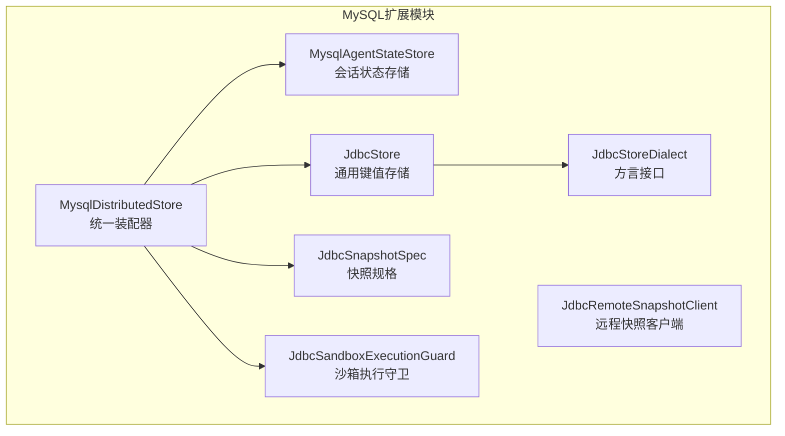
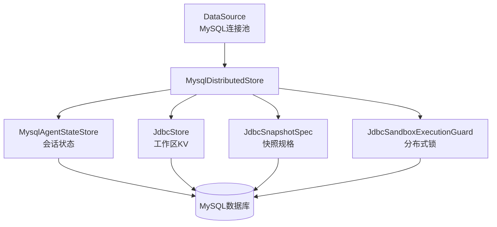
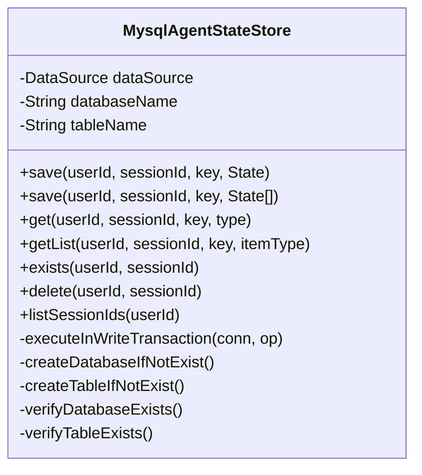
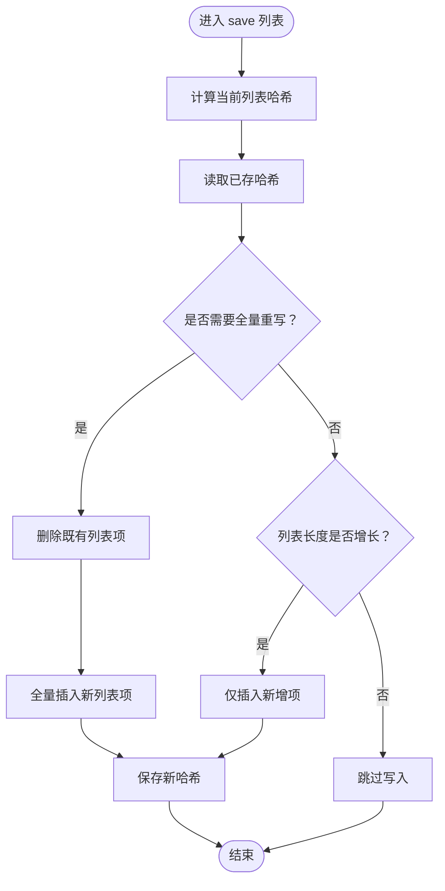
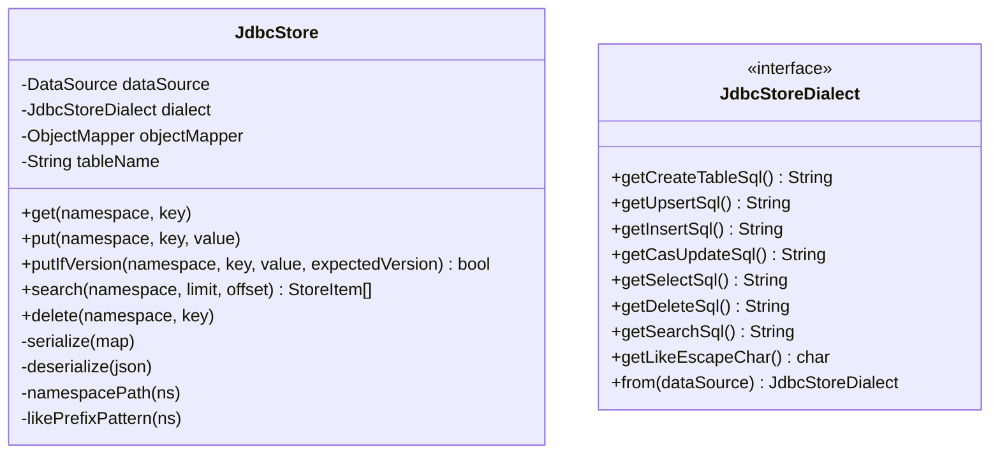
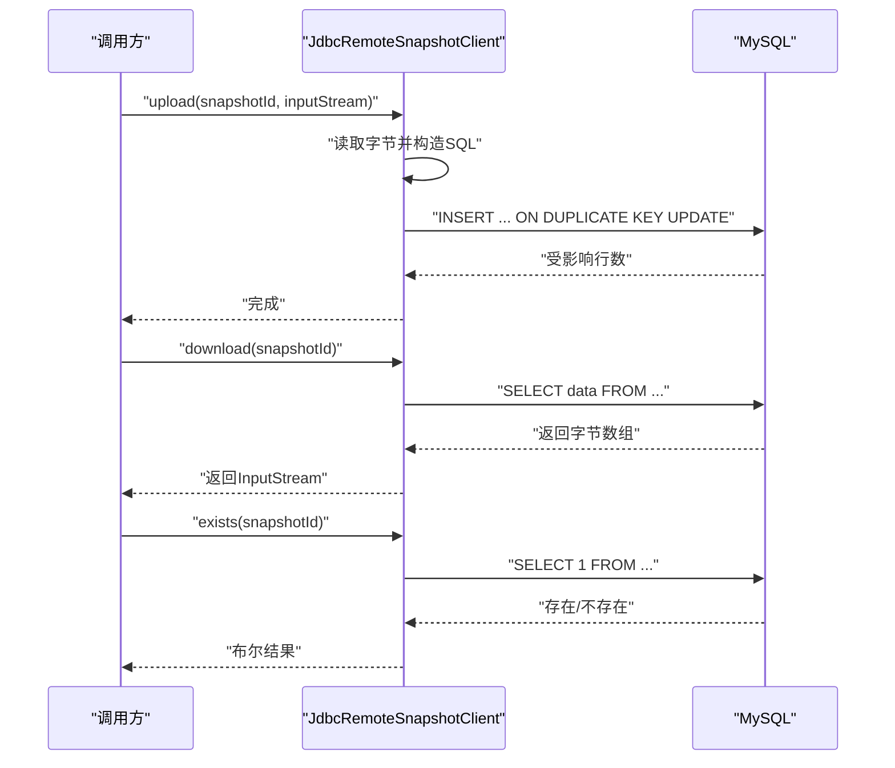
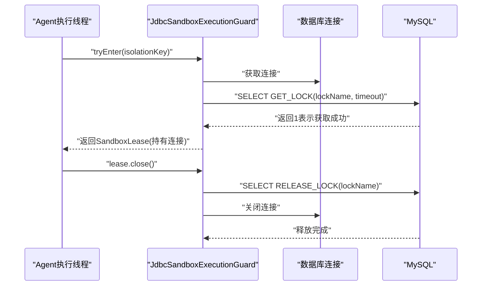
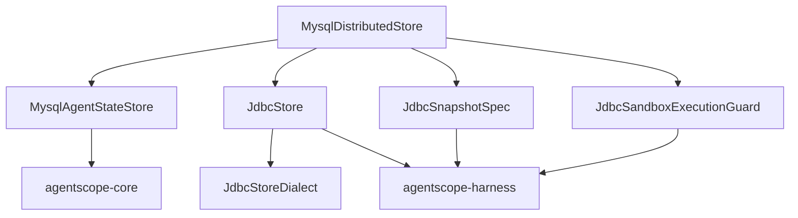

# MySQL数据库存储

<cite>
**本文档引用的文件**
- [MysqlDistributedStore.java](file://agentscope-extensions/agentscope-extensions-mysql/src/main/java/io/agentscope/extensions/mysql/MysqlDistributedStore.java)
- [MysqlAgentStateStore.java](file://agentscope-extensions/agentscope-extensions-mysql/src/main/java/io/agentscope/extensions/mysql/state/MysqlAgentStateStore.java)
- [JdbcStore.java](file://agentscope-extensions/agentscope-extensions-mysql/src/main/java/io/agentscope/extensions/mysql/store/JdbcStore.java)
- [JdbcStoreDialect.java](file://agentscope-extensions/agentscope-extensions-mysql/src/main/java/io/agentscope/extensions/mysql/store/JdbcStoreDialect.java)
- [JdbcSandboxExecutionGuard.java](file://agentscope-extensions/agentscope-extensions-mysql/src/main/java/io/agentscope/extensions/mysql/sandbox/JdbcSandboxExecutionGuard.java)
- [JdbcRemoteSnapshotClient.java](file://agentscope-extensions/agentscope-extensions-mysql/src/main/java/io/agentscope/extensions/mysql/snapshot/JdbcRemoteSnapshotClient.java)
- [JdbcSnapshotSpec.java](file://agentscope-extensions/agentscope-extensions-mysql/src/main/java/io/agentscope/extensions/mysql/snapshot/JdbcSnapshotSpec.java)
- [pom.xml](file://agentscope-extensions/agentscope-extensions-mysql/pom.xml)
</cite>

## 目录
1. [简介](#简介)
2. [项目结构](#项目结构)
3. [核心组件](#核心组件)
4. [架构总览](#架构总览)
5. [详细组件分析](#详细组件分析)
6. [依赖关系分析](#依赖关系分析)
7. [性能考虑](#性能考虑)
8. [故障排查指南](#故障排查指南)
9. [结论](#结论)
10. [附录](#附录)

## 简介
本文件面向AgentScope Java的MySQL数据库存储模块，聚焦以下关键能力与实现细节：
- MysqlDistributedStore：统一装配MySQL/JDBC后端的分布式存储，包括会话状态、工作区KV存储、沙箱快照与分布式锁。
- MysqlAgentStateStore：基于MySQL的Agent会话状态持久化，支持单值与列表状态的增量写入、哈希变更检测与事务保障。
- JdbcStore：通用JDBC键值存储，支持MySQL/PostgreSQL/SQLite/H2方言，提供CAS（Compare-And-Set）与前缀搜索。
- JdbcRemoteSnapshotClient：基于BLOB列的远程沙箱快照存取，支持上传、下载与存在性检查。
- JdbcSandboxExecutionGuard：基于MySQL命名锁的数据库级并发控制与隔离，确保跨JVM的互斥执行。

同时，本文提供MySQL主从复制、读写分离与高可用部署建议，以及SQL优化、索引设计、连接池配置的最佳实践，并给出备份恢复、性能监控与故障排查指南。

## 项目结构
MySQL扩展模块位于agentscope-extensions-mysql，核心包组织如下：
- state：会话状态存储实现（MysqlAgentStateStore）
- store：通用JDBC键值存储（JdbcStore）及方言接口（JdbcStoreDialect）
- snapshot：远程快照客户端与规格（JdbcRemoteSnapshotClient、JdbcSnapshotSpec）
- sandbox：沙箱执行守卫（JdbcSandboxExecutionGuard）
- MysqlDistributedStore：统一分布式存储装配器

**图表来源**
- [MysqlDistributedStore.java:54-91](file://agentscope-extensions/agentscope-extensions-mysql/src/main/java/io/agentscope/extensions/mysql/MysqlDistributedStore.java#L54-L91)
- [MysqlAgentStateStore.java:68-867](file://agentscope-extensions/agentscope-extensions-mysql/src/main/java/io/agentscope/extensions/mysql/state/MysqlAgentStateStore.java#L68-L867)
- [JdbcStore.java:74-419](file://agentscope-extensions/agentscope-extensions-mysql/src/main/java/io/agentscope/extensions/mysql/store/JdbcStore.java#L74-L419)
- [JdbcStoreDialect.java:50-181](file://agentscope-extensions/agentscope-extensions-mysql/src/main/java/io/agentscope/extensions/mysql/store/JdbcStoreDialect.java#L50-L181)
- [JdbcRemoteSnapshotClient.java:39-123](file://agentscope-extensions/agentscope-extensions-mysql/src/main/java/io/agentscope/extensions/mysql/snapshot/JdbcRemoteSnapshotClient.java#L39-L123)
- [JdbcSnapshotSpec.java:27-36](file://agentscope-extensions/agentscope-extensions-mysql/src/main/java/io/agentscope/extensions/mysql/snapshot/JdbcSnapshotSpec.java#L27-L36)
- [JdbcSandboxExecutionGuard.java:45-177](file://agentscope-extensions/agentscope-extensions-mysql/src/main/java/io/agentscope/extensions/mysql/sandbox/JdbcSandboxExecutionGuard.java#L45-L177)

**章节来源**
- [MysqlDistributedStore.java:30-91](file://agentscope-extensions/agentscope-extensions-mysql/src/main/java/io/agentscope/extensions/mysql/MysqlDistributedStore.java#L30-L91)
- [pom.xml:29-53](file://agentscope-extensions/agentscope-extensions-mysql/pom.xml#L29-L53)

## 核心组件
本节概述各核心组件职责与关键特性：
- MysqlDistributedStore：通过DataSource装配AgentStateStore、BaseStore、SandboxSnapshotSpec与SandboxExecutionGuard，提供“一键式”MySQL分布式配置。
- MysqlAgentStateStore：在MySQL中以表存储Agent会话状态，支持单值与列表状态；列表状态采用哈希检测与增量写入，避免读改写开销。
- JdbcStore：通用键值存储，支持多数据库方言；提供CAS（版本号）与前缀搜索，满足工作区KV存储需求。
- JdbcRemoteSnapshotClient：将沙箱工作区打包为tar并以BLOB形式存储，支持上传、下载与存在性检查。
- JdbcSandboxExecutionGuard：使用MySQL GET_LOCK()/RELEASE_LOCK()实现命名锁，确保跨进程/线程的互斥执行。

**章节来源**
- [MysqlDistributedStore.java:30-91](file://agentscope-extensions/agentscope-extensions-mysql/src/main/java/io/agentscope/extensions/mysql/MysqlDistributedStore.java#L30-L91)
- [MysqlAgentStateStore.java:34-67](file://agentscope-extensions/agentscope-extensions-mysql/src/main/java/io/agentscope/extensions/mysql/state/MysqlAgentStateStore.java#L34-L67)
- [JdbcStore.java:38-74](file://agentscope-extensions/agentscope-extensions-mysql/src/main/java/io/agentscope/extensions/mysql/store/JdbcStore.java#L38-L74)
- [JdbcRemoteSnapshotClient.java:31-38](file://agentscope-extensions/agentscope-extensions-mysql/src/main/java/io/agentscope/extensions/mysql/snapshot/JdbcRemoteSnapshotClient.java#L31-L38)
- [JdbcSandboxExecutionGuard.java:31-44](file://agentscope-extensions/agentscope-extensions-mysql/src/main/java/io/agentscope/extensions/mysql/sandbox/JdbcSandboxExecutionGuard.java#L31-L44)

## 架构总览
下图展示MysqlDistributedStore如何装配各组件，并与Harness Agent框架集成：

**图表来源**
- [MysqlDistributedStore.java:72-90](file://agentscope-extensions/agentscope-extensions-mysql/src/main/java/io/agentscope/extensions/mysql/MysqlDistributedStore.java#L72-L90)
- [MysqlAgentStateStore.java:286-323](file://agentscope-extensions/agentscope-extensions-mysql/src/main/java/io/agentscope/extensions/mysql/state/MysqlAgentStateStore.java#L286-L323)
- [JdbcStore.java:103-133](file://agentscope-extensions/agentscope-extensions-mysql/src/main/java/io/agentscope/extensions/mysql/store/JdbcStore.java#L103-L133)
- [JdbcSnapshotSpec.java:27-36](file://agentscope-extensions/agentscope-extensions-mysql/src/main/java/io/agentscope/extensions/mysql/snapshot/JdbcSnapshotSpec.java#L27-L36)
- [JdbcSandboxExecutionGuard.java:55-59](file://agentscope-extensions/agentscope-extensions-mysql/src/main/java/io/agentscope/extensions/mysql/sandbox/JdbcSandboxExecutionGuard.java#L55-L59)

## 详细组件分析

### MysqlDistributedStore：统一装配器
- 职责：接收DataSource，返回AgentStateStore、BaseStore、SandboxSnapshotSpec与SandboxExecutionGuard实例。
- 特性：集中配置，简化调用方接入成本；可按需启用自动建表与初始化。

**章节来源**
- [MysqlDistributedStore.java:54-91](file://agentscope-extensions/agentscope-extensions-mysql/src/main/java/io/agentscope/extensions/mysql/MysqlDistributedStore.java#L54-L91)

### MysqlAgentStateStore：会话状态持久化
- 数据模型：agentscope_sessions表，主键(session_id, state_key, item_index)，支持单值与列表状态。
- 列表状态优化：通过哈希检测与增量插入，避免全量重写；当列表收缩或内容变化时触发全量重写。
- 事务保障：每个写操作在独立连接上显式开启事务，确保原子性与一致性。
- 安全性：参数化查询防注入；标识符校验与反引号转义；自动建库建表或存在性校验。
- 时间戳：created_at/updated_at自动维护。

**图表来源**
- [MysqlAgentStateStore.java:68-867](file://agentscope-extensions/agentscope-extensions-mysql/src/main/java/io/agentscope/extensions/mysql/state/MysqlAgentStateStore.java#L68-L867)

**章节来源**
- [MysqlAgentStateStore.java:45-67](file://agentscope-extensions/agentscope-extensions-mysql/src/main/java/io/agentscope/extensions/mysql/state/MysqlAgentStateStore.java#L45-L67)
- [MysqlAgentStateStore.java:286-323](file://agentscope-extensions/agentscope-extensions-mysql/src/main/java/io/agentscope/extensions/mysql/state/MysqlAgentStateStore.java#L286-L323)
- [MysqlAgentStateStore.java:358-411](file://agentscope-extensions/agentscope-extensions-mysql/src/main/java/io/agentscope/extensions/mysql/state/MysqlAgentStateStore.java#L358-L411)

#### 列表状态保存流程（增量写入与全量重写决策）

**图表来源**
- [MysqlAgentStateStore.java:375-411](file://agentscope-extensions/agentscope-extensions-mysql/src/main/java/io/agentscope/extensions/mysql/state/MysqlAgentStateStore.java#L375-L411)
- [MysqlAgentStateStore.java:394-406](file://agentscope-extensions/agentscope-extensions-mysql/src/main/java/io/agentscope/extensions/mysql/state/MysqlAgentStateStore.java#L394-L406)

### JdbcStore：通用JDBC键值存储
- 方言适配：根据DataSource探测数据库类型，自动选择MySQL/PostgreSQL/SQLite/H2方言。
- 模型设计：namespace_path（带尾部分隔符的命名空间）、item_key、value_json、version、updated_at。
- 前缀搜索：LIKE模式匹配，支持LIMIT/OFFSET分页；使用ESC字符避免转义问题。
- CAS语义：putIfVersion支持create-if-absent（expectedVersion==0）与conditional update两种路径，均原子执行。
- 序列化：Jackson ObjectMapper序列化Map<String,Object>。

**图表来源**
- [JdbcStore.java:74-419](file://agentscope-extensions/agentscope-extensions-mysql/src/main/java/io/agentscope/extensions/mysql/store/JdbcStore.java#L74-L419)
- [JdbcStoreDialect.java:50-181](file://agentscope-extensions/agentscope-extensions-mysql/src/main/java/io/agentscope/extensions/mysql/store/JdbcStoreDialect.java#L50-L181)

**章节来源**
- [JdbcStore.java:38-74](file://agentscope-extensions/agentscope-extensions-mysql/src/main/java/io/agentscope/extensions/mysql/store/JdbcStore.java#L38-L74)
- [JdbcStore.java:177-219](file://agentscope-extensions/agentscope-extensions-mysql/src/main/java/io/agentscope/extensions/mysql/store/JdbcStore.java#L177-L219)
- [JdbcStore.java:221-246](file://agentscope-extensions/agentscope-extensions-mysql/src/main/java/io/agentscope/extensions/mysql/store/JdbcStore.java#L221-L246)
- [JdbcStoreDialect.java:154-179](file://agentscope-extensions/agentscope-extensions-mysql/src/main/java/io/agentscope/extensions/mysql/store/JdbcStoreDialect.java#L154-L179)

### JdbcRemoteSnapshotClient：远程快照管理
- 表结构：snapshot_id（VARCHAR主键）、data（LONGBLOB）、created_at（时间戳）。
- 功能：上传（ON DUPLICATE KEY UPDATE）、下载（字节数组流）、存在性检查。
- 初始化：可选自动建表。

**图表来源**
- [JdbcRemoteSnapshotClient.java:78-121](file://agentscope-extensions/agentscope-extensions-mysql/src/main/java/io/agentscope/extensions/mysql/snapshot/JdbcRemoteSnapshotClient.java#L78-L121)

**章节来源**
- [JdbcRemoteSnapshotClient.java:31-38](file://agentscope-extensions/agentscope-extensions-mysql/src/main/java/io/agentscope/extensions/mysql/snapshot/JdbcRemoteSnapshotClient.java#L31-L38)
- [JdbcRemoteSnapshotClient.java:78-121](file://agentscope-extensions/agentscope-extensions-mysql/src/main/java/io/agentscope/extensions/mysql/snapshot/JdbcRemoteSnapshotClient.java#L78-L121)

### JdbcSandboxExecutionGuard：数据库级并发控制
- 锁机制：基于MySQL GET_LOCK()/RELEASE_LOCK()实现命名锁，锁名由keyPrefix + scope:value组合生成，必要时进行哈希截断。
- 生命周期：获取成功返回SandboxLease，lease关闭时自动释放锁并关闭连接。
- 超时控制：支持自定义锁等待超时（秒），默认较长时限以适应长时间运行任务。
- 注意事项：MySQL命名锁为服务器级作用域，需使用唯一keyPrefix避免与其他应用冲突。

**图表来源**
- [JdbcSandboxExecutionGuard.java:65-97](file://agentscope-extensions/agentscope-extensions-mysql/src/main/java/io/agentscope/extensions/mysql/sandbox/JdbcSandboxExecutionGuard.java#L65-L97)
- [JdbcSandboxExecutionGuard.java:109-141](file://agentscope-extensions/agentscope-extensions-mysql/src/main/java/io/agentscope/extensions/mysql/sandbox/JdbcSandboxExecutionGuard.java#L109-L141)

**章节来源**
- [JdbcSandboxExecutionGuard.java:31-44](file://agentscope-extensions/agentscope-extensions-mysql/src/main/java/io/agentscope/extensions/mysql/sandbox/JdbcSandboxExecutionGuard.java#L31-L44)
- [JdbcSandboxExecutionGuard.java:65-97](file://agentscope-extensions/agentscope-extensions-mysql/src/main/java/io/agentscope/extensions/mysql/sandbox/JdbcSandboxExecutionGuard.java#L65-L97)
- [JdbcSandboxExecutionGuard.java:143-175](file://agentscope-extensions/agentscope-extensions-mysql/src/main/java/io/agentscope/extensions/mysql/sandbox/JdbcSandboxExecutionGuard.java#L143-L175)

## 依赖关系分析
- 组件耦合：MysqlDistributedStore聚合多个子组件；JdbcStore依赖JdbcStoreDialect进行SQL方言渲染。
- 外部依赖：agentscope-core与agentscope-harness提供接口契约；可选sqlite-jdbc用于本地测试场景。

**图表来源**
- [MysqlDistributedStore.java:18-27](file://agentscope-extensions/agentscope-extensions-mysql/src/main/java/io/agentscope/extensions/mysql/MysqlDistributedStore.java#L18-L27)
- [JdbcStore.java:18-36](file://agentscope-extensions/agentscope-extensions-mysql/src/main/java/io/agentscope/extensions/mysql/store/JdbcStore.java#L18-L36)
- [pom.xml:33-52](file://agentscope-extensions/agentscope-extensions-mysql/pom.xml#L33-L52)

**章节来源**
- [pom.xml:33-52](file://agentscope-extensions/agentscope-extensions-mysql/pom.xml#L33-L52)

## 性能考虑
- 连接池配置（HikariCP/Druid等）建议：
  - 最小空闲连接：根据峰值并发请求估算，避免频繁创建销毁。
  - 最大连接数：不超过数据库最大连接限制，预留系统级资源。
  - 连接超时：合理设置连接获取超时与空闲回收时间。
  - 自动提交：避免全局autoCommit=false导致的隐式事务开销。
- SQL优化：
  - 会话状态表：主键(session_id, state_key, item_index)已覆盖常见查询；如需高频按用户检索，可考虑增加复合索引或分区。
  - 工作区KV表：namespace_path + item_key为主键，前缀搜索使用LIKE ESCAPE；对高并发搜索场景可评估增加覆盖索引。
  - 快照表：snapshot_id为主键；若存在大量并发上传，建议关注ON DUPLICATE KEY UPDATE的热点写入。
- 索引设计原则：
  - 高选择性列优先；避免冗余索引。
  - 对于前缀匹配查询，注意LIKE模式的转义与索引效果。
  - 分区与分表：针对超大数据集，结合业务维度进行分区或分表。
- 缓存策略：
  - 对热点状态与快照可引入应用层缓存（需注意与数据库一致性的权衡）。
- 并发控制：
  - 使用JdbcSandboxExecutionGuard的命名锁避免跨JVM竞争。
  - 列表状态的增量写入减少锁持有时间与写放大。

## 故障排查指南
- 连接与事务问题：
  - 现象：写入失败、事务回滚异常。
  - 排查：确认DataSource配置、连接池健康状态；检查executeInWriteTransaction中的回滚抑制链路。
- 权限与建表：
  - 现象：自动建表失败或TRUNCATE权限不足。
  - 排查：确保具备CREATE DATABASE/CREATE TABLE/DROP权限；或通过迁移工具预先建表。
- 锁冲突：
  - 现象：GET_LOCK超时或阻塞。
  - 排查：检查keyPrefix是否唯一；调整lockTimeout；避免长事务占用连接。
- 字符集与标识符：
  - 现象：表名/库名含特殊字符导致SQL异常。
  - 排查：遵循标识符校验规则；使用反引号转义。
- 快照I/O：
  - 现象：上传/下载内存溢出或超时。
  - 排查：确认BLOB大小限制与网络稳定性；考虑分块传输或外部对象存储。

**章节来源**
- [MysqlAgentStateStore.java:293-323](file://agentscope-extensions/agentscope-extensions-mysql/src/main/java/io/agentscope/extensions/mysql/state/MysqlAgentStateStore.java#L293-L323)
- [MysqlAgentStateStore.java:778-800](file://agentscope-extensions/agentscope-extensions-mysql/src/main/java/io/agentscope/extensions/mysql/state/MysqlAgentStateStore.java#L778-L800)
- [JdbcSandboxExecutionGuard.java:65-97](file://agentscope-extensions/agentscope-extensions-mysql/src/main/java/io/agentscope/extensions/mysql/sandbox/JdbcSandboxExecutionGuard.java#L65-L97)
- [JdbcRemoteSnapshotClient.java:78-121](file://agentscope-extensions/agentscope-extensions-mysql/src/main/java/io/agentscope/extensions/mysql/snapshot/JdbcRemoteSnapshotClient.java#L78-L121)

## 结论
AgentScope Java的MySQL存储模块通过MysqlDistributedStore实现了“即插即用”的分布式能力，结合MysqlAgentStateStore的事务与增量写入、JdbcStore的多方言CAS与前缀搜索、JdbcRemoteSnapshotClient的BLOB快照管理，以及JdbcSandboxExecutionGuard的数据库级并发控制，形成了完整的一致性与可用性保障。配合合理的连接池与SQL优化策略，可在生产环境中稳定支撑高并发与大规模数据场景。

## 附录

### MySQL主从复制、读写分离与高可用部署建议
- 主从复制：
  - 建议使用半同步复制提升一致性；开启二进制日志并配置稳定的binlog格式。
  - 读库延迟监控与告警，避免脏读。
- 读写分离：
  - 写库：MysqlDistributedStore、MysqlAgentStateStore、JdbcStore、JdbcRemoteSnapshotClient均写库。
  - 读库：可对MysqlAgentStateStore的查询路径（如exists/listSessionIds/get/getList）进行只读路由。
- 高可用：
  - VIP/Proxy（如ProxySQL/MaxScale）实现自动切换与负载均衡。
  - 事务一致性：跨库事务建议通过应用层协调或消息队列最终一致。

### SQL优化与索引设计要点
- 会话状态表：
  - 主键已覆盖典型查询；如需按用户快速检索，可评估增加(user_id, session_id)或(session_id)索引。
- 工作区KV表：
  - namespace_path前缀搜索使用LIKE ESCAPE；可考虑对常用前缀建立覆盖索引。
- 快照表：
  - 主键(snapshot_id)；上传路径使用ON DUPLICATE KEY UPDATE，注意热点写入的锁竞争。

### 连接池配置最佳实践
- HikariCP/Druid：
  - 最大连接数：不超过数据库最大连接上限。
  - 连接超时：合理设置获取超时与空闲回收。
  - 自动提交：避免全局autoCommit=false。
  - 连接泄漏检测：开启健康检查与连接泄漏检测。

### 数据备份与恢复
- 备份策略：
  - 全量+增量备份；定期校验备份完整性。
  - 快照表数据可单独归档至对象存储，降低数据库压力。
- 恢复演练：
  - 定期进行RTO/RPO演练；验证恢复时间与数据一致性。

### 性能监控与告警
- 关键指标：
  - 连接池利用率、活跃连接数、事务提交/回滚速率。
  - 查询延迟分布、慢查询数量、锁等待时间。
  - BLOB写入吞吐与I/O延迟。
- 告警阈值：
  - 连接池耗尽、事务回滚率上升、慢查询占比超阈值、锁等待超时。