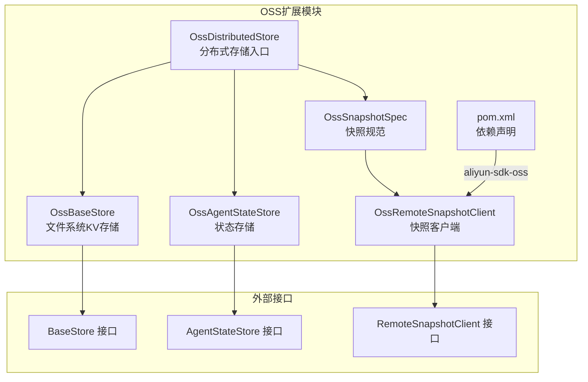
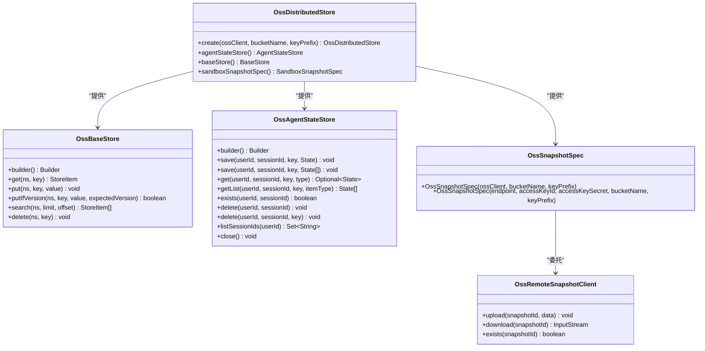
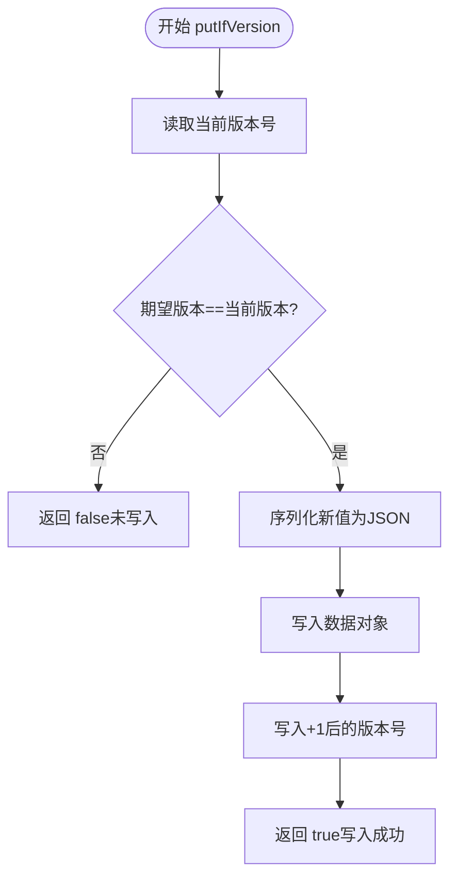
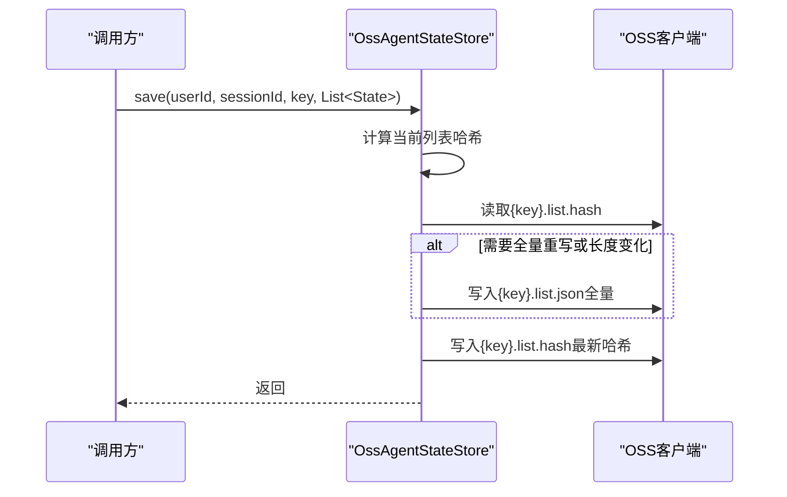
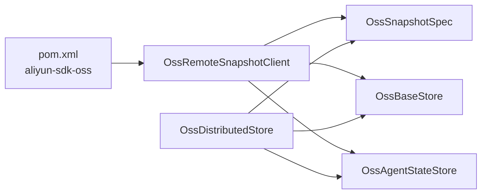

# OSS对象存储

<cite>
**本文引用的文件**
- [OssDistributedStore.java](file://agentscope-extensions/agentscope-extensions-oss/src/main/java/io/agentscope/extensions/oss/OssDistributedStore.java)
- [OssBaseStore.java](file://agentscope-extensions/agentscope-extensions-oss/src/main/java/io/agentscope/extensions/oss/OssBaseStore.java)
- [OssAgentStateStore.java](file://agentscope-extensions/agentscope-extensions-oss/src/main/java/io/agentscope/extensions/oss/OssAgentStateStore.java)
- [OssRemoteSnapshotClient.java](file://agentscope-extensions/agentscope-extensions-oss/src/main/java/io/agentscope/extensions/oss/OssRemoteSnapshotClient.java)
- [OssSnapshotSpec.java](file://agentscope-extensions/agentscope-extensions-oss/src/main/java/io/agentscope/extensions/oss/OssSnapshotSpec.java)
- [BaseStore.java](file://agentscope-harness/src/main/java/io/agentscope/harness/agent/filesystem/remote/store/BaseStore.java)
- [AgentStateStore.java](file://agentscope-core/src/main/java/io/agentscope/core/state/AgentStateStore.java)
- [RemoteSnapshotClient.java](file://agentscope-harness/src/main/java/io/agentscope/harness/agent/sandbox/snapshot/RemoteSnapshotClient.java)
- [oss.md（分布式）](file://docs/v2/zh/integration/distributed/oss.md)
- [oss.md（状态存储）](file://docs/v2/zh/integration/session/oss.md)
- [pom.xml（OSS扩展）](file://agentscope-extensions/agentscope-extensions-oss/pom.xml)
</cite>

## 目录
1. [简介](#简介)
2. [项目结构](#项目结构)
3. [核心组件](#核心组件)
4. [架构总览](#架构总览)
5. [组件详解](#组件详解)
6. [依赖关系分析](#依赖关系分析)
7. [性能与优化](#性能与优化)
8. [故障排查指南](#故障排查指南)
9. [结论](#结论)
10. [附录](#附录)

## 简介
本文件面向AgentScope Java的OSS对象存储模块，系统性阐述OssDistributedStore的对象存储集成架构与阿里云OSS SDK的封装实现；深入解析OssBaseStore的文件系统操作、OssAgentStateStore的状态存储机制、OssRemoteSnapshotClient的快照管理功能；并结合OssSnapshotSpec说明对象存储策略与数据版本控制要点。同时提供OSS存储桶配置、访问权限管理、CDN加速设置建议，以及大文件上传下载优化、断点续传思路、数据加密传输方案、成本优化策略、生命周期管理与监控告警配置等实践指导。

## 项目结构
OSS扩展模块位于 agentscope-extensions/agentscope-extensions-oss，核心类包括：
- 分布式存储入口：OssDistributedStore
- 文件系统KV存储：OssBaseStore
- 状态存储：OssAgentStateStore
- 快照客户端：OssRemoteSnapshotClient
- 快照规范：OssSnapshotSpec
- 依赖声明：pom.xml（引入阿里云OSS SDK）

图表来源
- [OssDistributedStore.java:1-86](file://agentscope-extensions/agentscope-extensions-oss/src/main/java/io/agentscope/extensions/oss/OssDistributedStore.java#L1-L86)
- [OssBaseStore.java:1-298](file://agentscope-extensions/agentscope-extensions-oss/src/main/java/io/agentscope/extensions/oss/OssBaseStore.java#L1-L298)
- [OssAgentStateStore.java:1-350](file://agentscope-extensions/agentscope-extensions-oss/src/main/java/io/agentscope/extensions/oss/OssAgentStateStore.java#L1-L350)
- [OssRemoteSnapshotClient.java:1-91](file://agentscope-extensions/agentscope-extensions-oss/src/main/java/io/agentscope/extensions/oss/OssRemoteSnapshotClient.java#L1-L91)
- [OssSnapshotSpec.java:1-60](file://agentscope-extensions/agentscope-extensions-oss/src/main/java/io/agentscope/extensions/oss/OssSnapshotSpec.java#L1-L60)
- [BaseStore.java:27-96](file://agentscope-harness/src/main/java/io/agentscope/harness/agent/filesystem/remote/store/BaseStore.java#L27-L96)
- [AgentStateStore.java:61-166](file://agentscope-core/src/main/java/io/agentscope/core/state/AgentStateStore.java#L61-L166)
- [RemoteSnapshotClient.java:28-56](file://agentscope-harness/src/main/java/io/agentscope/harness/agent/sandbox/snapshot/RemoteSnapshotClient.java#L28-L56)
- [pom.xml（OSS扩展）:48-53](file://agentscope-extensions/agentscope-extensions-oss/pom.xml#L48-L53)

章节来源
- [OssDistributedStore.java:1-86](file://agentscope-extensions/agentscope-extensions-oss/src/main/java/io/agentscope/extensions/oss/OssDistributedStore.java#L1-L86)
- [OssBaseStore.java:1-298](file://agentscope-extensions/agentscope-extensions-oss/src/main/java/io/agentscope/extensions/oss/OssBaseStore.java#L1-L298)
- [OssAgentStateStore.java:1-350](file://agentscope-extensions/agentscope-extensions-oss/src/main/java/io/agentscope/extensions/oss/OssAgentStateStore.java#L1-L350)
- [OssRemoteSnapshotClient.java:1-91](file://agentscope-extensions/agentscope-extensions-oss/src/main/java/io/agentscope/extensions/oss/OssRemoteSnapshotClient.java#L1-L91)
- [OssSnapshotSpec.java:1-60](file://agentscope-extensions/agentscope-extensions-oss/src/main/java/io/agentscope/extensions/oss/OssSnapshotSpec.java#L1-L60)
- [pom.xml（OSS扩展）:48-53](file://agentscope-extensions/agentscope-extensions-oss/pom.xml#L48-L53)

## 核心组件
- OssDistributedStore：统一装配OSS后端的分布式存储，产出AgentStateStore、BaseStore与SandboxSnapshotSpec。
- OssBaseStore：将远程文件系统所需的KV存取映射到OSS对象，支持版本号自增与分页检索。
- OssAgentStateStore：面向Agent状态的键控存储，支持单值、列表与增量哈希检测，适配会话维度的数据组织。
- OssRemoteSnapshotClient：面向沙箱快照的大对象上传/下载/存在性检查。
- OssSnapshotSpec：快照规范的OSS实现，支持直接传入OSS客户端或凭据构建。

章节来源
- [OssDistributedStore.java:25-86](file://agentscope-extensions/agentscope-extensions-oss/src/main/java/io/agentscope/extensions/oss/OssDistributedStore.java#L25-L86)
- [OssBaseStore.java:36-298](file://agentscope-extensions/agentscope-extensions-oss/src/main/java/io/agentscope/extensions/oss/OssBaseStore.java#L36-L298)
- [OssAgentStateStore.java:39-350](file://agentscope-extensions/agentscope-extensions-oss/src/main/java/io/agentscope/extensions/oss/OssAgentStateStore.java#L39-L350)
- [OssRemoteSnapshotClient.java:25-91](file://agentscope-extensions/agentscope-extensions-oss/src/main/java/io/agentscope/extensions/oss/OssRemoteSnapshotClient.java#L25-L91)
- [OssSnapshotSpec.java:23-60](file://agentscope-extensions/agentscope-extensions-oss/src/main/java/io/agentscope/extensions/oss/OssSnapshotSpec.java#L23-L60)

## 架构总览
OSS扩展通过OssDistributedStore集中暴露三类能力：
- 状态存储：OssAgentStateStore负责会话级状态持久化，键空间按用户/会话/键组织。
- 文件系统KV：OssBaseStore将命名空间下的键值对映射为JSON对象与版本对象，支持条件更新与分页查询。
- 快照存储：OssSnapshotSpec委托OssRemoteSnapshotClient进行tar归档的上传/下载，适合大体量工作区。

图表来源
- [OssDistributedStore.java:39-85](file://agentscope-extensions/agentscope-extensions-oss/src/main/java/io/agentscope/extensions/oss/OssDistributedStore.java#L39-L85)
- [OssBaseStore.java:62-298](file://agentscope-extensions/agentscope-extensions-oss/src/main/java/io/agentscope/extensions/oss/OssBaseStore.java#L62-L298)
- [OssAgentStateStore.java:66-350](file://agentscope-extensions/agentscope-extensions-oss/src/main/java/io/agentscope/extensions/oss/OssAgentStateStore.java#L66-L350)
- [OssRemoteSnapshotClient.java:28-91](file://agentscope-extensions/agentscope-extensions-oss/src/main/java/io/agentscope/extensions/oss/OssRemoteSnapshotClient.java#L28-L91)
- [OssSnapshotSpec.java:26-60](file://agentscope-extensions/agentscope-extensions-oss/src/main/java/io/agentscope/extensions/oss/OssSnapshotSpec.java#L26-L60)

## 组件详解

### OssDistributedStore：分布式存储装配器
- 职责：统一创建并返回OSS后端的AgentStateStore、BaseStore与SandboxSnapshotSpec。
- 关键点：
  - 默认key前缀规范化，便于多租户隔离与命名空间划分。
  - 将“state/store/snapshot”三类前缀委派给对应组件，保持职责清晰。
- 使用方式：通过静态工厂方法创建，或在HarnessAgent构建器中注入。

章节来源
- [OssDistributedStore.java:25-86](file://agentscope-extensions/agentscope-extensions-oss/src/main/java/io/agentscope/extensions/oss/OssDistributedStore.java#L25-L86)
- [oss.md（分布式）:15-29](file://docs/v2/zh/integration/distributed/oss.md#L15-L29)

### OssBaseStore：文件系统KV存储
- 键布局与版本控制：
  - 数据对象：{keyPrefix}{namespace...}/{key}.json
  - 版本对象：{keyPrefix}{namespace...}/{key}.version（自增版本号）
- 支持的操作：
  - get：读取JSON并返回版本号。
  - put：序列化为JSON写入，并递增版本号。
  - putIfVersion：基于期望版本号的CAS写入，防止并发覆盖。
  - search：按命名空间前缀列举所有.json对象，分页返回。
  - delete：删除数据与版本对象。
- 复杂度与性能：
  - search采用分页列举，每次最多1000条，避免一次性拉取过多对象。
  - 版本号以字符串形式存储，读取时做容错处理（空/非数字视为0）。
- 错误处理：对OSS异常进行包装，抛出运行时异常，便于上层统一处理。

图表来源
- [OssBaseStore.java:118-134](file://agentscope-extensions/agentscope-extensions-oss/src/main/java/io/agentscope/extensions/oss/OssBaseStore.java#L118-L134)

章节来源
- [OssBaseStore.java:36-298](file://agentscope-extensions/agentscope-extensions-oss/src/main/java/io/agentscope/extensions/oss/OssBaseStore.java#L36-L298)
- [BaseStore.java:27-96](file://agentscope-harness/src/main/java/io/agentscope/harness/agent/filesystem/remote/store/BaseStore.java#L27-L96)

### OssAgentStateStore：状态存储机制
- 键布局（会话维度）：
  - 单值：{keyPrefix}{userId}/{sessionId}/{stateKey}.json
  - 列表：{keyPrefix}{userId}/{sessionId}/{stateKey}.list.json
  - 列表哈希：{keyPrefix}{userId}/{sessionId}/{stateKey}.list.hash（用于增量追加判断）
- 匿名用户：userId为空时使用占位符，确保键空间一致。
- 列表存储策略：
  - 计算当前列表哈希，与已存哈希对比，必要时全量重写，否则仅追加新元素。
  - 若长度变化，强制全量重写，保证一致性。
- 会话管理：
  - exists：通过前缀列举判断是否存在任何状态对象。
  - delete(session)：枚举并批量删除该会话下所有键。
  - listSessionIds：解析用户前缀下的所有会话标识。
- 关闭资源：调用OSS客户端shutdown释放连接。

图表来源
- [OssAgentStateStore.java:102-132](file://agentscope-extensions/agentscope-extensions-oss/src/main/java/io/agentscope/extensions/oss/OssAgentStateStore.java#L102-L132)

章节来源
- [OssAgentStateStore.java:39-350](file://agentscope-extensions/agentscope-extensions-oss/src/main/java/io/agentscope/extensions/oss/OssAgentStateStore.java#L39-L350)
- [AgentStateStore.java:61-166](file://agentscope-core/src/main/java/io/agentscope/core/state/AgentStateStore.java#L61-L166)
- [oss.md（状态存储）:42-60](file://docs/v2/zh/integration/session/oss.md#L42-L60)

### OssRemoteSnapshotClient：快照管理
- 功能：上传/下载/存在性检查，对象键格式为{keyPrefix}{snapshotId}.tar。
- 依赖：OSS客户端与目标Bucket。
- 异常：当对象不存在时，下载抛出文件未找到异常，便于上层识别。

章节来源
- [OssRemoteSnapshotClient.java:25-91](file://agentscope-extensions/agentscope-extensions-oss/src/main/java/io/agentscope/extensions/oss/OssRemoteSnapshotClient.java#L25-L91)
- [RemoteSnapshotClient.java:28-56](file://agentscope-harness/src/main/java/io/agentscope/harness/agent/sandbox/snapshot/RemoteSnapshotClient.java#L28-L56)

### OssSnapshotSpec：对象存储策略与数据版本控制
- 角色：将快照规范与OSS客户端绑定，支持两种构造方式：
  - 直接传入已初始化的OSS客户端与桶名、前缀。
  - 传入endpoint/AK/SK，内部构建OSS客户端。
- 适用场景：大体量工作区快照（>100MB），对象存储天然适合大二进制文件。

章节来源
- [OssSnapshotSpec.java:23-60](file://agentscope-extensions/agentscope-extensions-oss/src/main/java/io/agentscope/extensions/oss/OssSnapshotSpec.java#L23-L60)
- [oss.md（分布式）:61-75](file://docs/v2/zh/integration/distributed/oss.md#L61-L75)

## 依赖关系分析
- 外部SDK：aliyun-sdk-oss 3.18.5，提供OSS客户端能力。
- 内部接口：
  - BaseStore：KV存取与版本控制。
  - AgentStateStore：会话级状态读写。
  - RemoteSnapshotClient：远端快照上传/下载。
- 模块耦合：
  - OssDistributedStore聚合三类组件，降低上层装配复杂度。
  - OssSnapshotSpec通过组合OssRemoteSnapshotClient实现快照生命周期管理。

图表来源
- [pom.xml（OSS扩展）:48-53](file://agentscope-extensions/agentscope-extensions-oss/pom.xml#L48-L53)
- [OssDistributedStore.java:39-85](file://agentscope-extensions/agentscope-extensions-oss/src/main/java/io/agentscope/extensions/oss/OssDistributedStore.java#L39-L85)
- [OssRemoteSnapshotClient.java:28-91](file://agentscope-extensions/agentscope-extensions-oss/src/main/java/io/agentscope/extensions/oss/OssRemoteSnapshotClient.java#L28-L91)
- [OssSnapshotSpec.java:26-60](file://agentscope-extensions/agentscope-extensions-oss/src/main/java/io/agentscope/extensions/oss/OssSnapshotSpec.java#L26-L60)
- [OssBaseStore.java:62-298](file://agentscope-extensions/agentscope-extensions-oss/src/main/java/io/agentscope/extensions/oss/OssBaseStore.java#L62-L298)
- [OssAgentStateStore.java:66-350](file://agentscope-extensions/agentscope-extensions-oss/src/main/java/io/agentscope/extensions/oss/OssAgentStateStore.java#L66-L350)

章节来源
- [pom.xml（OSS扩展）:48-53](file://agentscope-extensions/agentscope-extensions-oss/pom.xml#L48-L53)
- [OssDistributedStore.java:39-85](file://agentscope-extensions/agentscope-extensions-oss/src/main/java/io/agentscope/extensions/oss/OssDistributedStore.java#L39-L85)

## 性能与优化
- 大文件上传/下载
  - 使用OSS对象存储天然适合大二进制文件，建议配合CDN加速与跨域配置提升下载性能。
  - 对超大快照可考虑分片上传（需结合OSS SDK的高级特性），但当前实现为简单流式上传/下载。
- 并发与版本控制
  - OssBaseStore的CAS写入（putIfVersion）避免并发写丢失更新；建议上层遵循“读-改-写”的标准流程。
- 列表存储策略
  - OssAgentStateStore通过哈希与长度判断决定是否全量重写，减少不必要IO。
- 搜索与分页
  - OssBaseStore的search采用分页列举，限制每次最大1000条，避免内存压力。
- 生命周期与成本
  - 为快照Bucket配置生命周期规则（如7天自动过期），避免长期占用存储成本。
- CDN与网络
  - 在OSS上开启CDN可显著降低边缘节点访问延迟；结合回源域名与缓存策略优化。
- 加密传输
  - 使用HTTPS端点与RAM Role+STS临时凭证，避免AK/SK明文泄露风险。

章节来源
- [OssBaseStore.java:118-134](file://agentscope-extensions/agentscope-extensions-oss/src/main/java/io/agentscope/extensions/oss/OssBaseStore.java#L118-L134)
- [OssAgentStateStore.java:102-132](file://agentscope-extensions/agentscope-extensions-oss/src/main/java/io/agentscope/extensions/oss/OssAgentStateStore.java#L102-L132)
- [oss.md（分布式）:101-105](file://docs/v2/zh/integration/distributed/oss.md#L101-L105)

## 故障排查指南
- 常见问题
  - 权限不足：确认RAM角色与STS临时凭证配置正确，Bucket ACL与策略允许所需操作。
  - 键前缀错误：检查keyPrefix末尾斜杠与前导斜杠规范化逻辑，避免对象键拼接异常。
  - 并发冲突：OssBaseStore的CAS失败通常源于并发写，应重试或采用幂等策略。
  - 下载不存在对象：OssRemoteSnapshotClient在对象不存在时抛出文件未找到异常，需上层捕获并降级。
- 建议的日志与监控
  - 记录OSS请求耗时、失败率与重试次数。
  - 监控Bucket容量、请求量与带宽使用，结合生命周期策略预警。

章节来源
- [OssRemoteSnapshotClient.java:56-63](file://agentscope-extensions/agentscope-extensions-oss/src/main/java/io/agentscope/extensions/oss/OssRemoteSnapshotClient.java#L56-L63)
- [OssBaseStore.java:118-134](file://agentscope-extensions/agentscope-extensions-oss/src/main/java/io/agentscope/extensions/oss/OssBaseStore.java#L118-L134)
- [oss.md（分布式）:101-105](file://docs/v2/zh/integration/distributed/oss.md#L101-L105)

## 结论
OSS扩展模块以OssDistributedStore为核心，将状态存储、文件系统KV与快照管理统一封装于OSS之上，既满足高吞吐与低成本的大对象场景，又通过版本号与哈希策略保障并发一致性与增量更新效率。结合CDN、STS与生命周期策略，可在生产环境中获得稳定、高效且经济的存储体验。

## 附录
- 快速上手与依赖
  - 参考分布式文档中的依赖与一键配置示例。
- 最佳实践清单
  - 使用STS临时凭证与RAM角色
  - 为快照Bucket配置生命周期规则
  - 开启CDN加速与HTTPS端点
  - 对并发写采用CAS与重试策略
  - 对超大快照评估分片上传方案

章节来源
- [oss.md（分布式）:1-105](file://docs/v2/zh/integration/distributed/oss.md#L1-L105)
- [oss.md（状态存储）:1-60](file://docs/v2/zh/integration/session/oss.md#L1-L60)