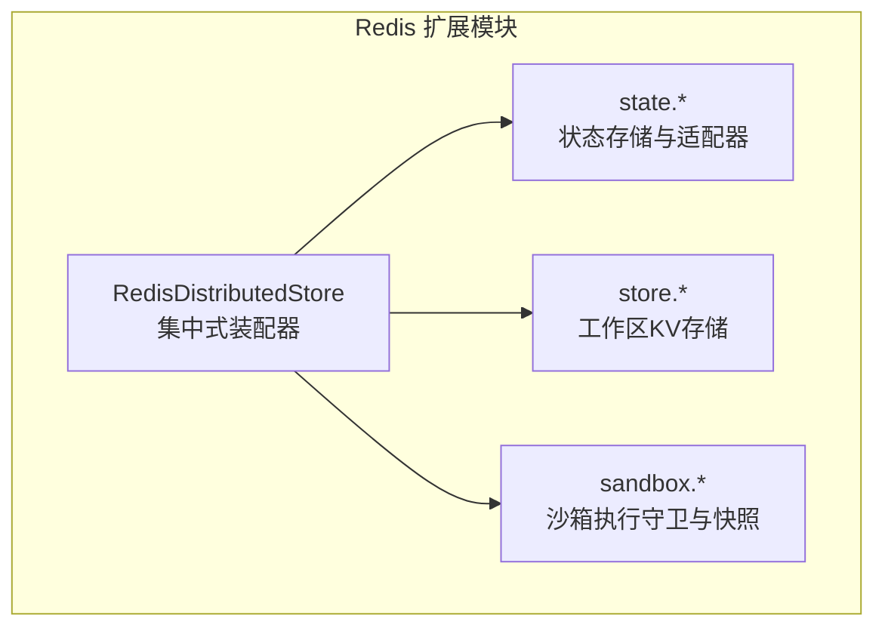
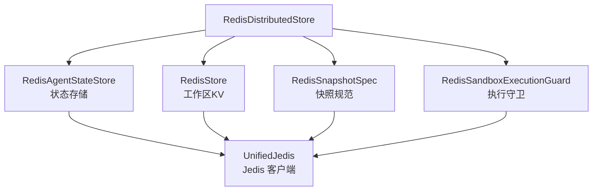
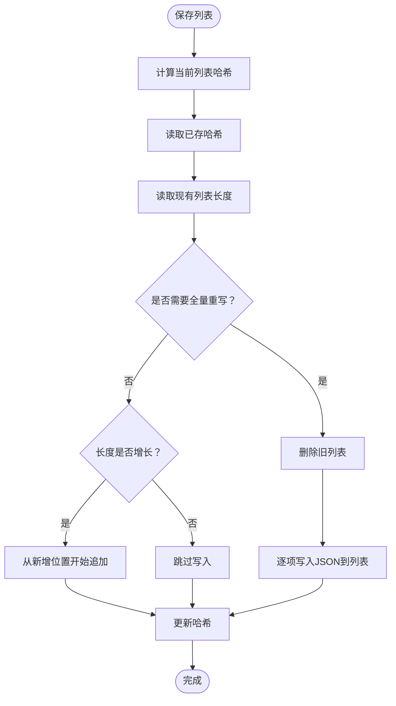
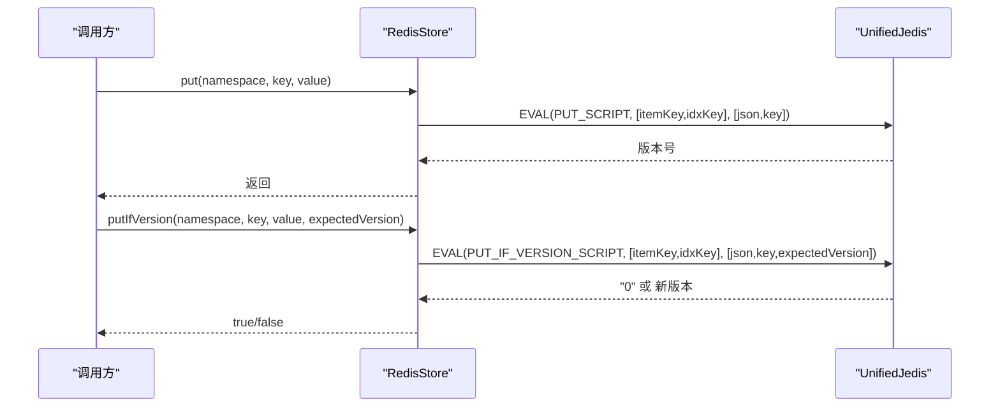
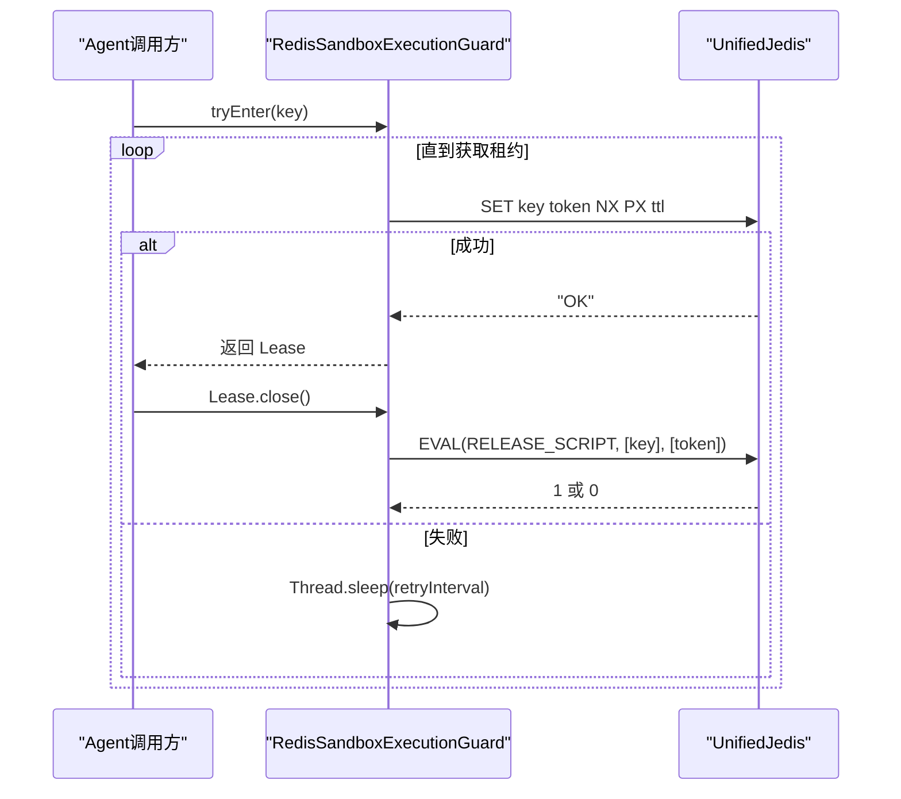
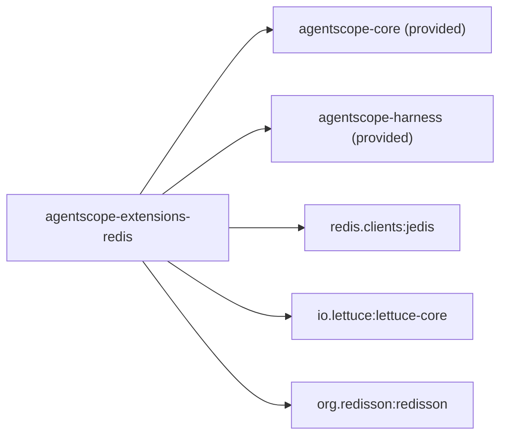

# Redis分布式存储

<cite>
**本文引用的文件**
- [RedisDistributedStore.java](file://agentscope-extensions/agentscope-extensions-redis/src/main/java/io/agentscope/extensions/redis/RedisDistributedStore.java)
- [RedisAgentStateStore.java](file://agentscope-extensions/agentscope-extensions-redis/src/main/java/io/agentscope/extensions/redis/state/RedisAgentStateStore.java)
- [RedisStore.java](file://agentscope-extensions/agentscope-extensions-redis/src/main/java/io/agentscope/extensions/redis/store/RedisStore.java)
- [RedisSandboxExecutionGuard.java](file://agentscope-extensions/agentscope-extensions-redis/src/main/java/io/agentscope/extensions/redis/sandbox/RedisSandboxExecutionGuard.java)
- [RedisSnapshotSpec.java](file://agentscope-extensions/agentscope-extensions-redis/src/main/java/io/agentscope/extensions/redis/snapshot/RedisSnapshotSpec.java)
- [RedisRemoteSnapshotClient.java](file://agentscope-extensions/agentscope-extensions-redis/src/main/java/io/agentscope/extensions/redis/snapshot/RedisRemoteSnapshotClient.java)
- [JedisAgentStateStore.java](file://agentscope-extensions/agentscope-extensions-redis/src/main/java/io/agentscope/extensions/redis/state/jedis/JedisAgentStateStore.java)
- [JedisClientAdapter.java](file://agentscope-extensions/agentscope-extensions-redis/src/main/java/io/agentscope/extensions/redis/state/jedis/JedisClientAdapter.java)
- [LettuceClientAdapter.java](file://agentscope-extensions/agentscope-extensions-redis/src/main/java/io/agentscope/extensions/redis/state/lettuce/LettuceClientAdapter.java)
- [RedissonClientAdapter.java](file://agentscope-extensions/agentscope-extensions-redis/src/main/java/io/agentscope/extensions/redis/state/redisson/RedissonClientAdapter.java)
- [redis.md（中文）](file://docs/v2/zh/integration/distributed/redis.md)
- [redis.md（中文·会话）](file://docs/v2/zh/integration/session/redis.md)
- [pom.xml（Redis扩展）](file://agentscope-extensions/agentscope-extensions-redis/pom.xml)
</cite>

## 目录
1. [简介](#简介)
2. [项目结构](#项目结构)
3. [核心组件](#核心组件)
4. [架构总览](#架构总览)
5. [组件详解](#组件详解)
6. [依赖关系分析](#依赖关系分析)
7. [性能与可用性](#性能与可用性)
8. [故障排查指南](#故障排查指南)
9. [结论](#结论)
10. [附录](#附录)

## 简介
本技术文档围绕 AgentScope Java 的 Redis 分布式存储模块，系统阐述 RedisDistributedStore 的架构与实现、Jedis 客户端集成、键空间管理与连接池配置、RedisAgentStateStore 的状态持久化机制、RedisStore 的工作区文件系统实现、RedisSnapshotSpec 的沙箱快照存储方案，以及 RedisSandboxExecutionGuard 的并发控制与执行保护机制。同时给出 Redis 集群、哨兵与分片部署的最佳实践、性能优化建议、故障恢复策略与监控指标配置。

## 项目结构
Redis 扩展模块位于 agentscope-extensions/agentscope-extensions-redis，主要包结构如下：
- state：状态存储实现与客户端适配器（Jedis/Lettuce/Redisson）
- store：工作区文件系统 KV 实现
- sandbox：沙箱执行守卫与快照规范
- 根包：集中式分布式存储装配器

图示来源
- [RedisDistributedStore.java:56-109](file://agentscope-extensions/agentscope-extensions-redis/src/main/java/io/agentscope/extensions/redis/RedisDistributedStore.java#L56-L109)
- [RedisAgentStateStore.java:177-494](file://agentscope-extensions/agentscope-extensions-redis/src/main/java/io/agentscope/extensions/redis/state/RedisAgentStateStore.java#L177-L494)
- [RedisStore.java:57-284](file://agentscope-extensions/agentscope-extensions-redis/src/main/java/io/agentscope/extensions/redis/store/RedisStore.java#L57-L284)
- [RedisSandboxExecutionGuard.java:95-263](file://agentscope-extensions/agentscope-extensions-redis/src/main/java/io/agentscope/extensions/redis/sandbox/RedisSandboxExecutionGuard.java#L95-L263)
- [RedisSnapshotSpec.java:25-38](file://agentscope-extensions/agentscope-extensions-redis/src/main/java/io/agentscope/extensions/redis/snapshot/RedisSnapshotSpec.java#L25-L38)

章节来源
- [pom.xml（Redis扩展）:33-61](file://agentscope-extensions/agentscope-extensions-redis/pom.xml#L33-L61)

## 核心组件
- RedisDistributedStore：以单个 Jedis 客户端为核心，统一装配 Agent 状态存储、工作区 KV、沙箱快照与沙箱执行守卫。
- RedisAgentStateStore：多客户端适配的状态存储，支持 Jedis/Lettuce/Redisson，提供单值/列表/索引的统一键空间。
- RedisStore：工作区文件系统 KV 存储，采用 Lua 原子脚本保障版本读取+哈希写入+索引更新的一致性。
- RedisSandboxExecutionGuard：基于 Redis SET NX PX 的租约锁，实现 AGENT/GLOBAL 隔离范围内的并发控制。
- RedisSnapshotSpec/RedisRemoteSnapshotClient：将沙箱快照以 Redis 二进制值存储，支持可选 TTL。

章节来源
- [RedisDistributedStore.java:56-109](file://agentscope-extensions/agentscope-extensions-redis/src/main/java/io/agentscope/extensions/redis/RedisDistributedStore.java#L56-L109)
- [RedisAgentStateStore.java:177-494](file://agentscope-extensions/agentscope-extensions-redis/src/main/java/io/agentscope/extensions/redis/state/RedisAgentStateStore.java#L177-L494)
- [RedisStore.java:57-284](file://agentscope-extensions/agentscope-extensions-redis/src/main/java/io/agentscope/extensions/redis/store/RedisStore.java#L57-L284)
- [RedisSandboxExecutionGuard.java:95-263](file://agentscope-extensions/agentscope-extensions-redis/src/main/java/io/agentscope/extensions/redis/sandbox/RedisSandboxExecutionGuard.java#L95-L263)
- [RedisSnapshotSpec.java:25-38](file://agentscope-extensions/agentscope-extensions-redis/src/main/java/io/agentscope/extensions/redis/snapshot/RedisSnapshotSpec.java#L25-L38)
- [RedisRemoteSnapshotClient.java:29-91](file://agentscope-extensions/agentscope-extensions-redis/src/main/java/io/agentscope/extensions/redis/snapshot/RedisRemoteSnapshotClient.java#L29-L91)

## 架构总览
下图展示 RedisDistributedStore 如何将各组件串联，并在运行期通过 RuntimeContext 决定状态槽位与工作区命名空间。

图示来源
- [RedisDistributedStore.java:87-108](file://agentscope-extensions/agentscope-extensions-redis/src/main/java/io/agentscope/extensions/redis/RedisDistributedStore.java#L87-L108)
- [RedisAgentStateStore.java:177-494](file://agentscope-extensions/agentscope-extensions-redis/src/main/java/io/agentscope/extensions/redis/state/RedisAgentStateStore.java#L177-L494)
- [RedisStore.java:57-284](file://agentscope-extensions/agentscope-extensions-redis/src/main/java/io/agentscope/extensions/redis/store/RedisStore.java#L57-L284)
- [RedisSandboxExecutionGuard.java:95-263](file://agentscope-extensions/agentscope-extensions-redis/src/main/java/io/agentscope/extensions/redis/sandbox/RedisSandboxExecutionGuard.java#L95-L263)
- [RedisSnapshotSpec.java:25-38](file://agentscope-extensions/agentscope-extensions-redis/src/main/java/io/agentscope/extensions/redis/snapshot/RedisSnapshotSpec.java#L25-L38)

## 组件详解

### RedisDistributedStore：集中式装配器
- 角色定位：以单个 Jedis 客户端为核心，统一提供状态存储、工作区 KV、沙箱快照与执行守卫实例。
- 键前缀策略：默认前缀为 agentscope:，可通过构造函数注入自定义前缀，便于多环境/多应用隔离。
- 组件装配：
  - agentStateStore：返回 RedisAgentStateStore（带 session: 前缀）
  - baseStore：返回 RedisStore（带 store: 前缀）
  - sandboxSnapshotSpec：返回 RedisSnapshotSpec（带 snapshot: 前缀）
  - sandboxExecutionGuard：返回 RedisSandboxExecutionGuard（带 guard: 前缀）

章节来源
- [RedisDistributedStore.java:56-109](file://agentscope-extensions/agentscope-extensions-redis/src/main/java/io/agentscope/extensions/redis/RedisDistributedStore.java#L56-L109)

### RedisAgentStateStore：多客户端适配的状态持久化
- 支持客户端：
  - Jedis：UnifiedJedis（含 Standalone/Cluster/Sentinel）
  - Lettuce：RedisClient（Standalone/Sentinel）、RedisClusterClient（Cluster）
  - Redisson：RedissonClient（Standalone/Cluster/Sentinel/Master/Slave）
- 键空间设计（前缀由装配器或构建器提供）：
  - 单值：{prefix}{userId}/{sessionId}:{stateKey}（String，JSON）
  - 列表：{prefix}{userId}/{sessionId}:{stateKey}:list（List，JSON items）
  - 列表哈希：{prefix}{userId}/{sessionId}:{stateKey}:list:_hash（变更检测）
  - 会话索引：{prefix}{userId}/{sessionId}:_keys（Set，跟踪该会话的所有键）
- 关键能力：
  - 单值/列表保存与读取
  - 列表增量写入：基于哈希摘要与长度判断是否全量重写或增量追加
  - 会话存在性检查与删除（批量清理键集合）
  - 会话枚举：通过模式匹配快速列出用户的所有会话
  - 清理工具：清空前缀下所有键（线程池异步执行）
- 并发与一致性：
  - 通过统一的 RedisClientAdapter 抽象屏蔽客户端差异
  - 保持常数次调用完成删除/存在性检查，避免 KEYS *

图示来源
- [RedisAgentStateStore.java:226-265](file://agentscope-extensions/agentscope-extensions-redis/src/main/java/io/agentscope/extensions/redis/state/RedisAgentStateStore.java#L226-L265)

章节来源
- [RedisAgentStateStore.java:177-494](file://agentscope-extensions/agentscope-extensions-redis/src/main/java/io/agentscope/extensions/redis/state/RedisAgentStateStore.java#L177-L494)
- [JedisClientAdapter.java:86-176](file://agentscope-extensions/agentscope-extensions-redis/src/main/java/io/agentscope/extensions/redis/state/jedis/JedisClientAdapter.java#L86-L176)
- [LettuceClientAdapter.java:93-337](file://agentscope-extensions/agentscope-extensions-redis/src/main/java/io/agentscope/extensions/redis/state/lettuce/LettuceClientAdapter.java#L93-L337)
- [RedissonClientAdapter.java:117-222](file://agentscope-extensions/agentscope-extensions-redis/src/main/java/io/agentscope/extensions/redis/state/redisson/RedissonClientAdapter.java#L117-L222)

### RedisStore：工作区文件系统 KV
- 键布局（前缀由构造器提供，默认 agentscope:store:）：
  - Item 哈希：<prefix>item:<ns>\0<k>（字段：value、version）
  - 命名空间索引：<prefix>idx:<ns>（Sorted Set，score=0，成员为 k）
- 并发与一致性：
  - put：Lua 原子脚本（版本递增 + 哈希写入 + 索引更新）
  - putIfVersion：CAS 原子脚本（当版本匹配时写入，否则返回 0）
  - delete：Lua 原子脚本（删除哈希 + 索引成员）
  - search：ZRANGEBYLEX 枚举键，再回读哈希；容忍短暂的索引漂移（先加索引后写哈希窗口）
- 序列化：Jackson ObjectMapper，Map<String,Object> <-> JSON

图示来源
- [RedisStore.java:139-164](file://agentscope-extensions/agentscope-extensions-redis/src/main/java/io/agentscope/extensions/redis/store/RedisStore.java#L139-L164)

章节来源
- [RedisStore.java:57-284](file://agentscope-extensions/agentscope-extensions-redis/src/main/java/io/agentscope/extensions/redis/store/RedisStore.java#L57-L284)

### RedisSandboxExecutionGuard：并发控制与执行保护
- 机制：
  - tryEnter：使用 SET key token NX PX ttl 获取租约；失败则按 retryInterval 重试，直至成功或中断
  - 释放：Lua 脚本仅在 token 匹配时删除 key，防止误删他人租约
- 键格式：{keyPrefix}<scope>:<value>（scope 为小写，如 agent/global）
- 参数：
  - keyPrefix：默认 agentscope:sandbox:lock:
  - leaseTtl：默认 30 分钟，需覆盖最坏调用时长（含重试与 LLM 耗时）
  - retryInterval：默认 500ms，权衡延迟与轮询开销

图示来源
- [RedisSandboxExecutionGuard.java:138-179](file://agentscope-extensions/agentscope-extensions-redis/src/main/java/io/agentscope/extensions/redis/sandbox/RedisSandboxExecutionGuard.java#L138-L179)

章节来源
- [RedisSandboxExecutionGuard.java:95-263](file://agentscope-extensions/agentscope-extensions-redis/src/main/java/io/agentscope/extensions/redis/sandbox/RedisSandboxExecutionGuard.java#L95-L263)

### RedisSnapshotSpec 与 RedisRemoteSnapshotClient：沙箱快照存储
- 存储介质：Redis 二进制值（字节数组）
- 键格式：{keyPrefix}<snapshotId>.tar
- 行为：
  - upload：写入二进制数据，可选设置 TTL
  - download：读取二进制流，不存在抛出文件未找到异常
  - exists：检查键是否存在
- 适用场景：小工作区 + 短 TTL；大工作区建议 OSS 等对象存储

章节来源
- [RedisSnapshotSpec.java:25-38](file://agentscope-extensions/agentscope-extensions-redis/src/main/java/io/agentscope/extensions/redis/snapshot/RedisSnapshotSpec.java#L25-L38)
- [RedisRemoteSnapshotClient.java:29-91](file://agentscope-extensions/agentscope-extensions-redis/src/main/java/io/agentscope/extensions/redis/snapshot/RedisRemoteSnapshotClient.java#L29-L91)

### Jedis 客户端适配与连接池
- JedisClientAdapter：统一封装 UnifiedJedis（含 Standalone/Cluster/Sentinel），提供 set/get/list/set 等操作与键扫描
- JedisAgentStateStore（已废弃）：直接使用 JedisPool，提供与 RedisAgentStateStore 相同的键空间与能力，但仅限 Jedis
- 连接池配置建议：
  - 最小空闲连接数、最大连接数、超时时间、命令超时
  - 集群/哨兵模式下使用对应的 JedisClusterClient/RedisSentinelClient
  - 在高并发场景下，合理设置连接池大小与超时阈值，避免阻塞

章节来源
- [JedisClientAdapter.java:86-176](file://agentscope-extensions/agentscope-extensions-redis/src/main/java/io/agentscope/extensions/redis/state/jedis/JedisClientAdapter.java#L86-L176)
- [JedisAgentStateStore.java:55-362](file://agentscope-extensions/agentscope-extensions-redis/src/main/java/io/agentscope/extensions/redis/state/jedis/JedisAgentStateStore.java#L55-L362)

## 依赖关系分析
- 模块依赖：对 agentscope-core 与 agentscope-harness 为 provided，对 Jedis、Lettuce、Redisson 为 compile-time 依赖
- 组件耦合：
  - RedisDistributedStore 低耦合地组合各组件
  - 各组件通过 RedisClientAdapter 解耦具体客户端类型
  - RedisStore 与 RedisSandboxExecutionGuard 仅依赖 Jedis（UnifiedJedis）

图示来源
- [pom.xml（Redis扩展）:33-61](file://agentscope-extensions/agentscope-extensions-redis/pom.xml#L33-L61)

章节来源
- [pom.xml（Redis扩展）:33-61](file://agentscope-extensions/agentscope-extensions-redis/pom.xml#L33-L61)

## 性能与可用性
- 键空间与扫描
  - 通过专用索引键（如会话 _keys、命名空间索引）避免 KEYS *，提升删除/列举性能
  - 键扫描采用游标式 SCAN/SCAN，避免阻塞
- 原子性与一致性
  - RedisStore 的 put/putIfVersion/delete 使用 Lua 脚本，确保版本读取+写入+索引更新的原子性
  - RedisAgentStateStore 的列表写入根据哈希与长度判断增量/全量策略，减少不必要的写放大
- 并发控制
  - RedisSandboxExecutionGuard 使用 SET NX PX + Lua CAS，避免死锁与误释放
  - 租约 TTL 应覆盖最坏调用时长，防止长时间占用导致的活锁风险
- 客户端选择与部署
  - 生产多副本优先 Redis；已有集群优先 Lettuce Cluster 或 Redisson Sentinel
  - 小工作区短 TTL 快照可走 Redis；大工作区建议 Redis 管控状态与锁，OSS 管控快照
- 连接池与网络
  - 合理设置连接池大小、超时与重试策略
  - 集群/哨兵部署下，确保客户端具备故障切换与重连能力
- 监控指标建议
  - 命令耗时分布（P50/P95/P99）、错误率、连接池利用率
  - 键空间大小、键扫描次数、Lua 脚本命中率
  - 沙箱租约等待时延、释放失败次数
  - 快照上传/下载成功率与时延

[本节为通用性能指导，无需特定文件引用]

## 故障排查指南
- 状态存储问题
  - 列表未增量：确认哈希摘要计算与长度比较逻辑是否触发全量重写；检查 JSON 序列化是否一致
  - 会话删除不彻底：确认 _keys 索引是否正确维护；检查批量删除键集合是否包含列表哈希键
- 工作区 KV 问题
  - putIfVersion 始终失败：核对期望版本号是否正确；确认 Lua 脚本返回值
  - search 结果缺失：容忍短暂索引漂移，重试或等待写入完成
- 并发控制问题
  - 租约无法获取：降低 retryInterval 或提高 leaseTtl；检查线程是否被中断
  - 释放失败：日志中出现“租约已被删除或被他人持有”的警告属预期；确保释放逻辑幂等
- 快照问题
  - 下载失败：确认键前缀与快照 ID；检查 TTL 是否已过期
  - 大体积快照：考虑改用对象存储（如 OSS）以节省内存

章节来源
- [RedisAgentStateStore.java:226-265](file://agentscope-extensions/agentscope-extensions-redis/src/main/java/io/agentscope/extensions/redis/state/RedisAgentStateStore.java#L226-L265)
- [RedisStore.java:139-164](file://agentscope-extensions/agentscope-extensions-redis/src/main/java/io/agentscope/extensions/redis/store/RedisStore.java#L139-L164)
- [RedisSandboxExecutionGuard.java:138-179](file://agentscope-extensions/agentscope-extensions-redis/src/main/java/io/agentscope/extensions/redis/sandbox/RedisSandboxExecutionGuard.java#L138-L179)
- [RedisRemoteSnapshotClient.java:48-71](file://agentscope-extensions/agentscope-extensions-redis/src/main/java/io/agentscope/extensions/redis/snapshot/RedisRemoteSnapshotClient.java#L48-L71)

## 结论
Redis 分布式存储模块通过统一的装配器与适配层，实现了状态持久化、工作区 KV、沙箱快照与并发控制的一体化方案。其键空间设计与原子脚本保障了高性能与一致性，配合多客户端适配满足不同部署形态的需求。结合合理的连接池配置、租约 TTL 与监控指标，可在生产环境中稳定支撑多副本 Agent 运行。

[本节为总结性内容，无需特定文件引用]

## 附录

### Redis 集群/哨兵/分片最佳实践
- 集群（Lettuce Cluster / Redisson Cluster）
  - 使用集群客户端直连，避免代理层开销
  - 合理设置扫描间隔与节点发现策略
- 哨兵（Lettuce Sentinel / Jedis Sentinel）
  - 正确配置主从名称与哨兵地址列表
  - 客户端需具备自动故障转移与重连能力
- 分片/命名空间
  - 通过 keyPrefix 实现多环境/多应用隔离
  - 对大键空间采用游标扫描与分页查询

[本节为通用实践建议，无需特定文件引用]

### 配置与使用要点
- 一键装配：RedisDistributedStore.fromJedis(jedis, keyPrefix)
- 状态存储：RedisAgentStateStore.builder().jedisClient(...).keyPrefix(...)
- 工作区 KV：new RedisStore(jedis, keyPrefix)
- 沙箱快照：new RedisSnapshotSpec(jedis, keyPrefix, ttlSeconds)
- 执行守卫：RedisSandboxExecutionGuard.builder(jedis).leaseTtl(...).retryInterval(...)

章节来源
- [redis.md（中文）:17-118](file://docs/v2/zh/integration/distributed/redis.md#L17-L118)
- [redis.md（中文·会话）:21-146](file://docs/v2/zh/integration/session/redis.md#L21-L146)