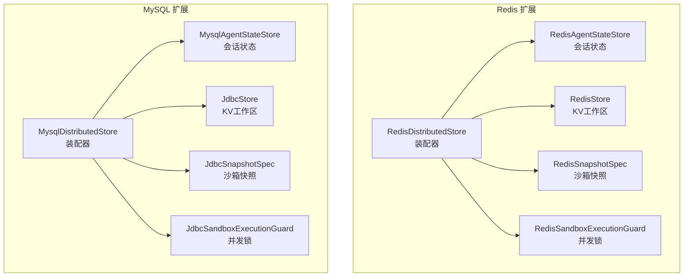
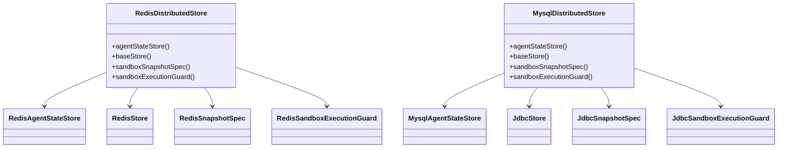
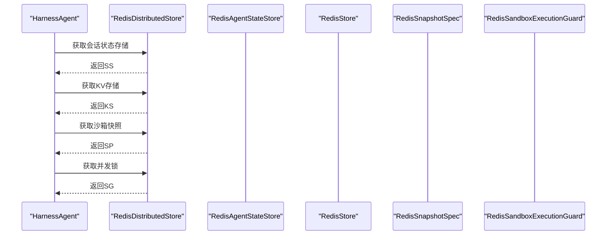
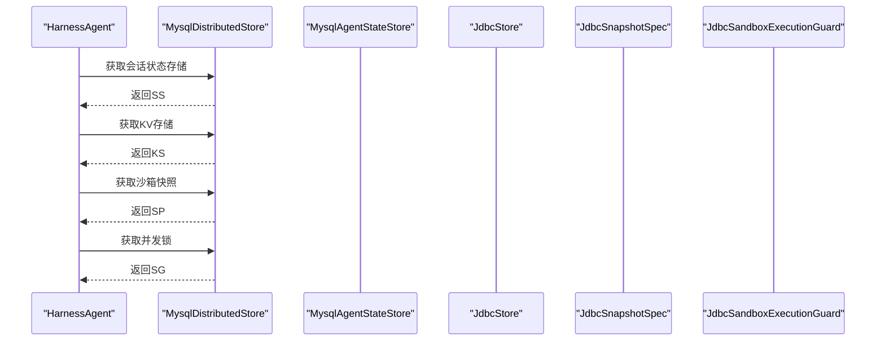
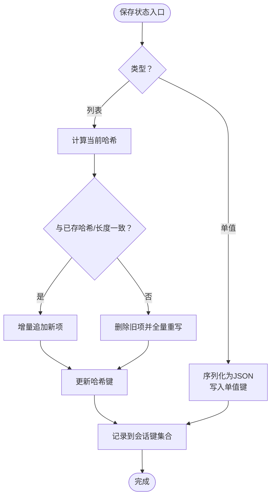
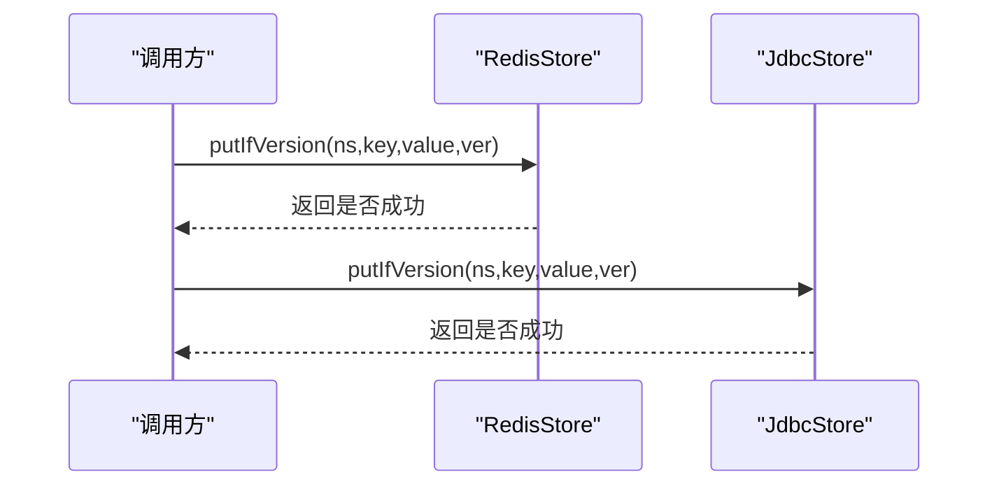
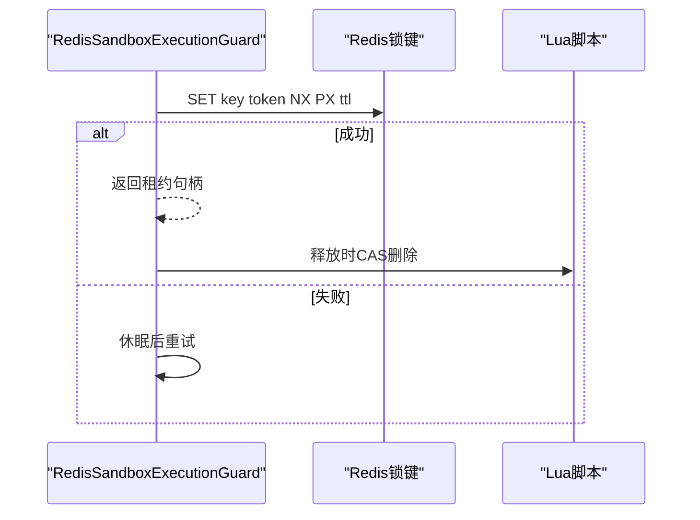
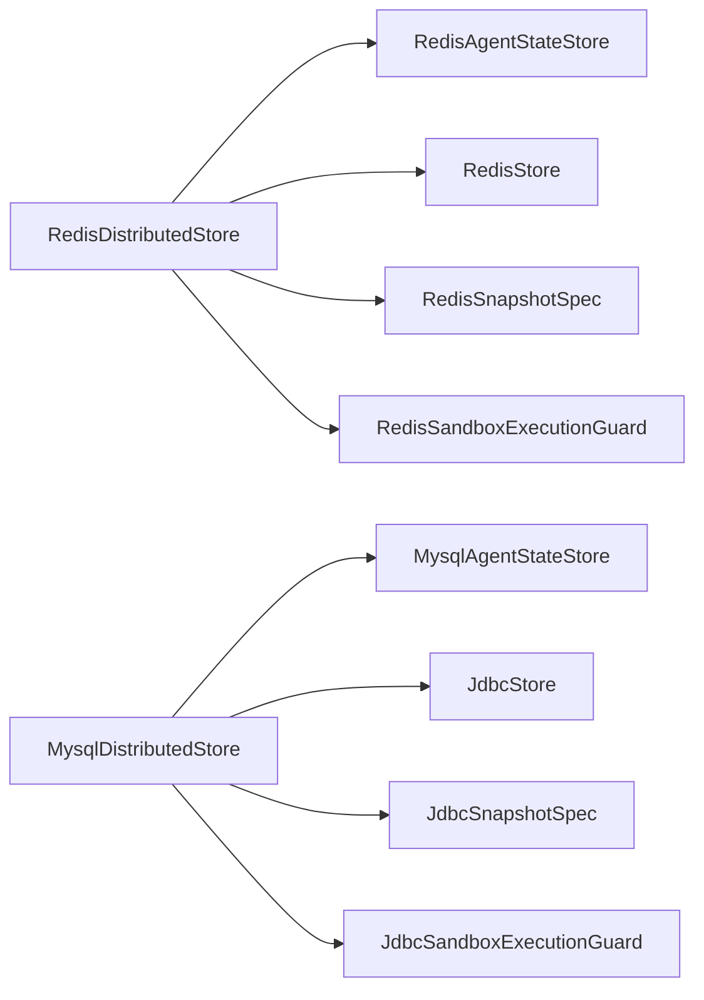

# 存储扩展

<cite>
**本文引用的文件**   
- [RedisDistributedStore.java](file://agentscope-extensions/agentscope-extensions-redis/src/main/java/io/agentscope/extensions/redis/RedisDistributedStore.java)
- [MysqlDistributedStore.java](file://agentscope-extensions/agentscope-extensions-mysql/src/main/java/io/agentscope/extensions/mysql/MysqlDistributedStore.java)
- [RedisAgentStateStore.java](file://agentscope-extensions/agentscope-extensions-redis/src/main/java/io/agentscope/extensions/redis/state/RedisAgentStateStore.java)
- [MysqlAgentStateStore.java](file://agentscope-extensions/agentscope-extensions-mysql/src/main/java/io/agentscope/extensions/mysql/state/MysqlAgentStateStore.java)
- [RedisStore.java](file://agentscope-extensions/agentscope-extensions-redis/src/main/java/io/agentscope/extensions/redis/store/RedisStore.java)
- [JdbcStore.java](file://agentscope-extensions/agentscope-extensions-mysql/src/main/java/io/agentscope/extensions/mysql/store/JdbcStore.java)
- [RedisSnapshotSpec.java](file://agentscope-extensions/agentscope-extensions-redis/src/main/java/io/agentscope/extensions/redis/snapshot/RedisSnapshotSpec.java)
- [JdbcSnapshotSpec.java](file://agentscope-extensions/agentscope-extensions-mysql/src/main/java/io/agentscope/extensions/mysql/snapshot/JdbcSnapshotSpec.java)
- [RedisSandboxExecutionGuard.java](file://agentscope-extensions/agentscope-extensions-redis/src/main/java/io/agentscope/extensions/redis/sandbox/RedisSandboxExecutionGuard.java)
- [JdbcSandboxExecutionGuard.java](file://agentscope-extensions/agentscope-extensions-mysql/src/main/java/io/agentscope/extensions/mysql/sandbox/JdbcSandboxExecutionGuard.java)
</cite>

## 目录
1. [简介](#简介)
2. [项目结构](#项目结构)
3. [核心组件](#核心组件)
4. [架构总览](#架构总览)
5. [详细组件分析](#详细组件分析)
6. [依赖关系分析](#依赖关系分析)
7. [性能考量](#性能考量)
8. [故障排查指南](#故障排查指南)
9. [结论](#结论)
10. [附录：配置与迁移](#附录配置与迁移)

## 简介
本文件面向AgentScope Java的存储扩展模块，系统性梳理并解释以下三类后端的实现与使用方式：
- Redis分布式存储：基于统一键空间的会话状态、KV工作区、沙箱快照与并发锁。
- MySQL数据库存储：基于关系型表的会话状态、KV工作区、沙箱快照与并发锁。
- OSS对象存储：仓库中暂未发现对应实现文件，后续可按本指南的通用模式扩展。

重点覆盖：
- 分布式存储设计与一致性保障（版本控制、CAS、哈希校验）
- 故障恢复与容错（超时、重试、租约续期）
- 性能优化策略（增量写入、批量操作、连接池与索引）
- 状态存储的序列化、持久化与恢复流程
- 各后端的配置示例、连接参数与调优建议
- 使用场景、成本对比与迁移指南

## 项目结构
存储扩展位于agentscope-extensions模块下，分别在redis与mysql子包中提供统一的分布式存储装配器，以及各自的状态、KV存储、快照与并发锁实现。

图表来源
- [RedisDistributedStore.java:56-109](file://agentscope-extensions/agentscope-extensions-redis/src/main/java/io/agentscope/extensions/redis/RedisDistributedStore.java#L56-L109)
- [MysqlDistributedStore.java:54-91](file://agentscope-extensions/agentscope-extensions-mysql/src/main/java/io/agentscope/extensions/mysql/MysqlDistributedStore.java#L54-L91)

章节来源
- [RedisDistributedStore.java:56-109](file://agentscope-extensions/agentscope-extensions-redis/src/main/java/io/agentscope/extensions/redis/RedisDistributedStore.java#L56-L109)
- [MysqlDistributedStore.java:54-91](file://agentscope-extensions/agentscope-extensions-mysql/src/main/java/io/agentscope/extensions/mysql/MysqlDistributedStore.java#L54-L91)

## 核心组件
- 分布式存储装配器：负责将状态存储、KV存储、沙箱快照与并发锁整合为统一的分布式能力入口。
- 会话状态存储：支持单值与列表两类状态，具备增量写入、哈希校验与批量序列化。
- KV工作区存储：提供命名空间隔离的键值存取、条件更新（CAS）、范围检索与删除。
- 沙箱快照：将沙箱工作区打包为二进制归档并持久化到后端。
- 并发锁：通过原子SET/NX/PX或数据库命名锁实现隔离槽位的互斥访问。

章节来源
- [RedisAgentStateStore.java:177-494](file://agentscope-extensions/agentscope-extensions-redis/src/main/java/io/agentscope/extensions/redis/state/RedisAgentStateStore.java#L177-L494)
- [MysqlAgentStateStore.java:68-800](file://agentscope-extensions/agentscope-extensions-mysql/src/main/java/io/agentscope/extensions/mysql/state/MysqlAgentStateStore.java#L68-L800)
- [RedisStore.java:57-284](file://agentscope-extensions/agentscope-extensions-redis/src/main/java/io/agentscope/extensions/redis/store/RedisStore.java#L57-L284)
- [JdbcStore.java:74-419](file://agentscope-extensions/agentscope-extensions-mysql/src/main/java/io/agentscope/extensions/mysql/store/JdbcStore.java#L74-L419)
- [RedisSnapshotSpec.java:25-37](file://agentscope-extensions/agentscope-extensions-redis/src/main/java/io/agentscope/extensions/redis/snapshot/RedisSnapshotSpec.java#L25-L37)
- [JdbcSnapshotSpec.java:27-36](file://agentscope-extensions/agentscope-extensions-mysql/src/main/java/io/agentscope/extensions/mysql/snapshot/JdbcSnapshotSpec.java#L27-L36)
- [RedisSandboxExecutionGuard.java:95-263](file://agentscope-extensions/agentscope-extensions-redis/src/main/java/io/agentscope/extensions/redis/sandbox/RedisSandboxExecutionGuard.java#L95-L263)
- [JdbcSandboxExecutionGuard.java:45-177](file://agentscope-extensions/agentscope-extensions-mysql/src/main/java/io/agentscope/extensions/mysql/sandbox/JdbcSandboxExecutionGuard.java#L45-L177)

## 架构总览
分布式存储围绕“装配器-子组件”模型组织，装配器根据所选后端提供一致的接口，内部通过各自的客户端适配器完成读写。

图表来源
- [RedisDistributedStore.java:56-109](file://agentscope-extensions/agentscope-extensions-redis/src/main/java/io/agentscope/extensions/redis/RedisDistributedStore.java#L56-L109)
- [MysqlDistributedStore.java:54-91](file://agentscope-extensions/agentscope-extensions-mysql/src/main/java/io/agentscope/extensions/mysql/MysqlDistributedStore.java#L54-L91)

## 详细组件分析

### Redis 分布式存储
- 装配器职责：统一提供会话状态、KV存储、沙箱快照与并发锁实例，并支持自定义键前缀。
- 会话状态存储：
  - 支持Jedis/Lettuce/Redisson三种客户端适配。
  - 键布局：单值字符串、列表列表、列表哈希、会话键集合。
  - 增量写入：基于列表哈希判断是否需要全量重写或增量追加。
  - 用户匿名态：对空用户ID进行规范化处理。
- KV工作区：
  - 使用Lua脚本保证原子性：写入值+版本号、更新索引。
  - 命名空间采用NUL分隔，索引用有序集合实现前缀扫描。
- 沙箱快照：
  - 将二进制快照写入Redis，支持可选TTL。
- 并发锁：
  - 使用SET NX PX获取租约，Lua脚本CAS释放，避免误删。
  - 可配置租约时长与重试间隔。

图表来源
- [RedisDistributedStore.java:87-108](file://agentscope-extensions/agentscope-extensions-redis/src/main/java/io/agentscope/extensions/redis/RedisDistributedStore.java#L87-L108)

章节来源
- [RedisDistributedStore.java:56-109](file://agentscope-extensions/agentscope-extensions-redis/src/main/java/io/agentscope/extensions/redis/RedisDistributedStore.java#L56-L109)
- [RedisAgentStateStore.java:177-494](file://agentscope-extensions/agentscope-extensions-redis/src/main/java/io/agentscope/extensions/redis/state/RedisAgentStateStore.java#L177-L494)
- [RedisStore.java:57-284](file://agentscope-extensions/agentscope-extensions-redis/src/main/java/io/agentscope/extensions/redis/store/RedisStore.java#L57-L284)
- [RedisSnapshotSpec.java:25-37](file://agentscope-extensions/agentscope-extensions-redis/src/main/java/io/agentscope/extensions/redis/snapshot/RedisSnapshotSpec.java#L25-L37)
- [RedisSandboxExecutionGuard.java:95-263](file://agentscope-extensions/agentscope-extensions-redis/src/main/java/io/agentscope/extensions/redis/sandbox/RedisSandboxExecutionGuard.java#L95-L263)

### MySQL 分布式存储
- 装配器职责：提供会话状态、KV存储、沙箱快照与并发锁的JDBC实现。
- 会话状态存储：
  - 表结构：复合主键(session_id, state_key, item_index)，单值用item_index=0。
  - 增量写入：通过哈希检测决定全量重写或增量插入；支持批量写入。
  - 安全性：参数化查询、标识符白名单校验、自动建库建表或存在性校验。
- KV工作区：
  - 表结构：命名空间路径+键作为主键，值为JSON，版本号递增。
  - CAS：INSERT或条件UPDATE，冲突检测通过主键约束或条件更新返回影响行数。
  - 搜索：LIKE前缀匹配，支持偏移与限制。
- 沙箱快照：
  - 将tar归档以BLOB形式存储于数据库表。
- 并发锁：
  - 使用MySQL命名锁GET_LOCK()/RELEASE_LOCK()，连接关闭自动释放。

图表来源
- [MysqlDistributedStore.java:72-90](file://agentscope-extensions/agentscope-extensions-mysql/src/main/java/io/agentscope/extensions/mysql/MysqlDistributedStore.java#L72-L90)

章节来源
- [MysqlDistributedStore.java:54-91](file://agentscope-extensions/agentscope-extensions-mysql/src/main/java/io/agentscope/extensions/mysql/MysqlDistributedStore.java#L54-L91)
- [MysqlAgentStateStore.java:68-800](file://agentscope-extensions/agentscope-extensions-mysql/src/main/java/io/agentscope/extensions/mysql/state/MysqlAgentStateStore.java#L68-L800)
- [JdbcStore.java:74-419](file://agentscope-extensions/agentscope-extensions-mysql/src/main/java/io/agentscope/extensions/mysql/store/JdbcStore.java#L74-L419)
- [JdbcSnapshotSpec.java:27-36](file://agentscope-extensions/agentscope-extensions-mysql/src/main/java/io/agentscope/extensions/mysql/snapshot/JdbcSnapshotSpec.java#L27-L36)
- [JdbcSandboxExecutionGuard.java:45-177](file://agentscope-extensions/agentscope-extensions-mysql/src/main/java/io/agentscope/extensions/mysql/sandbox/JdbcSandboxExecutionGuard.java#L45-L177)

### 状态存储实现细节（序列化、持久化、恢复）
- 序列化：
  - Redis：使用统一JSON编解码工具。
  - MySQL：使用Jackson将Map/对象序列化为LONGTEXT存储。
- 持久化：
  - Redis：单值字符串、列表列表、列表哈希、键集合。
  - MySQL：单值item_index=0，列表按顺序索引存储，哈希键用于变更检测。
- 恢复：
  - 通过键前缀/命名空间匹配与主键定位，反序列化得到原始状态对象或列表。

图表来源
- [RedisAgentStateStore.java:212-265](file://agentscope-extensions/agentscope-extensions-redis/src/main/java/io/agentscope/extensions/redis/state/RedisAgentStateStore.java#L212-L265)
- [MysqlAgentStateStore.java:376-411](file://agentscope-extensions/agentscope-extensions-mysql/src/main/java/io/agentscope/extensions/mysql/state/MysqlAgentStateStore.java#L376-L411)

章节来源
- [RedisAgentStateStore.java:212-302](file://agentscope-extensions/agentscope-extensions-redis/src/main/java/io/agentscope/extensions/redis/state/RedisAgentStateStore.java#L212-L302)
- [MysqlAgentStateStore.java:376-411](file://agentscope-extensions/agentscope-extensions-mysql/src/main/java/io/agentscope/extensions/mysql/state/MysqlAgentStateStore.java#L376-L411)

### KV工作区存储（Redis vs MySQL）
- Redis：
  - Lua脚本原子写入：HSET写入value与version，ZADD写入索引。
  - CAS：比较当前version与期望值，相等则递增并写入。
  - 搜索：ZRANGEBYLEX按字典序返回键，再回表取值。
- MySQL：
  - CAS：INSERT或条件UPDATE，冲突通过主键异常或影响行数判定。
  - 搜索：LIKE前缀匹配，OFFSET/LIMIT分页。

图表来源
- [RedisStore.java:148-164](file://agentscope-extensions/agentscope-extensions-redis/src/main/java/io/agentscope/extensions/redis/store/RedisStore.java#L148-L164)
- [JdbcStore.java:177-219](file://agentscope-extensions/agentscope-extensions-mysql/src/main/java/io/agentscope/extensions/mysql/store/JdbcStore.java#L177-L219)

章节来源
- [RedisStore.java:128-194](file://agentscope-extensions/agentscope-extensions-redis/src/main/java/io/agentscope/extensions/redis/store/RedisStore.java#L128-L194)
- [JdbcStore.java:139-260](file://agentscope-extensions/agentscope-extensions-mysql/src/main/java/io/agentscope/extensions/mysql/store/JdbcStore.java#L139-L260)

### 沙箱快照与并发锁
- 快照：
  - Redis：键值存储二进制快照，可选TTL。
  - MySQL：BLOB字段存储二进制快照。
- 并发锁：
  - Redis：SET NX PX租约+Lua CAS释放。
  - MySQL：GET_LOCK()/RELEASE_LOCK()，连接生命周期绑定。

图表来源
- [RedisSandboxExecutionGuard.java:138-159](file://agentscope-extensions/agentscope-extensions-redis/src/main/java/io/agentscope/extensions/redis/sandbox/RedisSandboxExecutionGuard.java#L138-L159)

章节来源
- [RedisSnapshotSpec.java:25-37](file://agentscope-extensions/agentscope-extensions-redis/src/main/java/io/agentscope/extensions/redis/snapshot/RedisSnapshotSpec.java#L25-L37)
- [JdbcSnapshotSpec.java:27-36](file://agentscope-extensions/agentscope-extensions-mysql/src/main/java/io/agentscope/extensions/mysql/snapshot/JdbcSnapshotSpec.java#L27-L36)
- [RedisSandboxExecutionGuard.java:95-263](file://agentscope-extensions/agentscope-extensions-redis/src/main/java/io/agentscope/extensions/redis/sandbox/RedisSandboxExecutionGuard.java#L95-L263)
- [JdbcSandboxExecutionGuard.java:45-177](file://agentscope-extensions/agentscope-extensions-mysql/src/main/java/io/agentscope/extensions/mysql/sandbox/JdbcSandboxExecutionGuard.java#L45-L177)

## 依赖关系分析
- 组件内聚与耦合：
  - 装配器仅依赖抽象接口，具体实现通过构造注入，降低耦合。
  - 状态存储与KV存储均依赖各自客户端适配层，便于替换不同驱动。
- 外部依赖：
  - Redis：Jedis/Lettuce/Redisson客户端；Lua脚本与有序集合。
  - MySQL：JDBC驱动、命名锁、参数化SQL。
- 循环依赖：无直接循环，各模块通过装配器间接协作。

图表来源
- [RedisDistributedStore.java:87-108](file://agentscope-extensions/agentscope-extensions-redis/src/main/java/io/agentscope/extensions/redis/RedisDistributedStore.java#L87-L108)
- [MysqlDistributedStore.java:72-90](file://agentscope-extensions/agentscope-extensions-mysql/src/main/java/io/agentscope/extensions/mysql/MysqlDistributedStore.java#L72-L90)

章节来源
- [RedisDistributedStore.java:56-109](file://agentscope-extensions/agentscope-extensions-redis/src/main/java/io/agentscope/extensions/redis/RedisDistributedStore.java#L56-L109)
- [MysqlDistributedStore.java:54-91](file://agentscope-extensions/agentscope-extensions-mysql/src/main/java/io/agentscope/extensions/mysql/MysqlDistributedStore.java#L54-L91)

## 性能考量
- 增量写入与批量操作：
  - 列表状态通过哈希检测与增量追加减少写放大。
  - MySQL支持批量INSERT，显著降低往返开销。
- 连接与资源管理：
  - Redis：Lua脚本一次性完成多步操作，减少网络往返。
  - MySQL：显式事务封装写操作，确保一致性与原子性。
- 索引与扫描：
  - Redis：有序集合支持前缀扫描，避免全量遍历。
  - MySQL：LIKE前缀匹配需配合合适的索引策略，必要时考虑函数索引或前缀索引。
- 并发与租约：
  - Redis：短轮询间隔与合理TTL平衡延迟与资源占用。
  - MySQL：命名锁超时需与业务最长耗时匹配，避免过短导致频繁重试。

## 故障排查指南
- 常见问题与定位要点：
  - 连接失败：检查Redis地址/认证或MySQL连接串、驱动版本。
  - 写入冲突：Redis CAS失败通常由版本不一致引起；MySQL主键冲突需确认预期版本。
  - 数据不一致：核对哈希检测逻辑与增量写入分支；确认事务提交/回滚路径。
  - 锁无法释放：Redis租约到期或Lua释放脚本异常；MySQL命名锁连接提前关闭。
- 日志与可观测性：
  - 并发锁组件记录获取/释放日志，便于定位阻塞与超时。
  - 状态存储与KV存储在异常时抛出明确异常信息，便于快速定位。

章节来源
- [RedisStore.java:148-164](file://agentscope-extensions/agentscope-extensions-redis/src/main/java/io/agentscope/extensions/redis/store/RedisStore.java#L148-L164)
- [JdbcStore.java:177-219](file://agentscope-extensions/agentscope-extensions-mysql/src/main/java/io/agentscope/extensions/mysql/store/JdbcStore.java#L177-L219)
- [RedisSandboxExecutionGuard.java:161-179](file://agentscope-extensions/agentscope-extensions-redis/src/main/java/io/agentscope/extensions/redis/sandbox/RedisSandboxExecutionGuard.java#L161-L179)
- [JdbcSandboxExecutionGuard.java:119-140](file://agentscope-extensions/agentscope-extensions-mysql/src/main/java/io/agentscope/extensions/mysql/sandbox/JdbcSandboxExecutionGuard.java#L119-L140)

## 结论
- Redis适合高并发、低延迟的会话状态与KV存储场景，具备原子Lua操作与有序集合前缀扫描优势。
- MySQL适合强一致、复杂查询与审计需求的场景，支持批量写入与参数化安全访问。
- 两者均提供沙箱快照与并发锁能力，满足分布式隔离与一致性要求。
- OSS对象存储在当前仓库中尚未实现，可参考Redis/MySQL的抽象模式扩展。

## 附录：配置与迁移

### 配置示例与连接参数
- Redis
  - 装配器初始化：传入Jedis客户端与可选键前缀。
  - 会话状态：选择Jedis/Lettuce/Redisson客户端适配器。
  - KV存储：默认前缀，可自定义；Jackson映射器可替换。
  - 沙箱快照：可设置TTL秒数。
  - 并发锁：租约时长、重试间隔、键前缀。
- MySQL
  - 装配器初始化：传入DataSource（推荐HikariCP/Druid）。
  - 会话状态：可指定数据库名、表名与自动建表开关。
  - KV存储：可自定义表名与方言，自动建表或由迁移工具管理。
  - 沙箱快照：可指定表名或使用默认。
  - 并发锁：键前缀与命名锁超时。

章节来源
- [RedisDistributedStore.java:72-85](file://agentscope-extensions/agentscope-extensions-redis/src/main/java/io/agentscope/extensions/redis/RedisDistributedStore.java#L72-L85)
- [MysqlDistributedStore.java:68-70](file://agentscope-extensions/agentscope-extensions-mysql/src/main/java/io/agentscope/extensions/mysql/MysqlDistributedStore.java#L68-L70)
- [RedisAgentStateStore.java:453-492](file://agentscope-extensions/agentscope-extensions-redis/src/main/java/io/agentscope/extensions/redis/state/RedisAgentStateStore.java#L453-L492)
- [RedisStore.java:100-126](file://agentscope-extensions/agentscope-extensions-redis/src/main/java/io/agentscope/extensions/redis/store/RedisStore.java#L100-L126)
- [RedisSnapshotSpec.java:34-36](file://agentscope-extensions/agentscope-extensions-redis/src/main/java/io/agentscope/extensions/redis/snapshot/RedisSnapshotSpec.java#L34-L36)
- [RedisSandboxExecutionGuard.java:213-254](file://agentscope-extensions/agentscope-extensions-redis/src/main/java/io/agentscope/extensions/redis/sandbox/RedisSandboxExecutionGuard.java#L213-L254)
- [MysqlAgentStateStore.java:145-177](file://agentscope-extensions/agentscope-extensions-mysql/src/main/java/io/agentscope/extensions/mysql/state/MysqlAgentStateStore.java#L145-L177)
- [JdbcStore.java:355-417](file://agentscope-extensions/agentscope-extensions-mysql/src/main/java/io/agentscope/extensions/mysql/store/JdbcStore.java#L355-L417)
- [JdbcSnapshotSpec.java:33-35](file://agentscope-extensions/agentscope-extensions-mysql/src/main/java/io/agentscope/extensions/mysql/snapshot/JdbcSnapshotSpec.java#L33-L35)
- [JdbcSandboxExecutionGuard.java:155-170](file://agentscope-extensions/agentscope-extensions-mysql/src/main/java/io/agentscope/extensions/mysql/sandbox/JdbcSandboxExecutionGuard.java#L155-L170)

### 使用场景与成本对比
- Redis
  - 场景：高并发会话状态、KV缓存、沙箱隔离。
  - 成本：内存成本较高，需考虑持久化与备份。
- MySQL
  - 场景：强一致、审计、复杂查询、历史归档。
  - 成本：磁盘与CPU成本更高，但具备成熟运维生态。
- OSS
  - 当前仓库未提供实现，如需使用可参考本指南的抽象模式扩展。

### 迁移指南
- 从Redis迁移到MySQL
  - 对照会话状态键布局与列表哈希策略，转换为MySQL表结构与增量写入逻辑。
  - 将KV存储的命名空间编码与有序集合扫描替换为LIKE前缀匹配。
  - 将Redis并发锁替换为MySQL命名锁，注意锁名长度限制。
- 从MySQL迁移到Redis
  - 将表主键与JSON列映射到Redis键空间，列表项映射到列表与哈希。
  - 将MySQL命名锁替换为Redis租约+Lua释放。
- 通用迁移步骤
  - 评估数据量与访问模式，制定分批迁移计划。
  - 在灰度环境中验证一致性与性能，逐步切换流量。
  - 建立监控与回滚预案，确保迁移过程可控。