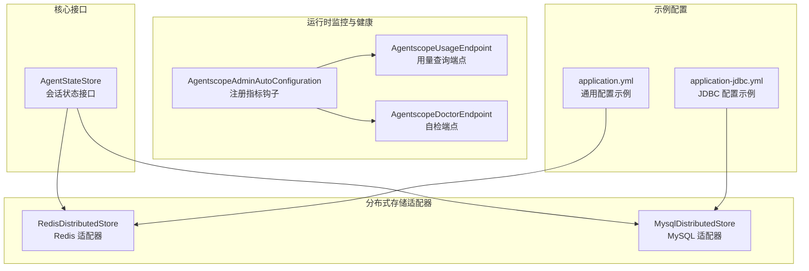
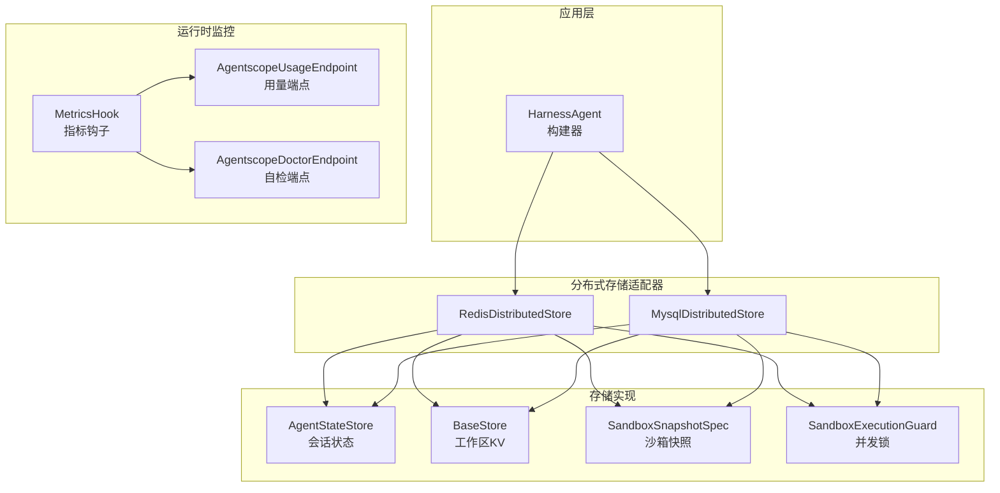
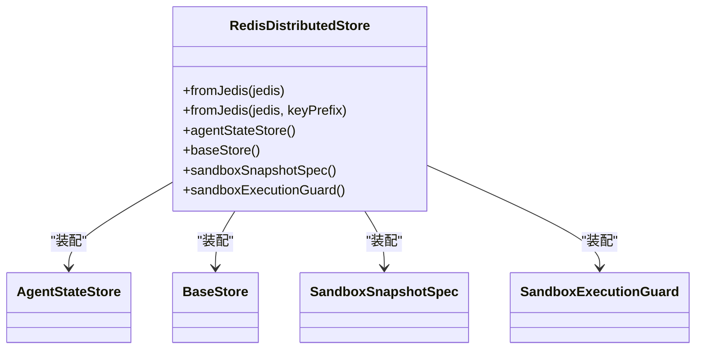
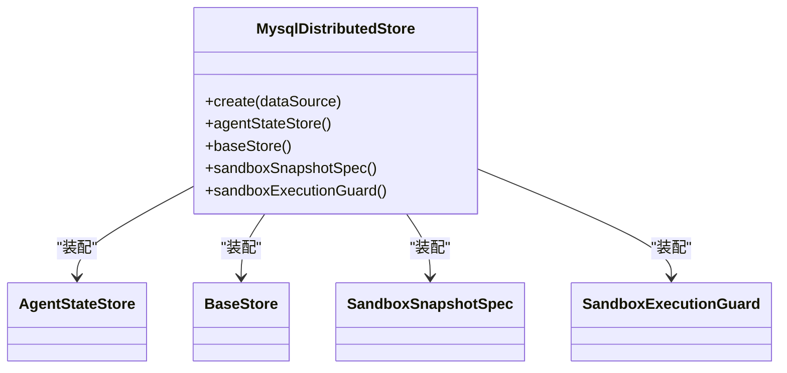
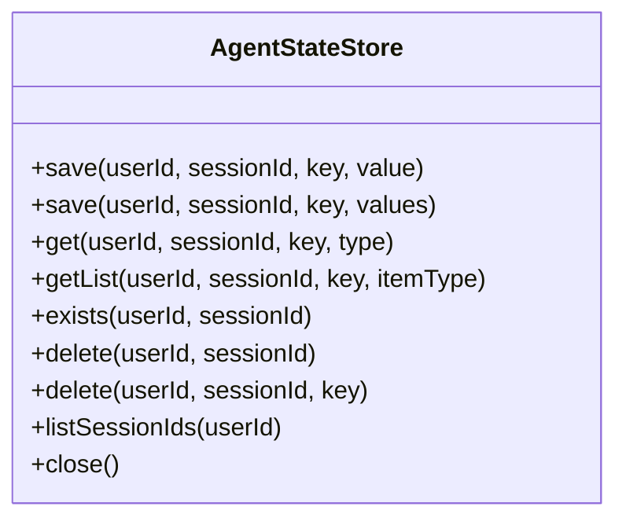
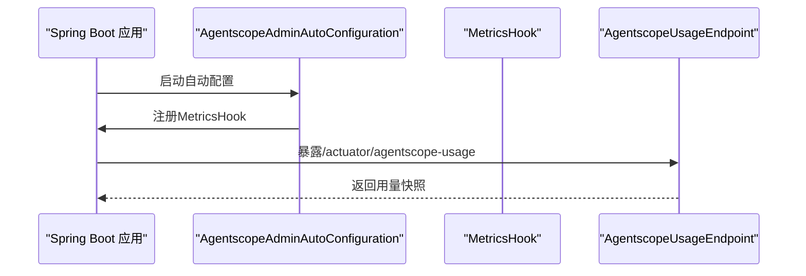
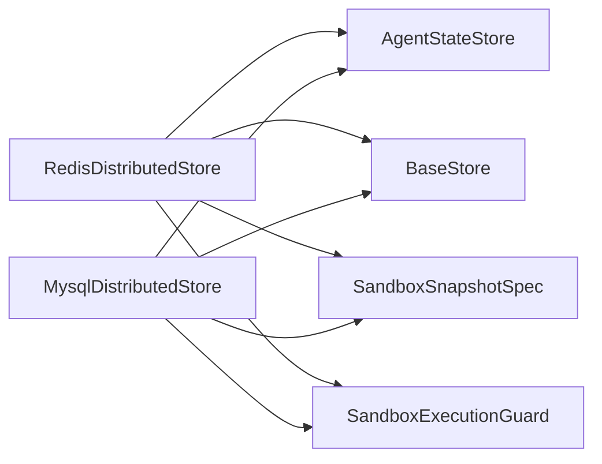
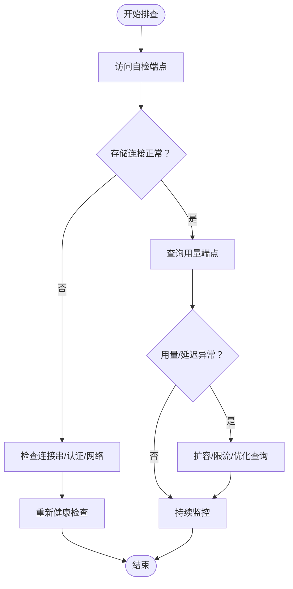

# 存储配置与管理

<cite>
**本文引用的文件**
- [MysqlDistributedStore.java](file://agentscope-extensions/agentscope-extensions-mysql/src/main/java/io/agentscope/extensions/mysql/MysqlDistributedStore.java)
- [RedisDistributedStore.java](file://agentscope-extensions/agentscope-extensions-redis/src/main/java/io/agentscope/extensions/redis/RedisDistributedStore.java)
- [AgentStateStore.java](file://agentscope-core/src/main/java/io/agentscope/core/state/AgentStateStore.java)
- [going-to-production.md](file://docs/v2/zh/docs/others/going-to-production.md)
- [JedisAgentStateStore.java](file://agentscope-extensions/agentscope-extensions-redis/src/main/java/io/agentscope/extensions/redis/state/jedis/JedisAgentStateStore.java)
- [AgentscopeAdminAutoConfiguration.java](file://agentscope-extensions/agentscope-spring-boot-starters/agentscope-admin-spring-boot-starter/src/main/java/io/agentscope/spring/boot/admin/AgentscopeAdminAutoConfiguration.java)
- [AgentscopeUsageEndpoint.java](file://agentscope-extensions/agentscope-spring-boot-starters/agentscope-admin-spring-boot-starter/src/main/java/io/agentscope/spring/boot/admin/endpoint/AgentscopeUsageEndpoint.java)
- [UsageStats.java](file://agentscope-extensions/agentscope-spring-boot-starters/agentscope-admin-spring-boot-starter/src/main/java/io/agentscope/spring/boot/admin/metrics/UsageStats.java)
- [MetricsRecorderTest.java](file://agentscope-extensions/agentscope-spring-boot-starters/agentscope-admin-spring-boot-starter/src/test/java/io/agentscope/spring/boot/admin/metrics/MetricsRecorderTest.java)
- [UsageStore.java](file://agentscope-examples/agents/agentscope-builder/src/main/java/io/agentscope/builder/web/usage/UsageStore.java)
- [AgentscopeDoctorEndpoint.java](file://agentscope-extensions/agentscope-spring-boot-starters/agentscope-admin-spring-boot-starter/src/main/java/io/agentscope/spring/boot/admin/endpoint/AgentscopeDoctorEndpoint.java)
- [application.yml（示例）](file://agentscope-examples/agents/agentscope-builder/src/main/resources/application.yml)
- [application-jdbc.yml（示例）](file://agentscope-examples/agents/agentscope-builder/src/main/resources/application-jdbc.yml)
</cite>

## 目录
1. [简介](#简介)
2. [项目结构](#项目结构)
3. [核心组件](#核心组件)
4. [架构总览](#架构总览)
5. [详细组件分析](#详细组件分析)
6. [依赖分析](#依赖分析)
7. [性能考虑](#性能考虑)
8. [故障排查指南](#故障排查指南)
9. [结论](#结论)
10. [附录](#附录)

## 简介
本文件面向AgentScope Java的存储配置与管理，系统性梳理分布式存储后端（Redis、MySQL/JDBC）、工作区KV存储（BaseStore）、沙箱快照与并发控制、监控与健康检查、以及迁移与回滚策略。文档以代码为依据，结合官方生产指南，帮助读者完成从配置到运维的全链路实践。

## 项目结构
围绕“分布式存储”主题，相关模块主要分布在以下位置：
- 分布式存储适配器：agentscope-extensions-redis、agentscope-extensions-mysql
- 核心状态接口：agentscope-core/state
- 生产指南与使用说明：docs/v2/zh/docs/others/going-to-production.md
- 运行时监控与健康检查：agentscope-spring-boot-starters/agentscope-admin-spring-boot-starter
- 示例应用配置：agentscope-examples/.../resources/application*.yml

图示来源
- [AgentStateStore.java:1-167](file://agentscope-core/src/main/java/io/agentscope/core/state/AgentStateStore.java#L1-L167)
- [RedisDistributedStore.java:1-110](file://agentscope-extensions/agentscope-extensions-redis/src/main/java/io/agentscope/extensions/redis/RedisDistributedStore.java#L1-L110)
- [MysqlDistributedStore.java:1-92](file://agentscope-extensions/agentscope-extensions-mysql/src/main/java/io/agentscope/extensions/mysql/MysqlDistributedStore.java#L1-L92)
- [AgentscopeAdminAutoConfiguration.java:211-253](file://agentscope-extensions/agentscope-spring-boot-starters/agentscope-admin-spring-boot-starter/src/main/java/io/agentscope/spring/boot/admin/AgentscopeAdminAutoConfiguration.java#L211-L253)
- [AgentscopeUsageEndpoint.java:36-58](file://agentscope-extensions/agentscope-spring-boot-starters/agentscope-admin-spring-boot-starter/src/main/java/io/agentscope/spring/boot/admin/endpoint/AgentscopeUsageEndpoint.java#L36-L58)
- [AgentscopeDoctorEndpoint.java:29-50](file://agentscope-extensions/agentscope-spring-boot-starters/agentscope-admin-spring-boot-starter/src/main/java/io/agentscope/spring/boot/admin/endpoint/AgentscopeDoctorEndpoint.java#L29-L50)
- [application.yml（示例）](file://agentscope-examples/agents/agentscope-builder/src/main/resources/application.yml)
- [application-jdbc.yml（示例）](file://agentscope-examples/agents/agentscope-builder/src/main/resources/application-jdbc.yml)

章节来源
- [RedisDistributedStore.java:1-110](file://agentscope-extensions/agentscope-extensions-redis/src/main/java/io/agentscope/extensions/redis/RedisDistributedStore.java#L1-L110)
- [MysqlDistributedStore.java:1-92](file://agentscope-extensions/agentscope-extensions-mysql/src/main/java/io/agentscope/extensions/mysql/MysqlDistributedStore.java#L1-L92)
- [AgentStateStore.java:1-167](file://agentscope-core/src/main/java/io/agentscope/core/state/AgentStateStore.java#L1-L167)
- [going-to-production.md:143-197](file://docs/v2/zh/docs/others/going-to-production.md#L143-L197)

## 核心组件
- 分布式存储适配器
  - RedisDistributedStore：基于Jedis统一客户端，提供会话状态、工作区KV、沙箱快照与并发锁能力。
  - MysqlDistributedStore：基于DataSource，提供会话状态、工作区KV、沙箱快照与并发锁能力。
- 会话状态接口AgentStateStore：抽象会话状态的保存、加载、删除、列表等操作。
- 运行时监控与健康检查：通过Spring Boot Actuator扩展端点，提供用量统计与自检能力。

章节来源
- [RedisDistributedStore.java:30-110](file://agentscope-extensions/agentscope-extensions-redis/src/main/java/io/agentscope/extensions/redis/RedisDistributedStore.java#L30-L110)
- [MysqlDistributedStore.java:30-92](file://agentscope-extensions/agentscope-extensions-mysql/src/main/java/io/agentscope/extensions/mysql/MysqlDistributedStore.java#L30-L92)
- [AgentStateStore.java:22-167](file://agentscope-core/src/main/java/io/agentscope/core/state/AgentStateStore.java#L22-L167)
- [AgentscopeAdminAutoConfiguration.java:211-253](file://agentscope-extensions/agentscope-spring-boot-starters/agentscope-admin-spring-boot-starter/src/main/java/io/agentscope/spring/boot/admin/AgentscopeAdminAutoConfiguration.java#L211-L253)

## 架构总览
下图展示分布式存储在AgentScope中的角色与交互：分布式存储适配器统一注入会话状态、工作区KV、沙箱快照与并发控制；运行时通过监控与健康端点观测系统状态。

图示来源
- [RedisDistributedStore.java:56-109](file://agentscope-extensions/agentscope-extensions-redis/src/main/java/io/agentscope/extensions/redis/RedisDistributedStore.java#L56-L109)
- [MysqlDistributedStore.java:54-91](file://agentscope-extensions/agentscope-extensions-mysql/src/main/java/io/agentscope/extensions/mysql/MysqlDistributedStore.java#L54-L91)
- [AgentscopeAdminAutoConfiguration.java:211-253](file://agentscope-extensions/agentscope-spring-boot-starters/agentscope-admin-spring-boot-starter/src/main/java/io/agentscope/spring/boot/admin/AgentscopeAdminAutoConfiguration.java#L211-L253)

## 详细组件分析

### 组件A：RedisDistributedStore（Redis 后端）
- 角色与职责
  - 提供统一入口，装配AgentStateStore、BaseStore、SandboxSnapshotSpec、SandboxExecutionGuard。
  - 支持自定义键前缀，便于多环境隔离。
- 关键行为
  - 会话状态：使用Redis键空间存储会话状态。
  - 工作区KV：通过Redis键空间承载远程文件系统命名空间。
  - 沙箱快照：将快照以二进制形式存入Redis。
  - 并发控制：基于Redis分布式锁保障沙箱执行并发安全。
- 连接与认证
  - 使用UnifiedJedis客户端，支持标准Redis连接字符串与密码认证。
- 性能与特性
  - 列表变更采用哈希检测与增量追加策略，降低写放大。
  - 支持Lua原子CAS与前缀扫描，满足高并发场景。

图示来源
- [RedisDistributedStore.java:56-109](file://agentscope-extensions/agentscope-extensions-redis/src/main/java/io/agentscope/extensions/redis/RedisDistributedStore.java#L56-L109)

章节来源
- [RedisDistributedStore.java:30-110](file://agentscope-extensions/agentscope-extensions-redis/src/main/java/io/agentscope/extensions/redis/RedisDistributedStore.java#L30-L110)
- [JedisAgentStateStore.java:102-134](file://agentscope-extensions/agentscope-extensions-redis/src/main/java/io/agentscope/extensions/redis/state/jedis/JedisAgentStateStore.java#L102-L134)

### 组件B：MysqlDistributedStore（MySQL/JDBC 后端）
- 角色与职责
  - 基于DataSource提供会话状态、工作区KV、沙箱快照与并发锁。
  - 支持自动初始化Schema，简化部署。
- 关键行为
  - 会话状态：持久化会话状态至关系型数据库。
  - 工作区KV：通过JDBC实现键值存储。
  - 沙箱快照：将快照以BLOB形式存入数据库。
  - 并发控制：利用GET_LOCK()实现分布式锁。
- 连接与认证
  - 通过DataSource配置JDBC连接串、用户名与密码等。
- 性能与特性
  - 单语句CAS更新，适合已有关系型基础设施或需要联表查询的场景。

图示来源
- [MysqlDistributedStore.java:54-91](file://agentscope-extensions/agentscope-extensions-mysql/src/main/java/io/agentscope/extensions/mysql/MysqlDistributedStore.java#L54-L91)

章节来源
- [MysqlDistributedStore.java:30-92](file://agentscope-extensions/agentscope-extensions-mysql/src/main/java/io/agentscope/extensions/mysql/MysqlDistributedStore.java#L30-L92)

### 组件C：AgentStateStore（会话状态接口）
- 角色与职责
  - 定义会话状态的保存、加载、删除、列表等操作。
  - 对用户ID与会话ID进行统一建模，支持匿名与多租户场景。
- 行为要点
  - 支持单值与列表两类状态保存。
  - 列表保存策略由实现决定（如增量追加或全量替换）。
  - 提供会话存在性检查与清理能力。

图示来源
- [AgentStateStore.java:61-167](file://agentscope-core/src/main/java/io/agentscope/core/state/AgentStateStore.java#L61-L167)

章节来源
- [AgentStateStore.java:22-167](file://agentscope-core/src/main/java/io/agentscope/core/state/AgentStateStore.java#L22-L167)

### 组件D：监控与健康检查（Admin Starter）
- 指标钩子注册
  - 在系统启动时注册MetricsHook，用于采集调用次数、输入/输出/总计Token等指标。
- 用量查询端点
  - 提供全局与按Agent/模型维度的用量快照查询。
- 自检端点
  - 提供部署健康度的自我诊断，补充Spring Boot默认健康检查。

图示来源
- [AgentscopeAdminAutoConfiguration.java:211-253](file://agentscope-extensions/agentscope-spring-boot-starters/agentscope-admin-spring-boot-starter/src/main/java/io/agentscope/spring/boot/admin/AgentscopeAdminAutoConfiguration.java#L211-L253)
- [AgentscopeUsageEndpoint.java:36-58](file://agentscope-extensions/agentscope-spring-boot-starters/agentscope-admin-spring-boot-starter/src/main/java/io/agentscope/spring/boot/admin/endpoint/AgentscopeUsageEndpoint.java#L36-L58)

章节来源
- [AgentscopeAdminAutoConfiguration.java:211-253](file://agentscope-extensions/agentscope-spring-boot-starters/agentscope-admin-spring-boot-starter/src/main/java/io/agentscope/spring/boot/admin/AgentscopeAdminAutoConfiguration.java#L211-L253)
- [AgentscopeUsageEndpoint.java:36-58](file://agentscope-extensions/agentscope-spring-boot-starters/agentscope-admin-spring-boot-starter/src/main/java/io/agentscope/spring/boot/admin/endpoint/AgentscopeUsageEndpoint.java#L36-L58)
- [UsageStats.java:18-30](file://agentscope-extensions/agentscope-spring-boot-starters/agentscope-admin-spring-boot-starter/src/main/java/io/agentscope/spring/boot/admin/metrics/UsageStats.java#L18-L30)
- [MetricsRecorderTest.java:26-65](file://agentscope-extensions/agentscope-spring-boot-starters/agentscope-admin-spring-boot-starter/src/test/java/io/agentscope/spring/boot/admin/metrics/MetricsRecorderTest.java#L26-L65)

## 依赖分析
- 组件耦合
  - 分布式存储适配器对具体实现（Redis/JDBC）解耦，通过DistributedStore接口向上提供统一能力。
  - AgentStateStore作为核心接口，被Redis与MySQL实现分别覆盖。
- 外部依赖
  - Redis：Jedis客户端；MySQL：DataSource（HikariCP/Druid等常见实现）。
- 可能的循环依赖
  - 适配器与实现之间为单向依赖，未见循环。

图示来源
- [RedisDistributedStore.java:56-109](file://agentscope-extensions/agentscope-extensions-redis/src/main/java/io/agentscope/extensions/redis/RedisDistributedStore.java#L56-L109)
- [MysqlDistributedStore.java:54-91](file://agentscope-extensions/agentscope-extensions-mysql/src/main/java/io/agentscope/extensions/mysql/MysqlDistributedStore.java#L54-L91)

章节来源
- [RedisDistributedStore.java:30-110](file://agentscope-extensions/agentscope-extensions-redis/src/main/java/io/agentscope/extensions/redis/RedisDistributedStore.java#L30-L110)
- [MysqlDistributedStore.java:30-92](file://agentscope-extensions/agentscope-extensions-mysql/src/main/java/io/agentscope/extensions/mysql/MysqlDistributedStore.java#L30-L92)

## 性能考虑
- 选择策略
  - Redis：高频小KV、强一致需求、多副本共享优先；注意内存与带宽成本。
  - MySQL：已有关系型基础设施、需要联表或审计、事务一致性优先。
- 连接与认证
  - Redis：连接字符串含主机、端口、密码；可配置超时与池大小。
  - MySQL：通过DataSource配置URL、用户名、密码、连接池参数。
- 监控指标
  - 全局与按Agent/模型维度的调用量、Token消耗等。
- 网络与资源
  - 将存储置于内网或同可用区；为连接池设置合理上限与空闲回收策略。
- 成本效益
  - Redis适合热数据与低延迟；MySQL适合冷热混合与合规审计。

章节来源
- [going-to-production.md:143-197](file://docs/v2/zh/docs/others/going-to-production.md#L143-L197)
- [AgentscopeUsageEndpoint.java:36-58](file://agentscope-extensions/agentscope-spring-boot-starters/agentscope-admin-spring-boot-starter/src/main/java/io/agentscope/spring/boot/admin/endpoint/AgentscopeUsageEndpoint.java#L36-L58)

## 故障排查指南
- 健康检查
  - 使用自检端点评估部署状态，定位存储连通性与权限问题。
- 指标观测
  - 通过用量端点核对调用趋势与Token消耗异常。
- 常见问题
  - Redis：连接失败、认证错误、键空间冲突（检查key前缀）。
  - MySQL：连接池耗尽、DDL未初始化、GET_LOCK()超时。
- 回滚策略
  - 通过快照与历史版本回退；对并发控制与快照存储做好备份。

图示来源
- [AgentscopeDoctorEndpoint.java:29-50](file://agentscope-extensions/agentscope-spring-boot-starters/agentscope-admin-spring-boot-starter/src/main/java/io/agentscope/spring/boot/admin/endpoint/AgentscopeDoctorEndpoint.java#L29-L50)
- [AgentscopeUsageEndpoint.java:36-58](file://agentscope-extensions/agentscope-spring-boot-starters/agentscope-admin-spring-boot-starter/src/main/java/io/agentscope/spring/boot/admin/endpoint/AgentscopeUsageEndpoint.java#L36-L58)

章节来源
- [AgentscopeDoctorEndpoint.java:29-50](file://agentscope-extensions/agentscope-spring-boot-starters/agentscope-admin-spring-boot-starter/src/main/java/io/agentscope/spring/boot/admin/endpoint/AgentscopeDoctorEndpoint.java#L29-L50)
- [AgentscopeUsageEndpoint.java:36-58](file://agentscope-extensions/agentscope-spring-boot-starters/agentscope-admin-spring-boot-starter/src/main/java/io/agentscope/spring/boot/admin/endpoint/AgentscopeUsageEndpoint.java#L36-L58)

## 结论
- 选择Redis还是MySQL取决于业务特征：Redis偏向低延迟与高并发KV，MySQL偏向关系型生态与一致性。
- 通过分布式存储适配器统一接入，配合监控与健康检查，可实现可观测、可回滚、可扩展的存储体系。
- 建议在生产中结合官方指南进行容量规划、网络隔离与资源限制，并定期演练迁移与回滚流程。

## 附录

### A. 存储后端配置要点
- Redis
  - 连接字符串与认证：通过Jedis客户端配置。
  - 键前缀：可通过适配器设置，避免多环境冲突。
- MySQL
  - 连接串与凭证：通过DataSource配置。
  - Schema初始化：适配器支持自动初始化。
- 示例配置
  - application.yml与application-jdbc.yml提供参考路径。

章节来源
- [RedisDistributedStore.java:66-85](file://agentscope-extensions/agentscope-extensions-redis/src/main/java/io/agentscope/extensions/redis/RedisDistributedStore.java#L66-L85)
- [MysqlDistributedStore.java:68-70](file://agentscope-extensions/agentscope-extensions-mysql/src/main/java/io/agentscope/extensions/mysql/MysqlDistributedStore.java#L68-L70)
- [application.yml（示例）](file://agentscope-examples/agents/agentscope-builder/src/main/resources/application.yml)
- [application-jdbc.yml（示例）](file://agentscope-examples/agents/agentscope-builder/src/main/resources/application-jdbc.yml)

### B. 存储选择策略与成本评估
- 选择策略
  - 高频小KV、多副本共享：优先Redis。
  - 已有关系型基础设施、需要联表/审计：优先MySQL。
- 成本评估
  - Redis：内存成本较高，适合热数据；网络带宽需关注。
  - MySQL：存储成本较低，适合冷热混合；需评估查询复杂度与索引开销。

章节来源
- [going-to-production.md:143-197](file://docs/v2/zh/docs/others/going-to-production.md#L143-L197)

### C. 迁移指南与回滚策略
- 迁移步骤
  - 评估数据形态与规模，区分高频KV与大对象。
  - 使用适配器提供的分布式存储能力进行数据迁移。
  - 对并发控制与快照存储做好备份。
- 回滚策略
  - 快照与历史版本回退；确保并发控制与快照存储具备可恢复性。

章节来源
- [going-to-production.md:143-197](file://docs/v2/zh/docs/others/going-to-production.md#L143-L197)

### D. 监控指标与健康检查
- 指标
  - 调用次数、输入/输出/总计Token、按Agent/模型聚合。
- 健康检查
  - 自检端点评估部署健康度，辅助定位存储与并发问题。

章节来源
- [AgentscopeUsageEndpoint.java:36-58](file://agentscope-extensions/agentscope-spring-boot-starters/agentscope-admin-spring-boot-starter/src/main/java/io/agentscope/spring/boot/admin/endpoint/AgentscopeUsageEndpoint.java#L36-L58)
- [AgentscopeDoctorEndpoint.java:29-50](file://agentscope-extensions/agentscope-spring-boot-starters/agentscope-admin-spring-boot-starter/src/main/java/io/agentscope/spring/boot/admin/endpoint/AgentscopeDoctorEndpoint.java#L29-L50)

### E. 安全配置与网络优化
- 安全
  - Redis：启用密码认证、TLS、最小权限网络访问。
  - MySQL：使用只读账号用于查询、限制IP白名单。
- 网络优化
  - 同可用区部署、连接池参数调优、批量写入与压缩策略。

章节来源
- [going-to-production.md:143-197](file://docs/v2/zh/docs/others/going-to-production.md#L143-L197)

### F. 扩展与自定义开发指南
- 自定义DistributedStore
  - 实现DistributedStore接口，装配AgentStateStore、BaseStore、SandboxSnapshotSpec、SandboxExecutionGuard。
- 最佳实践
  - 明确命名空间与键前缀；实现幂等与重试；完善监控与告警。

章节来源
- [RedisDistributedStore.java:56-109](file://agentscope-extensions/agentscope-extensions-redis/src/main/java/io/agentscope/extensions/redis/RedisDistributedStore.java#L56-L109)
- [MysqlDistributedStore.java:54-91](file://agentscope-extensions/agentscope-extensions-mysql/src/main/java/io/agentscope/extensions/mysql/MysqlDistributedStore.java#L54-L91)