# 扩展模块

<cite>
**本文引用的文件**
- [agentscope-extensions/pom.xml](file://agentscope-extensions/pom.xml)
- [agentscope-extensions/agentscope-extensions-channel/pom.xml](file://agentscope-extensions/agentscope-extensions-channel/pom.xml)
- [agentscope-extensions/agentscope-extensions-mysql/pom.xml](file://agentscope-extensions/agentscope-extensions-mysql/pom.xml)
- [agentscope-extensions/agentscope-extensions-redis/pom.xml](file://agentscope-extensions/agentscope-extensions-redis/pom.xml)
- [agentscope-extensions/agentscope-extensions-oss/pom.xml](file://agentscope-extensions/agentscope-extensions-oss/pom.xml)
- [agentscope-extensions/agentscope-extensions-rag/pom.xml](file://agentscope-extensions/agentscope-extensions-rag/pom.xml)
- [MysqlDistributedStore.java](file://agentscope-extensions/agentscope-extensions-mysql/src/main/java/io/agentscope/extensions/mysql/MysqlDistributedStore.java)
- [RedisDistributedStore.java](file://agentscope-extensions/agentscope-extensions-redis/src/main/java/io/agentscope/extensions/redis/RedisDistributedStore.java)
</cite>

## 目录
1. [简介](#简介)
2. [项目结构](#项目结构)
3. [核心组件](#核心组件)
4. [架构总览](#架构总览)
5. [详细组件分析](#详细组件分析)
6. [依赖分析](#依赖分析)
7. [性能考虑](#性能考虑)
8. [故障排查指南](#故障排查指南)
9. [结论](#结论)
10. [附录](#附录)

## 简介
本文件面向AgentScope Java的扩展模块，系统性梳理agentscope-extensions模块的整体设计与扩展机制，重点覆盖以下方面：
- 存储扩展：Redis分布式存储、MySQL数据库存储、OSS对象存储的实现与配置要点
- RAG扩展：多RAG服务提供商（如百炼、Dify、RAGFlow、Haystack、Simple）的集成思路
- 通道集成扩展：对接钉钉、飞书、企业微信等即时通讯渠道的适配器模式
- Spring Boot集成扩展：Starter的使用方式与装配流程
- 配置示例、性能对比与使用场景建议
- 扩展开发指南与自定义扩展实现方法

## 项目结构
agentscope-extensions作为聚合模块，通过多个子模块提供不同领域的扩展能力。其顶层POM声明了所有子模块，形成清晰的分层与职责划分。

```mermaid
graph TB
root["agentscope-extensions<br/>聚合模块"] --> mysql["agentscope-extensions-mysql<br/>MySQL/JDBC分布式存储"]
root --> redis["agentscope-extensions-redis<br/>Redis分布式存储"]
root --> oss["agentscope-extensions-oss<br/>阿里云OSS对象存储"]
root --> rag["agentscope-extensions-rag<br/>RAG集成多提供商"]
root --> channel["agentscope-extensions-channel<br/>通道适配器钉钉/飞书/企业微信/GitHub/GitLab"]
root --> spring_boot["agentscope-spring-boot-starters<br/>Spring Boot Starter集合"]
root --> protocol["agentscope-extensions-protocol<br/>协议与网关相关扩展"]
root --> mem["agentscope-extensions-mem<br/>记忆/状态管理扩展"]
root --> nacos["agentscope-extensions-nacos<br/>Nacos配置/提示/技能扩展"]
root --> skills["agentscope-extensions-skills<br/>工具仓库扩展"]
root --> studio["agentscope-extensions-studio<br/>Studio相关扩展"]
root --> scheduler["agentscope-extensions-scheduler<br/>调度器扩展"]
root --> training["agentscope-extensions-training<br/>训练相关扩展"]
root --> sandbox["agentscope-extensions-sandbox<br/>沙箱扩展"]
```

图表来源
- [agentscope-extensions/pom.xml:33-49](file://agentscope-extensions/pom.xml#L33-L49)

章节来源
- [agentscope-extensions/pom.xml:33-49](file://agentscope-extensions/pom.xml#L33-L49)

## 核心组件
本节聚焦于三大核心扩展：Redis分布式存储、MySQL数据库存储与OSS对象存储。它们均遵循统一的分布式存储接口，提供会话状态、工作区KV存储、沙箱快照与并发控制等能力。

- Redis分布式存储
  - 统一入口类：RedisDistributedStore
  - 能力覆盖：会话状态、工作区KV、沙箱快照、沙箱执行守卫
  - 关键依赖：Jedis、Lettuce、Redisson
- MySQL分布式存储
  - 统一入口类：MysqlDistributedStore
  - 能力覆盖：会话状态、工作区KV、沙箱快照、分布式锁
  - 关键依赖：JDBC数据源（HikariCP/Druid等）
- OSS对象存储
  - 统一入口类：OSS Store（在POM中声明）
  - 能力覆盖：对象存储作为工作区或快照后端
  - 关键依赖：阿里云OSS SDK

章节来源
- [agentscope-extensions/agentscope-extensions-redis/pom.xml:33-61](file://agentscope-extensions/agentscope-extensions-redis/pom.xml#L33-L61)
- [agentscope-extensions/agentscope-extensions-mysql/pom.xml:33-53](file://agentscope-extensions/agentscope-extensions-mysql/pom.xml#L33-L53)
- [agentscope-extensions/agentscope-extensions-oss/pom.xml:33-54](file://agentscope-extensions/agentscope-extensions-oss/pom.xml#L33-L54)

## 架构总览
下图展示扩展模块与核心框架及外部系统的交互关系，突出分布式存储、通道适配器与Spring Boot Starter的集成点。

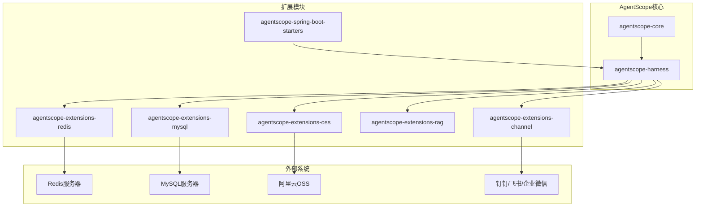

图表来源
- [agentscope-extensions/pom.xml:33-49](file://agentscope-extensions/pom.xml#L33-L49)
- [agentscope-extensions/agentscope-extensions-redis/pom.xml:33-61](file://agentscope-extensions/agentscope-extensions-redis/pom.xml#L33-L61)
- [agentscope-extensions/agentscope-extensions-mysql/pom.xml:33-53](file://agentscope-extensions/agentscope-extensions-mysql/pom.xml#L33-L53)
- [agentscope-extensions/agentscope-extensions-oss/pom.xml:33-54](file://agentscope-extensions/agentscope-extensions-oss/pom.xml#L33-L54)

## 详细组件分析

### Redis分布式存储组件
RedisDistributedStore提供“一键式”分布式配置，基于Jedis客户端自动装配会话状态、工作区KV、沙箱快照与并发控制。

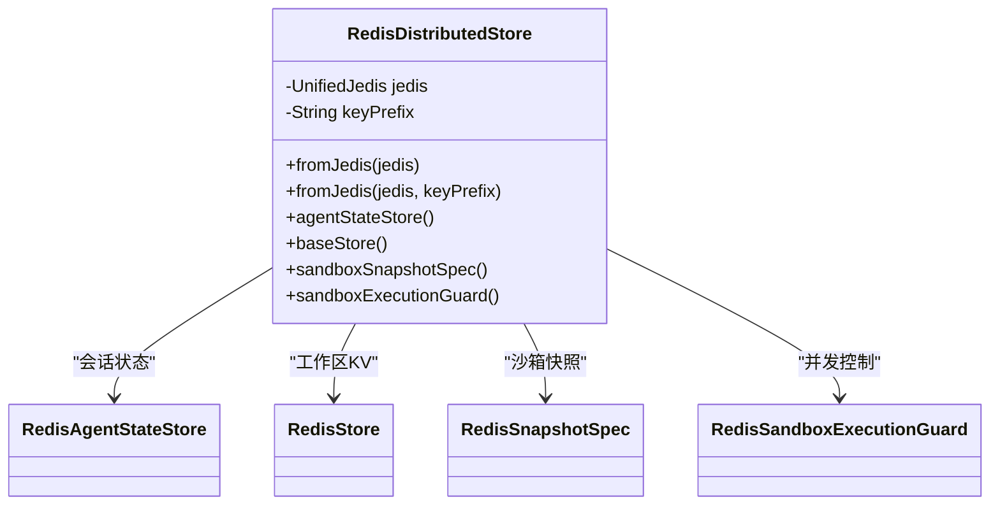

图表来源
- [RedisDistributedStore.java:56-109](file://agentscope-extensions/agentscope-extensions-redis/src/main/java/io/agentscope/extensions/redis/RedisDistributedStore.java#L56-L109)

使用流程（序列图）

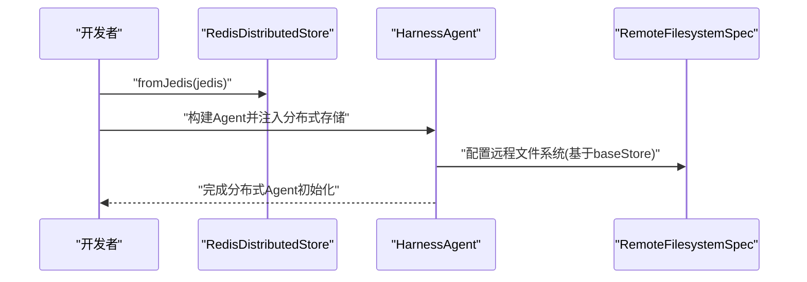

图表来源
- [RedisDistributedStore.java:34-46](file://agentscope-extensions/agentscope-extensions-redis/src/main/java/io/agentscope/extensions/redis/RedisDistributedStore.java#L34-L46)

章节来源
- [RedisDistributedStore.java:30-109](file://agentscope-extensions/agentscope-extensions-redis/src/main/java/io/agentscope/extensions/redis/RedisDistributedStore.java#L30-L109)
- [agentscope-extensions/agentscope-extensions-redis/pom.xml:33-61](file://agentscope-extensions/agentscope-extensions-redis/pom.xml#L33-L61)

### MySQL分布式存储组件
MysqlDistributedStore以JDBC数据源为核心，提供会话状态、工作区KV、沙箱快照与GET_LOCK()分布式锁。

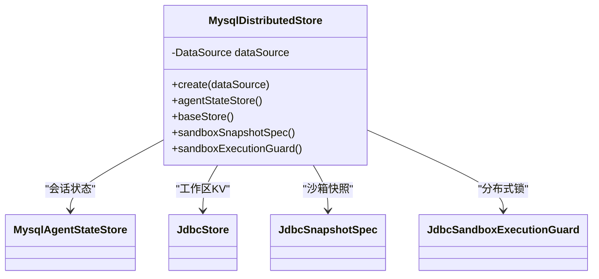

图表来源
- [MysqlDistributedStore.java:54-91](file://agentscope-extensions/agentscope-extensions-mysql/src/main/java/io/agentscope/extensions/mysql/MysqlDistributedStore.java#L54-L91)

使用流程（序列图）

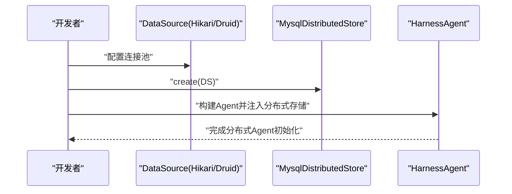

图表来源
- [MysqlDistributedStore.java:33-44](file://agentscope-extensions/agentscope-extensions-mysql/src/main/java/io/agentscope/extensions/mysql/MysqlDistributedStore.java#L33-L44)

章节来源
- [MysqlDistributedStore.java:30-91](file://agentscope-extensions/agentscope-extensions-mysql/src/main/java/io/agentscope/extensions/mysql/MysqlDistributedStore.java#L30-L91)
- [agentscope-extensions/agentscope-extensions-mysql/pom.xml:33-53](file://agentscope-extensions/agentscope-extensions-mysql/pom.xml#L33-L53)

### OSS对象存储组件
OSS扩展通过阿里云OSS SDK提供对象存储能力，可作为工作区或快照的后端。

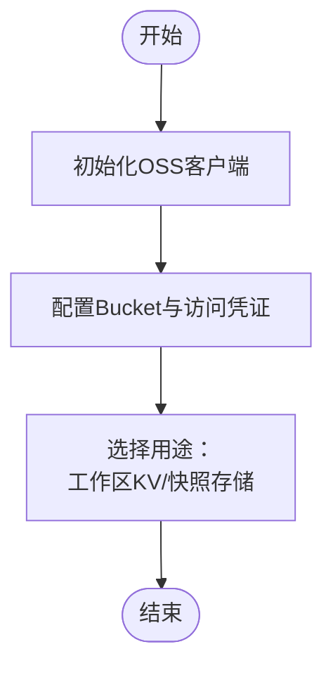

图表来源
- [agentscope-extensions/agentscope-extensions-oss/pom.xml:48-53](file://agentscope-extensions/agentscope-extensions-oss/pom.xml#L48-L53)

章节来源
- [agentscope-extensions/agentscope-extensions-oss/pom.xml:33-54](file://agentscope-extensions/agentscope-extensions-oss/pom.xml#L33-L54)

### RAG扩展组件
RAG模块采用多提供商聚合结构，便于按需引入不同RAG服务（百炼、Dify、RAGFlow、Haystack、Simple），统一接入AgentScope的检索与知识管理能力。

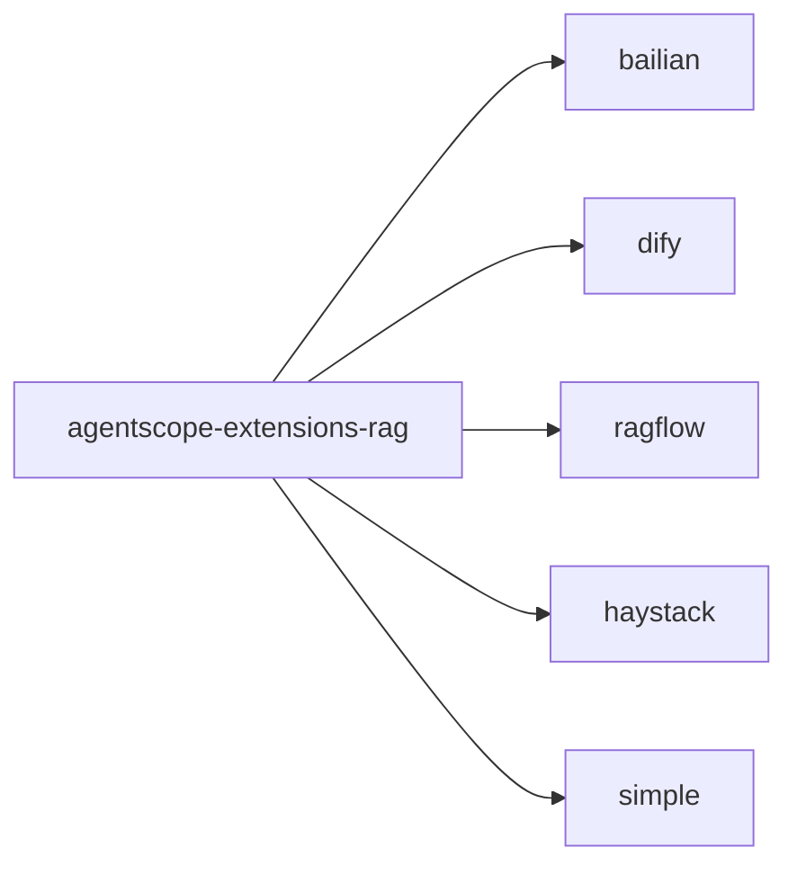

图表来源
- [agentscope-extensions/agentscope-extensions-rag/pom.xml:34-40](file://agentscope-extensions/agentscope-extensions-rag/pom.xml#L34-L40)

章节来源
- [agentscope-extensions/agentscope-extensions-rag/pom.xml:28-40](file://agentscope-extensions/agentscope-extensions-rag/pom.xml#L28-L40)

### 通道集成扩展组件
通道模块提供对多种即时通讯平台的适配器，便于在不同渠道上与AgentScope进行消息互通。

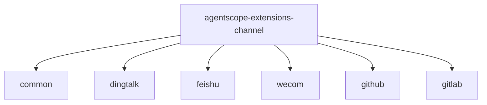

图表来源
- [agentscope-extensions/agentscope-extensions-channel/pom.xml:33-40](file://agentscope-extensions/agentscope-extensions-channel/pom.xml#L33-L40)

章节来源
- [agentscope-extensions/agentscope-extensions-channel/pom.xml:28-40](file://agentscope-extensions/agentscope-extensions-channel/pom.xml#L28-L40)

### Spring Boot集成扩展组件
Spring Boot Starter集合用于简化扩展模块在Spring生态中的装配与配置，降低接入成本。

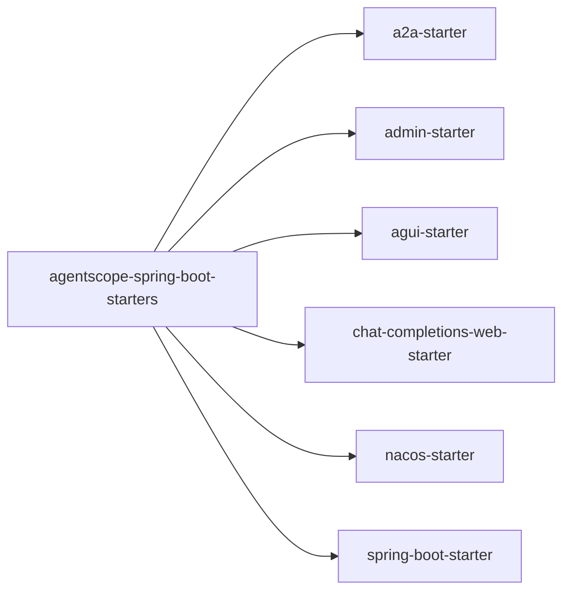

图表来源
- [agentscope-extensions/pom.xml:34](file://agentscope-extensions/pom.xml#L34)

章节来源
- [agentscope-extensions/pom.xml:29-31](file://agentscope-extensions/pom.xml#L29-L31)

## 依赖分析
- 模块内聚与耦合
  - 各存储扩展均实现统一的DistributedStore接口，具备高内聚、低耦合特性
  - 与agentscope-core与agentscope-harness保持松耦合，仅通过接口契约交互
- 外部依赖
  - Redis扩展依赖Jedis/Lettuce/Redisson；MySQL扩展依赖JDBC数据源；OSS扩展依赖阿里云OSS SDK
- 可能的循环依赖
  - 当前结构为单向依赖（扩展模块依赖核心与夹具），未见循环依赖迹象

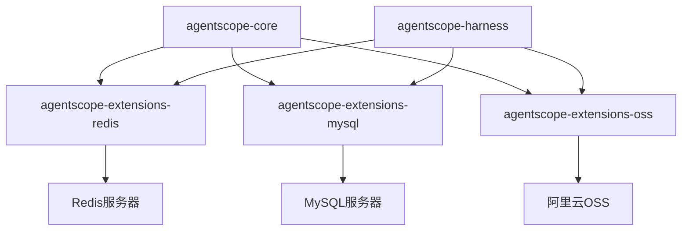

图表来源
- [agentscope-extensions/agentscope-extensions-redis/pom.xml:33-61](file://agentscope-extensions/agentscope-extensions-redis/pom.xml#L33-L61)
- [agentscope-extensions/agentscope-extensions-mysql/pom.xml:33-53](file://agentscope-extensions/agentscope-extensions-mysql/pom.xml#L33-L53)
- [agentscope-extensions/agentscope-extensions-oss/pom.xml:33-54](file://agentscope-extensions/agentscope-extensions-oss/pom.xml#L33-L54)

## 性能考虑
- Redis
  - 优点：低延迟、高吞吐、原子操作丰富，适合高并发下的会话状态与快照存储
  - 注意：合理设置key前缀与过期策略，避免热Key与内存膨胀
- MySQL
  - 优点：强一致、成熟稳定、易于运维与备份
  - 注意：合理设计索引与分区，避免长事务与热点表；使用连接池优化并发
- OSS
  - 优点：高可用、低成本、弹性扩展
  - 注意：分片上传/下载策略、CDN加速与签名URL的安全性

## 故障排查指南
- 连接失败
  - Redis：检查地址、认证与网络连通性；确认key前缀与权限
  - MySQL：核对连接串、账号权限与防火墙；确认驱动版本兼容性
  - OSS：校验AccessKey、Bucket与Endpoint；确认网络策略与跨域配置
- 并发冲突
  - Redis：关注分布式锁实现与超时重试策略
  - MySQL：使用GET_LOCK()或应用层锁，避免死锁
- 数据不一致
  - 核查事务边界与幂等设计；对关键写入增加校验与补偿机制

## 结论
agentscope-extensions通过模块化设计与统一接口，为AgentScope提供了可插拔的分布式存储、RAG集成、通道适配与Spring Boot集成能力。在实际落地中，应结合业务规模与SLA要求选择合适的后端，并配套完善的监控与运维体系。

## 附录
- 配置示例与最佳实践
  - Redis：推荐使用连接池与合理的key前缀；启用持久化与主从复制
  - MySQL：建议使用分区表与只读副本；开启慢查询日志与性能分析
  - OSS：建议开启版本控制与生命周期管理；对敏感对象启用加密
- 使用场景建议
  - Redis：高并发、低延迟、临时数据场景
  - MySQL：需要强一致与复杂查询的场景
  - OSS：大文件、静态资源与归档数据场景
- 扩展开发指南
  - 实现DistributedStore接口，提供AgentStateStore、BaseStore、SandboxSnapshotSpec与SandboxExecutionGuard
  - 编写单元测试与集成测试，覆盖异常路径与边界条件
  - 提供最小可运行示例与配置文档，便于用户快速上手