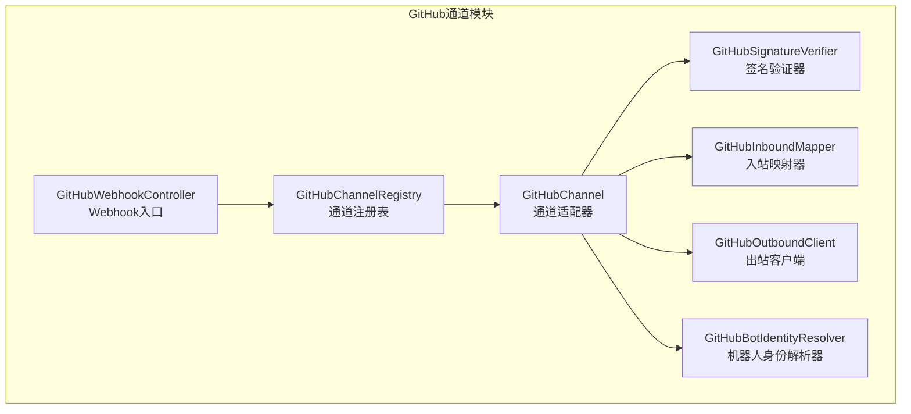
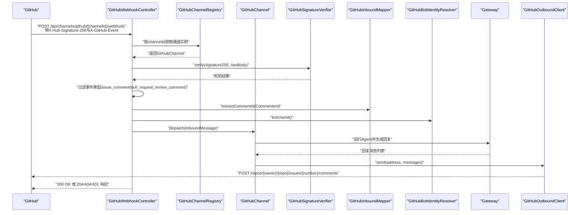
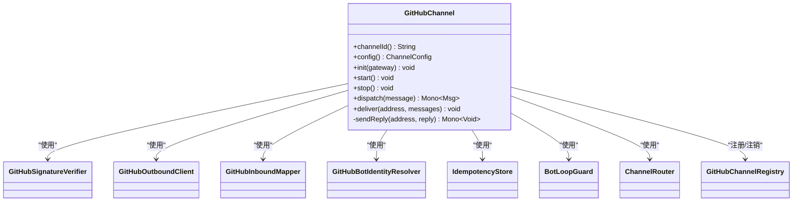
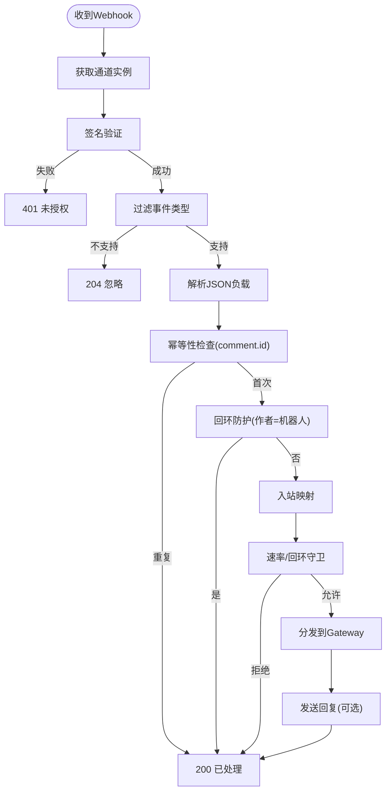
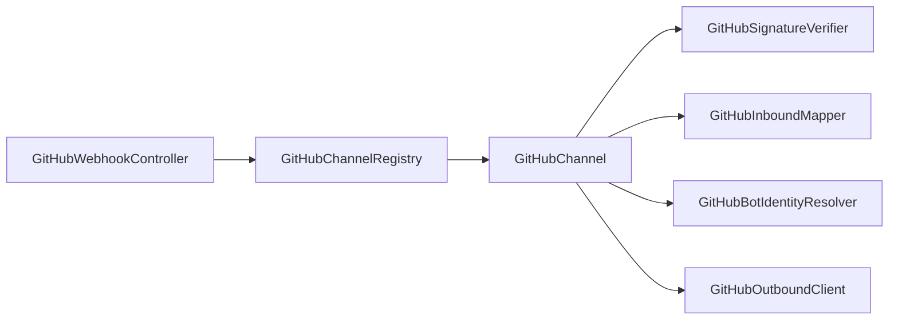

# GitHub集成

<cite>
**本文引用的文件**
- [GitHubChannel.java](file://agentscope-extensions/agentscope-extensions-channel/agentscope-extensions-channel-github/src/main/java/io/agentscope/extensions/channel/github/GitHubChannel.java)
- [GitHubChannelProperties.java](file://agentscope-extensions/agentscope-extensions-channel/agentscope-extensions-channel-github/src/main/java/io/agentscope/extensions/channel/github/GitHubChannelProperties.java)
- [GitHubWebhookController.java](file://agentscope-extensions/agentscope-extensions-channel/agentscope-extensions-channel-github/src/main/java/io/agentscope/extensions/channel/github/GitHubWebhookController.java)
- [GitHubSignatureVerifier.java](file://agentscope-extensions/agentscope-extensions-channel/agentscope-extensions-channel-github/src/main/java/io/agentscope/extensions/channel/github/GitHubSignatureVerifier.java)
- [GitHubInboundMapper.java](file://agentscope-extensions/agentscope-extensions-channel/agentscope-extensions-channel-github/src/main/java/io/agentscope/extensions/channel/github/GitHubInboundMapper.java)
- [GitHubOutboundClient.java](file://agentscope-extensions/agentscope-extensions-channel/agentscope-extensions-channel-github/src/main/java/io/agentscope/extensions/channel/github/GitHubOutboundClient.java)
- [GitHubBotIdentityResolver.java](file://agentscope-extensions/agentscope-extensions-channel/agentscope-extensions-channel-github/src/main/java/io/agentscope/extensions/channel/github/GitHubBotIdentityResolver.java)
- [GitHubChannelRegistry.java](file://agentscope-extensions/agentscope-extensions-channel/agentscope-extensions-channel-github/src/main/java/io/agentscope/extensions/channel/github/GitHubChannelRegistry.java)
- [GitHubWebhookHandler.java](file://agentscope-examples/agents/agentscope-codingagent/src/main/java/io/agentscope/harness/coding/webhook/github/GitHubWebhookHandler.java)
- [GitHubWebhookSignatureTest.java](file://agentscope-examples/agents/agentscope-codingagent/src/test/java/io/agentscope/harness/coding/webhook/github/GitHubWebhookSignatureTest.java)
</cite>

## 目录
1. [简介](#简介)
2. [项目结构](#项目结构)
3. [核心组件](#核心组件)
4. [架构总览](#架构总览)
5. [详细组件分析](#详细组件分析)
6. [依赖关系分析](#依赖关系分析)
7. [性能考量](#性能考量)
8. [故障排查指南](#故障排查指南)
9. [结论](#结论)
10. [附录：配置与调试](#附录配置与调试)

## 简介
本文件面向在AgentScope中集成GitHub通道的开发者，系统性阐述GitHub Webhook事件处理、签名验证、机器人身份解析与回环防护机制；并给出入站消息映射器、出站客户端、签名验证器的实现要点与最佳实践。文档同时覆盖配置参数、Webhook密钥、事件过滤规则、入站到出站的消息映射流程、以及调试与排障建议。

## 项目结构
GitHub通道相关代码位于扩展模块中，采用“通道适配器 + 控制器 + 验证器 + 映射器 + 出站客户端 + 身份解析器”的分层设计，并通过注册表进行进程内路由。

图示来源
- [GitHubChannel.java:1-221](file://agentscope-extensions/agentscope-extensions-channel/agentscope-extensions-channel-github/src/main/java/io/agentscope/extensions/channel/github/GitHubChannel.java#L1-L221)
- [GitHubWebhookController.java:1-155](file://agentscope-extensions/agentscope-extensions-channel/agentscope-extensions-channel-github/src/main/java/io/agentscope/extensions/channel/github/GitHubWebhookController.java#L1-L155)
- [GitHubSignatureVerifier.java:1-78](file://agentscope-extensions/agentscope-extensions-channel/agentscope-extensions-channel-github/src/main/java/io/agentscope/extensions/channel/github/GitHubSignatureVerifier.java#L1-L78)
- [GitHubInboundMapper.java:1-128](file://agentscope-extensions/agentscope-extensions-channel/agentscope-extensions-channel-github/src/main/java/io/agentscope/extensions/channel/github/GitHubInboundMapper.java#L1-L128)
- [GitHubOutboundClient.java:1-135](file://agentscope-extensions/agentscope-extensions-channel/agentscope-extensions-channel-github/src/main/java/io/agentscope/extensions/channel/github/GitHubOutboundClient.java#L1-L135)
- [GitHubBotIdentityResolver.java:1-101](file://agentscope-extensions/agentscope-extensions-channel/agentscope-extensions-channel-github/src/main/java/io/agentscope/extensions/channel/github/GitHubBotIdentityResolver.java#L1-L101)
- [GitHubChannelRegistry.java:1-49](file://agentscope-extensions/agentscope-extensions-channel/agentscope-extensions-channel-github/src/main/java/io/agentscope/extensions/channel/github/GitHubChannelRegistry.java#L1-L49)

章节来源
- [GitHubChannel.java:1-221](file://agentscope-extensions/agentscope-extensions-channel/agentscope-extensions-channel-github/src/main/java/io/agentscope/extensions/channel/github/GitHubChannel.java#L1-L221)
- [GitHubWebhookController.java:1-155](file://agentscope-extensions/agentscope-extensions-channel/agentscope-extensions-channel-github/src/main/java/io/agentscope/extensions/channel/github/GitHubWebhookController.java#L1-L155)

## 核心组件
- 通道适配器（GitHubChannel）：负责生命周期管理、路由分发、出站回复发送、内部组件访问器。
- Webhook控制器（GitHubWebhookController）：接收GitHub Webhook请求，执行签名验证、事件类型过滤、幂等性去重、机器人自循环防护、入站映射与调度。
- 签名验证器（GitHubSignatureVerifier）：基于HMAC-SHA256对原始请求体进行常量时间比较。
- 入站映射器（GitHubInboundMapper）：将issue_comment与pull_request_review_comment事件映射为统一的入站消息模型。
- 出站客户端（GitHubOutboundClient）：向GitHub REST API发布评论，支持线程地址解析与速率限制日志。
- 机器人身份解析器（GitHubBotIdentityResolver）：通过PAT调用GET /user解析机器人用户ID与登录名，用于自循环检测。
- 通道注册表（GitHubChannelRegistry）：进程级单例，按channelId路由到具体通道实例。

章节来源
- [GitHubChannel.java:40-221](file://agentscope-extensions/agentscope-extensions-channel/agentscope-extensions-channel-github/src/main/java/io/agentscope/extensions/channel/github/GitHubChannel.java#L40-L221)
- [GitHubWebhookController.java:44-155](file://agentscope-extensions/agentscope-extensions-channel/agentscope-extensions-channel-github/src/main/java/io/agentscope/extensions/channel/github/GitHubWebhookController.java#L44-L155)
- [GitHubSignatureVerifier.java:29-78](file://agentscope-extensions/agentscope-extensions-channel/agentscope-extensions-channel-github/src/main/java/io/agentscope/extensions/channel/github/GitHubSignatureVerifier.java#L29-L78)
- [GitHubInboundMapper.java:46-128](file://agentscope-extensions/agentscope-extensions-channel/agentscope-extensions-channel-github/src/main/java/io/agentscope/extensions/channel/github/GitHubInboundMapper.java#L46-L128)
- [GitHubOutboundClient.java:40-135](file://agentscope-extensions/agentscope-extensions-channel/agentscope-extensions-channel-github/src/main/java/io/agentscope/extensions/channel/github/GitHubOutboundClient.java#L40-L135)
- [GitHubBotIdentityResolver.java:37-101](file://agentscope-extensions/agentscope-extensions-channel/agentscope-extensions-channel-github/src/main/java/io/agentscope/extensions/channel/github/GitHubBotIdentityResolver.java#L37-L101)
- [GitHubChannelRegistry.java:24-49](file://agentscope-extensions/agentscope-extensions-channel/agentscope-extensions-channel-github/src/main/java/io/agentscope/extensions/channel/github/GitHubChannelRegistry.java#L24-L49)

## 架构总览
下图展示从GitHub Webhook到Agent执行再到GitHub评论回复的端到端流程。

图示来源
- [GitHubWebhookController.java:62-155](file://agentscope-extensions/agentscope-extensions-channel/agentscope-extensions-channel-github/src/main/java/io/agentscope/extensions/channel/github/GitHubWebhookController.java#L62-L155)
- [GitHubChannel.java:150-221](file://agentscope-extensions/agentscope-extensions-channel/agentscope-extensions-channel-github/src/main/java/io/agentscope/extensions/channel/github/GitHubChannel.java#L150-L221)
- [GitHubOutboundClient.java:52-99](file://agentscope-extensions/agentscope-extensions-channel/agentscope-extensions-channel-github/src/main/java/io/agentscope/extensions/channel/github/GitHubOutboundClient.java#L52-L99)

## 详细组件分析

### GitHubChannel（通道适配器）
- 职责
  - 生命周期：启动时注册到注册表并预热机器人身份；停止时注销。
  - 分发：根据路由规则将入站消息交给Gateway执行，并在完成后自动回复。
  - 内部组件：提供签名验证器、入站映射器、机器人身份解析器、幂等存储、回环防护与属性访问器。
- 关键点
  - 使用工厂方法从配置构建各组件，确保一致性与可测试性。
  - 出站回复通过OutboundAddress中的线程标识定位目标仓库与议题/拉取请求编号。

图示来源
- [GitHubChannel.java:40-221](file://agentscope-extensions/agentscope-extensions-channel/agentscope-extensions-channel-github/src/main/java/io/agentscope/extensions/channel/github/GitHubChannel.java#L40-L221)

章节来源
- [GitHubChannel.java:87-108](file://agentscope-extensions/agentscope-extensions-channel/agentscope-extensions-channel-github/src/main/java/io/agentscope/extensions/channel/github/GitHubChannel.java#L87-L108)
- [GitHubChannel.java:132-148](file://agentscope-extensions/agentscope-extensions-channel/agentscope-extensions-channel-github/src/main/java/io/agentscope/extensions/channel/github/GitHubChannel.java#L132-L148)
- [GitHubChannel.java:150-177](file://agentscope-extensions/agentscope-extensions-channel/agentscope-extensions-channel-github/src/main/java/io/agentscope/extensions/channel/github/GitHubChannel.java#L150-L177)
- [GitHubChannel.java:183-205](file://agentscope-extensions/agentscope-extensions-channel/agentscope-extensions-channel-github/src/main/java/io/agentscope/extensions/channel/github/GitHubChannel.java#L183-L205)

### GitHubWebhookController（Webhook入口）
- 处理流程
  1) 通过注册表定位通道实例
  2) 使用签名验证器对原始字节进行HMAC-SHA256校验
  3) 过滤不支持的事件类型，直接返回204
  4) 解析JSON负载，提取评论ID与作者ID
  5) 幂等性：以comment.id作为键，重复则直接返回
  6) 回环防护：若作者ID等于机器人ID，则丢弃
  7) 映射为入站消息，触发路由与执行
  8) 统一返回200 OK（空体），或在异常时记录日志但不暴露错误详情
- 事件过滤
  - 当前MVP仅处理issue_comment与pull_request_review_comment，其他事件返回204

图示来源
- [GitHubWebhookController.java:66-155](file://agentscope-extensions/agentscope-extensions-channel/agentscope-extensions-channel-github/src/main/java/io/agentscope/extensions/channel/github/GitHubWebhookController.java#L66-L155)
- [GitHubInboundMapper.java:58-75](file://agentscope-extensions/agentscope-extensions-channel/agentscope-extensions-channel-github/src/main/java/io/agentscope/extensions/channel/github/GitHubInboundMapper.java#L58-L75)

章节来源
- [GitHubWebhookController.java:78-92](file://agentscope-extensions/agentscope-extensions-channel/agentscope-extensions-channel-github/src/main/java/io/agentscope/extensions/channel/github/GitHubWebhookController.java#L78-L92)
- [GitHubWebhookController.java:105-114](file://agentscope-extensions/agentscope-extensions-channel/agentscope-extensions-channel-github/src/main/java/io/agentscope/extensions/channel/github/GitHubWebhookController.java#L105-L114)
- [GitHubWebhookController.java:116-125](file://agentscope-extensions/agentscope-extensions-channel/agentscope-extensions-channel-github/src/main/java/io/agentscope/extensions/channel/github/GitHubWebhookController.java#L116-L125)
- [GitHubWebhookController.java:127-143](file://agentscope-extensions/agentscope-extensions-channel/agentscope-extensions-channel-github/src/main/java/io/agentscope/extensions/channel/github/GitHubWebhookController.java#L127-L143)

### GitHubSignatureVerifier（签名验证器）
- 输入：HTTP头X-Hub-Signature-256与原始请求体字节数组
- 算法：HMAC-SHA256(secret, body)，输出十六进制字符串，前缀sha256=
- 安全：常量时间字符串比较，避免时序攻击
- 异常：非法输入或算法异常均视为验证失败

章节来源
- [GitHubSignatureVerifier.java:46-65](file://agentscope-extensions/agentscope-extensions-channel/agentscope-extensions-channel-github/src/main/java/io/agentscope/extensions/channel/github/GitHubSignatureVerifier.java#L46-L65)

### GitHubInboundMapper（入站映射器）
- 支持事件
  - issue_comment：议题或拉取请求上的评论（通过payload中的pull_request字段区分）
  - pull_request_review_comment：PR差异上的行内评审评论
- 映射规则
  - 仅处理action=created的事件；编辑/删除在MVP阶段忽略
  - 提取仓库全名、议题/PR编号、评论正文与作者登录名
  - Peer模型：kind=THREAD，peerId="<owner>/<repo>#<number>"
- 幂等键
  - 使用comment.id作为不可变键，确保重复事件被去重

章节来源
- [GitHubInboundMapper.java:82-126](file://agentscope-extensions/agentscope-extensions-channel/agentscope-extensions-channel-github/src/main/java/io/agentscope/extensions/channel/github/GitHubInboundMapper.java#L82-L126)
- [GitHubInboundMapper.java:58-75](file://agentscope-extensions/agentscope-extensions-channel/agentscope-extensions-channel-github/src/main/java/io/agentscope/extensions/channel/github/GitHubInboundMapper.java#L58-L75)

### GitHubOutboundClient（出站客户端）
- 功能：将Agent回复以评论形式发布到GitHub议题或拉取请求
- 地址格式：channelId:thread:<owner>/<repo>#<number>
- 请求：POST /repos/{owner}/{repo}/issues/{number}/comments
- 安全与版本：Authorization: Bearer token、Accept: application/vnd.github+json、Api-Version: 2022-11-28、User-Agent: agentscope-builder
- 错误处理：超时15秒，记录剩余速率限制头信息

章节来源
- [GitHubOutboundClient.java:52-99](file://agentscope-extensions/agentscope-extensions-channel/agentscope-extensions-channel-github/src/main/java/io/agentscope/extensions/channel/github/GitHubOutboundClient.java#L52-L99)
- [GitHubOutboundClient.java:105-131](file://agentscope-extensions/agentscope-extensions-channel/agentscope-extensions-channel-github/src/main/java/io/agentscope/extensions/channel/github/GitHubOutboundClient.java#L105-L131)

### GitHubBotIdentityResolver（机器人身份解析器）
- 用途：在Webhook处理前解析机器人用户ID与登录名，用于回环检测
- 方式：GET /user，使用PAT鉴权，超时10秒；失败仅记录警告，不影响启动
- 缓存：AtomicReference缓存Identity，支持刷新

章节来源
- [GitHubBotIdentityResolver.java:58-85](file://agentscope-extensions/agentscope-extensions-channel/agentscope-extensions-channel-github/src/main/java/io/agentscope/extensions/channel/github/GitHubBotIdentityResolver.java#L58-L85)
- [GitHubBotIdentityResolver.java:87-95](file://agentscope-extensions/agentscope-extensions-channel/agentscope-extensions-channel-github/src/main/java/io/agentscope/extensions/channel/github/GitHubBotIdentityResolver.java#L87-L95)

### GitHubChannelRegistry（通道注册表）
- 单例：进程内全局唯一
- 能力：按channelId注册、注销与查询通道实例
- 作用：Webhook控制器通过此表将URL路由到对应通道

章节来源
- [GitHubChannelRegistry.java:37-47](file://agentscope-extensions/agentscope-extensions-channel/agentscope-extensions-channel-github/src/main/java/io/agentscope/extensions/channel/github/GitHubChannelRegistry.java#L37-L47)

### 示例：GitHubWebhookHandler（对比参考）
- 该处理器展示了另一种实现思路：在独立服务中完成签名验证、去重、事件路由与Agent调度
- 可作为理解签名验证与事件过滤的补充参考

章节来源
- [GitHubWebhookHandler.java:76-131](file://agentscope-examples/agents/agentscope-codingagent/src/main/java/io/agentscope/harness/coding/webhook/github/GitHubWebhookHandler.java#L76-L131)
- [GitHubWebhookHandler.java:311-342](file://agentscope-examples/agents/agentscope-codingagent/src/main/java/io/agentscope/harness/coding/webhook/github/GitHubWebhookHandler.java#L311-L342)

## 依赖关系分析
- 组件耦合
  - GitHubWebhookController强依赖GitHubChannelRegistry；GitHubChannel聚合多个组件并通过内部访问器暴露给控制器
  - 入站映射器与签名验证器、身份解析器均为无状态工具类，便于替换与测试
- 外部依赖
  - Spring WebFlux（Webhook控制器）、Jackson（JSON解析）、WebClient（REST调用）
- 潜在风险
  - 注册表单例与通道生命周期需严格管理，避免并发访问问题
  - 签名验证失败与JSON解析异常需明确区分与记录

图示来源
- [GitHubWebhookController.java:57-60](file://agentscope-extensions/agentscope-extensions-channel/agentscope-extensions-channel-github/src/main/java/io/agentscope/extensions/channel/github/GitHubWebhookController.java#L57-L60)
- [GitHubChannel.java:59-85](file://agentscope-extensions/agentscope-extensions-channel/agentscope-extensions-channel-github/src/main/java/io/agentscope/extensions/channel/github/GitHubChannel.java#L59-L85)

章节来源
- [GitHubChannelRegistry.java:24-49](file://agentscope-extensions/agentscope-extensions-channel/agentscope-extensions-channel-github/src/main/java/io/agentscope/extensions/channel/github/GitHubChannelRegistry.java#L24-L49)
- [GitHubChannel.java:59-85](file://agentscope-extensions/agentscope-extensions-channel/agentscope-extensions-channel-github/src/main/java/io/agentscope/extensions/channel/github/GitHubChannel.java#L59-L85)

## 性能考量
- 异步非阻塞：Webhook控制器与出站客户端基于Spring WebClient与Reactor，适合高并发场景
- 速率限制：出站客户端记录x-ratelimit-remaining头，便于监控与退避策略
- 常量时间比较：签名验证采用常量时间字符串比较，降低侧信道风险
- 启动预热：通道启动时解析机器人身份，避免后续请求中的网络开销

## 故障排查指南
- 401 未授权
  - 检查X-Hub-Signature-256是否正确传递，secret是否与GitHub设置一致
  - 参考单元测试用例验证签名逻辑
- 204 忽略
  - 确认事件类型是否为issue_comment或pull_request_review_comment
- 重复事件
  - 幂等键为comment.id；确认GitHub是否重复投递或本地去重存储异常
- 回环风暴
  - 确认机器人身份解析成功且botUserId已缓存；检查评论作者ID与机器人ID匹配
- 出站失败
  - 查看速率限制头与HTTP状态码；确认PAT权限与仓库可见性
- 日志定位
  - Webhook控制器与出站客户端均记录关键信息，结合channelId与deliveryId快速定位

章节来源
- [GitHubWebhookSignatureTest.java:38-70](file://agentscope-examples/agents/agentscope-codingagent/src/test/java/io/agentscope/harness/coding/webhook/github/GitHubWebhookSignatureTest.java#L38-L70)
- [GitHubWebhookController.java:78-85](file://agentscope-extensions/agentscope-extensions-channel/agentscope-extensions-channel-github/src/main/java/io/agentscope/extensions/channel/github/GitHubWebhookController.java#L78-L85)
- [GitHubOutboundClient.java:88-98](file://agentscope-extensions/agentscope-extensions-channel/agentscope-extensions-channel-github/src/main/java/io/agentscope/extensions/channel/github/GitHubOutboundClient.java#L88-L98)

## 结论
本GitHub通道实现以清晰的职责分离与安全默认值为核心：严格的签名验证、幂等性与回环防护保障了系统的稳健性；统一的入站/出站抽象简化了扩展与维护。生产部署建议配合完善的监控与告警体系，持续优化速率限制与错误恢复策略。

## 附录：配置与调试

### 配置参数（GitHubChannelProperties）
- token：个人访问令牌（PAT），必填；用于REST API调用与身份解析
- webhookSecret：Webhook共享密钥，必填；用于X-Hub-Signature-256验证
- apiBase：GitHub REST API基础地址，默认https://api.github.com；企业版可设为https://github.your-corp.com/api/v3
- webhookPath：Webhook HTTP路径，默认/api/channels/github/{channelId}/webhook
- botUserLogin：机器人登录名（可选）；未设置时启动时通过GET /user自动解析

章节来源
- [GitHubChannelProperties.java:37-79](file://agentscope-extensions/agentscope-extensions-channel/agentscope-extensions-channel-github/src/main/java/io/agentscope/extensions/channel/github/GitHubChannelProperties.java#L37-L79)

### Webhook事件订阅
- 当前MVP支持：
  - issue_comment：议题或PR评论
  - pull_request_review_comment：PR差异行内评审评论
- 其他事件将返回204（忽略）

章节来源
- [GitHubWebhookController.java:88-92](file://agentscope-extensions/agentscope-extensions-channel/agentscope-extensions-channel-github/src/main/java/io/agentscope/extensions/channel/github/GitHubWebhookController.java#L88-L92)

### 签名验证最佳实践
- 使用常量时间比较，避免时序攻击
- 对原始字节进行签名计算，而非文本表示
- 在开发环境可临时关闭校验，但生产必须开启

章节来源
- [GitHubSignatureVerifier.java:46-65](file://agentscope-extensions/agentscope-extensions-channel/agentscope-extensions-channel-github/src/main/java/io/agentscope/extensions/channel/github/GitHubSignatureVerifier.java#L46-L65)
- [GitHubWebhookSignatureTest.java:38-70](file://agentscope-examples/agents/agentscope-codingagent/src/test/java/io/agentscope/harness/coding/webhook/github/GitHubWebhookSignatureTest.java#L38-L70)

### 事件去重与回环防护
- 去重：以comment.id为键，首次出现才处理
- 回环：若评论作者ID等于机器人ID，则丢弃，防止自我触发

章节来源
- [GitHubWebhookController.java:105-125](file://agentscope-extensions/agentscope-extensions-channel/agentscope-extensions-channel-github/src/main/java/io/agentscope/extensions/channel/github/GitHubWebhookController.java#L105-L125)
- [GitHubBotIdentityResolver.java:87-95](file://agentscope-extensions/agentscope-extensions-channel/agentscope-extensions-channel-github/src/main/java/io/agentscope/extensions/channel/github/GitHubBotIdentityResolver.java#L87-L95)

### 机器人身份识别
- 启动时通过PAT调用GET /user解析机器人ID与登录名
- 若提供botUserLogin可跳过网络调用，提升启动速度

章节来源
- [GitHubChannel.java:134-135](file://agentscope-extensions/agentscope-extensions-channel/agentscope-extensions-channel-github/src/main/java/io/agentscope/extensions/channel/github/GitHubChannel.java#L134-L135)
- [GitHubBotIdentityResolver.java:46-52](file://agentscope-extensions/agentscope-extensions-channel/agentscope-extensions-channel-github/src/main/java/io/agentscope/extensions/channel/github/GitHubBotIdentityResolver.java#L46-L52)

### 调试方法
- 开启通道日志：观察启动、去重、回环与回复发送的关键日志
- 使用curl或Postman模拟Webhook请求，携带X-Hub-Signature-256与X-GitHub-Event
- 单元测试：参考签名验证测试用例，验证边界条件（缺失前缀、篡改body、空签名等）

章节来源
- [GitHubWebhookController.java:78-85](file://agentscope-extensions/agentscope-extensions-channel/agentscope-extensions-channel-github/src/main/java/io/agentscope/extensions/channel/github/GitHubWebhookController.java#L78-L85)
- [GitHubWebhookSignatureTest.java:38-70](file://agentscope-examples/agents/agentscope-codingagent/src/test/java/io/agentscope/harness/coding/webhook/github/GitHubWebhookSignatureTest.java#L38-L70)