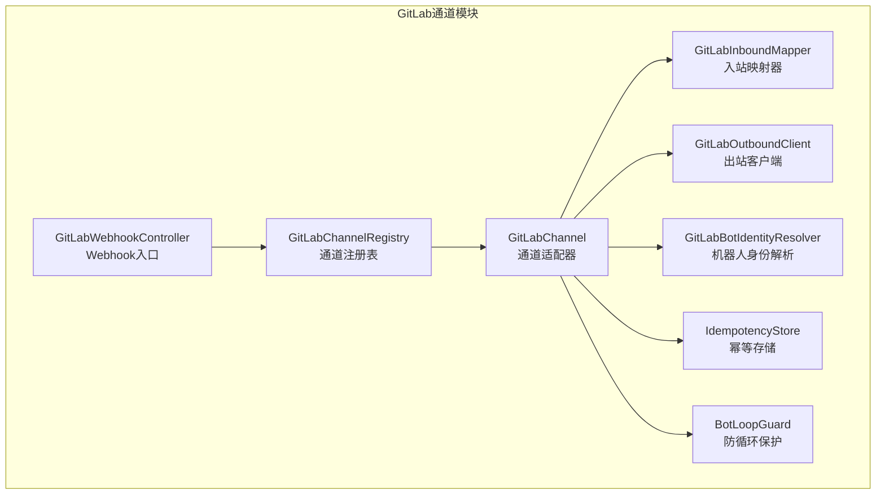
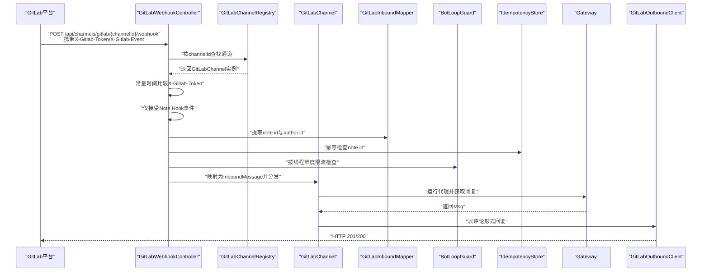
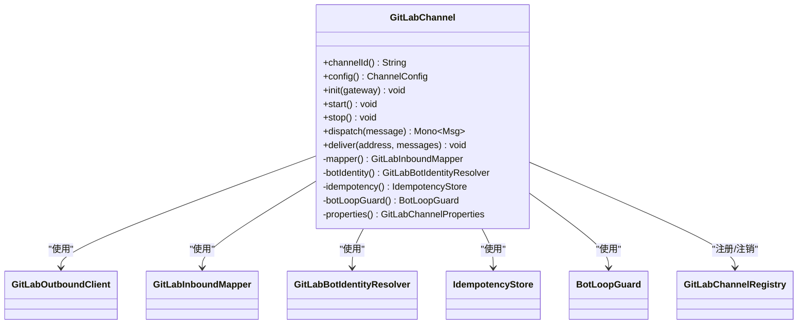
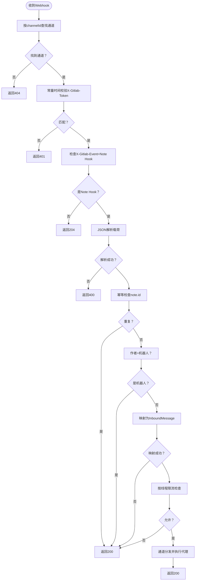
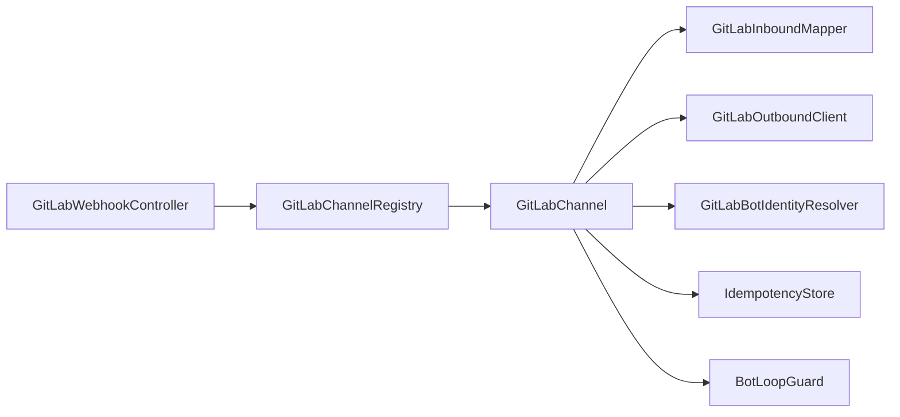

# GitLab集成

<cite>
**本文引用的文件**
- [GitLabChannel.java](file://agentscope-extensions/agentscope-extensions-channel/agentscope-extensions-channel-gitlab/src/main/java/io/agentscope/extensions/channel/gitlab/GitLabChannel.java)
- [GitLabChannelProperties.java](file://agentscope-extensions/agentscope-extensions-channel/agentscope-extensions-channel-gitlab/src/main/java/io/agentscope/extensions/channel/gitlab/GitLabChannelProperties.java)
- [GitLabInboundMapper.java](file://agentscope-extensions/agentscope-extensions-channel/agentscope-extensions-channel-gitlab/src/main/java/io/agentscope/extensions/channel/gitlab/GitLabInboundMapper.java)
- [GitLabOutboundClient.java](file://agentscope-extensions/agentscope-extensions-channel/agentscope-extensions-channel-gitlab/src/main/java/io/agentscope/extensions/channel/gitlab/GitLabOutboundClient.java)
- [GitLabBotIdentityResolver.java](file://agentscope-extensions/agentscope-extensions-channel/agentscope-extensions-channel-gitlab/src/main/java/io/agentscope/extensions/channel/gitlab/GitLabBotIdentityResolver.java)
- [GitLabWebhookController.java](file://agentscope-extensions/agentscope-extensions-channel/agentscope-extensions-channel-gitlab/src/main/java/io/agentscope/extensions/channel/gitlab/GitLabWebhookController.java)
- [GitLabChannelRegistry.java](file://agentscope-extensions/agentscope-extensions-channel/agentscope-extensions-channel-gitlab/src/main/java/io/agentscope/extensions/channel/gitlab/GitLabChannelRegistry.java)
- [BotLoopGuard.java](file://agentscope-extensions/agentscope-extensions-channel/agentscope-extensions-channel-common/src/main/java/io/agentscope/extensions/channel/common/BotLoopGuard.java)
- [IdempotencyStore.java](file://agentscope-extensions/agentscope-extensions-channel/agentscope-extensions-channel-common/src/main/java/io/agentscope/extensions/channel/common/IdempotencyStore.java)
- [GitHubChannel.java](file://agentscope-extensions/agentscope-extensions-channel/agentscope-extensions-channel-github/src/main/java/io/agentscope/extensions/channel/github/GitHubChannel.java)
- [GitHubWebhookController.java](file://agentscope-extensions/agentscope-extensions-channel/agentscope-extensions-channel-github/src/main/java/io/agentscope/extensions/channel/github/GitHubWebhookController.java)
</cite>

## 目录
1. [简介](#简介)
2. [项目结构](#项目结构)
3. [核心组件](#核心组件)
4. [架构总览](#架构总览)
5. [组件详解](#组件详解)
6. [依赖关系分析](#依赖关系分析)
7. [性能与可靠性](#性能与可靠性)
8. [故障排查指南](#故障排查指南)
9. [结论](#结论)
10. [附录：配置与最佳实践](#附录配置与最佳实践)

## 简介
本文件面向在Agentscope中集成GitLab通道的开发者，系统性阐述GitLab Webhook事件处理、项目注册表与机器人身份解析机制；详细说明GitLab应用的配置参数、Webhook密钥与事件过滤规则；并深入解析入站消息映射器、出站客户端与通道注册表的实现细节。同时提供配置示例、事件订阅与调试方法，并总结事件去重、通道注册与机器人身份识别的最佳实践。

## 项目结构
GitLab通道位于扩展模块中，采用“通道适配器 + 控制器 + 映射器 + 出站客户端 + 身份解析 + 注册表 + 通用防护”的分层设计，与GitHub通道保持一致的架构风格。

图示来源
- [GitLabChannel.java:39-102](file://agentscope-extensions/agentscope-extensions-channel/agentscope-extensions-channel-gitlab/src/main/java/io/agentscope/extensions/channel/gitlab/GitLabChannel.java#L39-L102)
- [GitLabWebhookController.java:44-59](file://agentscope-extensions/agentscope-extensions-channel/agentscope-extensions-channel-gitlab/src/main/java/io/agentscope/extensions/channel/gitlab/GitLabWebhookController.java#L44-L59)
- [GitLabInboundMapper.java:42-48](file://agentscope-extensions/agentscope-extensions-channel/agentscope-extensions-channel-gitlab/src/main/java/io/agentscope/extensions/channel/gitlab/GitLabInboundMapper.java#L42-L48)
- [GitLabOutboundClient.java:39-49](file://agentscope-extensions/agentscope-extensions-channel/agentscope-extensions-channel-gitlab/src/main/java/io/agentscope/extensions/channel/gitlab/GitLabOutboundClient.java#L39-L49)
- [GitLabBotIdentityResolver.java:32-44](file://agentscope-extensions/agentscope-extensions-channel/agentscope-extensions-channel-gitlab/src/main/java/io/agentscope/extensions/channel/gitlab/GitLabBotIdentityResolver.java#L32-L44)
- [GitLabChannelRegistry.java:24-35](file://agentscope-extensions/agentscope-extensions-channel/agentscope-extensions-channel-gitlab/src/main/java/io/agentscope/extensions/channel/gitlab/GitLabChannelRegistry.java#L24-L35)
- [IdempotencyStore.java:30-39](file://agentscope-extensions/agentscope-extensions-channel/agentscope-extensions-channel-common/src/main/java/io/agentscope/extensions/channel/common/IdempotencyStore.java#L30-L39)
- [BotLoopGuard.java:29-39](file://agentscope-extensions/agentscope-extensions-channel/agentscope-extensions-channel-common/src/main/java/io/agentscope/extensions/channel/common/BotLoopGuard.java#L29-L39)

章节来源
- [GitLabChannel.java:1-210](file://agentscope-extensions/agentscope-extensions-channel/agentscope-extensions-channel-gitlab/src/main/java/io/agentscope/extensions/channel/gitlab/GitLabChannel.java#L1-L210)
- [GitLabWebhookController.java:1-159](file://agentscope-extensions/agentscope-extensions-channel/agentscope-extensions-channel-gitlab/src/main/java/io/agentscope/extensions/channel/gitlab/GitLabWebhookController.java#L1-L159)
- [GitLabInboundMapper.java:1-120](file://agentscope-extensions/agentscope-extensions-channel/agentscope-extensions-channel-gitlab/src/main/java/io/agentscope/extensions/channel/gitlab/GitLabInboundMapper.java#L1-L120)
- [GitLabOutboundClient.java:1-128](file://agentscope-extensions/agentscope-extensions-channel/agentscope-extensions-channel-gitlab/src/main/java/io/agentscope/extensions/channel/gitlab/GitLabOutboundClient.java#L1-L128)
- [GitLabBotIdentityResolver.java:1-90](file://agentscope-extensions/agentscope-extensions-channel/agentscope-extensions-channel-gitlab/src/main/java/io/agentscope/extensions/channel/gitlab/GitLabBotIdentityResolver.java#L1-L90)
- [GitLabChannelRegistry.java:1-49](file://agentscope-extensions/agentscope-extensions-channel/agentscope-extensions-channel-gitlab/src/main/java/io/agentscope/extensions/channel/gitlab/GitLabChannelRegistry.java#L1-L49)
- [IdempotencyStore.java:1-96](file://agentscope-extensions/agentscope-extensions-channel/agentscope-extensions-channel-common/src/main/java/io/agentscope/extensions/channel/common/IdempotencyStore.java#L1-L96)
- [BotLoopGuard.java:1-95](file://agentscope-extensions/agentscope-extensions-channel/agentscope-extensions-channel-common/src/main/java/io/agentscope/extensions/channel/common/BotLoopGuard.java#L1-L95)

## 核心组件
- 通道适配器（GitLabChannel）：负责生命周期管理、路由分发、出站回复与内部组件装配。
- 入站映射器（GitLabInboundMapper）：将GitLab Note Hook载荷映射为统一的入站消息模型。
- 出站客户端（GitLabOutboundClient）：通过REST API向指定议题或合并请求回复评论。
- 机器人身份解析器（GitLabBotIdentityResolver）：调用用户接口解析机器人自身ID，用于自对话防护。
- Webhook控制器（GitLabWebhookController）：接收并校验Webhook，执行去重、防循环与事件过滤。
- 通道注册表（GitLabChannelRegistry）：进程级单例，按channelId路由到具体通道实例。
- 幂等存储（IdempotencyStore）：基于键值的去重窗口，避免重复事件处理。
- 防循环保护（BotLoopGuard）：按线程维度的滑动窗口限流，防止机器人被拉入无限交互。

章节来源
- [GitLabChannel.java:39-102](file://agentscope-extensions/agentscope-extensions-channel/agentscope-extensions-channel-gitlab/src/main/java/io/agentscope/extensions/channel/gitlab/GitLabChannel.java#L39-L102)
- [GitLabInboundMapper.java:42-118](file://agentscope-extensions/agentscope-extensions-channel/agentscope-extensions-channel-gitlab/src/main/java/io/agentscope/extensions/channel/gitlab/GitLabInboundMapper.java#L42-L118)
- [GitLabOutboundClient.java:39-126](file://agentscope-extensions/agentscope-extensions-channel/agentscope-extensions-channel-gitlab/src/main/java/io/agentscope/extensions/channel/gitlab/GitLabOutboundClient.java#L39-L126)
- [GitLabBotIdentityResolver.java:32-84](file://agentscope-extensions/agentscope-extensions-channel/agentscope-extensions-channel-gitlab/src/main/java/io/agentscope/extensions/channel/gitlab/GitLabBotIdentityResolver.java#L32-L84)
- [GitLabWebhookController.java:44-146](file://agentscope-extensions/agentscope-extensions-channel/agentscope-extensions-channel-gitlab/src/main/java/io/agentscope/extensions/channel/gitlab/GitLabWebhookController.java#L44-L146)
- [GitLabChannelRegistry.java:24-47](file://agentscope-extensions/agentscope-extensions-channel/agentscope-extensions-channel-gitlab/src/main/java/io/agentscope/extensions/channel/gitlab/GitLabChannelRegistry.java#L24-L47)
- [IdempotencyStore.java:30-67](file://agentscope-extensions/agentscope-extensions-channel/agentscope-extensions-channel-common/src/main/java/io/agentscope/extensions/channel/common/IdempotencyStore.java#L30-L67)
- [BotLoopGuard.java:29-77](file://agentscope-extensions/agentscope-extensions-channel/agentscope-extensions-channel-common/src/main/java/io/agentscope/extensions/channel/common/BotLoopGuard.java#L29-L77)

## 架构总览
下图展示从Webhook入口到消息分发与回复的端到端流程。

图示来源
- [GitLabWebhookController.java:61-146](file://agentscope-extensions/agentscope-extensions-channel/agentscope-extensions-channel-gitlab/src/main/java/io/agentscope/extensions/channel/gitlab/GitLabWebhookController.java#L61-L146)
- [GitLabChannelRegistry.java:45-47](file://agentscope-extensions/agentscope-extensions-channel/agentscope-extensions-channel-gitlab/src/main/java/io/agentscope/extensions/channel/gitlab/GitLabChannelRegistry.java#L45-L47)
- [GitLabChannel.java:144-154](file://agentscope-extensions/agentscope-extensions-channel/agentscope-extensions-channel-gitlab/src/main/java/io/agentscope/extensions/channel/gitlab/GitLabChannel.java#L144-L154)
- [GitLabInboundMapper.java:72-118](file://agentscope-extensions/agentscope-extensions-channel/agentscope-extensions-channel-gitlab/src/main/java/io/agentscope/extensions/channel/gitlab/GitLabInboundMapper.java#L72-L118)
- [BotLoopGuard.java:55-77](file://agentscope-extensions/agentscope-extensions-channel/agentscope-extensions-channel-common/src/main/java/io/agentscope/extensions/channel/common/BotLoopGuard.java#L55-L77)
- [IdempotencyStore.java:56-67](file://agentscope-extensions/agentscope-extensions-channel/agentscope-extensions-channel-common/src/main/java/io/agentscope/extensions/channel/common/IdempotencyStore.java#L56-L67)
- [GitLabOutboundClient.java:52-84](file://agentscope-extensions/agentscope-extensions-channel/agentscope-extensions-channel-gitlab/src/main/java/io/agentscope/extensions/channel/gitlab/GitLabOutboundClient.java#L52-L84)

## 组件详解

### GitLabChannel 通道适配器
- 角色与职责
  - 生命周期：启动时注册到注册表并刷新机器人身份；停止时从注册表注销。
  - 分发：根据路由配置将入站消息交给网关执行，再将回复通过出站客户端发送。
  - 内部访问器：对外暴露映射器、身份解析器、幂等存储、防循环保护与属性对象，供控制器使用。
- 关键行为
  - 使用ChannelRouter进行上下文与目标地址解析。
  - 出站回复通过GitLabOutboundClient异步发送，并记录错误日志。

图示来源
- [GitLabChannel.java:39-102](file://agentscope-extensions/agentscope-extensions-channel/agentscope-extensions-channel-gitlab/src/main/java/io/agentscope/extensions/channel/gitlab/GitLabChannel.java#L39-L102)
- [GitLabChannel.java:144-208](file://agentscope-extensions/agentscope-extensions-channel/agentscope-extensions-channel-gitlab/src/main/java/io/agentscope/extensions/channel/gitlab/GitLabChannel.java#L144-L208)

章节来源
- [GitLabChannel.java:39-210](file://agentscope-extensions/agentscope-extensions-channel/agentscope-extensions-channel-gitlab/src/main/java/io/agentscope/extensions/channel/gitlab/GitLabChannel.java#L39-L210)

### GitLabWebhookController Webhook入口
- 请求路径：/api/channels/gitlab/{channelId}/webhook
- 校验与过滤
  - 常量时间比较X-Gitlab-Token与通道配置的webhookToken。
  - 仅接受事件类型为Note Hook；其他类型直接返回204。
  - JSON解析失败返回400。
- 处理流程
  - 幂等：基于note.id进行去重。
  - 自对话防护：当作者ID等于机器人ID时丢弃。
  - 映射：将有效载荷映射为InboundMessage。
  - 限流：按线程维度的滑动窗口限制速率。
  - 执行：调用通道分发，异常时记录告警但返回成功响应。

图示来源
- [GitLabWebhookController.java:61-146](file://agentscope-extensions/agentscope-extensions-channel/agentscope-extensions-channel-gitlab/src/main/java/io/agentscope/extensions/channel/gitlab/GitLabWebhookController.java#L61-L146)
- [GitLabInboundMapper.java:50-118](file://agentscope-extensions/agentscope-extensions-channel/agentscope-extensions-channel-gitlab/src/main/java/io/agentscope/extensions/channel/gitlab/GitLabInboundMapper.java#L50-L118)
- [IdempotencyStore.java:56-67](file://agentscope-extensions/agentscope-extensions-channel/agentscope-extensions-channel-common/src/main/java/io/agentscope/extensions/channel/common/IdempotencyStore.java#L56-L67)
- [BotLoopGuard.java:55-77](file://agentscope-extensions/agentscope-extensions-channel/agentscope-extensions-channel-common/src/main/java/io/agentscope/extensions/channel/common/BotLoopGuard.java#L55-L77)

章节来源
- [GitLabWebhookController.java:44-159](file://agentscope-extensions/agentscope-extensions-channel/agentscope-extensions-channel-gitlab/src/main/java/io/agentscope/extensions/channel/gitlab/GitLabWebhookController.java#L44-L159)

### GitLabInboundMapper 入站映射器
- 支持的Note类型：Issue与MergeRequest；Commit与Snippet在MVP阶段不支持。
- 过滤条件
  - 忽略系统类变更（如标签、状态变化）。
  - 缺失关键字段（如note、username、path_with_namespace、iid）时丢弃。
- Peer建模
  - 类型：THREAD
  - ID格式："{project.path_with_namespace}#{iid}:{noteable_type}"，其中noteable_type为Issue或MergeRequest。
- 输出：构建包含用户角色、用户名与文本内容的消息，并设置账户ID与发送者ID。

章节来源
- [GitLabInboundMapper.java:27-118](file://agentscope-extensions/agentscope-extensions-channel/agentscope-extensions-channel-gitlab/src/main/java/io/agentscope/extensions/channel/gitlab/GitLabInboundMapper.java#L27-L118)

### GitLabOutboundClient 出站客户端
- 目标URI：/api/v4/projects/{id}/{issues|merge_requests}/{iid}/notes
  - id为URL编码后的project.path_with_namespace。
  - type根据类型选择issues或merge_requests。
- 地址格式：channelId:thread:{path_with_namespace}#{iid}:{Issue|MergeRequest}
- 行为：逐条发送消息为评论；对空文本忽略；超时15秒；记录调试日志。

章节来源
- [GitLabOutboundClient.java:31-126](file://agentscope-extensions/agentscope-extensions-channel/agentscope-extensions-channel-gitlab/src/main/java/io/agentscope/extensions/channel/gitlab/GitLabOutboundClient.java#L31-L126)

### GitLabBotIdentityResolver 机器人身份解析
- 通过GET /user解析当前令牌对应的用户ID与用户名。
- 刷新策略：通道启动时调用一次，后续可通过定时任务或事件触发刷新。
- 用途：自对话检测，避免机器人回复自身产生的评论导致循环。

章节来源
- [GitLabBotIdentityResolver.java:27-84](file://agentscope-extensions/agentscope-extensions-channel/agentscope-extensions-channel-gitlab/src/main/java/io/agentscope/extensions/channel/gitlab/GitLabBotIdentityResolver.java#L27-L84)

### GitLabChannelRegistry 通道注册表
- 单例：进程内唯一实例。
- 功能：按channelId注册/注销/查询GitLabChannel。
- 作用：Webhook控制器依据URL中的channelId定位到具体通道实例。

章节来源
- [GitLabChannelRegistry.java:20-47](file://agentscope-extensions/agentscope-extensions-channel/agentscope-extensions-channel-gitlab/src/main/java/io/agentscope/extensions/channel/gitlab/GitLabChannelRegistry.java#L20-L47)

### 幂等存储与防循环保护
- 幂等存储（IdempotencyStore）
  - 以“通道ID|消息ID”为键，支持TTL与最大容量，自动清理过期与溢出条目。
  - 首次见返回true，重复且未过期返回false。
- 防循环保护（BotLoopGuard）
  - 滑动窗口策略：默认每60秒最多20条事件，超过则进入60秒冷却。
  - 以线程（Peer）为粒度独立计数，避免跨线程干扰。

章节来源
- [IdempotencyStore.java:22-95](file://agentscope-extensions/agentscope-extensions-channel/agentscope-extensions-channel-common/src/main/java/io/agentscope/extensions/channel/common/IdempotencyStore.java#L22-L95)
- [BotLoopGuard.java:22-95](file://agentscope-extensions/agentscope-extensions-channel/agentscope-extensions-channel-common/src/main/java/io/agentscope/extensions/channel/common/BotLoopGuard.java#L22-L95)

### 与GitHub通道的对比参考
- GitHub通道在MVP中支持issue_comment与pull_request_review_comment两类事件，而GitLab通道当前仅支持Note Hook。
- GitHub通道引入了签名验证器（HMAC-SHA256），GitLab通道采用X-Gitlab-Token常量时间比较。
- 两者均实现了幂等与防循环保护，且均通过通道适配器统一调度。

章节来源
- [GitHubChannel.java:35-108](file://agentscope-extensions/agentscope-extensions-channel/agentscope-extensions-channel-github/src/main/java/io/agentscope/extensions/channel/github/GitHubChannel.java#L35-L108)
- [GitHubWebhookController.java:36-153](file://agentscope-extensions/agentscope-extensions-channel/agentscope-extensions-channel-github/src/main/java/io/agentscope/extensions/channel/github/GitHubWebhookController.java#L36-L153)

## 依赖关系分析
- 组件耦合
  - GitLabWebhookController强依赖GitLabChannelRegistry；弱依赖GitLabChannel内部组件（通过访问器）。
  - GitLabChannel聚合多个组件并通过构造注入，降低外部耦合。
- 外部依赖
  - Spring WebFlux WebClient用于HTTP调用。
  - Jackson用于JSON解析。
- 可能的循环依赖
  - 控制器与通道通过注册表解耦，无直接循环依赖风险。

图示来源
- [GitLabWebhookController.java:50-59](file://agentscope-extensions/agentscope-extensions-channel/agentscope-extensions-channel-gitlab/src/main/java/io/agentscope/extensions/channel/gitlab/GitLabWebhookController.java#L50-L59)
- [GitLabChannelRegistry.java:37-47](file://agentscope-extensions/agentscope-extensions-channel/agentscope-extensions-channel-gitlab/src/main/java/io/agentscope/extensions/channel/gitlab/GitLabChannelRegistry.java#L37-L47)
- [GitLabChannel.java:59-101](file://agentscope-extensions/agentscope-extensions-channel/agentscope-extensions-channel-gitlab/src/main/java/io/agentscope/extensions/channel/gitlab/GitLabChannel.java#L59-L101)

章节来源
- [GitLabChannel.java:59-101](file://agentscope-extensions/agentscope-extensions-channel/agentscope-extensions-channel-gitlab/src/main/java/io/agentscope/extensions/channel/gitlab/GitLabChannel.java#L59-L101)
- [GitLabWebhookController.java:50-59](file://agentscope-extensions/agentscope-extensions-channel/agentscope-extensions-channel-gitlab/src/main/java/io/agentscope/extensions/channel/gitlab/GitLabWebhookController.java#L50-L59)
- [GitLabChannelRegistry.java:37-47](file://agentscope-extensions/agentscope-extensions-channel/agentscope-extensions-channel-gitlab/src/main/java/io/agentscope/extensions/channel/gitlab/GitLabChannelRegistry.java#L37-L47)

## 性能与可靠性
- 异步与背压
  - 出站发送采用Reactive方式，避免阻塞；建议结合背压策略与限流控制。
- 超时与重试
  - 出站请求设置15秒超时；可结合指数退避与熔断策略提升鲁棒性。
- 幂等与限流
  - 幂等窗口与防循环保护共同保障系统稳定性，避免抖动与风暴。
- 日志与可观测性
  - 关键路径均有DEBUG/WARN级别日志，便于问题定位与审计。

[本节为通用指导，无需列出章节来源]

## 故障排查指南
- 401 Unauthorized
  - 检查X-Gitlab-Token是否与通道配置的webhookToken一致（常量时间比较）。
  - 章节来源
    - [GitLabWebhookController.java:76-80](file://agentscope-extensions/agentscope-extensions-channel/agentscope-extensions-channel-gitlab/src/main/java/io/agentscope/extensions/channel/gitlab/GitLabWebhookController.java#L76-L80)
- 404 Not Found
  - 确认URL中的channelId与已注册通道一致。
  - 章节来源
    - [GitLabWebhookController.java:70-74](file://agentscope-extensions/agentscope-extensions-channel/agentscope-extensions-channel-gitlab/src/main/java/io/agentscope/extensions/channel/gitlab/GitLabWebhookController.java#L70-L74)
- 204 No Content
  - 当事件类型非Note Hook时返回204，属预期行为。
  - 章节来源
    - [GitLabWebhookController.java:82-85](file://agentscope-extensions/agentscope-extensions-channel/agentscope-extensions-channel-gitlab/src/main/java/io/agentscope/extensions/channel/gitlab/GitLabWebhookController.java#L82-L85)
- 400 Bad Request
  - JSON解析失败，请检查请求体格式。
  - 章节来源
    - [GitLabWebhookController.java:87-96](file://agentscope-extensions/agentscope-extensions-channel/agentscope-extensions-channel-gitlab/src/main/java/io/agentscope/extensions/channel/gitlab/GitLabWebhookController.java#L87-L96)
- 自对话被跳过
  - 若作者ID等于机器人ID，将被防循环保护丢弃。
  - 章节来源
    - [GitLabWebhookController.java:110-118](file://agentscope-extensions/agentscope-extensions-channel/agentscope-extensions-channel-gitlab/src/main/java/io/agentscope/extensions/channel/gitlab/GitLabWebhookController.java#L110-L118)
- 出站失败
  - 查看出站客户端错误日志；确认API基础地址、令牌权限与目标线程是否存在。
  - 章节来源
    - [GitLabOutboundClient.java:161-169](file://agentscope-extensions/agentscope-extensions-channel/agentscope-extensions-channel-gitlab/src/main/java/io/agentscope/extensions/channel/gitlab/GitLabOutboundClient.java#L161-L169)

## 结论
GitLab通道通过清晰的分层设计与完善的防护机制，实现了对Note Hook事件的可靠接入与回复。其配置简洁、扩展性强，适合在多项目场景中复用。建议在生产环境启用幂等与防循环保护，并结合日志与监控持续优化性能与稳定性。

[本节为总结性内容，无需列出章节来源]

## 附录：配置与最佳实践

### 配置参数清单
- gitlab.token
  - 说明：用于REST API调用与机器人身份查询的访问令牌（需具备api范围）。
  - 必填：是
- gitlab.webhookToken
  - 说明：与GitLab项目Webhook配置的共享密钥，用于X-Gitlab-Token校验。
  - 必填：是
- gitlab.apiBase
  - 说明：GitLab REST API基础地址，默认指向公共GitLab实例。
  - 默认：https://gitlab.com/api/v4
- gitlab.webhookPath
  - 说明：Webhook HTTP路径，通常形如/api/channels/gitlab/{channelId}/webhook。
  - 默认：/api/channels/gitlab/{channelId}/webhook

章节来源
- [GitLabChannelProperties.java:21-52](file://agentscope-extensions/agentscope-extensions-channel/agentscope-extensions-channel-gitlab/src/main/java/io/agentscope/extensions/channel/gitlab/GitLabChannelProperties.java#L21-L52)
- [GitLabChannelProperties.java:54-74](file://agentscope-extensions/agentscope-extensions-channel/agentscope-extensions-channel-gitlab/src/main/java/io/agentscope/extensions/channel/gitlab/GitLabChannelProperties.java#L54-L74)

### Webhook事件过滤规则
- 仅接受事件类型为Note Hook。
- 不支持的noteable类型（Commit/Snippet）与系统类变更（object_attributes.system=true）将被忽略。
- 章节来源
  - [GitLabWebhookController.java:82-85](file://agentscope-extensions/agentscope-extensions-channel/agentscope-extensions-channel-gitlab/src/main/java/io/agentscope/extensions/channel/gitlab/GitLabWebhookController.java#L82-L85)
  - [GitLabInboundMapper.java:76-86](file://agentscope-extensions/agentscope-extensions-channel/agentscope-extensions-channel-gitlab/src/main/java/io/agentscope/extensions/channel/gitlab/GitLabInboundMapper.java#L76-L86)

### 事件去重与防循环最佳实践
- 幂等键：使用note.id作为幂等键，确保同一评论多次到达时只处理一次。
- 防循环：在映射前先比对作者ID与机器人ID；若相同则丢弃。
- 限流：按线程维度设置滑动窗口，避免机器人被拉入无限交互。
- 章节来源
  - [GitLabWebhookController.java:98-134](file://agentscope-extensions/agentscope-extensions-channel/agentscope-extensions-channel-gitlab/src/main/java/io/agentscope/extensions/channel/gitlab/GitLabWebhookController.java#L98-L134)
  - [IdempotencyStore.java:56-67](file://agentscope-extensions/agentscope-extensions-channel/agentscope-extensions-channel-common/src/main/java/io/agentscope/extensions/channel/common/IdempotencyStore.java#L56-L67)
  - [BotLoopGuard.java:55-77](file://agentscope-extensions/agentscope-extensions-channel/agentscope-extensions-channel-common/src/main/java/io/agentscope/extensions/channel/common/BotLoopGuard.java#L55-L77)

### 通道注册与生命周期
- 启动：通道注册到注册表并刷新机器人身份。
- 停止：从注册表注销，释放资源。
- 章节来源
  - [GitLabChannel.java:126-141](file://agentscope-extensions/agentscope-extensions-channel/agentscope-extensions-channel-gitlab/src/main/java/io/agentscope/extensions/channel/gitlab/GitLabChannel.java#L126-L141)

### 出站消息格式与目标
- 出站地址格式：channelId:thread:{path_with_namespace}#{iid}:{Issue|MergeRequest}
- 出站客户端会将消息文本转换为评论正文并提交至对应线程。
- 章节来源
  - [GitLabOutboundClient.java:36-38](file://agentscope-extensions/agentscope-extensions-channel/agentscope-extensions-channel-gitlab/src/main/java/io/agentscope/extensions/channel/gitlab/GitLabOutboundClient.java#L36-L38)
  - [GitLabOutboundClient.java:91-124](file://agentscope-extensions/agentscope-extensions-channel/agentscope-extensions-channel-gitlab/src/main/java/io/agentscope/extensions/channel/gitlab/GitLabOutboundClient.java#L91-L124)

### 配置示例（agentscope.json片段）
- channels.<channelId>.type: "gitlab"
- channels.<channelId>.properties.gitlab.token: "<你的GitLab访问令牌>"
- channels.<channelId>.properties.gitlab.webhookToken: "<与Webhook共享密钥一致>"
- channels.<channelId>.properties.gitlab.apiBase: "https://gitlab.example.com/api/v4"
- channels.<channelId>.properties.gitlab.webhookPath: "/api/channels/gitlab/<channelId>/webhook"
- 章节来源
  - [GitLabChannelProperties.java:54-74](file://agentscope-extensions/agentscope-extensions-channel/agentscope-extensions-channel-gitlab/src/main/java/io/agentscope/extensions/channel/gitlab/GitLabChannelProperties.java#L54-L74)

### 调试方法
- 开启DEBUG日志：观察Webhook控制器、映射器、防循环与幂等处理过程。
- 校验令牌：确认X-Gitlab-Token与配置一致（常量时间比较）。
- 验证线程ID：确保出站地址中的peerId格式正确（包含path_with_namespace、iid与类型）。
- 章节来源
  - [GitLabWebhookController.java:109-134](file://agentscope-extensions/agentscope-extensions-channel/agentscope-extensions-channel-gitlab/src/main/java/io/agentscope/extensions/channel/gitlab/GitLabWebhookController.java#L109-L134)
  - [GitLabOutboundClient.java:91-124](file://agentscope-extensions/agentscope-extensions-channel/agentscope-extensions-channel-gitlab/src/main/java/io/agentscope/extensions/channel/gitlab/GitLabOutboundClient.java#L91-L124)