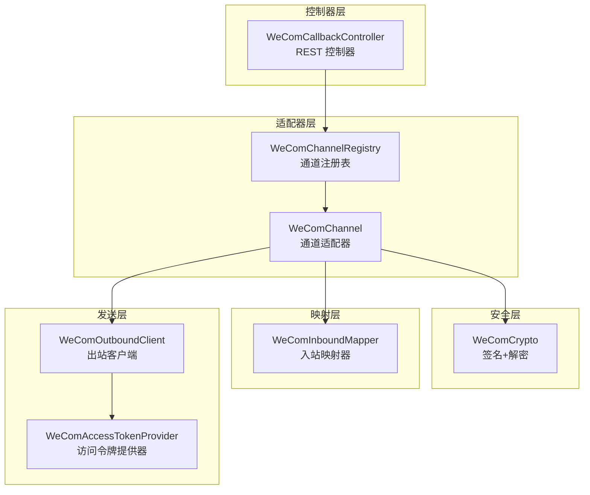
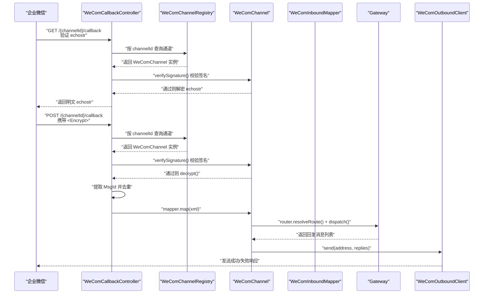
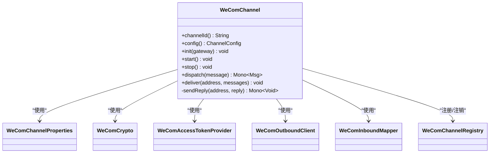
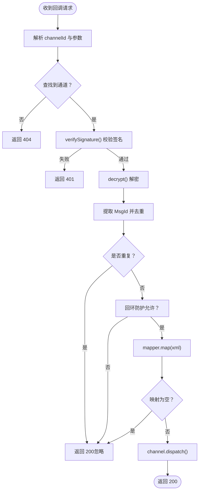
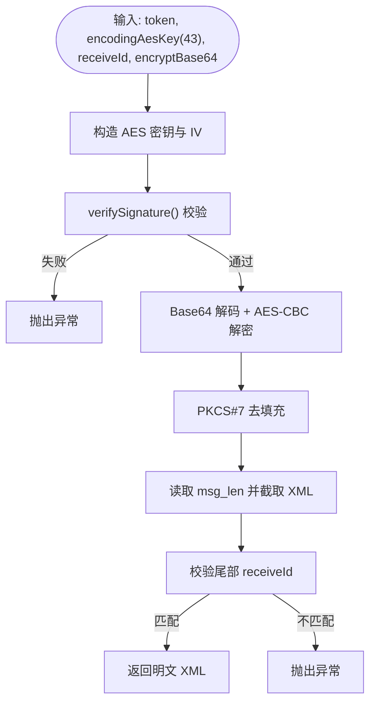
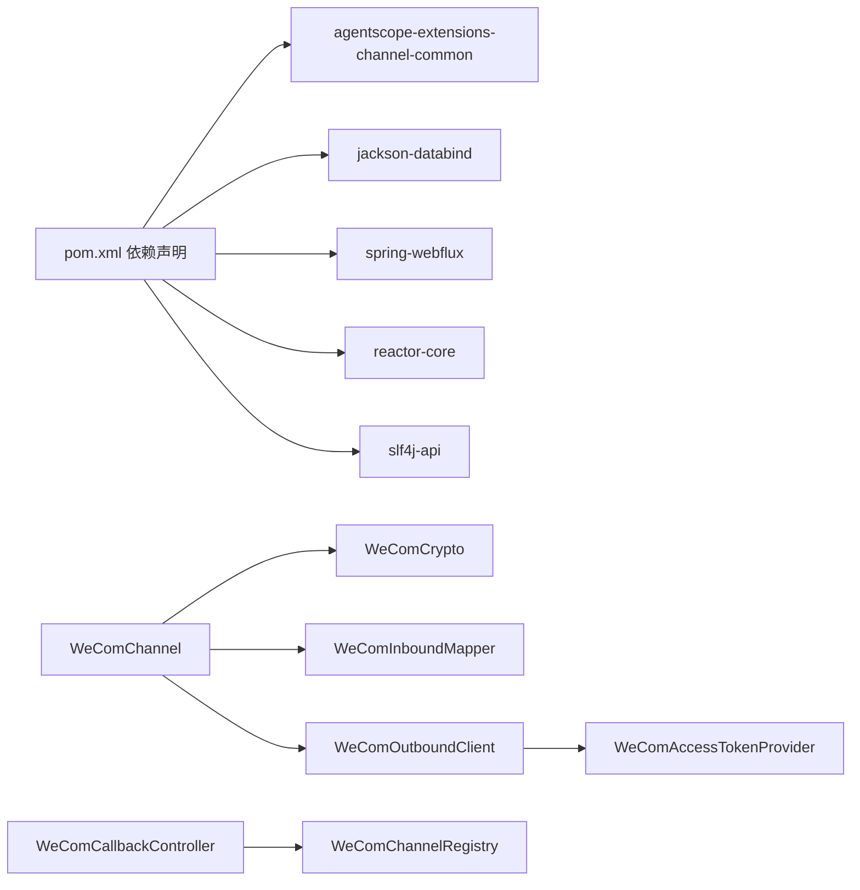

# 企业微信集成

<cite>
**本文引用的文件**
- [WeComChannel.java](file://agentscope-extensions/agentscope-extensions-channel/agentscope-extensions-channel-wecom/src/main/java/io/agentscope/extensions/channel/wecom/WeComChannel.java)
- [WeComCallbackController.java](file://agentscope-extensions/agentscope-extensions-channel/agentscope-extensions-channel-wecom/src/main/java/io/agentscope/extensions/channel/wecom/WeComCallbackController.java)
- [WeComCrypto.java](file://agentscope-extensions/agentscope-extensions-channel/agentscope-extensions-channel-wecom/src/main/java/io/agentscope/extensions/channel/wecom/WeComCrypto.java)
- [WeComInboundMapper.java](file://agentscope-extensions/agentscope-extensions-channel/agentscope-extensions-channel-wecom/src/main/java/io/agentscope/extensions/channel/wecom/WeComInboundMapper.java)
- [WeComOutboundClient.java](file://agentscope-extensions/agentscope-extensions-channel/agentscope-extensions-channel-wecom/src/main/java/io/agentscope/extensions/channel/wecom/WeComOutboundClient.java)
- [WeComAccessTokenProvider.java](file://agentscope-extensions/agentscope-extensions-channel/agentscope-extensions-channel-wecom/src/main/java/io/agentscope/extensions/channel/wecom/WeComAccessTokenProvider.java)
- [WeComChannelProperties.java](file://agentscope-extensions/agentscope-extensions-channel/agentscope-extensions-channel-wecom/src/main/java/io/agentscope/extensions/channel/wecom/WeComChannelProperties.java)
- [WeComChannelRegistry.java](file://agentscope-extensions/agentscope-extensions-channel/agentscope-extensions-channel-wecom/src/main/java/io/agentscope/extensions/channel/wecom/WeComChannelRegistry.java)
- [pom.xml](file://agentscope-extensions/agentscope-extensions-channel/agentscope-extensions-channel-wecom/pom.xml)
</cite>

## 目录
1. [简介](#简介)
2. [项目结构](#项目结构)
3. [核心组件](#核心组件)
4. [架构总览](#架构总览)
5. [组件详解](#组件详解)
6. [依赖关系分析](#依赖关系分析)
7. [性能考量](#性能考量)
8. [故障排查指南](#故障排查指南)
9. [结论](#结论)
10. [附录：配置与调试示例](#附录配置与调试示例)

## 简介
本技术文档面向在 AgentScope 中集成企业微信（WeCom）通道的开发者，系统性阐述以下内容：
- 回调处理流程：URL 验证握手、加密消息接收、签名验证、消息解密、去重与路由分发
- 消息加解密：基于企业微信回调规范的 SHA-1 签名与 AES-CBC 加解密
- 出站消息发送：支持单聊与群聊两种模式，自动选择文本或 Markdown 格式
- 访问令牌提供器：带过期时间与主动刷新的令牌缓存
- 入站消息映射器与出站客户端的实现要点
- 企业微信应用配置参数、回调 URL 设置、签名验证、消息 ID 去重与应用权限最佳实践
- 机器人消息发送与调试方法

## 项目结构
企业微信通道位于独立模块中，采用“适配器 + 组件”的分层设计：
- 控制器层：负责回调入口与请求分发
- 适配器层：封装通道生命周期、路由与消息编排
- 安全层：加解密与签名校验
- 映射层：入站 XML 到内部消息模型的转换
- 发送层：出站客户端与访问令牌提供器
- 注册表：进程内通道实例注册与查询

图表来源
- [WeComCallbackController.java:49-51](file://agentscope-extensions/agentscope-extensions-channel/agentscope-extensions-channel-wecom/src/main/java/io/agentscope/extensions/channel/wecom/WeComCallbackController.java#L49-L51)
- [WeComChannel.java:46-63](file://agentscope-extensions/agentscope-extensions-channel/agentscope-extensions-channel-wecom/src/main/java/io/agentscope/extensions/channel/wecom/WeComChannel.java#L46-L63)
- [WeComChannelRegistry.java:30-36](file://agentscope-extensions/agentscope-extensions-channel/agentscope-extensions-channel-wecom/src/main/java/io/agentscope/extensions/channel/wecom/WeComChannelRegistry.java#L30-L36)
- [WeComCrypto.java:40-46](file://agentscope-extensions/agentscope-extensions-channel/agentscope-extensions-channel-wecom/src/main/java/io/agentscope/extensions/channel/wecom/WeComCrypto.java#L40-L46)
- [WeComInboundMapper.java:41-47](file://agentscope-extensions/agentscope-extensions-channel/agentscope-extensions-channel-wecom/src/main/java/io/agentscope/extensions/channel/wecom/WeComInboundMapper.java#L41-L47)
- [WeComOutboundClient.java:43-51](file://agentscope-extensions/agentscope-extensions-channel/agentscope-extensions-channel-wecom/src/main/java/io/agentscope/extensions/channel/wecom/WeComOutboundClient.java#L43-L51)
- [WeComAccessTokenProvider.java:30-37](file://agentscope-extensions/agentscope-extensions-channel/agentscope-extensions-channel-wecom/src/main/java/io/agentscope/extensions/channel/wecom/WeComAccessTokenProvider.java#L30-L37)

章节来源
- [WeComChannel.java:35-45](file://agentscope-extensions/agentscope-extensions-channel/agentscope-extensions-channel-wecom/src/main/java/io/agentscope/extensions/channel/wecom/WeComChannel.java#L35-L45)
- [WeComCallbackController.java:42-48](file://agentscope-extensions/agentscope-extensions-channel/agentscope-extensions-channel-wecom/src/main/java/io/agentscope/extensions/channel/wecom/WeComCallbackController.java#L42-L48)

## 核心组件
- WeComChannel：通道适配器，负责生命周期管理、入站消息分发、出站消息发送、内部组件访问器
- WeComCallbackController：回调入口，处理 URL 验证与加密消息 POST，进行签名验证、解密、去重与路由
- WeComCrypto：实现企业微信回调签名与 AES-CBC 解密
- WeComInboundMapper：将企业微信回调 XML 映射为内部 InboundMessage
- WeComOutboundClient：封装消息发送 API，支持单聊与群聊，并根据内容特征选择文本或 Markdown
- WeComAccessTokenProvider：获取并缓存 access_token，支持主动刷新与失效检测
- WeComChannelProperties：通道配置参数的读取与校验
- WeComChannelRegistry：进程级通道注册表，按 channelId 查找对应通道实例

章节来源
- [WeComChannel.java:46-90](file://agentscope-extensions/agentscope-extensions-channel/agentscope-extensions-channel-wecom/src/main/java/io/agentscope/extensions/channel/wecom/WeComChannel.java#L46-L90)
- [WeComCallbackController.java:49-65](file://agentscope-extensions/agentscope-extensions-channel/agentscope-extensions-channel-wecom/src/main/java/io/agentscope/extensions/channel/wecom/WeComCallbackController.java#L49-L65)
- [WeComCrypto.java:40-68](file://agentscope-extensions/agentscope-extensions-channel/agentscope-extensions-channel-wecom/src/main/java/io/agentscope/extensions/channel/wecom/WeComCrypto.java#L40-L68)
- [WeComInboundMapper.java:41-51](file://agentscope-extensions/agentscope-extensions-channel/agentscope-extensions-channel-wecom/src/main/java/io/agentscope/extensions/channel/wecom/WeComInboundMapper.java#L41-L51)
- [WeComOutboundClient.java:43-57](file://agentscope-extensions/agentscope-extensions-channel/agentscope-extensions-channel-wecom/src/main/java/io/agentscope/extensions/channel/wecom/WeComOutboundClient.java#L43-L57)
- [WeComAccessTokenProvider.java:30-43](file://agentscope-extensions/agentscope-extensions-channel/agentscope-extensions-channel-wecom/src/main/java/io/agentscope/extensions/channel/wecom/WeComAccessTokenProvider.java#L30-L43)
- [WeComChannelProperties.java:38-45](file://agentscope-extensions/agentscope-extensions-channel/agentscope-extensions-channel-wecom/src/main/java/io/agentscope/extensions/channel/wecom/WeComChannelProperties.java#L38-L45)
- [WeComChannelRegistry.java:30-36](file://agentscope-extensions/agentscope-extensions-channel/agentscope-extensions-channel-wecom/src/main/java/io/agentscope/extensions/channel/wecom/WeComChannelRegistry.java#L30-L36)

## 架构总览
下图展示从企业微信到 AgentScope 的端到端流程：回调入口、签名验证、解密、去重、路由与回复发送。

图表来源
- [WeComCallbackController.java:72-99](file://agentscope-extensions/agentscope-extensions-channel/agentscope-extensions-channel-wecom/src/main/java/io/agentscope/extensions/channel/wecom/WeComCallbackController.java#L72-L99)
- [WeComCallbackController.java:107-177](file://agentscope-extensions/agentscope-extensions-channel/agentscope-extensions-channel-wecom/src/main/java/io/agentscope/extensions/channel/wecom/WeComCallbackController.java#L107-L177)
- [WeComChannel.java:162-172](file://agentscope-extensions/agentscope-extensions-channel/agentscope-extensions-channel-wecom/src/main/java/io/agentscope/extensions/channel/wecom/WeComChannel.java#L162-L172)
- [WeComOutboundClient.java:64-76](file://agentscope-extensions/agentscope-extensions-channel/agentscope-extensions-channel-wecom/src/main/java/io/agentscope/extensions/channel/wecom/WeComOutboundClient.java#L64-L76)

## 组件详解

### WeComChannel 通道适配器
- 职责
  - 生命周期：启动时注册到注册表，停止时注销
  - 分发：解析入站消息后交由路由与网关执行，并对回复消息进行出站发送
  - 内部访问器：向控制器暴露加密器、映射器、去重存储、回环防护与属性
- 关键点
  - 使用 WeComChannelProperties 初始化加密器、令牌提供器、出站客户端与映射器
  - 通过 ChannelRouter 将消息路由到默认或指定代理
  - 出站发送失败会记录告警但不中断整体流程

图表来源
- [WeComChannel.java:46-90](file://agentscope-extensions/agentscope-extensions-channel/agentscope-extensions-channel-wecom/src/main/java/io/agentscope/extensions/channel/wecom/WeComChannel.java#L46-L90)

章节来源
- [WeComChannel.java:100-121](file://agentscope-extensions/agentscope-extensions-channel/agentscope-extensions-channel-wecom/src/main/java/io/agentscope/extensions/channel/wecom/WeComChannel.java#L100-L121)
- [WeComChannel.java:145-159](file://agentscope-extensions/agentscope-extensions-channel/agentscope-extensions-channel-wecom/src/main/java/io/agentscope/extensions/channel/wecom/WeComChannel.java#L145-L159)
- [WeComChannel.java:162-188](file://agentscope-extensions/agentscope-extensions-channel/agentscope-extensions-channel-wecom/src/main/java/io/agentscope/extensions/channel/wecom/WeComChannel.java#L162-L188)

### WeComCallbackController 回调控制器
- GET 验证：校验签名并通过解密返回 echostr
- POST 入站：校验签名、解密、去重、回环防护、映射与分发
- XML 解析：安全工厂禁用外部实体与 DTD，避免 XXE 风险
- 返回策略：除签名错误与未知通道外，统一返回 200，避免重复投递

图表来源
- [WeComCallbackController.java:72-99](file://agentscope-extensions/agentscope-extensions-channel/agentscope-extensions-channel-wecom/src/main/java/io/agentscope/extensions/channel/wecom/WeComCallbackController.java#L72-L99)
- [WeComCallbackController.java:107-177](file://agentscope-extensions/agentscope-extensions-channel/agentscope-extensions-channel-wecom/src/main/java/io/agentscope/extensions/channel/wecom/WeComCallbackController.java#L107-L177)
- [WeComInboundMapper.java:84-94](file://agentscope-extensions/agentscope-extensions-channel/agentscope-extensions-channel-wecom/src/main/java/io/agentscope/extensions/channel/wecom/WeComInboundMapper.java#L84-L94)

章节来源
- [WeComCallbackController.java:72-99](file://agentscope-extensions/agentscope-extensions-channel/agentscope-extensions-channel-wecom/src/main/java/io/agentscope/extensions/channel/wecom/WeComCallbackController.java#L72-L99)
- [WeComCallbackController.java:107-177](file://agentscope-extensions/agentscope-extensions-channel/agentscope-extensions-channel-wecom/src/main/java/io/agentscope/extensions/channel/wecom/WeComCallbackController.java#L107-L177)

### WeComCrypto 加解密与签名
- 签名：对 [token, timestamp, nonce, encrypt] 排序拼接后做 SHA-1，常量时间比较
- 解密：Base64 解码后 AES-CBC/NoPadding 解密，PKCS#7 去填充；校验尾部 receiveId
- 参数要求：encodingAesKey 必须为 43 字符（无填充），解码后 32 字节；IV 取前 16 字节

图表来源
- [WeComCrypto.java:74-96](file://agentscope-extensions/agentscope-extensions-channel/agentscope-extensions-channel-wecom/src/main/java/io/agentscope/extensions/channel/wecom/WeComCrypto.java#L74-L96)
- [WeComCrypto.java:107-143](file://agentscope-extensions/agentscope-extensions-channel/agentscope-extensions-channel-wecom/src/main/java/io/agentscope/extensions/channel/wecom/WeComCrypto.java#L107-L143)

章节来源
- [WeComCrypto.java:26-39](file://agentscope-extensions/agentscope-extensions-channel/agentscope-extensions-channel-wecom/src/main/java/io/agentscope/extensions/channel/wecom/WeComCrypto.java#L26-L39)
- [WeComCrypto.java:47-68](file://agentscope-extensions/agentscope-extensions-channel/agentscope-extensions-channel-wecom/src/main/java/io/agentscope/extensions/channel/wecom/WeComCrypto.java#L47-L68)

### WeComInboundMapper 入站映射器
- 功能：将企业微信回调 XML 映射为内部 InboundMessage
- 支持类型：当前仅映射 MsgType=text 的用户消息；其他类型返回空，控制器直接 ACK
- 提取字段：MsgId（用于去重）、FromUserName（发送者）、Content（文本内容）
- 安全：使用安全的 DocumentBuilderFactory，禁用外部实体与 DTD

章节来源
- [WeComInboundMapper.java:34-41](file://agentscope-extensions/agentscope-extensions-channel/agentscope-extensions-channel-wecom/src/main/java/io/agentscope/extensions/channel/wecom/WeComInboundMapper.java#L34-L41)
- [WeComInboundMapper.java:57-82](file://agentscope-extensions/agentscope-extensions-channel/agentscope-extensions-channel-wecom/src/main/java/io/agentscope/extensions/channel/wecom/WeComInboundMapper.java#L57-L82)
- [WeComInboundMapper.java:84-94](file://agentscope-extensions/agentscope-extensions-channel/agentscope-extensions-channel-wecom/src/main/java/io/agentscope/extensions/channel/wecom/WeComInboundMapper.java#L84-L94)

### WeComOutboundClient 出站客户端
- 目标接口：/cgi-bin/message/send（单聊）、/cgi-bin/appchat/send（群聊）
- 地址解析：OutboundAddress.to() 形如 "channelId:DIRECT:userid" 或 "channelId:GROUP:chatid"
- 内容选择：若文本包含换行或 Markdown 特征，则发送为 markdown 类型
- 错误处理：解析响应 errcode，遇到 42001/40014 主动使令牌失效并触发刷新

章节来源
- [WeComOutboundClient.java:34-42](file://agentscope-extensions/agentscope-extensions-channel/agentscope-extensions-channel-wecom/src/main/java/io/agentscope/extensions/channel/wecom/WeComOutboundClient.java#L34-L42)
- [WeComOutboundClient.java:64-111](file://agentscope-extensions/agentscope-extensions-channel/agentscope-extensions-channel-wecom/src/main/java/io/agentscope/extensions/channel/wecom/WeComOutboundClient.java#L64-L111)
- [WeComOutboundClient.java:113-141](file://agentscope-extensions/agentscope-extensions-channel/agentscope-extensions-channel-wecom/src/main/java/io/agentscope/extensions/channel/wecom/WeComOutboundClient.java#L113-L141)
- [WeComOutboundClient.java:143-167](file://agentscope-extensions/agentscope-extensions-channel/agentscope-extensions-channel-wecom/src/main/java/io/agentscope/extensions/channel/wecom/WeComOutboundClient.java#L143-L167)

### WeComAccessTokenProvider 访问令牌提供器
- 缓存策略：记录 access_token 与下次刷新时间；接近过期时主动刷新（约 80% TTL）
- 失效检测：发送接口返回 42001/40014 时主动失效，后续请求触发刷新
- 错误处理：解析失败或 errcode 非 0 抛出异常

章节来源
- [WeComAccessTokenProvider.java:25-29](file://agentscope-extensions/agentscope-extensions-channel/agentscope-extensions-channel-wecom/src/main/java/io/agentscope/extensions/channel/wecom/WeComAccessTokenProvider.java#L25-L29)
- [WeComAccessTokenProvider.java:49-70](file://agentscope-extensions/agentscope-extensions-channel/agentscope-extensions-channel-wecom/src/main/java/io/agentscope/extensions/channel/wecom/WeComAccessTokenProvider.java#L49-L70)
- [WeComAccessTokenProvider.java:72-94](file://agentscope-extensions/agentscope-extensions-channel/agentscope-extensions-channel-wecom/src/main/java/io/agentscope/extensions/channel/wecom/WeComAccessTokenProvider.java#L72-L94)

### WeComChannelProperties 通道配置
- 必填项：corpId、agentId、secret、token、encodingAesKey（43 字符）
- 默认值：callbackPath 默认为 "/api/channels/wecom/{channelId}/callback"；apiBase 默认为官方域名
- 校验：构造时对关键参数进行非空与长度校验

章节来源
- [WeComChannelProperties.java:21-37](file://agentscope-extensions/agentscope-extensions-channel/agentscope-extensions-channel-wecom/src/main/java/io/agentscope/extensions/channel/wecom/WeComChannelProperties.java#L21-L37)
- [WeComChannelProperties.java:47-66](file://agentscope-extensions/agentscope-extensions-channel/agentscope-extensions-channel-wecom/src/main/java/io/agentscope/extensions/channel/wecom/WeComChannelProperties.java#L47-L66)
- [WeComChannelProperties.java:69-81](file://agentscope-extensions/agentscope-extensions-channel/agentscope-extensions-channel-wecom/src/main/java/io/agentscope/extensions/channel/wecom/WeComChannelProperties.java#L69-L81)

### WeComChannelRegistry 通道注册表
- 单例：进程内全局唯一
- 能力：注册、注销、按 channelId 查询
- 作用：控制器按路径中的 channelId 定位具体通道实例

章节来源
- [WeComChannelRegistry.java:20-29](file://agentscope-extensions/agentscope-extensions-channel/agentscope-extensions-channel-wecom/src/main/java/io/agentscope/extensions/channel/wecom/WeComChannelRegistry.java#L20-L29)
- [WeComChannelRegistry.java:38-53](file://agentscope-extensions/agentscope-extensions-channel/agentscope-extensions-channel-wecom/src/main/java/io/agentscope/extensions/channel/wecom/WeComChannelRegistry.java#L38-L53)

## 依赖关系分析
- 模块依赖：该模块依赖 agentscope-extensions-channel-common 与 Spring WebFlux/Reactor
- 运行时依赖：Jackson 用于 JSON 解析；SLF4J 用于日志
- 组件耦合：控制器通过注册表与通道交互；通道内部组合加密器、映射器、令牌提供器与出站客户端

图表来源
- [pom.xml:32-67](file://agentscope-extensions/agentscope-extensions-channel/agentscope-extensions-channel-wecom/pom.xml#L32-L67)
- [WeComChannel.java:56-58](file://agentscope-extensions/agentscope-extensions-channel/agentscope-extensions-channel-wecom/src/main/java/io/agentscope/extensions/channel/wecom/WeComChannel.java#L56-L58)
- [WeComOutboundClient.java:49-50](file://agentscope-extensions/agentscope-extensions-channel/agentscope-extensions-channel-wecom/src/main/java/io/agentscope/extensions/channel/wecom/WeComOutboundClient.java#L49-L50)
- [WeComAccessTokenProvider.java:34-37](file://agentscope-extensions/agentscope-extensions-channel/agentscope-extensions-channel-wecom/src/main/java/io/agentscope/extensions/channel/wecom/WeComAccessTokenProvider.java#L34-L37)
- [WeComCallbackController.java:56-65](file://agentscope-extensions/agentscope-extensions-channel/agentscope-extensions-channel-wecom/src/main/java/io/agentscope/extensions/channel/wecom/WeComCallbackController.java#L56-L65)

章节来源
- [pom.xml:32-67](file://agentscope-extensions/agentscope-extensions-channel/agentscope-extensions-channel-wecom/pom.xml#L32-L67)

## 性能考量
- 异步与背压：使用 WebFlux 与 Reactor，避免阻塞 IO；令牌获取与消息发送均采用异步流式处理
- 主动刷新：令牌在约 80% TTL 时刷新，降低热路径上的强制刷新开销
- 批量发送：出站客户端逐条发送，便于错误隔离与可观测性
- 解析安全：严格禁用外部实体与 DTD，降低 XML 解析风险与资源消耗

## 故障排查指南
- 回调无法验证
  - 检查企业微信后台的 token 与 encodingAesKey 是否与配置一致
  - 确认回调 URL 与 callbackPath 一致
  - 查看控制器日志中签名不匹配与解密失败的告警
- 消息重复
  - 确认 MsgId 提取逻辑正常，去重存储生效
  - 若出现重复投递，控制器会静默 ACK，避免二次处理
- 发送失败
  - 关注 errcode 42001/40014，令牌提供器会主动失效并刷新
  - 检查 agentId 与目标用户/群组标识是否正确
- 解析异常
  - 确保回调 XML 结构符合企业微信规范
  - 控制器与映射器已启用安全 XML 解析，仍报错多为数据格式问题

章节来源
- [WeComCallbackController.java:142-148](file://agentscope-extensions/agentscope-extensions-channel/agentscope-extensions-channel-wecom/src/main/java/io/agentscope/extensions/channel/wecom/WeComCallbackController.java#L142-L148)
- [WeComOutboundClient.java:125-141](file://agentscope-extensions/agentscope-extensions-channel/agentscope-extensions-channel-wecom/src/main/java/io/agentscope/extensions/channel/wecom/WeComOutboundClient.java#L125-L141)
- [WeComAccessTokenProvider.java:96-99](file://agentscope-extensions/agentscope-extensions-channel/agentscope-extensions-channel-wecom/src/main/java/io/agentscope/extensions/channel/wecom/WeComAccessTokenProvider.java#L96-L99)

## 结论
本实现遵循企业微信回调规范，通过签名验证与 AES-CBC 解密确保通信安全；通过入站映射与出站客户端完成消息的双向流转；通过令牌提供器与注册表实现可维护的运行时管理。整体设计具备良好的安全性、可扩展性与可观测性，适合在生产环境中部署与演进。

## 附录：配置与调试示例

### 企业微信应用配置参数
- corpId：企业 ID（必填）
- agentId：应用 ID（正整数，必填）
- secret：应用密钥（必填）
- token：回调 token（必填，需与企业微信后台一致）
- encodingAesKey：回调加密密钥（43 字符 Base64，必填）
- callbackPath：回调路径（默认为 "/api/channels/wecom/{channelId}/callback"）
- apiBase：企业微信 API 基础地址（默认官方域名）

章节来源
- [WeComChannelProperties.java:28-37](file://agentscope-extensions/agentscope-extensions-channel/agentscope-extensions-channel-wecom/src/main/java/io/agentscope/extensions/channel/wecom/WeComChannelProperties.java#L28-L37)
- [WeComChannelProperties.java:69-81](file://agentscope-extensions/agentscope-extensions-channel/agentscope-extensions-channel-wecom/src/main/java/io/agentscope/extensions/channel/wecom/WeComChannelProperties.java#L69-L81)

### 回调 URL 设置
- 控制器默认路径：/api/channels/wecom/{channelId}/callback
- 企业微信后台应配置相同的回调 URL 与 token、encodingAesKey
- 启动时通道会打印实际使用的 corpId、agentId 与 callbackPath，便于核对

章节来源
- [WeComChannel.java:148-152](file://agentscope-extensions/agentscope-extensions-channel/agentscope-extensions-channel-wecom/src/main/java/io/agentscope/extensions/channel/wecom/WeComChannel.java#L148-L152)
- [WeComCallbackController.java:50-51](file://agentscope-extensions/agentscope-extensions-channel/agentscope-extensions-channel-wecom/src/main/java/io/agentscope/extensions/channel/wecom/WeComCallbackController.java#L50-L51)

### 消息加解密调试方法
- 签名验证失败：检查 token、timestamp、nonce、encrypt 参数顺序与拼接
- 解密失败：确认 encodingAesKey 长度与 Base64 格式，以及 receiveId 一致性
- XML 解析异常：确认回调体中存在 <Encrypt> 节点且格式正确

章节来源
- [WeComCrypto.java:74-96](file://agentscope-extensions/agentscope-extensions-channel/agentscope-extensions-channel-wecom/src/main/java/io/agentscope/extensions/channel/wecom/WeComCrypto.java#L74-L96)
- [WeComCallbackController.java:122-140](file://agentscope-extensions/agentscope-extensions-channel/agentscope-extensions-channel-wecom/src/main/java/io/agentscope/extensions/channel/wecom/WeComCallbackController.java#L122-L140)

### 消息 ID 去重与回环防护
- 去重：从 XML 中提取 MsgId，结合通道级前缀进行去重判断
- 回环防护：基于对话对方键（peer.key）限制同一来源的连续处理频率
- 行为：重复消息与被防护的消息将直接 ACK，不进入业务处理

章节来源
- [WeComInboundMapper.java:84-94](file://agentscope-extensions/agentscope-extensions-channel/agentscope-extensions-channel-wecom/src/main/java/io/agentscope/extensions/channel/wecom/WeComInboundMapper.java#L84-L94)
- [WeComCallbackController.java:142-163](file://agentscope-extensions/agentscope-extensions-channel/agentscope-extensions-channel-wecom/src/main/java/io/agentscope/extensions/channel/wecom/WeComCallbackController.java#L142-L163)

### 应用权限配置最佳实践
- 权限范围：确保应用具备“接收消息”和“发送消息”权限
- 用户与群组：单聊需用户提供 userid，群聊需提供 chatid
- 内容格式：若消息包含 Markdown 特征，将自动以 markdown 类型发送，提升可读性

章节来源
- [WeComOutboundClient.java:83-102](file://agentscope-extensions/agentscope-extensions-channel/agentscope-extensions-channel-wecom/src/main/java/io/agentscope/extensions/channel/wecom/WeComOutboundClient.java#L83-L102)