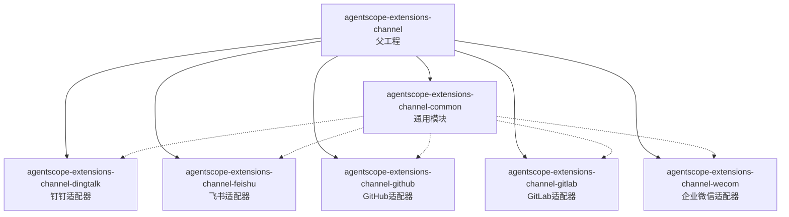
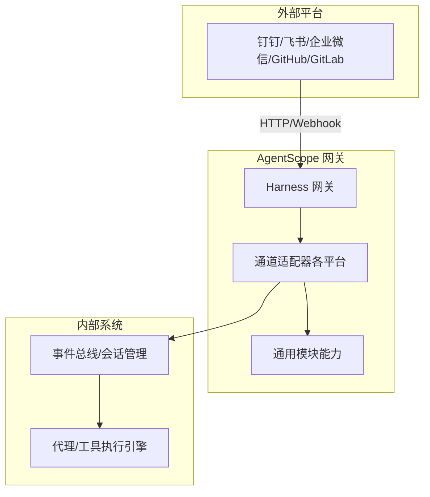
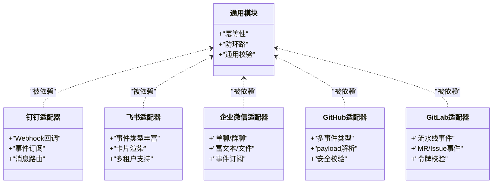
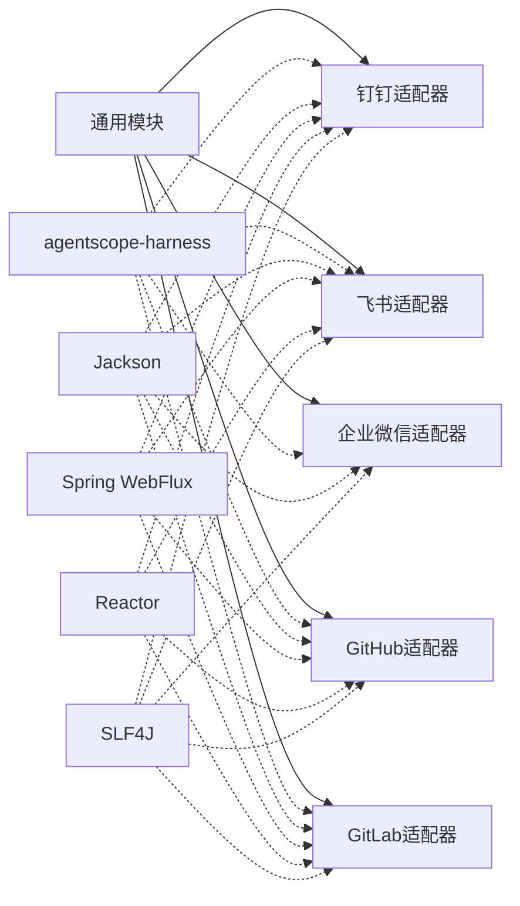

# 通道集成

<cite>
**本文引用的文件**
- [agentscope-extensions-channel/pom.xml](file://agentscope-extensions/agentscope-extensions-channel/pom.xml)
- [agentscope-extensions-channel-common/pom.xml](file://agentscope-extensions/agentscope-extensions-channel/agentscope-extensions-channel-common/pom.xml)
- [agentscope-extensions-channel-dingtalk/pom.xml](file://agentscope-extensions/agentscope-extensions-channel/agentscope-extensions-channel-dingtalk/pom.xml)
- [agentscope-extensions-channel-feishu/pom.xml](file://agentscope-extensions/agentscope-extensions-channel/agentscope-extensions-channel-feishu/pom.xml)
- [agentscope-extensions-channel-github/pom.xml](file://agentscope-extensions/agentscope-extensions-channel/agentscope-extensions-channel-github/pom.xml)
- [agentscope-extensions-channel-gitlab/pom.xml](file://agentscope-extensions/agentscope-extensions-channel/agentscope-extensions-channel-gitlab/pom.xml)
- [agentscope-extensions-channel-wecom/pom.xml](file://agentscope-extensions/agentscope-extensions-channel/agentscope-extensions-channel-wecom/pom.xml)
</cite>

## 目录
1. [引言](#引言)
2. [项目结构](#项目结构)
3. [核心组件](#核心组件)
4. [架构总览](#架构总览)
5. [详细组件分析](#详细组件分析)
6. [依赖关系分析](#依赖关系分析)
7. [性能考虑](#性能考虑)
8. [故障排查指南](#故障排查指南)
9. [结论](#结论)
10. [附录](#附录)

## 引言
本技术文档聚焦于 AgentScope Java 的“通道集成”模块，系统性阐述面向多平台消息通道与 Webhook 处理的适配器架构与实现要点。当前仓库中已明确包含以下通道适配器模块：钉钉（DingTalk）、飞书（Feishu）、企业微信（WeCom）、GitHub、GitLab；同时提供一个通用公共模块用于承载跨通道的通用能力（如幂等性、防环路等）。本文将从系统架构、组件关系、数据流与处理逻辑、集成点与错误处理、性能特征、配置与部署、调试方法等方面进行深入解析，并给出面向各平台的 API 特性、限制与最佳实践建议。

## 项目结构
通道集成模块采用“父工程 + 多子模块”的组织方式，每个平台对应一个独立的 Maven 模块，共享一个通用公共模块。下图展示了模块间的层次关系与依赖方向：

图表来源
- [agentscope-extensions-channel/pom.xml](file://agentscope-extensions/agentscope-extensions-channel/pom.xml)
- [agentscope-extensions-channel-common/pom.xml](file://agentscope-extensions/agentscope-extensions-channel/agentscope-extensions-channel-common/pom.xml)
- [agentscope-extensions-channel-dingtalk/pom.xml](file://agentscope-extensions/agentscope-extensions-channel/agentscope-extensions-channel-dingtalk/pom.xml)
- [agentscope-extensions-channel-feishu/pom.xml](file://agentscope-extensions/agentscope-extensions-channel/agentscope-extensions-channel-feishu/pom.xml)
- [agentscope-extensions-channel-github/pom.xml](file://agentscope-extensions/agentscope-extensions-channel/agentscope-extensions-channel-github/pom.xml)
- [agentscope-extensions-channel-gitlab/pom.xml](file://agentscope-extensions/agentscope-extensions-channel/agentscope-extensions-channel-gitlab/pom.xml)
- [agentscope-extensions-channel-wecom/pom.xml](file://agentscope-extensions/agentscope-extensions-channel/agentscope-extensions-channel-wecom/pom.xml)

章节来源
- [agentscope-extensions-channel/pom.xml](file://agentscope-extensions/agentscope-extensions-channel/pom.xml)
- [agentscope-extensions-channel-common/pom.xml](file://agentscope-extensions/agentscope-extensions-channel/agentscope-extensions-channel-common/pom.xml)
- [agentscope-extensions-channel-dingtalk/pom.xml](file://agentscope-extensions/agentscope-extensions-channel/agentscope-extensions-channel-dingtalk/pom.xml)
- [agentscope-extensions-channel-feishu/pom.xml](file://agentscope-extensions/agentscope-extensions-channel/agentscope-extensions-channel-feishu/pom.xml)
- [agentscope-extensions-channel-github/pom.xml](file://agentscope-extensions/agentscope-extensions-channel/agentscope-extensions-channel-github/pom.xml)
- [agentscope-extensions-channel-gitlab/pom.xml](file://agentscope-extensions/agentscope-extensions-channel/agentscope-extensions-channel-gitlab/pom.xml)
- [agentscope-extensions-channel-wecom/pom.xml](file://agentscope-extensions/agentscope-extensions-channel/agentscope-extensions-channel-wecom/pom.xml)

## 核心组件
- 通用公共模块（agentscope-extensions-channel-common）
  - 职责：为各平台适配器提供可复用的通用能力，例如幂等性保障、机器人消息循环防护等。
  - 价值：降低重复实现成本，统一跨通道行为一致性。
- 平台适配器模块（钉钉、飞书、企业微信、GitHub、GitLab）
  - 职责：对接各平台的消息通道与 Webhook 接口，完成消息接收、解析、路由与回执处理。
  - 技术栈：基于 Spring WebFlux 与 Reactor 进行响应式网络请求与事件驱动处理。
  - 依赖：均依赖通用公共模块与核心运行时（agentscope-harness）以接入统一的网关与事件总线。

章节来源
- [agentscope-extensions-channel-common/pom.xml](file://agentscope-extensions/agentscope-extensions-channel/agentscope-extensions-channel-common/pom.xml)
- [agentscope-extensions-channel-dingtalk/pom.xml](file://agentscope-extensions/agentscope-extensions-channel/agentscope-extensions-channel-dingtalk/pom.xml)
- [agentscope-extensions-channel-feishu/pom.xml](file://agentscope-extensions/agentscope-extensions-channel/agentscope-extensions-channel-feishu/pom.xml)
- [agentscope-extensions-channel-github/pom.xml](file://agentscope-extensions/agentscope-extensions-channel/agentscope-extensions-channel-github/pom.xml)
- [agentscope-extensions-channel-gitlab/pom.xml](file://agentscope-extensions/agentscope-extensions-channel/agentscope-extensions-channel-gitlab/pom.xml)
- [agentscope-extensions-channel-wecom/pom.xml](file://agentscope-extensions/agentscope-extensions-channel/agentscope-extensions-channel-wecom/pom.xml)

## 架构总览
通道适配器的整体架构围绕“统一入口 + 平台适配 + 通用能力 + 响应式处理”展开。下图展示了典型的消息流入路径与关键交互节点：

图表来源
- [agentscope-extensions-channel-dingtalk/pom.xml](file://agentscope-extensions/agentscope-extensions-channel/agentscope-extensions-channel-dingtalk/pom.xml)
- [agentscope-extensions-channel-feishu/pom.xml](file://agentscope-extensions/agentscope-extensions-channel/agentscope-extensions-channel-feishu/pom.xml)
- [agentscope-extensions-channel-github/pom.xml](file://agentscope-extensions/agentscope-extensions-channel/agentscope-extensions-channel-github/pom.xml)
- [agentscope-extensions-channel-gitlab/pom.xml](file://agentscope-extensions/agentscope-extensions-channel/agentscope-extensions-channel-gitlab/pom.xml)
- [agentscope-extensions-channel-wecom/pom.xml](file://agentscope-extensions/agentscope-extensions-channel/agentscope-extensions-channel-wecom/pom.xml)

## 详细组件分析

### 通用模块（agentscope-extensions-channel-common）
- 设计目标
  - 提供跨平台一致的通用能力，减少重复开发与维护成本。
  - 通过模块化拆分，确保平台适配器的职责清晰、边界明确。
- 关键能力（示意）
  - 幂等性：基于事件 ID 或消息指纹去重，避免重复处理。
  - 防环路：识别机器人自触发场景，防止消息在系统内无限循环。
  - 通用校验：对入站消息进行基础合法性校验与格式标准化。
- 与平台适配器的关系
  - 平台适配器通过依赖该模块获得上述能力，无需重复实现。

章节来源
- [agentscope-extensions-channel-common/pom.xml](file://agentscope-extensions/agentscope-extensions-channel/agentscope-extensions-channel-common/pom.xml)

### 钉钉适配器（agentscope-extensions-channel-dingtalk）
- 适用场景
  - 企业内部群聊机器人、工作通知、任务提醒等。
- 关键特性
  - 支持 Webhook 回调与事件订阅，覆盖文本、富文本、卡片等多种消息类型。
  - 基于 Spring WebFlux 实现非阻塞处理，提升并发吞吐。
- 集成要点
  - 在网关侧注册钉钉回调端点，转发至适配器。
  - 适配器解析消息后，按会话维度路由到事件总线。
- 错误处理
  - 对无效签名、超时、重复事件等异常进行捕获与降级处理。

章节来源
- [agentscope-extensions-channel-dingtalk/pom.xml](file://agentscope-extensions/agentscope-extensions-channel/agentscope-extensions-channel-dingtalk/pom.xml)

### 飞书适配器（agentscope-extensions-channel-feishu）
- 适用场景
  - 即时通讯、审批流程、项目协作等。
- 关键特性
  - 支持多种事件类型（消息、待办、审批等），具备卡片消息渲染能力。
  - 通过事件订阅与 Webhook 双通道接入，满足不同业务需求。
- 集成要点
  - 配置应用凭证与加密密钥，确保回调安全。
  - 使用通用模块能力进行幂等与防环路处理。

章节来源
- [agentscope-extensions-channel-feishu/pom.xml](file://agentscope-extensions/agentscope-extensions-channel/agentscope-extensions-channel-feishu/pom.xml)

### 企业微信适配器（agentscope-extensions-channel-wecom）
- 适用场景
  - 企业内部沟通、公告发布、任务协作等。
- 关键特性
  - 支持单聊与群聊消息，兼容富文本与文件消息。
  - 提供事件订阅与回调处理，支持多租户隔离。
- 集成要点
  - 通过网关暴露回调地址，适配器负责鉴权与消息解析。
  - 结合通用模块实现消息去重与循环检测。

章节来源
- [agentscope-extensions-channel-wecom/pom.xml](file://agentscope-extensions/agentscope-extensions-channel/agentscope-extensions-channel-wecom/pom.xml)

### GitHub 适配器（agentscope-extensions-channel-github）
- 适用场景
  - 代码评审、Issue/PR 通知、CI/CD 事件联动等。
- 关键特性
  - 支持多种 GitHub 事件（push、pull_request、issues、check_suite 等）。
  - 通过 Webhook 接收事件，解析 payload 后路由到相应处理器。
- 集成要点
  - 配置 GitHub App 或 Personal Access Token，设置 Webhook 密钥。
  - 使用通用模块进行幂等与安全校验。

章节来源
- [agentscope-extensions-channel-github/pom.xml](file://agentscope-extensions/agentscope-extensions-channel/agentscope-extensions-channel-github/pom.xml)

### GitLab 适配器（agentscope-extensions-channel-gitlab）
- 适用场景
  - 代码合并请求、问题跟踪、流水线状态通知等。
- 关键特性
  - 支持 GitLab 多种事件类型（Push、Merge Request、Pipeline、Job 等）。
  - 与 GitLab 安全令牌配合，确保回调来源可信。
- 集成要点
  - 在 GitLab 中配置 Webhook 地址与 Secret Token。
  - 适配器负责事件解码、签名验证与消息分发。

章节来源
- [agentscope-extensions-channel-gitlab/pom.xml](file://agentscope-extensions/agentscope-extensions-channel/agentscope-extensions-channel-gitlab/pom.xml)

### 组件关系类图（示意）

图表来源
- [agentscope-extensions-channel-common/pom.xml](file://agentscope-extensions/agentscope-extensions-channel/agentscope-extensions-channel-common/pom.xml)
- [agentscope-extensions-channel-dingtalk/pom.xml](file://agentscope-extensions/agentscope-extensions-channel/agentscope-extensions-channel-dingtalk/pom.xml)
- [agentscope-extensions-channel-feishu/pom.xml](file://agentscope-extensions/agentscope-extensions-channel/agentscope-extensions-channel-feishu/pom.xml)
- [agentscope-extensions-channel-wecom/pom.xml](file://agentscope-extensions/agentscope-extensions-channel/agentscope-extensions-channel-wecom/pom.xml)
- [agentscope-extensions-channel-github/pom.xml](file://agentscope-extensions/agentscope-extensions-channel/agentscope-extensions-channel-github/pom.xml)
- [agentscope-extensions-channel-gitlab/pom.xml](file://agentscope-extensions/agentscope-extensions-channel/agentscope-extensions-channel-gitlab/pom.xml)

## 依赖关系分析
- 模块间依赖
  - 所有平台适配器均依赖通用公共模块，以获得统一的通用能力。
  - 适配器模块声明对 agentscope-harness 的 provided 依赖，表明其作为扩展模块运行于网关之上。
- 外部依赖
  - Jackson：JSON 解析与序列化。
  - Spring WebFlux + Reactor：响应式网络与事件驱动。
  - SLF4J：日志抽象，便于与上层系统集成。

图表来源
- [agentscope-extensions-channel-common/pom.xml](file://agentscope-extensions/agentscope-extensions-channel/agentscope-extensions-channel-common/pom.xml)
- [agentscope-extensions-channel-dingtalk/pom.xml](file://agentscope-extensions/agentscope-extensions-channel/agentscope-extensions-channel-dingtalk/pom.xml)
- [agentscope-extensions-channel-feishu/pom.xml](file://agentscope-extensions/agentscope-extensions-channel/agentscope-extensions-channel-feishu/pom.xml)
- [agentscope-extensions-channel-github/pom.xml](file://agentscope-extensions/agentscope-extensions-channel/agentscope-extensions-channel-github/pom.xml)
- [agentscope-extensions-channel-gitlab/pom.xml](file://agentscope-extensions/agentscope-extensions-channel/agentscope-extensions-channel-gitlab/pom.xml)
- [agentscope-extensions-channel-wecom/pom.xml](file://agentscope-extensions/agentscope-extensions-channel/agentscope-extensions-channel-wecom/pom.xml)

章节来源
- [agentscope-extensions-channel-common/pom.xml](file://agentscope-extensions/agentscope-extensions-channel/agentscope-extensions-channel-common/pom.xml)
- [agentscope-extensions-channel-dingtalk/pom.xml](file://agentscope-extensions/agentscope-extensions-channel/agentscope-extensions-channel-dingtalk/pom.xml)
- [agentscope-extensions-channel-feishu/pom.xml](file://agentscope-extensions/agentscope-extensions-channel/agentscope-extensions-channel-feishu/pom.xml)
- [agentscope-extensions-channel-github/pom.xml](file://agentscope-extensions/agentscope-extensions-channel/agentscope-extensions-channel-github/pom.xml)
- [agentscope-extensions-channel-gitlab/pom.xml](file://agentscope-extensions/agentscope-extensions-channel/agentscope-extensions-channel-gitlab/pom.xml)
- [agentscope-extensions-channel-wecom/pom.xml](file://agentscope-extensions/agentscope-extensions-channel/agentscope-extensions-channel-wecom/pom.xml)

## 性能考虑
- 响应式模型
  - 采用 Spring WebFlux 与 Reactor，可在高并发场景下显著降低线程切换开销，提升吞吐量。
- 幂等与缓存
  - 利用通用模块的幂等能力，结合本地或分布式缓存，避免重复计算与消息风暴。
- 背压与限流
  - 在事件总线与下游执行引擎处实施背压策略与速率限制，防止系统过载。
- 日志与监控
  - 通过 SLF4J 输出结构化日志，结合指标采集（如 QPS、延迟、错误率）进行性能观测。

## 故障排查指南
- 常见问题定位
  - 回调失败：检查平台侧 Webhook 配置、签名算法与密钥是否一致。
  - 消息重复：确认通用模块的幂等键生成策略与存储介质（内存/Redis）。
  - 循环触发：核查机器人消息路由逻辑，避免将系统生成的消息再次投递到自身。
  - 超时与重试：调整适配器的超时阈值与重试策略，避免对上游造成压力。
- 调试建议
  - 开启 DEBUG 级别日志，观察消息进入、解析、路由与回执全流程。
  - 使用抓包工具（如 Wireshark/Charles）验证回调请求头与负载。
  - 在测试环境模拟高频事件，评估系统的峰值处理能力与稳定性。

## 结论
通道集成模块通过“通用能力 + 平台适配器”的分层设计，实现了对钉钉、飞书、企业微信、GitHub、GitLab 等多平台的统一接入与扩展。借助响应式网络与通用模块的能力，系统在保证一致性的同时提升了可维护性与性能弹性。后续可在通用模块中持续沉淀更多跨平台共性能力，并针对各平台的 API 特性与限制补充更完善的配置模板与最佳实践。

## 附录

### 配置与部署要点（通用）
- 网关集成
  - 将各平台适配器打包为扩展模块，随 agentscope-harness 网关启动加载。
  - 在网关配置中注册各平台的回调端点与鉴权参数。
- 依赖声明
  - 确保 Jackson、Spring WebFlux、Reactor、SLF4J 等依赖版本与运行时兼容。
- 安全配置
  - 平台侧 Webhook 密钥/签名需与适配器配置保持一致。
  - 建议启用 HTTPS 与访问控制，避免明文传输与未授权访问。

### 各平台 API 特性与限制（概览）
- 钉钉
  - 事件类型：文本、富文本、卡片、文件等。
  - 限制：单次回调最大负载、重试次数上限、IP 白名单。
- 飞书
  - 事件类型：消息、待办、审批、日历等。
  - 限制：回调频率限制、签名算法要求、卡片内容长度。
- 企业微信
  - 事件类型：文本、图片、语音、视频、文件等。
  - 限制：多租户隔离、消息大小限制、接口调用频次。
- GitHub
  - 事件类型：push、pull_request、issues、check_suite、deployment 等。
  - 限制：payload 大小、事件选择性订阅、Token 权限范围。
- GitLab
  - 事件类型：Push、Merge Request、Pipeline、Job、Issue 等。
  - 限制：事件过滤、Secret Token 校验、回调超时时间。

### 最佳实践
- 消息格式转换
  - 统一将各平台消息映射为内部消息模型，保留必要的元数据（发送者、时间戳、上下文）。
- 事件处理
  - 将 Webhook 事件异步化处理，避免阻塞回调线程；必要时引入队列与批处理。
- 实时通信
  - 对需要实时反馈的场景，结合长连接或 WebSocket（若平台支持）与事件总线实现低延迟推送。
- 错误处理
  - 明确区分“可重试错误”与“不可重试错误”，对前者进行指数退避重试，后者记录并上报。