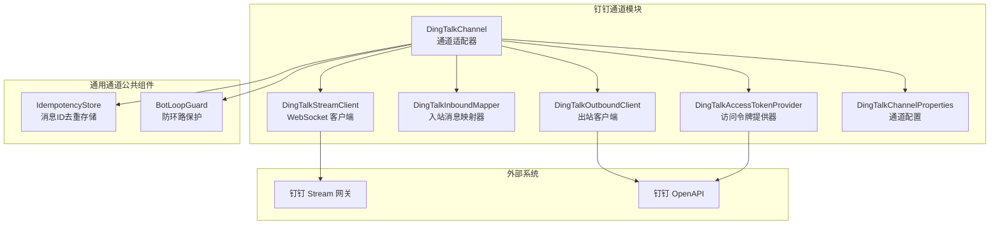
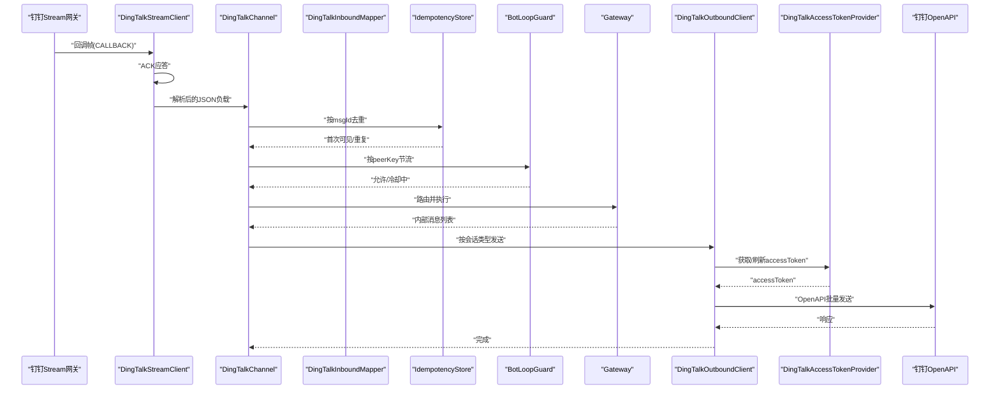
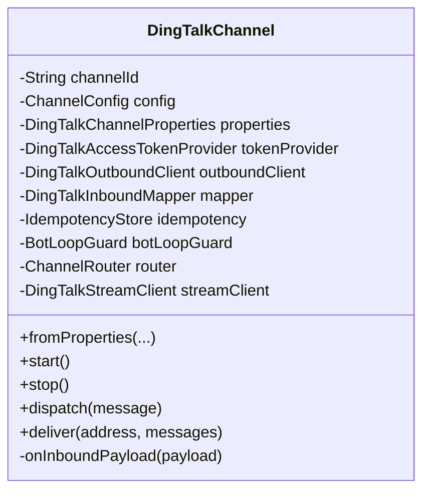
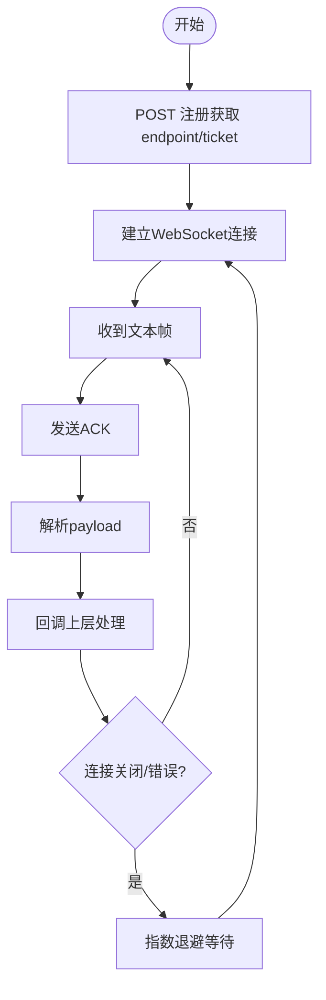
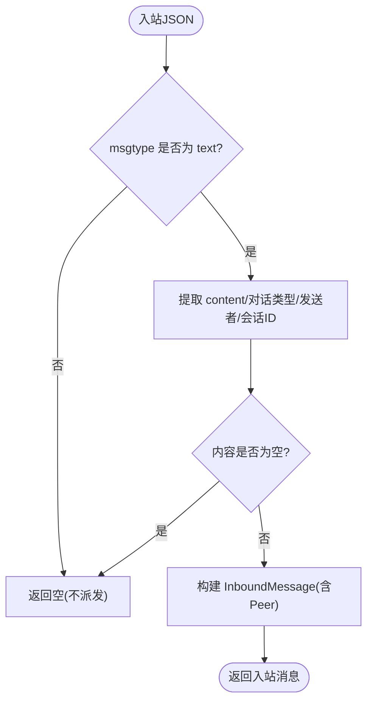
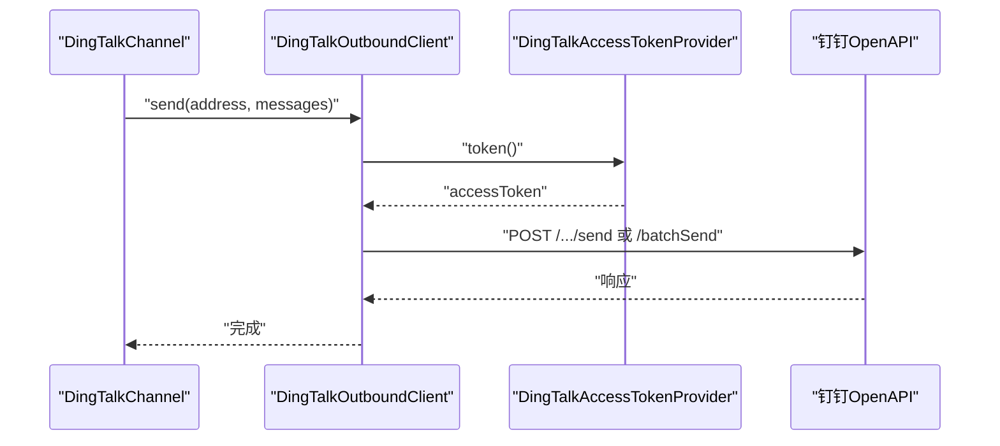
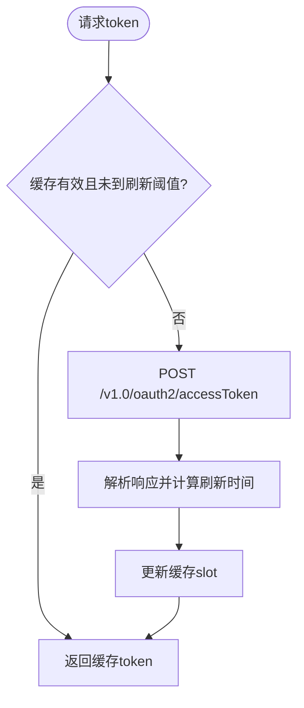
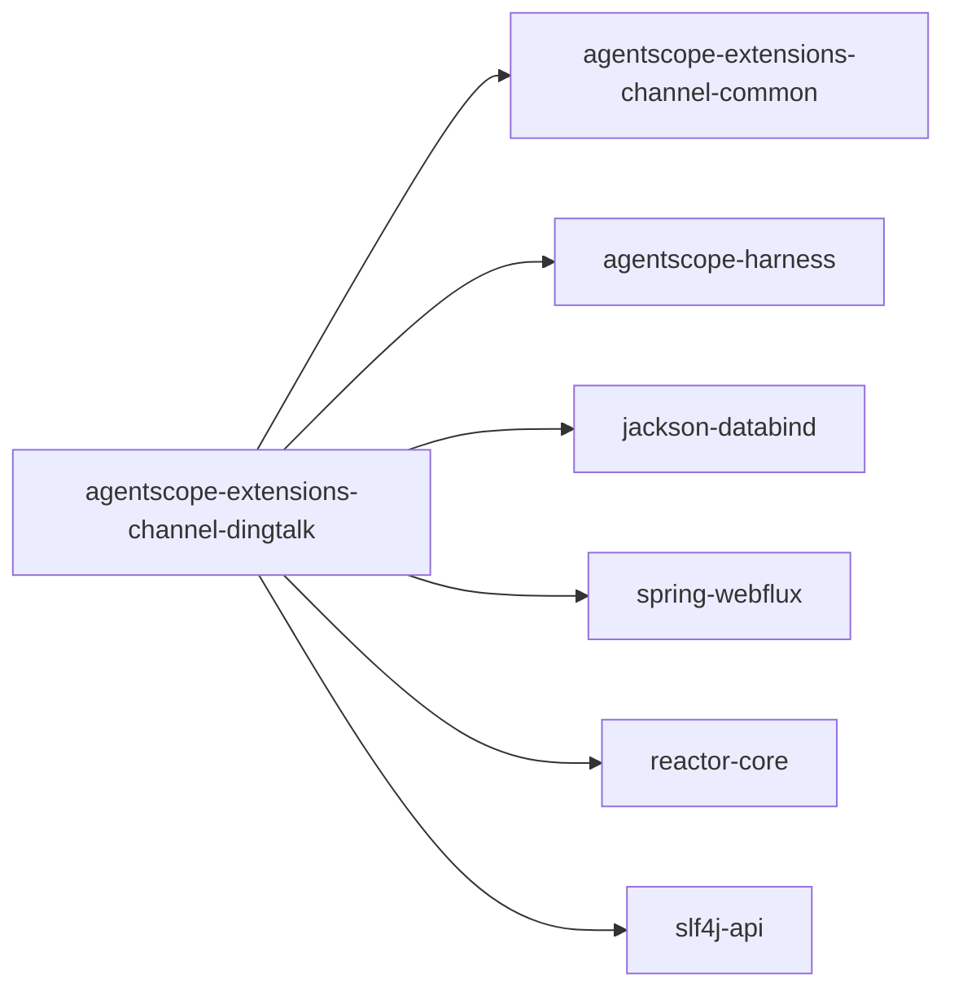

# 钉钉集成

<cite>
**本文引用的文件**
- [DingTalkChannel.java](file://agentscope-extensions/agentscope-extensions-channel/agentscope-extensions-channel-dingtalk/src/main/java/io/agentscope/extensions/channel/dingtalk/DingTalkChannel.java)
- [DingTalkChannelProperties.java](file://agentscope-extensions/agentscope-extensions-channel/agentscope-extensions-channel-dingtalk/src/main/java/io/agentscope/extensions/channel/dingtalk/DingTalkChannelProperties.java)
- [DingTalkInboundMapper.java](file://agentscope-extensions/agentscope-extensions-channel/agentscope-extensions-channel-dingtalk/src/main/java/io/agentscope/extensions/channel/dingtalk/DingTalkInboundMapper.java)
- [DingTalkOutboundClient.java](file://agentscope-extensions/agentscope-extensions-channel/agentscope-extensions-channel-dingtalk/src/main/java/io/agentscope/extensions/channel/dingtalk/DingTalkOutboundClient.java)
- [DingTalkAccessTokenProvider.java](file://agentscope-extensions/agentscope-extensions-channel/agentscope-extensions-channel-dingtalk/src/main/java/io/agentscope/extensions/channel/dingtalk/DingTalkAccessTokenProvider.java)
- [DingTalkStreamClient.java](file://agentscope-extensions/agentscope-extensions-channel/agentscope-extensions-channel-dingtalk/src/main/java/io/agentscope/extensions/channel/dingtalk/DingTalkStreamClient.java)
- [BotLoopGuard.java](file://agentscope-extensions/agentscope-extensions-channel/agentscope-extensions-channel-common/src/main/java/io/agentscope/extensions/channel/common/BotLoopGuard.java)
- [IdempotencyStore.java](file://agentscope-extensions/agentscope-extensions-channel/agentscope-extensions-channel-common/src/main/java/io/agentscope/extensions/channel/common/IdempotencyStore.java)
- [dingtalk.md](file://docs/v2/en/integration/channel/dingtalk.md)
- [pom.xml](file://agentscope-extensions/agentscope-extensions-channel/agentscope-extensions-channel-dingtalk/pom.xml)
</cite>

## 目录
1. [简介](#简介)
2. [项目结构](#项目结构)
3. [核心组件](#核心组件)
4. [架构总览](#架构总览)
5. [详细组件分析](#详细组件分析)
6. [依赖分析](#依赖分析)
7. [性能考虑](#性能考虑)
8. [故障排查指南](#故障排查指南)
9. [结论](#结论)
10. [附录](#附录)

## 简介
本文件面向“钉钉通道集成”的技术文档，聚焦于基于钉钉 Stream 协议（持久 WebSocket）的消息收发机制与安全控制。内容涵盖：
- 入站消息：WebSocket 长连接、ACK 应答、消息去重（基于 msgId）、防环路保护（滑动窗口）
- 出站消息：按会话类型选择 OpenAPI 接口（单聊/群聊），自动识别文本或 Markdown 格式
- 认证流程：基于 OpenAPI 的 accessToken 获取与缓存刷新
- 消息格式转换：从钉钉 Stream 回调 JSON 映射到内部消息模型
- 配置参数与部署步骤、调试方法、最佳实践

## 项目结构
钉钉通道位于独立模块中，依赖通用通道公共组件与 Harness 网关框架，使用 Spring WebFlux 与 Reactor 进行异步处理。

图示来源
- [DingTalkChannel.java:1-250](file://agentscope-extensions/agentscope-extensions-channel/agentscope-extensions-channel-dingtalk/src/main/java/io/agentscope/extensions/channel/dingtalk/DingTalkChannel.java#L1-L250)
- [DingTalkStreamClient.java:1-306](file://agentscope-extensions/agentscope-extensions-channel/agentscope-extensions-channel-dingtalk/src/main/java/io/agentscope/extensions/channel/dingtalk/DingTalkStreamClient.java#L1-L306)
- [DingTalkInboundMapper.java:1-120](file://agentscope-extensions/agentscope-extensions-channel/agentscope-extensions-channel-dingtalk/src/main/java/io/agentscope/extensions/channel/dingtalk/DingTalkInboundMapper.java#L1-L120)
- [DingTalkOutboundClient.java:1-176](file://agentscope-extensions/agentscope-extensions-channel/agentscope-extensions-channel-dingtalk/src/main/java/io/agentscope/extensions/channel/dingtalk/DingTalkOutboundClient.java#L1-L176)
- [DingTalkAccessTokenProvider.java:1-103](file://agentscope-extensions/agentscope-extensions-channel/agentscope-extensions-channel-dingtalk/src/main/java/io/agentscope/extensions/channel/dingtalk/DingTalkAccessTokenProvider.java#L1-L103)
- [DingTalkChannelProperties.java:1-87](file://agentscope-extensions/agentscope-extensions-channel/agentscope-extensions-channel-dingtalk/src/main/java/io/agentscope/extensions/channel/dingtalk/DingTalkChannelProperties.java#L1-L87)
- [IdempotencyStore.java:1-96](file://agentscope-extensions/agentscope-extensions-channel/agentscope-extensions-channel-common/src/main/java/io/agentscope/extensions/channel/common/IdempotencyStore.java#L1-L96)
- [BotLoopGuard.java:1-95](file://agentscope-extensions/agentscope-extensions-channel/agentscope-extensions-channel-common/src/main/java/io/agentscope/extensions/channel/common/BotLoopGuard.java#L1-L95)

章节来源
- [pom.xml:1-72](file://agentscope-extensions/agentscope-extensions-channel/agentscope-extensions-channel-dingtalk/pom.xml#L1-L72)
- [dingtalk.md:1-65](file://docs/v2/en/integration/channel/dingtalk.md#L1-L65)

## 核心组件
- 通道适配器（DingTalkChannel）
  - 负责生命周期管理（启动/停止）、路由分发、回复发送
  - 组合入站映射器、出站客户端、令牌提供器、去重存储、防环路保护、通道路由器
- WebSocket 客户端（DingTalkStreamClient）
  - 注册 Stream 连接、建立持久 WebSocket、ACK 回调帧、断线重连（指数退避）
- 入站映射器（DingTalkInboundMapper）
  - 将钉钉 Stream 回调 JSON 解析为内部 InboundMessage；支持 DM 与群聊；仅在当前 MVP 中处理 text 类型
- 出站客户端（DingTalkOutboundClient）
  - 基于 WebFlux 发送 OpenAPI 请求；根据会话类型选择接口；自动检测 Markdown 文本
- 访问令牌提供器（DingTalkAccessTokenProvider）
  - 缓存 accessToken 并在接近过期时主动刷新；异常时可失效令牌强制重新获取
- 通道配置（DingTalkChannelProperties）
  - appKey/appSecret/robotCode 必填；支持覆盖 OpenAPI 基础地址与 Stream 注册地址
- 通用组件
  - 去重存储（IdempotencyStore）：按 msgId 去重，带 TTL 与容量限制
  - 防环路保护（BotLoopGuard）：按会话维度的滑动窗口节流

章节来源
- [DingTalkChannel.java:47-250](file://agentscope-extensions/agentscope-extensions-channel/agentscope-extensions-channel-dingtalk/src/main/java/io/agentscope/extensions/channel/dingtalk/DingTalkChannel.java#L47-L250)
- [DingTalkStreamClient.java:58-306](file://agentscope-extensions/agentscope-extensions-channel/agentscope-extensions-channel-dingtalk/src/main/java/io/agentscope/extensions/channel/dingtalk/DingTalkStreamClient.java#L58-L306)
- [DingTalkInboundMapper.java:46-120](file://agentscope-extensions/agentscope-extensions-channel/agentscope-extensions-channel-dingtalk/src/main/java/io/agentscope/extensions/channel/dingtalk/DingTalkInboundMapper.java#L46-L120)
- [DingTalkOutboundClient.java:44-176](file://agentscope-extensions/agentscope-extensions-channel/agentscope-extensions-channel-dingtalk/src/main/java/io/agentscope/extensions/channel/dingtalk/DingTalkOutboundClient.java#L44-L176)
- [DingTalkAccessTokenProvider.java:34-103](file://agentscope-extensions/agentscope-extensions-channel/agentscope-extensions-channel-dingtalk/src/main/java/io/agentscope/extensions/channel/dingtalk/DingTalkAccessTokenProvider.java#L34-L103)
- [DingTalkChannelProperties.java:35-87](file://agentscope-extensions/agentscope-extensions-channel/agentscope-extensions-channel-dingtalk/src/main/java/io/agentscope/extensions/channel/dingtalk/DingTalkChannelProperties.java#L35-L87)
- [IdempotencyStore.java:30-96](file://agentscope-extensions/agentscope-extensions-channel/agentscope-extensions-channel-common/src/main/java/io/agentscope/extensions/channel/common/IdempotencyStore.java#L30-L96)
- [BotLoopGuard.java:29-95](file://agentscope-extensions/agentscope-extensions-channel/agentscope-extensions-channel-common/src/main/java/io/agentscope/extensions/channel/common/BotLoopGuard.java#L29-L95)

## 架构总览
下图展示从钉钉 Stream 到内部网关再到钉钉 OpenAPI 的完整链路，以及关键的安全与可靠性保障点。

图示来源
- [DingTalkStreamClient.java:211-261](file://agentscope-extensions/agentscope-extensions-channel/agentscope-extensions-channel-dingtalk/src/main/java/io/agentscope/extensions/channel/dingtalk/DingTalkStreamClient.java#L211-L261)
- [DingTalkChannel.java:181-210](file://agentscope-extensions/agentscope-extensions-channel/agentscope-extensions-channel-dingtalk/src/main/java/io/agentscope/extensions/channel/dingtalk/DingTalkChannel.java#L181-L210)
- [DingTalkInboundMapper.java:60-101](file://agentscope-extensions/agentscope-extensions-channel/agentscope-extensions-channel-dingtalk/src/main/java/io/agentscope/extensions/channel/dingtalk/DingTalkInboundMapper.java#L60-L101)
- [IdempotencyStore.java:56-67](file://agentscope-extensions/agentscope-extensions-channel/agentscope-extensions-channel-common/src/main/java/io/agentscope/extensions/channel/common/IdempotencyStore.java#L56-L67)
- [BotLoopGuard.java:55-77](file://agentscope-extensions/agentscope-extensions-channel/agentscope-extensions-channel-common/src/main/java/io/agentscope/extensions/channel/common/BotLoopGuard.java#L55-L77)
- [DingTalkOutboundClient.java:61-117](file://agentscope-extensions/agentscope-extensions-channel/agentscope-extensions-channel-dingtalk/src/main/java/io/agentscope/extensions/channel/dingtalk/DingTalkOutboundClient.java#L61-L117)
- [DingTalkAccessTokenProvider.java:53-92](file://agentscope-extensions/agentscope-extensions-channel/agentscope-extensions-channel-dingtalk/src/main/java/io/agentscope/extensions/channel/dingtalk/DingTalkAccessTokenProvider.java#L53-L92)

## 详细组件分析

### 通道适配器（DingTalkChannel）
职责与行为
- 生命周期：启动时初始化 Stream 客户端；停止时释放资源
- 分发：将入站消息经路由后交由网关执行，并在完成后发送回复
- 安全控制：入站路径上依次进行去重与防环路保护
- 外部交互：通过出站客户端调用 OpenAPI 批量发送

图示来源
- [DingTalkChannel.java:47-250](file://agentscope-extensions/agentscope-extensions-channel/agentscope-extensions-channel-dingtalk/src/main/java/io/agentscope/extensions/channel/dingtalk/DingTalkChannel.java#L47-L250)

章节来源
- [DingTalkChannel.java:89-108](file://agentscope-extensions/agentscope-extensions-channel/agentscope-extensions-channel-dingtalk/src/main/java/io/agentscope/extensions/channel/dingtalk/DingTalkChannel.java#L89-L108)
- [DingTalkChannel.java:132-145](file://agentscope-extensions/agentscope-extensions-channel/agentscope-extensions-channel-dingtalk/src/main/java/io/agentscope/extensions/channel/dingtalk/DingTalkChannel.java#L132-L145)
- [DingTalkChannel.java:147-175](file://agentscope-extensions/agentscope-extensions-channel/agentscope-extensions-channel-dingtalk/src/main/java/io/agentscope/extensions/channel/dingtalk/DingTalkChannel.java#L147-L175)
- [DingTalkChannel.java:181-210](file://agentscope-extensions/agentscope-extensions-channel/agentscope-extensions-channel-dingtalk/src/main/java/io/agentscope/extensions/channel/dingtalk/DingTalkChannel.java#L181-L210)

### WebSocket 客户端（DingTalkStreamClient）
职责与行为
- 注册：向指定注册地址提交 appKey/appSecret 与订阅主题，获取 endpoint 与 ticket
- 连接：建立 WebSocket，接收回调帧，ACK 后解析 payload 并回调上层
- 重连：断开后以指数退避策略重试，上限 60 秒
- 错误处理：日志记录、异常恢复、优雅关闭

图示来源
- [DingTalkStreamClient.java:117-175](file://agentscope-extensions/agentscope-extensions-channel/agentscope-extensions-channel-dingtalk/src/main/java/io/agentscope/extensions/channel/dingtalk/DingTalkStreamClient.java#L117-L175)
- [DingTalkStreamClient.java:211-261](file://agentscope-extensions/agentscope-extensions-channel/agentscope-extensions-channel-dingtalk/src/main/java/io/agentscope/extensions/channel/dingtalk/DingTalkStreamClient.java#L211-L261)

章节来源
- [DingTalkStreamClient.java:177-209](file://agentscope-extensions/agentscope-extensions-channel/agentscope-extensions-channel-dingtalk/src/main/java/io/agentscope/extensions/channel/dingtalk/DingTalkStreamClient.java#L177-L209)
- [DingTalkStreamClient.java:263-302](file://agentscope-extensions/agentscope-extensions-channel/agentscope-extensions-channel-dingtalk/src/main/java/io/agentscope/extensions/channel/dingtalk/DingTalkStreamClient.java#L263-L302)

### 入站消息映射器（DingTalkInboundMapper）
职责与行为
- 仅处理 text 类型消息；非 text 或空内容直接丢弃
- 解析对话类型：DM 与群聊；群聊通常为被 @ 触发
- 构建内部消息对象与对端标识（staffId/conversationId）

图示来源
- [DingTalkInboundMapper.java:60-101](file://agentscope-extensions/agentscope-extensions-channel/agentscope-extensions-channel-dingtalk/src/main/java/io/agentscope/extensions/channel/dingtalk/DingTalkInboundMapper.java#L60-L101)

章节来源
- [DingTalkInboundMapper.java:27-45](file://agentscope-extensions/agentscope-extensions-channel/agentscope-extensions-channel-dingtalk/src/main/java/io/agentscope/extensions/channel/dingtalk/DingTalkInboundMapper.java#L27-L45)

### 出站客户端（DingTalkOutboundClient）
职责与行为
- 自动识别 Markdown：包含换行、粗体、代码块、链接等特征
- 会话类型路由：群聊使用 groupMessages/send；单聊使用 oToMessages/batchSend
- 认证头注入：通过 x-acs-dingtalk-access-token 传递 accessToken
- 异常处理：当响应提示 token 相关错误时触发令牌失效，以便下次请求自动刷新

图示来源
- [DingTalkOutboundClient.java:61-117](file://agentscope-extensions/agentscope-extensions-channel/agentscope-extensions-channel-dingtalk/src/main/java/io/agentscope/extensions/channel/dingtalk/DingTalkOutboundClient.java#L61-L117)
- [DingTalkAccessTokenProvider.java:53-92](file://agentscope-extensions/agentscope-extensions-channel/agentscope-extensions-channel-dingtalk/src/main/java/io/agentscope/extensions/channel/dingtalk/DingTalkAccessTokenProvider.java#L53-L92)

章节来源
- [DingTalkOutboundClient.java:119-139](file://agentscope-extensions/agentscope-extensions-channel/agentscope-extensions-channel-dingtalk/src/main/java/io/agentscope/extensions/channel/dingtalk/DingTalkOutboundClient.java#L119-L139)

### 访问令牌提供器（DingTalkAccessTokenProvider）
职责与行为
- 缓存 accessToken，TTL 约 7200 秒；在 80% 过期时主动刷新
- 提供失效接口，用于在认证失败场景强制重新获取
- 使用新的 OpenAPI /v1.0/oauth2/accessToken，不再使用旧版 /gettoken

图示来源
- [DingTalkAccessTokenProvider.java:53-92](file://agentscope-extensions/agentscope-extensions-channel/agentscope-extensions-channel-dingtalk/src/main/java/io/agentscope/extensions/channel/dingtalk/DingTalkAccessTokenProvider.java#L53-L92)

章节来源
- [DingTalkAccessTokenProvider.java:27-33](file://agentscope-extensions/agentscope-extensions-channel/agentscope-extensions-channel-dingtalk/src/main/java/io/agentscope/extensions/channel/dingtalk/DingTalkAccessTokenProvider.java#L27-L33)

### 通道配置（DingTalkChannelProperties）
职责与行为
- 必填项：appKey、appSecret、robotCode
- 可选覆盖：apiBase、oapiBase、streamRegisterUrl，默认指向钉钉官方地址
- 提供从原始属性映射到配置对象的工厂方法

章节来源
- [DingTalkChannelProperties.java:35-87](file://agentscope-extensions/agentscope-extensions-channel/agentscope-extensions-channel-dingtalk/src/main/java/io/agentscope/extensions/channel/dingtalk/DingTalkChannelProperties.java#L35-L87)

### 通用组件

#### 消息ID去重存储（IdempotencyStore）
- 作用：按 msgId 去重，避免 webhook/回调重复投递导致的重复处理
- 特性：支持 TTL 过期与最大条目数限制，满载时按插入顺序淘汰最老条目

章节来源
- [IdempotencyStore.java:30-96](file://agentscope-extensions/agentscope-extensions-channel/agentscope-extensions-channel-common/src/main/java/io/agentscope/extensions/channel/common/IdempotencyStore.java#L30-L96)

#### 防环路保护（BotLoopGuard）
- 作用：按 peerKey 维度的滑动窗口限流，防止与某个用户/机器人陷入无限循环交互
- 默认策略：每 60 秒最多 20 条事件，超限进入 60 秒冷却

章节来源
- [BotLoopGuard.java:29-95](file://agentscope-extensions/agentscope-extensions-channel/agentscope-extensions-channel-common/src/main/java/io/agentscope/extensions/channel/common/BotLoopGuard.java#L29-L95)

## 依赖分析
- 模块依赖
  - 依赖 agentscope-extensions-channel-common（提供通用去重与防环路能力）
  - 依赖 agentscope-harness（提供网关与通道抽象）
  - 依赖 Jackson、Spring WebFlux、Reactor、SLF4J（运行时由宿主环境提供）

图示来源
- [pom.xml:32-69](file://agentscope-extensions/agentscope-extensions-channel/agentscope-extensions-channel-dingtalk/pom.xml#L32-L69)

章节来源
- [pom.xml:1-72](file://agentscope-extensions/agentscope-extensions-channel/agentscope-extensions-channel-dingtalk/pom.xml#L1-L72)

## 性能考虑
- 异步与背压
  - 使用 WebFlux 与 Reactor 在入站与出站路径上实现非阻塞 IO，降低线程占用
- 令牌缓存与预刷新
  - 通过 80% TTL 预刷新减少因令牌过期导致的延迟抖动
- 去重与限流
  - 去重存储与防环路保护共同降低无效工作负载，提升整体吞吐稳定性
- 断线重连
  - 指数退避上限 60 秒，避免雪崩式重试

## 故障排查指南
常见问题与定位建议
- WebSocket 连接失败
  - 检查注册地址与网络可达性；关注日志中的 HTTP 状态码与响应体
  - 关注重连日志，确认退避策略是否达到上限
- 回调未消费
  - 确认 ACK 是否成功发送；若 ACK 失败，可能导致消息滞留
- 重复消息
  - 检查去重存储是否生效；确认 msgId 字段是否存在
- 频繁环路
  - 检查防环路保护状态；必要时调整窗口与阈值
- 回复失败
  - 关注响应中是否包含 token 相关错误信息；此类错误会触发令牌失效，强制下次刷新
  - 确认会话类型与目标 ID 是否正确（群聊 vs 单聊）

章节来源
- [DingTalkStreamClient.java:125-131](file://agentscope-extensions/agentscope-extensions-channel/agentscope-extensions-channel-dingtalk/src/main/java/io/agentscope/extensions/channel/dingtalk/DingTalkStreamClient.java#L125-L131)
- [DingTalkOutboundClient.java:129-138](file://agentscope-extensions/agentscope-extensions-channel/agentscope-extensions-channel-dingtalk/src/main/java/io/agentscope/extensions/channel/dingtalk/DingTalkOutboundClient.java#L129-L138)
- [DingTalkChannel.java:183-189](file://agentscope-extensions/agentscope-extensions-channel/agentscope-extensions-channel-dingtalk/src/main/java/io/agentscope/extensions/channel/dingtalk/DingTalkChannel.java#L183-L189)
- [DingTalkChannel.java:195-201](file://agentscope-extensions/agentscope-extensions-channel/agentscope-extensions-channel-dingtalk/src/main/java/io/agentscope/extensions/channel/dingtalk/DingTalkChannel.java#L195-L201)

## 结论
钉钉通道通过 Stream 协议实现了低延迟、高可靠的消息推送与回复，结合去重与防环路保护，确保在复杂业务场景下的稳定性与安全性。配合自动令牌刷新与灵活的配置项，可在企业级环境中快速落地。

## 附录

### 配置示例与部署步骤
- 依赖引入
  - 在项目中添加钉钉通道模块依赖
- 配置项
  - appKey、appSecret、robotCode 必填
  - 可选覆盖 apiBase、streamRegisterUrl
- 快速启动
  - 通过工厂方法创建通道实例并接入网关，启动后自动建立 WebSocket 并开始分发

章节来源
- [dingtalk.md:10-65](file://docs/v2/en/integration/channel/dingtalk.md#L10-L65)

### 最佳实践
- 消息ID去重
  - 确保 msgId 字段可用；合理设置去重 TTL 与容量，避免误删
- 机器人代码配置
  - robotCode 作为出站发送身份标识，需与钉钉侧配置一致
- API 基础地址
  - 默认地址即可满足大多数场景；如需自定义，确保与钉钉官方文档一致
- 防环路保护
  - 根据业务流量调优窗口大小与阈值；超限时冷却策略有助于避免风暴
- 调试方法
  - 开启相应日志级别，观察注册、连接、ACK、去重、限流与发送响应