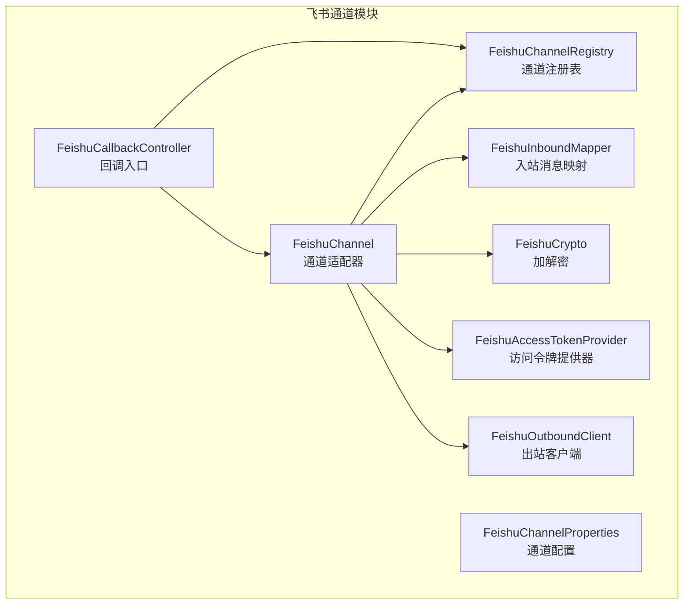
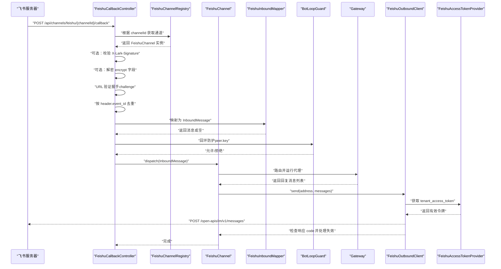
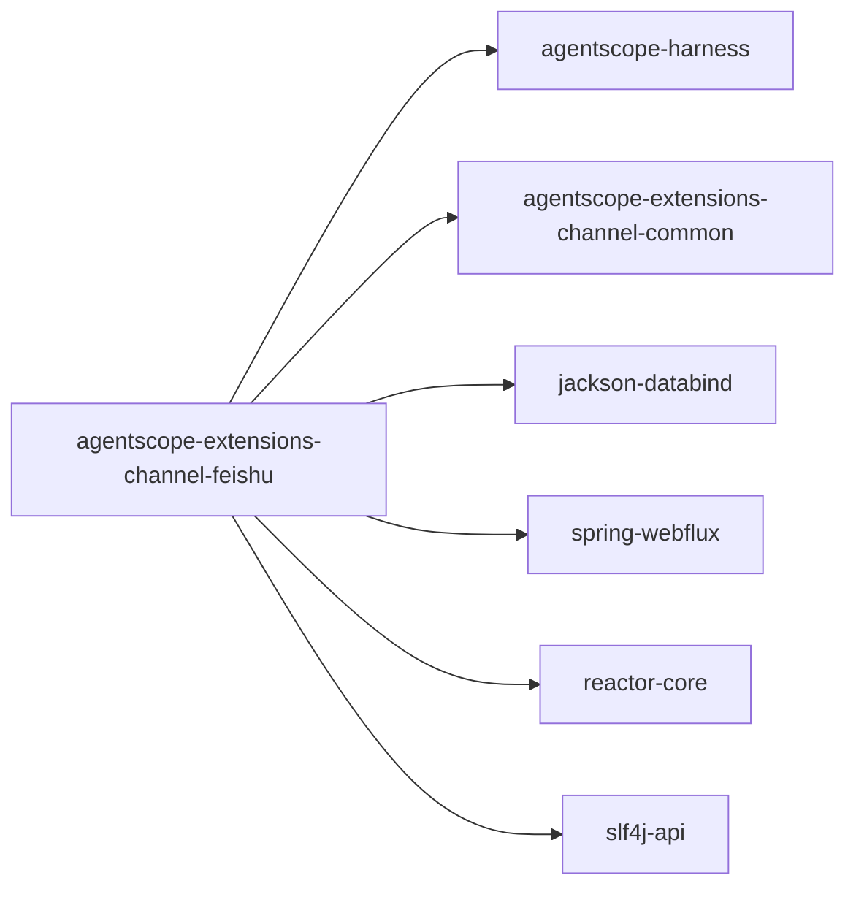

# 飞书集成

<cite>
**本文引用的文件**
- [FeishuChannel.java](file://agentscope-extensions/agentscope-extensions-channel/agentscope-extensions-channel-feishu/src/main/java/io/agentscope/extensions/channel/feishu/FeishuChannel.java)
- [FeishuCallbackController.java](file://agentscope-extensions/agentscope-extensions-channel/agentscope-extensions-channel-feishu/src/main/java/io/agentscope/extensions/channel/feishu/FeishuCallbackController.java)
- [FeishuCrypto.java](file://agentscope-extensions/agentscope-extensions-channel/agentscope-extensions-channel-feishu/src/main/java/io/agentscope/extensions/channel/feishu/FeishuCrypto.java)
- [FeishuInboundMapper.java](file://agentscope-extensions/agentscope-extensions-channel/agentscope-extensions-channel-feishu/src/main/java/io/agentscope/extensions/channel/feishu/FeishuInboundMapper.java)
- [FeishuOutboundClient.java](file://agentscope-extensions/agentscope-extensions-channel/agentscope-extensions-channel-feishu/src/main/java/io/agentscope/extensions/channel/feishu/FeishuOutboundClient.java)
- [FeishuAccessTokenProvider.java](file://agentscope-extensions/agentscope-extensions-channel/agentscope-extensions-channel-feishu/src/main/java/io/agentscope/extensions/channel/feishu/FeishuAccessTokenProvider.java)
- [FeishuChannelProperties.java](file://agentscope-extensions/agentscope-extensions-channel/agentscope-extensions-channel-feishu/src/main/java/io/agentscope/extensions/channel/feishu/FeishuChannelProperties.java)
- [FeishuChannelRegistry.java](file://agentscope-extensions/agentscope-extensions-channel/agentscope-extensions-channel-feishu/src/main/java/io/agentscope/extensions/channel/feishu/FeishuChannelRegistry.java)
- [feishu.md](file://docs/v2/en/integration/channel/feishu.md)
- [pom.xml](file://agentscope-extensions/agentscope-extensions-channel/agentscope-extensions-channel-feishu/pom.xml)
</cite>

## 目录
1. [简介](#简介)
2. [项目结构](#项目结构)
3. [核心组件](#核心组件)
4. [架构总览](#架构总览)
5. [组件详解](#组件详解)
6. [依赖关系分析](#依赖关系分析)
7. [性能与可靠性](#性能与可靠性)
8. [故障排查指南](#故障排查指南)
9. [结论](#结论)
10. [附录：配置与最佳实践](#附录配置与最佳实践)

## 简介
本文件面向在 AgentScope 中集成飞书（Lark）通道的开发者，系统性说明 Webhook 回调处理、消息加解密、机器人消息发送机制，以及配置参数、签名验证、消息 ID 去重、访问令牌管理与权限配置等关键实现细节。内容覆盖从入口控制器到出站客户端的完整链路，并提供调试方法与最佳实践建议。

## 项目结构
飞书通道位于独立模块中，核心类围绕“回调控制器—入站映射—通道适配—出站客户端—令牌提供器”的职责划分组织，配合通用的幂等存储与回环防护组件，形成可扩展的事件订阅处理流水线。

图示来源
- [FeishuCallbackController.java:51-174](file://agentscope-extensions/agentscope-extensions-channel/agentscope-extensions-channel-feishu/src/main/java/io/agentscope/extensions/channel/feishu/FeishuCallbackController.java#L51-L174)
- [FeishuChannel.java:46-220](file://agentscope-extensions/agentscope-extensions-channel/agentscope-extensions-channel-feishu/src/main/java/io/agentscope/extensions/channel/feishu/FeishuChannel.java#L46-L220)
- [FeishuInboundMapper.java:53-165](file://agentscope-extensions/agentscope-extensions-channel/agentscope-extensions-channel-feishu/src/main/java/io/agentscope/extensions/channel/feishu/FeishuInboundMapper.java#L53-L165)
- [FeishuOutboundClient.java:46-154](file://agentscope-extensions/agentscope-extensions-channel/agentscope-extensions-channel-feishu/src/main/java/io/agentscope/extensions/channel/feishu/FeishuOutboundClient.java#L46-L154)
- [FeishuAccessTokenProvider.java:34-106](file://agentscope-extensions/agentscope-extensions-channel/agentscope-extensions-channel-feishu/src/main/java/io/agentscope/extensions/channel/feishu/FeishuAccessTokenProvider.java#L34-L106)
- [FeishuCrypto.java:43-139](file://agentscope-extensions/agentscope-extensions-channel/agentscope-extensions-channel-feishu/src/main/java/io/agentscope/extensions/channel/feishu/FeishuCrypto.java#L43-L139)
- [FeishuChannelRegistry.java:26-51](file://agentscope-extensions/agentscope-extensions-channel/agentscope-extensions-channel-feishu/src/main/java/io/agentscope/extensions/channel/feishu/FeishuChannelRegistry.java#L26-L51)

章节来源
- [pom.xml:32-68](file://agentscope-extensions/agentscope-extensions-channel/agentscope-extensions-channel-feishu/pom.xml#L32-L68)

## 核心组件
- 回调控制器：接收飞书回调，执行签名验证、解密、URL 验证握手、去重、回环防护与分发。
- 入站映射器：解析事件订阅 v2 的 JSON 包装体，提取文本消息并封装为统一入站消息。
- 通道适配器：生命周期管理、路由解析、网关调度与回复发送。
- 出站客户端：基于 WebClient 发送文本消息至飞书 IM 接口，自动携带租户访问令牌。
- 访问令牌提供器：拉取并缓存 tenant_access_token，支持主动刷新与失效处理。
- 加解密工具：实现 AES-256-CBC 解密与 SHA-256 签名验证。
- 通道配置：从 agentscope.json 的 channels.<id>.properties 读取 appId/appSecret/encryptKey/verificationToken/callbackPath/apiBase。
- 注册表：按 channelId 路由回调请求到对应通道实例。

章节来源
- [FeishuCallbackController.java:37-174](file://agentscope-extensions/agentscope-extensions-channel/agentscope-extensions-channel-feishu/src/main/java/io/agentscope/extensions/channel/feishu/FeishuCallbackController.java#L37-L174)
- [FeishuInboundMapper.java:28-165](file://agentscope-extensions/agentscope-extensions-channel/agentscope-extensions-channel-feishu/src/main/java/io/agentscope/extensions/channel/feishu/FeishuInboundMapper.java#L28-L165)
- [FeishuChannel.java:35-220](file://agentscope-extensions/agentscope-extensions-channel/agentscope-extensions-channel-feishu/src/main/java/io/agentscope/extensions/channel/feishu/FeishuChannel.java#L35-L220)
- [FeishuOutboundClient.java:34-154](file://agentscope-extensions/agentscope-extensions-channel/agentscope-extensions-channel-feishu/src/main/java/io/agentscope/extensions/channel/feishu/FeishuOutboundClient.java#L34-L154)
- [FeishuAccessTokenProvider.java:28-106](file://agentscope-extensions/agentscope-extensions-channel/agentscope-extensions-channel-feishu/src/main/java/io/agentscope/extensions/channel/feishu/FeishuAccessTokenProvider.java#L28-L106)
- [FeishuCrypto.java:26-139](file://agentscope-extensions/agentscope-extensions-channel/agentscope-extensions-channel-feishu/src/main/java/io/agentscope/extensions/channel/feishu/FeishuCrypto.java#L26-L139)
- [FeishuChannelProperties.java:21-84](file://agentscope-extensions/agentscope-extensions-channel/agentscope-extensions-channel-feishu/src/main/java/io/agentscope/extensions/channel/feishu/FeishuChannelProperties.java#L21-L84)
- [FeishuChannelRegistry.java:20-51](file://agentscope-extensions/agentscope-extensions-channel/agentscope-extensions-channel-feishu/src/main/java/io/agentscope/extensions/channel/feishu/FeishuChannelRegistry.java#L20-L51)

## 架构总览
下图展示从飞书回调到消息回复的端到端流程，包括加密、签名、去重、路由与发送等关键步骤。

图示来源
- [FeishuCallbackController.java:69-172](file://agentscope-extensions/agentscope-extensions-channel/agentscope-extensions-channel-feishu/src/main/java/io/agentscope/extensions/channel/feishu/FeishuCallbackController.java#L69-L172)
- [FeishuChannel.java:154-180](file://agentscope-extensions/agentscope-extensions-channel/agentscope-extensions-channel-feishu/src/main/java/io/agentscope/extensions/channel/feishu/FeishuChannel.java#L154-L180)
- [FeishuOutboundClient.java:59-103](file://agentscope-extensions/agentscope-extensions-channel/agentscope-extensions-channel-feishu/src/main/java/io/agentscope/extensions/channel/feishu/FeishuOutboundClient.java#L59-L103)
- [FeishuAccessTokenProvider.java:49-71](file://agentscope-extensions/agentscope-extensions-channel/agentscope-extensions-channel-feishu/src/main/java/io/agentscope/extensions/channel/feishu/FeishuAccessTokenProvider.java#L49-L71)

## 组件详解

### 回调控制器（FeishuCallbackController）
- 路由路径：/api/channels/feishu/{channelId}/callback
- 处理流程：
  1) 可选签名验证：当启用加密且存在 X-Lark-Signature 时，校验时间戳、随机数、加密密钥与原始请求体。
  2) 可选解密：若 envelope 含 encrypt 字段且已配置加密密钥，则先解密再解析。
  3) URL 验证握手：识别 type=url_verification，匹配 verificationToken 后回显 challenge。
  4) 去重：依据 header.event_id 使用幂等存储，重复事件直接返回 200。
  5) 映射与防护：将 JSON 映射为 InboundMessage；对发送者进行回环防护；最终通过通道分发。
- 错误处理：签名不匹配、解析失败、令牌不匹配、内部错误分别返回 401、400、401、500 等状态码。

章节来源
- [FeishuCallbackController.java:37-174](file://agentscope-extensions/agentscope-extensions-channel/agentscope-extensions-channel-feishu/src/main/java/io/agentscope/extensions/channel/feishu/FeishuCallbackController.java#L37-L174)

### 入站消息映射器（FeishuInboundMapper）
- 仅映射消息类型为 text 的事件；解析外层 schema 2.0 包装体，提取聊天类型、消息 ID、聊天标识、发送者 open_id、内容 JSON 字符串并二次解析出 text。
- 将 p2p/group 场景统一以 chat_id 作为对话键，构造 Peer 与 Msg，并设置账户标识与发送者标识。
- 提供静态方法用于抽取 event_id、challenge、sender_open_id、tenant_key，便于控制器快速处理。

章节来源
- [FeishuInboundMapper.java:28-165](file://agentscope-extensions/agentscope-extensions-channel/agentscope-extensions-channel-feishu/src/main/java/io/agentscope/extensions/channel/feishu/FeishuInboundMapper.java#L28-L165)

### 通道适配器（FeishuChannel）
- 类型标识：feishu；负责生命周期（init/start/stop）、路由解析、网关调度与回复发送。
- 依赖注入：FeishuCrypto、FeishuAccessTokenProvider、FeishuOutboundClient、FeishuInboundMapper、IdempotencyStore、BotLoopGuard、ChannelRouter、FeishuChannelRegistry。
- 分发逻辑：解析路由上下文与出站地址，提交消息给网关；收到回复后调用出站客户端发送文本消息。

章节来源
- [FeishuChannel.java:35-220](file://agentscope-extensions/agentscope-extensions-channel/agentscope-extensions-channel-feishu/src/main/java/io/agentscope/extensions/channel/feishu/FeishuChannel.java#L35-L220)

### 出站客户端（FeishuOutboundClient）
- 目标接口：/open-apis/im/v1/messages
- 参数选择：receive_id_type 固定为 chat_id（兼容 p2p 与 group），receive_id 来自 OutboundAddress。
- 发送策略：逐条发送文本消息；超时 10 秒；解析响应 code，遇到无效/过期令牌触发令牌提供器失效，以便后续自动刷新。
- 错误处理：非零 code 记录警告日志；解析异常记录告警。

章节来源
- [FeishuOutboundClient.java:34-154](file://agentscope-extensions/agentscope-extensions-channel/agentscope-extensions-channel-feishu/src/main/java/io/agentscope/extensions/channel/feishu/FeishuOutboundClient.java#L34-L154)

### 访问令牌提供器（FeishuAccessTokenProvider）
- 拉取接口：/open-apis/auth/v3/tenant_access_token/internal
- 缓存策略：命中则直接返回；接近 TTL 的 80% 时触发后台刷新；解析响应中的 expire 字段计算刷新时机。
- 异常处理：响应 code 非 0 抛出异常；解析失败抛出非法状态异常；提供 invalidate 强制失效能力。

章节来源
- [FeishuAccessTokenProvider.java:28-106](file://agentscope-extensions/agentscope-extensions-channel/agentscope-extensions-channel-feishu/src/main/java/io/agentscope/extensions/channel/feishu/FeishuAccessTokenProvider.java#L28-L106)

### 加密与签名（FeishuCrypto）
- 解密算法：AES-256-CBC，IV 16 字节，PKCS#7 填充；密钥由 encryptKey 进行 SHA-256 派生（32 字节）。
- 签名算法：SHA-256(timestamp + nonce + encryptKey + rawBody)，十六进制字符串比较，采用常量时间比较避免时序攻击。
- 输入校验：对过短密文、解析异常、派生失败进行严格校验与异常抛出。

章节来源
- [FeishuCrypto.java:26-139](file://agentscope-extensions/agentscope-extensions-channel/agentscope-extensions-channel-feishu/src/main/java/io/agentscope/extensions/channel/feishu/FeishuCrypto.java#L26-L139)

### 通道配置（FeishuChannelProperties）
- 必填项：appId、appSecret
- 可选项：encryptKey、verificationToken、callbackPath、apiBase
- 默认值：callbackPath 为 /api/channels/feishu/{channelId}/callback；apiBase 为 https://open.feishu.cn
- 工具方法：from(channelId, props) 从配置映射构建对象；isEncrypted() 判断是否启用加密

章节来源
- [FeishuChannelProperties.java:21-84](file://agentscope-extensions/agentscope-extensions-channel/agentscope-extensions-channel-feishu/src/main/java/io/agentscope/extensions/channel/feishu/FeishuChannelProperties.java#L21-L84)

### 通道注册表（FeishuChannelRegistry）
- 单例模式：进程内全局唯一
- 能力：register/unregister/get；回调控制器据此按 channelId 定位通道实例

章节来源
- [FeishuChannelRegistry.java:20-51](file://agentscope-extensions/agentscope-extensions-channel/agentscope-extensions-channel-feishu/src/main/java/io/agentscope/extensions/channel/feishu/FeishuChannelRegistry.java#L20-L51)

## 依赖关系分析
- 模块依赖：依赖 agentscope-harness（网关与通道框架）、agentscope-extensions-channel-common（通用组件如幂等存储、回环防护）、Jackson、Spring WebFlux、Reactor。
- 运行时要求：Spring Boot 应用需提供 WebFlux 环境以承载回调控制器；日志框架 SLF4J 输出运行日志。

图示来源
- [pom.xml:32-68](file://agentscope-extensions/agentscope-extensions-channel/agentscope-extensions-channel-feishu/pom.xml#L32-L68)

章节来源
- [pom.xml:32-68](file://agentscope-extensions/agentscope-extensions-channel/agentscope-extensions-channel-feishu/pom.xml#L32-L68)

## 性能与可靠性
- 流式发送：出站客户端逐条发送，结合令牌提供器的并发安全与自动刷新，降低单次失败影响。
- 超时控制：HTTP 请求设置 10 秒超时，避免阻塞。
- 幂等与去重：基于 header.event_id 的幂等存储确保重复事件不会被重复处理。
- 回环防护：通过 bot-loop guard 对同一会话键进行防护，防止代理自我回复引发循环。
- 令牌预热：在 80% TTL 时触发刷新，减少因令牌过期导致的失败重试。

## 故障排查指南
- 回调 401（签名不匹配）
  - 检查 X-Lark-Signature 是否正确传递；确认 encryptKey 与回调体一致；核对时间戳与随机数字段。
  - 参考：[FeishuCallbackController.java:85-92](file://agentscope-extensions/agentscope-extensions-channel/agentscope-extensions-channel-feishu/src/main/java/io/agentscope/extensions/channel/feishu/FeishuCallbackController.java#L85-L92)
- 回调 400（解析失败）
  - 若启用加密，确认 encrypt 字段可被正确解密；检查 JSON 结构是否符合事件订阅 v2 规范。
  - 参考：[FeishuCallbackController.java:94-114](file://agentscope-extensions/agentscope-extensions-channel/agentscope-extensions-channel-feishu/src/main/java/io/agentscope/extensions/channel/feishu/FeishuCallbackController.java#L94-L114)
- URL 验证失败
  - 确认 verificationToken 与挑战体中的 token 匹配；检查回调路径是否与飞书后台配置一致。
  - 参考：[FeishuCallbackController.java:116-132](file://agentscope-extensions/agentscope-extensions-channel/agentscope-extensions-channel-feishu/src/main/java/io/agentscope/extensions/channel/feishu/FeishuCallbackController.java#L116-L132)
- 重复事件静默处理
  - 若收到 200 但无业务处理，检查 header.event_id 是否重复；幂等存储会直接返回空响应。
  - 参考：[FeishuCallbackController.java:134-143](file://agentscope-extensions/agentscope-extensions-channel/agentscope-extensions-channel-feishu/src/main/java/io/agentscope/extensions/channel/feishu/FeishuCallbackController.java#L134-L143)
- 代理运行失败
  - 查看网关日志定位代理执行问题；控制器会捕获异常并返回 200 以避免 Feishu 重试。
  - 参考：[FeishuCallbackController.java:161-172](file://agentscope-extensions/agentscope-extensions-channel/agentscope-extensions-channel-feishu/src/main/java/io/agentscope/extensions/channel/feishu/FeishuCallbackController.java#L161-L172)
- 发送失败（code 非 0）
  - 关注响应中的 code 与 msg；若为无效/过期令牌，令牌提供器会失效缓存，下次自动刷新。
  - 参考：[FeishuOutboundClient.java:105-119](file://agentscope-extensions/agentscope-extensions-channel/agentscope-extensions-channel-feishu/src/main/java/io/agentscope/extensions/channel/feishu/FeishuOutboundClient.java#L105-L119)

## 结论
该飞书通道实现以清晰的职责分离与稳健的错误处理为核心，覆盖了从回调签名校验、加密解密、URL 验证、消息去重与回环防护，到代理调度与文本消息发送的全链路。通过可配置的通道属性与注册表路由，能够灵活接入多实例飞书通道，满足企业级场景下的安全性与可靠性要求。

## 附录：配置与最佳实践

### 飞书应用与权限配置
- 在飞书开放平台创建自定义应用，开启 Bot 能力。
- 在事件订阅中配置回调 URL：https://your-host/api/channels/feishu/{channelId}/callback
- 可选：启用加密密钥与验证令牌，提升传输安全与握手可信度。
- 参考文档：[feishu.md:20-27](file://docs/v2/en/integration/channel/feishu.md#L20-L27)

### 配置参数清单
- appId：必填，自定义应用 ID
- appSecret：必填，自定义应用密钥
- encryptKey：可选，启用回调体 AES-256-CBC 加密
- verificationToken：可选，URL 验证握手令牌
- callbackPath：可选，默认 /api/channels/feishu/{channelId}/callback
- apiBase：可选，默认 https://open.feishu.cn

章节来源
- [FeishuChannelProperties.java:21-84](file://agentscope-extensions/agentscope-extensions-channel/agentscope-extensions-channel-feishu/src/main/java/io/agentscope/extensions/channel/feishu/FeishuChannelProperties.java#L21-L84)
- [feishu.md:49-68](file://docs/v2/en/integration/channel/feishu.md#L49-L68)

### Webhook 回调配置要点
- 路径必须与 callbackPath 一致；若自定义路径，需同步更新飞书后台。
- 若启用加密，务必在飞书后台配置相同 encryptKey，并在通道配置中提供。
- 若启用 verificationToken，需在通道配置中提供并与飞书后台一致。

章节来源
- [feishu.md:24-26](file://docs/v2/en/integration/channel/feishu.md#L24-L26)

### 消息加解密与签名验证
- 加密：回调体为 {"encrypt":"<base64>"}，使用 SHA-256(encryptKey) 作为 AES 密钥，AES-256-CBC + PKCS#7。
- 签名：X-Lark-Signature = SHA-256(timestamp + nonce + encryptKey + rawBody)，十六进制比较。
- 调试建议：开启通道日志，观察回调体与签名头是否存在；确认 encryptKey 与飞书后台一致。

章节来源
- [FeishuCrypto.java:26-139](file://agentscope-extensions/agentscope-extensions-channel/agentscope-extensions-channel-feishu/src/main/java/io/agentscope/extensions/channel/feishu/FeishuCrypto.java#L26-L139)
- [FeishuCallbackController.java:85-92](file://agentscope-extensions/agentscope-extensions-channel/agentscope-extensions-channel-feishu/src/main/java/io/agentscope/extensions/channel/feishu/FeishuCallbackController.java#L85-L92)

### 消息 ID 去重与回环防护
- 去重：基于 header.event_id 的幂等存储，重复事件直接返回 200。
- 回环防护：基于对话键（peer.key）限制同一会话内的自我回复，避免循环。

章节来源
- [FeishuCallbackController.java:134-159](file://agentscope-extensions/agentscope-extensions-channel/agentscope-extensions-channel-feishu/src/main/java/io/agentscope/extensions/channel/feishu/FeishuCallbackController.java#L134-L159)

### 机器人权限与消息发送
- 机器人需具备“发送消息”权限；群聊与私聊均通过 chat_id 发送。
- 出站客户端固定 receive_id_type=chat_id，消息类型为 text；发送前自动携带 tenant_access_token。

章节来源
- [FeishuOutboundClient.java:34-154](file://agentscope-extensions/agentscope-extensions-channel/agentscope-extensions-channel-feishu/src/main/java/io/agentscope/extensions/channel/feishu/FeishuOutboundClient.java#L34-L154)

### 调试方法
- 打开通道日志，关注回调签名、解密、URL 验证、去重、映射与分发各阶段输出。
- 使用本地回显工具验证回调路径可达与飞书后台配置一致。
- 对比 X-Lark-Signature 生成过程与 encryptKey 内容，确保一致性。

章节来源
- [FeishuCallbackController.java:85-172](file://agentscope-extensions/agentscope-extensions-channel/agentscope-extensions-channel-feishu/src/main/java/io/agentscope/extensions/channel/feishu/FeishuCallbackController.java#L85-L172)
- [FeishuCrypto.java:65-84](file://agentscope-extensions/agentscope-extensions-channel/agentscope-extensions-channel-feishu/src/main/java/io/agentscope/extensions/channel/feishu/FeishuCrypto.java#L65-L84)