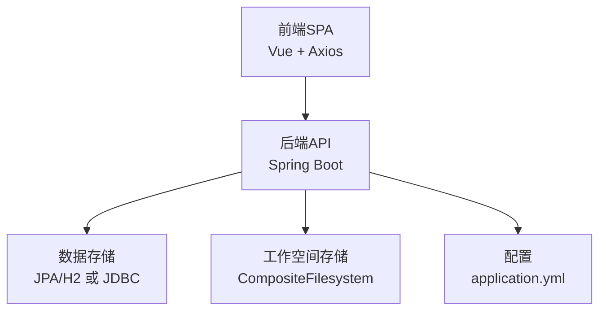
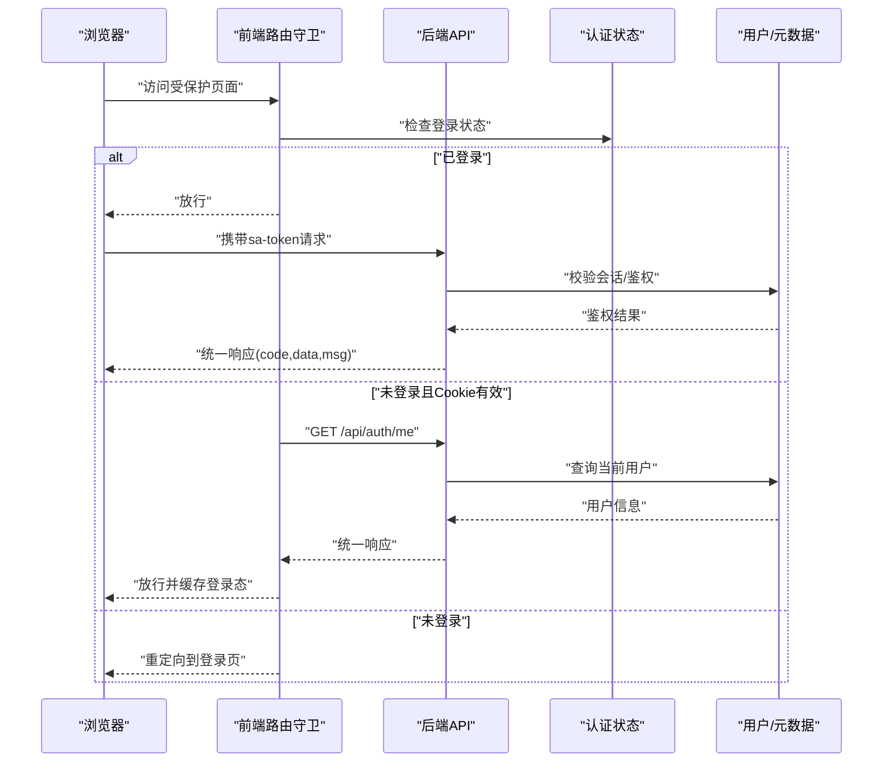
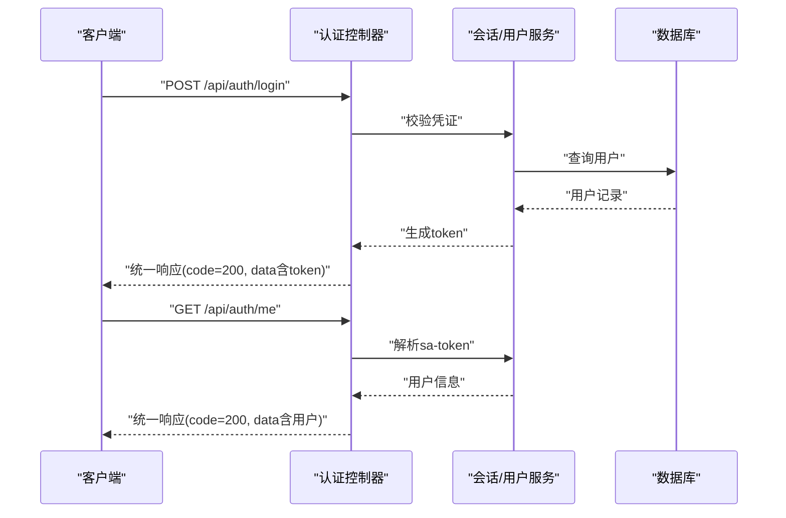
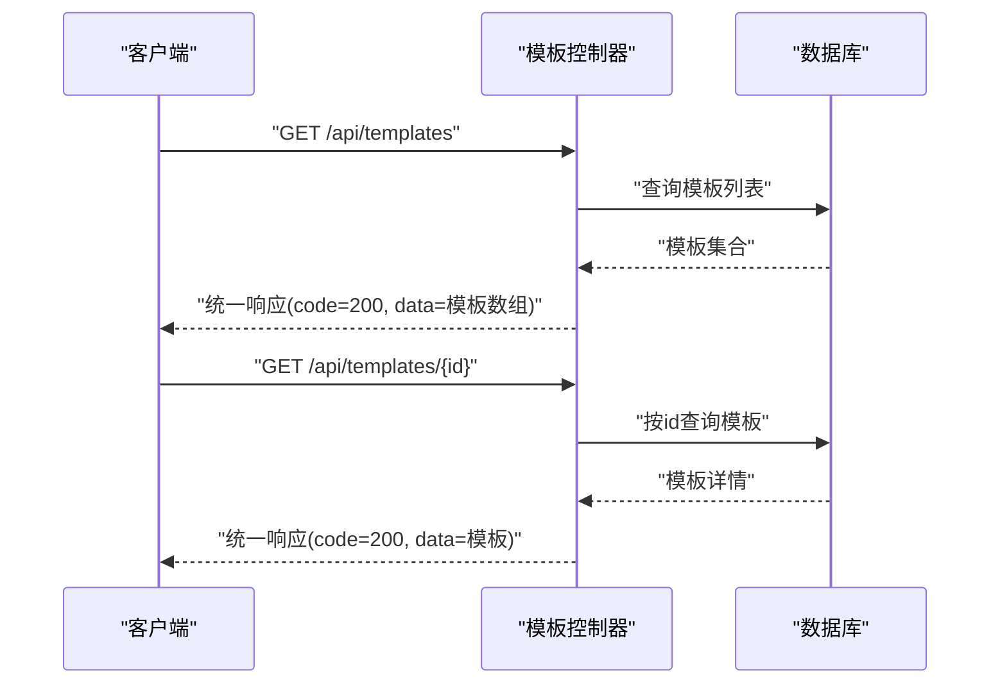
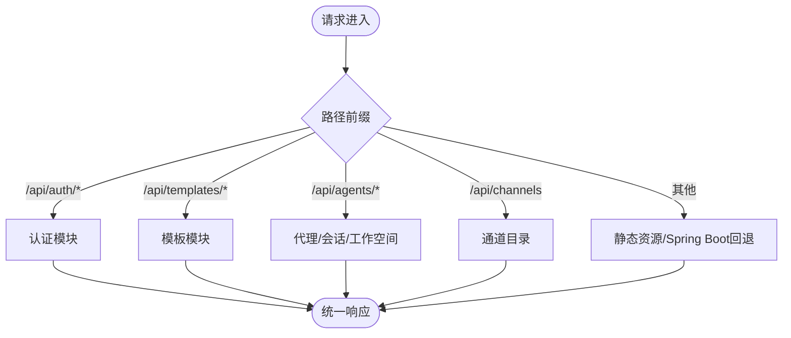
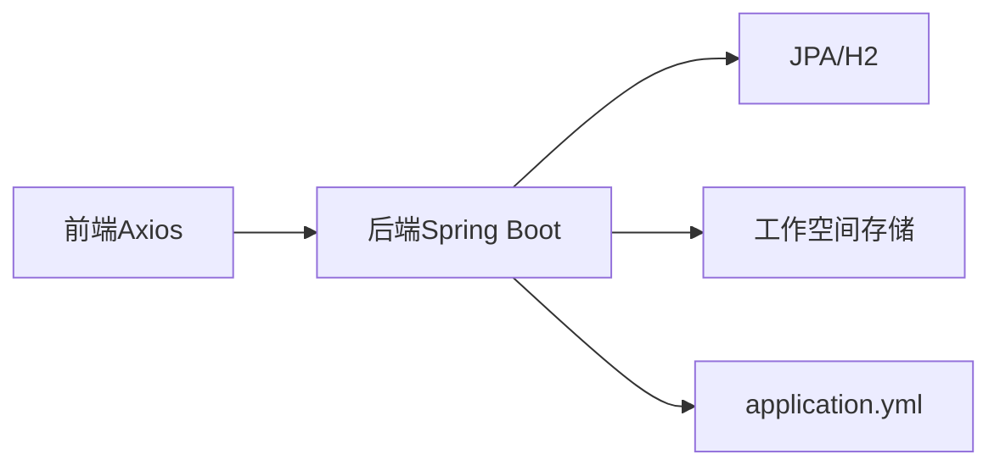

# API接口参考

<cite>
**本文档引用的文件**
- [BuilderApp.java](file://agentscope-examples/agents/agentscope-builder/src/main/java/io/agentscope/builder/BuilderApp.java)
- [application.yml](file://agentscope-examples/agents/agentscope-builder/src/main/resources/application.yml)
- [client.ts](file://agentscope-builder-saton/frontend/src/api/client.ts)
- [auth.ts](file://agentscope-builder-saton/frontend/src/api/auth.ts)
- [index.ts](file://agentscope-builder-saton/frontend/src/router/index.ts)
- [TestR.java](file://agentscope-builder-saton/src/test/java/io/agentscope/BuilderSaton/common/TestR.java)
- [TemplateFlowTest.java](file://agentscope-builder-saton/src/test/java/io/agentscope/BuilderSaton/template/TemplateFlowTest.java)
</cite>

## 目录
1. [简介](#简介)
2. [项目结构](#项目结构)
3. [核心组件](#核心组件)
4. [架构总览](#架构总览)
5. [详细组件分析](#详细组件分析)
6. [依赖关系分析](#依赖关系分析)
7. [性能考虑](#性能考虑)
8. [故障排除指南](#故障排除指南)
9. [结论](#结论)
10. [附录](#附录)

## 简介
本文件为构建器平台的API接口参考文档，覆盖认证、代理管理、会话管理、技能管理、模板管理等核心功能模块。文档基于仓库中的前端API客户端、后端启动类与配置、以及测试用例中暴露的端点进行整理，提供各接口的HTTP方法、URL路径、请求参数、响应格式、认证与权限控制、错误码与异常处理机制，并给出最佳实践与注意事项。

## 项目结构
构建器平台采用前后端分离架构：
- 后端：Spring Boot应用，提供REST API与静态资源服务，端口默认8080。
- 前端：Vue SPA，通过Axios统一发起请求，内置响应拦截器与路由守卫。
- 测试：基于WebTestClient的集成测试，验证关键端点行为。

图表来源
- [BuilderApp.java:26-33](file://agentscope-examples/agents/agentscope-builder/src/main/java/io/agentscope/builder/BuilderApp.java#L26-L33)
- [application.yml:25-45](file://agentscope-examples/agents/agentscope-builder/src/main/resources/application.yml#L25-L45)

章节来源
- [BuilderApp.java:21-33](file://agentscope-examples/agents/agentscope-builder/src/main/java/io/agentscope/builder/BuilderApp.java#L21-L33)
- [application.yml:1-119](file://agentscope-examples/agents/agentscope-builder/src/main/resources/application.yml#L1-L119)

## 核心组件
- 统一响应结构：后端返回统一包装对象，包含状态码、数据体与消息字段；前端拦截器约定code为200时表示成功。
- 认证体系：基于Cookie（sa-token）的会话认证，前端在请求头携带sa-token；后端通过路由前缀区分受保护与公开端点。
- 静态资源与SPA回退：后端对静态资源开放访问，并将未匹配路由回退到index.html，配合前端路由。
- 数据持久化：默认使用嵌入式H2数据库，可通过JDBC配置切换至MySQL/PostgreSQL；工作空间采用复合文件系统。

章节来源
- [client.ts:8-12](file://agentscope-builder-saton/frontend/src/api/client.ts#L8-L12)
- [client.ts:14-19](file://agentscope-builder-saton/frontend/src/api/client.ts#L14-L19)
- [client.ts:22-67](file://agentscope-builder-saton/frontend/src/api/client.ts#L22-L67)
- [BuilderApp.java:26-33](file://agentscope-examples/agents/agentscope-builder/src/main/java/io/agentscope/builder/BuilderApp.java#L26-L33)
- [application.yml:25-45](file://agentscope-examples/agents/agentscope-builder/src/main/resources/application.yml#L25-L45)

## 架构总览
下图展示从浏览器到后端API的关键交互流程，包括认证、路由守卫与统一响应处理。

图表来源
- [index.ts:69-85](file://agentscope-builder-saton/frontend/src/router/index.ts#L69-L85)
- [client.ts:22-67](file://agentscope-builder-saton/frontend/src/api/client.ts#L22-L67)
- [auth.ts:15-23](file://agentscope-builder-saton/frontend/src/api/auth.ts#L15-L23)

## 详细组件分析

### 认证模块
- 登录接口
  - 方法与路径：POST /api/auth/login
  - 请求参数：用户名、密码
  - 响应结构：统一响应，data包含token、userId、username
  - 认证方式：成功后后端设置Cookie（sa-token），后续请求在请求头携带该令牌
- 当前用户接口
  - 方法与路径：GET /api/auth/me
  - 请求参数：无
  - 响应结构：统一响应，data包含userId、username
  - 权限控制：需已登录或可凭Cookie恢复会话

图表来源
- [auth.ts:15-23](file://agentscope-builder-saton/frontend/src/api/auth.ts#L15-L23)
- [TestR.java:23-36](file://agentscope-builder-saton/src/test/java/io/agentscope/BuilderSaton/common/TestR.java#L23-L36)

章节来源
- [auth.ts:4-8](file://agentscope-builder-saton/frontend/src/api/auth.ts#L4-L8)
- [auth.ts:15-23](file://agentscope-builder-saton/frontend/src/api/auth.ts#L15-L23)
- [TestR.java:23-36](file://agentscope-builder-saton/src/test/java/io/agentscope/BuilderSaton/common/TestR.java#L23-L36)

### 模板管理模块
- 获取模板列表
  - 方法与路径：GET /api/templates
  - 请求参数：无
  - 响应结构：统一响应，data为模板数组
  - 权限控制：需登录（测试用例通过sa-token头访问）
- 获取指定模板
  - 方法与路径：GET /api/templates/{id}
  - 请求参数：路径参数id
  - 响应结构：统一响应，data为模板详情
  - 权限控制：需登录

图表来源
- [TemplateFlowTest.java:37-45](file://agentscope-builder-saton/src/test/java/io/agentscope/BuilderSaton/template/TemplateFlowTest.java#L37-L45)
- [TemplateFlowTest.java:49-59](file://agentscope-builder-saton/src/test/java/io/agentscope/BuilderSaton/template/TemplateFlowTest.java#L49-L59)

章节来源
- [TemplateFlowTest.java:37-45](file://agentscope-builder-saton/src/test/java/io/agentscope/BuilderSaton/template/TemplateFlowTest.java#L37-L45)
- [TemplateFlowTest.java:49-59](file://agentscope-builder-saton/src/test/java/io/agentscope/BuilderSaton/template/TemplateFlowTest.java#L49-L59)

### 会话与工作空间（概念性说明）
根据后端注释与配置，平台提供会话收件箱、通道绑定、工作空间CRUD等能力。这些能力通常通过以下路径前缀暴露：
- /api/agents/**：代理目录、每代理聊天（SSE）、工作空间CRUD、会话收件箱、通道绑定
- /api/channels：注册通道目录
- /api/templates/**：捆绑的启动模板

图表来源
- [BuilderApp.java:26-33](file://agentscope-examples/agents/agentscope-builder/src/main/java/io/agentscope/builder/BuilderApp.java#L26-L33)

章节来源
- [BuilderApp.java:26-33](file://agentscope-examples/agents/agentscope-builder/src/main/java/io/agentscope/builder/BuilderApp.java#L26-L33)

### 技能管理（概念性说明）
平台提供技能注册、工具工厂、中间件链等能力，用于扩展代理行为。技能管理通常通过代理配置与工具注册实现，具体端点需结合后端控制器定义。

章节来源
- [BuilderApp.java:28-30](file://agentscope-examples/agents/agentscope-builder/src/main/java/io/agentscope/builder/BuilderApp.java#L28-L30)

## 依赖关系分析
- 前端依赖
  - Axios：统一HTTP客户端，配置baseURL、超时、凭证传递与响应拦截
  - 路由守卫：在进入受保护路由前检查登录状态，必要时调用/me恢复会话
- 后端依赖
  - Spring Boot WebFlux：提供REST API与静态资源服务
  - JPA/H2：用户与元数据持久化，默认嵌入式，生产环境可切换JDBC
  - 工作空间存储：CompositeFilesystem，本地只读+远程可写混合存储

图表来源
- [client.ts:14-19](file://agentscope-builder-saton/frontend/src/api/client.ts#L14-L19)
- [application.yml:25-45](file://agentscope-examples/agents/agentscope-builder/src/main/resources/application.yml#L25-L45)

章节来源
- [client.ts:14-19](file://agentscope-builder-saton/frontend/src/api/client.ts#L14-L19)
- [application.yml:25-45](file://agentscope-examples/agents/agentscope-builder/src/main/resources/application.yml#L25-L45)

## 性能考虑
- 连接池与超时：前端Axios默认超时30秒，建议根据网络环境调整；后端WebFlux默认连接限制由容器决定，建议在生产环境配置连接池参数。
- 缓存策略：对于模板与通道目录等静态/半静态数据，可在前端实现轻量缓存，减少重复请求。
- SSE流式传输：代理聊天使用SSE，注意浏览器端的连接复用与断线重连策略。
- 数据库优化：生产环境建议使用MySQL/PostgreSQL并启用索引、分页查询与连接池配置。

## 故障排除指南
- 401 未授权
  - 现象：前端拦截器检测到401，清除本地登录态并跳转登录页
  - 处理：确认sa-token是否过期或被撤销，重新登录获取新令牌
- 403 禁止访问
  - 现象：无权限提示
  - 处理：检查用户角色与资源访问权限
- 业务错误（统一响应code非200）
  - 现象：后端返回统一响应，msg包含错误描述
  - 处理：根据msg提示修正请求参数或权限
- 服务器错误（5xx）
  - 现象：后端内部异常
  - 处理：查看后端日志，定位异常堆栈并修复

章节来源
- [client.ts:39-67](file://agentscope-builder-saton/frontend/src/api/client.ts#L39-L67)

## 结论
本参考文档基于现有代码与测试用例梳理了构建器平台的核心API端点与交互流程，明确了认证、模板管理等模块的接口规范与错误处理机制。建议在实际接入时：
- 明确sa-token的生命周期与刷新策略
- 在前端实现统一的错误提示与重试逻辑
- 生产环境务必替换默认JWT密钥与数据库配置
- 对高频接口实施缓存与限流策略

## 附录

### 统一响应结构
- 字段
  - code：数字，200表示成功
  - data：任意类型，承载业务数据
  - msg：字符串，错误消息或成功提示

章节来源
- [client.ts:8-12](file://agentscope-builder-saton/frontend/src/api/client.ts#L8-L12)

### 认证与权限控制
- 认证方式：Cookie（sa-token），前端自动携带
- 公开端点：/api/auth/login、/api/auth/me
- 受保护端点：/api/templates/** 等（测试用例显示需sa-token）

章节来源
- [auth.ts:15-23](file://agentscope-builder-saton/frontend/src/api/auth.ts#L15-L23)
- [TemplateFlowTest.java:38-42](file://agentscope-builder-saton/src/test/java/io/agentscope/BuilderSaton/template/TemplateFlowTest.java#L38-L42)

### API版本管理与兼容性
- 版本策略：当前仓库未发现明确的API版本号或版本协商机制
- 建议
  - 引入路径前缀版本（如/api/v1/...）
  - 使用Accept头部进行内容协商
  - 保持向后兼容，新增字段采用默认值，不破坏旧客户端

### 最佳实践与注意事项
- 前端
  - 在路由守卫中优先尝试 /api/auth/me 恢复会话
  - 对401统一跳转登录页，避免静默失败
  - 对高频接口增加本地缓存与节流
- 后端
  - 生产环境必须配置JWT密钥、数据库与工作空间存储
  - 对外暴露的端点需明确鉴权与权限边界
  - 日志级别与健康检查端点仅在必要时开启