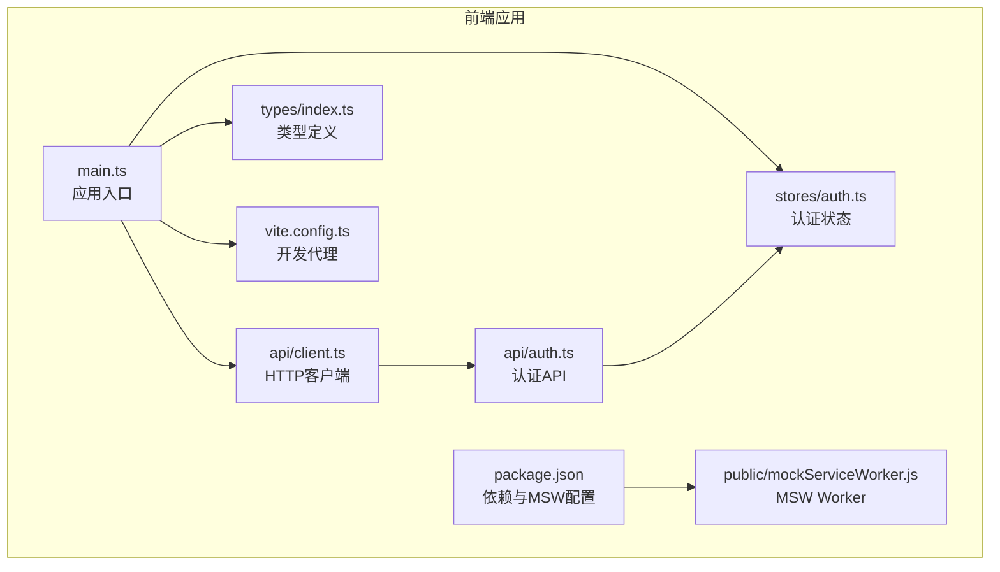
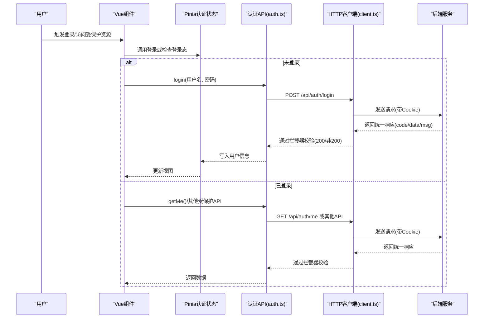
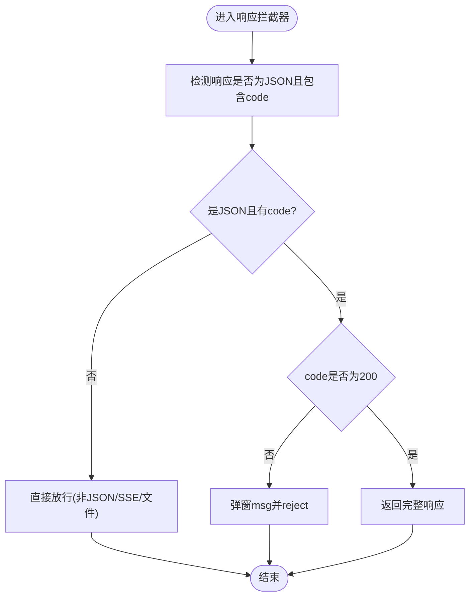
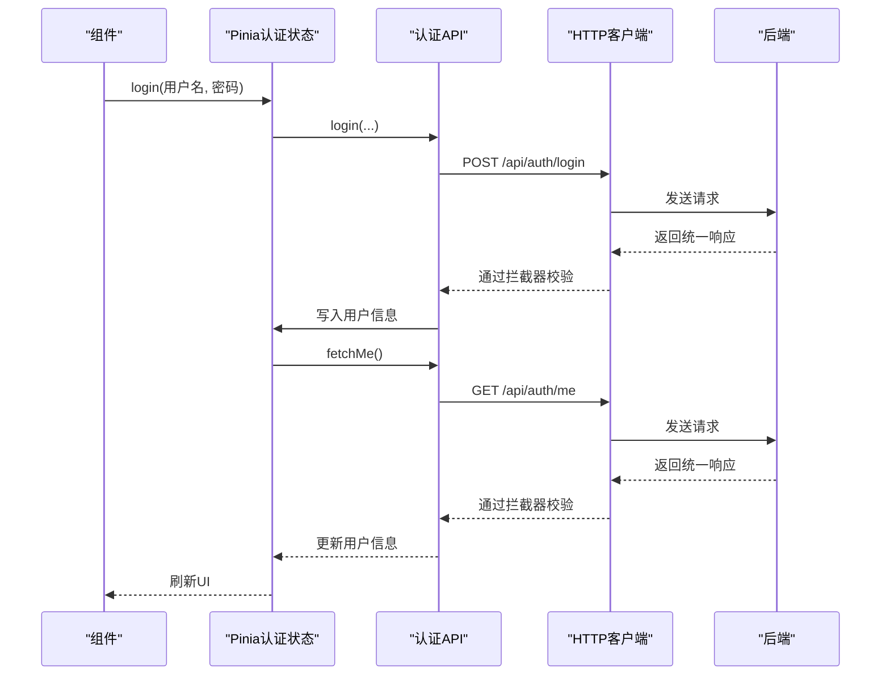
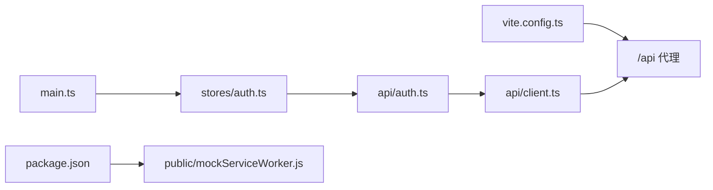

# API集成

<cite>
**本文引用的文件**
- [agentscope-builder-saton/frontend/src/api/client.ts](file://agentscope-builder-saton/frontend/src/api/client.ts)
- [agentscope-builder-saton/frontend/src/api/auth.ts](file://agentscope-builder-saton/frontend/src/api/auth.ts)
- [agentscope-builder-saton/frontend/src/stores/auth.ts](file://agentscope-builder-saton/frontend/src/stores/auth.ts)
- [agentscope-builder-saton/frontend/package.json](file://agentscope-builder-saton/frontend/package.json)
- [agentscope-builder-saton/frontend/public/mockServiceWorker.js](file://agentscope-builder-saton/frontend/public/mockServiceWorker.js)
- [agentscope-builder-saton/frontend/vite.config.ts](file://agentscope-builder-saton/frontend/vite.config.ts)
- [agentscope-builder-saton/frontend/src/main.ts](file://agentscope-builder-saton/frontend/src/main.ts)
- [agentscope-builder-saton/frontend/src/types/index.ts](file://agentscope-builder-saton/frontend/src/types/index.ts)
</cite>

## 目录
1. [简介](#简介)
2. [项目结构](#项目结构)
3. [核心组件](#核心组件)
4. [架构总览](#架构总览)
5. [详细组件分析](#详细组件分析)
6. [依赖关系分析](#依赖关系分析)
7. [性能考量](#性能考量)
8. [故障排查指南](#故障排查指南)
9. [结论](#结论)
10. [附录](#附录)

## 简介
本文件面向前端工程师，系统化梳理本项目的前端API集成方案，涵盖HTTP客户端配置、认证流程、资源API封装、Mock服务（MSW）集成、错误处理策略、缓存与重试机制、示例与最佳实践、API版本管理与向后兼容、安全与CORS配置等主题。目标是帮助你在不深入后端的情况下，也能高效、稳定地完成前后端联调与开发。

## 项目结构
前端位于 agentscope-builder-saton/frontend，采用Vue 3 + Vite + Pinia + Naive UI 技术栈。API层以axios为核心，统一响应结构与拦截器策略，并通过Pinia状态管理维护登录态与用户信息。Vite提供本地代理与开发体验，MSW用于在开发环境模拟后端接口。

图表来源
- [agentscope-builder-saton/frontend/src/main.ts:1-19](file://agentscope-builder-saton/frontend/src/main.ts#L1-L19)
- [agentscope-builder-saton/frontend/src/api/client.ts:1-70](file://agentscope-builder-saton/frontend/src/api/client.ts#L1-L70)
- [agentscope-builder-saton/frontend/src/api/auth.ts:1-24](file://agentscope-builder-saton/frontend/src/api/auth.ts#L1-L24)
- [agentscope-builder-saton/frontend/src/stores/auth.ts:1-41](file://agentscope-builder-saton/frontend/src/stores/auth.ts#L1-L41)
- [agentscope-builder-saton/frontend/src/types/index.ts:1-236](file://agentscope-builder-saton/frontend/src/types/index.ts#L1-L236)
- [agentscope-builder-saton/frontend/vite.config.ts:1-33](file://agentscope-builder-saton/frontend/vite.config.ts#L1-L33)
- [agentscope-builder-saton/frontend/package.json:1-53](file://agentscope-builder-saton/frontend/package.json#L1-L53)
- [agentscope-builder-saton/frontend/public/mockServiceWorker.js:1-350](file://agentscope-builder-saton/frontend/public/mockServiceWorker.js#L1-L350)

章节来源
- [agentscope-builder-saton/frontend/src/main.ts:1-19](file://agentscope-builder-saton/frontend/src/main.ts#L1-L19)
- [agentscope-builder-saton/frontend/vite.config.ts:1-33](file://agentscope-builder-saton/frontend/vite.config.ts#L1-L33)
- [agentscope-builder-saton/frontend/package.json:1-53](file://agentscope-builder-saton/frontend/package.json#L1-L53)

## 核心组件
- HTTP客户端与统一响应结构
  - 统一响应体结构与业务码约定，便于在拦截器中进行一致化的错误处理与提示。
  - 默认启用withCredentials，支持Cookie跨域场景（如sa-token）。
  - 预留SSE/文本/文件等非JSON响应通道，避免误判。
- 认证API与状态管理
  - 提供登录与获取当前用户信息的API方法。
  - 使用Pinia持久化存储用户信息，简化登录态恢复。
- 开发代理与Mock服务
  - Vite代理将/api前缀转发到后端服务，适配SSE缓存控制。
  - MSW Worker在浏览器侧拦截fetch请求，支持模拟响应与透传。

章节来源
- [agentscope-builder-saton/frontend/src/api/client.ts:1-70](file://agentscope-builder-saton/frontend/src/api/client.ts#L1-L70)
- [agentscope-builder-saton/frontend/src/api/auth.ts:1-24](file://agentscope-builder-saton/frontend/src/api/auth.ts#L1-L24)
- [agentscope-builder-saton/frontend/src/stores/auth.ts:1-41](file://agentscope-builder-saton/frontend/src/stores/auth.ts#L1-L41)
- [agentscope-builder-saton/frontend/vite.config.ts:1-33](file://agentscope-builder-saton/frontend/vite.config.ts#L1-L33)
- [agentscope-builder-saton/frontend/public/mockServiceWorker.js:1-350](file://agentscope-builder-saton/frontend/public/mockServiceWorker.js#L1-L350)

## 架构总览
下图展示从前端发起请求到后端响应的关键路径，以及认证流程与错误处理的联动：

图表来源
- [agentscope-builder-saton/frontend/src/api/auth.ts:1-24](file://agentscope-builder-saton/frontend/src/api/auth.ts#L1-L24)
- [agentscope-builder-saton/frontend/src/api/client.ts:1-70](file://agentscope-builder-saton/frontend/src/api/client.ts#L1-L70)
- [agentscope-builder-saton/frontend/src/stores/auth.ts:1-41](file://agentscope-builder-saton/frontend/src/stores/auth.ts#L1-L41)

## 详细组件分析

### HTTP客户端与拦截器
- axios实例配置要点
  - 基础URL留空，由代理与部署策略决定最终地址。
  - 超时30秒，适合长连接与SSE场景。
  - withCredentials: true，确保携带Cookie（如sa-token）。
  - Content-Type: application/json。
- 响应拦截器
  - 非JSON或缺失code字段的响应直接放行（SSE/文本/文件）。
  - code !== 200时，统一弹窗提示并reject错误。
  - code === 200时，返回完整响应以便调用方读取.data.data。
- 请求拦截器
  - 当前未实现，默认保持axios行为。
- 错误拦截器
  - 401：触发登出与路由跳转至登录页。
  - 403：提示“无权限”。
  - 5xx：提示“服务器错误”。
  - 超时：提示“请求超时”。

图表来源
- [agentscope-builder-saton/frontend/src/api/client.ts:21-67](file://agentscope-builder-saton/frontend/src/api/client.ts#L21-L67)

章节来源
- [agentscope-builder-saton/frontend/src/api/client.ts:1-70](file://agentscope-builder-saton/frontend/src/api/client.ts#L1-L70)

### 认证流程与状态管理
- 登录流程
  - 调用POST /api/auth/login，成功后立即调用GET /api/auth/me获取用户信息并写入Pinia。
  - 登录成功后，用户信息持久化到存储中，刷新页面仍可保持登录态。
- 登出流程
  - 清空用户信息，回到未登录状态。
- 401处理
  - 在响应拦截器中捕获401，触发store.logout并跳转到登录页，携带redirect参数保留原路径。

图表来源
- [agentscope-builder-saton/frontend/src/api/auth.ts:15-23](file://agentscope-builder-saton/frontend/src/api/auth.ts#L15-L23)
- [agentscope-builder-saton/frontend/src/stores/auth.ts:13-27](file://agentscope-builder-saton/frontend/src/stores/auth.ts#L13-L27)
- [agentscope-builder-saton/frontend/src/api/client.ts:39-48](file://agentscope-builder-saton/frontend/src/api/client.ts#L39-L48)

章节来源
- [agentscope-builder-saton/frontend/src/api/auth.ts:1-24](file://agentscope-builder-saton/frontend/src/api/auth.ts#L1-L24)
- [agentscope-builder-saton/frontend/src/stores/auth.ts:1-41](file://agentscope-builder-saton/frontend/src/stores/auth.ts#L1-L41)
- [agentscope-builder-saton/frontend/src/api/client.ts:39-48](file://agentscope-builder-saton/frontend/src/api/client.ts#L39-L48)

### 资源API封装与类型体系
- 类型体系
  - 用户、模型提供者、MCP服务器、技能仓库/市场、Agent、会话/聊天、工作区、工厂Schema等类型集中定义于types/index.ts，便于API层与组件层共享。
- API封装建议
  - 参考auth.ts的模式，为每个资源模块创建独立API文件，统一导出方法（如列表、详情、新增、更新、删除）。
  - 所有API方法均基于client.ts实例，遵循统一响应结构与拦截器策略。
  - 对于分页、过滤、排序等通用参数，可在API层进行标准化封装。
- CRUD操作范式
  - 列表：GET /resource?page=1&pageSize=20
  - 详情：GET /resource/:id
  - 新增：POST /resource
  - 更新：PUT /resource/:id
  - 删除：DELETE /resource/:id
  - 批量：DELETE /resource?ids=1,2,3

章节来源
- [agentscope-builder-saton/frontend/src/types/index.ts:1-236](file://agentscope-builder-saton/frontend/src/types/index.ts#L1-L236)
- [agentscope-builder-saton/frontend/src/api/auth.ts:1-24](file://agentscope-builder-saton/frontend/src/api/auth.ts#L1-L24)

### Mock服务（MSW）集成与使用
- 配置
  - package.json中声明MSW工作目录为public，确保构建后静态资源可用。
  - public目录包含mockServiceWorker.js，作为浏览器侧拦截器。
- 使用方式
  - 在开发环境中启动MSW，编写handlers模拟后端接口，实现离线调试与单元测试。
  - 对于需要真实后端的场景，可通过特殊标记或条件逻辑选择透传（passthrough）。
- 注意事项
  - MSW Worker会在无活动客户端时自动注销，避免遗留状态。
  - 对SSE等流式响应，需确保代理与拦截器正确处理缓存控制与消息传递。

章节来源
- [agentscope-builder-saton/frontend/package.json:48-52](file://agentscope-builder-saton/frontend/package.json#L48-L52)
- [agentscope-builder-saton/frontend/public/mockServiceWorker.js:1-350](file://agentscope-builder-saton/frontend/public/mockServiceWorker.js#L1-L350)

### 错误处理策略
- 网络异常
  - 401：清空登录态并跳转登录页，携带当前路由以便登录后回跳。
  - 403：提示“无权限”，不强制登出。
  - 5xx：提示“服务器错误”。
  - 超时：提示“请求超时”。
- HTTP错误
  - 优先读取后端返回的msg字段，增强用户体验。
- 业务错误
  - code !== 200时，统一弹窗提示并reject，调用方可根据需要进行二次处理。

章节来源
- [agentscope-builder-saton/frontend/src/api/client.ts:39-67](file://agentscope-builder-saton/frontend/src/api/client.ts#L39-L67)

### 缓存策略与重试机制
- 缓存策略
  - 当前拦截器未实现自动缓存；建议对只读列表/详情等接口引入基于URL与参数的简单LRU缓存。
- 重试机制
  - 当前未实现自动重试；建议对幂等GET请求增加指数退避重试（如ECONNABORTED、5xx）。
- SSE与长连接
  - 代理已设置SSE场景下的缓存控制头，避免浏览器缓存SSE流。

章节来源
- [agentscope-builder-saton/frontend/vite.config.ts:23-27](file://agentscope-builder-saton/frontend/vite.config.ts#L23-L27)

### API调用示例与最佳实践
- 示例路径
  - 登录：参考 [agentscope-builder-saton/frontend/src/api/auth.ts:16-18](file://agentscope-builder-saton/frontend/src/api/auth.ts#L16-L18)
  - 获取当前用户：参考 [agentscope-builder-saton/frontend/src/api/auth.ts:20-23](file://agentscope-builder-saton/frontend/src/api/auth.ts#L20-L23)
  - 客户端实例：参考 [agentscope-builder-saton/frontend/src/api/client.ts:14-19](file://agentscope-builder-saton/frontend/src/api/client.ts#L14-L19)
- 最佳实践
  - 所有API方法统一通过client.ts发起，保证拦截器生效。
  - 对外暴露的响应对象统一为ApiResponse<T>，调用方仅读取.data.data。
  - 对于敏感操作，先在前端做必要校验，再发起请求。
  - 对于大文件上传/下载，结合Blob与进度上报，必要时拆分为多段请求。

章节来源
- [agentscope-builder-saton/frontend/src/api/auth.ts:1-24](file://agentscope-builder-saton/frontend/src/api/auth.ts#L1-L24)
- [agentscope-builder-saton/frontend/src/api/client.ts:8-12](file://agentscope-builder-saton/frontend/src/api/client.ts#L8-L12)

### API版本管理与向后兼容
- 版本策略
  - 建议在基础URL上加入版本前缀（如/v1），或通过自定义请求头指定版本。
  - 保持现有统一响应结构不变，便于渐进式迁移。
- 兼容性
  - 新增字段采用可选属性，避免破坏既有调用方。
  - 对废弃字段提供映射或兼容层，逐步清理。

章节来源
- [agentscope-builder-saton/frontend/src/api/client.ts:14-19](file://agentscope-builder-saton/frontend/src/api/client.ts#L14-L19)

### 安全考虑与CORS配置
- Cookie与跨域
  - withCredentials: true已开启，确保携带Cookie（如sa-token）。
  - 代理配置changeOrigin: true，有助于后端识别真实来源。
- CORS
  - 建议后端设置Access-Control-Allow-Credentials: true，并精确白名单域名，避免通配符导致安全风险。
- 安全建议
  - 敏感接口必须鉴权，避免明文传输密码。
  - 前端不存储密钥类凭据，仅保存短期令牌。
  - 对输入参数严格校验与转义，防止注入攻击。

章节来源
- [agentscope-builder-saton/frontend/src/api/client.ts:17-18](file://agentscope-builder-saton/frontend/src/api/client.ts#L17-L18)
- [agentscope-builder-saton/frontend/vite.config.ts:17-22](file://agentscope-builder-saton/frontend/vite.config.ts#L17-L22)

## 依赖关系分析
- 组件耦合
  - api/auth.ts依赖client.ts提供的统一拦截器能力。
  - stores/auth.ts依赖api/auth.ts，负责登录态与用户信息的持久化。
  - main.ts注册Pinia插件与持久化插件，形成全局状态。
- 外部依赖
  - axios：HTTP客户端。
  - msw：开发环境Mock。
  - vite：开发代理与构建工具。

图表来源
- [agentscope-builder-saton/frontend/src/api/auth.ts:1-24](file://agentscope-builder-saton/frontend/src/api/auth.ts#L1-L24)
- [agentscope-builder-saton/frontend/src/api/client.ts:1-70](file://agentscope-builder-saton/frontend/src/api/client.ts#L1-L70)
- [agentscope-builder-saton/frontend/src/stores/auth.ts:1-41](file://agentscope-builder-saton/frontend/src/stores/auth.ts#L1-L41)
- [agentscope-builder-saton/frontend/src/main.ts:1-19](file://agentscope-builder-saton/frontend/src/main.ts#L1-L19)
- [agentscope-builder-saton/frontend/package.json:48-52](file://agentscope-builder-saton/frontend/package.json#L48-L52)
- [agentscope-builder-saton/frontend/public/mockServiceWorker.js:1-350](file://agentscope-builder-saton/frontend/public/mockServiceWorker.js#L1-L350)
- [agentscope-builder-saton/frontend/vite.config.ts:17-30](file://agentscope-builder-saton/frontend/vite.config.ts#L17-L30)

章节来源
- [agentscope-builder-saton/frontend/src/api/auth.ts:1-24](file://agentscope-builder-saton/frontend/src/api/auth.ts#L1-L24)
- [agentscope-builder-saton/frontend/src/api/client.ts:1-70](file://agentscope-builder-saton/frontend/src/api/client.ts#L1-L70)
- [agentscope-builder-saton/frontend/src/stores/auth.ts:1-41](file://agentscope-builder-saton/frontend/src/stores/auth.ts#L1-L41)
- [agentscope-builder-saton/frontend/src/main.ts:1-19](file://agentscope-builder-saton/frontend/src/main.ts#L1-L19)
- [agentscope-builder-saton/frontend/package.json:48-52](file://agentscope-builder-saton/frontend/package.json#L48-L52)
- [agentscope-builder-saton/frontend/public/mockServiceWorker.js:1-350](file://agentscope-builder-saton/frontend/public/mockServiceWorker.js#L1-L350)
- [agentscope-builder-saton/frontend/vite.config.ts:17-30](file://agentscope-builder-saton/frontend/vite.config.ts#L17-L30)

## 性能考量
- 请求优化
  - 对高频只读接口启用轻量缓存，减少重复请求。
  - 对SSE/长连接场景，合理设置超时与心跳，避免阻塞UI。
- 体积与加载
  - 将axios与MSW等外部依赖纳入vendor chunk，提升缓存命中率。
- 并发控制
  - 对批量删除/导入等高风险操作，限制并发数并提供取消机制。

## 故障排查指南
- 401未登录/频繁跳转
  - 检查withCredentials与Cookie是否正确携带。
  - 确认后端是否正确设置CORS与SameSite策略。
- 403无权限
  - 检查用户角色与资源权限映射。
- 500服务器错误
  - 查看后端日志与请求追踪ID，定位具体问题。
- 超时/ECONNABORTED
  - 调整超时阈值或增加重试策略。
- Mock不生效
  - 确认public/mockServiceWorker.js已随构建输出，且浏览器已注册Worker。

章节来源
- [agentscope-builder-saton/frontend/src/api/client.ts:39-67](file://agentscope-builder-saton/frontend/src/api/client.ts#L39-L67)
- [agentscope-builder-saton/frontend/package.json:48-52](file://agentscope-builder-saton/frontend/package.json#L48-L52)
- [agentscope-builder-saton/frontend/public/mockServiceWorker.js:1-350](file://agentscope-builder-saton/frontend/public/mockServiceWorker.js#L1-L350)

## 结论
本项目的前端API集成以axios为核心，配合统一响应结构与拦截器策略，实现了清晰的认证流程与错误处理。通过Pinia状态管理与类型体系，提升了开发效率与一致性。借助Vite代理与MSW，兼顾了开发效率与测试覆盖。后续可在缓存、重试、版本化与安全加固方面进一步完善，以满足更复杂的生产需求。

## 附录
- 关键实现路径索引
  - HTTP客户端与拦截器：[agentscope-builder-saton/frontend/src/api/client.ts:1-70](file://agentscope-builder-saton/frontend/src/api/client.ts#L1-L70)
  - 认证API：[agentscope-builder-saton/frontend/src/api/auth.ts:1-24](file://agentscope-builder-saton/frontend/src/api/auth.ts#L1-L24)
  - 认证状态（Pinia）：[agentscope-builder-saton/frontend/src/stores/auth.ts:1-41](file://agentscope-builder-saton/frontend/src/stores/auth.ts#L1-L41)
  - 类型定义：[agentscope-builder-saton/frontend/src/types/index.ts:1-236](file://agentscope-builder-saton/frontend/src/types/index.ts#L1-L236)
  - 开发代理与SSE缓存控制：[agentscope-builder-saton/frontend/vite.config.ts:17-28](file://agentscope-builder-saton/frontend/vite.config.ts#L17-L28)
  - MSW配置与Worker：[agentscope-builder-saton/frontend/package.json:48-52](file://agentscope-builder-saton/frontend/package.json#L48-L52)、[agentscope-builder-saton/frontend/public/mockServiceWorker.js:1-350](file://agentscope-builder-saton/frontend/public/mockServiceWorker.js#L1-L350)
  - 应用入口与Pinia初始化：[agentscope-builder-saton/frontend/src/main.ts:1-19](file://agentscope-builder-saton/frontend/src/main.ts#L1-L19)