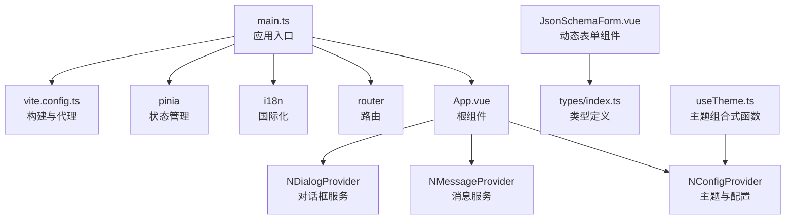
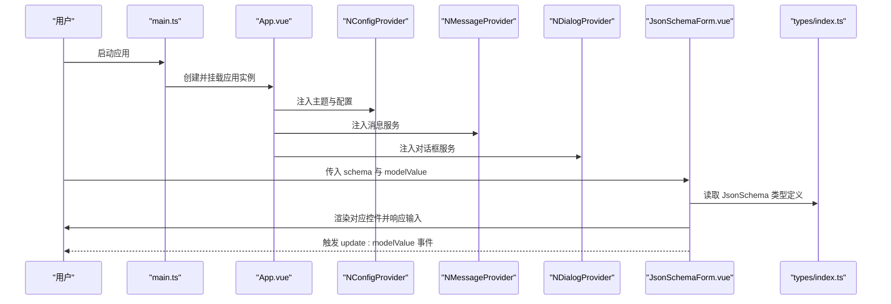
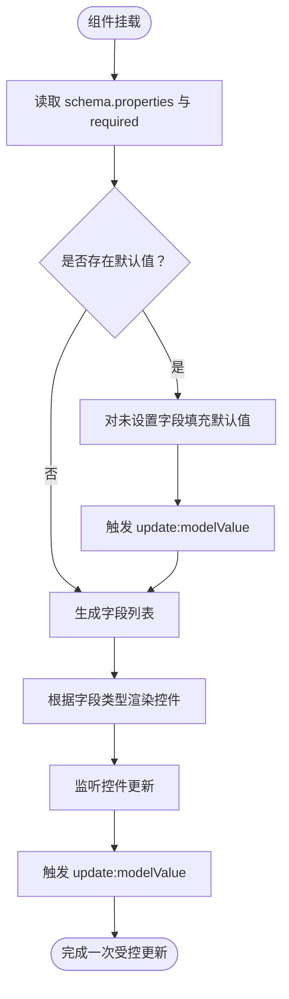
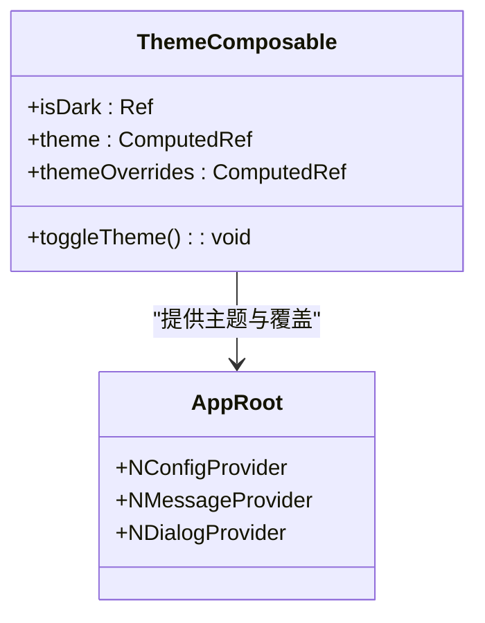
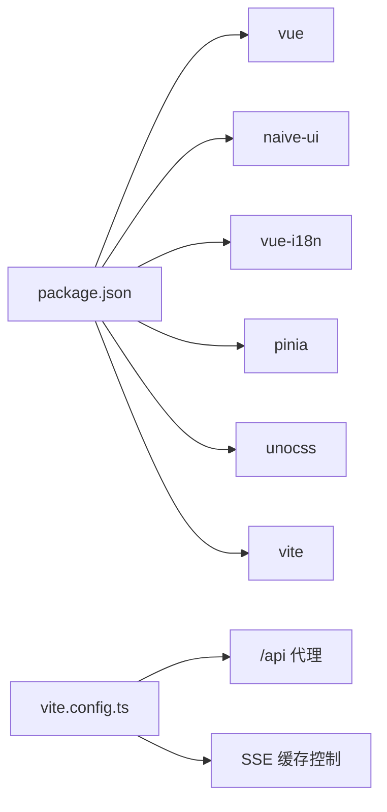

# UI组件库

<cite>
**本文引用的文件**
- [JsonSchemaForm.vue](file://agentscope-builder-saton/frontend/src/components/JsonSchemaForm.vue)
- [useTheme.ts](file://agentscope-builder-saton/frontend/src/composables/useTheme.ts)
- [index.ts](file://agentscope-builder-saton/frontend/src/i18n/index.ts)
- [main.ts](file://agentscope-builder-saton/frontend/src/main.ts)
- [index.ts](file://agentscope-builder-saton/frontend/src/types/index.ts)
- [App.vue](file://agentscope-builder-saton/frontend/src/App.vue)
- [vite.config.ts](file://agentscope-builder-saton/frontend/vite.config.ts)
- [package.json](file://agentscope-builder-saton/frontend/package.json)
</cite>

## 目录
1. [简介](#简介)
2. [项目结构](#项目结构)
3. [核心组件](#核心组件)
4. [架构总览](#架构总览)
5. [组件详解](#组件详解)
6. [依赖关系分析](#依赖关系分析)
7. [性能考虑](#性能考虑)
8. [故障排查指南](#故障排查指南)
9. [结论](#结论)
10. [附录](#附录)

## 简介
本文件面向“基于 Naive UI 的组件库”与“自定义组件实现”，重点围绕以下目标展开：
- 深入解析 JsonSchemaForm 动态表单组件：JSON Schema 解析、字段渲染、默认值初始化与受控更新。
- 总结通用组件设计模式：表单组件、对话框组件、表格组件、按钮组件的实现要点与扩展建议。
- 介绍聊天相关组件：消息展示、输入框与实时交互的实现思路与集成方式。
- 规范组件的属性(props)、事件(events)与插槽(slots)的使用方式，并给出最佳实践。
- 提供主题定制与样式覆盖方法，说明可访问性与国际化支持现状与建议。
- 讨论性能优化与懒加载策略，帮助在复杂场景下保持良好体验。

## 项目结构
前端采用 Vue 3 + Vite + Naive UI 技术栈，通过 Pinia 管理状态，UnoCSS 提供原子化样式，配合 vue-i18n 实现多语言。应用入口在 main.ts 中完成插件注册与挂载，根组件 App.vue 配置全局主题、消息与对话框提供者。

图表来源
- [main.ts:1-19](file://agentscope-builder-saton/frontend/src/main.ts#L1-L19)
- [App.vue:48-61](file://agentscope-builder-saton/frontend/src/App.vue#L48-L61)
- [vite.config.ts:1-33](file://agentscope-builder-saton/frontend/vite.config.ts#L1-L33)
- [JsonSchemaForm.vue:1-169](file://agentscope-builder-saton/frontend/src/components/JsonSchemaForm.vue#L1-L169)
- [index.ts:163-182](file://agentscope-builder-saton/frontend/src/types/index.ts#L163-L182)
- [useTheme.ts:1-34](file://agentscope-builder-saton/frontend/src/composables/useTheme.ts#L1-L34)

章节来源
- [main.ts:1-19](file://agentscope-builder-saton/frontend/src/main.ts#L1-L19)
- [App.vue:1-61](file://agentscope-builder-saton/frontend/src/App.vue#L1-L61)
- [vite.config.ts:1-33](file://agentscope-builder-saton/frontend/vite.config.ts#L1-L33)

## 核心组件
- JsonSchemaForm 动态表单：根据 JSON Schema 自动渲染不同类型的输入控件，支持默认值注入、占位提示与受控更新。
- 主题系统：通过 useTheme 组合式函数提供深浅主题切换与主题变量覆盖。
- 国际化：基于 vue-i18n，支持中英文消息与占位提示。
- 应用根配置：App.vue 注入 Naive UI 的全局配置、消息与对话框提供者，统一主题与交互体验。

章节来源
- [JsonSchemaForm.vue:1-169](file://agentscope-builder-saton/frontend/src/components/JsonSchemaForm.vue#L1-L169)
- [useTheme.ts:1-34](file://agentscope-builder-saton/frontend/src/composables/useTheme.ts#L1-L34)
- [index.ts:1-11](file://agentscope-builder-saton/frontend/src/i18n/index.ts#L1-11)
- [App.vue:1-61](file://agentscope-builder-saton/frontend/src/App.vue#L1-L61)

## 架构总览
下图展示了应用启动流程、主题与国际化注入、以及动态表单组件的数据流与渲染链路。

图表来源
- [main.ts:1-19](file://agentscope-builder-saton/frontend/src/main.ts#L1-L19)
- [App.vue:48-61](file://agentscope-builder-saton/frontend/src/App.vue#L48-L61)
- [JsonSchemaForm.vue:17-64](file://agentscope-builder-saton/frontend/src/components/JsonSchemaForm.vue#L17-L64)
- [index.ts:163-182](file://agentscope-builder-saton/frontend/src/types/index.ts#L163-L182)

## 组件详解

### JsonSchemaForm 动态表单组件
- 设计目标
  - 基于 JSON Schema 自动推导 UI 控件类型，减少手写模板代码。
  - 支持默认值注入、占位提示、必填标记与受控更新。
  - 对敏感字段提供“编辑时不可见”的占位提示。
- 关键实现
  - 字段列表生成：依据 schema.properties 与 required 构建字段元信息。
  - 默认值初始化：首次挂载时对未设置的字段填充默认值，并触发更新事件。
  - 字段渲染：根据字段类型与格式选择对应 Naive UI 控件（如 NInput、NInputNumber、NSelect、NSwitch、NDynamicTags）。
  - 受控更新：通过 update:modelValue 事件向上游同步变更。
  - 国际化占位：敏感字段在编辑模式下显示“不改变”的占位提示。
- 数据模型
  - 输入属性：schema（JsonSchema）、modelValue（Record<string, unknown>）、isEdit（是否编辑模式）。
  - 输出事件：update:modelValue（返回新的表单值对象）。
  - 插槽：无内置插槽，通过控件组合与外部容器扩展。

图表来源
- [JsonSchemaForm.vue:29-64](file://agentscope-builder-saton/frontend/src/components/JsonSchemaForm.vue#L29-L64)
- [JsonSchemaForm.vue:74-161](file://agentscope-builder-saton/frontend/src/components/JsonSchemaForm.vue#L74-L161)

章节来源
- [JsonSchemaForm.vue:1-169](file://agentscope-builder-saton/frontend/src/components/JsonSchemaForm.vue#L1-L169)
- [index.ts:163-182](file://agentscope-builder-saton/frontend/src/types/index.ts#L163-L182)

### 主题与样式定制
- 主题开关与变量覆盖
  - 使用 useTheme 组合式函数维护 isDark 状态与 themeOverrides，支持深浅主题切换与颜色变量覆盖。
  - 主题持久化：通过 localStorage 存储当前主题偏好。
- 应用级主题注入
  - App.vue 的 NConfigProvider 接收 theme 与 themeOverrides，实现全局主题生效。
- 样式覆盖建议
  - 优先通过 themeOverrides 覆盖 Naive UI 全局变量，避免直接修改组件内部样式。
  - 使用 UnoCSS 原子类进行局部样式补充，保持一致的样式风格。

图表来源
- [useTheme.ts:6-33](file://agentscope-builder-saton/frontend/src/composables/useTheme.ts#L6-L33)
- [App.vue:48-61](file://agentscope-builder-saton/frontend/src/App.vue#L48-L61)

章节来源
- [useTheme.ts:1-34](file://agentscope-builder-saton/frontend/src/composables/useTheme.ts#L1-L34)
- [App.vue:18-22](file://agentscope-builder-saton/frontend/src/App.vue#L18-L22)

### 国际化与可访问性
- 国际化
  - 通过 vue-i18n 在 main.ts 注册，本地存储中读取/设置当前语言。
  - JsonSchemaForm 中对敏感字段的占位提示使用 t 函数从 i18n 获取文案。
- 可访问性
  - 表单控件均绑定 label 与 required 标记，提升屏幕阅读器识别度。
  - 文案与占位提示遵循简洁清晰原则，避免歧义。

章节来源
- [index.ts:1-11](file://agentscope-builder-saton/frontend/src/i18n/index.ts#L1-11)
- [JsonSchemaForm.vue:66-71](file://agentscope-builder-saton/frontend/src/components/JsonSchemaForm.vue#L66-L71)

### 聊天相关组件（设计建议）
- 消息展示
  - 建议以只读卡片形式展示用户与助手消息，支持富文本与工具调用结果块。
- 输入框
  - 提供多行输入与快捷键提交，支持粘贴图片/文件等多媒体内容。
- 实时交互
  - 结合 SSE 或 WebSocket 流式输出，逐段追加消息并滚动到底部。
- 扩展点
  - 将消息列表抽象为可复用组件，通过插槽扩展工具调用、代码块高亮等能力。

（本节为概念性说明，不直接分析具体文件）

### 通用组件设计模式（建议）
- 表单组件
  - 明确 props（schema、modelValue、isEdit）、事件（update:modelValue）与插槽（可选）。
  - 内部统一处理默认值、校验与受控更新。
- 对话框组件
  - 提供 visible、title、actions 等属性，支持确认/取消回调与键盘事件。
- 表格组件
  - 支持列配置、排序、筛选与分页；提供 loading、empty 状态插槽。
- 按钮组件
  - 支持主次按钮、尺寸、禁用与加载态；统一图标与文案布局。

（本节为概念性说明，不直接分析具体文件）

## 依赖关系分析
- 运行时依赖
  - Vue 3、Naive UI、vue-i18n、pinia、unocss 等。
- 构建与开发
  - Vite、@vitejs/plugin-vue、UnoCSS 插件、TypeScript。
- 代理与流式传输
  - 通过 vite.config.ts 配置 /api 代理至后端服务；对 SSE 响应头进行 no-cache 处理。

图表来源
- [package.json:13-34](file://agentscope-builder-saton/frontend/package.json#L13-L34)
- [vite.config.ts:17-29](file://agentscope-builder-saton/frontend/vite.config.ts#L17-L29)

章节来源
- [package.json:1-53](file://agentscope-builder-saton/frontend/package.json#L1-L53)
- [vite.config.ts:1-33](file://agentscope-builder-saton/frontend/vite.config.ts#L1-L33)

## 性能考虑
- 组件更新
  - JsonSchemaForm 使用 computed 生成字段列表，watch 仅在 schema 变更时初始化默认值，避免不必要的重渲染。
- 渲染优化
  - 使用 v-for 渲染字段，key 采用字段名，确保列表稳定更新。
- 主题与样式
  - 通过 themeOverrides 覆盖变量，减少运行时样式计算开销。
- 构建与懒加载
  - 将非关键页面或对话框组件按需加载，结合路由懒加载降低首屏体积。
- 流式交互
  - 对 SSE/WS 流式数据采用节流/防抖策略，避免频繁 DOM 更新。

（本节为通用指导，不直接分析具体文件）

## 故障排查指南
- 表单默认值未生效
  - 检查 schema.properties 是否存在且 modelValue 对应字段未设置；确认 watch 初始化逻辑已执行。
- 占位提示未显示
  - 确认 i18n 已正确注册，且 t 函数可用；检查 isEdit 与 secret 字段条件分支。
- 主题切换无效
  - 确认 useTheme.toggleTheme 已被调用，localStorage 中的主题键值正确；检查 App.vue 的 theme 注入是否生效。
- 国际化语言不生效
  - 检查 i18n 的 locale 与 fallbackLocale 设置，确认本地存储中的语言键值正确。

章节来源
- [JsonSchemaForm.vue:41-56](file://agentscope-builder-saton/frontend/src/components/JsonSchemaForm.vue#L41-L56)
- [JsonSchemaForm.vue:66-71](file://agentscope-builder-saton/frontend/src/components/JsonSchemaForm.vue#L66-L71)
- [useTheme.ts:27-30](file://agentscope-builder-saton/frontend/src/composables/useTheme.ts#L27-L30)
- [index.ts:5-10](file://agentscope-builder-saton/frontend/src/i18n/index.ts#L5-L10)

## 结论
本组件库以 Naive UI 为基础，结合 Vue 3 的响应式与组合式 API，实现了可扩展、可定制的前端组件体系。JsonSchemaForm 动态表单组件通过类型推导与受控更新，显著降低了表单开发成本；useTheme 与 App.vue 的主题注入提供了良好的用户体验一致性；国际化与可访问性设计为多语言与无障碍使用打下基础。后续可在路由懒加载、组件拆分与测试覆盖方面持续优化。

## 附录
- 组件属性与事件规范（建议）
  - 属性：schema（JsonSchema）、modelValue（Record<string, unknown>）、isEdit（是否编辑模式）。
  - 事件：update:modelValue（返回新的表单值对象）。
  - 插槽：按需扩展（如表单头部/尾部、字段级插槽）。
- 使用示例与最佳实践
  - 示例：在视图中传入 schema 与初始 modelValue，监听 update:modelValue 同步到后端。
  - 最佳实践：将敏感字段的默认值与占位提示分离；使用 themeOverrides 统一主题色；为每个字段提供清晰的描述文案。

（本节为概念性说明，不直接分析具体文件）