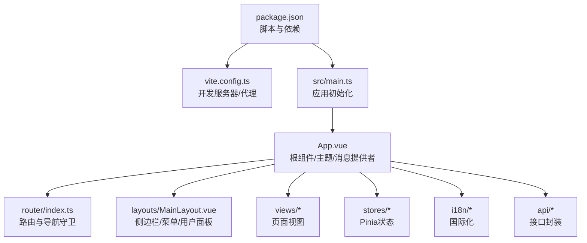
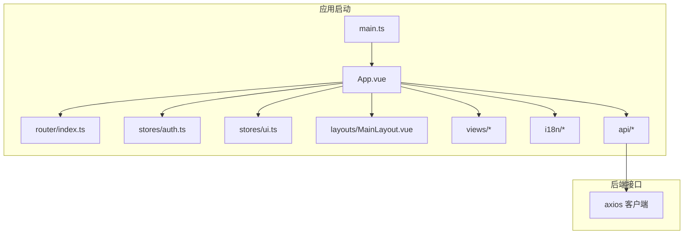
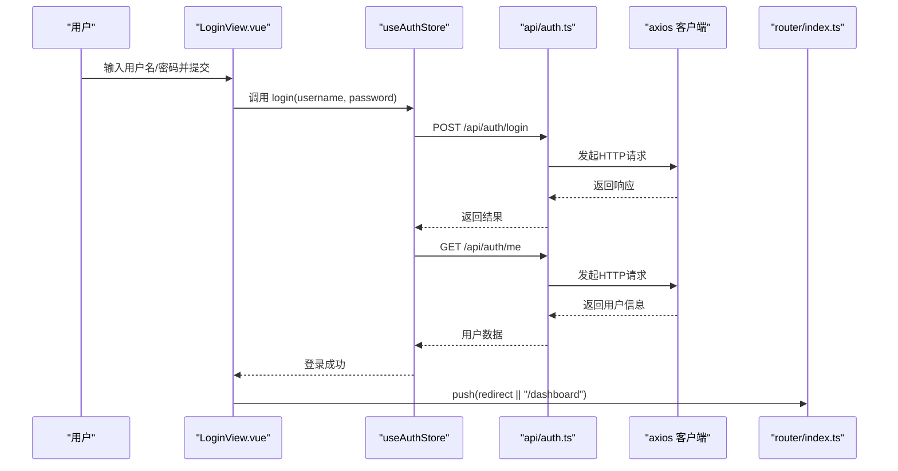
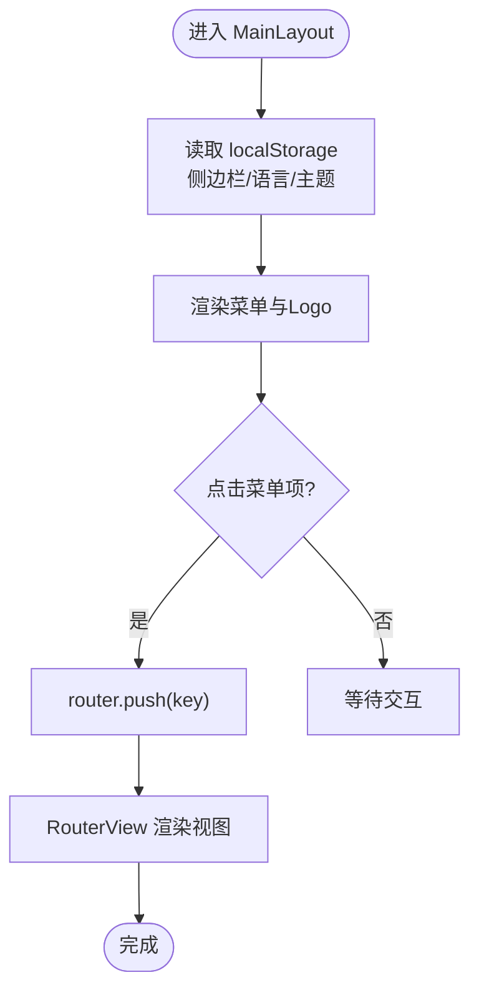
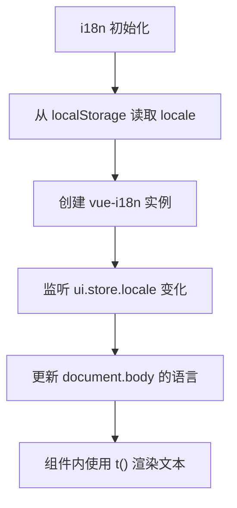
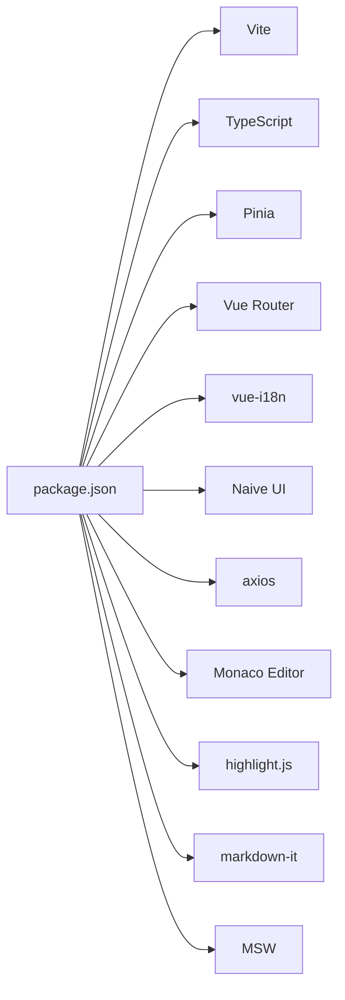

# 前端应用

<cite>
**本文引用的文件**
- [package.json](file://agentscope-builder-saton/frontend/package.json)
- [vite.config.ts](file://agentscope-builder-saton/frontend/vite.config.ts)
- [main.ts](file://agentscope-builder-saton/frontend/src/main.ts)
- [App.vue](file://agentscope-builder-saton/frontend/src/App.vue)
- [router/index.ts](file://agentscope-builder-saton/frontend/src/router/index.ts)
- [stores/auth.ts](file://agentscope-builder-saton/frontend/src/stores/auth.ts)
- [stores/ui.ts](file://agentscope-builder-saton/frontend/src/stores/ui.ts)
- [views/DashboardView.vue](file://agentscope-builder-saton/frontend/src/views/DashboardView.vue)
- [views/LoginView.vue](file://agentscope-builder-saton/frontend/src/views/LoginView.vue)
- [layouts/MainLayout.vue](file://agentscope-builder-saton/frontend/src/layouts/MainLayout.vue)
- [api/auth.ts](file://agentscope-builder-saton/frontend/src/api/auth.ts)
- [i18n/index.ts](file://agentscope-builder-saton/frontend/src/i18n/index.ts)
- [i18n/zh-CN.ts](file://agentscope-builder-saton/frontend/src/i18n/zh-CN.ts)
- [i18n/en-US.ts](file://agentscope-builder-saton/frontend/src/i18n/en-US.ts)
</cite>

## 目录
1. [简介](#简介)
2. [项目结构](#项目结构)
3. [核心组件](#核心组件)
4. [架构总览](#架构总览)
5. [详细组件分析](#详细组件分析)
6. [依赖关系分析](#依赖关系分析)
7. [性能考虑](#性能考虑)
8. [故障排查指南](#故障排查指南)
9. [结论](#结论)
10. [附录](#附录)

## 简介
本文件面向AgentScope构建器平台的前端应用，基于Vue 3 + TypeScript + Vite搭建的单页应用（SPA）。文档从架构设计、路由与布局、状态管理、国际化、API交互、UI组件库与自定义组件、构建与部署等方面进行系统化说明，并提供关键流程的时序图与类图，帮助开发者快速理解与扩展功能。

## 项目结构
前端工程位于 agentscope-builder-saton/frontend 目录，采用“按功能域分层”的组织方式：
- 根级配置：package.json（脚本、依赖）、vite.config.ts（开发服务器与代理）、tsconfig.json（类型检查）、uno.config.ts（原子化CSS）。
- 源码目录 src：
  - api：后端接口封装（axios客户端与具体模块API）
  - components：通用组件（如JsonSchemaForm待补充）
  - composables：可复用逻辑组合式函数
  - i18n：国际化资源与配置
  - layouts：布局组件（主布局MainLayout）
  - router：路由定义与导航守卫
  - stores：状态管理（Pinia）
  - styles：全局样式
  - types：类型声明
  - views：页面视图组件（Dashboard、Login、Agents、Models、Tools、Memory、Profile等）
  - App.vue、main.ts：应用入口与挂载
- public：静态资源与MSW worker

图表来源
- [package.json:1-53](file://agentscope-builder-saton/frontend/package.json#L1-L53)
- [vite.config.ts:1-33](file://agentscope-builder-saton/frontend/vite.config.ts#L1-L33)
- [main.ts:1-19](file://agentscope-builder-saton/frontend/src/main.ts#L1-L19)
- [App.vue:1-61](file://agentscope-builder-saton/frontend/src/App.vue#L1-L61)
- [router/index.ts:1-88](file://agentscope-builder-saton/frontend/src/router/index.ts#L1-L88)
- [layouts/MainLayout.vue:1-271](file://agentscope-builder-saton/frontend/src/layouts/MainLayout.vue#L1-L271)

章节来源
- [package.json:1-53](file://agentscope-builder-saton/frontend/package.json#L1-L53)
- [vite.config.ts:1-33](file://agentscope-builder-saton/frontend/vite.config.ts#L1-L33)
- [main.ts:1-19](file://agentscope-builder-saton/frontend/src/main.ts#L1-L19)
- [App.vue:1-61](file://agentscope-builder-saton/frontend/src/App.vue#L1-L61)

## 核心组件
- 应用入口与初始化
  - main.ts：创建Vue实例、注册Pinia、路由、i18n；引入UnoCSS与全局样式；挂载应用。
  - App.vue：Naive UI主题提供者、消息/对话框提供者、全局主题与语言同步、登录后自动加载工厂元数据、挂载全局工具（认证、路由、消息）。
- 路由与导航
  - router/index.ts：定义登录页、仪表盘、代理列表、模型、工具、记忆、个人资料等路由；实现公共路由与私有路由区分；在首次未登录时尝试通过 /me 恢复会话。
- 状态管理
  - stores/auth.ts：登录态、用户信息、登录/登出/拉取用户信息；持久化仅保留用户信息片段。
  - stores/ui.ts：侧边栏折叠、语言、主题；均持久化至localStorage。
- 国际化
  - i18n/index.ts：基于vue-i18n，支持中英双语；locale来自localStorage或默认值。
  - i18n/zh-CN.ts、i18n/en-US.ts：完整词条映射。
- 视图组件
  - DashboardView.vue：欢迎页与引导按钮。
  - LoginView.vue：登录表单、防重复提交、回跳逻辑。
  - MainLayout.vue：侧边栏菜单、语言/主题切换、用户下拉菜单、主内容区。

章节来源
- [main.ts:1-19](file://agentscope-builder-saton/frontend/src/main.ts#L1-L19)
- [App.vue:1-61](file://agentscope-builder-saton/frontend/src/App.vue#L1-L61)
- [router/index.ts:1-88](file://agentscope-builder-saton/frontend/src/router/index.ts#L1-L88)
- [stores/auth.ts:1-41](file://agentscope-builder-saton/frontend/src/stores/auth.ts#L1-L41)
- [stores/ui.ts:1-47](file://agentscope-builder-saton/frontend/src/stores/ui.ts#L1-L47)
- [i18n/index.ts:1-11](file://agentscope-builder-saton/frontend/src/i18n/index.ts#L1-L11)
- [i18n/zh-CN.ts:1-183](file://agentscope-builder-saton/frontend/src/i18n/zh-CN.ts#L1-L183)
- [i18n/en-US.ts:1-183](file://agentscope-builder-saton/frontend/src/i18n/en-US.ts#L1-L183)
- [views/DashboardView.vue:1-33](file://agentscope-builder-saton/frontend/src/views/DashboardView.vue#L1-L33)
- [views/LoginView.vue:1-82](file://agentscope-builder-saton/frontend/src/views/LoginView.vue#L1-L82)
- [layouts/MainLayout.vue:1-271](file://agentscope-builder-saton/frontend/src/layouts/MainLayout.vue#L1-L271)

## 架构总览
前端采用“入口初始化 → 路由守卫 → 布局渲染 → 页面视图”的控制流；状态通过Pinia集中管理；UI使用Naive UI；国际化通过vue-i18n；API通过axios封装统一调用。

图表来源
- [main.ts:1-19](file://agentscope-builder-saton/frontend/src/main.ts#L1-L19)
- [App.vue:1-61](file://agentscope-builder-saton/frontend/src/App.vue#L1-L61)
- [router/index.ts:1-88](file://agentscope-builder-saton/frontend/src/router/index.ts#L1-L88)
- [stores/auth.ts:1-41](file://agentscope-builder-saton/frontend/src/stores/auth.ts#L1-L41)
- [stores/ui.ts:1-47](file://agentscope-builder-saton/frontend/src/stores/ui.ts#L1-L47)
- [layouts/MainLayout.vue:1-271](file://agentscope-builder-saton/frontend/src/layouts/MainLayout.vue#L1-L271)
- [api/auth.ts:1-24](file://agentscope-builder-saton/frontend/src/api/auth.ts#L1-L24)

## 详细组件分析

### 认证与会话管理（store与API）
- 认证状态
  - useAuthStore：维护用户信息与登录态；登录成功后调用 /me 获取用户详情；登出清空用户信息。
  - 持久化策略：仅持久化用户字段，避免敏感信息泄露。
- API封装
  - api/auth.ts：封装登录与获取当前用户两个接口，统一通过axios客户端发起请求。
- 路由守卫
  - 非公开路由在未登录时尝试通过 /me 恢复会话；若仍失败则重定向到登录页并携带redirect参数。

图表来源
- [views/LoginView.vue:1-82](file://agentscope-builder-saton/frontend/src/views/LoginView.vue#L1-L82)
- [stores/auth.ts:1-41](file://agentscope-builder-saton/frontend/src/stores/auth.ts#L1-L41)
- [api/auth.ts:1-24](file://agentscope-builder-saton/frontend/src/api/auth.ts#L1-L24)
- [router/index.ts:66-85](file://agentscope-builder-saton/frontend/src/router/index.ts#L66-L85)

章节来源
- [stores/auth.ts:1-41](file://agentscope-builder-saton/frontend/src/stores/auth.ts#L1-L41)
- [api/auth.ts:1-24](file://agentscope-builder-saton/frontend/src/api/auth.ts#L1-L24)
- [router/index.ts:66-85](file://agentscope-builder-saton/frontend/src/router/index.ts#L66-L85)
- [views/LoginView.vue:1-82](file://agentscope-builder-saton/frontend/src/views/LoginView.vue#L1-L82)

### 主布局与侧边栏
- 功能要点
  - 侧边栏折叠/展开状态与本地存储同步。
  - 菜单项根据当前路由高亮；支持跳转到仪表盘、代理、模型、工具、记忆。
  - 顶部用户头像弹窗：进入个人资料、退出登录。
  - 语言与主题切换：实时生效并持久化。
- 交互流程
  - 用户点击菜单项 → 更新路由 → 渲染对应视图。
  - 切换语言/主题 → 更新localStorage并触发UI刷新。

图表来源
- [layouts/MainLayout.vue:1-271](file://agentscope-builder-saton/frontend/src/layouts/MainLayout.vue#L1-L271)
- [stores/ui.ts:1-47](file://agentscope-builder-saton/frontend/src/stores/ui.ts#L1-L47)

章节来源
- [layouts/MainLayout.vue:1-271](file://agentscope-builder-saton/frontend/src/layouts/MainLayout.vue#L1-L271)
- [stores/ui.ts:1-47](file://agentscope-builder-saton/frontend/src/stores/ui.ts#L1-L47)

### 国际化与多语言
- 初始化：i18n/index.ts 创建i18n实例，语言来自localStorage或默认值，回退语言为英文。
- 词条：zh-CN.ts 与 en-US.ts 提供完整词条，覆盖通用、认证、仪表盘、侧边栏、代理、聊天、模型、工具、记忆、设置、个人资料、404等模块。
- 运行时切换：MainLayout.vue中的语言开关与App.vue中的locale监听实现双向同步。

图表来源
- [i18n/index.ts:1-11](file://agentscope-builder-saton/frontend/src/i18n/index.ts#L1-L11)
- [i18n/zh-CN.ts:1-183](file://agentscope-builder-saton/frontend/src/i18n/zh-CN.ts#L1-L183)
- [i18n/en-US.ts:1-183](file://agentscope-builder-saton/frontend/src/i18n/en-US.ts#L1-L183)
- [App.vue:15-16](file://agentscope-builder-saton/frontend/src/App.vue#L15-L16)
- [layouts/MainLayout.vue:126-139](file://agentscope-builder-saton/frontend/src/layouts/MainLayout.vue#L126-L139)

章节来源
- [i18n/index.ts:1-11](file://agentscope-builder-saton/frontend/src/i18n/index.ts#L1-L11)
- [i18n/zh-CN.ts:1-183](file://agentscope-builder-saton/frontend/src/i18n/zh-CN.ts#L1-L183)
- [i18n/en-US.ts:1-183](file://agentscope-builder-saton/frontend/src/i18n/en-US.ts#L1-L183)
- [App.vue:15-16](file://agentscope-builder-saton/frontend/src/App.vue#L15-L16)
- [layouts/MainLayout.vue:126-139](file://agentscope-builder-saton/frontend/src/layouts/MainLayout.vue#L126-L139)

### JsonSchemaForm 表单组件（概念性说明）
- 组件定位：用于根据JsonSchema动态生成表单控件，支持校验、联动与渲染优化。
- 设计建议：
  - 输入：schema（字段定义）、modelValue（双向绑定值）、rules（校验规则）。
  - 输出：更新 modelValue、触发校验、暴露 resetFields/validate 等方法。
  - 渲染：根据 schema.type 映射到 Naive UI 控件（输入框、选择器、开关等），支持嵌套对象与数组。
  - 性能：对深层嵌套进行懒渲染，减少首屏压力；对频繁变更的字段使用防抖。
- 与 Pinia 集成：表单状态可作为局部 store 或通过父组件统一管理，避免跨组件重复订阅。

[本节为概念性说明，不直接分析具体源文件，故无章节来源]

### 主要视图组件功能概览
- 仪表盘（DashboardView.vue）
  - 展示欢迎语与引导按钮，点击跳转至新建代理或代理列表。
- 登录页（LoginView.vue）
  - 表单包含用户名/密码输入、显示/隐藏密码、加载态、回车提交、登录失败提示。
- 代理列表（AgentListView.vue）
  - 待补充具体实现细节，预期包含代理检索、排序、克隆、删除、进入聊天/设置等。
- 模型配置（ModelsView.vue）
  - 待补充具体实现细节，预期包含模型增删改查、连接测试、保存成功提示。
- 工具管理（ToolsView.vue）
  - 待补充具体实现细节，预期包含工具/技能/MCP管理、启用/禁用、保存成功提示。
- 记忆配置（MemoryView.vue）
  - 待补充具体实现细节，预期包含记忆提供商的增删改查与保存提示。
- 个人资料（ProfileView.vue）
  - 待补充具体实现细节，预期包含用户信息展示与修改入口。

章节来源
- [views/DashboardView.vue:1-33](file://agentscope-builder-saton/frontend/src/views/DashboardView.vue#L1-L33)
- [views/LoginView.vue:1-82](file://agentscope-builder-saton/frontend/src/views/LoginView.vue#L1-L82)

## 依赖关系分析
- 包管理与构建
  - 使用 pnpm 管理依赖；Vite 提供开发服务器与打包能力；UnoCSS 提供原子化样式；TypeScript 进行类型检查。
- 关键依赖
  - Vue 3、Vue Router、Pinia、vue-i18n、Naive UI、axios、Monaco Editor、highlight.js、markdown-it、MSW（mock）。
- 开发与质量
  - ESLint + Prettier + Vue TSC；MSW worker 目录配置于 public。

图表来源
- [package.json:1-53](file://agentscope-builder-saton/frontend/package.json#L1-L53)

章节来源
- [package.json:1-53](file://agentscope-builder-saton/frontend/package.json#L1-L53)

## 性能考虑
- 路由懒加载：路由组件通过动态导入，减少首屏包体。
- 状态持久化：Pinia 持久化插件仅持久化必要字段，降低IO开销。
- 本地存储：UI状态（主题、语言、侧边栏）使用localStorage，避免每次请求。
- 样式与字体：UnoCSS按需生成样式，避免全局污染。
- 图标与编辑器：按需引入图标与编辑器，避免全量引入导致体积膨胀。

[本节为通用指导，不直接分析具体文件，故无章节来源]

## 故障排查指南
- 登录失败
  - 现象：登录按钮无响应或报错。
  - 排查：检查网络面板 /api/auth/login 是否可达；确认用户名/密码格式；查看拦截器错误提示。
- 会话丢失
  - 现象：刷新页面后需要重新登录。
  - 排查：确认 /api/auth/me 是否可用；检查浏览器Cookie与CORS；确认路由守卫逻辑是否正确执行。
- 主题/语言不同步
  - 现象：切换主题/语言后页面未立即变化。
  - 排查：确认 App.vue 中 locale 与 isDark 的 watch 是否触发；检查 localStorage 是否写入成功。
- 路由跳转异常
  - 现象：点击菜单无反应或跳转错误。
  - 排查：检查 MainLayout.vue 中 activeKey 与 onMenuUpdate；确认 router.push 参数正确。

章节来源
- [views/LoginView.vue:1-82](file://agentscope-builder-saton/frontend/src/views/LoginView.vue#L1-L82)
- [router/index.ts:66-85](file://agentscope-builder-saton/frontend/src/router/index.ts#L66-L85)
- [App.vue:15-22](file://agentscope-builder-saton/frontend/src/App.vue#L15-L22)
- [layouts/MainLayout.vue:64-76](file://agentscope-builder-saton/frontend/src/layouts/MainLayout.vue#L64-L76)

## 结论
该前端应用以Vue 3为核心，结合Pinia、Vue Router、Naive UI与国际化方案，构建了清晰的单页应用架构。通过路由守卫与状态持久化保障用户体验，通过UnoCSS与按需组件提升性能。后续可在工具管理、模型配置、记忆配置等视图组件上进一步完善，同时补充JsonSchemaForm等通用表单组件，以支撑更复杂的配置场景。

## 附录
- 开发环境
  - 启动：执行开发脚本；访问 http://localhost:5173。
  - 代理：/api 前缀转发至 http://localhost:8080；对SSE做缓存控制处理。
- 构建与预览
  - 构建：先类型检查再打包；产物输出至 dist。
  - 预览：本地预览构建产物。
- 部署建议
  - 将 dist 部署至静态服务器或反向代理；确保 /api 请求可到达后端服务；保持CORS与Cookie配置一致。

章节来源
- [vite.config.ts:14-31](file://agentscope-builder-saton/frontend/vite.config.ts#L14-L31)
- [package.json:6-11](file://agentscope-builder-saton/frontend/package.json#L6-L11)