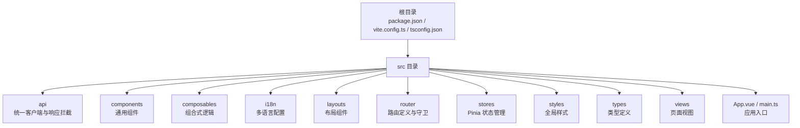
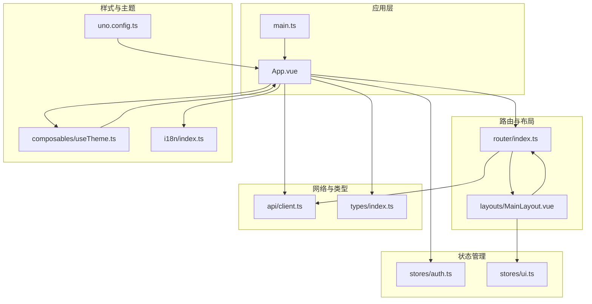
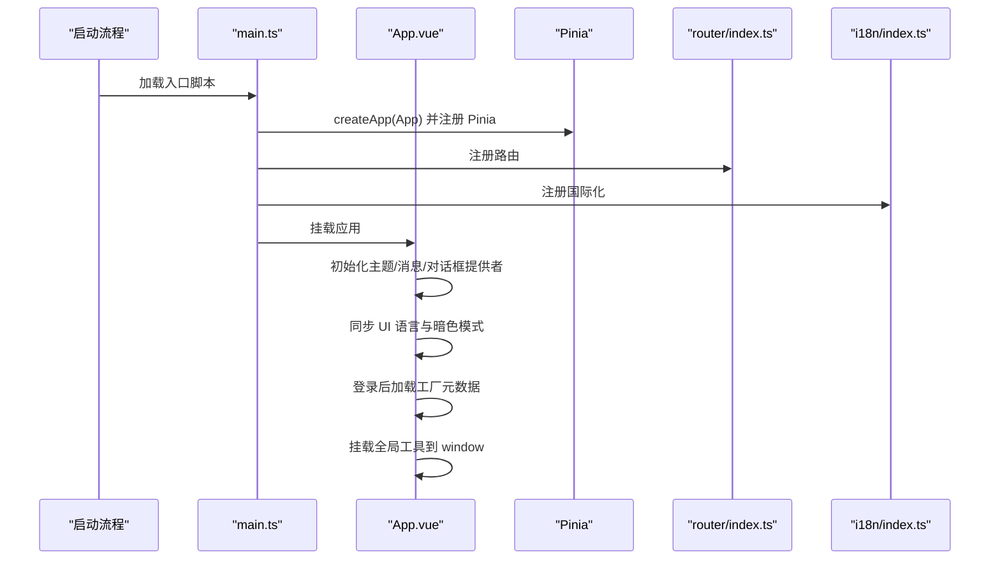
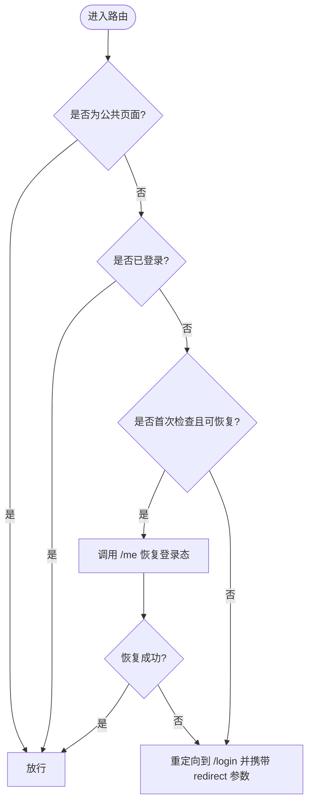
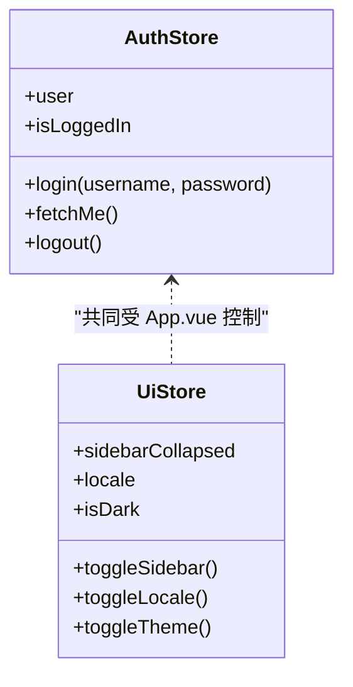
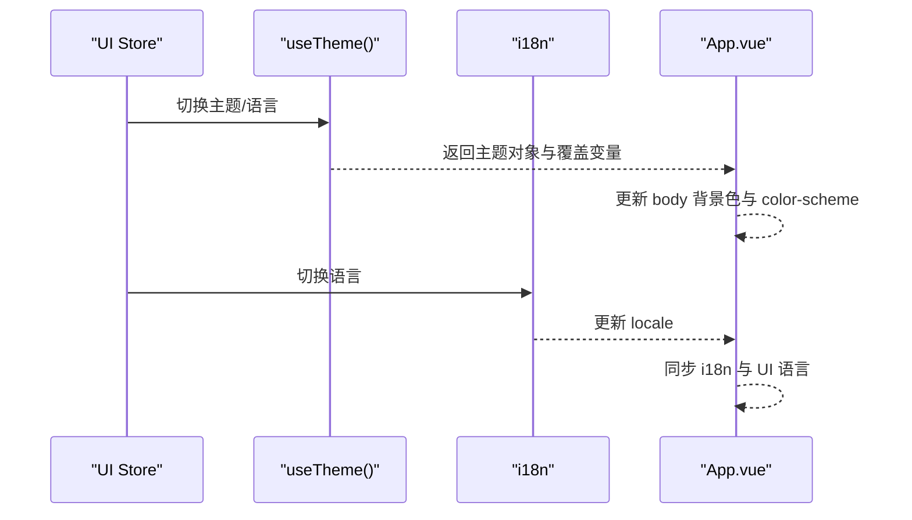
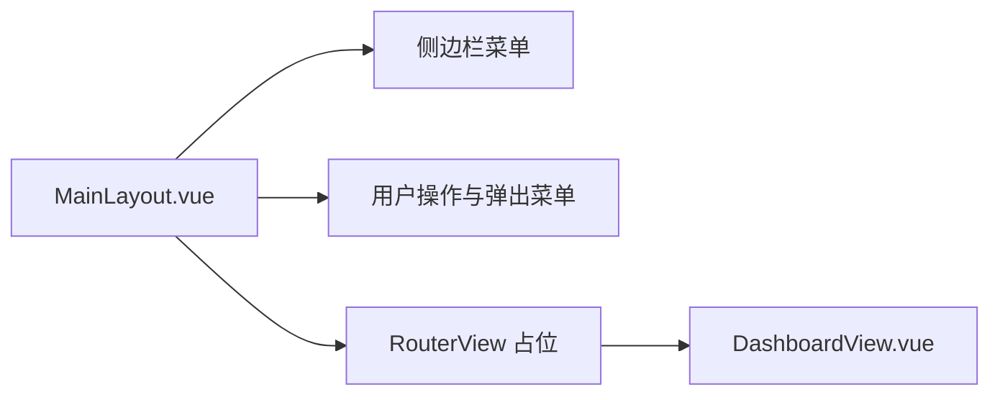
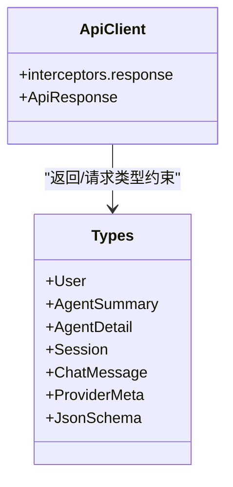
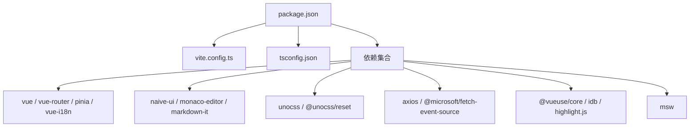

# 前端架构

<cite>
**本文引用的文件**
- [package.json](file://agentscope-builder-saton/frontend/package.json)
- [vite.config.ts](file://agentscope-builder-saton/frontend/vite.config.ts)
- [tsconfig.json](file://agentscope-builder-saton/frontend/tsconfig.json)
- [main.ts](file://agentscope-builder-saton/frontend/src/main.ts)
- [App.vue](file://agentscope-builder-saton/frontend/src/App.vue)
- [router/index.ts](file://agentscope-builder-saton/frontend/src/router/index.ts)
- [stores/auth.ts](file://agentscope-builder-saton/frontend/src/stores/auth.ts)
- [stores/ui.ts](file://agentscope-builder-saton/frontend/src/stores/ui.ts)
- [i18n/index.ts](file://agentscope-builder-saton/frontend/src/i18n/index.ts)
- [composables/useTheme.ts](file://agentscope-builder-saton/frontend/src/composables/useTheme.ts)
- [layouts/MainLayout.vue](file://agentscope-builder-saton/frontend/src/layouts/MainLayout.vue)
- [views/DashboardView.vue](file://agentscope-builder-saton/frontend/src/views/DashboardView.vue)
- [types/index.ts](file://agentscope-builder-saton/frontend/src/types/index.ts)
- [api/client.ts](file://agentscope-builder-saton/frontend/src/api/client.ts)
- [uno.config.ts](file://agentscope-builder-saton/frontend/uno.config.ts)
</cite>

## 目录
1. [引言](#引言)
2. [项目结构](#项目结构)
3. [核心组件](#核心组件)
4. [架构总览](#架构总览)
5. [详细组件分析](#详细组件分析)
6. [依赖关系分析](#依赖关系分析)
7. [性能考虑](#性能考虑)
8. [故障排查指南](#故障排查指南)
9. [结论](#结论)
10. [附录](#附录)

## 引言
本文件面向AgentScope构建器平台的前端团队与技术读者，系统性阐述基于Vue.js 3 + TypeScript的现代前端架构设计与实现细节。内容涵盖项目结构组织、模块化理念、依赖管理、Vite构建工具配置优化、TypeScript类型保障与IDE支持、组件层次结构与SFC组织、前端路由与导航守卫、开发环境搭建、构建产物分析与性能优化策略等。

## 项目结构
前端工程位于 agentscope-builder-saton/frontend，采用“功能域+分层”的组织方式：
- 根目录包含构建与运行脚本、依赖声明、Vite配置、TypeScript配置、UnoCSS配置等
- src 目录下按功能域划分：api、components、composables、i18n、layouts、router、stores、styles、types、views 等
- 使用别名 @ 指向 src，提升导入可读性与维护性
- 通过 Pinia 进行状态管理，结合持久化插件实现跨会话状态保留
- 通过 Naive UI 提供UI基础能力，配合 UnoCSS 实现原子化样式与主题定制

图表来源
- [main.ts:1-19](file://agentscope-builder-saton/frontend/src/main.ts#L1-L19)
- [App.vue:1-61](file://agentscope-builder-saton/frontend/src/App.vue#L1-L61)

章节来源
- [package.json:1-53](file://agentscope-builder-saton/frontend/package.json#L1-L53)
- [vite.config.ts:1-33](file://agentscope-builder-saton/frontend/vite.config.ts#L1-L33)
- [tsconfig.json:1-21](file://agentscope-builder-saton/frontend/tsconfig.json#L1-L21)

## 核心组件
- 应用入口与初始化：在 main.ts 中创建应用实例、注册Pinia、路由、国际化，并引入全局样式
- 根组件与主题：App.vue 负责全局主题、消息与对话框提供者、i18n同步、登录后资源加载、全局工具挂载
- 路由与守卫：router/index.ts 定义路由表与前置守卫，支持公共页面、登录态校验与HMR会话恢复
- 状态管理：stores 下包含认证、UI、工厂等状态，结合持久化插件实现本地存储
- 国际化：i18n/index.ts 配置多语言，支持本地存储的语言偏好
- 主题与样式：composables/useTheme.ts 提供主题开关与主题变量覆盖；uno.config.ts 提供原子化样式与快捷类
- 布局与视图：layouts/MainLayout.vue 提供侧边栏、菜单、语言与主题切换；views 下各页面组件承载具体业务

章节来源
- [main.ts:1-19](file://agentscope-builder-saton/frontend/src/main.ts#L1-L19)
- [App.vue:1-61](file://agentscope-builder-saton/frontend/src/App.vue#L1-L61)
- [router/index.ts:1-88](file://agentscope-builder-saton/frontend/src/router/index.ts#L1-L88)
- [stores/auth.ts:1-41](file://agentscope-builder-saton/frontend/src/stores/auth.ts#L1-L41)
- [stores/ui.ts:1-47](file://agentscope-builder-saton/frontend/src/stores/ui.ts#L1-L47)
- [i18n/index.ts:1-11](file://agentscope-builder-saton/frontend/src/i18n/index.ts#L1-L11)
- [composables/useTheme.ts:1-34](file://agentscope-builder-saton/frontend/src/composables/useTheme.ts#L1-L34)
- [layouts/MainLayout.vue:1-271](file://agentscope-builder-saton/frontend/src/layouts/MainLayout.vue#L1-L271)
- [views/DashboardView.vue:1-33](file://agentscope-builder-saton/frontend/src/views/DashboardView.vue#L1-L33)
- [types/index.ts:1-215](file://agentscope-builder-saton/frontend/src/types/index.ts#L1-L215)
- [api/client.ts:1-70](file://agentscope-builder-saton/frontend/src/api/client.ts#L1-L70)
- [uno.config.ts:1-11](file://agentscope-builder-saton/frontend/uno.config.ts#L1-L11)

## 架构总览
整体架构围绕“应用入口 -> 路由 -> 布局 -> 视图 -> 状态/类型/国际化/主题”的链路展开，数据流通过 Pinia 管理，网络请求通过统一客户端封装，UI 通过 Naive UI 与 UnoCSS 提供一致体验。

图表来源
- [main.ts:1-19](file://agentscope-builder-saton/frontend/src/main.ts#L1-L19)
- [App.vue:1-61](file://agentscope-builder-saton/frontend/src/App.vue#L1-L61)
- [router/index.ts:1-88](file://agentscope-builder-saton/frontend/src/router/index.ts#L1-L88)
- [layouts/MainLayout.vue:1-271](file://agentscope-builder-saton/frontend/src/layouts/MainLayout.vue#L1-L271)
- [stores/auth.ts:1-41](file://agentscope-builder-saton/frontend/src/stores/auth.ts#L1-L41)
- [stores/ui.ts:1-47](file://agentscope-builder-saton/frontend/src/stores/ui.ts#L1-L47)
- [api/client.ts:1-70](file://agentscope-builder-saton/frontend/src/api/client.ts#L1-L70)
- [types/index.ts:1-215](file://agentscope-builder-saton/frontend/src/types/index.ts#L1-L215)
- [composables/useTheme.ts:1-34](file://agentscope-builder-saton/frontend/src/composables/useTheme.ts#L1-L34)
- [uno.config.ts:1-11](file://agentscope-builder-saton/frontend/uno.config.ts#L1-L11)
- [i18n/index.ts:1-11](file://agentscope-builder-saton/frontend/src/i18n/index.ts#L1-L11)

## 详细组件分析

### 应用入口与初始化
- 创建应用实例，注册 Pinia（含持久化插件）、路由、国际化
- 引入 UnoCSS 重置与全局样式，确保主题与样式一致性
- 在挂载阶段将认证、路由、消息等工具挂载至 window，便于拦截器与全局逻辑使用

图表来源
- [main.ts:1-19](file://agentscope-builder-saton/frontend/src/main.ts#L1-L19)
- [App.vue:1-61](file://agentscope-builder-saton/frontend/src/App.vue#L1-L61)

章节来源
- [main.ts:1-19](file://agentscope-builder-saton/frontend/src/main.ts#L1-L19)
- [App.vue:1-61](file://agentscope-builder-saton/frontend/src/App.vue#L1-L61)

### 路由与导航守卫
- 路由表采用嵌套路由，主布局包裹子路由，首页重定向至仪表盘
- 导航守卫支持公共页面访问、登录态检查、首次进入尝试恢复会话（HMR/刷新场景），未登录则重定向至登录页并携带目标地址

图表来源
- [router/index.ts:66-85](file://agentscope-builder-saton/frontend/src/router/index.ts#L66-L85)

章节来源
- [router/index.ts:1-88](file://agentscope-builder-saton/frontend/src/router/index.ts#L1-L88)

### 状态管理（Pinia）
- 认证状态：保存用户信息、登录态，支持登录、拉取用户信息、登出
- UI状态：侧边栏折叠、语言、主题等，均持久化到 localStorage
- 状态持久化：通过插件对指定字段进行持久化，减少重复逻辑

图表来源
- [stores/auth.ts:1-41](file://agentscope-builder-saton/frontend/src/stores/auth.ts#L1-L41)
- [stores/ui.ts:1-47](file://agentscope-builder-saton/frontend/src/stores/ui.ts#L1-L47)

章节来源
- [stores/auth.ts:1-41](file://agentscope-builder-saton/frontend/src/stores/auth.ts#L1-L41)
- [stores/ui.ts:1-47](file://agentscope-builder-saton/frontend/src/stores/ui.ts#L1-L47)

### 国际化与主题
- 国际化：基于 vue-i18n，从本地存储读取语言偏好，提供中英双语
- 主题：基于 naive-ui 的 darkTheme 与主题变量覆盖，提供主题切换与本地存储

图表来源
- [composables/useTheme.ts:1-34](file://agentscope-builder-saton/frontend/src/composables/useTheme.ts#L1-L34)
- [i18n/index.ts:1-11](file://agentscope-builder-saton/frontend/src/i18n/index.ts#L1-L11)
- [App.vue:15-22](file://agentscope-builder-saton/frontend/src/App.vue#L15-L22)

章节来源
- [i18n/index.ts:1-11](file://agentscope-builder-saton/frontend/src/i18n/index.ts#L1-L11)
- [composables/useTheme.ts:1-34](file://agentscope-builder-saton/frontend/src/composables/useTheme.ts#L1-L34)
- [App.vue:1-61](file://agentscope-builder-saton/frontend/src/App.vue#L1-L61)

### 布局与视图
- 主布局：左侧导航、顶部用户操作、语言与主题切换、侧边栏折叠控制
- 视图：Dashboard 等页面以组件形式组织，使用 Naive UI 提供的基础组件与布局

图表来源
- [layouts/MainLayout.vue:1-271](file://agentscope-builder-saton/frontend/src/layouts/MainLayout.vue#L1-L271)
- [views/DashboardView.vue:1-33](file://agentscope-builder-saton/frontend/src/views/DashboardView.vue#L1-L33)

章节来源
- [layouts/MainLayout.vue:1-271](file://agentscope-builder-saton/frontend/src/layouts/MainLayout.vue#L1-L271)
- [views/DashboardView.vue:1-33](file://agentscope-builder-saton/frontend/src/views/DashboardView.vue#L1-L33)

### 类型系统与API客户端
- 类型系统：types/index.ts 定义用户、模型、技能、Agent、会话、工厂等核心领域模型与请求/响应结构
- API客户端：api/client.ts 封装 axios，统一响应结构与错误处理，支持401自动登出与重定向

图表来源
- [api/client.ts:1-70](file://agentscope-builder-saton/frontend/src/api/client.ts#L1-L70)
- [types/index.ts:1-215](file://agentscope-builder-saton/frontend/src/types/index.ts#L1-L215)

章节来源
- [types/index.ts:1-215](file://agentscope-builder-saton/frontend/src/types/index.ts#L1-L215)
- [api/client.ts:1-70](file://agentscope-builder-saton/frontend/src/api/client.ts#L1-L70)

## 依赖关系分析
- 构建工具：Vite 作为开发服务器与打包工具，集成 Vue 插件与 UnoCSS
- 依赖管理：pnpm 作为包管理器，统一版本与锁定文件
- 类型系统：TypeScript 编译选项严格，启用路径映射与类型检查
- UI生态：Naive UI 提供组件库，Monaco Editor 用于代码编辑，Markdown-it 用于渲染
- 状态管理：Pinia 管理全局状态，结合持久化插件
- Mock 服务：MSW 用于本地开发与测试的接口模拟

图表来源
- [package.json:1-53](file://agentscope-builder-saton/frontend/package.json#L1-L53)
- [vite.config.ts:1-33](file://agentscope-builder-saton/frontend/vite.config.ts#L1-L33)
- [tsconfig.json:1-21](file://agentscope-builder-saton/frontend/tsconfig.json#L1-L21)

章节来源
- [package.json:1-53](file://agentscope-builder-saton/frontend/package.json#L1-L53)
- [vite.config.ts:1-33](file://agentscope-builder-saton/frontend/vite.config.ts#L1-L33)
- [tsconfig.json:1-21](file://agentscope-builder-saton/frontend/tsconfig.json#L1-L21)

## 性能考虑
- 开发体验
  - Vite 启动快速，热重载高效；代理配置支持SSE缓存控制
  - UnoCSS 按需生成原子类，避免全量引入
- 生产构建
  - 使用 Vue 编译器与 Tree Shaking，结合打包器进行代码分割
  - 类型检查与构建分离，保证开发效率与构建稳定性
- 运行时性能
  - Pinia 状态持久化仅保存必要字段，减少内存占用
  - 组件按需加载与懒加载路由，降低首屏体积
  - 主题与语言切换使用本地存储，避免频繁网络请求

## 故障排查指南
- 登录态异常
  - 现象：401后被重定向至登录页
  - 处理：确认 Cookie 与 withCredentials 设置；检查拦截器对 /me 恢复逻辑
- 路由跳转问题
  - 现象：未登录被重定向或无法进入受保护页面
  - 处理：检查 meta.public 标记与 beforeEach 守卫逻辑
- 样式与主题不生效
  - 现象：暗色模式切换无效或样式错乱
  - 处理：确认 useTheme 返回的主题对象与 App.vue 的 NConfigProvider 配置一致
- 本地开发代理
  - 现象：SSE 或静态资源跨域
  - 处理：检查代理配置与 proxyRes 头部缓存控制

章节来源
- [api/client.ts:39-67](file://agentscope-builder-saton/frontend/src/api/client.ts#L39-L67)
- [router/index.ts:66-85](file://agentscope-builder-saton/frontend/src/router/index.ts#L66-L85)
- [App.vue:19-22](file://agentscope-builder-saton/frontend/src/App.vue#L19-L22)
- [vite.config.ts:14-31](file://agentscope-builder-saton/frontend/vite.config.ts#L14-L31)

## 结论
该前端架构以Vue 3 + TypeScript为核心，结合Vite、UnoCSS、Pinia与Naive UI，形成清晰的模块化与分层设计。通过统一的API客户端、完善的路由守卫与状态持久化策略，实现了良好的开发体验与运行时性能。建议在后续迭代中持续完善类型覆盖、组件抽象与构建产物分析，以进一步提升可维护性与扩展性。

## 附录

### 开发环境搭建指南
- Node.js 版本：建议使用 LTS 版本（如 18.x 或 20.x），确保与包管理器兼容
- 包管理器：推荐使用 pnpm，版本见 package.json 中的 packageManager 字段
- 常用开发工具：VS Code + ESLint + Prettier 插件，启用 TypeScript 与 Vue 插件
- 启动命令：
  - 开发：执行 dev 脚本
  - 构建：执行 build 脚本（先类型检查再打包）
  - 预览：执行 preview 脚本
  - 类型检查：执行 typecheck 脚本

章节来源
- [package.json:6-12](file://agentscope-builder-saton/frontend/package.json#L6-L12)

### Vite 配置要点
- 插件：集成 @vitejs/plugin-vue 与 unocss/vite
- 路径别名：@ 指向 src，简化导入
- 代理：/api 代理至后端服务，SSE 场景设置缓存控制头
- 开发服务器：默认端口 5173，自动打开浏览器可按需开启

章节来源
- [vite.config.ts:1-33](file://agentscope-builder-saton/frontend/vite.config.ts#L1-L33)

### TypeScript 配置要点
- 目标与模块：ES2022 与 ESNext，bundler 解析
- 严格模式：开启严格类型检查
- 路径映射：baseUrl 与 paths 保持与 Vite alias 一致
- 类型注入：vite/client

章节来源
- [tsconfig.json:1-21](file://agentscope-builder-saton/frontend/tsconfig.json#L1-L21)

### 构建产物分析与优化建议
- 分析：使用 Vite 的预览与打包报告工具，关注入口、第三方库与业务代码占比
- 优化：
  - 组件与路由按需加载
  - 移除未使用的样式与图标
  - 合理拆分 vendor chunk
  - 启用压缩与资源内联策略