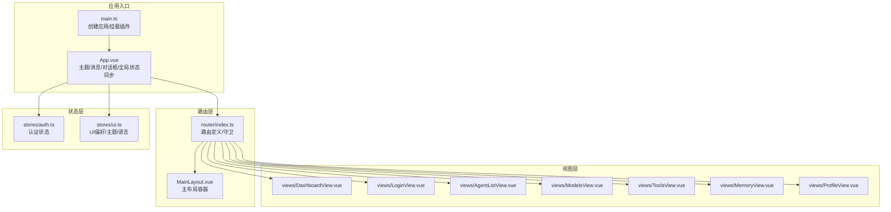
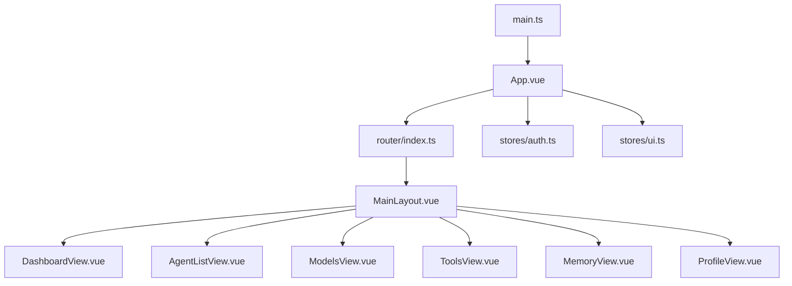
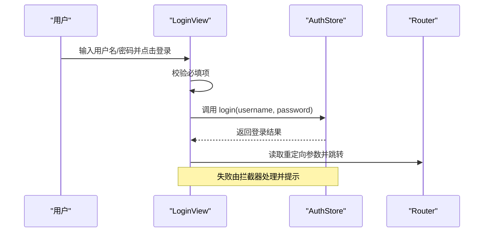
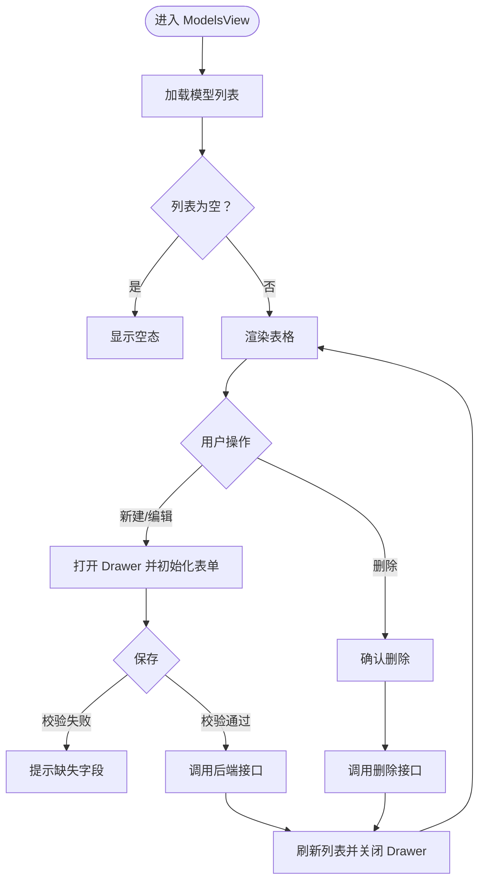
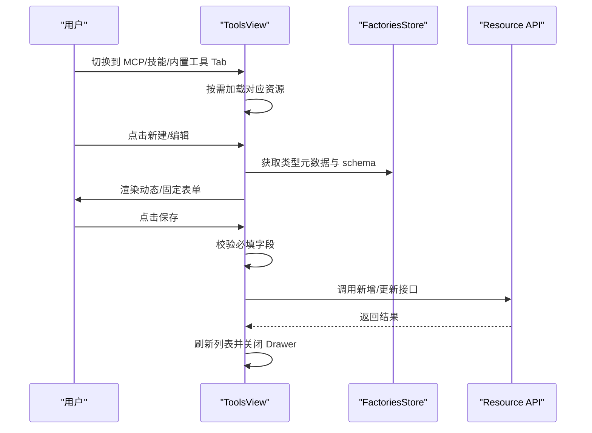
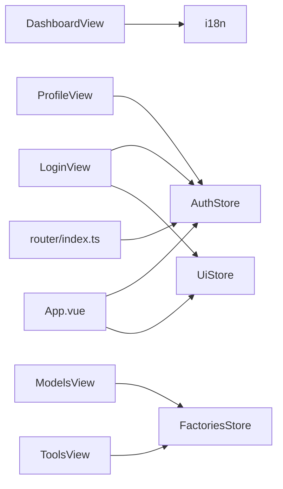

# 核心视图组件

<cite>
**本文档引用的文件**
- [App.vue](file://agentscope-builder-saton/frontend/src/App.vue)
- [main.ts](file://agentscope-builder-saton/frontend/src/main.ts)
- [router/index.ts](file://agentscope-builder-saton/frontend/src/router/index.ts)
- [stores/auth.ts](file://agentscope-builder-saton/frontend/src/stores/auth.ts)
- [stores/ui.ts](file://agentscope-builder-saton/frontend/src/stores/ui.ts)
- [views/DashboardView.vue](file://agentscope-builder-saton/frontend/src/views/DashboardView.vue)
- [views/LoginView.vue](file://agentscope-builder-saton/frontend/src/views/LoginView.vue)
- [views/AgentListView.vue](file://agentscope-builder-saton/frontend/src/views/AgentListView.vue)
- [views/ModelsView.vue](file://agentscope-builder-saton/frontend/src/views/ModelsView.vue)
- [views/ToolsView.vue](file://agentscope-builder-saton/frontend/src/views/ToolsView.vue)
- [views/MemoryView.vue](file://agentscope-builder-saton/frontend/src/views/MemoryView.vue)
- [views/ProfileView.vue](file://agentscope-builder-saton/frontend/src/views/ProfileView.vue)
</cite>

## 目录
1. [引言](#引言)
2. [项目结构](#项目结构)
3. [核心组件](#核心组件)
4. [架构总览](#架构总览)
5. [详细组件分析](#详细组件分析)
6. [依赖分析](#依赖分析)
7. [性能考虑](#性能考虑)
8. [故障排查指南](#故障排查指南)
9. [结论](#结论)
10. [附录](#附录)

## 引言
本文件聚焦于前端核心视图组件的实现与交互，覆盖仪表板、登录、代理列表、模型配置、工具管理、内存配置、用户资料与系统设置等页面。文档从架构、数据流、生命周期、状态管理、国际化与响应式设计等方面进行系统性说明，并提供导航关系、使用示例与扩展建议。

## 项目结构
前端采用 Vue 3 + TypeScript + Pinia + Naive UI + UnoCSS 的组合，路由基于 vue-router，状态持久化通过 pinia-plugin-persistedstate 实现。应用在根组件中统一注入主题、消息与对话框上下文，并通过路由守卫控制访问权限。

图表来源
- [main.ts:1-19](file://agentscope-builder-saton/frontend/src/main.ts#L1-L19)
- [App.vue:1-61](file://agentscope-builder-saton/frontend/src/App.vue#L1-L61)
- [router/index.ts:1-88](file://agentscope-builder-saton/frontend/src/router/index.ts#L1-L88)
- [stores/auth.ts:1-41](file://agentscope-builder-saton/frontend/src/stores/auth.ts#L1-L41)
- [stores/ui.ts:1-47](file://agentscope-builder-saton/frontend/src/stores/ui.ts#L1-L47)
- [views/DashboardView.vue:1-33](file://agentscope-builder-saton/frontend/src/views/DashboardView.vue#L1-L33)
- [views/LoginView.vue:1-82](file://agentscope-builder-saton/frontend/src/views/LoginView.vue#L1-L82)
- [views/AgentListView.vue:1-14](file://agentscope-builder-saton/frontend/src/views/AgentListView.vue#L1-L14)
- [views/ModelsView.vue:1-273](file://agentscope-builder-saton/frontend/src/views/ModelsView.vue#L1-L273)
- [views/ToolsView.vue:1-434](file://agentscope-builder-saton/frontend/src/views/ToolsView.vue#L1-L434)
- [views/MemoryView.vue:1-18](file://agentscope-builder-saton/frontend/src/views/MemoryView.vue#L1-L18)
- [views/ProfileView.vue:1-23](file://agentscope-builder-saton/frontend/src/views/ProfileView.vue#L1-L23)

章节来源
- [main.ts:1-19](file://agentscope-builder-saton/frontend/src/main.ts#L1-L19)
- [App.vue:1-61](file://agentscope-builder-saton/frontend/src/App.vue#L1-L61)
- [router/index.ts:1-88](file://agentscope-builder-saton/frontend/src/router/index.ts#L1-L88)

## 核心组件
- 应用入口与全局配置：创建应用实例、安装 Pinia、路由与国际化；在根组件中同步 UI 主题与语言至全局 DOM 与 naive-ui 配置，注入全局消息 API。
- 认证与路由守卫：登录状态通过 Pinia store 管理，路由守卫在未登录时尝试恢复会话并跳转至登录页。
- 视图组件：按功能划分为仪表板、登录、代理列表、模型配置、工具管理、内存配置、用户资料等页面，均使用 i18n 提供文案。

章节来源
- [main.ts:1-19](file://agentscope-builder-saton/frontend/src/main.ts#L1-L19)
- [App.vue:1-61](file://agentscope-builder-saton/frontend/src/App.vue#L1-L61)
- [router/index.ts:66-85](file://agentscope-builder-saton/frontend/src/router/index.ts#L66-L85)
- [stores/auth.ts:1-41](file://agentscope-builder-saton/frontend/src/stores/auth.ts#L1-L41)
- [stores/ui.ts:1-47](file://agentscope-builder-saton/frontend/src/stores/ui.ts#L1-L47)

## 架构总览
应用采用“入口 -> 路由 -> 布局 -> 视图”的分层结构，状态通过 Pinia 进行集中管理，UI 主题与语言通过本地存储与 watch 同步，视图间通过路由进行导航。

图表来源
- [main.ts:1-19](file://agentscope-builder-saton/frontend/src/main.ts#L1-L19)
- [App.vue:1-61](file://agentscope-builder-saton/frontend/src/App.vue#L1-L61)
- [router/index.ts:1-88](file://agentscope-builder-saton/frontend/src/router/index.ts#L1-L88)
- [stores/auth.ts:1-41](file://agentscope-builder-saton/frontend/src/stores/auth.ts#L1-L41)
- [stores/ui.ts:1-47](file://agentscope-builder-saton/frontend/src/stores/ui.ts#L1-L47)
- [views/DashboardView.vue:1-33](file://agentscope-builder-saton/frontend/src/views/DashboardView.vue#L1-L33)
- [views/AgentListView.vue:1-14](file://agentscope-builder-saton/frontend/src/views/AgentListView.vue#L1-L14)
- [views/ModelsView.vue:1-273](file://agentscope-builder-saton/frontend/src/views/ModelsView.vue#L1-L273)
- [views/ToolsView.vue:1-434](file://agentscope-builder-saton/frontend/src/views/ToolsView.vue#L1-L434)
- [views/MemoryView.vue:1-18](file://agentscope-builder-saton/frontend/src/views/MemoryView.vue#L1-L18)
- [views/ProfileView.vue:1-23](file://agentscope-builder-saton/frontend/src/views/ProfileView.vue#L1-L23)

## 详细组件分析

### 仪表板视图（DashboardView）
- 功能概述：欢迎语与快速入口，引导用户进入代理创建或代理列表。
- 交互逻辑：点击按钮跳转至代理创建页或代理列表页；使用 i18n 提供文案。
- 生命周期：无复杂生命周期钩子，仅渲染欢迎内容与按钮。
- 状态管理：不直接依赖 store，通过路由跳转驱动导航。
- 国际化：通过 useI18n 获取文案键值，实现多语言显示。
- 响应式：居中布局，适配不同屏幕尺寸。

章节来源
- [views/DashboardView.vue:1-33](file://agentscope-builder-saton/frontend/src/views/DashboardView.vue#L1-L33)

### 登录视图（LoginView）
- 功能概述：提供用户名/密码输入与登录按钮，完成认证后根据重定向参数跳转。
- 认证流程：调用认证 store 的登录方法，成功后读取重定向地址并跳转；失败由拦截器统一处理。
- 错误处理：表单校验为空时阻止提交；加载态防止重复提交。
- 状态管理：依赖认证 store 与 UI store（背景色随主题变化）。
- 国际化：表单项标签与按钮文案来自 i18n。
- 响应式：卡片宽度限制与垂直居中，适配移动端。

图表来源
- [views/LoginView.vue:20-32](file://agentscope-builder-saton/frontend/src/views/LoginView.vue#L20-L32)
- [stores/auth.ts:13-18](file://agentscope-builder-saton/frontend/src/stores/auth.ts#L13-L18)
- [router/index.ts:24-26](file://agentscope-builder-saton/frontend/src/router/index.ts#L24-L26)

章节来源
- [views/LoginView.vue:1-82](file://agentscope-builder-saton/frontend/src/views/LoginView.vue#L1-L82)
- [stores/auth.ts:1-41](file://agentscope-builder-saton/frontend/src/stores/auth.ts#L1-L41)
- [router/index.ts:66-85](file://agentscope-builder-saton/frontend/src/router/index.ts#L66-L85)

### 代理列表视图（AgentListView）
- 功能概述：展示代理资源列表，当前为占位空态。
- 交互逻辑：预留编辑/删除入口，当前以空态呈现。
- 状态管理：无外部 API 调用，依赖 i18n 文案。
- 国际化：标题与空态文案来自 i18n。
- 响应式：基础卡片布局，适配多列展示。

章节来源
- [views/AgentListView.vue:1-14](file://agentscope-builder-saton/frontend/src/views/AgentListView.vue#L1-L14)

### 模型配置视图（ModelsView）
- 功能概述：模型提供者列表的增删改查，支持动态表单校验与保存。
- 数据流：首次挂载加载模型列表；打开 Drawer 编辑/新建；保存时进行基础与 schema 校验；成功后刷新列表。
- 交互逻辑：表格列包含名称、类型、端点、更新时间与操作按钮；Drawer 内部根据类型动态渲染表单。
- 状态管理：依赖工厂 store 获取类型元数据与 schema；使用对话框确认删除。
- 国际化：表格列与弹窗文案来自 i18n。
- 性能考虑：列表懒加载、保存时局部 loading、深拷贝避免直接修改 store 数据。

图表来源
- [views/ModelsView.vue:33-41](file://agentscope-builder-saton/frontend/src/views/ModelsView.vue#L33-L41)
- [views/ModelsView.vue:74-91](file://agentscope-builder-saton/frontend/src/views/ModelsView.vue#L74-L91)
- [views/ModelsView.vue:98-139](file://agentscope-builder-saton/frontend/src/views/ModelsView.vue#L98-L139)
- [views/ModelsView.vue:142-156](file://agentscope-builder-saton/frontend/src/views/ModelsView.vue#L142-L156)

章节来源
- [views/ModelsView.vue:1-273](file://agentscope-builder-saton/frontend/src/views/ModelsView.vue#L1-L273)

### 工具管理视图（ToolsView）
- 功能概述：MCP 服务器、技能仓库与内置工具三类资源的管理，支持动态表单与固定表单混合。
- 数据流：三个 Tab 分别懒加载对应资源；Drawer 内部根据模式切换渲染不同表单；保存时进行字段校验并调用接口。
- 交互逻辑：Grid 卡片展示资源摘要，支持编辑/删除；MCP 模式下根据传输方式与鉴权策略渲染表单项。
- 状态管理：依赖工厂 store 获取类型元数据与 schema；使用对话框确认删除。
- 国际化：Tab 标签与弹窗文案来自 i18n。
- 性能考虑：Tab 切换时按需加载；保存时局部 loading。

图表来源
- [views/ToolsView.vue:46-53](file://agentscope-builder-saton/frontend/src/views/ToolsView.vue#L46-L53)
- [views/ToolsView.vue:171-237](file://agentscope-builder-saton/frontend/src/views/ToolsView.vue#L171-L237)
- [views/ToolsView.vue:257-267](file://agentscope-builder-saton/frontend/src/views/ToolsView.vue#L257-L267)

章节来源
- [views/ToolsView.vue:1-434](file://agentscope-builder-saton/frontend/src/views/ToolsView.vue#L1-L434)

### 内存配置视图（MemoryView）
- 功能概述：当前为占位页面，提示记忆功能需后端支持。
- 交互逻辑：无交互，仅展示说明文本。
- 状态管理：无外部依赖。
- 国际化：标题与说明文案来自 i18n。

章节来源
- [views/MemoryView.vue:1-18](file://agentscope-builder-saton/frontend/src/views/MemoryView.vue#L1-L18)

### 用户资料视图（ProfileView）
- 功能概述：展示当前登录用户的用户名等基本信息。
- 交互逻辑：无交互，仅展示只读信息。
- 状态管理：从认证 store 读取用户信息。
- 国际化：标题与字段文案来自 i18n。

章节来源
- [views/ProfileView.vue:1-23](file://agentscope-builder-saton/frontend/src/views/ProfileView.vue#L1-L23)
- [stores/auth.ts:9-11](file://agentscope-builder-saton/frontend/src/stores/auth.ts#L9-L11)

## 依赖分析
- 组件耦合：视图组件主要依赖 i18n 与相关 store；部分视图依赖工厂 store 获取类型元数据与 schema。
- 路由耦合：路由守卫统一控制访问权限，未登录时跳转至登录页并携带重定向参数。
- 外部依赖：Naive UI 提供图标、表单、抽屉、对话框等组件；axios 拦截器负责错误提示与统一处理。

图表来源
- [views/DashboardView.vue:1-8](file://agentscope-builder-saton/frontend/src/views/DashboardView.vue#L1-L8)
- [views/LoginView.vue:6-13](file://agentscope-builder-saton/frontend/src/views/LoginView.vue#L6-L13)
- [views/ModelsView.vue:21-27](file://agentscope-builder-saton/frontend/src/views/ModelsView.vue#L21-L27)
- [views/ToolsView.vue:24-37](file://agentscope-builder-saton/frontend/src/views/ToolsView.vue#L24-L37)
- [views/ProfileView.vue:4-7](file://agentscope-builder-saton/frontend/src/views/ProfileView.vue#L4-L7)
- [App.vue:10-13](file://agentscope-builder-saton/frontend/src/App.vue#L10-L13)
- [router/index.ts:69-84](file://agentscope-builder-saton/frontend/src/router/index.ts#L69-L84)

章节来源
- [App.vue:1-61](file://agentscope-builder-saton/frontend/src/App.vue#L1-L61)
- [router/index.ts:1-88](file://agentscope-builder-saton/frontend/src/router/index.ts#L1-L88)
- [stores/auth.ts:1-41](file://agentscope-builder-saton/frontend/src/stores/auth.ts#L1-L41)
- [stores/ui.ts:1-47](file://agentscope-builder-saton/frontend/src/stores/ui.ts#L1-L47)

## 性能考虑
- 懒加载路由组件：路由按需加载，减少首屏体积。
- 局部加载与空态：列表与卡片在加载时显示空态，避免长时间白屏。
- 本地存储与主题同步：UI 偏好写入 localStorage 并即时同步至 DOM，降低重复计算。
- 表单深拷贝：编辑模型时对 props 进行深拷贝，避免污染原始 store 数据。

## 故障排查指南
- 登录失败：检查网络拦截器是否正确捕获错误并提示；确认用户名/密码非空。
- 未登录跳转：若刷新后未自动恢复会话，检查后端 /me 接口返回与 Cookie 设置。
- 列表空白：确认资源 API 是否正常返回数据；查看控制台是否有异常。
- Drawer 无法保存：检查必填字段与动态 schema 校验；查看消息提示与保存 loading 状态。

章节来源
- [views/LoginView.vue:20-32](file://agentscope-builder-saton/frontend/src/views/LoginView.vue#L20-L32)
- [router/index.ts:77-84](file://agentscope-builder-saton/frontend/src/router/index.ts#L77-L84)
- [views/ModelsView.vue:98-139](file://agentscope-builder-saton/frontend/src/views/ModelsView.vue#L98-L139)
- [views/ToolsView.vue:171-237](file://agentscope-builder-saton/frontend/src/views/ToolsView.vue#L171-L237)

## 结论
核心视图组件围绕“路由守卫 + Pinia 状态 + i18n 国际化”构建，具备清晰的职责划分与良好的扩展性。通过懒加载与按需渲染优化性能，通过对话框与消息统一错误处理。后续可在各视图中完善数据加载与交互细节，增强可访问性与可维护性。

## 附录

### 导航关系与数据流转
- 登录页：未登录用户访问受保护路由时被拦截，跳转至登录页并携带重定向参数；登录成功后根据重定向参数跳转。
- 仪表板：作为默认首页，提供快速入口跳转至代理相关页面。
- 列表页：代理列表、模型列表、工具列表分别承载 CRUD 与动态表单能力。
- 资料页：展示用户信息，便于核对当前登录身份。

章节来源
- [router/index.ts:6-59](file://agentscope-builder-saton/frontend/src/router/index.ts#L6-L59)
- [views/DashboardView.vue:15-20](file://agentscope-builder-saton/frontend/src/views/DashboardView.vue#L15-L20)
- [views/LoginView.vue:24-26](file://agentscope-builder-saton/frontend/src/views/LoginView.vue#L24-L26)

### 使用示例与自定义扩展
- 自定义 Drawer 表单：参考模型与工具视图中的 Drawer 与动态表单组合，按需扩展字段与校验规则。
- 新增视图：在路由中注册新页面并设置 meta.public 控制是否公开；在布局中添加菜单项。
- 国际化扩展：在 i18n 目录新增语言键值，确保视图中使用对应的 t 函数键名。
- 响应式适配：利用 UnoCSS 与 Naive UI 的响应式布局属性，保证在移动端的良好体验。

章节来源
- [views/ModelsView.vue:224-271](file://agentscope-builder-saton/frontend/src/views/ModelsView.vue#L224-L271)
- [views/ToolsView.vue:344-431](file://agentscope-builder-saton/frontend/src/views/ToolsView.vue#L344-L431)
- [router/index.ts:6-59](file://agentscope-builder-saton/frontend/src/router/index.ts#L6-L59)
- [App.vue:15-22](file://agentscope-builder-saton/frontend/src/App.vue#L15-L22)