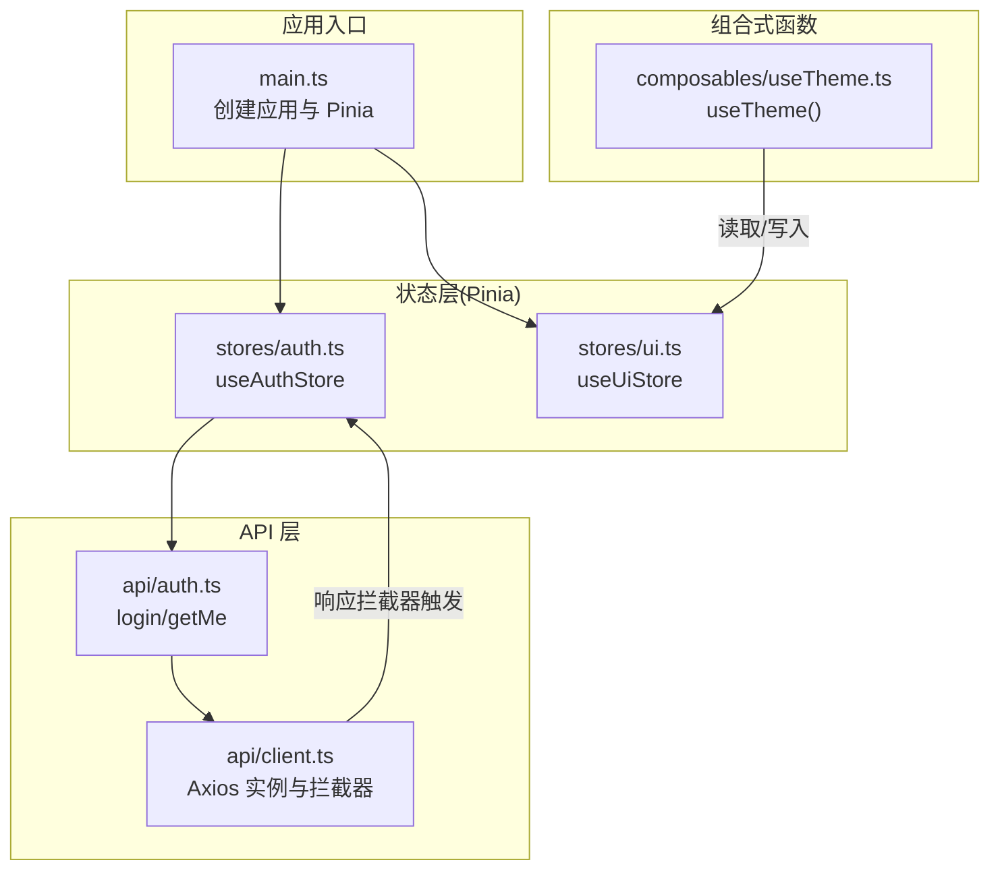
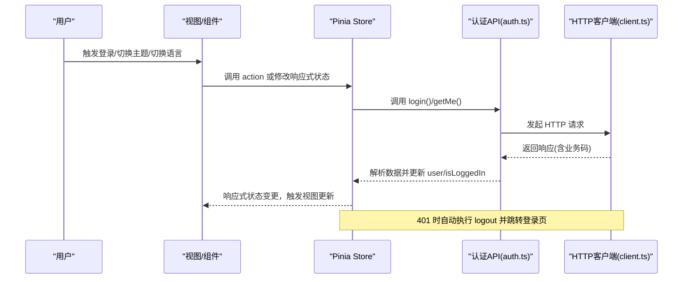
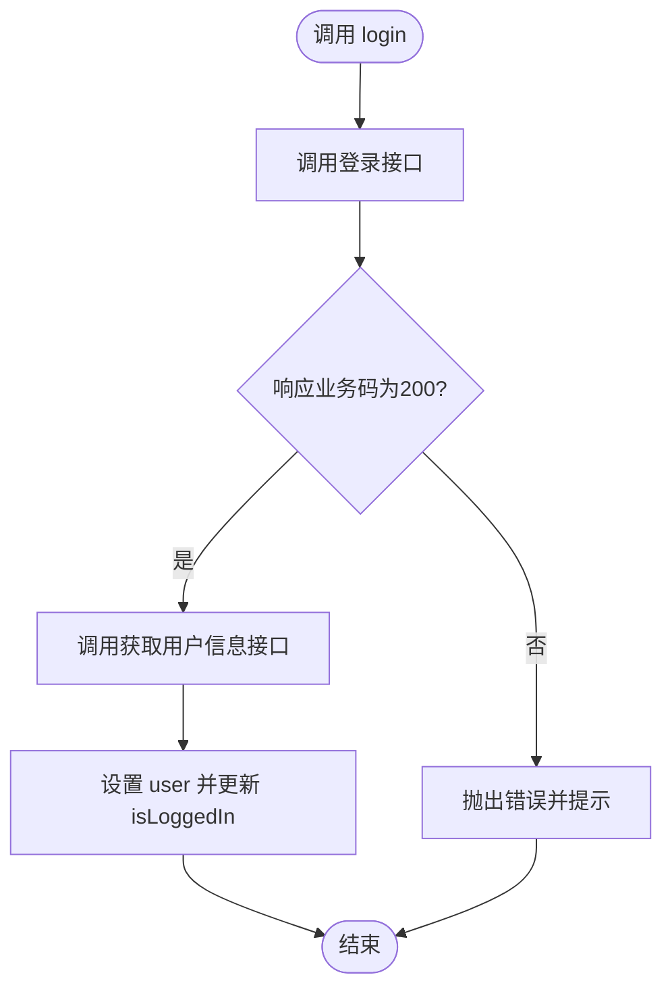
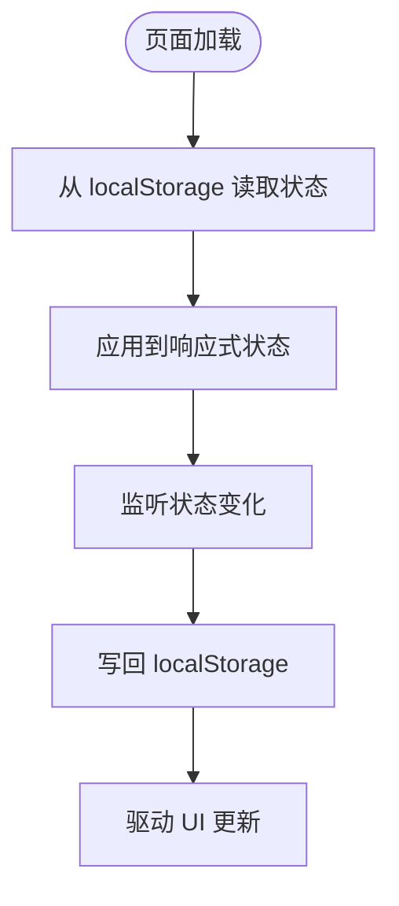
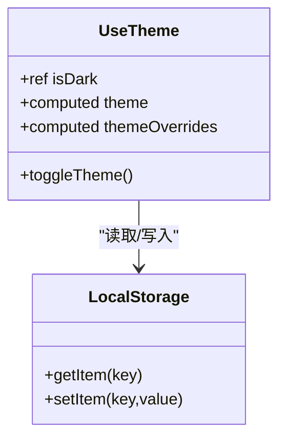
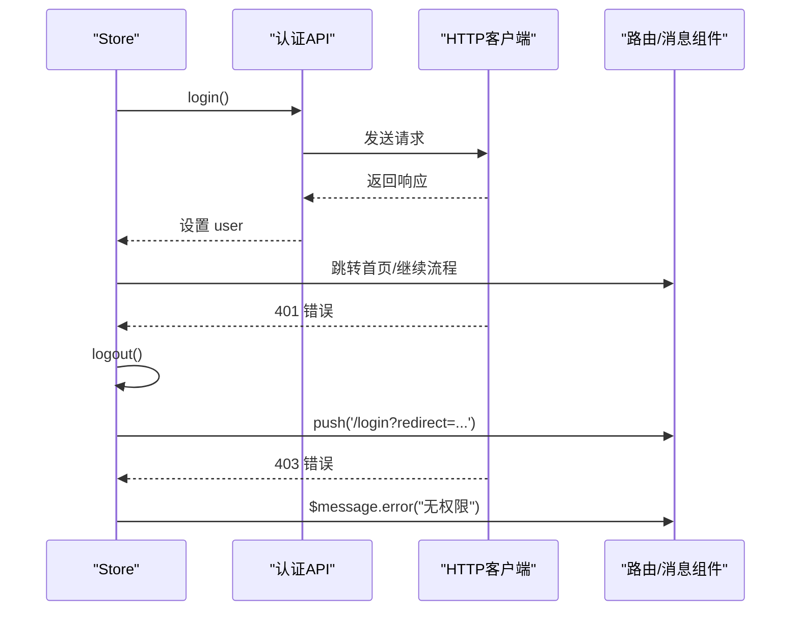
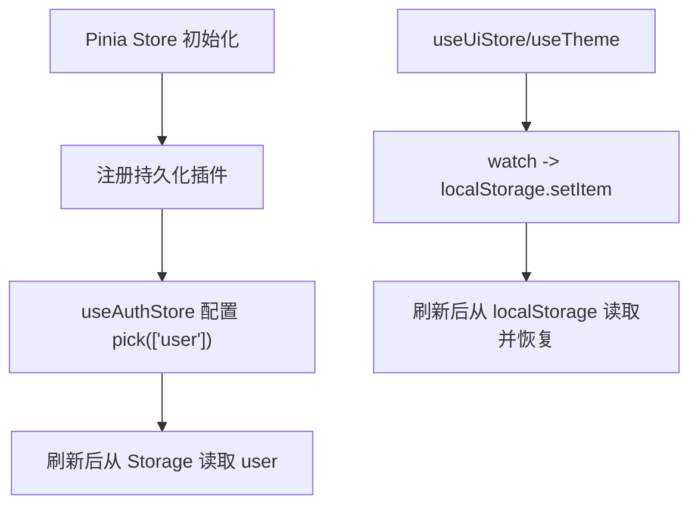
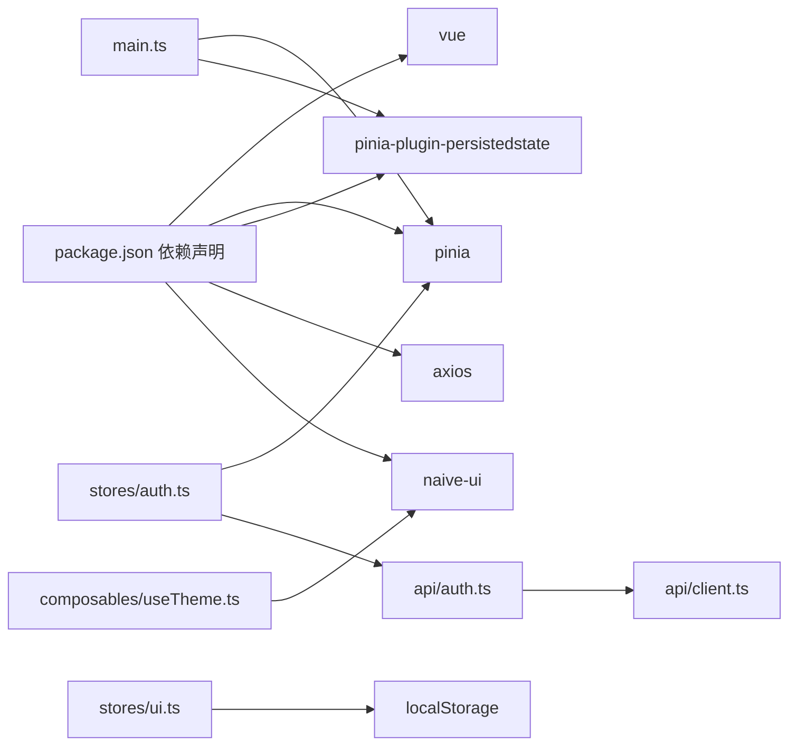

# 状态管理

<cite>
**本文引用的文件**   
- [auth.ts](file://agentscope-builder-saton/frontend/src/stores/auth.ts)
- [ui.ts](file://agentscope-builder-saton/frontend/src/stores/ui.ts)
- [useTheme.ts](file://agentscope-builder-saton/frontend/src/composables/useTheme.ts)
- [main.ts](file://agentscope-builder-saton/frontend/src/main.ts)
- [auth.ts](file://agentscope-builder-saton/frontend/src/api/auth.ts)
- [client.ts](file://agentscope-builder-saton/frontend/src/api/client.ts)
- [package.json](file://agentscope-builder-saton/frontend/package.json)
</cite>

## 目录
1. [简介](#简介)
2. [项目结构](#项目结构)
3. [核心组件](#核心组件)
4. [架构总览](#架构总览)
5. [详细组件分析](#详细组件分析)
6. [依赖分析](#依赖分析)
7. [性能考虑](#性能考虑)
8. [故障排查指南](#故障排查指南)
9. [结论](#结论)
10. [附录](#附录)

## 简介
本文件系统性阐述前端基于 Pinia 的状态管理架构与实现，重点覆盖以下方面：
- 认证状态管理：登录状态、用户信息、Token 存储与权限校验链路
- UI 状态管理：主题切换、语言切换、侧边栏折叠与持久化
- 组合式函数 useTheme 的实现与复用模式
- 工厂状态管理（概念性说明）：代理定义、工具配置与模型参数的状态维护
- 异步操作与副作用处理：Axios 拦截器、自动登出与路由重定向
- 持久化策略与本地存储机制：localStorage 与 Pinia 持久化插件
- 最佳实践与性能优化建议
- 调试与开发工具使用
- 模块化设计与代码分割策略

## 项目结构
本项目采用 Vue 3 + Pinia 架构，前端位于 agentscope-builder-saton/frontend。状态管理相关的关键位置如下：
- stores：集中存放 Pinia Store，包含认证与 UI 状态
- composables：组合式函数，如 useTheme
- api：统一的 API 客户端与认证接口封装
- main.ts：应用入口，初始化 Pinia 并启用持久化插件

图表来源
- [main.ts:1-19](file://agentscope-builder-saton/frontend/src/main.ts#L1-L19)
- [auth.ts:1-41](file://agentscope-builder-saton/frontend/src/stores/auth.ts#L1-L41)
- [ui.ts:1-47](file://agentscope-builder-saton/frontend/src/stores/ui.ts#L1-L47)
- [useTheme.ts:1-34](file://agentscope-builder-saton/frontend/src/composables/useTheme.ts#L1-L34)
- [auth.ts:1-24](file://agentscope-builder-saton/frontend/src/api/auth.ts#L1-L24)
- [client.ts:1-70](file://agentscope-builder-saton/frontend/src/api/client.ts#L1-L70)

章节来源
- [main.ts:1-19](file://agentscope-builder-saton/frontend/src/main.ts#L1-L19)
- [package.json:1-53](file://agentscope-builder-saton/frontend/package.json#L1-L53)

## 核心组件
- 认证状态（useAuthStore）
  - 状态：当前用户信息 user 与登录态 isLoggedIn
  - 动作：login、fetchMe、logout
  - 持久化：通过 Pinia 持久化插件仅持久化 user 字段
- UI 状态（useUiStore）
  - 状态：sidebarCollapsed、locale、isDark
  - 动作：toggleSidebar、toggleLocale、toggleTheme
  - 持久化：通过 localStorage 同步状态
- 主题组合式函数（useTheme）
  - 提供 isDark、theme、themeOverrides、toggleTheme
  - 与 UI Store 协同实现主题切换与样式覆盖
- API 客户端（client）
  - 统一响应结构、错误处理、401 自动登出与路由重定向
  - 与认证接口 login/getMe 配合完成登录与用户信息拉取

章节来源
- [auth.ts:1-41](file://agentscope-builder-saton/frontend/src/stores/auth.ts#L1-L41)
- [ui.ts:1-47](file://agentscope-builder-saton/frontend/src/stores/ui.ts#L1-L47)
- [useTheme.ts:1-34](file://agentscope-builder-saton/frontend/src/composables/useTheme.ts#L1-L34)
- [auth.ts:1-24](file://agentscope-builder-saton/frontend/src/api/auth.ts#L1-L24)
- [client.ts:1-70](file://agentscope-builder-saton/frontend/src/api/client.ts#L1-L70)

## 架构总览
下图展示从用户交互到状态更新与持久化的整体流程。

图表来源
- [auth.ts:13-27](file://agentscope-builder-saton/frontend/src/stores/auth.ts#L13-L27)
- [auth.ts:15-17](file://agentscope-builder-saton/frontend/src/stores/auth.ts#L15-L17)
- [auth.ts:20-27](file://agentscope-builder-saton/frontend/src/stores/auth.ts#L20-L27)
- [auth.ts:16](file://agentscope-builder-saton/frontend/src/stores/auth.ts#L16)
- [client.ts:43-48](file://agentscope-builder-saton/frontend/src/api/client.ts#L43-L48)
- [client.ts:30-37](file://agentscope-builder-saton/frontend/src/api/client.ts#L30-L37)

## 详细组件分析

### 认证状态管理（useAuthStore）
- 设计要点
  - 使用 defineStore 定义命名空间为“auth”的 Store
  - 用户信息 user 初始为空，isLoggedIn 基于 user 推导
  - login 在成功后主动调用 fetchMe 拉取最新用户信息
  - logout 将 user 置空，断开登录态
- 持久化策略
  - 通过 store 配置中的 persist.pick 仅持久化 user 字段，避免持久化敏感的 token
- 与 API 的协作
  - login 调用认证接口，随后 fetchMe 获取用户详情
  - 响应拦截器在 401 时自动清理登录态并跳转登录页

图表来源
- [auth.ts:13-18](file://agentscope-builder-saton/frontend/src/stores/auth.ts#L13-L18)
- [auth.ts:20-27](file://agentscope-builder-saton/frontend/src/stores/auth.ts#L20-L27)
- [client.ts:30-37](file://agentscope-builder-saton/frontend/src/api/client.ts#L30-L37)

章节来源
- [auth.ts:1-41](file://agentscope-builder-saton/frontend/src/stores/auth.ts#L1-L41)
- [auth.ts:13-18](file://agentscope-builder-saton/frontend/src/stores/auth.ts#L13-L18)
- [auth.ts:20-27](file://agentscope-builder-saton/frontend/src/stores/auth.ts#L20-L27)
- [auth.ts:29-31](file://agentscope-builder-saton/frontend/src/stores/auth.ts#L29-L31)

### UI 状态管理（useUiStore）
- 设计要点
  - 以 ref 维护 sidebarCollapsed、locale、isDark 三类 UI 状态
  - 通过 watch 将状态同步到 localStorage，实现刷新后恢复
  - 提供 toggleSidebar、toggleLocale、toggleTheme 动作
- 与 useTheme 的关系
  - useTheme 也读取 localStorage 中的主题偏好，并提供 Naive UI 的主题覆盖
  - 可将 useTheme 的 isDark 与 useUiStore 的 isDark 解耦或联动，按需选择

图表来源
- [ui.ts:6-10](file://agentscope-builder-saton/frontend/src/stores/ui.ts#L6-L10)
- [ui.ts:17-21](file://agentscope-builder-saton/frontend/src/stores/ui.ts#L17-L21)
- [ui.ts:28-32](file://agentscope-builder-saton/frontend/src/stores/ui.ts#L28-L32)
- [useTheme.ts:4-29](file://agentscope-builder-saton/frontend/src/composables/useTheme.ts#L4-L29)

章节来源
- [ui.ts:1-47](file://agentscope-builder-saton/frontend/src/stores/ui.ts#L1-L47)
- [useTheme.ts:1-34](file://agentscope-builder-saton/frontend/src/composables/useTheme.ts#L1-L34)

### 组合式函数 useTheme 的实现与复用模式
- 实现要点
  - 内部维护 isDark，并根据其计算 Naive UI 的主题对象 theme 与主题覆盖 themeOverrides
  - 提供 toggleTheme 切换 isDark 并同步到 localStorage
- 复用模式
  - 在需要主题切换的组件中直接调用 useTheme，获得 isDark、theme、themeOverrides、toggleTheme
  - 可结合 useUiStore 的 isDark 实现统一主题源，或保持独立以支持多主题场景

图表来源
- [useTheme.ts:1-34](file://agentscope-builder-saton/frontend/src/composables/useTheme.ts#L1-L34)

章节来源
- [useTheme.ts:1-34](file://agentscope-builder-saton/frontend/src/composables/useTheme.ts#L1-L34)

### 工厂状态管理（概念性说明）
- 代理定义：可将“代理”相关状态抽象为 Store，包含代理列表、当前选中代理、代理配置等
- 工具配置：工具集合、可用工具列表、工具参数面板状态等
- 模型参数：模型选择、温度、上下文长度等参数的全局状态
- 状态维护建议
  - 将工厂状态拆分为多个模块 Store，降低耦合
  - 使用持久化插件保存用户偏好的工具与模型参数
  - 通过组合式函数封装跨组件共享的工厂状态逻辑

[本节为概念性说明，不直接分析具体文件，故不附“章节来源”]

### 异步操作与副作用处理
- 登录流程
  - 调用登录接口，成功后立即调用获取用户信息接口
  - 响应拦截器对业务码进行校验，非 200 抛错并提示
- 权限与自动登出
  - 响应拦截器在 401 时清除登录态并跳转登录页，携带当前路由作为 redirect 参数
- 其他错误处理
  - 403 提示“无权限”
  - 服务端错误、超时等统一提示

图表来源
- [auth.ts:13-18](file://agentscope-builder-saton/frontend/src/stores/auth.ts#L13-L18)
- [auth.ts:20-27](file://agentscope-builder-saton/frontend/src/stores/auth.ts#L20-L27)
- [client.ts:43-48](file://agentscope-builder-saton/frontend/src/api/client.ts#L43-L48)
- [client.ts:50-53](file://agentscope-builder-saton/frontend/src/api/client.ts#L50-L53)

章节来源
- [client.ts:1-70](file://agentscope-builder-saton/frontend/src/api/client.ts#L1-L70)

### 持久化策略与本地存储机制
- Pinia 持久化插件
  - 在 main.ts 中注册 pinia-plugin-persistedstate
  - 在 useAuthStore 中通过 persist.pick 仅持久化 user 字段
- localStorage 同步
  - useUiStore 与 useTheme 通过 watch 将状态写入 localStorage
  - 页面刷新后从 localStorage 读取并恢复 UI 状态

图表来源
- [main.ts:12-13](file://agentscope-builder-saton/frontend/src/main.ts#L12-L13)
- [auth.ts:35-39](file://agentscope-builder-saton/frontend/src/stores/auth.ts#L35-L39)
- [ui.ts:6-10](file://agentscope-builder-saton/frontend/src/stores/ui.ts#L6-L10)
- [ui.ts:17-21](file://agentscope-builder-saton/frontend/src/stores/ui.ts#L17-L21)
- [ui.ts:28-32](file://agentscope-builder-saton/frontend/src/stores/ui.ts#L28-L32)
- [useTheme.ts:4-29](file://agentscope-builder-saton/frontend/src/composables/useTheme.ts#L4-L29)

章节来源
- [main.ts:1-19](file://agentscope-builder-saton/frontend/src/main.ts#L1-L19)
- [auth.ts:35-39](file://agentscope-builder-saton/frontend/src/stores/auth.ts#L35-L39)
- [ui.ts:1-47](file://agentscope-builder-saton/frontend/src/stores/ui.ts#L1-L47)
- [useTheme.ts:1-34](file://agentscope-builder-saton/frontend/src/composables/useTheme.ts#L1-L34)

## 依赖分析
- 核心依赖
  - vue、vue-router、pinia、pinia-plugin-persistedstate
  - axios、naive-ui
- 关键交互
  - main.ts 注册 Pinia 与持久化插件
  - api/client.ts 提供统一的 HTTP 客户端与拦截器
  - stores/auth.ts 与 api/auth.ts 协作完成认证流程
  - composables/useTheme.ts 与 stores/ui.ts 协同实现主题与 UI 状态

图表来源
- [package.json:13-33](file://agentscope-builder-saton/frontend/package.json#L13-L33)
- [main.ts:1-19](file://agentscope-builder-saton/frontend/src/main.ts#L1-L19)
- [auth.ts:1-41](file://agentscope-builder-saton/frontend/src/stores/auth.ts#L1-L41)
- [auth.ts:1-24](file://agentscope-builder-saton/frontend/src/api/auth.ts#L1-L24)
- [client.ts:1-70](file://agentscope-builder-saton/frontend/src/api/client.ts#L1-L70)
- [useTheme.ts:1-34](file://agentscope-builder-saton/frontend/src/composables/useTheme.ts#L1-L34)
- [ui.ts:1-47](file://agentscope-builder-saton/frontend/src/stores/ui.ts#L1-L47)

章节来源
- [package.json:1-53](file://agentscope-builder-saton/frontend/package.json#L1-L53)

## 性能考虑
- 状态粒度与订阅范围
  - 将大对象拆分为细粒度状态，减少不必要的响应式追踪与渲染
- 持久化范围
  - 仅持久化必要字段（如 user），避免持久化大型对象或敏感信息
- 异步与防抖
  - 对频繁变更的 UI 状态（如窗口尺寸、滚动位置）使用防抖/节流
- 组件级缓存
  - 对昂贵计算使用 computed 缓存；对复杂列表使用虚拟滚动
- 插件与包体积
  - 按需引入插件与组件库功能，避免全量打包

[本节提供通用指导，不直接分析具体文件，故不附“章节来源”]

## 故障排查指南
- 登录后仍显示未登录
  - 检查登录接口是否返回业务码 200
  - 确认 fetchMe 是否被调用且成功设置 user
  - 核对持久化插件是否生效（pick 配置）
- 401 自动跳转循环
  - 检查拦截器中 push 的路由是否正确，redirect 参数是否传递
  - 确保 logout 后 user 为空
- 主题切换无效
  - 检查 useTheme 与 useUiStore 的 isDark 是否一致
  - 确认 localStorage 中的 theme 值是否正确写入
- 国际化/侧边栏状态未恢复
  - 确认 localStorage 中对应键是否存在
  - 检查 watch 是否在初始化时执行

章节来源
- [client.ts:43-48](file://agentscope-builder-saton/frontend/src/api/client.ts#L43-L48)
- [auth.ts:13-18](file://agentscope-builder-saton/frontend/src/stores/auth.ts#L13-L18)
- [auth.ts:20-27](file://agentscope-builder-saton/frontend/src/stores/auth.ts#L20-L27)
- [ui.ts:6-10](file://agentscope-builder-saton/frontend/src/stores/ui.ts#L6-L10)
- [ui.ts:17-21](file://agentscope-builder-saton/frontend/src/stores/ui.ts#L17-L21)
- [ui.ts:28-32](file://agentscope-builder-saton/frontend/src/stores/ui.ts#L28-L32)
- [useTheme.ts:4-29](file://agentscope-builder-saton/frontend/src/composables/useTheme.ts#L4-L29)

## 结论
本项目采用 Pinia 进行状态管理，结合 axios 拦截器实现了完善的认证与权限处理链路。通过 localStorage 与 Pinia 持久化插件，实现了 UI 状态与用户信息的可靠恢复。useTheme 与 useUiStore 的配合提供了灵活的主题与界面控制能力。建议在后续扩展中进一步细化状态模块、限制持久化范围并引入必要的性能优化手段。

[本节为总结性内容，不直接分析具体文件，故不附“章节来源”]

## 附录
- 开发与调试
  - 使用浏览器 Vue Devtools 查看 Pinia Store 状态与变更
  - 在开发环境开启严格模式，捕获潜在状态异常
- 版本与依赖
  - 确保 vue、pinia、axios、naive-ui 版本兼容
  - 如需更细粒度的持久化控制，可探索自定义持久化策略

[本节为通用附录，不直接分析具体文件，故不附“章节来源”]