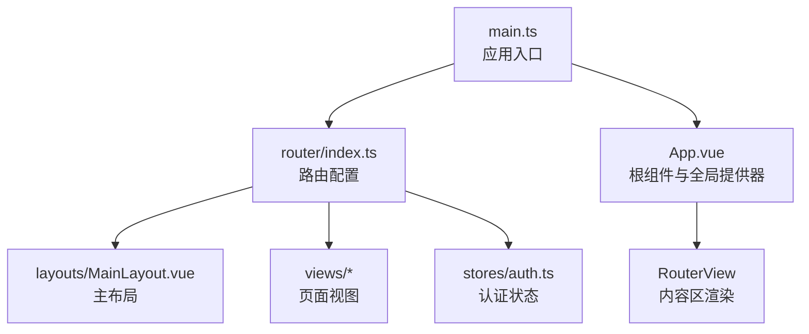
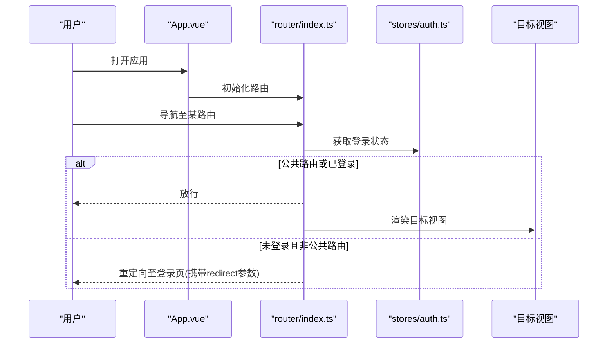
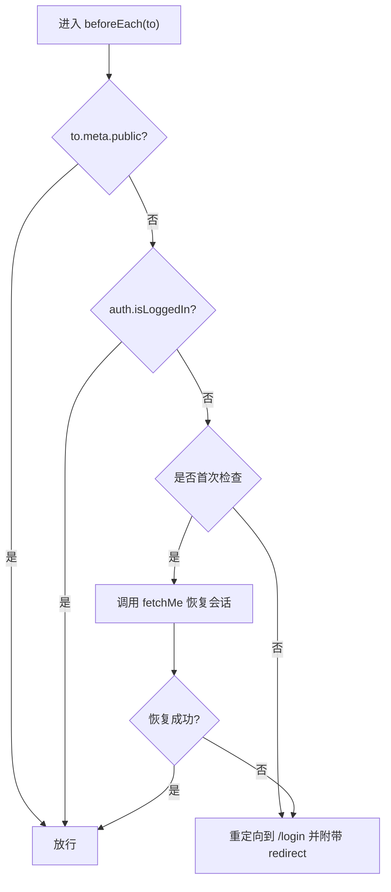
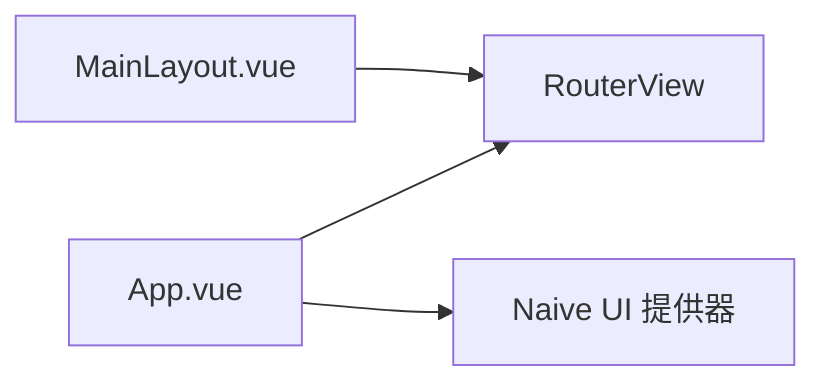
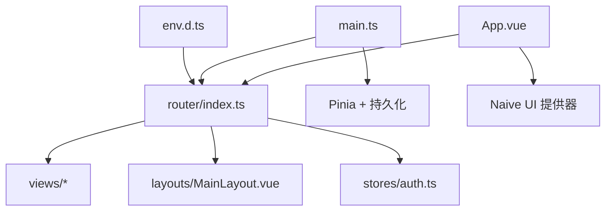

# 路由导航

<cite>
**本文引用的文件**
- [router/index.ts](file://agentscope-builder-saton/frontend/src/router/index.ts)
- [App.vue](file://agentscope-builder-saton/frontend/src/App.vue)
- [main.ts](file://agentscope-builder-saton/frontend/src/main.ts)
- [env.d.ts](file://agentscope-builder-saton/frontend/src/env.d.ts)
- [auth.ts](file://agentscope-builder-saton/frontend/src/stores/auth.ts)
- [ui.ts](file://agentscope-builder-saton/frontend/src/stores/ui.ts)
- [LoginView.vue](file://agentscope-builder-saton/frontend/src/views/LoginView.vue)
- [DashboardView.vue](file://agentscope-builder-saton/frontend/src/views/DashboardView.vue)
- [AgentListView.vue](file://agentscope-builder-saton/frontend/src/views/AgentListView.vue)
- [AgentEditView.vue](file://agentscope-builder-saton/frontend/src/views/AgentEditView.vue)
- [ChatView.vue](file://agentscope-builder-saton/frontend/src/views/ChatView.vue)
- [ModelsView.vue](file://agentscope-builder-saton/frontend/src/views/ModelsView.vue)
- [ToolsView.vue](file://agentscope-builder-saton/frontend/src/views/ToolsView.vue)
- [MemoryView.vue](file://agentscope-builder-saton/frontend/src/views/MemoryView.vue)
- [ProfileView.vue](file://agentscope-builder-saton/frontend/src/views/ProfileView.vue)
- [NotFoundView.vue](file://agentscope-builder-saton/frontend/src/views/NotFoundView.vue)
- [MainLayout.vue](file://agentscope-builder-saton/frontend/src/layouts/MainLayout.vue)
</cite>

## 目录
1. [简介](#简介)
2. [项目结构](#项目结构)
3. [核心组件](#核心组件)
4. [架构总览](#架构总览)
5. [详细组件分析](#详细组件分析)
6. [依赖分析](#依赖分析)
7. [性能考虑](#性能考虑)
8. [故障排查指南](#故障排查指南)
9. [结论](#结论)
10. [附录](#附录)

## 简介
本文件面向前端路由导航体系，围绕 Vue Router 在本项目中的配置与策略进行系统性说明。重点覆盖以下方面：
- 路由配置：路由定义、嵌套路由与动态路由
- 导航守卫：全局前置守卫、公共页面与会话恢复策略
- 布局系统：MainLayout 主布局与内容区渲染
- 路由元信息：meta 的权限控制、公共访问标记
- 程序化导航：编程式路由跳转与重定向
- 路由懒加载与代码分割
- 最佳实践与性能优化
- SEO 与预加载策略
- 测试与调试方法

## 项目结构
前端路由位于独立模块中，通过入口应用挂载并注入全局状态与国际化能力；路由采用 History 模式，结合 Pinia 状态管理与 Naive UI 提供器。

图表来源
- [main.ts:1-19](file://agentscope-builder-saton/frontend/src/main.ts#L1-L19)
- [router/index.ts:1-103](file://agentscope-builder-saton/frontend/src/router/index.ts#L1-L103)
- [App.vue:1-61](file://agentscope-builder-saton/frontend/src/App.vue#L1-L61)

章节来源
- [main.ts:1-19](file://agentscope-builder-saton/frontend/src/main.ts#L1-L19)
- [router/index.ts:1-103](file://agentscope-builder-saton/frontend/src/router/index.ts#L1-L103)
- [App.vue:1-61](file://agentscope-builder-saton/frontend/src/App.vue#L1-L61)

## 核心组件
- 路由器实例：基于 History 模式创建，集中声明所有路由规则与全局前置守卫
- 全局守卫：统一处理登录态校验、HMR/刷新场景下的会话恢复
- 主布局：承载侧边/顶部等通用 UI，并通过 RouterView 渲染子路由内容
- 页面视图：按功能划分的页面组件，均以动态导入方式实现懒加载
- 认证存储：提供 isLoggedIn 与 fetchMe 等能力，支撑守卫逻辑

章节来源
- [router/index.ts:76-100](file://agentscope-builder-saton/frontend/src/router/index.ts#L76-L100)
- [MainLayout.vue](file://agentscope-builder-saton/frontend/src/layouts/MainLayout.vue)
- [auth.ts](file://agentscope-builder-saton/frontend/src/stores/auth.ts)

## 架构总览
下图展示从应用启动到路由守卫执行的关键流程：

图表来源
- [router/index.ts:84-100](file://agentscope-builder-saton/frontend/src/router/index.ts#L84-L100)
- [auth.ts](file://agentscope-builder-saton/frontend/src/stores/auth.ts)

## 详细组件分析

### 路由配置与策略
- 路由定义
  - 登录页：公开访问，meta 标记为 public
  - 根路径：包裹主布局，内部为嵌套路由
  - 通用页面：仪表盘、模型、工具、记忆体、个人资料等
  - 动态路由：编辑与聊天页使用动态参数
  - 通配路由：兜底 404 页面，公开访问
- 嵌套路由
  - 根路径指向 MainLayout，其 children 定义子路由，实现“布局+内容”的解耦
  - 子路由通过 RouterView 渲染对应视图
- 动态路由
  - 使用路径参数匹配不同实体 ID，便于在组件内读取并加载数据
- 路由懒加载
  - 所有视图组件均通过动态导入实现按需加载，减少首屏体积

章节来源
- [router/index.ts:6-74](file://agentscope-builder-saton/frontend/src/router/index.ts#L6-L74)

### 导航守卫
- 全局前置守卫
  - 优先判断 meta.public，公开路由直接放行
  - 非公开路由先检查登录态，已登录则放行
  - 针对 HMR/刷新场景，首次进入时尝试调用 /me 恢复会话
  - 失败则重定向到登录页，并将当前路径作为 redirect 参数传递
- 会话恢复机制
  - 使用布尔标志避免重复尝试
  - 结合认证存储的异步获取能力，确保在无 SSR 场景下也能恢复状态

图表来源
- [router/index.ts:84-100](file://agentscope-builder-saton/frontend/src/router/index.ts#L84-L100)
- [auth.ts](file://agentscope-builder-saton/frontend/src/stores/auth.ts)

章节来源
- [router/index.ts:84-100](file://agentscope-builder-saton/frontend/src/router/index.ts#L84-L100)

### 布局系统
- MainLayout 作为根布局容器，承载通用导航与内容区
- App.vue 中通过 RouterView 渲染当前路由对应的视图
- 应用级提供器（Naive UI、消息、对话框等）在根组件初始化时注入

图表来源
- [MainLayout.vue](file://agentscope-builder-saton/frontend/src/layouts/MainLayout.vue)
- [App.vue:48-60](file://agentscope-builder-saton/frontend/src/App.vue#L48-L60)

章节来源
- [App.vue:48-60](file://agentscope-builder-saton/frontend/src/App.vue#L48-L60)

### 路由元信息（meta）
- meta.public：用于标识公开可访问的路由（如登录页、404）
- 权限控制：全局守卫依据 meta.public 与登录态决定放行或重定向
- 面包屑与标题：当前代码未直接使用 meta 进行面包屑与标题生成，可在后续扩展中引入统一的标题/面包屑解析器

章节来源
- [router/index.ts:11](file://agentscope-builder-saton/frontend/src/router/index.ts#L11)
- [router/index.ts:72](file://agentscope-builder-saton/frontend/src/router/index.ts#L72)

### 程序化导航与重定向
- 编程式导航
  - 在组件中可通过路由实例进行跳转（例如登录成功后的跳转）
  - 可携带参数与查询字符串，实现灵活的页面间通信
- 重定向
  - 守卫中对未登录用户进行重定向，并保留原路径以便登录后回跳

章节来源
- [router/index.ts:99](file://agentscope-builder-saton/frontend/src/router/index.ts#L99)

### 路由懒加载与代码分割
- 视图组件均采用动态导入，实现按需加载与代码分割
- 有利于降低首屏资源体积，提升初始渲染性能

章节来源
- [router/index.ts:10](file://agentscope-builder-saton/frontend/src/router/index.ts#L10)
- [router/index.ts:24](file://agentscope-builder-saton/frontend/src/router/index.ts#L24)
- [router/index.ts:34](file://agentscope-builder-saton/frontend/src/router/index.ts#L34)
- [router/index.ts:44](file://agentscope-builder-saton/frontend/src/router/index.ts#L44)
- [router/index.ts:49](file://agentscope-builder-saton/frontend/src/router/index.ts#L49)
- [router/index.ts:54](file://agentscope-builder-saton/frontend/src/router/index.ts#L54)
- [router/index.ts:59](file://agentscope-builder-saton/frontend/src/router/index.ts#L59)
- [router/index.ts:64](file://agentscope-builder-saton/frontend/src/router/index.ts#L64)
- [router/index.ts:71](file://agentscope-builder-saton/frontend/src/router/index.ts#L71)

### 路由与状态管理集成
- 认证状态：守卫依赖认证存储的登录态与恢复能力
- UI 状态：应用级主题、语言等通过 UI 存储与全局提供器联动

章节来源
- [router/index.ts:87](file://agentscope-builder-saton/frontend/src/router/index.ts#L87)
- [auth.ts](file://agentscope-builder-saton/frontend/src/stores/auth.ts)
- [ui.ts](file://agentscope-builder-saton/frontend/src/stores/ui.ts)

## 依赖分析
- 路由器依赖
  - Vue Router：History 模式、路由记录、导航守卫
  - Pinia：状态持久化插件
  - Naive UI：全局主题与消息提供器
- 组件依赖
  - App.vue 依赖路由实例与多个存储
  - 路由表依赖视图组件与布局组件
- 类型依赖
  - env.d.ts 中声明 Router 类型，便于 TS 环境下使用

图表来源
- [router/index.ts:1-103](file://agentscope-builder-saton/frontend/src/router/index.ts#L1-L103)
- [main.ts:1-19](file://agentscope-builder-saton/frontend/src/main.ts#L1-L19)
- [App.vue:1-61](file://agentscope-builder-saton/frontend/src/App.vue#L1-L61)
- [env.d.ts](file://agentscope-builder-saton/frontend/src/env.d.ts)

章节来源
- [router/index.ts:1-103](file://agentscope-builder-saton/frontend/src/router/index.ts#L1-L103)
- [main.ts:1-19](file://agentscope-builder-saton/frontend/src/main.ts#L1-L19)
- [App.vue:1-61](file://agentscope-builder-saton/frontend/src/App.vue#L1-L61)
- [env.d.ts](file://agentscope-builder-saton/frontend/src/env.d.ts)

## 性能考虑
- 代码分割
  - 已通过动态导入实现按需加载，建议保持现状并避免过度拆分导致请求数过多
- 预加载策略
  - 对高频访问的路由（如仪表盘、列表页）可考虑轻量预加载，但需权衡网络与内存占用
- 路由守卫开销
  - 守卫逻辑尽量轻量化，避免在 beforeEach 中执行重型同步操作
- 首屏优化
  - 将非关键路由延迟加载，确保核心路径（登录、仪表盘）优先到达
- 图片与静态资源
  - 配合构建工具的资源内联与压缩策略，进一步降低首屏时间

## 故障排查指南
- 登录后无法访问受保护页面
  - 检查守卫逻辑与 meta.public 标记
  - 确认认证存储的登录态与恢复流程正常
- HMR/刷新后被重定向到登录页
  - 查看首次检查标志与恢复流程是否触发
  - 确保 /me 接口可用且返回正确的用户信息
- 路由切换白屏或空白
  - 检查视图组件是否正确导出默认组件
  - 确认 RouterView 是否存在于布局中
- 标题与面包屑未更新
  - 当前未实现基于 meta 的标题/面包屑解析，可在后续扩展

章节来源
- [router/index.ts:84-100](file://agentscope-builder-saton/frontend/src/router/index.ts#L84-L100)
- [auth.ts](file://agentscope-builder-saton/frontend/src/stores/auth.ts)
- [App.vue:56](file://agentscope-builder-saton/frontend/src/App.vue#L56)

## 结论
本项目的路由体系以简洁清晰为核心：通过 History 模式与全局守卫实现统一的权限控制，借助嵌套路由与懒加载达成良好的性能与可维护性。建议在现有基础上逐步完善 meta 的语义化使用（如标题、面包屑），并结合预加载与缓存策略进一步优化用户体验。

## 附录
- 路由表概览（节选）
  - 登录页：公开访问
  - 根路径：重定向至仪表盘
  - 仪表盘、智能体列表、新建/编辑智能体、智能体聊天、模型、工具、记忆体、个人资料
  - 404：兜底页面
- 关键实现位置
  - 路由定义与守卫：[router/index.ts:6-100](file://agentscope-builder-saton/frontend/src/router/index.ts#L6-L100)
  - 应用入口与挂载：[main.ts:1-19](file://agentscope-builder-saton/frontend/src/main.ts#L1-L19)
  - 根组件与 RouterView：[App.vue:48-60](file://agentscope-builder-saton/frontend/src/App.vue#L48-L60)
  - 类型声明（Router）：[env.d.ts](file://agentscope-builder-saton/frontend/src/env.d.ts)