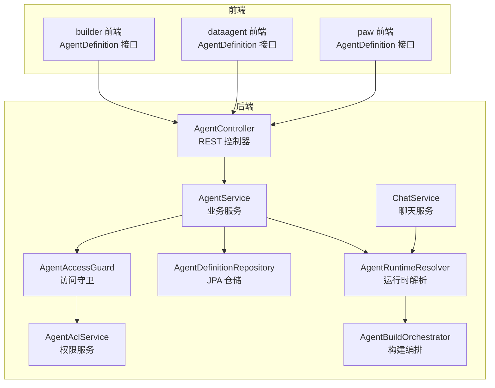
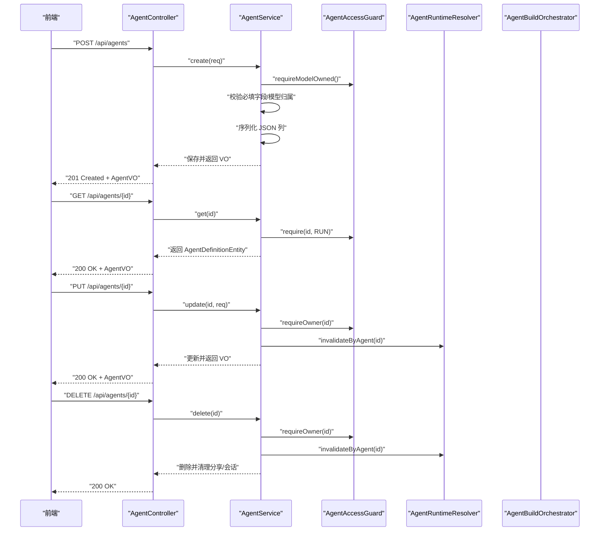
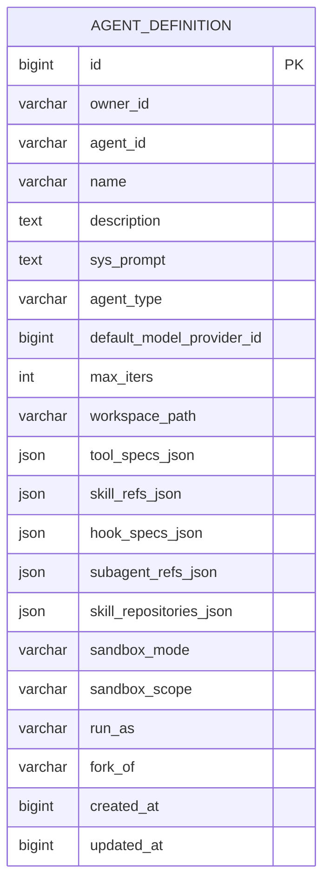
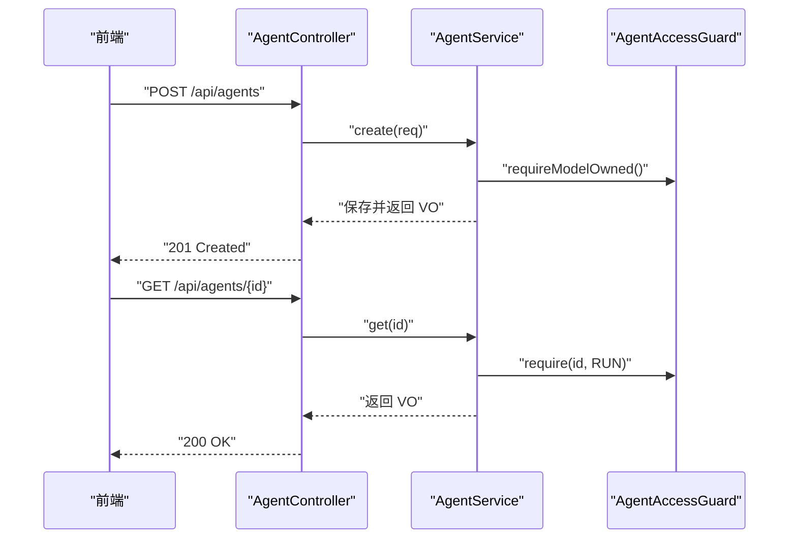
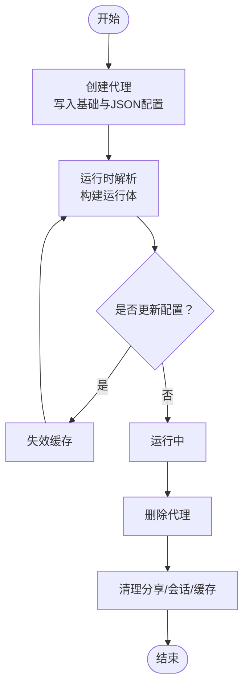
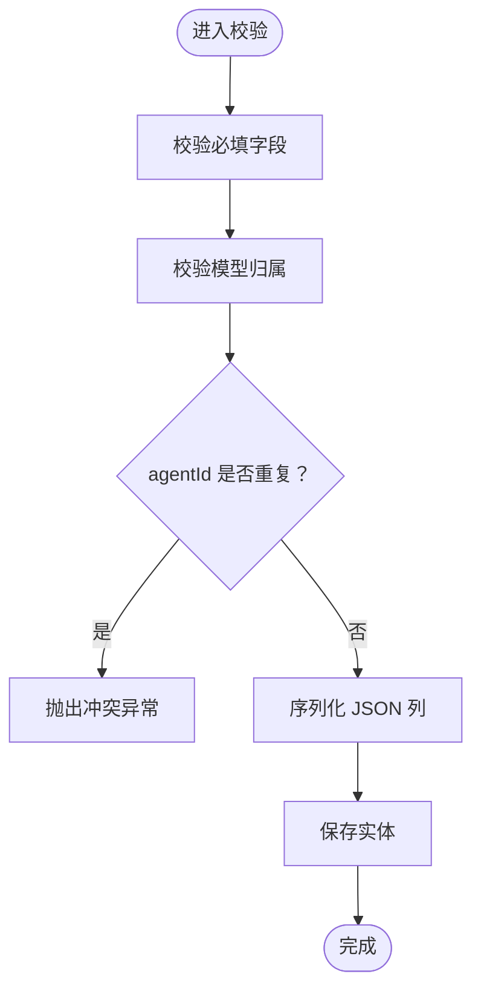
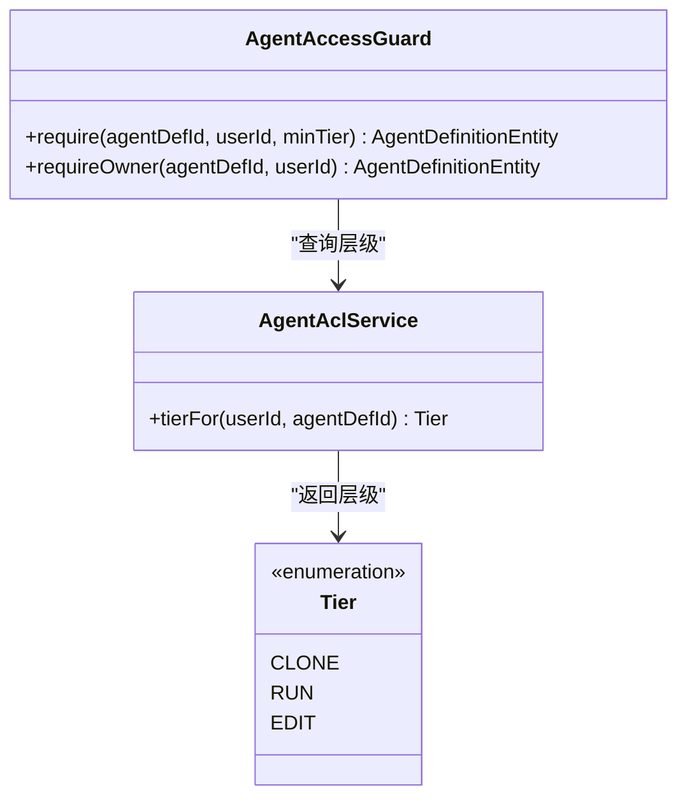
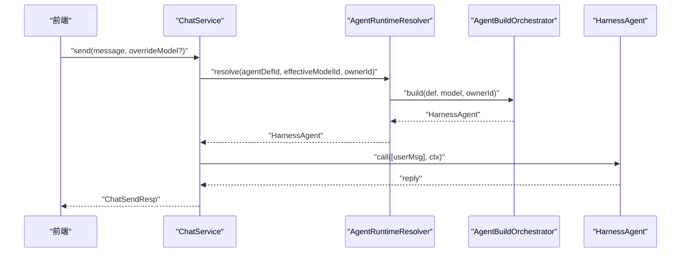
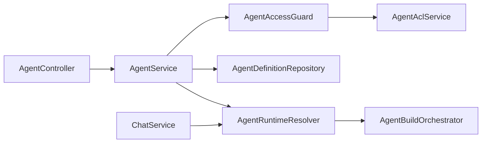

# 代理管理

<cite>
**本文档引用的文件**
- [AgentDefinitionEntity.java](file://agentscope-builder-saton/src/main/java/io/agentscope/builder/saton/agent/orm/entity/AgentDefinitionEntity.java)
- [AgentService.java](file://agentscope-builder-saton/src/main/java/io/agentscope/builder/saton/agent/service/AgentService.java)
- [AgentController.java](file://agentscope-builder-saton/src/main/java/io/agentscope/builder/saton/agent/controller/AgentController.java)
- [AgentAccessGuard.java](file://agentscope-builder-saton/src/main/java/io/agentscope/builder/saton/agent/service/AgentAccessGuard.java)
- [AgentAclService.java](file://agentscope-builder-saton/src/test/java/io/agentscope/builder/saton/agent/service/AgentAclServiceTest.java)
- [AgentDefinitionRepositoryTest.java](file://agentscope-builder-saton/src/test/java/io/agentscope/builder/saton/agent/orm/repository/AgentDefinitionRepositoryTest.java)
- [AgentBuildOrchestrator.java](file://agentscope-builder-saton/src/main/java/io/agentscope/builder/saton/agent/service/runtime/AgentBuildOrchestrator.java)
- [AgentRuntimeResolver.java](file://agentscope-builder-saton/src/main/java/io/agentscope/builder/saton/agent/service/runtime/AgentRuntimeResolver.java)
- [ChatService.java](file://agentscope-builder-saton/src/main/java/io/agentscope/builder/saton/agent/service/chat/ChatService.java)
- [AgentUpsertReq 类型定义](file://agentscope-builder-saton/frontend/src/types/index.ts)
- [AgentDefinition 接口定义（builder 前端）](file://agentscope-examples/agents/agentscope-builder/frontend/src/api/agents.ts)
- [AgentDefinition 接口定义（dataagent 前端）](file://agentscope-examples/agents/agentscope-dataagent/frontend/src/api/agents.ts)
- [AgentDefinition 接口定义（paw 前端）](file://agentscope-examples/agents/agentscope-paw/frontend/src/api/agents.ts)
- [AgentShareController.java](file://agentscope-examples/agents/agentscope-builder/src/main/java/io/agentscope/builder/web/api/AgentShareController.java)
- [AdminUserController.java](file://agentscope-examples/agents/agentscope-builder/src/main/java/io/agentscope/builder/web/api/AdminUserController.java)
- [AgentAclService.java（共享模块）](file://agentscope-examples/agents/agentscope-builder/src/main/java/io/agentscope/builder/web/share/AgentAclService.java)
- [AgentscopePermissionsEndpoint.java](file://agentscope-extensions/agentscope-spring-boot-starters/agentscope-admin-spring-boot-starter/src/main/java/io/agentscope/spring/boot/admin/endpoint/AgentscopePermissionsEndpoint.java)
</cite>

## 目录
1. [简介](#简介)
2. [项目结构](#项目结构)
3. [核心组件](#核心组件)
4. [架构总览](#架构总览)
5. [详细组件分析](#详细组件分析)
6. [依赖分析](#依赖分析)
7. [性能考虑](#性能考虑)
8. [故障排查指南](#故障排查指南)
9. [结论](#结论)
10. [附录](#附录)

## 简介
本文件系统性梳理代理管理子系统的实现，覆盖代理定义的 CRUD 操作、业务逻辑、实体模型与数据库设计、控制器 API 与请求处理、生命周期与状态控制、配置验证与序列化机制、权限控制与访问限制，并提供创建与管理的完整示例流程。

## 项目结构
代理管理位于 agentscope-builder-saton 子模块中，采用分层架构：控制器层负责对外 API；服务层封装业务规则与访问控制；持久层通过 JPA 访问数据库；运行时层负责将代理定义实例化为可执行的运行体。

图表来源
- [AgentController.java:22-117](file://agentscope-builder-saton/src/main/java/io/agentscope/builder/saton/agent/controller/AgentController.java#L22-L117)
- [AgentService.java:22-212](file://agentscope-builder-saton/src/main/java/io/agentscope/builder/saton/agent/service/AgentService.java#L22-L212)
- [AgentAccessGuard.java:14-46](file://agentscope-builder-saton/src/main/java/io/agentscope/builder/saton/agent/service/AgentAccessGuard.java#L14-L46)
- [AgentAclService.java:23-32](file://agentscope-builder-saton/src/test/java/io/agentscope/builder/saton/agent/service/AgentAclServiceTest.java#L23-L32)
- [AgentRuntimeResolver.java:43-56](file://agentscope-builder-saton/src/main/java/io/agentscope/builder/saton/agent/service/runtime/AgentRuntimeResolver.java#L43-L56)
- [AgentBuildOrchestrator.java:78-149](file://agentscope-builder-saton/src/main/java/io/agentscope/builder/saton/agent/service/runtime/AgentBuildOrchestrator.java#L78-L149)
- [ChatService.java:44-92](file://agentscope-builder-saton/src/main/java/io/agentscope/builder/saton/agent/service/chat/ChatService.java#L44-L92)

章节来源
- [AgentController.java:22-117](file://agentscope-builder-saton/src/main/java/io/agentscope/builder/saton/agent/controller/AgentController.java#L22-L117)
- [AgentService.java:22-212](file://agentscope-builder-saton/src/main/java/io/agentscope/builder/saton/agent/service/AgentService.java#L22-L212)

## 核心组件
- 代理实体与数据模型：描述代理定义的持久化结构，包含基础元信息、提示词、类型、默认模型、迭代上限、工作空间路径以及多类 JSON 配置列等。
- 业务服务：实现代理的创建、更新、删除、克隆、分享管理等核心业务逻辑，并进行参数校验与序列化。
- 访问守卫与权限服务：基于用户身份与分享记录计算访问层级（CLONE/RUN/EDIT），统一拦截越权访问。
- 运行时解析与构建：将代理定义与模型提供者绑定，解析工具、技能、中间件、子代理等配置，构建可执行的运行体。
- 控制器：暴露 REST API，处理请求、认证上下文注入与响应包装。

章节来源
- [AgentDefinitionEntity.java:10-96](file://agentscope-builder-saton/src/main/java/io/agentscope/builder/saton/agent/orm/entity/AgentDefinitionEntity.java#L10-L96)
- [AgentService.java:56-176](file://agentscope-builder-saton/src/main/java/io/agentscope/builder/saton/agent/service/AgentService.java#L56-L176)
- [AgentAccessGuard.java:29-44](file://agentscope-builder-saton/src/main/java/io/agentscope/builder/saton/agent/service/AgentAccessGuard.java#L29-L44)
- [AgentRuntimeResolver.java:43-56](file://agentscope-builder-saton/src/main/java/io/agentscope/builder/saton/agent/service/runtime/AgentRuntimeResolver.java#L43-L56)
- [AgentBuildOrchestrator.java:78-149](file://agentscope-builder-saton/src/main/java/io/agentscope/builder/saton/agent/service/runtime/AgentBuildOrchestrator.java#L78-L149)
- [AgentController.java:31-107](file://agentscope-builder-saton/src/main/java/io/agentscope/builder/saton/agent/controller/AgentController.java#L31-L107)

## 架构总览
下图展示从控制器到服务、仓储与运行时的整体交互：

图表来源
- [AgentController.java:31-107](file://agentscope-builder-saton/src/main/java/io/agentscope/builder/saton/agent/controller/AgentController.java#L31-L107)
- [AgentService.java:56-120](file://agentscope-builder-saton/src/main/java/io/agentscope/builder/saton/agent/service/AgentService.java#L56-L120)
- [AgentAccessGuard.java:29-44](file://agentscope-builder-saton/src/main/java/io/agentscope/builder/saton/agent/service/AgentAccessGuard.java#L29-L44)
- [AgentRuntimeResolver.java:43-56](file://agentscope-builder-saton/src/main/java/io/agentscope/builder/saton/agent/service/runtime/AgentRuntimeResolver.java#L43-L56)

## 详细组件分析

### 代理实体模型与数据库设计
- 实体名称：agent_definition
- 关键字段
  - 主键与业务唯一标识：id、owner_id、agent_id（联合唯一）
  - 基础信息：name、description、sys_prompt、agent_type
  - 运行参数：default_model_provider_id、max_iters、workspace_path
  - 运行配置：tool_specs_json、skill_refs_json、hook_specs_json、subagent_refs_json、skill_repositories_json
  - 运行环境：sandbox_mode、sandbox_scope、run_as、fork_of
  - 时间戳：created_at、updated_at
- 索引与约束
  - 索引：owner_id、agent_id
  - 唯一约束：owner_id + agent_id
- 设计要点
  - 多个 JSON 列用于存储复杂配置，便于扩展；不包含敏感信息，敏感凭据集中于其他资源表
  - M4 仅使用 sys_prompt、default_model_provider_id、max_iters 三字段构建 ReActAgent；后续版本再消费工具、技能、中间件、子代理等

图表来源
- [AgentDefinitionEntity.java:21-94](file://agentscope-builder-saton/src/main/java/io/agentscope/builder/saton/agent/orm/entity/AgentDefinitionEntity.java#L21-L94)

章节来源
- [AgentDefinitionEntity.java:10-96](file://agentscope-builder-saton/src/main/java/io/agentscope/builder/saton/agent/orm/entity/AgentDefinitionEntity.java#L10-L96)

### 代理控制器 API 与请求处理
- 列表与详情
  - GET /api/agents：列出当前用户可见的代理列表
  - GET /api/agents/{id}：按 ID 获取代理详情（需要 RUN 权限）
- 创建与更新
  - POST /api/agents：创建新代理（需要必填字段与模型归属校验）
  - PUT /api/agents/{id}：更新代理（需要 OWNER 权限）
- 删除
  - DELETE /api/agents/{id}：删除代理（同时清理分享与会话）
- 分享管理
  - GET /api/agents/{id}/shares：列出分享
  - POST /api/agents/{id}/shares：新增或更新分享（OWNER 权限）
  - DELETE /api/agents/{id}/shares/{shareId}：撤销分享（OWNER 权限）
- 克隆
  - POST /api/agents/{id}/clone：克隆代理（需要 CLONE 权限）

图表来源
- [AgentController.java:31-107](file://agentscope-builder-saton/src/main/java/io/agentscope/builder/saton/agent/controller/AgentController.java#L31-L107)
- [AgentService.java:56-107](file://agentscope-builder-saton/src/main/java/io/agentscope/builder/saton/agent/service/AgentService.java#L56-L107)
- [AgentAccessGuard.java:29-39](file://agentscope-builder-saton/src/main/java/io/agentscope/builder/saton/agent/service/AgentAccessGuard.java#L29-L39)

章节来源
- [AgentController.java:22-117](file://agentscope-builder-saton/src/main/java/io/agentscope/builder/saton/agent/controller/AgentController.java#L22-L117)

### 代理生命周期与状态控制
- 生命周期阶段
  - 创建：写入基础信息与 JSON 配置，生成持久化记录
  - 运行：通过运行时解析器将代理定义与模型提供者绑定，构建运行体
  - 更新：修改配置后触发缓存失效，重新构建
  - 删除：清理分享、会话与缓存
- 状态控制
  - 缓存键：以 (agentDefId, modelProviderId) 组合作为运行时缓存键
  - 失效策略：更新代理或分享变更时主动失效对应缓存项
  - 会话清理：删除代理时清理其会话数据

图表来源
- [AgentService.java:109-120](file://agentscope-builder-saton/src/main/java/io/agentscope/builder/saton/agent/service/AgentService.java#L109-L120)
- [AgentRuntimeResolver.java:43-56](file://agentscope-builder-saton/src/main/java/io/agentscope/builder/saton/agent/service/runtime/AgentRuntimeResolver.java#L43-L56)

章节来源
- [AgentService.java:109-120](file://agentscope-builder-saton/src/main/java/io/agentscope/builder/saton/agent/service/AgentService.java#L109-L120)
- [AgentRuntimeResolver.java:43-56](file://agentscope-builder-saton/src/main/java/io/agentscope/builder/saton/agent/service/runtime/AgentRuntimeResolver.java#L43-L56)

### 代理配置的验证与序列化机制
- 参数校验
  - 必填字段：agentId、defaultModelProviderId
  - 模型归属：defaultModelProviderId 必须属于当前用户
  - 重复校验：同一 owner 下 agentId 唯一
- 序列化
  - 工具规格：toolSpecs → JSON 字符串（空列表转为 null）
  - 通用列表：skillRepositories、middlewareSpecs、subagentRefs → JSON 字符串（空列表转为 null）
  - 异常处理：非法 JSON 或序列化失败抛出参数异常

图表来源
- [AgentService.java:178-190](file://agentscope-builder-saton/src/main/java/io/agentscope/builder/saton/agent/service/AgentService.java#L178-L190)
- [AgentService.java:192-210](file://agentscope-builder-saton/src/main/java/io/agentscope/builder/saton/agent/service/AgentService.java#L192-L210)

章节来源
- [AgentService.java:178-210](file://agentscope-builder-saton/src/main/java/io/agentscope/builder/saton/agent/service/AgentService.java#L178-L210)

### 权限控制与访问限制
- 访问层级（Tier）
  - CLONE：仅允许克隆
  - RUN：允许运行与聊天
  - EDIT：允许编辑与分享管理
- 权限判定
  - 代理拥有者恒为 EDIT
  - 依据分享记录匹配最高层级
  - 匿名用户不可访问全局代理（具体行为依实现而定）
- 控制器拦截
  - 列表与详情：RUN
  - 分享管理：EDIT
  - 删除：EDIT
  - 克隆：CLONE
- 运行时聊天
  - 运行聊天需 RUN 权限
  - 支持覆盖模型提供者（仍需归属校验）

图表来源
- [AgentAccessGuard.java:29-44](file://agentscope-builder-saton/src/main/java/io/agentscope/builder/saton/agent/service/AgentAccessGuard.java#L29-L44)
- [AgentAclService.java:23-32](file://agentscope-builder-saton/src/test/java/io/agentscope/builder/saton/agent/service/AgentAclServiceTest.java#L23-L32)

章节来源
- [AgentAccessGuard.java:29-44](file://agentscope-builder-saton/src/main/java/io/agentscope/builder/saton/agent/service/AgentAccessGuard.java#L29-L44)
- [AgentAclService.java:23-44](file://agentscope-builder-saton/src/test/java/io/agentscope/builder/saton/agent/service/AgentAclServiceTest.java#L23-L44)

### 代理聊天与运行时集成
- 运行时解析
  - 以 (agentDefId, modelProviderId) 为键缓存运行体
  - 未命中则构建并加入缓存
- 构建编排
  - 解析工具、技能仓库、中间件、子代理引用
  - 注册工具与技能，装配中间件，设置默认会话与工作区
- 聊天接口
  - 同步发送：返回最终回复
  - 流式发送：返回事件流（支持订阅）

图表来源
- [ChatService.java:44-64](file://agentscope-builder-saton/src/main/java/io/agentscope/builder/saton/agent/service/chat/ChatService.java#L44-L64)
- [AgentRuntimeResolver.java:43-56](file://agentscope-builder-saton/src/main/java/io/agentscope/builder/saton/agent/service/runtime/AgentRuntimeResolver.java#L43-L56)
- [AgentBuildOrchestrator.java:78-149](file://agentscope-builder-saton/src/main/java/io/agentscope/builder/saton/agent/service/runtime/AgentBuildOrchestrator.java#L78-L149)

章节来源
- [ChatService.java:44-92](file://agentscope-builder-saton/src/main/java/io/agentscope/builder/saton/agent/service/chat/ChatService.java#L44-L92)
- [AgentRuntimeResolver.java:43-56](file://agentscope-builder-saton/src/main/java/io/agentscope/builder/saton/agent/service/runtime/AgentRuntimeResolver.java#L43-L56)
- [AgentBuildOrchestrator.java:78-149](file://agentscope-builder-saton/src/main/java/io/agentscope/builder/saton/agent/service/runtime/AgentBuildOrchestrator.java#L78-L149)

### 代理 CRUD 示例（从创建到运行）
- 步骤
  1) 前端构造 AgentUpsertReq（包含 agentId、sysPrompt、agentType、defaultModelProviderId 等）
  2) 控制器接收请求并调用服务层创建
  3) 服务层进行参数校验与模型归属检查，序列化 JSON 列，保存实体
  4) 运行时解析器根据 (agentDefId, modelProviderId) 缓存运行体
  5) 聊天服务调用运行体执行推理与工具调用
- 注意事项
  - 若更新了工具/技能/中间件/子代理配置，需等待缓存失效后再次调用才会生效
  - 删除代理会清理其分享与会话

章节来源
- [AgentController.java:41-56](file://agentscope-builder-saton/src/main/java/io/agentscope/builder/saton/agent/controller/AgentController.java#L41-L56)
- [AgentService.java:56-107](file://agentscope-builder-saton/src/main/java/io/agentscope/builder/saton/agent/service/AgentService.java#L56-L107)
- [AgentRuntimeResolver.java:43-56](file://agentscope-builder-saton/src/main/java/io/agentscope/builder/saton/agent/service/runtime/AgentRuntimeResolver.java#L43-L56)
- [ChatService.java:44-64](file://agentscope-builder-saton/src/main/java/io/agentscope/builder/saton/agent/service/chat/ChatService.java#L44-L64)

## 依赖分析
- 控制器依赖服务层，服务层依赖访问守卫、权限服务、仓储与运行时解析器
- 运行时解析器依赖构建编排器，后者负责装配工具、技能、中间件与子代理
- 聊天服务依赖运行时解析器与运行体

图表来源
- [AgentController.java:27-29](file://agentscope-builder-saton/src/main/java/io/agentscope/builder/saton/agent/controller/AgentController.java#L27-L29)
- [AgentService.java:32-44](file://agentscope-builder-saton/src/main/java/io/agentscope/builder/saton/agent/service/AgentService.java#L32-L44)
- [AgentAccessGuard.java:20-23](file://agentscope-builder-saton/src/main/java/io/agentscope/builder/saton/agent/service/AgentAccessGuard.java#L20-L23)
- [AgentRuntimeResolver.java:43-56](file://agentscope-builder-saton/src/main/java/io/agentscope/builder/saton/agent/service/runtime/AgentRuntimeResolver.java#L43-L56)
- [AgentBuildOrchestrator.java:78-149](file://agentscope-builder-saton/src/main/java/io/agentscope/builder/saton/agent/service/runtime/AgentBuildOrchestrator.java#L78-L149)
- [ChatService.java:44-64](file://agentscope-builder-saton/src/main/java/io/agentscope/builder/saton/agent/service/chat/ChatService.java#L44-L64)

章节来源
- [AgentController.java:22-117](file://agentscope-builder-saton/src/main/java/io/agentscope/builder/saton/agent/controller/AgentController.java#L22-L117)
- [AgentService.java:22-212](file://agentscope-builder-saton/src/main/java/io/agentscope/builder/saton/agent/service/AgentService.java#L22-L212)

## 性能考虑
- 缓存命中率：运行时解析器以 (agentDefId, modelProviderId) 作为缓存键，避免重复构建
- 序列化成本：工具与技能等 JSON 列在创建/更新时进行序列化，建议批量提交减少 IO
- 数据库索引：对 owner_id 与 agent_id 建有索引，提升查询效率
- 流式输出：聊天接口支持事件流，降低单次响应体积与延迟

## 故障排查指南
- 参数校验失败
  - 现象：创建/更新时报参数非法
  - 排查：确认必填字段与模型归属，检查 JSON 列格式
- 权限不足
  - 现象：访问被拒绝
  - 排查：确认当前用户对代理的层级（CLONE/RUN/EDIT），检查分享记录
- 代理不存在
  - 现象：找不到代理
  - 排查：确认 agentDefId 与 owner 的关联，检查缓存是否已失效
- 运行时异常
  - 现象：构建或运行失败
  - 排查：查看工具/技能/中间件/子代理引用是否有效，确认工作区权限

章节来源
- [AgentService.java:178-210](file://agentscope-builder-saton/src/main/java/io/agentscope/builder/saton/agent/service/AgentService.java#L178-L210)
- [AgentAccessGuard.java:29-39](file://agentscope-builder-saton/src/main/java/io/agentscope/builder/saton/agent/service/AgentAccessGuard.java#L29-L39)
- [AgentRuntimeResolver.java:43-56](file://agentscope-builder-saton/src/main/java/io/agentscope/builder/saton/agent/service/runtime/AgentRuntimeResolver.java#L43-L56)

## 结论
本系统通过清晰的分层设计与严格的权限控制，实现了代理定义的全生命周期管理。实体模型支持灵活扩展，运行时解析与缓存机制保障性能，控制器 API 明确且易于集成。建议在生产环境中配合监控与日志，持续优化缓存策略与配置校验。

## 附录

### 数据模型与字段映射
- 表：agent_definition
- 字段映射参考实体类定义，涵盖基础信息、运行参数、工作空间与多类 JSON 配置列

章节来源
- [AgentDefinitionEntity.java:21-94](file://agentscope-builder-saton/src/main/java/io/agentscope/builder/saton/agent/orm/entity/AgentDefinitionEntity.java#L21-L94)

### 前端类型与接口
- builder 前端 AgentDefinition 接口
  - 字段：id、name、description、sysPrompt、maxIters、tools、scope、ownerId、createdAt、updatedAt、shares、runAs、forkOf、workspacePath、tierForCurrentUser
- dataagent 前端 AgentDefinition 接口
  - 字段：id、name、description、sysPrompt、model、maxIters、tools、toolsAllow、toolsDeny、identityName、identityEmoji、groupChatMentionPatterns、groupChatRequireMention、skillsAllow、skillsDeny、scope、ownerId、createdAt、updatedAt、shares、runAs、forkOf、workspacePath、sandboxMode、sandboxScope、tierForCurrentUser
- paw 前端 AgentDefinition 接口
  - 字段：id、name、description、sysPrompt、maxIters、tools、builtin、createdAt、updatedAt、workspacePath

章节来源
- [AgentDefinition 接口定义（builder 前端）:14-30](file://agentscope-examples/agents/agentscope-builder/frontend/src/api/agents.ts#L14-L30)
- [AgentDefinition 接口定义（dataagent 前端）:9-36](file://agentscope-examples/agents/agentscope-dataagent/frontend/src/api/agents.ts#L9-L36)
- [AgentDefinition 接口定义（paw 前端）:1-12](file://agentscope-examples/agents/agentscope-paw/frontend/src/api/agents.ts#L1-L12)

### 管理员与权限端点
- 管理员端点：/actuator/agentscope-permissions
  - 功能：列举注册的 ReActAgent 权限规则（只读）
  - 输出：包含模式与允许/拒绝/询问规则的聚合视图

章节来源
- [AgentscopePermissionsEndpoint.java:32-113](file://agentscope-extensions/agentscope-spring-boot-starters/agentscope-admin-spring-boot-starter/src/main/java/io/agentscope/spring/boot/admin/endpoint/AgentscopePermissionsEndpoint.java#L32-L113)