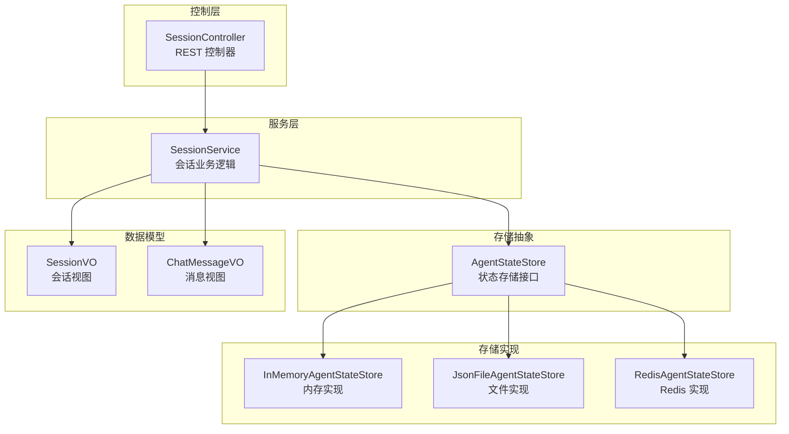
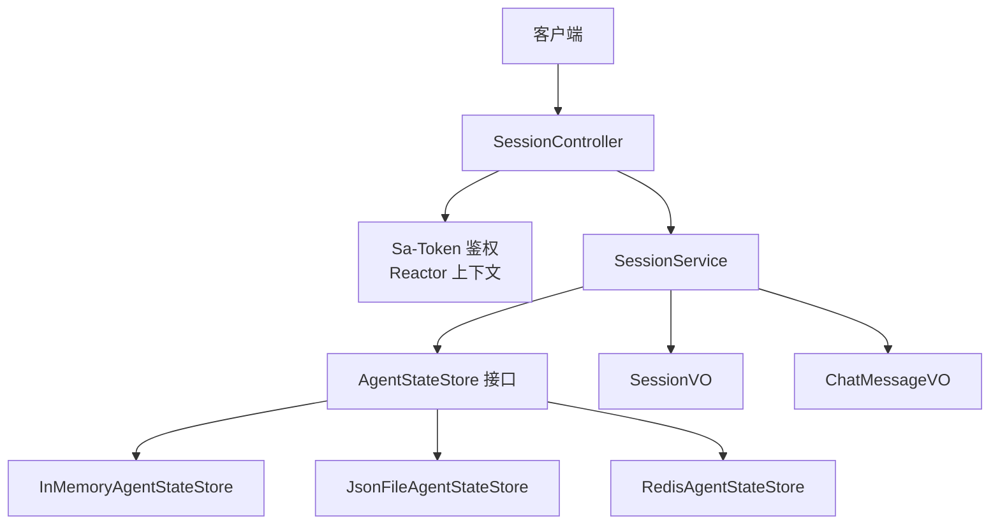
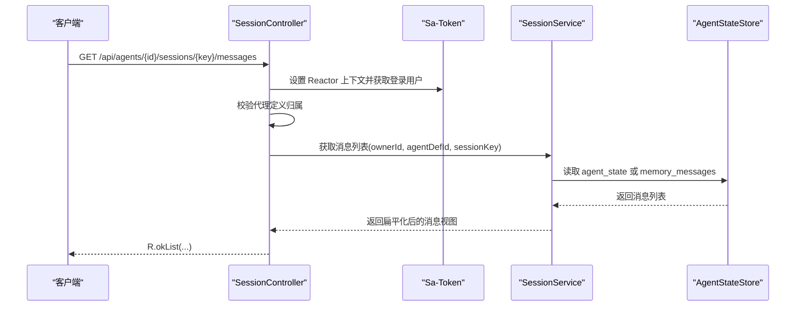
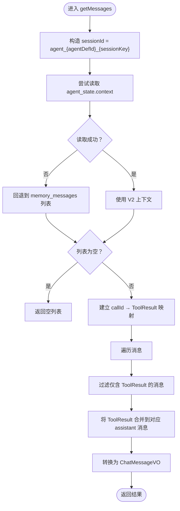
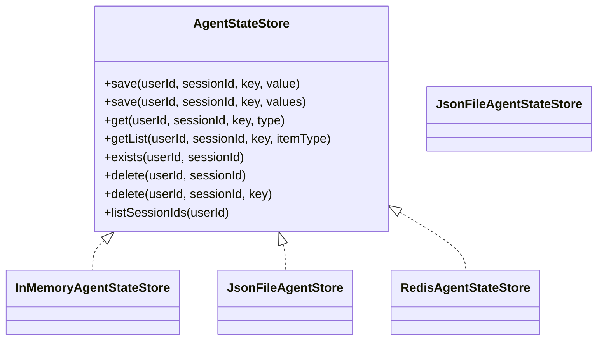
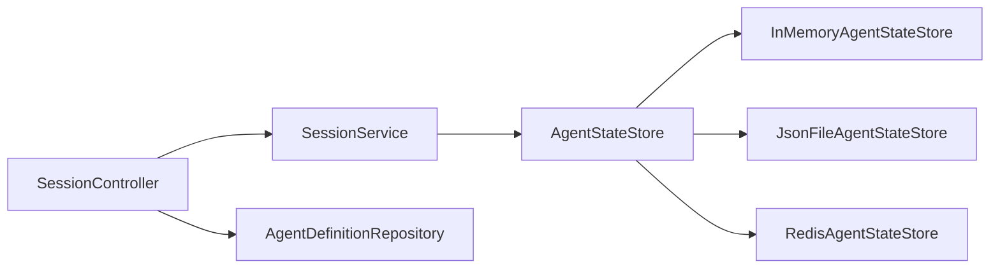

# 会话管理

<cite>
**本文引用的文件**
- [SessionController.java](file://agentscope-builder-saton/src/main/java/io/agentscope/builder/saton/session/controller/SessionController.java)
- [SessionService.java](file://agentscope-builder-saton/src/main/java/io/agentscope/builder/saton/session/service/SessionService.java)
- [SessionStoreConfig.java](file://agentscope-builder-saton/src/main/java/io/agentscope/builder/saton/session/service/SessionStoreConfig.java)
- [SessionVO.java](file://agentscope-builder-saton/src/main/java/io/agentscope/builder/saton/session/orm/dto/SessionVO.java)
- [ChatMessageVO.java](file://agentscope-builder-saton/src/main/java/io/agentscope/builder/saton/session/orm/dto/ChatMessageVO.java)
- [AgentStateStore.java](file://agentscope-core/src/main/java/io/agentscope/core/state/AgentStateStore.java)
- [InMemoryAgentStateStore.java](file://agentscope-core/src/main/java/io/agentscope/core/state/InMemoryAgentStateStore.java)
- [JsonFileAgentStateStore.java](file://agentscope-core/src/main/java/io/agentscope/core/state/JsonFileAgentStateStore.java)
- [SessionInfo.java](file://agentscope-core/src/main/java/io/agentscope/core/state/SessionInfo.java)
</cite>

## 目录
1. [引言](#引言)
2. [项目结构](#项目结构)
3. [核心组件](#核心组件)
4. [架构总览](#架构总览)
5. [详细组件分析](#详细组件分析)
6. [依赖分析](#依赖分析)
7. [性能考虑](#性能考虑)
8. [故障排查指南](#故障排查指南)
9. [结论](#结论)
10. [附录](#附录)

## 引言
本文件系统性阐述会话管理系统的实现与最佳实践，覆盖会话的创建、维护与销毁流程，会话存储配置与数据持久化策略，会话控制器的 API 实现与请求处理逻辑，会话状态管理与超时控制，会话数据的安全存储与访问控制，以及监控与调试方法。目标是帮助开发者在不同运行环境下（单机内存、文件系统、Redis 分布式）正确选择与配置会话存储后端，并高效地构建与维护会话生命周期。

## 项目结构
围绕“会话”主题的关键模块分布如下：
- 控制层：提供 REST API，负责鉴权、参数校验与响应封装
- 服务层：面向业务的会话列表、重置、消息拉取等逻辑
- 存储抽象：统一的状态存储接口，屏蔽具体后端差异
- 存储实现：内存、文件系统、Redis 等多种后端
- 数据传输对象：前后端交互的会话与消息视图

图表来源
- [SessionController.java:1-82](file://agentscope-builder-saton/src/main/java/io/agentscope/builder/saton/session/controller/SessionController.java#L1-L82)
- [SessionService.java:1-234](file://agentscope-builder-saton/src/main/java/io/agentscope/builder/saton/session/service/SessionService.java#L1-L234)
- [AgentStateStore.java:1-167](file://agentscope-core/src/main/java/io/agentscope/core/state/AgentStateStore.java#L1-L167)
- [InMemoryAgentStateStore.java:1-195](file://agentscope-core/src/main/java/io/agentscope/core/state/InMemoryAgentStateStore.java#L1-L195)
- [JsonFileAgentStateStore.java:1-397](file://agentscope-core/src/main/java/io/agentscope/core/state/JsonFileAgentStateStore.java#L1-L397)
- [SessionVO.java:1-12](file://agentscope-builder-saton/src/main/java/io/agentscope/builder/saton/session/orm/dto/SessionVO.java#L1-L12)
- [ChatMessageVO.java:1-22](file://agentscope-builder-saton/src/main/java/io/agentscope/builder/saton/session/orm/dto/ChatMessageVO.java#L1-L22)

章节来源
- [SessionController.java:1-82](file://agentscope-builder-saton/src/main/java/io/agentscope/builder/saton/session/controller/SessionController.java#L1-L82)
- [SessionService.java:1-234](file://agentscope-builder-saton/src/main/java/io/agentscope/builder/saton/session/service/SessionService.java#L1-L234)
- [AgentStateStore.java:1-167](file://agentscope-core/src/main/java/io/agentscope/core/state/AgentStateStore.java#L1-L167)

## 核心组件
- 控制器：基于 Spring WebFlux 的响应式控制器，提供会话列表、重置、消息查询等接口；集成 Sa-Token 在 Reactor 上下文中进行登录态校验与权限检查。
- 服务层：封装会话聚合逻辑，包括会话键生成规则、消息扁平化、工具调用配对、时间戳解析与标题提取等。
- 存储抽象：定义统一的保存/加载/删除/列举接口，支持单值与列表两类状态键，屏蔽后端差异。
- 存储实现：内存实现适合测试与单机场景；文件实现提供原子写入与增量追加能力；Redis 实现用于分布式部署。
- 数据模型：会话视图包含会话键、最近活跃时间与标题；消息视图包含角色、文本、时间戳与工具调用列表。

章节来源
- [SessionController.java:18-82](file://agentscope-builder-saton/src/main/java/io/agentscope/builder/saton/session/controller/SessionController.java#L18-L82)
- [SessionService.java:29-234](file://agentscope-builder-saton/src/main/java/io/agentscope/builder/saton/session/service/SessionService.java#L29-L234)
- [AgentStateStore.java:22-167](file://agentscope-core/src/main/java/io/agentscope/core/state/AgentStateStore.java#L22-L167)
- [InMemoryAgentStateStore.java:26-195](file://agentscope-core/src/main/java/io/agentscope/core/state/InMemoryAgentStateStore.java#L26-L195)
- [JsonFileAgentStateStore.java:41-397](file://agentscope-core/src/main/java/io/agentscope/core/state/JsonFileAgentStateStore.java#L41-L397)
- [SessionVO.java:3-11](file://agentscope-builder-saton/src/main/java/io/agentscope/builder/saton/session/orm/dto/SessionVO.java#L3-L11)
- [ChatMessageVO.java:5-22](file://agentscope-builder-saton/src/main/java/io/agentscope/builder/saton/session/orm/dto/ChatMessageVO.java#L5-L22)

## 架构总览
会话管理采用“控制器-服务-存储”的分层设计，通过统一的存储接口适配多种后端，确保业务逻辑与持久化细节解耦。控制器负责鉴权与请求转发，服务层负责领域逻辑与数据转换，存储层负责实际的数据落盘或远程缓存。

图表来源
- [SessionController.java:30-80](file://agentscope-builder-saton/src/main/java/io/agentscope/builder/saton/session/controller/SessionController.java#L30-L80)
- [SessionService.java:55-60](file://agentscope-builder-saton/src/main/java/io/agentscope/builder/saton/session/service/SessionService.java#L55-L60)
- [AgentStateStore.java:61-167](file://agentscope-core/src/main/java/io/agentscope/core/state/AgentStateStore.java#L61-L167)
- [SessionVO.java:3-11](file://agentscope-builder-saton/src/main/java/io/agentscope/builder/saton/session/orm/dto/SessionVO.java#L3-L11)
- [ChatMessageVO.java:5-22](file://agentscope-builder-saton/src/main/java/io/agentscope/builder/saton/session/orm/dto/ChatMessageVO.java#L5-L22)

## 详细组件分析

### 控制器：SessionController
- 路由与鉴权
  - 使用 Sa-Token 在 Reactor 上下文中设置/清理上下文，保证异步链路中的登录用户信息可用。
  - 对每个受保护接口执行“拥有者校验”，确保请求的代理定义属于当前登录用户。
- 接口职责
  - 列出会话：按代理定义 ID 返回会话列表，会话键按字典序排序。
  - 重置会话：根据会话键删除对应会话数据，返回重置结果。
  - 查询消息：按会话键返回历史消息列表，进行消息与工具调用的配对与扁平化。
- 错误处理
  - 当资源不存在或权限不足时抛出特定异常，由全局异常处理机制转化为标准响应。

图表来源
- [SessionController.java:60-74](file://agentscope-builder-saton/src/main/java/io/agentscope/builder/saton/session/controller/SessionController.java#L60-L74)
- [SessionService.java:131-189](file://agentscope-builder-saton/src/main/java/io/agentscope/builder/saton/session/service/SessionService.java#L131-L189)

章节来源
- [SessionController.java:18-82](file://agentscope-builder-saton/src/main/java/io/agentscope/builder/saton/session/controller/SessionController.java#L18-L82)

### 服务层：SessionService
- 会话键命名规范
  - 会话 ID 规则为“agent_{agentDefId}_{sessionKey}”，确保同一代理下的会话键唯一。
- 列表与标题
  - 列表接口遍历当前用户拥有的会话，筛选匹配前缀的会话，抽取第一条用户消息作为标题候选。
- 重置与清理
  - 重置接口删除指定会话；清理接口按前缀批量删除代理的所有会话。
- 消息拉取与扁平化
  - 优先从“agent_state”中读取完整上下文；若为空则回退到“memory_messages”。
  - 将工具调用与其回执按 callId 配对，生成前端友好的消息视图；过滤掉仅含回执而无文本的消息。
- 时间戳与序列化
  - 解析消息时间戳为毫秒级时间戳；工具参数序列化为字符串，失败时记录告警并返回空串。

图表来源
- [SessionService.java:131-189](file://agentscope-builder-saton/src/main/java/io/agentscope/builder/saton/session/service/SessionService.java#L131-L189)

章节来源
- [SessionService.java:29-234](file://agentscope-builder-saton/src/main/java/io/agentscope/builder/saton/session/service/SessionService.java#L29-L234)

### 存储抽象与实现
- 统一接口 AgentStateStore
  - 提供保存/加载/删除/列举等能力，支持单值与列表两类状态键；会话标识与用户标识组合形成存储槽位。
- 内存实现 InMemoryAgentStateStore
  - 以并发 Map 结构存储，线程安全；适合单机与测试环境；JVM 退出即丢失。
- 文件实现 JsonFileAgentStateStore
  - 采用 JSON/JSONL 文件布局，支持原子写入与增量追加；提供哈希校验避免重复写入；目录名安全编码。
- Redis 实现（通过配置暴露）
  - 通过 RedissonClient 构建 RedisAgentStateStore，键前缀默认使用“agentscope:session:”。

图表来源
- [AgentStateStore.java:61-167](file://agentscope-core/src/main/java/io/agentscope/core/state/AgentStateStore.java#L61-L167)
- [InMemoryAgentStateStore.java:46-195](file://agentscope-core/src/main/java/io/agentscope/core/state/InMemoryAgentStateStore.java#L46-L195)
- [JsonFileAgentStateStore.java:66-397](file://agentscope-core/src/main/java/io/agentscope/core/state/JsonFileAgentStateStore.java#L66-L397)

章节来源
- [AgentStateStore.java:22-167](file://agentscope-core/src/main/java/io/agentscope/core/state/AgentStateStore.java#L22-L167)
- [InMemoryAgentStateStore.java:26-195](file://agentscope-core/src/main/java/io/agentscope/core/state/InMemoryAgentStateStore.java#L26-L195)
- [JsonFileAgentStateStore.java:41-397](file://agentscope-core/src/main/java/io/agentscope/core/state/JsonFileAgentStateStore.java#L41-L397)
- [SessionStoreConfig.java:9-28](file://agentscope-builder-saton/src/main/java/io/agentscope/builder/saton/session/service/SessionStoreConfig.java#L9-L28)

### 数据模型
- 会话视图 SessionVO
  - 字段：会话键、最近活跃时间戳、标题文本；标题来源于第一条用户消息拼接。
- 消息视图 ChatMessageVO
  - 字段：消息 ID、角色、文本、时间戳、工具调用列表；工具调用包含名称、状态、参数与结果摘要。

章节来源
- [SessionVO.java:3-11](file://agentscope-builder-saton/src/main/java/io/agentscope/builder/saton/session/orm/dto/SessionVO.java#L3-L11)
- [ChatMessageVO.java:5-22](file://agentscope-builder-saton/src/main/java/io/agentscope/builder/saton/session/orm/dto/ChatMessageVO.java#L5-L22)

## 依赖分析
- 控制器依赖服务层与代理定义仓库，用于权限校验与资源归属判断。
- 服务层依赖存储抽象接口，不直接依赖具体后端，从而实现可插拔的存储策略。
- 存储配置通过 Spring Bean 暴露 Redis 实现，结合外部 Redisson 自动装配完成连接初始化。

图表来源
- [SessionController.java:16-28](file://agentscope-builder-saton/src/main/java/io/agentscope/builder/saton/session/controller/SessionController.java#L16-L28)
- [SessionService.java:55-60](file://agentscope-builder-saton/src/main/java/io/agentscope/builder/saton/session/service/SessionService.java#L55-L60)
- [SessionStoreConfig.java:21-26](file://agentscope-builder-saton/src/main/java/io/agentscope/builder/saton/session/service/SessionStoreConfig.java#L21-L26)

章节来源
- [SessionController.java:16-28](file://agentscope-builder-saton/src/main/java/io/agentscope/builder/saton/session/controller/SessionController.java#L16-L28)
- [SessionService.java:55-60](file://agentscope-builder-saton/src/main/java/io/agentscope/builder/saton/session/service/SessionService.java#L55-L60)
- [SessionStoreConfig.java:9-28](file://agentscope-builder-saton/src/main/java/io/agentscope/builder/saton/session/service/SessionStoreConfig.java#L9-L28)

## 性能考虑
- 存储策略选择
  - 单机/测试：内存实现具备低延迟优势，但不具备持久化能力。
  - 本地持久化：文件实现提供原子写入与增量追加，减少磁盘 IO；适合中小规模会话。
  - 分布式部署：Redis 实现具备高吞吐与共享能力，适合多实例共享会话状态。
- 列表写入优化
  - 文件实现通过哈希校验与行数对比，避免不必要的全量重写，仅在必要时追加新项。
- 响应式与异步
  - 控制器基于 WebFlux，服务层对大列表读取与转换尽量避免阻塞；Redis 后端天然异步。
- 缓存与热点
  - 对频繁访问的会话可考虑在应用层增加只读缓存，降低后端压力；注意与后端一致性策略配合。

## 故障排查指南
- 权限错误
  - 现象：接口返回资源不存在或权限不足。
  - 排查：确认登录态是否正确注入到 Reactor 上下文；核对代理定义归属校验逻辑。
- 会话不存在
  - 现象：重置或查询返回空或未命中。
  - 排查：确认会话键命名规则与前缀是否一致；检查存储后端是否存在对应键空间。
- 消息为空
  - 现象：查询消息为空列表。
  - 排查：确认是否使用了 V2 的 agent_state；若为空，检查 V1 的 memory_messages 是否存在。
- 工具调用未配对
  - 现象：前端显示“running”状态的工具调用。
  - 排查：确认 ToolResultBlock 是否存在且与 ToolUseBlock 的 id 匹配；检查消息顺序与合并逻辑。
- 文件写入失败
  - 现象：保存状态时报错。
  - 排查：检查根目录权限、磁盘空间与文件系统安全字符限制；关注原子写入临时文件是否被中断。
- Redis 连接问题
  - 现象：读写超时或连接失败。
  - 排查：确认 Redisson 自动装配配置；检查网络连通性与认证信息。

章节来源
- [SessionController.java:76-80](file://agentscope-builder-saton/src/main/java/io/agentscope/builder/saton/session/controller/SessionController.java#L76-L80)
- [SessionService.java:131-189](file://agentscope-builder-saton/src/main/java/io/agentscope/builder/saton/session/service/SessionService.java#L131-L189)
- [JsonFileAgentStateStore.java:110-133](file://agentscope-core/src/main/java/io/agentscope/core/state/JsonFileAgentStateStore.java#L110-L133)

## 结论
本会话管理体系通过清晰的分层与统一的存储接口，实现了跨后端的一致行为与灵活扩展。控制器负责鉴权与请求编排，服务层聚焦领域逻辑与数据转换，存储层提供内存、文件与 Redis 多种方案。结合合理的超时与清理策略、安全的访问控制与完善的监控手段，可在不同规模与场景下稳定运行。

## 附录
- 会话元信息模型（用于监控与运维）
  - 字段：会话 ID、大小（字节）、最后修改时间（毫秒）、状态组件数量。
  - 用途：统计会话体积、识别冷热会话、辅助容量规划与清理策略制定。

章节来源
- [SessionInfo.java:19-94](file://agentscope-core/src/main/java/io/agentscope/core/state/SessionInfo.java#L19-L94)