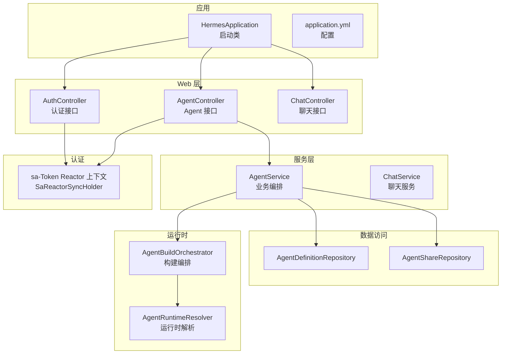
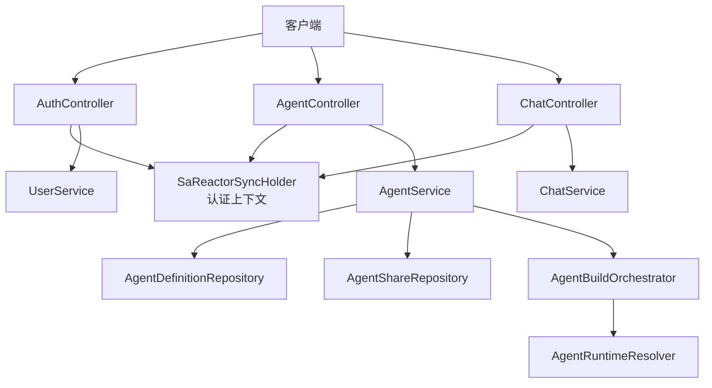
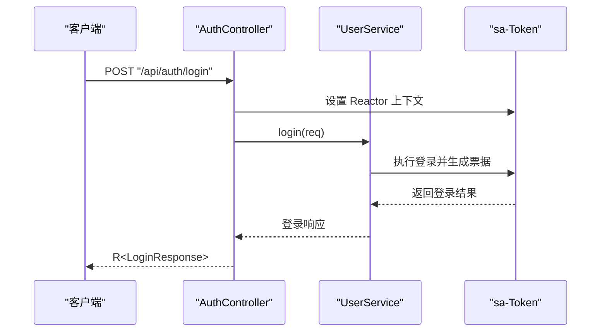
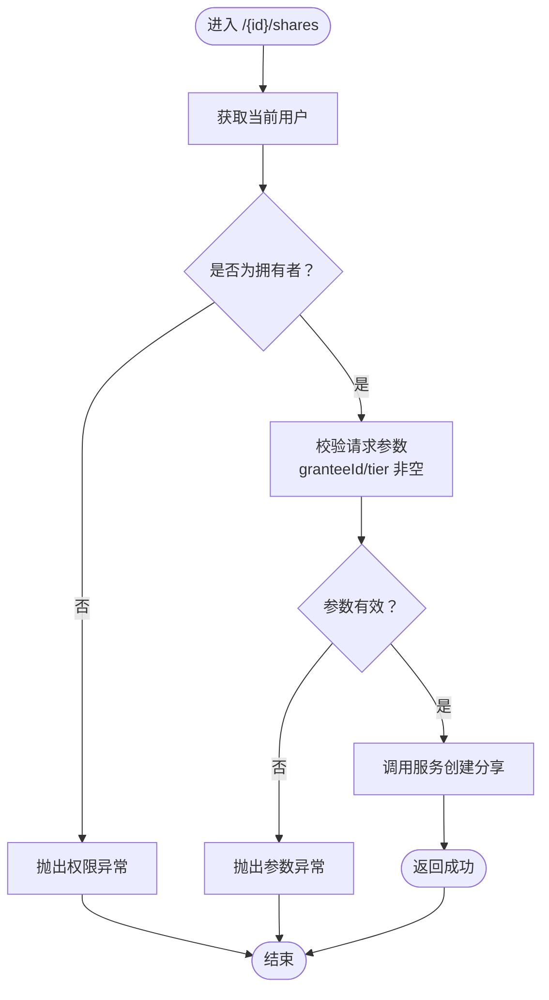
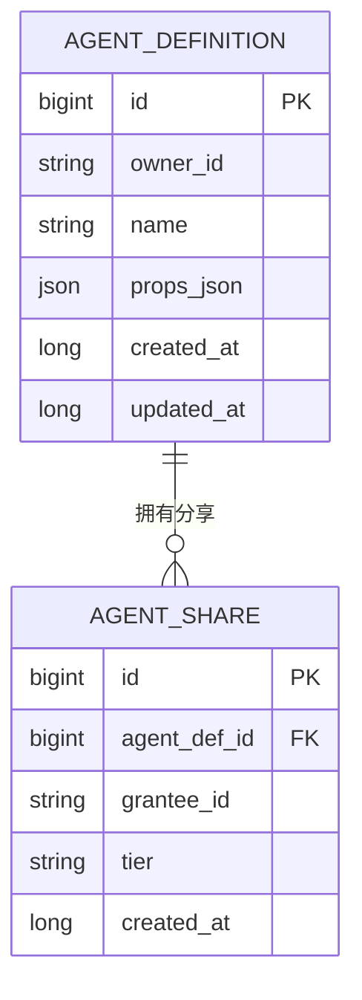
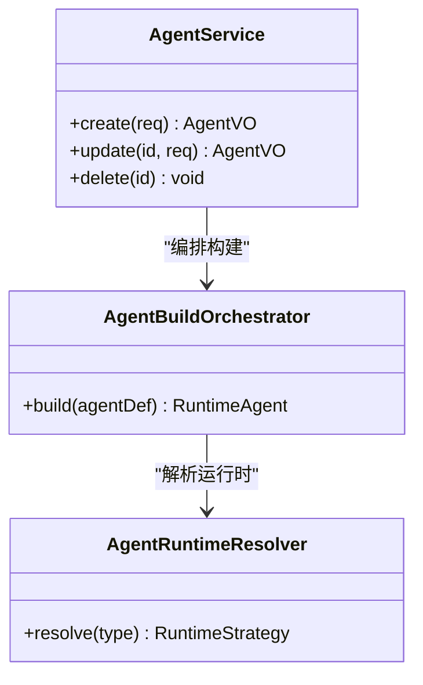
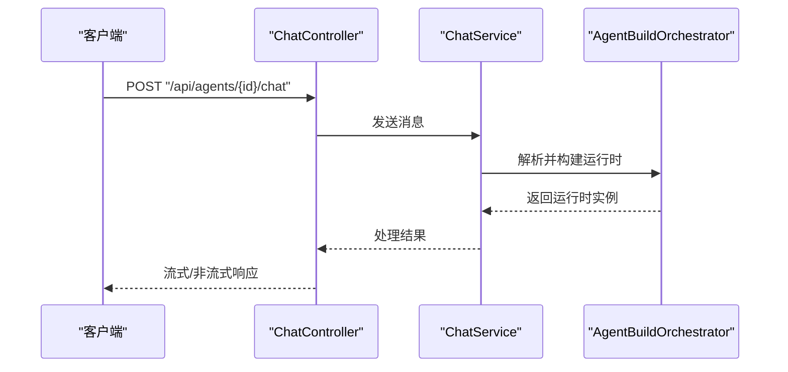
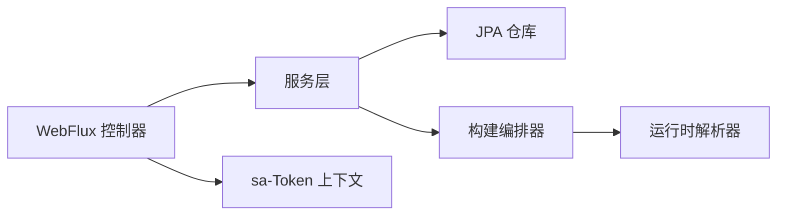

# 后端应用

<cite>
**本文引用的文件**
- [pom.xml](file://agentscope-builder-saton/pom.xml)
- [application.yml](file://agentscope-builder-saton/src/main/resources/application.yml)
- [HermesApplication.java](file://agentscope-builder-saton/src/main/java/io/agentscope/builder/saton/HermesApplication.java)
- [AuthController.java](file://agentscope-builder-saton/src/main/java/io/agentscope/builder/saton/auth/AuthController.java)
- [AgentController.java](file://agentscope-builder-saton/src/main/java/io/agentscope/builder/saton/agent/AgentController.java)
- [AgentDefinitionEntity.java](file://agentscope-builder-saton/src/main/java/io/agentscope/builder/saton/agent/AgentDefinitionEntity.java)
- [AgentDefinitionRepository.java](file://agentscope-builder-saton/src/main/java/io/agentscope/builder/saton/agent/AgentDefinitionRepository.java)
- [AgentShareEntity.java](file://agentscope-builder-saton/src/main/java/io/agentscope/builder/saton/agent/AgentShareEntity.java)
- [AgentShareRepository.java](file://agentscope-builder-saton/src/main/java/io/agentscope/builder/saton/agent/AgentShareRepository.java)
- [AgentService.java](file://agentscope-builder-saton/src/main/java/io/agentscope/builder/saton/agent/AgentService.java)
- [AgentAclService.java](file://agentscope-builder-saton/src/main/java/io/agentscope/builder/saton/agent/AgentAclService.java)
- [AgentAccessGuard.java](file://agentscope-builder-saton/src/main/java/io/agentscope/builder/saton/agent/AgentAccessGuard.java)
- [AgentBuildOrchestrator.java](file://agentscope-builder-saton/src/main/java/io/agentscope/builder/saton/agent/runtime/AgentBuildOrchestrator.java)
- [AgentRuntimeResolver.java](file://agentscope-builder-saton/src/main/java/io/agentscope/builder/saton/agent/runtime/AgentRuntimeResolver.java)
- [ChatController.java](file://agentscope-builder-saton/src/main/java/io/agentscope/builder/saton/agent/chat/ChatController.java)
- [ChatService.java](file://agentscope-builder-saton/src/main/java/io/agentscope/builder/saton/agent/chat/ChatService.java)
- [ChatSendReq.java](file://agentscope-builder-saton/src/main/java/io/agentscope/builder/saton/agent/chat/dto/ChatSendReq.java)
- [ChatSendResp.java](file://agentscope-builder-saton/src/main/java/io/agentscope/builder/saton/agent/chat/dto/ChatSendResp.java)
- [TemplateVO.java](file://agentscope-builder-saton/src/main/java/io/agentscope/builder/saton/template/dto/TemplateVO.java)
- [AgentType.java](file://agentscope-builder-saton/src/main/java/io/agentscope/builder/saton/agent/AgentType.java)
- [MiddlewareSpec.java](file://agentscope-builder-saton/src/main/java/io/agentscope/builder/saton/agent/MiddlewareSpec.java)
- [SkillRepoSpec.java](file://agentscope-builder-saton/src/main/java/io/agentscope/builder/saton/agent/SkillRepoSpec.java)
- [Tier.java](file://agentscope-builder-saton/src/main/java/io/agentscope/builder/saton/agent/Tier.java)
- [ToolSpec.java](file://agentscope-builder-saton/src/main/java/io/agentscope/builder/saton/agent/ToolSpec.java)
</cite>

## 目录
1. [引言](#引言)
2. [项目结构](#项目结构)
3. [核心组件](#核心组件)
4. [架构总览](#架构总览)
5. [详细组件分析](#详细组件分析)
6. [依赖分析](#依赖分析)
7. [性能考虑](#性能考虑)
8. [故障排查指南](#故障排查指南)
9. [结论](#结论)
10. [附录](#附录)

## 引言
本文件面向AgentScope构建器平台（后端）的技术文档，聚焦于基于 Spring Boot 4 与 WebFlux 的响应式架构、sa-Token 认证体系、REST API 设计与控制器层组织、数据库与实体模型、业务逻辑与数据访问层、API 接口说明与使用示例，以及性能优化与监控建议。文档内容严格依据仓库中现有源码与配置进行归纳总结，确保可追溯性与准确性。

## 项目结构
后端模块采用标准 Maven 多模块布局，核心应用位于 agentscope-builder-saton，入口类为应用启动类，资源配置集中在 application.yml，业务按功能域分层组织在 io.agentscope.builder.saton 下的多个子包中，包括 auth、agent、session、skill、template、workspace 等。

- 应用入口与打包
  - 启动类：HermesApplication
  - 构建与依赖管理：pom.xml
  - 配置文件：application.yml

- 响应式与认证
  - WebFlux：spring-boot-starter-webflux
  - 认证：sa-token-reactor-spring-boot4-starter

- 数据访问
  - JPA + Hibernate：spring-boot-starter-data-jpa
  - 数据库：H2（开发）+ MySQL（运行时可选）

- 核心能力
  - Agent 定义与运行时编排
  - 用户认证与会话
  - 聊天交互
  - 模板与共享权限

图表来源
- [HermesApplication.java:1-13](file://agentscope-builder-saton/src/main/java/io/agentscope/builder/saton/HermesApplication.java#L1-L13)
- [application.yml:1-40](file://agentscope-builder-saton/src/main/resources/application.yml#L1-L40)
- [AuthController.java:1-50](file://agentscope-builder-saton/src/main/java/io/agentscope/builder/saton/auth/AuthController.java#L1-L50)
- [AgentController.java:1-114](file://agentscope-builder-saton/src/main/java/io/agentscope/builder/saton/agent/AgentController.java#L1-L114)
- [ChatController.java:1-200](file://agentscope-builder-saton/src/main/java/io/agentscope/builder/saton/agent/chat/ChatController.java#L1-L200)
- [AgentService.java:1-200](file://agentscope-builder-saton/src/main/java/io/agentscope/builder/saton/agent/AgentService.java#L1-L200)
- [AgentDefinitionRepository.java:1-200](file://agentscope-builder-saton/src/main/java/io/agentscope/builder/saton/agent/AgentDefinitionRepository.java#L1-L200)
- [AgentShareRepository.java:1-200](file://agentscope-builder-saton/src/main/java/io/agentscope/builder/saton/agent/AgentShareRepository.java#L1-L200)
- [AgentBuildOrchestrator.java:1-200](file://agentscope-builder-saton/src/main/java/io/agentscope/builder/saton/agent/runtime/AgentBuildOrchestrator.java#L1-L200)
- [AgentRuntimeResolver.java:1-200](file://agentscope-builder-saton/src/main/java/io/agentscope/builder/saton/agent/runtime/AgentRuntimeResolver.java#L1-L200)

章节来源
- [pom.xml:1-147](file://agentscope-builder-saton/pom.xml#L1-L147)
- [application.yml:1-40](file://agentscope-builder-saton/src/main/resources/application.yml#L1-L40)
- [HermesApplication.java:1-13](file://agentscope-builder-saton/src/main/java/io/agentscope/builder/saton/HermesApplication.java#L1-L13)

## 核心组件
- 应用启动与配置
  - 启动类负责引导 Spring Boot 应用，绑定端口与加载配置。
  - application.yml 提供服务器端口、数据源、JPA、H2 控制台、sa-Token 参数及应用工作区根路径等配置。

- 响应式 Web 层
  - 使用 WebFlux 的 Mono/Flux 编程模型，控制器返回响应式结果，提升并发处理能力。
  - 认证上下文通过 SaReactorSyncHolder 在每个请求中设置与清理，保证 sa-Token 在 Reactor 线程安全可用。

- 数据访问层
  - JPA 实体与仓库遵循 Spring Data 约定，支持查询、分页与事务。
  - 开发默认使用 H2，生产可切换为 MySQL；DDL 自动更新以适配实体变更。

- 业务服务层
  - AgentService 负责 Agent 定义的增删改查、克隆、分享与权限校验。
  - ChatService 提供对话交互能力，结合运行时编排器执行具体 Agent 行为。

章节来源
- [application.yml:1-40](file://agentscope-builder-saton/src/main/resources/application.yml#L1-L40)
- [AuthController.java:1-50](file://agentscope-builder-saton/src/main/java/io/agentscope/builder/saton/auth/AuthController.java#L1-L50)
- [AgentController.java:1-114](file://agentscope-builder-saton/src/main/java/io/agentscope/builder/saton/agent/AgentController.java#L1-L114)
- [AgentDefinitionRepository.java:1-200](file://agentscope-builder-saton/src/main/java/io/agentscope/builder/saton/agent/AgentDefinitionRepository.java#L1-L200)
- [AgentShareRepository.java:1-200](file://agentscope-builder-saton/src/main/java/io/agentscope/builder/saton/agent/AgentShareRepository.java#L1-L200)

## 架构总览
系统采用分层架构：控制器层（WebFlux）、服务层（业务编排）、数据访问层（JPA）、运行时层（Agent 构建与解析）。认证通过 sa-Token Reactor 扩展在请求链路中注入登录身份，控制器统一通过上下文获取当前用户并进行权限校验。

图表来源
- [AuthController.java:1-50](file://agentscope-builder-saton/src/main/java/io/agentscope/builder/saton/auth/AuthController.java#L1-L50)
- [AgentController.java:1-114](file://agentscope-builder-saton/src/main/java/io/agentscope/builder/saton/agent/AgentController.java#L1-L114)
- [ChatController.java:1-200](file://agentscope-builder-saton/src/main/java/io/agentscope/builder/saton/agent/chat/ChatController.java#L1-L200)
- [AgentService.java:1-200](file://agentscope-builder-saton/src/main/java/io/agentscope/builder/saton/agent/AgentService.java#L1-L200)
- [AgentDefinitionRepository.java:1-200](file://agentscope-builder-saton/src/main/java/io/agentscope/builder/saton/agent/AgentDefinitionRepository.java#L1-L200)
- [AgentShareRepository.java:1-200](file://agentscope-builder-saton/src/main/java/io/agentscope/builder/saton/agent/AgentShareRepository.java#L1-L200)
- [AgentBuildOrchestrator.java:1-200](file://agentscope-builder-saton/src/main/java/io/agentscope/builder/saton/agent/runtime/AgentBuildOrchestrator.java#L1-L200)
- [AgentRuntimeResolver.java:1-200](file://agentscope-builder-saton/src/main/java/io/agentscope/builder/saton/agent/runtime/AgentRuntimeResolver.java#L1-L200)

## 详细组件分析

### 认证与授权（sa-Token）
- 组件职责
  - AuthController 提供登录与“当前用户”查询接口，内部通过 SaReactorSyncHolder 将 ServerWebExchange 注入到 sa-Token 上下文，确保在 Reactor 环境中正确解析登录身份。
  - 控制器方法均包裹在 inSaContext 中，保证上下文设置与清理的原子性。

- 关键流程（登录）

图表来源
- [AuthController.java:26-36](file://agentscope-builder-saton/src/main/java/io/agentscope/builder/saton/auth/AuthController.java#L26-L36)

- 配置要点
  - 令牌名称、超时时间、并发会话、跨账号共享、随机令牌风格、日志开关等均由 application.yml 中的 sa-token 节点控制。

章节来源
- [AuthController.java:1-50](file://agentscope-builder-saton/src/main/java/io/agentscope/builder/saton/auth/AuthController.java#L1-L50)
- [application.yml:26-34](file://agentscope-builder-saton/src/main/resources/application.yml#L26-L34)

### Agent 控制器与权限控制
- 接口概览
  - 列表、详情、创建、更新、删除 Agent 定义。
  - 分享管理：列出、新增、删除分享记录，并基于 Tier 进行权限分级。
  - 克隆：根据权限策略允许用户复制他人 Agent。

- 权限模型
  - AgentAccessGuard 负责校验调用者对目标 Agent 的操作权限，如 OWNER、CLONE 等。
  - 控制器在关键操作前通过 StpUtil.getLoginIdAsString 获取当前用户，并结合 Guard 进行判定。

- 关键流程（分享新增）

图表来源
- [AgentController.java:66-79](file://agentscope-builder-saton/src/main/java/io/agentscope/builder/saton/agent/AgentController.java#L66-L79)
- [AgentAccessGuard.java:1-200](file://agentscope-builder-saton/src/main/java/io/agentscope/builder/saton/agent/AgentAccessGuard.java#L1-L200)

章节来源
- [AgentController.java:1-114](file://agentscope-builder-saton/src/main/java/io/agentscope/builder/saton/agent/AgentController.java#L1-L114)
- [AgentAccessGuard.java:1-200](file://agentscope-builder-saton/src/main/java/io/agentscope/builder/saton/agent/AgentAccessGuard.java#L1-L200)
- [Tier.java:1-200](file://agentscope-builder-saton/src/main/java/io/agentscope/builder/saton/agent/Tier.java#L1-L200)

### 数据模型与实体
- Agent 定义与分享
  - AgentDefinitionEntity：存储 Agent 的元信息与配置。
  - AgentShareEntity：记录分享关系，包含被授予者与权限层级。
  - 对应仓库：AgentDefinitionRepository、AgentShareRepository。

- 运行时与中间件
  - AgentType：区分 ReAct 与 Harness 两种运行时类型。
  - MiddlewareSpec、SkillRepoSpec、ToolSpec：描述中间件、技能仓库与工具的配置规范。

图表来源
- [AgentDefinitionEntity.java:1-200](file://agentscope-builder-saton/src/main/java/io/agentscope/builder/saton/agent/AgentDefinitionEntity.java#L1-L200)
- [AgentShareEntity.java:1-200](file://agentscope-builder-saton/src/main/java/io/agentscope/builder/saton/agent/AgentShareEntity.java#L1-L200)
- [AgentDefinitionRepository.java:1-200](file://agentscope-builder-saton/src/main/java/io/agentscope/builder/saton/agent/AgentDefinitionRepository.java#L1-L200)
- [AgentShareRepository.java:1-200](file://agentscope-builder-saton/src/main/java/io/agentscope/builder/saton/agent/AgentShareRepository.java#L1-L200)

章节来源
- [AgentDefinitionEntity.java:1-200](file://agentscope-builder-saton/src/main/java/io/agentscope/builder/saton/agent/AgentDefinitionEntity.java#L1-L200)
- [AgentShareEntity.java:1-200](file://agentscope-builder-saton/src/main/java/io/agentscope/builder/saton/agent/AgentShareEntity.java#L1-L200)
- [AgentDefinitionRepository.java:1-200](file://agentscope-builder-saton/src/main/java/io/agentscope/builder/saton/agent/AgentDefinitionRepository.java#L1-L200)
- [AgentShareRepository.java:1-200](file://agentscope-builder-saton/src/main/java/io/agentscope/builder/saton/agent/AgentShareRepository.java#L1-L200)
- [AgentType.java:1-9](file://agentscope-builder-saton/src/main/java/io/agentscope/builder/saton/agent/AgentType.java#L1-L9)
- [MiddlewareSpec.java:1-200](file://agentscope-builder-saton/src/main/java/io/agentscope/builder/saton/agent/MiddlewareSpec.java#L1-L200)
- [SkillRepoSpec.java:1-200](file://agentscope-builder-saton/src/main/java/io/agentscope/builder/saton/agent/SkillRepoSpec.java#L1-L200)
- [ToolSpec.java:1-200](file://agentscope-builder-saton/src/main/java/io/agentscope/builder/saton/agent/ToolSpec.java#L1-L200)

### 运行时编排与解析
- AgentBuildOrchestrator：负责根据 Agent 定义与配置生成可运行实例，协调中间件、工具与技能仓库。
- AgentRuntimeResolver：解析运行时类型（ReAct/Harness），并选择合适的执行路径。

图表来源
- [AgentBuildOrchestrator.java:1-200](file://agentscope-builder-saton/src/main/java/io/agentscope/builder/saton/agent/runtime/AgentBuildOrchestrator.java#L1-L200)
- [AgentRuntimeResolver.java:1-200](file://agentscope-builder-saton/src/main/java/io/agentscope/builder/saton/agent/runtime/AgentRuntimeResolver.java#L1-L200)
- [AgentService.java:1-200](file://agentscope-builder-saton/src/main/java/io/agentscope/builder/saton/agent/AgentService.java#L1-L200)

章节来源
- [AgentBuildOrchestrator.java:1-200](file://agentscope-builder-saton/src/main/java/io/agentscope/builder/saton/agent/runtime/AgentBuildOrchestrator.java#L1-L200)
- [AgentRuntimeResolver.java:1-200](file://agentscope-builder-saton/src/main/java/io/agentscope/builder/saton/agent/runtime/AgentRuntimeResolver.java#L1-L200)
- [AgentService.java:1-200](file://agentscope-builder-saton/src/main/java/io/agentscope/builder/saton/agent/AgentService.java#L1-L200)

### 聊天接口与服务
- ChatController 提供发送消息接口，封装请求与响应 DTO。
- ChatService 负责将消息路由至对应 Agent 并返回流式或非流式响应。

图表来源
- [ChatController.java:1-200](file://agentscope-builder-saton/src/main/java/io/agentscope/builder/saton/agent/chat/ChatController.java#L1-L200)
- [ChatService.java:1-200](file://agentscope-builder-saton/src/main/java/io/agentscope/builder/saton/agent/chat/ChatService.java#L1-L200)
- [AgentBuildOrchestrator.java:1-200](file://agentscope-builder-saton/src/main/java/io/agentscope/builder/saton/agent/runtime/AgentBuildOrchestrator.java#L1-L200)

章节来源
- [ChatController.java:1-200](file://agentscope-builder-saton/src/main/java/io/agentscope/builder/saton/agent/chat/ChatController.java#L1-L200)
- [ChatSendReq.java:1-200](file://agentscope-builder-saton/src/main/java/io/agentscope/builder/saton/agent/chat/dto/ChatSendReq.java#L1-L200)
- [ChatSendResp.java:1-200](file://agentscope-builder-saton/src/main/java/io/agentscope/builder/saton/agent/chat/dto/ChatSendResp.java#L1-L200)
- [ChatService.java:1-200](file://agentscope-builder-saton/src/main/java/io/agentscope/builder/saton/agent/chat/ChatService.java#L1-L200)

### 模板与视图对象
- TemplateVO：用于模板展示的轻量视图对象，包含标识、名称、描述与 Agent 配置片段。

章节来源
- [TemplateVO.java:1-5](file://agentscope-builder-saton/src/main/java/io/agentscope/builder/saton/template/dto/TemplateVO.java#L1-L5)

## 依赖分析
- 技术栈
  - Spring Boot 4、WebFlux、JPA、H2/MySQL、sa-Token Reactor、BCrypt、Lombok、AgentScope 核心与 Harness。

- 依赖关系
  - 控制器依赖服务层；服务层依赖仓库与运行时编排器；运行时编排器依赖运行时解析器。
  - 认证上下文贯穿所有控制器，确保权限校验与用户识别一致。

图表来源
- [pom.xml:47-121](file://agentscope-builder-saton/pom.xml#L47-L121)
- [AgentController.java:1-114](file://agentscope-builder-saton/src/main/java/io/agentscope/builder/saton/agent/AgentController.java#L1-L114)
- [AuthController.java:1-50](file://agentscope-builder-saton/src/main/java/io/agentscope/builder/saton/auth/AuthController.java#L1-L50)

章节来源
- [pom.xml:1-147](file://agentscope-builder-saton/pom.xml#L1-L147)

## 性能考虑
- 响应式优先
  - 使用 WebFlux 的 Mono/Flux，避免阻塞式 I/O，提高吞吐与低延迟。
- 认证上下文最小化
  - 仅在必要处设置/清理 SaReactorSyncHolder，减少上下文切换开销。
- 数据访问优化
  - 合理使用 JPA 查询与投影，避免 N+1 查询；利用 H2 的自动更新策略降低迁移成本。
- 运行时编排
  - 在 AgentBuildOrchestrator 中缓存已解析的运行时策略，减少重复解析。
- 监控与可观测性
  - 建议引入 Micrometer 与 Actuator，暴露指标并结合外部监控系统进行告警与追踪。

## 故障排查指南
- 认证相关
  - 若登录后无法获取当前用户，请确认请求中是否正确设置了 sa-Token 上下文，且令牌未过期。
  - 检查 application.yml 中 sa-token 的超时与日志配置。

- 权限相关
  - 分享新增失败多因参数缺失或非拥有者操作，检查请求体与当前用户身份。
  - 克隆失败通常由权限不足导致，确认 Tier 与调用者角色。

- 数据访问相关
  - H2 控制台默认关闭，若需调试 SQL，可在 application.yml 中启用并访问 /h2-console。
  - DDL 自动更新可能导致实体字段变更不生效，必要时手动迁移或调整策略。

章节来源
- [application.yml:21-24](file://agentscope-builder-saton/src/main/resources/application.yml#L21-L24)
- [AgentController.java:66-79](file://agentscope-builder-saton/src/main/java/io/agentscope/builder/saton/agent/AgentController.java#L66-L79)

## 结论
该后端应用以 Spring Boot 4 与 WebFlux 为基础，结合 sa-Token Reactor 实现了高并发、可扩展的认证与授权机制；通过清晰的分层设计与 JPA 数据访问，支撑 Agent 定义、分享、运行时编排与聊天交互等核心能力。配合合理的性能优化与监控建议，可满足构建器平台的业务需求。

## 附录

### API 接口清单与使用示例

- 认证
  - POST /api/auth/login
    - 请求体：LoginRequest
    - 响应体：R<LoginResponse>
  - GET /api/auth/me
    - 响应体：R<MeResponse>

- Agent
  - GET /api/agents
    - 响应体：R<List<AgentVO>>
  - GET /api/agents/{id}
    - 响应体：R<AgentVO>
  - POST /api/agents
    - 请求体：AgentUpsertReq
    - 响应体：R<AgentVO>
  - PUT /api/agents/{id}
    - 请求体：AgentUpsertReq
    - 响应体：R<AgentVO>
  - DELETE /api/agents/{id}
    - 响应体：R<Void>
  - GET /api/agents/{id}/shares
    - 响应体：R<List<AgentShareVO>>
  - POST /api/agents/{id}/shares
    - 请求体：AgentShareUpsertReq
    - 响应体：R<AgentShareVO>
  - DELETE /api/agents/{id}/shares/{shareId}
    - 响应体：R<Void>
  - POST /api/agents/{id}/clone
    - 请求体：CloneReq
    - 响应体：R<AgentVO>

- 聊天
  - POST /api/agents/{id}/chat
    - 请求体：ChatSendReq
    - 响应体：ChatSendResp 或流式响应

章节来源
- [AuthController.java:26-48](file://agentscope-builder-saton/src/main/java/io/agentscope/builder/saton/auth/AuthController.java#L26-L48)
- [AgentController.java:28-104](file://agentscope-builder-saton/src/main/java/io/agentscope/builder/saton/agent/AgentController.java#L28-L104)
- [ChatController.java:1-200](file://agentscope-builder-saton/src/main/java/io/agentscope/builder/saton/agent/chat/ChatController.java#L1-L200)