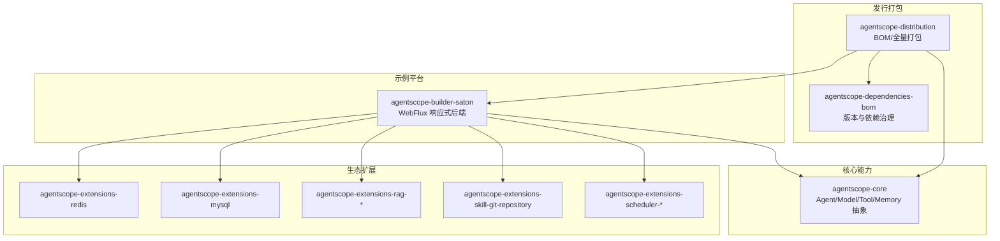
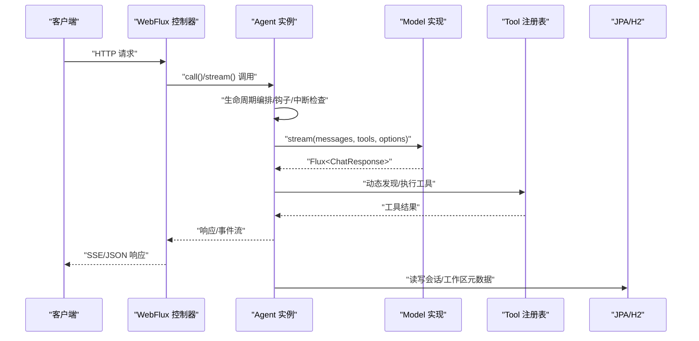
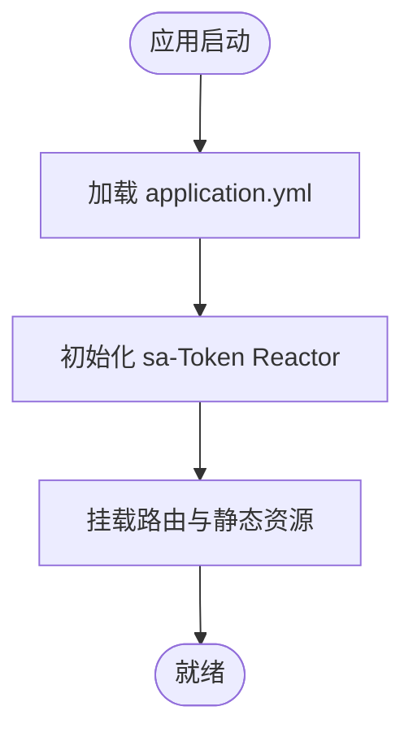
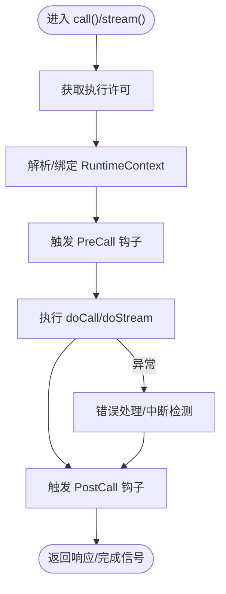
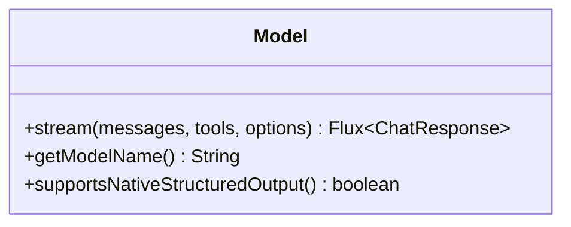
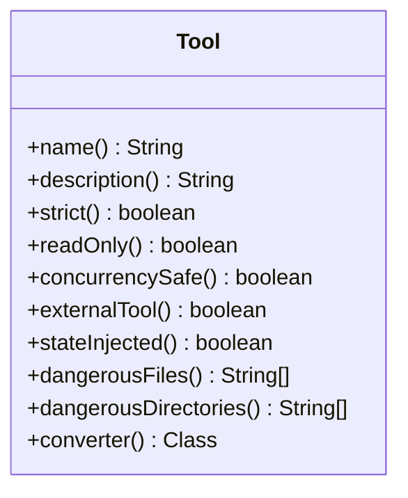
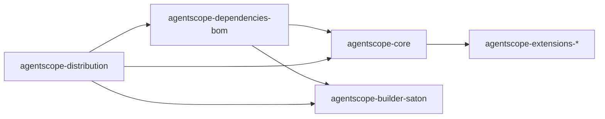

# 后端架构

<cite>
**本文引用的文件**   
- [agentscope-builder-saton/pom.xml](file://agentscope-builder-saton/pom.xml)
- [agentscope-core/pom.xml](file://agentscope-core/pom.xml)
- [agentscope-dependencies-bom/pom.xml](file://agentscope-dependencies-bom/pom.xml)
- [agentscope-distribution/pom.xml](file://agentscope-distribution/pom.xml)
- [application.yml](file://agentscope-builder-saton/src/main/resources/application.yml)
- [BuilderApp.java](file://agentscope-examples/agents/agentscope-builder/src/main/java/io/agentscope/builder/BuilderApp.java)
- [Agent.java](file://agentscope-core/src/main/java/io/agentscope/core/agent/Agent.java)
- [AgentBase.java](file://agentscope-core/src/main/java/io/agentscope/core/agent/AgentBase.java)
- [Model.java](file://agentscope-core/src/main/java/io/agentscope/core/model/Model.java)
- [Tool.java](file://agentscope-core/src/main/java/io/agentscope/core/tool/Tool.java)
- [Memory.java](file://agentscope-core/src/main/java/io/agentscope/core/memory/Memory.java)
</cite>

## 目录
1. [引言](#引言)
2. [项目结构](#项目结构)
3. [核心组件](#核心组件)
4. [架构总览](#架构总览)
5. [详细组件分析](#详细组件分析)
6. [依赖分析](#依赖分析)
7. [性能考虑](#性能考虑)
8. [故障排查指南](#故障排查指南)
9. [结论](#结论)
10. [附录](#附录)

## 引言
本文件面向后端应用架构，系统性阐述基于 Spring Boot 4 与 WebFlux 的响应式编程模型在本项目中的落地方式；同时对模块划分、依赖关系、配置结构、构建与发布策略、开发/生产差异化配置以及部署运维实践进行深入说明。目标是帮助开发者快速理解并高效扩展该多智能体构建平台的后端能力。

## 项目结构
本仓库采用多模块聚合工程组织，围绕“核心能力抽象”“示例平台”“生态扩展”“发行打包”四个维度进行分层：
- 核心模块：agentscope-core 定义 Agent、Model、Tool、Memory 等多智能体基础抽象与运行时基础设施
- 示例平台：agentscope-builder-saton 提供基于 WebFlux 的响应式后端服务入口与业务功能（认证、会话、工作区等）
- 生态扩展：agentscope-extensions-* 提供渠道、存储、调度、RAG、技能仓库等可插拔能力
- 发行打包：agentscope-distribution 聚合 bom 与全量打包，统一版本治理与发布流程

图表来源
- [agentscope-builder-saton/pom.xml:1-154](file://agentscope-builder-saton/pom.xml#L1-L154)
- [agentscope-core/pom.xml:1-263](file://agentscope-core/pom.xml#L1-L263)
- [agentscope-distribution/pom.xml:1-40](file://agentscope-distribution/pom.xml#L1-L40)
- [agentscope-dependencies-bom/pom.xml:1-639](file://agentscope-dependencies-bom/pom.xml#L1-L639)

章节来源
- [agentscope-builder-saton/pom.xml:1-154](file://agentscope-builder-saton/pom.xml#L1-L154)
- [agentscope-core/pom.xml:1-263](file://agentscope-core/pom.xml#L1-L263)
- [agentscope-distribution/pom.xml:1-40](file://agentscope-distribution/pom.xml#L1-L40)
- [agentscope-dependencies-bom/pom.xml:1-639](file://agentscope-dependencies-bom/pom.xml#L1-L639)

## 核心组件
- 响应式入口与运行时
  - 示例平台以 Spring Boot 4 + WebFlux 作为运行时，提供响应式 HTTP 处理能力，并通过 sa-Token Reactor Starter 实现认证鉴权的响应式适配
  - 入口类位于示例模块，负责启动 Spring 应用上下文
- 核心抽象
  - Agent：统一的智能体接口，融合可调用、可流式、可观察能力
  - AgentBase：抽象基类，提供钩子、中断、追踪、状态、生命周期编排等通用机制
  - Model：统一的模型接口，支持流式对话生成
  - Tool：工具注解与注册体系，支撑工具发现、参数校验与结果转换
  - Memory：记忆接口（v2 已迁移至 AgentState，保留兼容）
- 数据与持久化
  - 示例平台默认使用 H2 文件数据库，结合 JPA/Hibernate 进行实体映射与 DDL 自动更新；生产可替换为 MySQL 等关系型数据库
- 配置与安全
  - application.yml 提供服务端口、数据源、JPA、H2 控制台、sa-Token 令牌策略与应用级目录配置
  - 开发/测试默认 profile=jdbc，便于本地快速启动

章节来源
- [BuilderApp.java:1-41](file://agentscope-examples/agents/agentscope-builder/src/main/java/io/agentscope/builder/BuilderApp.java#L1-L41)
- [Agent.java:1-115](file://agentscope-core/src/main/java/io/agentscope/core/agent/Agent.java#L1-L115)
- [AgentBase.java:1-800](file://agentscope-core/src/main/java/io/agentscope/core/agent/AgentBase.java#L1-L800)
- [Model.java:1-54](file://agentscope-core/src/main/java/io/agentscope/core/model/Model.java#L1-L54)
- [Tool.java:1-194](file://agentscope-core/src/main/java/io/agentscope/core/tool/Tool.java#L1-L194)
- [Memory.java:1-79](file://agentscope-core/src/main/java/io/agentscope/core/memory/Memory.java#L1-L79)
- [application.yml:1-40](file://agentscope-builder-saton/src/main/resources/application.yml#L1-L40)

## 架构总览
下图展示从请求进入 WebFlux 到核心 Agent 执行的端到端链路，体现响应式数据流与中间件钩子的协作：

图表来源
- [AgentBase.java:190-322](file://agentscope-core/src/main/java/io/agentscope/core/agent/AgentBase.java#L190-L322)
- [Model.java:22-33](file://agentscope-core/src/main/java/io/agentscope/core/model/Model.java#L22-L33)
- [Tool.java:24-56](file://agentscope-core/src/main/java/io/agentscope/core/tool/Tool.java#L24-L56)
- [application.yml:9-23](file://agentscope-builder-saton/src/main/resources/application.yml#L9-L23)

## 详细组件分析

### 组件一：响应式 WebFlux 入口与认证
- 入口类负责启动 Spring Boot 应用，示例平台提供 API 路由与静态资源服务
- sa-Token Reactor Starter 适配 Spring Boot 4，提供响应式的令牌管理、会话共享与并发控制
- 配置要点
  - 服务端口、数据源（H2 文件库）、JPA 自动建模、H2 控制台开关
  - sa-Token 令牌名、超时、并发与日志策略
  - 应用级会话与工作区根目录

图表来源
- [BuilderApp.java:35-40](file://agentscope-examples/agents/agentscope-builder/src/main/java/io/agentscope/builder/BuilderApp.java#L35-L40)
- [application.yml:1-40](file://agentscope-builder-saton/src/main/resources/application.yml#L1-L40)

章节来源
- [BuilderApp.java:1-41](file://agentscope-examples/agents/agentscope-builder/src/main/java/io/agentscope/builder/BuilderApp.java#L1-L41)
- [application.yml:1-40](file://agentscope-builder-saton/src/main/resources/application.yml#L1-L40)

### 组件二：Agent 生命周期与钩子
- AgentBase 提供统一的生命周期编排：执行门禁、序列化门闩、预/后置钩子、错误处理、优雅停机绑定、中断处理
- 支持 per-call RuntimeContext 与 Reactor Context 传递，确保并发安全与可追踪性
- 设计要点
  - callSerializationKey 用于按会话串行化调用，避免并发写冲突
  - beforeAgentExecution/afterAgentExecution 与钩子交互，保证状态一致性
  - handleInterrupt 提供中断恢复语义，结合 GracefulShutdownManager 实现优雅停机

图表来源
- [AgentBase.java:252-322](file://agentscope-core/src/main/java/io/agentscope/core/agent/AgentBase.java#L252-L322)
- [AgentBase.java:494-502](file://agentscope-core/src/main/java/io/agentscope/core/agent/AgentBase.java#L494-L502)

章节来源
- [AgentBase.java:1-800](file://agentscope-core/src/main/java/io/agentscope/core/agent/AgentBase.java#L1-L800)

### 组件三：Model 流式推理
- Model 接口定义了统一的流式对话生成能力，内部通过格式化器将消息转为模型期望格式
- 返回类型为 Flux<ChatResponse>，契合响应式数据流，便于 SSE/Server-Sent Events 场景

图表来源
- [Model.java:1-54](file://agentscope-core/src/main/java/io/agentscope/core/model/Model.java#L1-L54)

章节来源
- [Model.java:1-54](file://agentscope-core/src/main/java/io/agentscope/core/model/Model.java#L1-L54)

### 组件四：Tool 工具体系
- Tool 注解用于声明工具方法，框架通过反射自动注册并生成 JSON Schema
- 支持严格模式、只读标记、并发安全、外部工具、状态注入、危险路径保护与自定义结果转换器

图表来源
- [Tool.java:1-194](file://agentscope-core/src/main/java/io/agentscope/core/tool/Tool.java#L1-L194)

章节来源
- [Tool.java:1-194](file://agentscope-core/src/main/java/io/agentscope/core/tool/Tool.java#L1-L194)

### 组件五：Memory 与状态迁移
- Memory 接口已标记为废弃，v2 中对话上下文迁移到 AgentState，保持向后兼容
- 新架构推荐使用 AgentState 管理会话上下文与状态持久化

章节来源
- [Memory.java:1-79](file://agentscope-core/src/main/java/io/agentscope/core/memory/Memory.java#L1-L79)

## 依赖分析
- 版本与依赖治理
  - 通过 agentscope-dependencies-bom 统一管理第三方组件版本（Jackson、Reactor、OkHttp、OpenTelemetry、Kubernetes 客户端等），确保跨模块一致性
  - Spring Boot 4 与 Spring WebFlux 作为运行时基石，sa-Token Reactor Starter 提供认证适配
- 模块间依赖
  - 示例平台依赖核心模块与扩展模块，实现“平台+能力”的解耦
  - 分发模块聚合 BOM 与全量打包，便于发布与复用

图表来源
- [agentscope-dependencies-bom/pom.xml:129-507](file://agentscope-dependencies-bom/pom.xml#L129-L507)
- [agentscope-builder-saton/pom.xml:27-128](file://agentscope-builder-saton/pom.xml#L27-L128)
- [agentscope-distribution/pom.xml:34-37](file://agentscope-distribution/pom.xml#L34-L37)

章节来源
- [agentscope-dependencies-bom/pom.xml:1-639](file://agentscope-dependencies-bom/pom.xml#L1-L639)
- [agentscope-builder-saton/pom.xml:1-154](file://agentscope-builder-saton/pom.xml#L1-L154)
- [agentscope-distribution/pom.xml:1-40](file://agentscope-distribution/pom.xml#L1-L40)

## 性能考虑
- 响应式背压与无阻塞 I/O
  - 使用 WebFlux 与 Reactor，避免线程阻塞，提升高并发下的吞吐与延迟表现
- 流式输出与 SSE
  - Model.stream 返回 Flux，结合 SSE 可实现低延迟增量推送，适合对话与工具执行过程的实时反馈
- 并发与序列化
  - 通过 callSerializationKey 对同一会话调用进行串行化，防止状态竞态；不同会话可并行执行
- 优雅停机与中断
  - 结合 GracefulShutdownManager 与中断机制，保障在关闭或用户中断时的状态一致性与资源回收

## 故障排查指南
- 启动与配置
  - 确认 application.yml 中 server.port、datasource.url、jpa.hibernate.ddl-auto 等关键项
  - 如需启用 H2 控制台，可在开发环境临时开启 console.enabled
- 认证与会话
  - sa-Token 令牌名、超时与并发策略可通过配置项调整；若出现登录失效或并发冲突，优先检查相关参数
- 数据库与迁移
  - H2 文件库位于 data/builderdb；如需切换为 MySQL，请在配置中修改 url、driver-class-name、username、password，并确保驱动可用
- 日志与追踪
  - 默认关闭 sa-Token 日志；如需调试，可临时开启日志以便定位问题
- 依赖冲突
  - 若出现版本不一致导致的类加载问题，建议统一使用 agentscope-dependencies-bom 管理版本

章节来源
- [application.yml:1-40](file://agentscope-builder-saton/src/main/resources/application.yml#L1-L40)
- [agentscope-dependencies-bom/pom.xml:62-127](file://agentscope-dependencies-bom/pom.xml#L62-L127)

## 结论
本项目以 Spring Boot 4 + WebFlux 为基础，结合 AgentScope 核心抽象与响应式数据流，构建出高并发、可扩展、可观测的多智能体构建平台后端。通过 BOM 统一版本治理、模块化拆分与清晰的生命周期编排，既满足快速迭代，又兼顾生产稳定性。建议在生产环境中优先采用 MySQL 等企业级数据库，配合完善的监控与告警体系，持续优化响应式链路与工具执行性能。

## 附录

### A. 配置文件结构与关键项说明
- 服务器与应用
  - server.port：服务监听端口
  - spring.application.name：应用名称
- 数据源与 JPA
  - spring.datasource.*：数据库连接信息（H2 文件库默认）
  - spring.jpa.*：DDL 自动建模、SQL 输出、Hibernate 格式化等
  - spring.h2.console.enabled：H2 控制台开关
- 认证与会话
  - sa-token.*：令牌名、超时、并发、共享、样式与日志
- 应用级目录
  - app.session.root：会话数据根目录
  - app.workspace.root：工作区数据根目录

章节来源
- [application.yml:1-40](file://agentscope-builder-saton/src/main/resources/application.yml#L1-L40)

### B. 开发与生产差异化配置
- 开发环境
  - 默认 profile=jdbc，使用 H2 文件库，便于本地调试
  - 可临时开启 H2 控制台，便于查看与清理数据
- 生产环境
  - 切换为 MySQL，配置连接池与高可用
  - 关闭 H2 控制台，开启更严格的日志与审计
  - 调整 sa-Token 超时与并发策略，满足业务 SLA

章节来源
- [application.yml:5-6](file://agentscope-builder-saton/src/main/resources/application.yml#L5-L6)
- [application.yml:9-23](file://agentscope-builder-saton/src/main/resources/application.yml#L9-L23)

### C. 构建与发布
- Maven 插件
  - spring-boot-maven-plugin：打包可执行 jar，支持 repackage
  - maven-surefire-plugin：JUnit 5 测试发现与执行
- 发行打包
  - agentscope-distribution 聚合 BOM 与全量模块，便于统一发布与依赖复用

章节来源
- [agentscope-builder-saton/pom.xml:130-152](file://agentscope-builder-saton/pom.xml#L130-L152)
- [agentscope-distribution/pom.xml:34-37](file://agentscope-distribution/pom.xml#L34-L37)