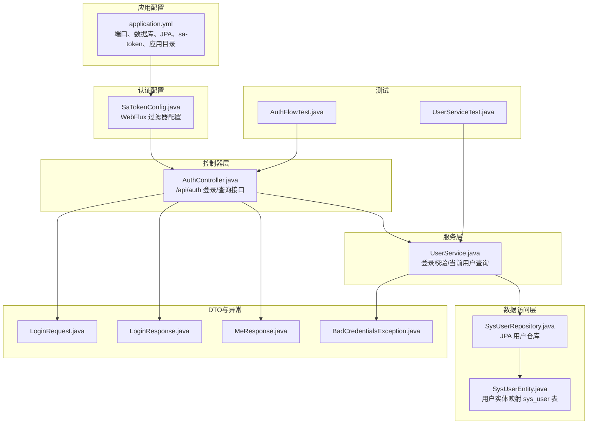
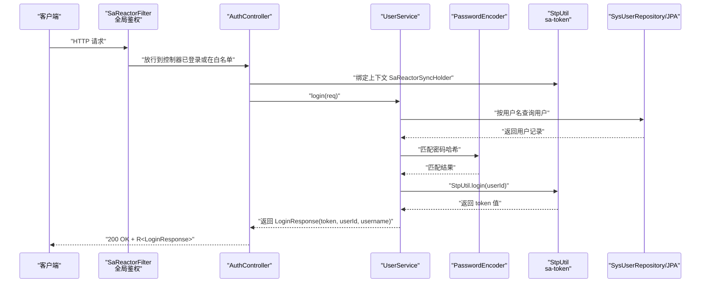
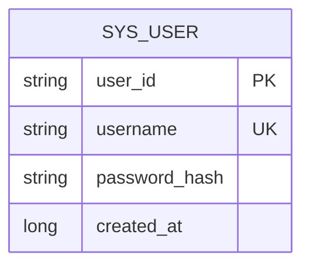
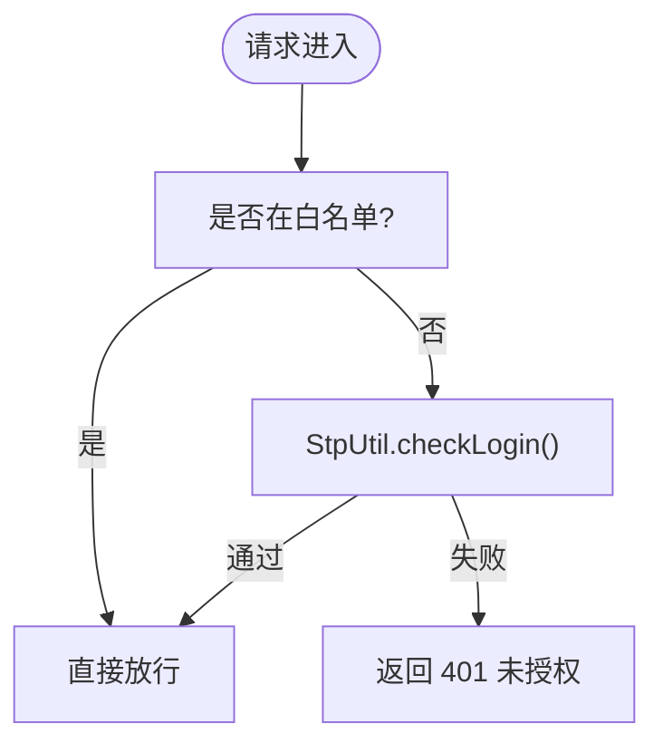
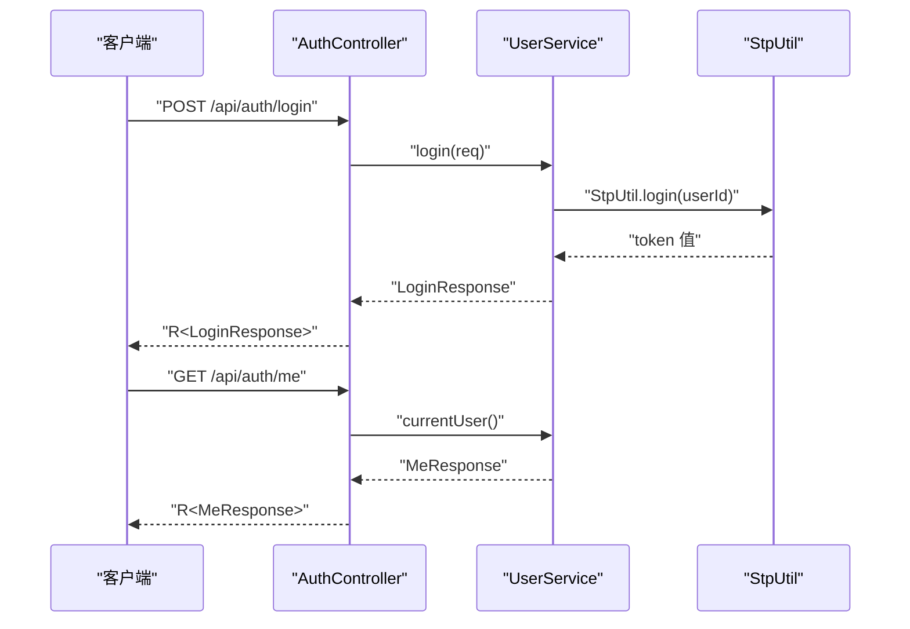
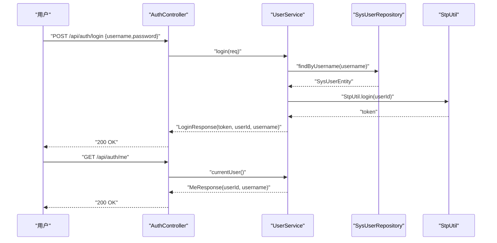
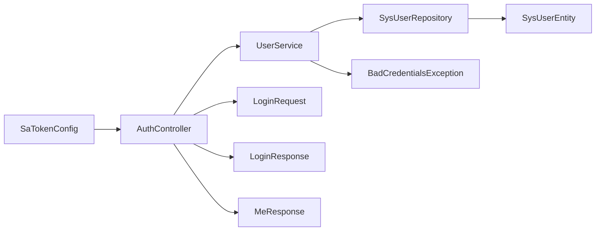

# 认证授权系统

<cite>
**本文引用的文件**
- [application.yml](file://agentscope-builder-saton/src/main/resources/application.yml)
- [SaTokenConfig.java](file://agentscope-builder-saton/src/main/java/io/agentscope/builder/saton/auth/SaTokenConfig.java)
- [AuthController.java](file://agentscope-builder-saton/src/main/java/io/agentscope/builder/saton/auth/AuthController.java)
- [UserService.java](file://agentscope-builder-saton/src/main/java/io/agentscope/builder/saton/auth/UserService.java)
- [SysUserEntity.java](file://agentscope-builder-saton/src/main/java/io/agentscope/builder/saton/auth/SysUserEntity.java)
- [SysUserRepository.java](file://agentscope-builder-saton/src/main/java/io/agentscope/builder/saton/auth/SysUserRepository.java)
- [LoginRequest.java](file://agentscope-builder-saton/src/main/java/io/agentscope/builder/saton/auth/dto/LoginRequest.java)
- [LoginResponse.java](file://agentscope-builder-saton/src/main/java/io/agentscope/builder/saton/auth/dto/LoginResponse.java)
- [MeResponse.java](file://agentscope-builder-saton/src/main/java/io/agentscope/builder/saton/auth/dto/MeResponse.java)
- [BadCredentialsException.java](file://agentscope-builder-saton/src/main/java/io/agentscope/builder/saton/auth/ex/BadCredentialsException.java)
- [AuthFlowTest.java](file://agentscope-builder-saton/src/test/java/io/agentscope/builder/saton/auth/AuthFlowTest.java)
- [UserServiceTest.java](file://agentscope-builder-saton/src/test/java/io/agentscope/builder/saton/auth/UserServiceTest.java)
- [2026-06-11-agentscope-builder-saton-design.md](file://docs/superpowers/specs/2026-06-11-agentscope-builder-saton-design.md)
- [2026-06-11-m1-bootstrap.md](file://docs/superpowers/plans/2026-06-11-m1-bootstrap.md)
- [permission-system.md](file://docs/v2/zh/docs/building-blocks/permission-system.md)
</cite>

## 目录
1. [简介](#简介)
2. [项目结构](#项目结构)
3. [核心组件](#核心组件)
4. [架构总览](#架构总览)
5. [详细组件分析](#详细组件分析)
6. [依赖关系分析](#依赖关系分析)
7. [性能考虑](#性能考虑)
8. [故障排查指南](#故障排查指南)
9. [结论](#结论)
10. [附录](#附录)

## 简介
本文件面向认证授权系统，围绕 sa-token 认证框架的集成与配置进行深入说明，涵盖用户实体模型、权限管理机制、认证控制器实现（登录、登出、用户信息查询）、token 的生成与校验、权限控制与访问规则配置、认证流程示例与安全最佳实践，以及用户密码加密与安全管理。

## 项目结构
认证授权模块位于 agentscope-builder-saton 工程中，采用 Spring Boot + Spring WebFlux + JPA 的技术栈，使用 sa-token 实现响应式过滤与会话管理，使用 Spring Security 的 PasswordEncoder 进行密码哈希比对，使用 H2 数据库存储用户数据。

图表来源
- [application.yml:1-40](file://agentscope-builder-saton/src/main/resources/application.yml#L1-L40)
- [SaTokenConfig.java:1-25](file://agentscope-builder-saton/src/main/java/io/agentscope/builder/saton/auth/SaTokenConfig.java#L1-L25)
- [AuthController.java:1-50](file://agentscope-builder-saton/src/main/java/io/agentscope/builder/saton/auth/AuthController.java#L1-L50)
- [UserService.java:1-40](file://agentscope-builder-saton/src/main/java/io/agentscope/builder/saton/auth/UserService.java#L1-L40)
- [SysUserEntity.java:1-31](file://agentscope-builder-saton/src/main/java/io/agentscope/builder/saton/auth/SysUserEntity.java#L1-L31)
- [SysUserRepository.java](file://agentscope-builder-saton/src/main/java/io/agentscope/builder/saton/auth/SysUserRepository.java)
- [LoginRequest.java](file://agentscope-builder-saton/src/main/java/io/agentscope/builder/saton/auth/dto/LoginRequest.java)
- [LoginResponse.java](file://agentscope-builder-saton/src/main/java/io/agentscope/builder/saton/auth/dto/LoginResponse.java)
- [MeResponse.java](file://agentscope-builder-saton/src/main/java/io/agentscope/builder/saton/auth/dto/MeResponse.java)
- [BadCredentialsException.java](file://agentscope-builder-saton/src/main/java/io/agentscope/builder/saton/auth/ex/BadCredentialsException.java)
- [AuthFlowTest.java:36-70](file://agentscope-builder-saton/src/test/java/io/agentscope/builder/saton/auth/AuthFlowTest.java#L36-L70)
- [UserServiceTest.java:1-35](file://agentscope-builder-saton/src/test/java/io/agentscope/builder/saton/auth/UserServiceTest.java#L1-L35)

章节来源
- [application.yml:1-40](file://agentscope-builder-saton/src/main/resources/application.yml#L1-L40)
- [SaTokenConfig.java:1-25](file://agentscope-builder-saton/src/main/java/io/agentscope/builder/saton/auth/SaTokenConfig.java#L1-L25)
- [AuthController.java:1-50](file://agentscope-builder-saton/src/main/java/io/agentscope/builder/saton/auth/AuthController.java#L1-L50)
- [UserService.java:1-40](file://agentscope-builder-saton/src/main/java/io/agentscope/builder/saton/auth/UserService.java#L1-L40)
- [SysUserEntity.java:1-31](file://agentscope-builder-saton/src/main/java/io/agentscope/builder/saton/auth/SysUserEntity.java#L1-L31)
- [SysUserRepository.java](file://agentscope-builder-saton/src/main/java/io/agentscope/builder/saton/auth/SysUserRepository.java)
- [LoginRequest.java](file://agentscope-builder-saton/src/main/java/io/agentscope/builder/saton/auth/dto/LoginRequest.java)
- [LoginResponse.java](file://agentscope-builder-saton/src/main/java/io/agentscope/builder/saton/auth/dto/LoginResponse.java)
- [MeResponse.java](file://agentscope-builder-saton/src/main/java/io/agentscope/builder/saton/auth/dto/MeResponse.java)
- [BadCredentialsException.java](file://agentscope-builder-saton/src/main/java/io/agentscope/builder/saton/auth/ex/BadCredentialsException.java)
- [AuthFlowTest.java:36-70](file://agentscope-builder-saton/src/test/java/io/agentscope/builder/saton/auth/AuthFlowTest.java#L36-L70)
- [UserServiceTest.java:1-35](file://agentscope-builder-saton/src/test/java/io/agentscope/builder/saton/auth/UserServiceTest.java#L1-L35)

## 核心组件
- 应用配置：定义服务器端口、数据库连接、JPA 自动建模策略、sa-token 参数（令牌名、超时、并发共享等），以及应用工作区根目录。
- 认证配置：注册 SaReactorFilter，设置全局拦截路径、排除路径（如登录、健康检查），并以 StpUtil.checkLogin() 作为鉴权入口。
- 控制器：暴露 /api/auth/login（POST）与 /api/auth/me（GET）两个端点，使用 ServerWebExchange 与 SaReactorSyncHolder 绑定 Reactor 上下文。
- 服务层：负责用户凭据校验、密码哈希比对、调用 StpUtil.login() 生成 token 并返回；提供 currentUser() 查询当前登录用户。
- 数据模型：SysUserEntity 映射 sys_user 表，包含用户主键、用户名、密码哈希与创建时间；SysUserRepository 提供 JPA 查询能力。
- DTO 与异常：LoginRequest/LoginResponse/MeResponse 定义请求与响应结构；BadCredentialsException 用于凭据错误场景。
- 测试：AuthFlowTest 从 HTTP 层面验证登录与查询流程；UserServiceTest 验证错误路径（用户名或密码错误）。

章节来源
- [application.yml:26-34](file://agentscope-builder-saton/src/main/resources/application.yml#L26-L34)
- [SaTokenConfig.java:12-23](file://agentscope-builder-saton/src/main/java/io/agentscope/builder/saton/auth/SaTokenConfig.java#L12-L23)
- [AuthController.java:26-48](file://agentscope-builder-saton/src/main/java/io/agentscope/builder/saton/auth/AuthController.java#L26-L48)
- [UserService.java:22-38](file://agentscope-builder-saton/src/main/java/io/agentscope/builder/saton/auth/UserService.java#L22-L38)
- [SysUserEntity.java:18-30](file://agentscope-builder-saton/src/main/java/io/agentscope/builder/saton/auth/SysUserEntity.java#L18-L30)
- [SysUserRepository.java](file://agentscope-builder-saton/src/main/java/io/agentscope/builder/saton/auth/SysUserRepository.java)
- [LoginRequest.java](file://agentscope-builder-saton/src/main/java/io/agentscope/builder/saton/auth/dto/LoginRequest.java)
- [LoginResponse.java](file://agentscope-builder-saton/src/main/java/io/agentscope/builder/saton/auth/dto/LoginResponse.java)
- [MeResponse.java](file://agentscope-builder-saton/src/main/java/io/agentscope/builder/saton/auth/dto/MeResponse.java)
- [BadCredentialsException.java](file://agentscope-builder-saton/src/main/java/io/agentscope/builder/saton/auth/ex/BadCredentialsException.java)
- [AuthFlowTest.java:36-70](file://agentscope-builder-saton/src/test/java/io/agentscope/builder/saton/auth/AuthFlowTest.java#L36-L70)
- [UserServiceTest.java:24-34](file://agentscope-builder-saton/src/test/java/io/agentscope/builder/saton/auth/UserServiceTest.java#L24-L34)

## 架构总览
认证授权系统采用分层架构：WebFlux 响应式控制器接收请求，绑定 sa-token 上下文后委派给服务层；服务层通过 JPA 仓库访问用户数据，使用 Spring Security 的 PasswordEncoder 对比密码哈希；通过 StpUtil.login() 生成 token 并返回；全局 SaReactorFilter 对除白名单外的所有路径进行登录态校验。

图表来源
- [SaTokenConfig.java:12-23](file://agentscope-builder-saton/src/main/java/io/agentscope/builder/saton/auth/SaTokenConfig.java#L12-L23)
- [AuthController.java:26-36](file://agentscope-builder-saton/src/main/java/io/agentscope/builder/saton/auth/AuthController.java#L26-L36)
- [UserService.java:22-31](file://agentscope-builder-saton/src/main/java/io/agentscope/builder/saton/auth/UserService.java#L22-L31)
- [SysUserRepository.java](file://agentscope-builder-saton/src/main/java/io/agentscope/builder/saton/auth/SysUserRepository.java)
- [application.yml:26-34](file://agentscope-builder-saton/src/main/resources/application.yml#L26-L34)

## 详细组件分析

### 用户实体模型与数据访问
- SysUserEntity 映射 sys_user 表，字段包括 user_id（主键）、username（唯一）、password_hash（存储哈希后的密码）、created_at（创建时间）。该实体由 JPA 管理，配合 SysUserRepository 提供按用户名与主键查询能力。
- application.yml 中配置了 H2 数据源与 JPA DDL 自动更新策略，确保开发阶段快速迭代。

图表来源
- [SysUserEntity.java:18-30](file://agentscope-builder-saton/src/main/java/io/agentscope/builder/saton/auth/SysUserEntity.java#L18-L30)

章节来源
- [SysUserEntity.java:1-31](file://agentscope-builder-saton/src/main/java/io/agentscope/builder/saton/auth/SysUserEntity.java#L1-L31)
- [SysUserRepository.java](file://agentscope-builder-saton/src/main/java/io/agentscope/builder/saton/auth/SysUserRepository.java)
- [application.yml:9-23](file://agentscope-builder-saton/src/main/resources/application.yml#L9-L23)

### 权限管理机制与访问规则
- 全局访问控制：SaReactorFilter 将所有路径纳入拦截范围，仅放行登录、健康检查等白名单路径；其余请求必须满足 StpUtil.checkLogin() 才能继续。
- 业务级权限：系统还提供通用的权限引擎与规则配置能力，支持在运行时通过 PermissionContextState.builder() 设置允许/拒绝/询问规则，并可描述到端点以便运维查看。

图表来源
- [SaTokenConfig.java:14-22](file://agentscope-builder-saton/src/main/java/io/agentscope/builder/saton/auth/SaTokenConfig.java#L14-L22)

章节来源
- [SaTokenConfig.java:1-25](file://agentscope-builder-saton/src/main/java/io/agentscope/builder/saton/auth/SaTokenConfig.java#L1-L25)
- [2026-06-11-agentscope-builder-saton-design.md:788-790](file://docs/superpowers/specs/2026-06-11-agentscope-builder-saton-design.md#L788-L790)
- [permission-system.md:150-179](file://docs/v2/zh/docs/building-blocks/permission-system.md#L150-L179)

### 认证控制器实现
- 登录接口：POST /api/auth/login，接收 LoginRequest，绑定 sa-token 上下文后调用 UserService.login()，成功返回 LoginResponse（包含 token、userId、username）。
- 当前用户接口：GET /api/auth/me，绑定上下文后调用 UserService.currentUser() 返回 MeResponse（userId、username）。
- 异常处理：WebFlux 过滤器抛出的未登录异常不会被 @RestControllerAdvice 捕获，需在控制器或全局异常处理中显式处理。

图表来源
- [AuthController.java:26-48](file://agentscope-builder-saton/src/main/java/io/agentscope/builder/saton/auth/AuthController.java#L26-L48)
- [UserService.java:22-38](file://agentscope-builder-saton/src/main/java/io/agentscope/builder/saton/auth/UserService.java#L22-L38)

章节来源
- [AuthController.java:1-50](file://agentscope-builder-saton/src/main/java/io/agentscope/builder/saton/auth/AuthController.java#L1-L50)
- [2026-06-11-agentscope-builder-saton-design.md:768-786](file://docs/superpowers/specs/2026-06-11-agentscope-builder-saton-design.md#L768-L786)

### token 的生成、验证与刷新
- 生成：UserService.login() 成功校验凭据后，调用 StpUtil.login(userId) 生成登录态并返回 token 值。
- 验证：全局 SaReactorFilter 对非白名单路径执行 StpUtil.checkLogin() 校验；控制器方法均通过 SaReactorSyncHolder 绑定上下文，保证在 Reactor 环境下正确解析登录态。
- 刷新：当前实现未见专用刷新接口；sa-token 配置中 timeout 设为 7 天，active-timeout 未启用，建议结合业务需求在控制器层增加 refresh 接口并设置合理的过期与续期策略。

章节来源
- [UserService.java:28-30](file://agentscope-builder-saton/src/main/java/io/agentscope/builder/saton/auth/UserService.java#L28-L30)
- [SaTokenConfig.java:22-22](file://agentscope-builder-saton/src/main/java/io/agentscope/builder/saton/auth/SaTokenConfig.java#L22-L22)
- [application.yml:28-29](file://agentscope-builder-saton/src/main/resources/application.yml#L28-L29)

### 密码加密与安全管理
- 密码哈希：UserService 使用 Spring Security 的 PasswordEncoder 对输入密码与数据库中的 password_hash 进行匹配，确保明文不落库。
- 存储模型：SysUserEntity 的 password_hash 字段存储哈希值，避免泄露原始口令。
- 安全建议：生产环境建议使用更强的散列算法与盐值策略，定期轮换密钥，限制登录尝试次数，并开启二次验证。

章节来源
- [UserService.java:25-27](file://agentscope-builder-saton/src/main/java/io/agentscope/builder/saton/auth/UserService.java#L25-L27)
- [SysUserEntity.java:25-26](file://agentscope-builder-saton/src/main/java/io/agentscope/builder/saton/auth/SysUserEntity.java#L25-L26)

### 认证流程示例
- 登录流程：客户端发送用户名/密码至 /api/auth/login，控制器绑定上下文后调用服务层登录逻辑，成功后返回 token；后续请求携带 satoken 请求头即可访问受保护资源。
- 查询当前用户：携带有效 token 请求 /api/auth/me，返回当前登录用户的标识信息。
- 未登录访问：未携带 token 或 token 失效时，全局过滤器拦截并返回 401。

图表来源
- [AuthController.java:26-48](file://agentscope-builder-saton/src/main/java/io/agentscope/builder/saton/auth/AuthController.java#L26-L48)
- [UserService.java:22-38](file://agentscope-builder-saton/src/main/java/io/agentscope/builder/saton/auth/UserService.java#L22-L38)
- [SysUserRepository.java](file://agentscope-builder-saton/src/main/java/io/agentscope/builder/saton/auth/SysUserRepository.java)
- [application.yml:27-27](file://agentscope-builder-saton/src/main/resources/application.yml#L27-L27)

## 依赖关系分析
- 控制器依赖服务层；服务层依赖仓库与密码编码器；全局过滤器依赖 sa-token 的路由与登录工具。
- 测试覆盖了控制器的端到端流程与服务层的错误路径，确保登录态与未授权场景的行为符合预期。

图表来源
- [AuthController.java:20-24](file://agentscope-builder-saton/src/main/java/io/agentscope/builder/saton/auth/AuthController.java#L20-L24)
- [UserService.java:14-20](file://agentscope-builder-saton/src/main/java/io/agentscope/builder/saton/auth/UserService.java#L14-L20)
- [SysUserRepository.java](file://agentscope-builder-saton/src/main/java/io/agentscope/builder/saton/auth/SysUserRepository.java)
- [SysUserEntity.java:1-31](file://agentscope-builder-saton/src/main/java/io/agentscope/builder/saton/auth/SysUserEntity.java#L1-L31)
- [BadCredentialsException.java](file://agentscope-builder-saton/src/main/java/io/agentscope/builder/saton/auth/ex/BadCredentialsException.java)
- [SaTokenConfig.java:1-25](file://agentscope-builder-saton/src/main/java/io/agentscope/builder/saton/auth/SaTokenConfig.java#L1-L25)

章节来源
- [AuthController.java:1-50](file://agentscope-builder-saton/src/main/java/io/agentscope/builder/saton/auth/AuthController.java#L1-L50)
- [UserService.java:1-40](file://agentscope-builder-saton/src/main/java/io/agentscope/builder/saton/auth/UserService.java#L1-L40)
- [SysUserRepository.java](file://agentscope-builder-saton/src/main/java/io/agentscope/builder/saton/auth/SysUserRepository.java)
- [SysUserEntity.java:1-31](file://agentscope-builder-saton/src/main/java/io/agentscope/builder/saton/auth/SysUserEntity.java#L1-L31)
- [BadCredentialsException.java](file://agentscope-builder-saton/src/main/java/io/agentscope/builder/saton/auth/ex/BadCredentialsException.java)
- [SaTokenConfig.java:1-25](file://agentscope-builder-saton/src/main/java/io/agentscope/builder/saton/auth/SaTokenConfig.java#L1-L25)

## 性能考虑
- Reactor 上下文绑定：控制器使用 SaReactorSyncHolder.setContext/exchange 在调用 StpUtil 同步 API 前后正确绑定/清理上下文，避免跨线程导致的上下文丢失。
- 线程模型：设计文档明确指出不要在 sa-token 上下文外使用 subscribeOn(boundedElastic())，以免破坏绑定；必要时在 Netty 线程上完成轻量操作。
- 缓存与并发：sa-token 配置开启并发共享与共享模式，有助于多实例部署下的会话一致性；可根据实际流量评估是否需要引入外部缓存。

章节来源
- [2026-06-11-agentscope-builder-saton-design.md:768-786](file://docs/superpowers/specs/2026-06-11-agentscope-builder-saton-design.md#L768-L786)
- [application.yml:30-32](file://agentscope-builder-saton/src/main/resources/application.yml#L30-L32)

## 故障排查指南
- 401 未授权：
  - 检查请求头是否携带 satoken，且 token 未过期。
  - 确认 SaReactorFilter 是否正确拦截并执行 StpUtil.checkLogin()。
- 登录失败：
  - 核对用户名是否存在与密码哈希是否匹配。
  - 单元测试 UserServiceTest 覆盖了未知用户与错误密码的异常路径。
- 过滤器异常未被 @RestControllerAdvice 捕获：
  - WebFlux 过滤器抛出的异常不会进入控制器异常处理器，需在过滤器或全局异常处理中显式处理。

章节来源
- [AuthFlowTest.java:54-69](file://agentscope-builder-saton/src/test/java/io/agentscope/builder/saton/auth/AuthFlowTest.java#L54-L69)
- [UserServiceTest.java:24-34](file://agentscope-builder-saton/src/test/java/io/agentscope/builder/saton/auth/UserServiceTest.java#L24-L34)
- [2026-06-11-agentscope-builder-saton-design.md:788-790](file://docs/superpowers/specs/2026-06-11-agentscope-builder-saton-design.md#L788-L790)

## 结论
本认证授权系统基于 sa-token 实现了响应式 WebFlux 下的统一登录态管理，结合 Spring Security 的密码哈希与 JPA 用户模型，提供了清晰的登录、查询当前用户与全局访问控制能力。通过合理的上下文绑定与过滤器配置，系统在开发与测试环境中具备良好的可用性。建议后续补充 token 刷新机制与更细粒度的权限规则配置，以满足生产环境的安全与性能要求。

## 附录
- sa-token 配置要点
  - 令牌名：satoken
  - 令牌超时：7 天
  - 并发共享：启用
  - Token 风格：随机 32 字符
- 数据库与 JPA
  - H2 文件数据库，DDL 自动更新
  - 用户表 sys_user，包含主键、用户名、密码哈希与创建时间

章节来源
- [application.yml:26-40](file://agentscope-builder-saton/src/main/resources/application.yml#L26-L40)
- [SysUserEntity.java:18-30](file://agentscope-builder-saton/src/main/java/io/agentscope/builder/saton/auth/SysUserEntity.java#L18-L30)