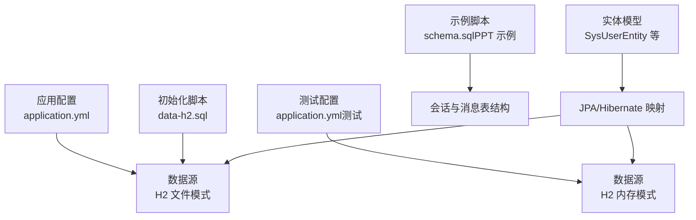
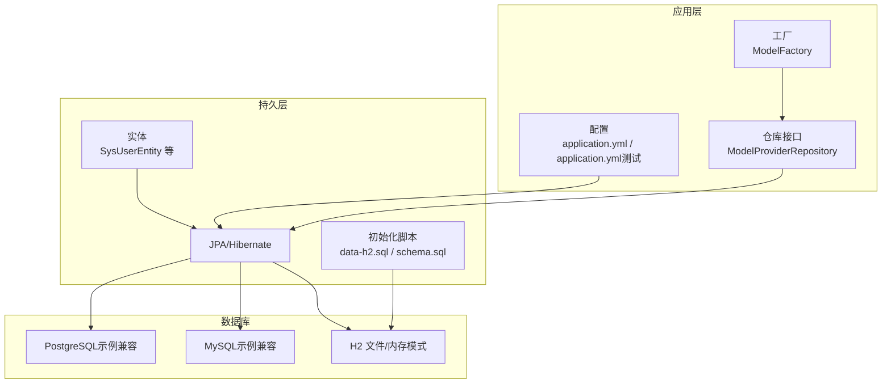
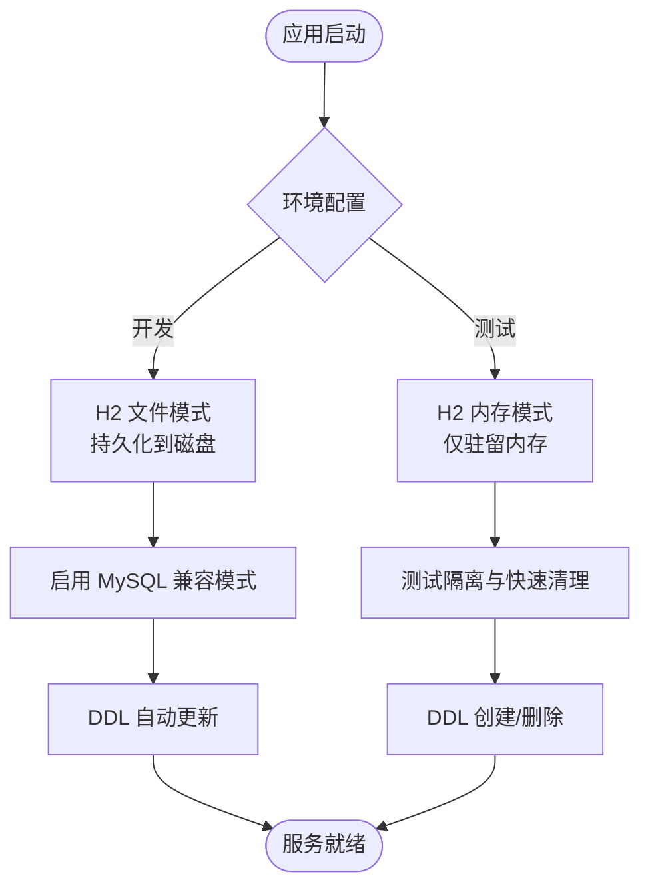
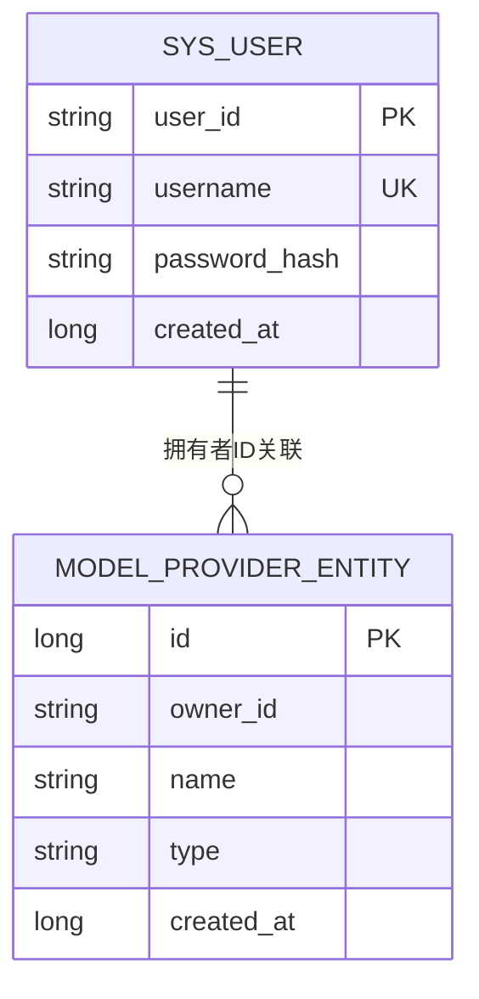
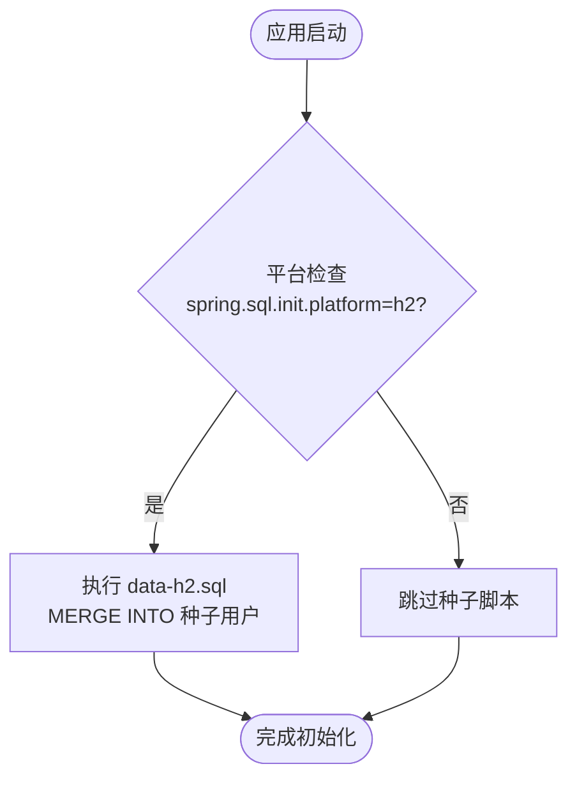
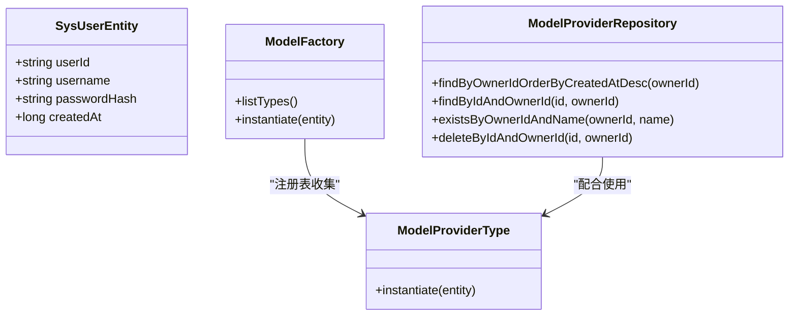
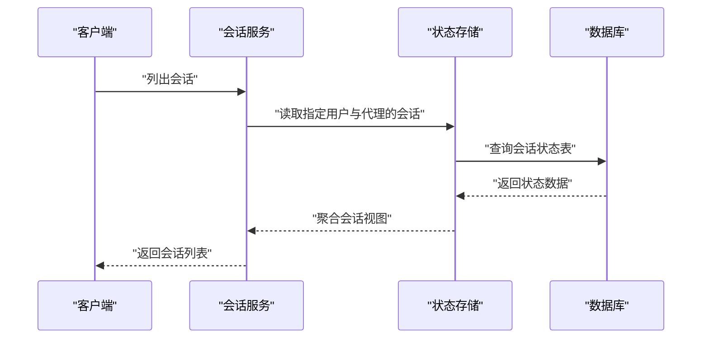
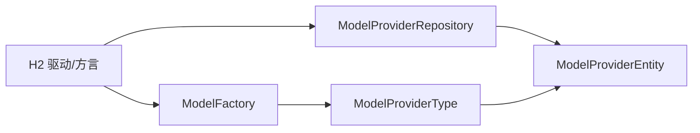

# 数据库设计

<cite>
**本文引用的文件**
- [application.yml](file://agentscope-builder-saton/src/main/resources/application.yml)
- [application.yml（测试）](file://agentscope-builder-saton/src/test/resources/application.yml)
- [data-h2.sql](file://agentscope-examples/agents/agentscope-builder/src/main/resources/data-h2.sql)
- [schema.sql（PPT 示例）](file://z_demo/ppt-agent/src/main/resources/sql/schema.sql)
- [SysUserEntity.java](file://agentscope-builder-saton/src/main/java/io/agentscope/builder/saton/auth/SysUserEntity.java)
- [ModelProviderRepository.java](file://agentscope-builder-saton/src/main/java/io/agentscope/builder/saton/resource/model/ModelProviderRepository.java)
- [ModelFactory.java](file://agentscope-builder-saton/src/main/java/io/agentscope/builder/saton/factory/model/ModelFactory.java)
- [ModelProviderType.java](file://agentscope-builder-saton/src/main/java/io/agentscope/builder/saton/factory/model/ModelProviderType.java)
- [SessionServiceTest.java](file://agentscope-builder-saton/src/test/java/io/agentscope/builder/saton/session/SessionServiceTest.java)
- [SessionFlowTest.java](file://agentscope-builder-saton/src/test/java/io/agentscope/builder/saton/session/SessionFlowTest.java)
- [MysqlSkillRepository.java](file://agentscope-extensions/agentscope-extensions-skills/agentscope-extensions-skill-mysql-repository/src/main/java/io/agentscope/core/skill/repository/mysql/MysqlSkillRepository.java)
- [PostgresSkillRepository.java](file://agentscope-extensions/agentscope-extensions-skills/agentscope-extensions-skill-postgresql-repository/src/main/java/io/agentscope/core/skill/repository/postgresql/PostgresSkillRepository.java)
</cite>

## 目录
1. [简介](#简介)
2. [项目结构](#项目结构)
3. [核心组件](#核心组件)
4. [架构总览](#架构总览)
5. [详细组件分析](#详细组件分析)
6. [依赖分析](#依赖分析)
7. [性能考虑](#性能考虑)
8. [故障排查指南](#故障排查指南)
9. [结论](#结论)
10. [附录](#附录)

## 简介
本文件面向构建器平台的数据库设计，聚焦于 H2 数据库在开发与测试环境中的配置与使用，涵盖文件模式与内存模式的差异、核心实体模型（代理定义、用户信息、会话记录等）、实体间关系与约束、数据库初始化脚本与种子数据、数据访问层与 ORM 配置、以及性能优化与索引策略。同时，结合示例工程中的 MySQL/PostgreSQL 能力，给出跨数据库兼容与演进建议。

## 项目结构
- 构建器平台采用 Spring Boot + JPA/Hibernate + H2 的默认配置，生产或集成测试场景可通过 Spring Profile 切换至其他数据库。
- 开发环境默认使用 H2 文件模式存储于本地目录，便于快速迭代与离线调试；测试环境使用 H2 内存模式，确保隔离与速度。
- 示例工程包含独立的数据库初始化脚本，用于演示会话状态持久化与聊天表结构，可作为理解会话与消息模型的参考。

图表来源
- [application.yml:1-40](file://agentscope-builder-saton/src/main/resources/application.yml#L1-L40)
- [application.yml（测试）:1-22](file://agentscope-builder-saton/src/test/resources/application.yml#L1-L22)
- [data-h2.sql:1-34](file://agentscope-examples/agents/agentscope-builder/src/main/resources/data-h2.sql#L1-L34)
- [schema.sql（PPT 示例）:1-76](file://z_demo/ppt-agent/src/main/resources/sql/schema.sql#L1-L76)
- [SysUserEntity.java:1-30](file://agentscope-builder-saton/src/main/java/io/agentscope/builder/saton/auth/SysUserEntity.java#L1-L30)

章节来源
- [application.yml:1-40](file://agentscope-builder-saton/src/main/resources/application.yml#L1-L40)
- [application.yml（测试）:1-22](file://agentscope-builder-saton/src/test/resources/application.yml#L1-L22)

## 核心组件
- 数据库与连接配置
  - 开发环境：H2 文件模式，URL 指向本地数据目录，启用 MySQL 兼容模式，DDL 自动更新。
  - 测试环境：H2 内存模式，自动建表与删除，适合单元测试与集成测试。
- 初始化与种子
  - H2 种子脚本提供演示账户，通过 MERGE INTO 实现幂等插入。
  - 示例工程的 schema.sql 展示了会话状态表与聊天表的结构设计。
- 实体模型
  - 用户实体：sys_user，包含用户标识、用户名、密码哈希与创建时间等字段。
  - 模型提供者实体与仓库：支持按拥有者维度查询、校验名称唯一性、按 ID+拥有者删除。
  - 工厂与类型抽象：将数据库行实例化为运行时可用的模型对象。
- 数据访问层与 ORM
  - 使用 Spring Data JPA 与 Hibernate，通过注解映射实体与表，结合方言与 DDL 策略控制数据库行为。

章节来源
- [application.yml:9-23](file://agentscope-builder-saton/src/main/resources/application.yml#L9-L23)
- [application.yml（测试）:2-13](file://agentscope-builder-saton/src/test/resources/application.yml#L2-L13)
- [data-h2.sql:31-33](file://agentscope-examples/agents/agentscope-builder/src/main/resources/data-h2.sql#L31-L33)
- [SysUserEntity.java:11-30](file://agentscope-builder-saton/src/main/java/io/agentscope/builder/saton/auth/SysUserEntity.java#L11-L30)
- [ModelProviderRepository.java:1-17](file://agentscope-builder-saton/src/main/java/io/agentscope/builder/saton/resource/model/ModelProviderRepository.java#L1-L17)
- [ModelFactory.java:1-42](file://agentscope-builder-saton/src/main/java/io/agentscope/builder/saton/factory/model/ModelFactory.java#L1-L42)
- [ModelProviderType.java:1-28](file://agentscope-builder-saton/src/main/java/io/agentscope/builder/saton/factory/model/ModelProviderType.java#L1-L28)

## 架构总览
下图展示了数据库层在系统中的位置与交互：应用配置驱动数据源，实体通过 JPA 映射到表，初始化脚本在特定条件下执行，工厂与仓库负责业务与数据访问。

图表来源
- [application.yml:4-23](file://agentscope-builder-saton/src/main/resources/application.yml#L4-L23)
- [application.yml（测试）:1-13](file://agentscope-builder-saton/src/test/resources/application.yml#L1-L13)
- [data-h2.sql:1-34](file://agentscope-examples/agents/agentscope-builder/src/main/resources/data-h2.sql#L1-L34)
- [schema.sql（PPT 示例）:1-76](file://z_demo/ppt-agent/src/main/resources/sql/schema.sql#L1-L76)
- [SysUserEntity.java:11-30](file://agentscope-builder-saton/src/main/java/io/agentscope/builder/saton/auth/SysUserEntity.java#L11-L30)
- [ModelProviderRepository.java:1-17](file://agentscope-builder-saton/src/main/java/io/agentscope/builder/saton/resource/model/ModelProviderRepository.java#L1-L17)
- [ModelFactory.java:19-42](file://agentscope-builder-saton/src/main/java/io/agentscope/builder/saton/factory/model/ModelFactory.java#L19-L42)

## 详细组件分析

### H2 配置与文件模式 vs 内存模式
- 文件模式（开发）
  - URL 使用文件路径，数据持久化到磁盘，适合本地开发与调试。
  - 启用 MySQL 兼容模式，减少方言差异带来的迁移成本。
  - DDL 策略为自动更新，便于快速迭代。
- 内存模式（测试）
  - URL 使用内存数据库，速度快且完全隔离，适合单元测试与集成测试。
  - DDL 策略为创建/删除，确保每次测试前后环境一致。

图表来源
- [application.yml:9-23](file://agentscope-builder-saton/src/main/resources/application.yml#L9-L23)
- [application.yml（测试）:2-13](file://agentscope-builder-saton/src/test/resources/application.yml#L2-L13)

章节来源
- [application.yml:9-23](file://agentscope-builder-saton/src/main/resources/application.yml#L9-L23)
- [application.yml（测试）:2-13](file://agentscope-builder-saton/src/test/resources/application.yml#L2-L13)

### 核心实体模型与关系
- 用户实体（sys_user）
  - 主键：user_id（字符串）
  - 唯一约束：username
  - 字段：用户名、密码哈希、创建时间
- 模型提供者实体与仓库
  - 仓库接口提供按拥有者查询、按拥有者与名称唯一性校验、按拥有者删除等方法。
  - 工厂负责将数据库行转换为运行时可用的模型对象。
- 关系与约束
  - 用户与模型提供者之间通过拥有者 ID 进行逻辑关联（字符串标识），无外键约束，保持灵活性。
  - 实体通过 JPA 注解映射到表，遵循命名约定与字段长度限制。

图表来源
- [SysUserEntity.java:11-30](file://agentscope-builder-saton/src/main/java/io/agentscope/builder/saton/auth/SysUserEntity.java#L11-L30)
- [ModelProviderRepository.java:1-17](file://agentscope-builder-saton/src/main/java/io/agentscope/builder/saton/resource/model/ModelProviderRepository.java#L1-L17)
- [ModelFactory.java:19-42](file://agentscope-builder-saton/src/main/java/io/agentscope/builder/saton/factory/model/ModelFactory.java#L19-L42)

章节来源
- [SysUserEntity.java:11-30](file://agentscope-builder-saton/src/main/java/io/agentscope/builder/saton/auth/SysUserEntity.java#L11-L30)
- [ModelProviderRepository.java:1-17](file://agentscope-builder-saton/src/main/java/io/agentscope/builder/saton/resource/model/ModelProviderRepository.java#L1-L17)
- [ModelFactory.java:19-42](file://agentscope-builder-saton/src/main/java/io/agentscope/builder/saton/factory/model/ModelFactory.java#L19-L42)

### 数据库初始化脚本与种子数据
- H2 种子脚本
  - 提供两个演示账户，密码为 BCrypt 哈希，使用 MERGE INTO 实现幂等插入，避免重复启动失败。
  - 仅在 H2 平台与特定配置下执行，确保与嵌入式 H2 的兼容性。
- 示例工程 schema.sql
  - 定义用户表、会话状态表与聊天表，包含索引与注释，展示会话键、状态键与消息树形结构的设计思路。
  - 会话状态表采用复合主键，支持 JSON 序列化状态数据的高效检索与更新。

图表来源
- [data-h2.sql:1-34](file://agentscope-examples/agents/agentscope-builder/src/main/resources/data-h2.sql#L1-L34)
- [application.yml:1-40](file://agentscope-builder-saton/src/main/resources/application.yml#L1-L40)

章节来源
- [data-h2.sql:1-34](file://agentscope-examples/agents/agentscope-builder/src/main/resources/data-h2.sql#L1-L34)
- [schema.sql（PPT 示例）:6-76](file://z_demo/ppt-agent/src/main/resources/sql/schema.sql#L6-L76)

### 数据访问层与 ORM 配置
- JPA/Hibernate
  - DDL 策略为自动更新（开发）或创建/删除（测试），以适配不同阶段的需求。
  - SQL 输出格式化开启，便于调试与审计。
- 仓库接口
  - 使用 Spring Data JPA 接口，提供基于方法名的查询能力，简化数据访问层代码。
- 跨数据库兼容
  - 示例工程展示了 MySQL/PostgreSQL 的仓库实现，包含表名拼接、标识符转义、元数据列检测等机制，为未来迁移到其他数据库提供参考。

图表来源
- [SysUserEntity.java:11-30](file://agentscope-builder-saton/src/main/java/io/agentscope/builder/saton/auth/SysUserEntity.java#L11-L30)
- [ModelProviderRepository.java:1-17](file://agentscope-builder-saton/src/main/java/io/agentscope/builder/saton/resource/model/ModelProviderRepository.java#L1-L17)
- [ModelFactory.java:19-42](file://agentscope-builder-saton/src/main/java/io/agentscope/builder/saton/factory/model/ModelFactory.java#L19-L42)
- [ModelProviderType.java:17-28](file://agentscope-builder-saton/src/main/java/io/agentscope/builder/saton/factory/model/ModelProviderType.java#L17-L28)

章节来源
- [application.yml:14-20](file://agentscope-builder-saton/src/main/resources/application.yml#L14-L20)
- [application.yml（测试）:7-13](file://agentscope-builder-saton/src/test/resources/application.yml#L7-L13)
- [ModelProviderRepository.java:1-17](file://agentscope-builder-saton/src/main/java/io/agentscope/builder/saton/resource/model/ModelProviderRepository.java#L1-L17)
- [ModelFactory.java:19-42](file://agentscope-builder-saton/src/main/java/io/agentscope/builder/saton/factory/model/ModelFactory.java#L19-L42)
- [ModelProviderType.java:17-28](file://agentscope-builder-saton/src/main/java/io/agentscope/builder/saton/factory/model/ModelProviderType.java#L17-L28)

### 会话记录与状态模型
- 会话键与状态键
  - 会话键用于区分不同会话，状态键用于标识状态片段（如消息列表、代理元信息等），item_index 用于列表元素的有序存储。
  - 示例工程的 schema.sql 展示了复合主键与索引设计，确保按会话与状态键的高效查询。
- 消息树形结构
  - 聊天消息表支持父子关系与路径索引，便于实现消息树的查询与导航。
- 测试验证
  - 通过测试用例验证不同会话键的独立性与会话列表功能，确保状态隔离与正确性。

图表来源
- [schema.sql（PPT 示例）:36-76](file://z_demo/ppt-agent/src/main/resources/sql/schema.sql#L36-L76)
- [SessionServiceTest.java:25-39](file://agentscope-builder-saton/src/test/java/io/agentscope/builder/saton/session/SessionServiceTest.java#L25-L39)
- [SessionFlowTest.java:97-113](file://agentscope-builder-saton/src/test/java/io/agentscope/builder/saton/session/SessionFlowTest.java#L97-L113)

章节来源
- [schema.sql（PPT 示例）:36-76](file://z_demo/ppt-agent/src/main/resources/sql/schema.sql#L36-L76)
- [SessionServiceTest.java:25-39](file://agentscope-builder-saton/src/test/java/io/agentscope/builder/saton/session/SessionServiceTest.java#L25-L39)
- [SessionFlowTest.java:97-113](file://agentscope-builder-saton/src/test/java/io/agentscope/builder/saton/session/SessionFlowTest.java#L97-L113)

### 数据库迁移与版本管理策略
- 当前策略
  - 开发环境使用 DDL 自动更新，测试环境使用创建/删除，满足快速迭代与隔离需求。
- 建议实践
  - 引入 Flyway 或 Liquibase 等迁移工具，统一管理版本与回滚。
  - 将 H2 初始化脚本迁移为标准迁移脚本，确保与 MySQL/PostgreSQL 的一致性。
  - 对于示例工程的 schema.sql，将其拆分为多个迁移版本，逐步演进。

章节来源
- [application.yml:16-16](file://agentscope-builder-saton/src/main/resources/application.yml#L16-L16)
- [application.yml（测试）:9-9](file://agentscope-builder-saton/src/test/resources/application.yml#L9-L9)
- [schema.sql（PPT 示例）:1-76](file://z_demo/ppt-agent/src/main/resources/sql/schema.sql#L1-L76)

## 依赖分析
- 组件耦合
  - 实体与仓库通过 JPA 注解解耦，工厂与类型抽象进一步降低业务层对具体实现的依赖。
  - 示例工程的 MySQL/PostgreSQL 仓库展示了跨数据库的通用能力，包括标识符校验、表名拼接与元数据检测。
- 外部依赖
  - H2 驱动与方言配置，确保在不同数据库间的兼容性。
  - Spring Data JPA 与 Hibernate 提供 ORM 能力与 DDL 策略控制。

图表来源
- [ModelProviderRepository.java:1-17](file://agentscope-builder-saton/src/main/java/io/agentscope/builder/saton/resource/model/ModelProviderRepository.java#L1-L17)
- [ModelFactory.java:19-42](file://agentscope-builder-saton/src/main/java/io/agentscope/builder/saton/factory/model/ModelFactory.java#L19-L42)
- [ModelProviderType.java:17-28](file://agentscope-builder-saton/src/main/java/io/agentscope/builder/saton/factory/model/ModelProviderType.java#L17-L28)
- [application.yml:9-23](file://agentscope-builder-saton/src/main/resources/application.yml#L9-L23)

章节来源
- [ModelProviderRepository.java:1-17](file://agentscope-builder-saton/src/main/java/io/agentscope/builder/saton/resource/model/ModelProviderRepository.java#L1-L17)
- [ModelFactory.java:19-42](file://agentscope-builder-saton/src/main/java/io/agentscope/builder/saton/factory/model/ModelFactory.java#L19-L42)
- [ModelProviderType.java:17-28](file://agentscope-builder-saton/src/main/java/io/agentscope/builder/saton/factory/model/ModelProviderType.java#L17-L28)
- [application.yml:9-23](file://agentscope-builder-saton/src/main/resources/application.yml#L9-L23)

## 性能考虑
- 索引策略
  - 用户表：用户名建立唯一索引，提升登录与查询效率。
  - 会话状态表：复合主键与联合索引覆盖会话键与状态键，支持高效检索与更新。
  - 聊天消息表：会话索引、父消息索引与路径前缀索引，支撑树形消息的快速遍历。
- 查询优化
  - 使用 JPA 方法名查询与原生 SQL 结合，针对热点查询进行优化。
  - 控制一次性加载的数据量，分页与懒加载策略降低内存压力。
- 缓存与并发
  - 对频繁读取的配置与字典类数据引入缓存，减少数据库访问。
  - 并发场景下注意事务边界与锁粒度，避免长事务阻塞。

章节来源
- [schema.sql（PPT 示例）:18-76](file://z_demo/ppt-agent/src/main/resources/sql/schema.sql#L18-L76)
- [application.yml:18-20](file://agentscope-builder-saton/src/main/resources/application.yml#L18-L20)

## 故障排查指南
- H2 初始化失败
  - 检查平台配置与 URL 模式（文件 vs 内存），确认初始化脚本仅在 H2 平台执行。
  - 校验种子脚本的幂等性与 SQL 方言兼容性。
- 登录认证异常
  - 核对密码哈希是否为 BCrypt，确认盐值与成本参数与后端一致。
  - 检查用户是否存在、是否被禁用。
- 会话状态异常
  - 确认会话键与状态键的组合是否正确，检查复合主键与索引是否生效。
  - 验证状态数据的 JSON 序列化与反序列化流程。

章节来源
- [data-h2.sql:1-34](file://agentscope-examples/agents/agentscope-builder/src/main/resources/data-h2.sql#L1-L34)
- [SysUserEntity.java:11-30](file://agentscope-builder-saton/src/main/java/io/agentscope/builder/saton/auth/SysUserEntity.java#L11-L30)
- [schema.sql（PPT 示例）:36-76](file://z_demo/ppt-agent/src/main/resources/sql/schema.sql#L36-L76)

## 结论
本设计以 H2 为核心数据库，结合 JPA/Hibernate 实现轻量级 ORM，通过文件与内存两种模式满足开发与测试的不同需求。实体模型围绕用户与模型提供者展开，并辅以会话状态与消息树形结构的示例脚本，形成完整的数据层骨架。建议后续引入标准化迁移工具与跨数据库兼容方案，持续提升可维护性与扩展性。

## 附录
- 初始化脚本与种子数据
  - H2 种子脚本：[data-h2.sql:31-33](file://agentscope-examples/agents/agentscope-builder/src/main/resources/data-h2.sql#L31-L33)
  - 示例工程 schema.sql：[schema.sql（PPT 示例）:6-76](file://z_demo/ppt-agent/src/main/resources/sql/schema.sql#L6-L76)
- 配置文件
  - 开发配置：[application.yml:9-23](file://agentscope-builder-saton/src/main/resources/application.yml#L9-L23)
  - 测试配置：[application.yml（测试）:2-13](file://agentscope-builder-saton/src/test/resources/application.yml#L2-L13)
- 实体与仓库
  - 用户实体：[SysUserEntity.java:11-30](file://agentscope-builder-saton/src/main/java/io/agentscope/builder/saton/auth/SysUserEntity.java#L11-L30)
  - 模型提供者仓库：[ModelProviderRepository.java:1-17](file://agentscope-builder-saton/src/main/java/io/agentscope/builder/saton/resource/model/ModelProviderRepository.java#L1-L17)
  - 工厂与类型：[ModelFactory.java:19-42](file://agentscope-builder-saton/src/main/java/io/agentscope/builder/saton/factory/model/ModelFactory.java#L19-L42)，[ModelProviderType.java:17-28](file://agentscope-builder-saton/src/main/java/io/agentscope/builder/saton/factory/model/ModelProviderType.java#L17-L28)
- 跨数据库示例
  - MySQL 仓库：[MysqlSkillRepository.java:209-1308](file://agentscope-extensions/agentscope-extensions-skills/agentscope-extensions-skill-mysql-repository/src/main/java/io/agentscope/core/skill/repository/mysql/MysqlSkillRepository.java#L209-L1308)
  - PostgreSQL 仓库：[PostgresSkillRepository.java:154-447](file://agentscope-extensions/agentscope-extensions-skills/agentscope-extensions-skill-postgresql-repository/src/main/java/io/agentscope/core/skill/repository/postgresql/PostgresSkillRepository.java#L154-L447)