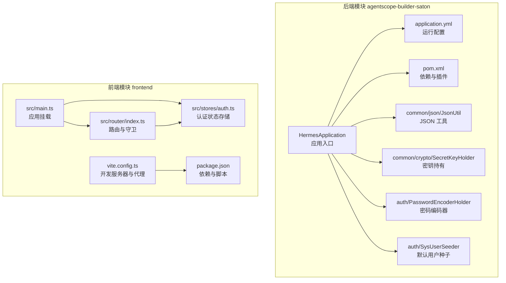
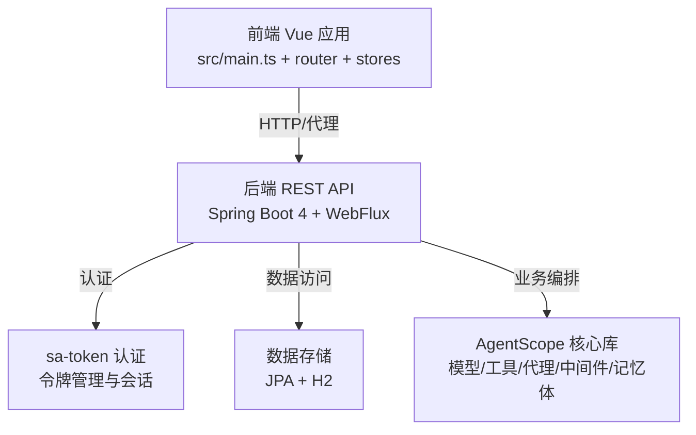
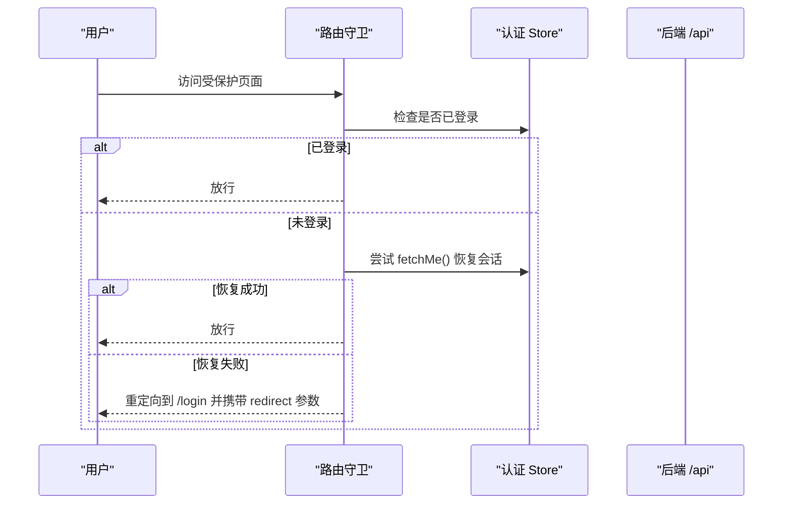
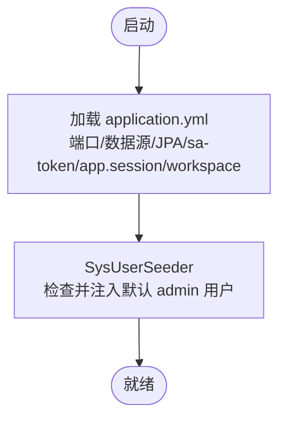
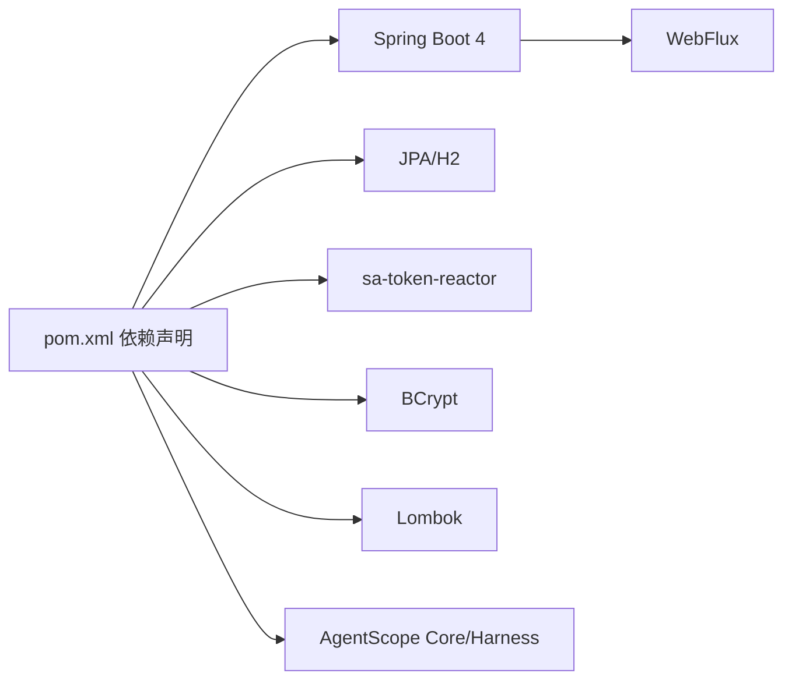

# 构建器平台

<cite>
**本文引用的文件**
- [agentscope-builder-saton/README.md](file://agentscope-builder-saton/README.md)
- [agentscope-builder-saton/pom.xml](file://agentscope-builder-saton/pom.xml)
- [agentscope-builder-saton/src/main/resources/application.yml](file://agentscope-builder-saton/src/main/resources/application.yml)
- [agentscope-builder-saton/frontend/package.json](file://agentscope-builder-saton/frontend/package.json)
- [agentscope-builder-saton/frontend/vite.config.ts](file://agentscope-builder-saton/frontend/vite.config.ts)
- [agentscope-builder-saton/frontend/src/main.ts](file://agentscope-builder-saton/frontend/src/main.ts)
- [agentscope-builder-saton/frontend/src/router/index.ts](file://agentscope-builder-saton/frontend/src/router/index.ts)
- [agentscope-builder-saton/frontend/src/stores/auth.ts](file://agentscope-builder-saton/frontend/src/stores/auth.ts)
- [agentscope-builder-saton/src/main/java/io/agentscope/builder/saton/HermesApplication.java](file://agentscope-builder-saton/src/main/java/io/agentscope/builder/saton/HermesApplication.java)
- [agentscope-builder-saton/src/main/java/io/agentscope/builder/saton/common/json/JsonUtil.java](file://agentscope-builder-saton/src/main/java/io/agentscope/builder/saton/common/json/JsonUtil.java)
- [agentscope-builder-saton/src/main/java/io/agentscope/builder/saton/common/crypto/SecretKeyHolder.java](file://agentscope-builder-saton/src/main/java/io/agentscope/builder/saton/common/crypto/SecretKeyHolder.java)
- [agentscope-builder-saton/src/main/java/io/agentscope/builder/saton/auth/PasswordEncoderHolder.java](file://agentscope-builder-saton/src/main/java/io/agentscope/builder/saton/auth/PasswordEncoderHolder.java)
- [agentscope-builder-saton/src/main/java/io/agentscope/builder/saton/auth/SysUserSeeder.java](file://agentscope-builder-saton/src/main/java/io/agentscope/builder/saton/auth/SysUserSeeder.java)
- [docs/superpowers/specs/2026-06-11-agentscope-builder-saton-design.md](file://docs/superpowers/specs/2026-06-11-agentscope-builder-saton-design.md)
- [docs/superpowers/specs/2026-06-11-builder-saton-frontend-design.md](file://docs/superpowers/specs/2026-06-11-builder-saton-frontend-design.md)
</cite>

## 目录
1. [简介](#简介)
2. [项目结构](#项目结构)
3. [核心组件](#核心组件)
4. [架构总览](#架构总览)
5. [详细组件分析](#详细组件分析)
6. [依赖关系分析](#依赖关系分析)
7. [性能考虑](#性能考虑)
8. [故障排查指南](#故障排查指南)
9. [结论](#结论)
10. [附录](#附录)

## 简介
本文件为 AgentScope Java 构建器平台（sa-token 版本）的平台文档，聚焦于 agentscope-builder-saton 的设计目标与功能特性，涵盖前端 Vue.js 应用架构与主要功能模块（代理配置、工具管理、会话记录等）、后端 Spring Boot 应用的 REST API 设计、数据库模型与业务逻辑、代理定义与模板系统、市场功能、用户认证与权限管理机制、部署与配置说明、使用教程与最佳实践，以及平台的扩展性与定制化能力。

## 项目结构
该仓库采用多模块结构，核心为构建器后端模块 agentscope-builder-saton，配套前端 Vue 应用位于 frontend 子目录。后端以 Spring Boot 4 + WebFlux 实现，集成 sa-token 进行鉴权，使用 JPA/H2 进行数据持久化，并通过 Maven 管理依赖与打包。

图表来源
- [agentscope-builder-saton/src/main/java/io/agentscope/builder/saton/HermesApplication.java:1-13](file://agentscope-builder-saton/src/main/java/io/agentscope/builder/saton/HermesApplication.java#L1-L13)
- [agentscope-builder-saton/src/main/resources/application.yml:1-37](file://agentscope-builder-saton/src/main/resources/application.yml#L1-L37)
- [agentscope-builder-saton/pom.xml:1-143](file://agentscope-builder-saton/pom.xml#L1-L143)
- [agentscope-builder-saton/src/main/java/io/agentscope/builder/saton/common/json/JsonUtil.java:1-19](file://agentscope-builder-saton/src/main/java/io/agentscope/builder/saton/common/json/JsonUtil.java#L1-L19)
- [agentscope-builder-saton/src/main/java/io/agentscope/builder/saton/common/crypto/SecretKeyHolder.java:1-22](file://agentscope-builder-saton/src/main/java/io/agentscope/builder/saton/common/crypto/SecretKeyHolder.java#L1-L22)
- [agentscope-builder-saton/src/main/java/io/agentscope/builder/saton/auth/PasswordEncoderHolder.java:1-15](file://agentscope-builder-saton/src/main/java/io/agentscope/builder/saton/auth/PasswordEncoderHolder.java#L1-L15)
- [agentscope-builder-saton/src/main/java/io/agentscope/builder/saton/auth/SysUserSeeder.java:1-37](file://agentscope-builder-saton/src/main/java/io/agentscope/builder/saton/auth/SysUserSeeder.java#L1-L37)
- [agentscope-builder-saton/frontend/vite.config.ts:1-33](file://agentscope-builder-saton/frontend/vite.config.ts#L1-L33)
- [agentscope-builder-saton/frontend/package.json:1-53](file://agentscope-builder-saton/frontend/package.json#L1-L53)
- [agentscope-builder-saton/frontend/src/main.ts:1-19](file://agentscope-builder-saton/frontend/src/main.ts#L1-L19)
- [agentscope-builder-saton/frontend/src/router/index.ts:1-88](file://agentscope-builder-saton/frontend/src/router/index.ts#L1-L88)
- [agentscope-builder-saton/frontend/src/stores/auth.ts:1-41](file://agentscope-builder-saton/frontend/src/stores/auth.ts#L1-L41)

章节来源
- [agentscope-builder-saton/README.md:1-39](file://agentscope-builder-saton/README.md#L1-L39)
- [agentscope-builder-saton/pom.xml:1-143](file://agentscope-builder-saton/pom.xml#L1-L143)
- [agentscope-builder-saton/src/main/resources/application.yml:1-37](file://agentscope-builder-saton/src/main/resources/application.yml#L1-L37)
- [agentscope-builder-saton/frontend/package.json:1-53](file://agentscope-builder-saton/frontend/package.json#L1-L53)
- [agentscope-builder-saton/frontend/vite.config.ts:1-33](file://agentscope-builder-saton/frontend/vite.config.ts#L1-L33)
- [agentscope-builder-saton/frontend/src/main.ts:1-19](file://agentscope-builder-saton/frontend/src/main.ts#L1-L19)
- [agentscope-builder-saton/frontend/src/router/index.ts:1-88](file://agentscope-builder-saton/frontend/src/router/index.ts#L1-L88)
- [agentscope-builder-saton/frontend/src/stores/auth.ts:1-41](file://agentscope-builder-saton/frontend/src/stores/auth.ts#L1-L41)

## 核心组件
- 应用入口与运行配置
  - 后端入口类负责启动 Spring Boot 应用。
  - 运行配置定义了端口、数据源（H2 文件模式）、JPA 行为、sa-token 参数及应用级工作区与会话根路径。
- 前端应用
  - 使用 Vue 3 + Pinia + Vue Router 构建，具备路由守卫、认证状态持久化与国际化基础。
  - 开发服务器通过 Vite 配置代理转发 /api 请求至后端 8080 端口。
- 安全与认证
  - sa-token 用于会话令牌管理，支持令牌名称、超时、并发共享等策略。
  - 密码编码器采用 BCrypt，提供安全的密码存储。
  - 默认管理员用户在启动时自动注入，提示首次登录后修改密码。
- 加解密与密钥管理
  - 启动期从环境变量加载主密钥（AES-256），缺失时使用固定开发密钥并发出警告。
- JSON 工具
  - 基于 Jackson 3 提供进程级 ObjectMapper 单例，统一序列化/反序列化行为。

章节来源
- [agentscope-builder-saton/src/main/java/io/agentscope/builder/saton/HermesApplication.java:1-13](file://agentscope-builder-saton/src/main/java/io/agentscope/builder/saton/HermesApplication.java#L1-L13)
- [agentscope-builder-saton/src/main/resources/application.yml:1-37](file://agentscope-builder-saton/src/main/resources/application.yml#L1-L37)
- [agentscope-builder-saton/src/main/java/io/agentscope/builder/saton/auth/PasswordEncoderHolder.java:1-15](file://agentscope-builder-saton/src/main/java/io/agentscope/builder/saton/auth/PasswordEncoderHolder.java#L1-L15)
- [agentscope-builder-saton/src/main/java/io/agentscope/builder/saton/auth/SysUserSeeder.java:1-37](file://agentscope-builder-saton/src/main/java/io/agentscope/builder/saton/auth/SysUserSeeder.java#L1-L37)
- [agentscope-builder-saton/src/main/java/io/agentscope/builder/saton/common/crypto/SecretKeyHolder.java:1-22](file://agentscope-builder-saton/src/main/java/io/agentscope/builder/saton/common/crypto/SecretKeyHolder.java#L1-L22)
- [agentscope-builder-saton/src/main/java/io/agentscope/builder/saton/common/json/JsonUtil.java:1-19](file://agentscope-builder-saton/src/main/java/io/agentscope/builder/saton/common/json/JsonUtil.java#L1-L19)

## 架构总览
平台采用前后端分离架构：前端 Vue 应用通过浏览器与后端交互；后端基于 Spring WebFlux 提供响应式 REST API；sa-token 统一处理认证与会话；JPA/H2 负责数据持久化；AgentScope 核心库提供模型、工具、代理、中间件、记忆体等抽象能力。

图表来源
- [agentscope-builder-saton/frontend/src/main.ts:1-19](file://agentscope-builder-saton/frontend/src/main.ts#L1-L19)
- [agentscope-builder-saton/frontend/src/router/index.ts:1-88](file://agentscope-builder-saton/frontend/src/router/index.ts#L1-L88)
- [agentscope-builder-saton/frontend/src/stores/auth.ts:1-41](file://agentscope-builder-saton/frontend/src/stores/auth.ts#L1-L41)
- [agentscope-builder-saton/src/main/resources/application.yml:1-37](file://agentscope-builder-saton/src/main/resources/application.yml#L1-L37)
- [agentscope-builder-saton/pom.xml:47-97](file://agentscope-builder-saton/pom.xml#L47-L97)

## 详细组件分析

### 前端应用架构与功能模块
- 应用初始化
  - 在 main.ts 中创建 Vue 应用，注册 Pinia、路由与国际化，并挂载根组件。
- 路由与导航
  - 路由定义包含登录页与多个受保护页面（仪表盘、代理列表、模型、工具、记忆体、个人资料等）。
  - 路由守卫在进入受保护页面前检查登录状态；支持刷新后尝试 /me 恢复会话。
- 认证状态管理
  - Pinia store 管理用户登录态、拉取当前用户信息与登出操作；启用持久化仅保留用户信息。
- 开发服务器与代理
  - Vite 代理将 /api 前缀请求转发到后端 8080 端口，适配 SSE 场景缓存控制。

图表来源
- [agentscope-builder-saton/frontend/src/router/index.ts:66-85](file://agentscope-builder-saton/frontend/src/router/index.ts#L66-L85)
- [agentscope-builder-saton/frontend/src/stores/auth.ts:1-41](file://agentscope-builder-saton/frontend/src/stores/auth.ts#L1-L41)

章节来源
- [agentscope-builder-saton/frontend/src/main.ts:1-19](file://agentscope-builder-saton/frontend/src/main.ts#L1-L19)
- [agentscope-builder-saton/frontend/src/router/index.ts:1-88](file://agentscope-builder-saton/frontend/src/router/index.ts#L1-L88)
- [agentscope-builder-saton/frontend/src/stores/auth.ts:1-41](file://agentscope-builder-saton/frontend/src/stores/auth.ts#L1-L41)
- [agentscope-builder-saton/frontend/vite.config.ts:1-33](file://agentscope-builder-saton/frontend/vite.config.ts#L1-L33)

### 后端应用与认证流程
- 应用入口
  - 启动类负责引导 Spring Boot 应用上下文。
- 认证与会话
  - sa-token 配置令牌名称、超时、并发与共享策略；前端通过请求头携带令牌进行鉴权。
  - 密码编码器采用 BCrypt，保证密码安全存储。
  - 默认管理员用户在首次启动时注入，提示首次登录后修改密码。
- 数据与配置
  - 数据源默认使用 H2 文件模式，DDL 自动更新；应用级会话与工作区根目录可配置。

图表来源
- [agentscope-builder-saton/src/main/resources/application.yml:1-37](file://agentscope-builder-saton/src/main/resources/application.yml#L1-L37)
- [agentscope-builder-saton/src/main/java/io/agentscope/builder/saton/auth/SysUserSeeder.java:1-37](file://agentscope-builder-saton/src/main/java/io/agentscope/builder/saton/auth/SysUserSeeder.java#L1-L37)

章节来源
- [agentscope-builder-saton/src/main/java/io/agentscope/builder/saton/HermesApplication.java:1-13](file://agentscope-builder-saton/src/main/java/io/agentscope/builder/saton/HermesApplication.java#L1-L13)
- [agentscope-builder-saton/src/main/resources/application.yml:1-37](file://agentscope-builder-saton/src/main/resources/application.yml#L1-L37)
- [agentscope-builder-saton/src/main/java/io/agentscope/builder/saton/auth/PasswordEncoderHolder.java:1-15](file://agentscope-builder-saton/src/main/java/io/agentscope/builder/saton/auth/PasswordEncoderHolder.java#L1-L15)
- [agentscope-builder-saton/src/main/java/io/agentscope/builder/saton/auth/SysUserSeeder.java:1-37](file://agentscope-builder-saton/src/main/java/io/agentscope/builder/saton/auth/SysUserSeeder.java#L1-L37)

### 代理定义、模板系统与市场功能
- 设计参考
  - 平台设计文档与前端设计文档明确了“五大工厂”（Agent/Model/Tool/Skill/Hook）与模板系统、市场功能的总体思路。
- 实现要点（基于设计文档）
  - 代理定义：围绕 Agent 工厂，结合模型、工具、技能与钩子进行组合与配置。
  - 模板系统：提供可复用的代理/任务模板，便于快速生成实例。
  - 市场功能：面向代理与工具的分享、克隆与仓库化管理（后续里程碑计划）。
- 前端模块映射
  - 代理列表、模型、工具、记忆体等视图对应上述功能域，支撑用户在前端完成配置与管理。

章节来源
- [docs/superpowers/specs/2026-06-11-agentscope-builder-saton-design.md](file://docs/superpowers/specs/2026-06-11-agentscope-builder-saton-design.md)
- [docs/superpowers/specs/2026-06-11-builder-saton-frontend-design.md](file://docs/superpowers/specs/2026-06-11-builder-saton-frontend-design.md)
- [agentscope-builder-saton/frontend/src/router/index.ts:26-50](file://agentscope-builder-saton/frontend/src/router/index.ts#L26-L50)

### 会话记录与工作区
- 会话与工作区根路径
  - application.yml 中配置了会话与工作区的根目录，用于持久化会话与工作空间内容。
- 前端会话恢复
  - 路由守卫在刷新或热模块替换场景下尝试调用 /me 恢复登录态，提升用户体验。

章节来源
- [agentscope-builder-saton/src/main/resources/application.yml:32-36](file://agentscope-builder-saton/src/main/resources/application.yml#L32-L36)
- [agentscope-builder-saton/frontend/src/router/index.ts:77-82](file://agentscope-builder-saton/frontend/src/router/index.ts#L77-L82)

### 数据模型与业务逻辑（概览）
- 数据模型
  - 使用 JPA 注解实体与仓库，结合 H2 文件数据库进行数据持久化。
- 业务逻辑
  - 结合 AgentScope 核心库提供的模型、工具、代理、中间件与记忆体抽象，后端实现具体业务编排与数据访问。

章节来源
- [agentscope-builder-saton/pom.xml:61-70](file://agentscope-builder-saton/pom.xml#L61-L70)
- [agentscope-builder-saton/src/main/resources/application.yml:8-18](file://agentscope-builder-saton/src/main/resources/application.yml#L8-L18)

## 依赖关系分析
后端依赖 Spring Boot 4、WebFlux、JPA/H2、sa-token-reactor、BCrypt、Lombok、AgentScope 核心与 Harness 等模块；前端依赖 Vue 3、Pinia、Vue Router、Axios、Monaco Editor、Naive UI 等生态库。

图表来源
- [agentscope-builder-saton/pom.xml:27-97](file://agentscope-builder-saton/pom.xml#L27-L97)

章节来源
- [agentscope-builder-saton/pom.xml:1-143](file://agentscope-builder-saton/pom.xml#L1-L143)

## 性能考虑
- 响应式栈
  - WebFlux 提供非阻塞 I/O，适合高并发与流式处理（如 SSE）。
- 缓存与会话
  - sa-token 支持并发共享与会话超时控制，建议根据业务调整超时参数。
- 数据层
  - H2 文件模式适合开发与演示；生产环境建议切换至 MySQL/PostgreSQL 并引入连接池与索引优化。
- 前端
  - Pinia 持久化仅保存必要字段，避免不必要的内存占用；路由懒加载减少首屏体积。

## 故障排查指南
- 登录与会话
  - 若登录后无法访问受保护页面，检查前端是否正确携带令牌头；确认后端 sa-token 配置与令牌名称一致。
- 默认用户
  - 首次启动若未出现默认管理员用户，检查密码编码器 Bean 是否生效与种子逻辑执行情况。
- 数据库
  - H2 文件路径与权限问题可能导致启动失败；确认 application.yml 中的数据源路径与权限。
- 代理与模板
  - 若代理/模板相关功能异常，核对 AgentScope 核心库版本与后端业务实现是否匹配。

章节来源
- [agentscope-builder-saton/frontend/src/router/index.ts:66-85](file://agentscope-builder-saton/frontend/src/router/index.ts#L66-L85)
- [agentscope-builder-saton/src/main/java/io/agentscope/builder/saton/auth/PasswordEncoderHolder.java:1-15](file://agentscope-builder-saton/src/main/java/io/agentscope/builder/saton/auth/PasswordEncoderHolder.java#L1-L15)
- [agentscope-builder-saton/src/main/java/io/agentscope/builder/saton/auth/SysUserSeeder.java:1-37](file://agentscope-builder-saton/src/main/java/io/agentscope/builder/saton/auth/SysUserSeeder.java#L1-L37)
- [agentscope-builder-saton/src/main/resources/application.yml:8-11](file://agentscope-builder-saton/src/main/resources/application.yml#L8-L11)

## 结论
agentscope-builder-saton 以 Spring Boot 4 + WebFlux 为基础，结合 sa-token 实现统一认证与会话管理，配合 JPA/H2 完成数据持久化，并通过 AgentScope 核心库抽象实现代理、模型、工具、技能与钩子的工厂化编排。前端采用 Vue 3 生态，提供路由守卫与认证状态持久化，满足代理配置、工具管理与会话记录等核心需求。平台具备良好的扩展性与定制化能力，可通过引入新的工厂与业务模块进一步完善模板系统与市场功能。

## 附录

### 部署与配置指南
- 本地启动
  - 使用 Maven 启动后端，默认监听 8080 端口；前端通过 Vite 本地开发服务器运行，代理转发 /api 请求。
- 数据库
  - 默认使用 H2 文件模式，数据文件位于项目根目录 data 下；后续里程碑将支持 MySQL/PostgreSQL profile。
- 认证
  - 默认管理员账户为 admin/admin，首次登录后请立即修改密码。
- 本地仓库
  - 项目使用 D:\PROGRAM\maven\Repository 作为本地仓库，请确保 Maven settings.xml 中 localRepository 配置正确。

章节来源
- [agentscope-builder-saton/README.md:11-39](file://agentscope-builder-saton/README.md#L11-L39)
- [agentscope-builder-saton/src/main/resources/application.yml:1-37](file://agentscope-builder-saton/src/main/resources/application.yml#L1-L37)

### 使用教程与最佳实践
- 登录与会话恢复
  - 通过登录接口获取令牌，随后访问需要鉴权的资源；刷新页面时利用 /me 接口恢复会话。
- 代理与模板
  - 在前端相应视图中完成代理配置与模板管理；结合模型与工具选择，形成可复用的代理实例。
- 工作区与会话
  - 会话与工作区根路径可在配置中调整，便于数据持久化与迁移。

章节来源
- [agentscope-builder-saton/README.md:19-30](file://agentscope-builder-saton/README.md#L19-L30)
- [agentscope-builder-saton/src/main/resources/application.yml:32-36](file://agentscope-builder-saton/src/main/resources/application.yml#L32-L36)
- [agentscope-builder-saton/frontend/src/router/index.ts:66-85](file://agentscope-builder-saton/frontend/src/router/index.ts#L66-L85)

### 扩展性与定制化
- 新增工厂
  - 可在后端引入新的工厂模块（如 Skill/Resource/Workspace），并与现有代理工厂协同工作。
- 模板与市场
  - 模板系统与市场功能可按设计文档逐步实现，支持代理与工具的分享与克隆。
- 前端扩展
  - 基于现有路由与视图结构，新增页面与组件以满足特定业务场景。

章节来源
- [docs/superpowers/specs/2026-06-11-agentscope-builder-saton-design.md](file://docs/superpowers/specs/2026-06-11-agentscope-builder-saton-design.md)
- [docs/superpowers/specs/2026-06-11-builder-saton-frontend-design.md](file://docs/superpowers/specs/2026-06-11-builder-saton-frontend-design.md)