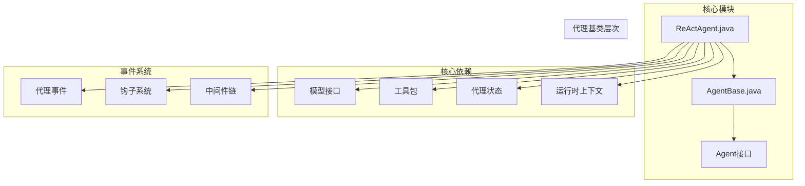
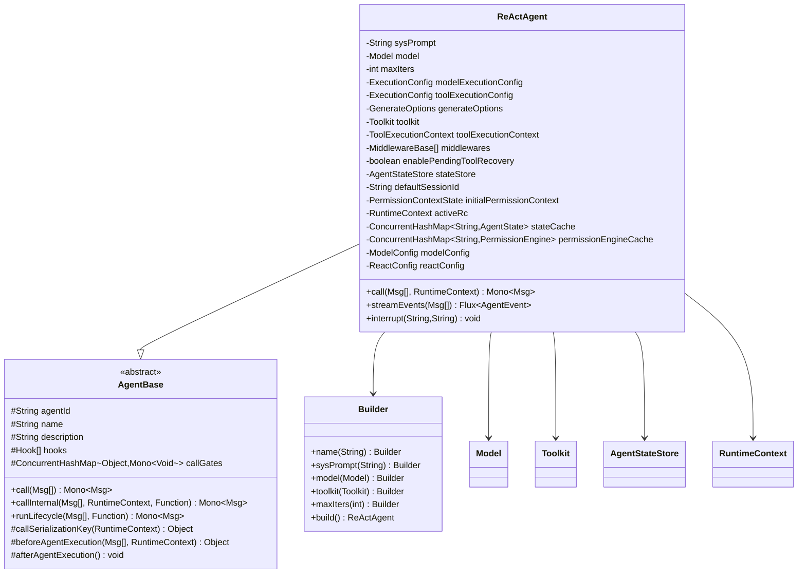
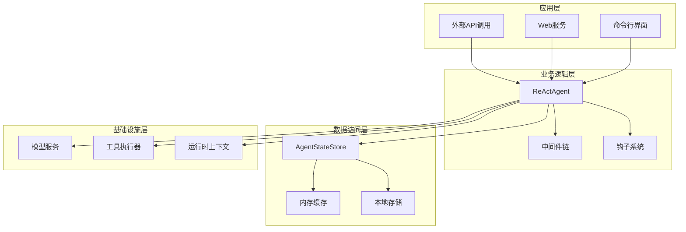
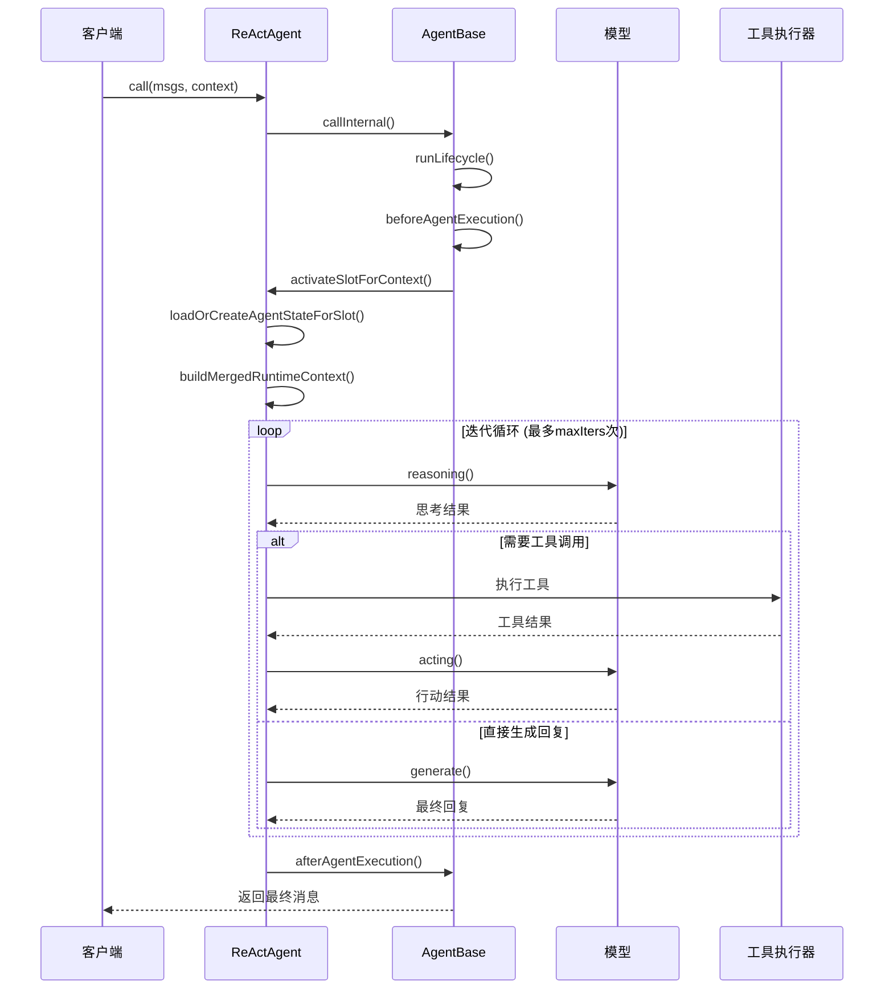
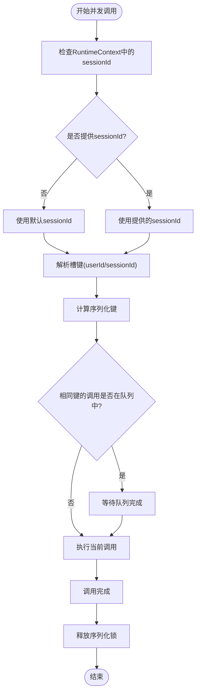
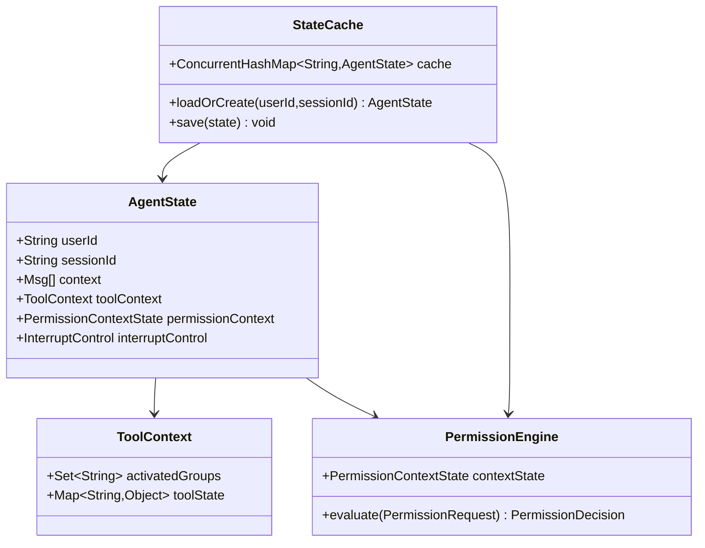
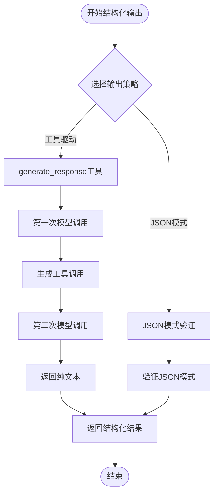
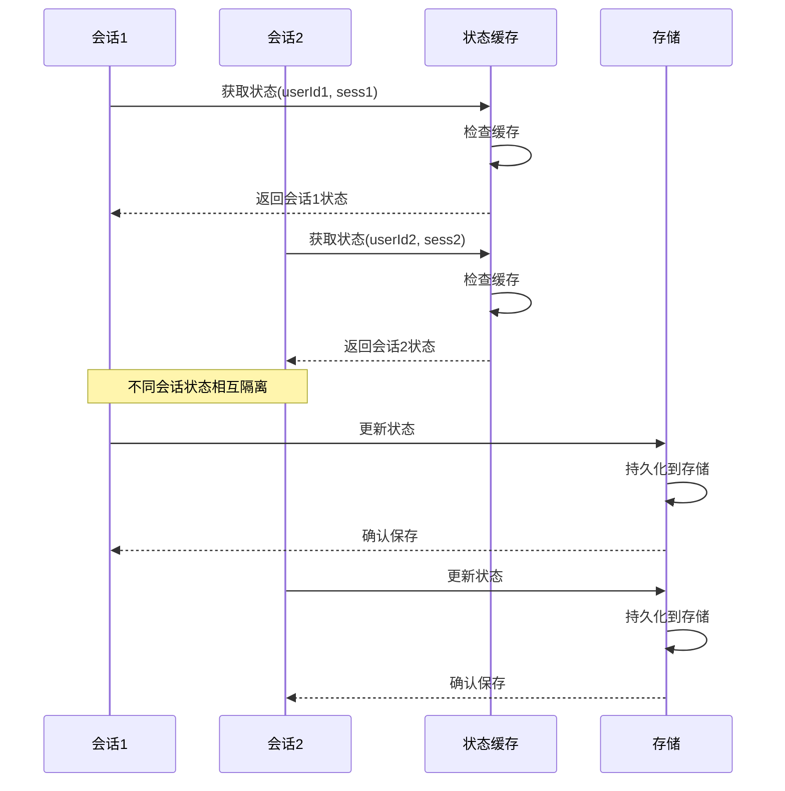
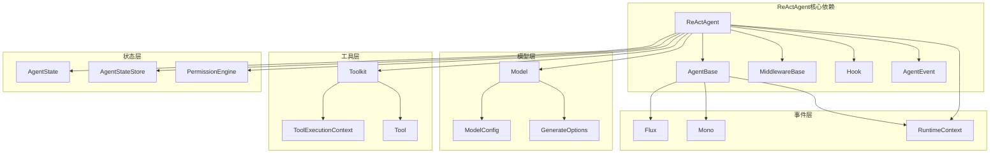
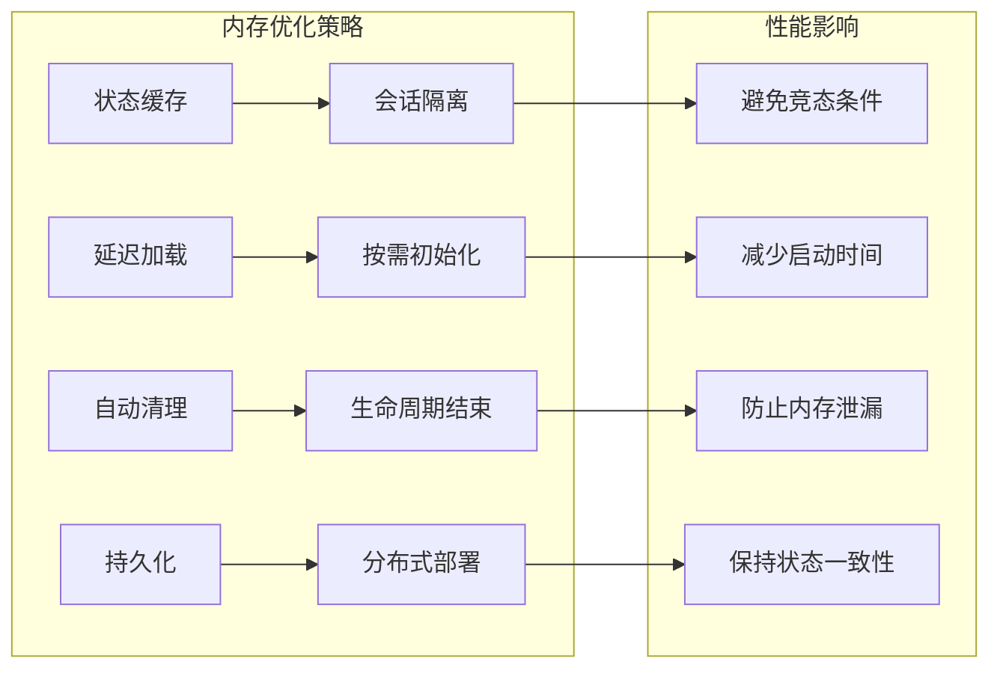

# ReActAgent核心实现

<cite>
**本文档引用的文件**
- [ReActAgent.java](file://agentscope-core/src/main/java/io/agentscope/core/ReActAgent.java)
- [AgentBase.java](file://agentscope-core/src/main/java/io/agentscope/core/agent/AgentBase.java)
- [ReActAgentStructuredOutputTest.java](file://agentscope-core/src/test/java/io/agentscope/core/agent/ReActAgentStructuredOutputTest.java)
- [ReActAgentPerSessionStateTest.java](file://agentscope-core/src/test/java/io/agentscope/core/agent/ReActAgentPerSessionStateTest.java)
- [ReActAgentSummarizingTest.java](file://agentscope-core/src/test/java/io/agentscope/core/agent/ReActAgentSummarizingTest.java)
- [ToolCallingExample.java](file://agentscope-examples/documentation/src/main/java/io/agentscope/examples/documentation2/tool/ToolCallingExample.java)
- [StructuredOutputExample.java](file://agentscope-examples/documentation/src/main/java/io/agentscope/examples/documentation2/structuredoutput/StructuredOutputExample.java)
</cite>

## 目录
1. [简介](#简介)
2. [项目结构](#项目结构)
3. [核心组件](#核心组件)
4. [架构概览](#架构概览)
5. [详细组件分析](#详细组件分析)
6. [依赖关系分析](#依赖关系分析)
7. [性能考量](#性能考量)
8. [故障排除指南](#故障排除指南)
9. [结论](#结论)

## 简介

ReActAgent是AgentScope框架中的核心智能体实现，基于ReAct（Reasoning and Acting）模式设计。该模式将推理（思考和规划）与行动（工具执行）结合在一个迭代循环中，通过交替进行推理和行动直到完成任务或达到最大迭代限制。

ReActAgent提供了以下关键特性：
- **响应式流式处理**：使用Project Reactor实现非阻塞执行
- **可扩展钩子系统**：支持监控和拦截代理执行
- **人工介入支持**：通过stopAgent()在PostReasoningEvent/PostActingEvent中实现人机协作
- **结构化输出**：每调用提供generate_response工具，确保类型安全的输出

## 项目结构

ReActAgent位于agentscope-core模块中，采用分层架构设计：

**图表来源**
- [ReActAgent.java:1-200](file://agentscope-core/src/main/java/io/agentscope/core/ReActAgent.java#L1-L200)
- [AgentBase.java:1-100](file://agentscope-core/src/main/java/io/agentscope/core/agent/AgentBase.java#L1-L100)

**章节来源**
- [ReActAgent.java:148-198](file://agentscope-core/src/main/java/io/agentscope/core/ReActAgent.java#L148-L198)
- [AgentBase.java:47-90](file://agentscope-core/src/main/java/io/agentscope/core/agent/AgentBase.java#L47-L90)

## 核心组件

### 主要依赖注入机制

ReActAgent采用构造函数注入和Builder模式相结合的方式：

**图表来源**
- [ReActAgent.java:200-330](file://agentscope-core/src/main/java/io/agentscope/core/ReActAgent.java#L200-L330)
- [AgentBase.java:91-158](file://agentscope-core/src/main/java/io/agentscope/core/agent/AgentBase.java#L91-L158)

### 配置参数详解

ReActAgent支持丰富的配置参数：

| 参数名称 | 类型 | 默认值 | 描述 |
|---------|------|--------|------|
| name | String | null | 代理名称 |
| sysPrompt | String | null | 系统提示词 |
| model | Model | 必需 | 模型实例 |
| toolkit | Toolkit | null | 工具包实例 |
| maxIters | int | 10 | 最大迭代次数 |
| modelExecutionConfig | ExecutionConfig | null | 模型执行配置 |
| toolExecutionConfig | ExecutionConfig | null | 工具执行配置 |
| generateOptions | GenerateOptions | null | 生成选项 |
| toolExecutionContext | ToolExecutionContext | null | 工具执行上下文 |
| enablePendingToolRecovery | boolean | false | 启用待处理工具恢复 |

**章节来源**
- [ReActAgent.java:288-330](file://agentscope-core/src/main/java/io/agentscope/core/ReActAgent.java#L288-L330)
- [ReActAgent.java:482-493](file://agentscope-core/src/main/java/io/agentscope/core/ReActAgent.java#L482-L493)

## 架构概览

ReActAgent采用分层架构设计，实现了清晰的关注点分离：

**图表来源**
- [ReActAgent.java:510-536](file://agentscope-core/src/main/java/io/agentscope/core/ReActAgent.java#L510-L536)
- [AgentBase.java:252-297](file://agentscope-core/src/main/java/io/agentscope/core/agent/AgentBase.java#L252-L297)

## 详细组件分析

### 生命周期管理

ReActAgent的生命周期管理采用响应式编程模型：

**图表来源**
- [ReActAgent.java:627-637](file://agentscope-core/src/main/java/io/agentscope/core/ReActAgent.java#L627-L637)
- [AgentBase.java:252-322](file://agentscope-core/src/main/java/io/agentscope/core/agent/AgentBase.java#L252-L322)

### 并发控制机制

ReActAgent通过会话级序列化确保并发安全性：

**图表来源**
- [ReActAgent.java:497-508](file://agentscope-core/src/main/java/io/agentscope/core/ReActAgent.java#L497-L508)
- [AgentBase.java:344-365](file://agentscope-core/src/main/java/io/agentscope/core/agent/AgentBase.java#L344-L365)

### 状态管理系统

ReActAgent实现了多层状态管理：

**图表来源**
- [ReActAgent.java:261-269](file://agentscope-core/src/main/java/io/agentscope/core/ReActAgent.java#L261-L269)
- [ReActAgent.java:412-422](file://agentscope-core/src/main/java/io/agentscope/core/ReActAgent.java#L412-L422)

**章节来源**
- [ReActAgent.java:437-478](file://agentscope-core/src/main/java/io/agentscope/core/ReActAgent.java#L437-L478)
- [ReActAgent.java:258-269](file://agentscope-core/src/main/java/io/agentscope/core/ReActAgent.java#L258-L269)

### 结构化输出实现

ReActAgent支持两种结构化输出策略：

**图表来源**
- [ReActAgent.java:631-637](file://agentscope-core/src/main/java/io/agentscope/core/ReActAgent.java#L631-L637)
- [ReActAgentStructuredOutputTest.java:61-154](file://agentscope-core/src/test/java/io/agentscope/core/agent/ReActAgentStructuredOutputTest.java#L61-L154)

**章节来源**
- [ReActAgent.java:627-637](file://agentscope-core/src/main/java/io/agentscope/core/ReActAgent.java#L627-L637)
- [ReActAgentStructuredOutputTest.java:156-244](file://agentscope-core/src/test/java/io/agentscope/core/agent/ReActAgentStructuredOutputTest.java#L156-L244)

### 会话管理机制

ReActAgent支持多会话并发管理：

**图表来源**
- [ReActAgentPerSessionStateTest.java:139-177](file://agentscope-core/src/test/java/io/agentscope/core/agent/ReActAgentPerSessionStateTest.java#L139-L177)
- [ReActAgent.java:447-478](file://agentscope-core/src/main/java/io/agentscope/core/ReActAgent.java#L447-L478)

**章节来源**
- [ReActAgentPerSessionStateTest.java:179-206](file://agentscope-core/src/test/java/io/agentscope/core/agent/ReActAgentPerSessionStateTest.java#L179-L206)
- [ReActAgentPerSessionStateTest.java:208-240](file://agentscope-core/src/test/java/io/agentscope/core/agent/ReActAgentPerSessionStateTest.java#L208-L240)

## 依赖关系分析

ReActAgent的依赖关系体现了高度模块化的架构设计：

**图表来源**
- [ReActAgent.java:18-140](file://agentscope-core/src/main/java/io/agentscope/core/ReActAgent.java#L18-L140)
- [AgentBase.java:18-45](file://agentscope-core/src/main/java/io/agentscope/core/agent/AgentBase.java#L18-L45)

**章节来源**
- [ReActAgent.java:18-140](file://agentscope-core/src/main/java/io/agentscope/core/ReActAgent.java#L18-L140)
- [AgentBase.java:18-45](file://agentscope-core/src/main/java/io/agentscope/core/agent/AgentBase.java#L18-L45)

## 性能考量

### 线程安全性设计

ReActAgent在设计上明确标注为非线程安全，但通过以下机制确保并发场景下的正确性：

1. **会话级序列化**：相同sessionId的调用按FIFO顺序执行
2. **反应式上下文**：每个订阅持有独立的事件流
3. **不可变配置**：构建后的配置对象不被修改
4. **原子操作**：关键状态更新使用原子操作

### 内存管理优化

### 并发调用最佳实践

对于需要并发处理的应用场景，建议：

1. **每个请求创建独立实例**：避免共享单个ReActAgent实例
2. **使用工厂方法**：为每个请求创建新的代理实例
3. **合理配置会话**：为不同用户或会话分配唯一sessionId
4. **监控资源使用**：定期检查内存和CPU使用情况

## 故障排除指南

### 常见问题及解决方案

| 问题类型 | 症状 | 可能原因 | 解决方案 |
|---------|------|----------|----------|
| 并发调用异常 | IllegalStateException | 多线程同时调用同一实例 | 为每个请求创建独立实例 |
| 会话状态冲突 | 丢失对话历史 | 相同sessionId的并发调用 | 使用不同的sessionId或序列化调用 |
| 内存泄漏 | 内存持续增长 | 未正确关闭代理实例 | 实现AutoCloseable接口并正确关闭 |
| 工具执行超时 | 超时异常 | 工具执行时间过长 | 配置适当的工具执行超时时间 |
| 结构化输出失败 | JSON验证错误 | 模式不匹配 | 检查JSON模式定义和数据类型 |

### 调试技巧

1. **启用详细日志**：配置SLF4J记录器级别为DEBUG
2. **使用事件流**：通过streamEvents()监控代理执行过程
3. **检查状态缓存**：验证AgentState缓存的一致性
4. **监控中间件**：检查中间件链的执行顺序和性能

**章节来源**
- [ReActAgent.java:192-198](file://agentscope-core/src/main/java/io/agentscope/core/ReActAgent.java#L192-L198)
- [ReActAgentSummarizingTest.java:53-147](file://agentscope-core/src/test/java/io/agentscope/core/agent/ReActAgentSummarizingTest.java#L53-L147)

## 结论

ReActAgent作为AgentScope框架的核心组件，展现了现代AI代理系统的最佳实践。其设计特点包括：

1. **清晰的架构分层**：通过继承AgentBase实现了职责分离
2. **响应式编程模型**：充分利用Project Reactor的非阻塞特性
3. **强类型系统**：通过结构化输出确保数据完整性
4. **灵活的状态管理**：支持多会话并发和分布式部署
5. **完善的生命周期管理**：从创建到销毁的完整生命周期控制

ReActAgent的设计为构建复杂的AI代理应用提供了坚实的基础，其模块化架构和丰富的扩展点使其能够适应各种应用场景的需求。通过遵循本文档的最佳实践，开发者可以有效地利用ReActAgent的强大功能来构建高质量的AI应用。