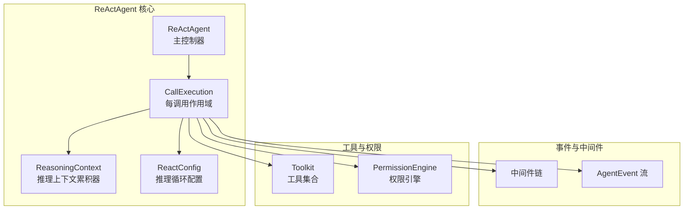
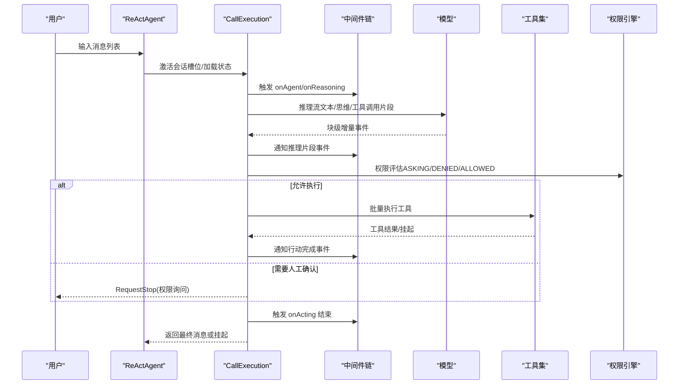
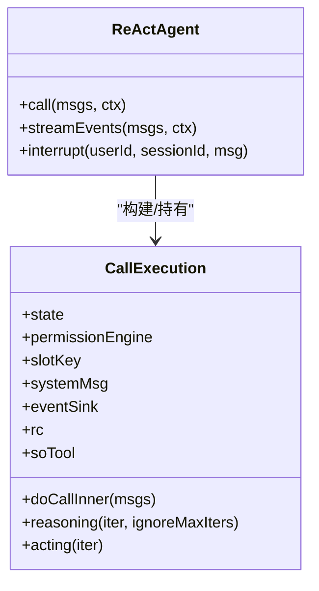
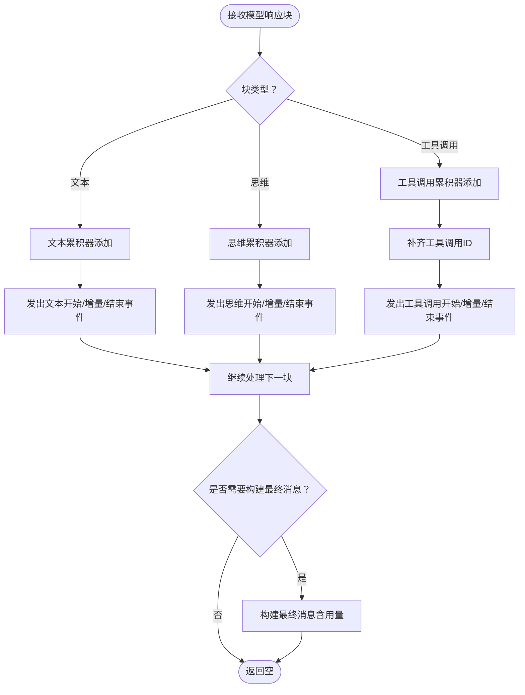
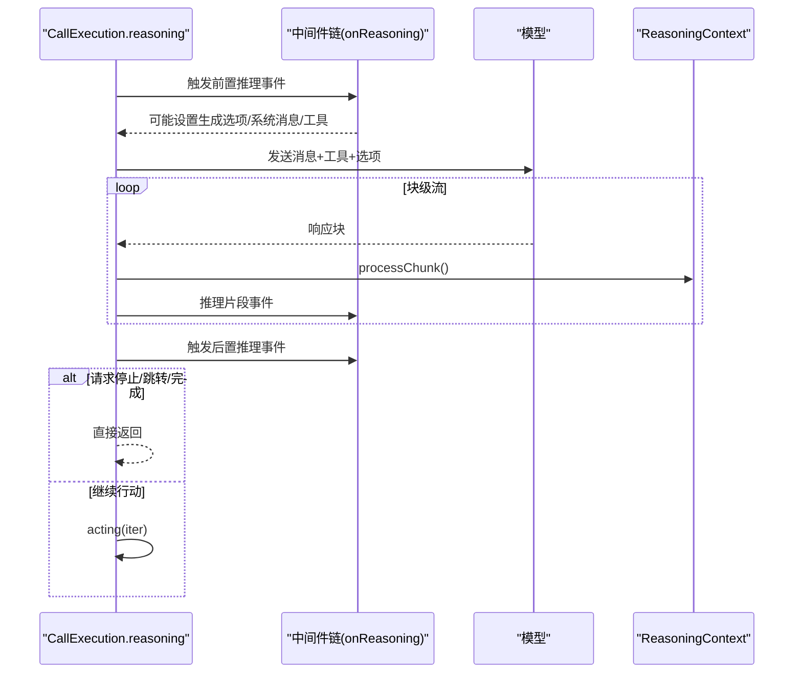
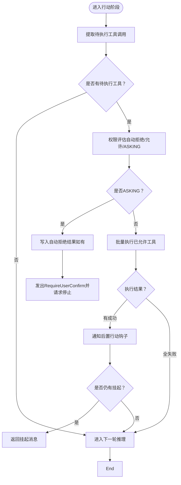
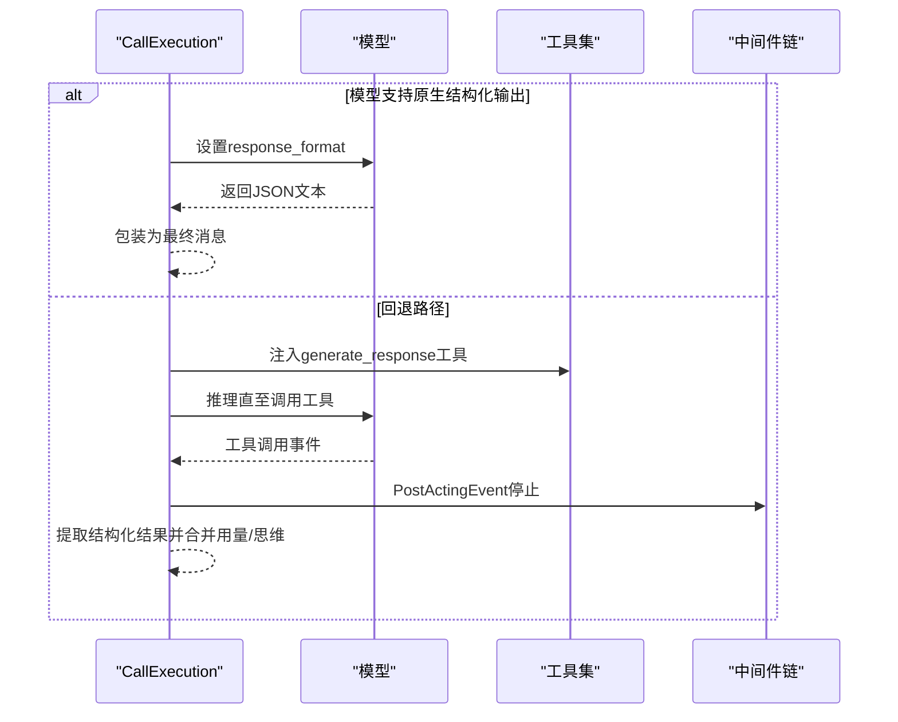
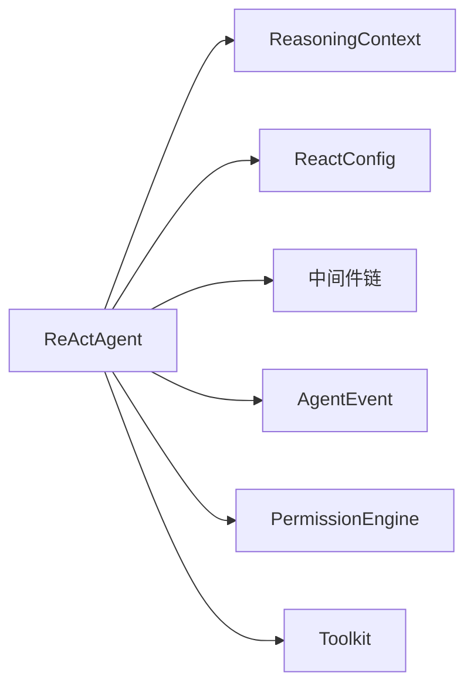

# ReAct推理-行动框架

<cite>
**本文档引用的文件**
- [ReActAgent.java](file://agentscope-core/src/main/java/io/agentscope/core/ReActAgent.java)
- [ReactConfig.java](file://agentscope-core/src/main/java/io/agentscope/core/agent/config/ReactConfig.java)
- [ReasoningContext.java](file://agentscope-core/src/main/java/io/agentscope/core/agent/accumulator/ReasoningContext.java)
</cite>

## 目录
1. [引言](#引言)
2. [项目结构](#项目结构)
3. [核心组件](#核心组件)
4. [架构总览](#架构总览)
5. [详细组件分析](#详细组件分析)
6. [依赖分析](#依赖分析)
7. [性能考虑](#性能考虑)
8. [故障排除指南](#故障排除指南)
9. [结论](#结论)
10. [附录：配置与使用示例](#附录配置与使用示例)

## 引言
本文件系统性阐述 agentscope-java 中 ReAct 推理-行动框架的设计与实现，覆盖以下要点：
- 理论基础与实现机制：ReAct 的“推理（Reasoning）→行动（Acting）”两阶段迭代工作流
- 核心算法与关键模块：推理上下文管理、思维累积器、工具调用累积器、权限控制与人机交互（HITL）
- 执行流程：从消息输入到最终输出的完整链路，含事件流、中间件、钩子系统
- 配置参数与调优建议：最大迭代次数、拒绝即停策略、结构化输出路径等
- 实践指南：如何使用 ReActAgent 进行对话与任务执行，以及扩展与定制 ReAct 行为的方法

## 项目结构
ReActAgent 位于 agentscope-core 模块中，围绕 ReActAgent 主体类构建了如下关键子系统：
- 推理上下文与累积器：ReasoningContext 负责在单轮推理中聚合文本、思维与工具调用片段
- 配置体系：ReactConfig 提供 maxIters 与 stopOnReject 等核心参数
- 事件与中间件：贯穿推理、模型调用、行动阶段的细粒度事件流与中间件链
- 权限与中断：会话级中断控制、权限引擎与人机交互（HITL）

图表来源
- [ReActAgent.java:1335-1392](file://agentscope-core/src/main/java/io/agentscope/core/ReActAgent.java#L1335-L1392)
- [ReasoningContext.java:44-62](file://agentscope-core/src/main/java/io/agentscope/core/agent/accumulator/ReasoningContext.java#L44-L62)
- [ReactConfig.java:29-55](file://agentscope-core/src/main/java/io/agentscope/core/agent/config/ReactConfig.java#L29-L55)

章节来源
- [ReActAgent.java:1335-1392](file://agentscope-core/src/main/java/io/agentscope/core/ReActAgent.java#L1335-L1392)
- [ReasoningContext.java:44-62](file://agentscope-core/src/main/java/io/agentscope/core/agent/accumulator/ReasoningContext.java#L44-L62)
- [ReactConfig.java:29-55](file://agentscope-core/src/main/java/io/agentscope/core/agent/config/ReactConfig.java#L29-L55)

## 核心组件
- ReActAgent：ReAct 模式实现主体，负责推理与行动的迭代调度、事件流、中间件与钩子分发、状态持久化与会话槽位管理
- ReasoningContext：单轮推理的上下文累积器，实时聚合文本、思维与工具调用片段，生成最终消息并携带用量统计
- ReactConfig：推理循环配置项，包括最大迭代次数与“被拒即停”策略

章节来源
- [ReActAgent.java:148-200](file://agentscope-core/src/main/java/io/agentscope/core/ReActAgent.java#L148-L200)
- [ReasoningContext.java:32-44](file://agentscope-core/src/main/java/io/agentscope/core/agent/accumulator/ReasoningContext.java#L32-L44)
- [ReactConfig.java:22-27](file://agentscope-core/src/main/java/io/agentscope/core/agent/config/ReactConfig.java#L22-L27)

## 架构总览
ReActAgent 将一次对话拆分为“推理→行动”的多轮迭代，每轮内部通过 ReasoningContext 管理上下文累积，借助中间件链与事件流实现可观测与可扩展。行动阶段对工具调用进行权限评估与批量执行，支持挂起与恢复。

图表来源
- [ReActAgent.java:1835-2037](file://agentscope-core/src/main/java/io/agentscope/core/ReActAgent.java#L1835-L2037)
- [ReActAgent.java:2167-2323](file://agentscope-core/src/main/java/io/agentscope/core/ReActAgent.java#L2167-L2323)

## 详细组件分析

### ReActAgent 主体与每调用作用域
- 每次调用构建 CallExecution 作用域，持有 AgentState、PermissionEngine、会话槽键与事件发射器
- 支持结构化输出：原生路径（模型 response_format）与回退路径（合成 generate_response 工具）
- 会话槽位管理：按 (userId, sessionId) 缓存状态与权限引擎，支持分布式部署下的最新状态读取
- 中断与优雅停机：基于会话级 InterruptControl，支持系统/用户触发的中断

图表来源
- [ReActAgent.java:1335-1392](file://agentscope-core/src/main/java/io/agentscope/core/ReActAgent.java#L1335-L1392)
- [ReActAgent.java:1809-1819](file://agentscope-core/src/main/java/io/agentscope/core/ReActAgent.java#L1809-L1819)

章节来源
- [ReActAgent.java:437-478](file://agentscope-core/src/main/java/io/agentscope/core/ReActAgent.java#L437-L478)
- [ReActAgent.java:627-637](file://agentscope-core/src/main/java/io/agentscope/core/ReActAgent.java#L627-L637)
- [ReActAgent.java:686-722](file://agentscope-core/src/main/java/io/agentscope/core/ReActAgent.java#L686-L722)

### 推理上下文累积器（ReasoningContext）
- 职责：在单轮推理中累积文本、思维与工具调用片段；实时生成事件；构建最终消息并汇总用量
- 片段处理：按块类型分别处理文本、思维与工具调用，即时发出开始/增量/结束事件
- 工具调用去重与 ID 合成：针对片段化工具调用，补齐缺失的工具调用 ID
- 最终消息：将思维、文本与工具调用整合为一条消息，附带用量元数据

图表来源
- [ReasoningContext.java:78-125](file://agentscope-core/src/main/java/io/agentscope/core/agent/accumulator/ReasoningContext.java#L78-L125)
- [ReasoningContext.java:207-227](file://agentscope-core/src/main/java/io/agentscope/core/agent/accumulator/ReasoningContext.java#L207-L227)
- [ReasoningContext.java:145-187](file://agentscope-core/src/main/java/io/agentscope/core/agent/accumulator/ReasoningContext.java#L145-L187)

章节来源
- [ReasoningContext.java:44-62](file://agentscope-core/src/main/java/io/agentscope/core/agent/accumulator/ReasoningContext.java#L44-L62)
- [ReasoningContext.java:78-125](file://agentscope-core/src/main/java/io/agentscope/core/agent/accumulator/ReasoningContext.java#L78-L125)
- [ReasoningContext.java:145-187](file://agentscope-core/src/main/java/io/agentscope/core/agent/accumulator/ReasoningContext.java#L145-L187)

### 推理阶段（Reasoning）
- 输入准备：前置系统消息、中间件注入的工具清单与生成选项
- 流式模型调用：逐块产出文本、思维与工具调用片段，同时发出事件
- 中间件与钩子：onReasoning 链路可请求停止、跳转至推理或修改输入
- 终止条件：达到最大迭代、中间件请求停止、权限拒绝（ASKING）、或满足完成条件

图表来源
- [ReActAgent.java:1835-1962](file://agentscope-core/src/main/java/io/agentscope/core/ReActAgent.java#L1835-L1962)
- [ReActAgent.java:2020-2037](file://agentscope-core/src/main/java/io/agentscope/core/ReActAgent.java#L2020-L2037)

章节来源
- [ReActAgent.java:1835-1962](file://agentscope-core/src/main/java/io/agentscope/core/ReActAgent.java#L1835-L1962)
- [ReActAgent.java:2020-2037](file://agentscope-core/src/main/java/io/agentscope/core/ReActAgent.java#L2020-L2037)

### 行动阶段（Acting）
- 待执行工具提取：仅对“未在上下文中出现对应结果”的工具调用进行执行
- 权限评估：自动拒绝、允许执行、或进入人机交互（ASKING），并持久化状态
- 工具批量执行：成功结果写入上下文，挂起工具返回挂起消息
- 中断与停止：中间件可在行动阶段请求停止，或由权限 ASKING 导致停止

图表来源
- [ReActAgent.java:2167-2248](file://agentscope-core/src/main/java/io/agentscope/core/ReActAgent.java#L2167-L2248)
- [ReActAgent.java:2262-2323](file://agentscope-core/src/main/java/io/agentscope/core/ReActAgent.java#L2262-L2323)

章节来源
- [ReActAgent.java:2167-2248](file://agentscope-core/src/main/java/io/agentscope/core/ReActAgent.java#L2167-L2248)
- [ReActAgent.java:2262-2323](file://agentscope-core/src/main/java/io/agentscope/core/ReActAgent.java#L2262-L2323)

### 结构化输出（Structured Output）
- 原生路径：当模型支持时，通过 response_format 返回结构化 JSON，自然终止循环
- 回退路径：注入合成 generate_response 工具，模型调用该工具后由 PostActingEvent 触发停止

图表来源
- [ReActAgent.java:988-1078](file://agentscope-core/src/main/java/io/agentscope/core/ReActAgent.java#L988-L1078)
- [ReActAgent.java:1182-1288](file://agentscope-core/src/main/java/io/agentscope/core/ReActAgent.java#L1182-L1288)

章节来源
- [ReActAgent.java:988-1078](file://agentscope-core/src/main/java/io/agentscope/core/ReActAgent.java#L988-L1078)
- [ReActAgent.java:1182-1288](file://agentscope-core/src/main/java/io/agentscope/core/ReActAgent.java#L1182-L1288)

## 依赖分析
- ReActAgent 对 ReasoningContext 的直接依赖：推理阶段的块级累积与最终消息构建
- ReActAgent 对 ReactConfig 的依赖：maxIters 控制迭代上限，stopOnReject 决定权限拒绝时的行为
- ReActAgent 对中间件链与事件系统的依赖：贯穿推理、模型调用、行动的可观测与可扩展点
- ReActAgent 对权限引擎与工具集的依赖：工具调用前的权限评估与执行

图表来源
- [ReActAgent.java:1835-1962](file://agentscope-core/src/main/java/io/agentscope/core/ReActAgent.java#L1835-L1962)
- [ReasoningContext.java:44-62](file://agentscope-core/src/main/java/io/agentscope/core/agent/accumulator/ReasoningContext.java#L44-L62)
- [ReactConfig.java:29-55](file://agentscope-core/src/main/java/io/agentscope/core/agent/config/ReactConfig.java#L29-L55)

章节来源
- [ReActAgent.java:1835-1962](file://agentscope-core/src/main/java/io/agentscope/core/ReActAgent.java#L1835-L1962)
- [ReasoningContext.java:44-62](file://agentscope-core/src/main/java/io/agentscope/core/agent/accumulator/ReasoningContext.java#L44-L62)
- [ReactConfig.java:29-55](file://agentscope-core/src/main/java/io/agentscope/core/agent/config/ReactConfig.java#L29-L55)

## 性能考虑
- 流式处理：推理阶段采用块级流式输出，避免一次性聚合大文本，降低内存峰值
- 并发与序列化：按会话槽位串行化同一会话的多次调用，不同会话并发执行
- 用量统计：ReasoningContext 在累积过程中同步更新用量，减少后续遍历成本
- 中断与优雅停机：在中断信号到达时，根据策略决定是否保留部分推理结果，平衡一致性与用户体验

## 故障排除指南
- 权限 ASKING 未处理：若出现“等待人工确认”的停止，需在后续调用中携带 ConfirmResult 列表以恢复
- 待执行工具未提供结果：若启用“待执行工具恢复”，将自动生成错误结果；否则需显式提供工具结果
- 结构化输出异常：检查模型是否支持原生结构化输出；不支持时确保回退工具正确注入
- 中断导致提前退出：系统中断策略可能丢弃部分推理结果，必要时调整策略

章节来源
- [ReActAgent.java:1435-1495](file://agentscope-core/src/main/java/io/agentscope/core/ReActAgent.java#L1435-L1495)
- [ReActAgent.java:1609-1649](file://agentscope-core/src/main/java/io/agentscope/core/ReActAgent.java#L1609-L1649)
- [ReActAgent.java:1930-1948](file://agentscope-core/src/main/java/io/agentscope/core/ReActAgent.java#L1930-L1948)

## 结论
ReActAgent 通过清晰的“推理→行动”两阶段迭代、完善的事件与中间件体系、以及严谨的权限与中断控制，提供了高可观察性与可扩展性的智能代理框架。ReasoningContext 与 ReactConfig 分别承担上下文累积与配置约束，共同保障了 ReAct 模式的稳定与高效运行。

## 附录：配置与使用示例

### ReAct 配置参数说明与调优建议
- maxIters（默认 20）：限制单次回复的最大推理→行动迭代次数，防止无限循环
  - 调优建议：复杂任务适当提高；短对话可降低以减少延迟
- stopOnReject（默认 false）：权限拒绝是否直接终止循环
  - 调优建议：严格安全场景开启；需要完整推理链时保持关闭

章节来源
- [ReactConfig.java:33-45](file://agentscope-core/src/main/java/io/agentscope/core/agent/config/ReactConfig.java#L33-L45)

### 使用 ReActAgent 的实践步骤
- 创建模型与工具集：选择合适的模型并注册所需工具
- 构建 ReActAgent：设置系统提示、最大迭代、结构化输出偏好等
- 调用接口：
  - call(msgs, ctx)：获取最终消息
  - streamEvents(msgs, ctx)：订阅 AgentEvent 事件流，用于可视化与可观测性
- 处理权限与中断：
  - 通过 interrupt(userId, sessionId, msg) 触发会话级中断
  - 针对 ASKING 工具调用，后续调用需携带 ConfirmResult 列表以恢复

章节来源
- [ReActAgent.java:627-637](file://agentscope-core/src/main/java/io/agentscope/core/ReActAgent.java#L627-L637)
- [ReActAgent.java:865-904](file://agentscope-core/src/main/java/io/agentscope/core/ReActAgent.java#L865-L904)
- [ReActAgent.java:686-722](file://agentscope-core/src/main/java/io/agentscope/core/ReActAgent.java#L686-L722)