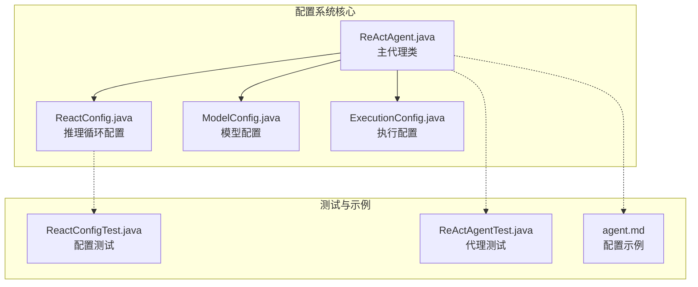
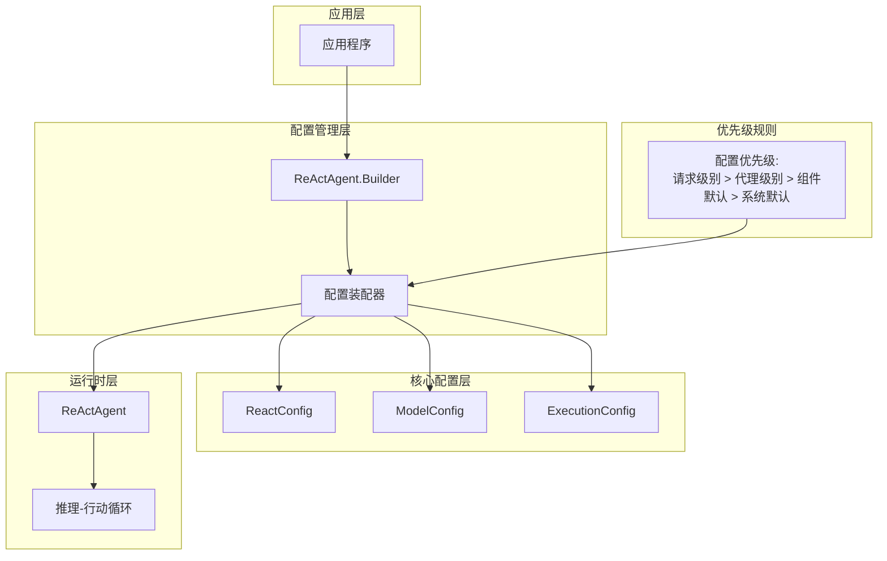
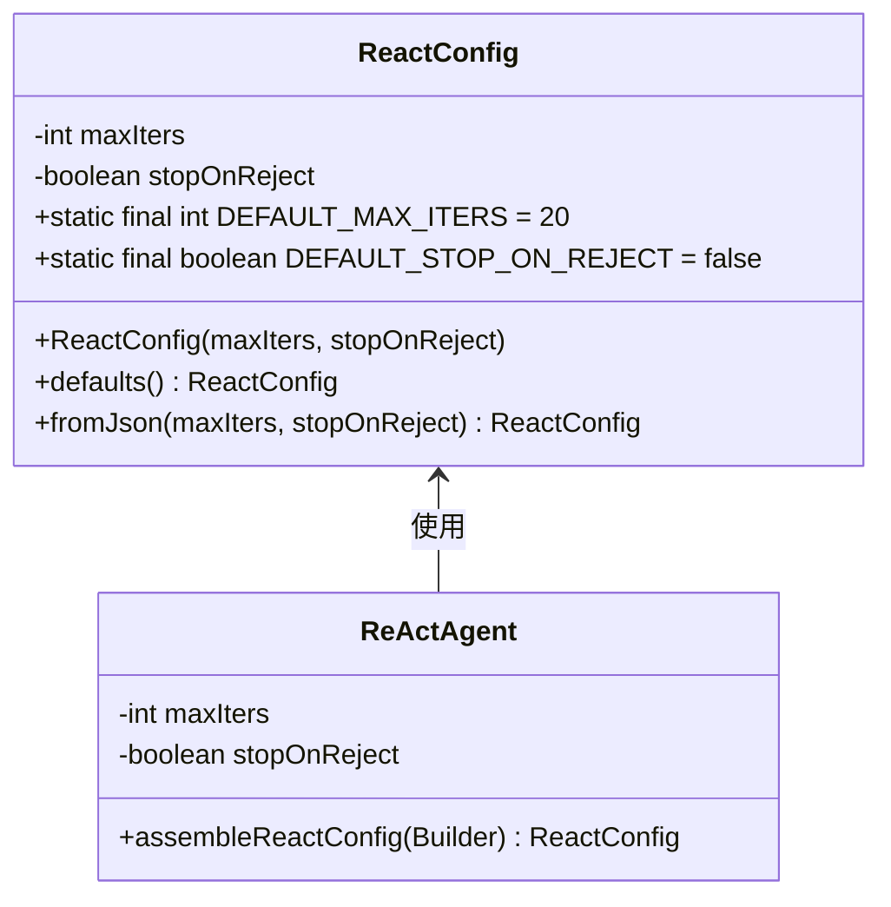
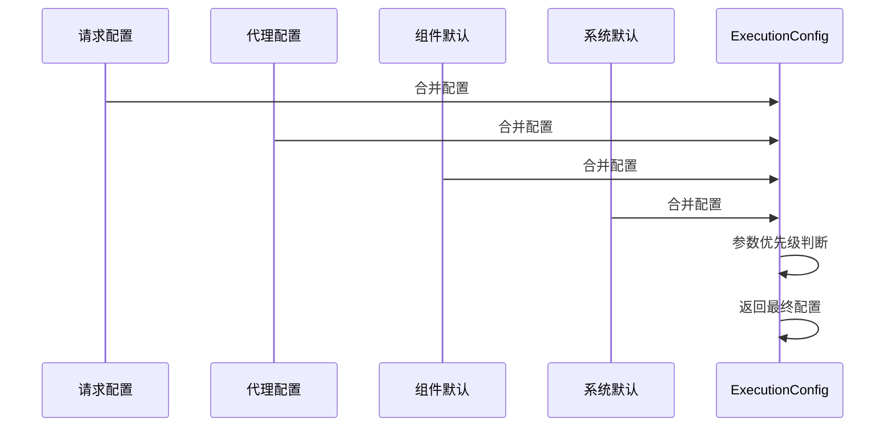
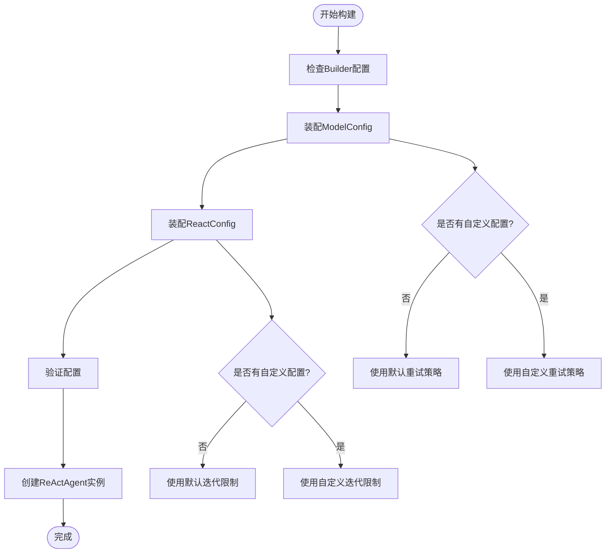
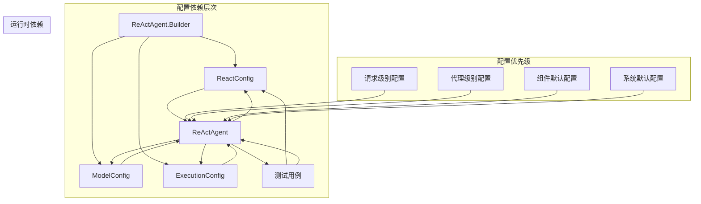

# ReAct配置系统

<cite>
**本文档引用的文件**
- [ReActAgent.java](file://agentscope-core/src/main/java/io/agentscope/core/ReActAgent.java)
- [ReactConfig.java](file://agentscope-core/src/main/java/io/agentscope/core/agent/config/ReactConfig.java)
- [ModelConfig.java](file://agentscope-core/src/main/java/io/agentscope/core/agent/config/ModelConfig.java)
- [ExecutionConfig.java](file://agentscope-core/src/main/java/io/agentscope/core/model/ExecutionConfig.java)
- [ReactConfigTest.java](file://agentscope-core/src/test/java/io/agentscope/core/agent/config/ReactConfigTest.java)
- [ReActAgentTest.java](file://agentscope-core/src/test/java/io/agentscope/core/agent/ReActAgentTest.java)
- [agent.md](file://docs/v1/en/docs/task/agent-config.md)
</cite>

## 目录
1. [简介](#简介)
2. [项目结构](#项目结构)
3. [核心组件](#核心组件)
4. [架构概览](#架构概览)
5. [详细组件分析](#详细组件分析)
6. [依赖关系分析](#依赖关系分析)
7. [性能考虑](#性能考虑)
8. [故障排除指南](#故障排除指南)
9. [结论](#结论)
10. [附录](#附录)

## 简介

ReAct配置系统是Agentscope Java框架中用于控制ReAct代理行为的核心配置机制。该系统通过多个配置类协同工作，实现了对推理-行动循环的精细控制，包括迭代次数限制、权限拒绝处理、模型调用重试策略等关键功能。

ReAct代理采用推理-行动模式，通过与语言模型的交互来执行复杂的任务。配置系统允许开发者根据不同的使用场景优化代理的行为，从简单的对话助手到复杂的问题解决器。

## 项目结构

ReAct配置系统主要分布在以下核心文件中：



**图表来源**
- [ReActAgent.java:1-200](file://agentscope-core/src/main/java/io/agentscope/core/ReActAgent.java#L1-L200)
- [ReactConfig.java:1-56](file://agentscope-core/src/main/java/io/agentscope/core/agent/config/ReactConfig.java#L1-L56)

**章节来源**
- [ReActAgent.java:1-200](file://agentscope-core/src/main/java/io/agentscope/core/ReActAgent.java#L1-L200)
- [ReactConfig.java:1-56](file://agentscope-core/src/main/java/io/agentscope/core/agent/config/ReactConfig.java#L1-L56)

## 核心组件

ReAct配置系统由四个主要组件构成，每个组件负责不同层面的配置控制：

### ReactConfig - 推理循环配置
控制ReAct代理的核心推理-行动循环行为，包括最大迭代次数和权限拒绝处理策略。

### ModelConfig - 模型配置
管理模型调用的重试策略和回退模型设置。

### ExecutionConfig - 执行配置
统一控制模型API调用和工具执行的超时、重试和回退策略。

### ReActAgent - 主代理类
整合所有配置并协调各个组件的工作。

**章节来源**
- [ReactConfig.java:22-56](file://agentscope-core/src/main/java/io/agentscope/core/agent/config/ReactConfig.java#L22-L56)
- [ModelConfig.java:21-45](file://agentscope-core/src/main/java/io/agentscope/core/agent/config/ModelConfig.java#L21-L45)
- [ExecutionConfig.java:25-54](file://agentscope-core/src/main/java/io/agentscope/core/model/ExecutionConfig.java#L25-L54)

## 架构概览

ReAct配置系统采用分层架构设计，确保配置的灵活性和可扩展性：



**图表来源**
- [ReActAgent.java:481-494](file://agentscope-core/src/main/java/io/agentscope/core/ReActAgent.java#L481-L494)
- [ExecutionConfig.java:239-291](file://agentscope-core/src/main/java/io/agentscope/core/model/ExecutionConfig.java#L239-L291)

## 详细组件分析

### ReactConfig - 推理循环控制

ReactConfig是ReAct代理的核心配置类，负责控制推理-行动循环的基本行为。

#### 配置选项详解

| 配置项 | 类型 | 默认值 | 描述 |
|--------|------|--------|------|
| maxIters | int | 20 | 单次回复中推理-行动循环的最大迭代次数 |
| stopOnReject | boolean | false | 权限拒绝是否终止循环 |

#### 关键特性

1. **迭代次数限制**: 通过maxIters参数防止无限循环，确保系统稳定性
2. **权限控制**: stopOnReject参数允许在权限拒绝时优雅终止
3. **验证机制**: 构造函数验证maxIters必须大于0



**图表来源**
- [ReactConfig.java:29-56](file://agentscope-core/src/main/java/io/agentscope/core/agent/config/ReactConfig.java#L29-L56)
- [ReActAgent.java:488-494](file://agentscope-core/src/main/java/io/agentscope/core/ReActAgent.java#L488-L494)

**章节来源**
- [ReactConfig.java:22-56](file://agentscope-core/src/main/java/io/agentscope/core/agent/config/ReactConfig.java#L22-L56)
- [ReactConfigTest.java:30-60](file://agentscope-core/src/test/java/io/agentscope/core/agent/config/ReactConfigTest.java#L30-L60)

### ModelConfig - 模型调用配置

ModelConfig专门管理模型调用的重试策略和回退机制。

#### 配置选项

| 配置项 | 类型 | 默认值 | 描述 |
|--------|------|--------|------|
| maxRetries | int | 3 | 单个模型调用的最大重试次数 |
| fallbackModel | Model | null | 主模型失败后的回退模型 |

#### 设计特点

1. **重试预算**: maxRetries参数提供可控的重试机制
2. **回退策略**: 支持主-备模型的冗余配置
3. **安全序列化**: 回退模型字段被标记为JsonIgnore，避免凭据泄露

**章节来源**
- [ModelConfig.java:21-45](file://agentscope-core/src/main/java/io/agentscope/core/agent/config/ModelConfig.java#L21-L45)
- [ReActAgent.java:483-486](file://agentscope-core/src/main/java/io/agentscope/core/ReActAgent.java#L483-L486)

### ExecutionConfig - 执行策略配置

ExecutionConfig是统一的执行配置管理器，控制模型调用和工具执行的行为。

#### 核心配置参数

| 参数 | 类型 | 默认值 | 描述 |
|------|------|--------|------|
| timeout | Duration | 5分钟 | 单次执行的超时时间 |
| maxAttempts | Integer | 3次 | 最大尝试次数 |
| initialBackoff | Duration | 2秒 | 初始退避时间 |
| maxBackoff | Duration | 30秒 | 最大退避时间 |
| backoffMultiplier | Double | 2.0 | 退避倍数 |
| retryOn | Predicate | RETRYABLE_ERRORS | 重试条件 |

#### 优先级合并机制



**图表来源**
- [ExecutionConfig.java:239-291](file://agentscope-core/src/main/java/io/agentscope/core/model/ExecutionConfig.java#L239-L291)

**章节来源**
- [ExecutionConfig.java:25-389](file://agentscope-core/src/main/java/io/agentscope/core/model/ExecutionConfig.java#L25-L389)

### ReActAgent - 配置装配器

ReActAgent类负责将各种配置组合成完整的代理实例。

#### 装配过程



**图表来源**
- [ReActAgent.java:481-494](file://agentscope-core/src/main/java/io/agentscope/core/ReActAgent.java#L481-L494)

**章节来源**
- [ReActAgent.java:289-331](file://agentscope-core/src/main/java/io/agentscope/core/ReActAgent.java#L289-L331)

## 依赖关系分析

ReAct配置系统各组件之间存在清晰的依赖关系：



**图表来源**
- [ReActAgent.java:481-494](file://agentscope-core/src/main/java/io/agentscope/core/ReActAgent.java#L481-L494)
- [ExecutionConfig.java:239-291](file://agentscope-core/src/main/java/io/agentscope/core/model/ExecutionConfig.java#L239-L291)

### 配置优先级规则

配置系统遵循严格的优先级规则，确保配置的一致性和可预测性：

1. **请求级别配置** (最高优先级)
2. **代理级别配置**
3. **组件默认配置**
4. **系统默认配置** (最低优先级)

这种设计允许开发者在不同粒度上控制代理行为，从全局默认到单次调用的精细调整。

**章节来源**
- [ExecutionConfig.java:239-291](file://agentscope-core/src/main/java/io/agentscope/core/model/ExecutionConfig.java#L239-L291)

## 性能考虑

ReAct配置系统在设计时充分考虑了性能因素：

### 迭代次数限制
- 默认20次迭代限制防止无限循环
- 可根据任务复杂度调整以平衡性能和准确性

### 重试策略优化
- 指数退避算法减少服务器压力
- 自适应超时时间提高响应效率

### 内存管理
- 配置对象不可变设计减少内存开销
- 深拷贝工具包避免状态干扰

## 故障排除指南

### 常见配置问题

#### 1. 配置验证错误
**问题**: IllegalArgumentException关于maxIters或maxRetries
**原因**: 配置值不符合要求
**解决方案**: 确保maxIters > 0且maxRetries > 0

#### 2. 权限拒绝导致的循环终止
**问题**: stopOnReject设置导致提前终止
**原因**: 工具调用被权限引擎拒绝
**解决方案**: 检查权限配置或设置stopOnReject=false

#### 3. 超时问题
**问题**: ExecutionConfig超时设置不当
**原因**: timeout过短或过长
**解决方案**: 根据任务类型调整超时时间

### 性能优化建议

#### 对话助手场景
```java
// 配置示例：对话助手优化
ReActAgent agent = ReActAgent.builder()
    .maxIters(5)                    // 减少迭代次数
    .modelExecutionConfig(          // 适中的模型重试
        ExecutionConfig.builder()
            .timeout(Duration.ofSeconds(30))
            .maxAttempts(2)
            .build())
    .toolExecutionConfig(           // 工具调用快速失败
        ExecutionConfig.builder()
            .timeout(Duration.ofSeconds(10))
            .maxAttempts(1)
            .build())
    .build();
```

#### 任务执行器场景
```java
// 配置示例：任务执行器优化
ReActAgent agent = ReActAgent.builder()
    .maxIters(30)                   // 更多迭代机会
    .modelExecutionConfig(          // 较强的模型重试
        ExecutionConfig.builder()
            .timeout(Duration.ofMinutes(2))
            .maxAttempts(5)
            .initialBackoff(Duration.ofSeconds(1))
            .build())
    .toolExecutionConfig(           // 工具调用可靠重试
        ExecutionConfig.builder()
            .timeout(Duration.ofSeconds(30))
            .maxAttempts(3)
            .build())
    .build();
```

**章节来源**
- [ReActAgentTest.java:93-140](file://agentscope-core/src/test/java/io/agentscope/core/agent/ReActAgentTest.java#L93-L140)
- [agent.md:474-771](file://docs/v1/en/docs/task/agent-config.md#L474-L771)

## 结论

ReAct配置系统通过精心设计的分层架构和明确的优先级规则，为开发者提供了强大而灵活的配置能力。系统的主要优势包括：

1. **模块化设计**: 每个配置类职责明确，便于理解和维护
2. **灵活的优先级机制**: 支持多层级配置覆盖
3. **性能优化**: 通过合理的默认值和配置选项平衡性能与功能
4. **安全性**: 通过JsonIgnore等机制保护敏感信息
5. **可扩展性**: 易于添加新的配置选项和功能

该配置系统能够满足从简单对话到复杂任务执行的各种应用场景，为构建高性能的AI代理提供了坚实的基础。

## 附录

### 配置最佳实践

#### 开发环境配置
- 使用较低的maxIters值进行快速迭代
- 设置较短的超时时间便于调试
- 启用详细的日志记录

#### 生产环境配置
- 根据SLA要求设置合适的超时时间
- 配置适当的重试策略
- 监控配置效果并定期优化

#### 安全考虑
- 避免在配置中硬编码敏感信息
- 使用环境变量管理密钥
- 定期审查权限配置