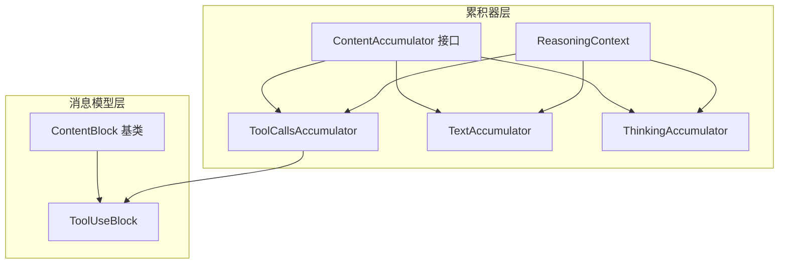
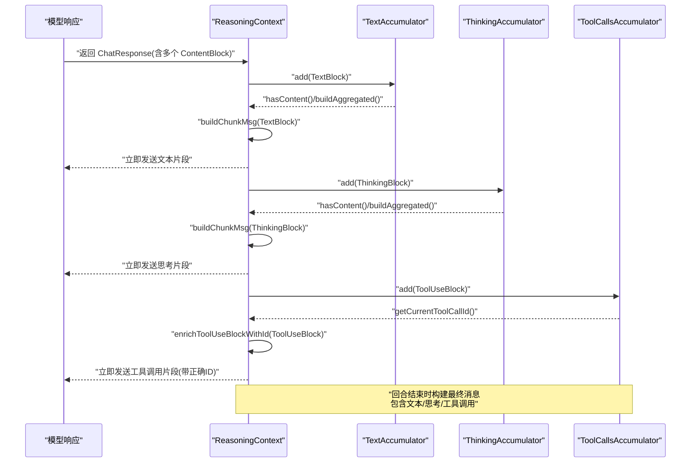
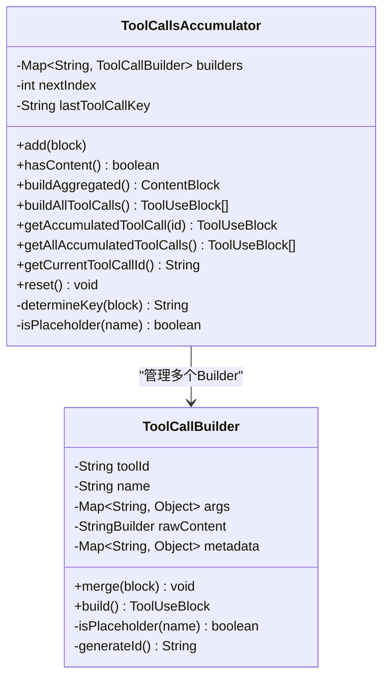
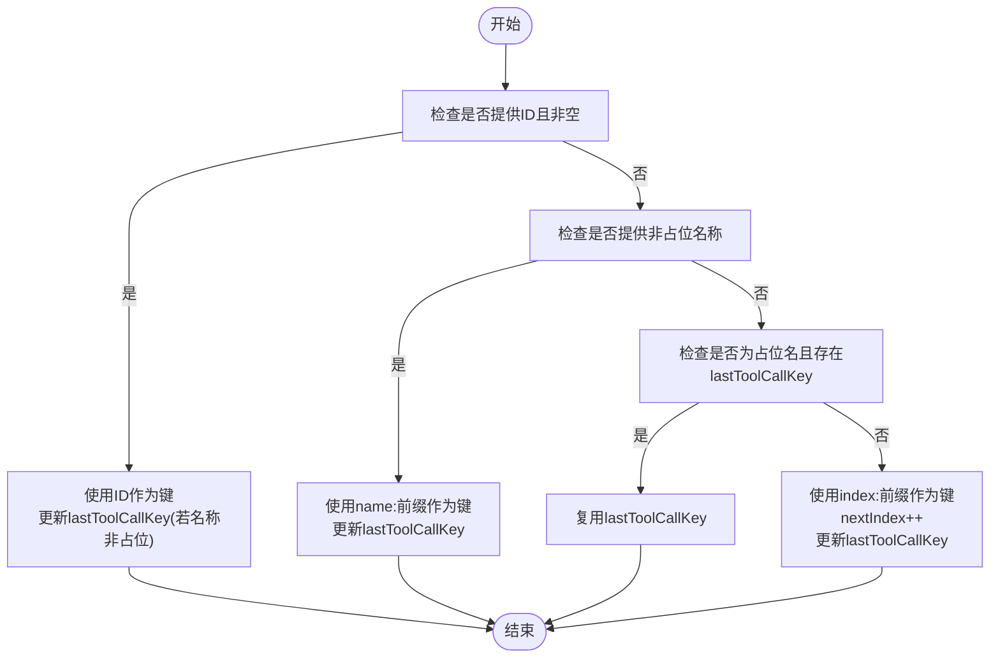
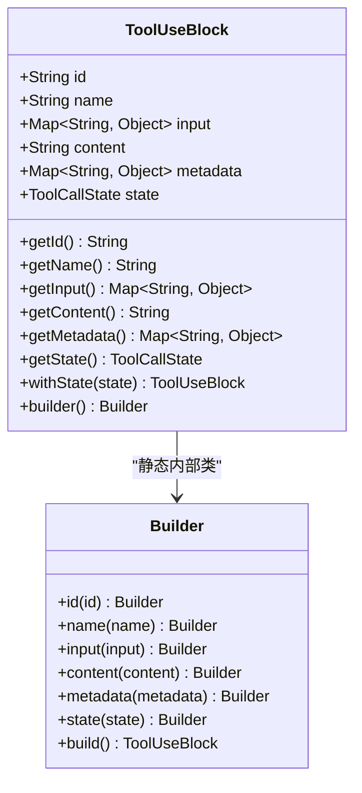
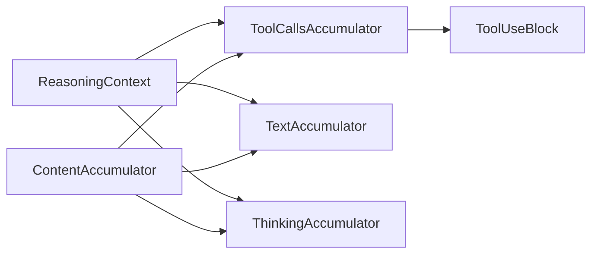

# 工具调用累积器

<cite>
**本文引用的文件**
- [ToolCallsAccumulator.java](file://agentscope-core/src/main/java/io/agentscope/core/agent/accumulator/ToolCallsAccumulator.java)
- [ContentAccumulator.java](file://agentscope-core/src/main/java/io/agentscope/core/agent/accumulator/ContentAccumulator.java)
- [TextAccumulator.java](file://agentscope-core/src/main/java/io/agentscope/core/agent/accumulator/TextAccumulator.java)
- [ThinkingAccumulator.java](file://agentscope-core/src/main/java/io/agentscope/core/agent/accumulator/ThinkingAccumulator.java)
- [ReasoningContext.java](file://agentscope-core/src/main/java/io/agentscope/core/agent/accumulator/ReasoningContext.java)
- [ToolUseBlock.java](file://agentscope-core/src/main/java/io/agentscope/core/message/ToolUseBlock.java)
- [ContentBlock.java](file://agentscope-core/src/main/java/io/agentscope/core/message/ContentBlock.java)
- [ToolCallsAccumulatorTest.java](file://agentscope-core/src/test/java/io/agentscope/core/agent/accumulator/ToolCallsAccumulatorTest.java)
- [ToolNotificationMiddleware.java](file://agentscope-examples/agents/agentscope-builder/src/main/java/io/agentscope/builder/web/toolbus/ToolNotificationMiddleware.java)
</cite>

## 目录
1. [简介](#简介)
2. [项目结构](#项目结构)
3. [核心组件](#核心组件)
4. [架构总览](#架构总览)
5. [详细组件分析](#详细组件分析)
6. [依赖分析](#依赖分析)
7. [性能考虑](#性能考虑)
8. [故障排查指南](#故障排查指南)
9. [结论](#结论)
10. [附录：使用示例与最佳实践](#附录使用示例与最佳实践)

## 简介
本文件面向“工具调用累积器”系统，围绕 ToolCallsAccumulator 的设计理念、实现机制与数据聚合流程进行深入技术说明，并阐明其与文本累积器、思考累积器等协同工作的方式。文档同时给出关键流程图与时序图，帮助读者理解从流式片段到最终聚合输出的全过程，并提供性能优化与错误处理的最佳实践。

## 项目结构
工具调用累积器位于 agentscope-core 模块的 agent/accumulator 包中，配合 message 层的内容块类型（如 ToolUseBlock、ContentBlock）共同完成多模态内容的累积与构建。下图展示了相关类之间的组织关系与职责边界：

图表来源
- [ContentAccumulator.java:29-60](file://agentscope-core/src/main/java/io/agentscope/core/agent/accumulator/ContentAccumulator.java#L29-L60)
- [ToolCallsAccumulator.java:40-305](file://agentscope-core/src/main/java/io/agentscope/core/agent/accumulator/ToolCallsAccumulator.java#L40-L305)
- [TextAccumulator.java:27-77](file://agentscope-core/src/main/java/io/agentscope/core/agent/accumulator/TextAccumulator.java#L27-L77)
- [ThinkingAccumulator.java:28-78](file://agentscope-core/src/main/java/io/agentscope/core/agent/accumulator/ThinkingAccumulator.java#L28-L78)
- [ReasoningContext.java:44-290](file://agentscope-core/src/main/java/io/agentscope/core/agent/accumulator/ReasoningContext.java#L44-L290)
- [ContentBlock.java:58-67](file://agentscope-core/src/main/java/io/agentscope/core/message/ContentBlock.java#L58-L67)
- [ToolUseBlock.java:34-119](file://agentscope-core/src/main/java/io/agentscope/core/message/ToolUseBlock.java#L34-L119)

章节来源
- [ToolCallsAccumulator.java:40-305](file://agentscope-core/src/main/java/io/agentscope/core/agent/accumulator/ToolCallsAccumulator.java#L40-L305)
- [ReasoningContext.java:44-290](file://agentscope-core/src/main/java/io/agentscope/core/agent/accumulator/ReasoningContext.java#L44-L290)

## 核心组件
- ContentAccumulator 接口：定义累积器的统一契约，包括添加片段、判断是否有内容、构建聚合内容、重置状态。
- ToolCallsAccumulator：专门用于累积流式工具调用片段，支持并行多调用、参数增量合并、原始 JSON 内容拼接与解析、占位名处理与回退策略。
- TextAccumulator：按顺序拼接文本片段，生成完整文本内容。
- ThinkingAccumulator：按顺序拼接思考片段，生成完整思考内容。
- ReasoningContext：封装一次推理回合内的所有累积器实例，负责将不同类型的片段实时输出（流式），并在回合结束时构建最终消息（含文本、思考、工具调用）。

章节来源
- [ContentAccumulator.java:29-60](file://agentscope-core/src/main/java/io/agentscope/core/agent/accumulator/ContentAccumulator.java#L29-L60)
- [ToolCallsAccumulator.java:40-305](file://agentscope-core/src/main/java/io/agentscope/core/agent/accumulator/ToolCallsAccumulator.java#L40-L305)
- [TextAccumulator.java:27-77](file://agentscope-core/src/main/java/io/agentscope/core/agent/accumulator/TextAccumulator.java#L27-L77)
- [ThinkingAccumulator.java:28-78](file://agentscope-core/src/main/java/io/agentscope/core/agent/accumulator/ThinkingAccumulator.java#L28-L78)
- [ReasoningContext.java:44-290](file://agentscope-core/src/main/java/io/agentscope/core/agent/accumulator/ReasoningContext.java#L44-L290)

## 架构总览
下图展示了 ReasoningContext 在一次推理回合中对不同内容块的处理流程：文本与思考直接实时输出；工具调用先累积再实时输出，同时确保片段能正确携带工具调用 ID。

图表来源
- [ReasoningContext.java:79-127](file://agentscope-core/src/main/java/io/agentscope/core/agent/accumulator/ReasoningContext.java#L79-L127)
- [ReasoningContext.java:147-190](file://agentscope-core/src/main/java/io/agentscope/core/agent/accumulator/ReasoningContext.java#L147-L190)
- [ReasoningContext.java:210-230](file://agentscope-core/src/main/java/io/agentscope/core/agent/accumulator/ReasoningContext.java#L210-L230)
- [ToolCallsAccumulator.java:283-294](file://agentscope-core/src/main/java/io/agentscope/core/agent/accumulator/ToolCallsAccumulator.java#L283-L294)

## 详细组件分析

### ToolCallsAccumulator 设计与实现
- 多并发工具调用支持：通过 LinkedHashMap 维护每个工具调用的 Builder，键值优先级为“ID > 名称 > 占位名回退 > 索引”，保证同一轮次内可区分并行调用。
- 参数增量合并：当输入参数来自多个片段时，采用 Map 合并策略，后到片段覆盖先前片段的同名键。
- 原始 JSON 内容拼接与解析：若片段仅包含 content 字段（原始 JSON 片段），则累积后尝试解析为对象映射；若解析失败或非对象，则回退为空对象，确保 content 字段始终为合法 JSON 对象。
- 占位名处理：对以“__”开头的名称（如“__fragment__”、“__pending__”）视为占位名，不作为稳定键使用，但允许在已有 lastToolCallKey 下复用，保障流式片段的正确归属。
- 最终构建：将每个 Builder 转换为 ToolUseBlock，必要时自动生成 ID；保留元数据（如特定供应商签名）。

图表来源
- [ToolCallsAccumulator.java:40-305](file://agentscope-core/src/main/java/io/agentscope/core/agent/accumulator/ToolCallsAccumulator.java#L40-L305)

章节来源
- [ToolCallsAccumulator.java:40-305](file://agentscope-core/src/main/java/io/agentscope/core/agent/accumulator/ToolCallsAccumulator.java#L40-L305)

### 关键算法流程：工具调用键确定与片段归属

图表来源
- [ToolCallsAccumulator.java:168-195](file://agentscope-core/src/main/java/io/agentscope/core/agent/accumulator/ToolCallsAccumulator.java#L168-L195)

章节来源
- [ToolCallsAccumulator.java:168-195](file://agentscope-core/src/main/java/io/agentscope/core/agent/accumulator/ToolCallsAccumulator.java#L168-L195)

### ToolUseBlock 数据结构与状态管理
- 字段：id、name、input（参数映射）、content（原始 JSON 字符串，用于流式拼接）、metadata（供应商特定元数据）、state（调用状态，默认待定）。
- 不可变性：构造时进行防御式拷贝，防止外部修改。
- Builder 模式：提供链式设置方法，便于测试与示例使用。
- 状态变更：通过 withState 返回新实例，保持不可变语义。

图表来源
- [ToolUseBlock.java:34-119](file://agentscope-core/src/main/java/io/agentscope/core/message/ToolUseBlock.java#L34-L119)
- [ToolUseBlock.java:193-285](file://agentscope-core/src/main/java/io/agentscope/core/message/ToolUseBlock.java#L193-L285)

章节来源
- [ToolUseBlock.java:34-119](file://agentscope-core/src/main/java/io/agentscope/core/message/ToolUseBlock.java#L34-L119)
- [ToolUseBlock.java:193-285](file://agentscope-core/src/main/java/io/agentscope/core/message/ToolUseBlock.java#L193-L285)

### 文本与思考累积器
- TextAccumulator：将 TextBlock 的文本按顺序拼接，支持获取累积字符串与重置。
- ThinkingAccumulator：将 ThinkingBlock 的思考内容按顺序拼接，支持获取累积字符串与重置。
- 两者均实现 ContentAccumulator 接口，遵循统一的生命周期与构建策略。

章节来源
- [TextAccumulator.java:27-77](file://agentscope-core/src/main/java/io/agentscope/core/agent/accumulator/TextAccumulator.java#L27-L77)
- [ThinkingAccumulator.java:28-78](file://agentscope-core/src/main/java/io/agentscope/core/agent/accumulator/ThinkingAccumulator.java#L28-L78)

### ReasoningContext：推理回合的协调者
- 职责：持有三个累积器实例，接收 ChatResponse 的内容块，分别交由对应累积器处理；对工具调用片段进行 ID 填充，确保流式片段可被正确拼接；回合结束时构建完整消息，包含文本、思考与所有工具调用。
- 实时输出：文本与思考块在到达时即刻构建消息并加入已发送列表；工具调用块同样实时输出，但会根据当前正在累积的工具调用 ID 进行增强。
- 使用 ChatUsage：累积输入/输出令牌与缓存令牌及耗时，最终写入消息元数据。

章节来源
- [ReasoningContext.java:44-290](file://agentscope-core/src/main/java/io/agentscope/core/agent/accumulator/ReasoningContext.java#L44-L290)

## 依赖分析
- ToolCallsAccumulator 依赖 ToolUseBlock 与 JsonUtils（JSON 解析与校验）。
- ReasoningContext 依赖 TextAccumulator、ThinkingAccumulator、ToolCallsAccumulator 以及 ContentBlock/ToolUseBlock。
- ContentAccumulator 为接口，被上述三类累积器实现。
- 测试用例 ToolCallsAccumulatorTest 验证了元数据保留、并行调用、流式片段拼接、中断场景下的 JSON 安全性等行为。

图表来源
- [ToolCallsAccumulator.java:40-305](file://agentscope-core/src/main/java/io/agentscope/core/agent/accumulator/ToolCallsAccumulator.java#L40-L305)
- [ReasoningContext.java:44-290](file://agentscope-core/src/main/java/io/agentscope/core/agent/accumulator/ReasoningContext.java#L44-L290)
- [ContentAccumulator.java:29-60](file://agentscope-core/src/main/java/io/agentscope/core/agent/accumulator/ContentAccumulator.java#L29-L60)

章节来源
- [ToolCallsAccumulatorTest.java:45-415](file://agentscope-core/src/test/java/io/agentscope/core/agent/accumulator/ToolCallsAccumulatorTest.java#L45-L415)

## 性能考虑
- 键选择策略：优先使用 ID，其次名称，最后索引。该策略减少冲突概率，提升并行调用识别效率。
- 原始 JSON 拼接与解析：避免重复解析，仅在构建阶段尝试解析；对非对象 JSON 回退为空对象，降低后续序列化开销。
- 流式输出：文本与思考即时输出，工具调用在累积的同时输出，减少端到端延迟。
- 元数据合并：仅在首次出现时记录，避免重复写入。
- 建议
  - 控制累积器数量与并发度，避免过多并行调用导致内存压力。
  - 对于长 JSON 片段，尽量保证片段完整性，减少解析失败带来的回退成本。
  - 在高并发场景下，合理设置线程池与背压策略，避免累积器堆积。

## 故障排查指南
- 工具调用 ID 缺失：当片段名称为占位名或未提供 ID 时，需依赖 getCurrentToolCallId 获取当前调用 ID 并进行增强；若仍为空，检查上游是否遗漏 ID 或键确定逻辑是否被意外跳过。
- 中断流导致的非法 JSON：若流式片段在参数中间被截断，content 将无法解析为对象，构建时会回退为空对象；请确认上游输出的完整性或在上层做校验。
- 元数据丢失：确保在首个片段中提供元数据（如供应商签名），累积器会保留并随最终块一并输出。
- 并发调用错乱：检查 determineKey 的键生成逻辑，确保 ID 与名称的唯一性；必要时显式提供 ID 以避免索引键冲突。

章节来源
- [ToolCallsAccumulator.java:168-195](file://agentscope-core/src/main/java/io/agentscope/core/agent/accumulator/ToolCallsAccumulator.java#L168-L195)
- [ToolCallsAccumulator.java:86-123](file://agentscope-core/src/main/java/io/agentscope/core/agent/accumulator/ToolCallsAccumulator.java#L86-L123)
- [ReasoningContext.java:210-230](file://agentscope-core/src/main/java/io/agentscope/core/agent/accumulator/ReasoningContext.java#L210-L230)

## 结论
ToolCallsAccumulator 通过明确的键确定策略、增量参数合并与安全的 JSON 拼接解析，实现了对流式工具调用的稳健累积。结合 TextAccumulator、ThinkingAccumulator 与 ReasoningContext，系统能够在保持低延迟的同时，产出结构化且一致的最终消息。测试用例覆盖了典型与边界场景，验证了累积器在真实流式场景中的可靠性。

## 附录：使用示例与最佳实践
- 配置与使用要点
  - 在推理上下文中注册并使用 ReasoningContext，确保文本、思考与工具调用三类累积器协同工作。
  - 对于工具调用，建议上游提供稳定的 ID；若不可用，累积器会回退到名称或索引键，但仍建议尽量提供 ID。
  - 对于流式片段，优先提供完整 JSON 片段；若片段可能被截断，请在上层进行完整性校验。
- 中间结果与最终输出
  - 中间结果：文本与思考块在到达时即可输出；工具调用块在累积的同时输出，必要时进行 ID 增强。
  - 最终输出：回合结束时，ReasoningContext 将文本、思考与所有工具调用整合为一条消息，并附带累积的用量信息。
- 集成参考
  - 示例中间件通过遍历输入中的工具调用并发布事件，体现工具调用在业务层的消费方式。

章节来源
- [ToolNotificationMiddleware.java:57-77](file://agentscope-examples/agents/agentscope-builder/src/main/java/io/agentscope/builder/web/toolbus/ToolNotificationMiddleware.java#L57-L77)
- [ReasoningContext.java:79-127](file://agentscope-core/src/main/java/io/agentscope/core/agent/accumulator/ReasoningContext.java#L79-L127)
- [ReasoningContext.java:147-190](file://agentscope-core/src/main/java/io/agentscope/core/agent/accumulator/ReasoningContext.java#L147-L190)