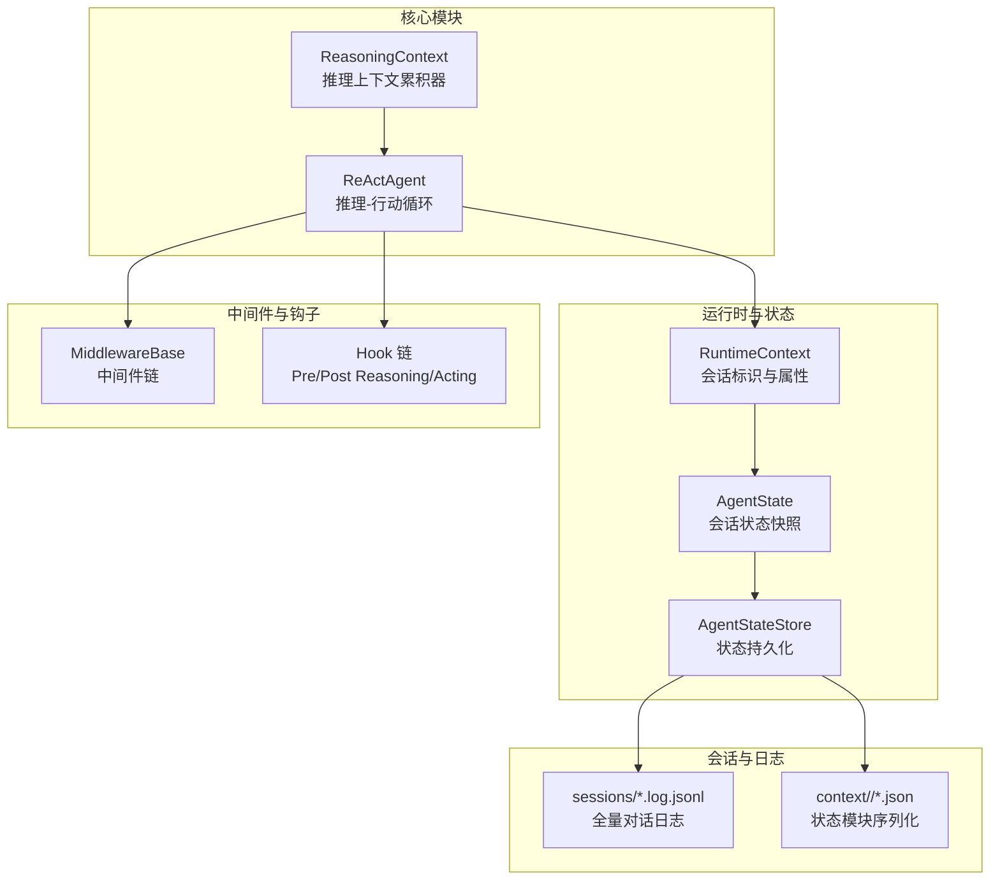
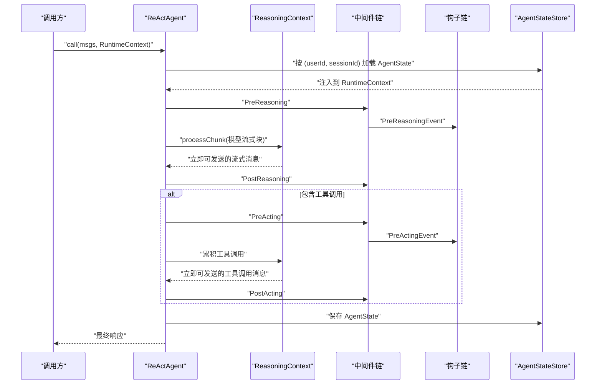
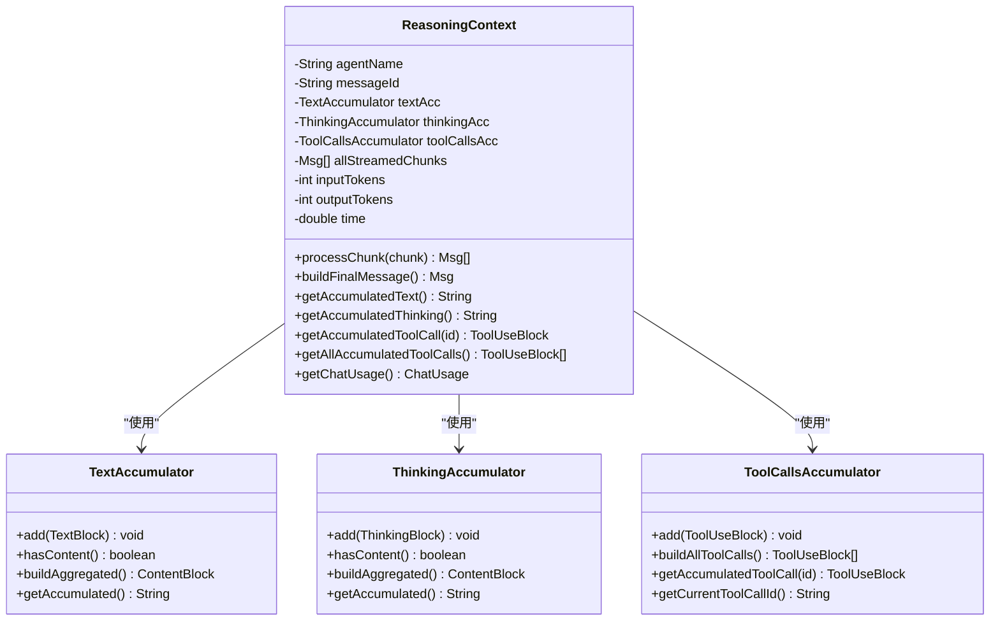
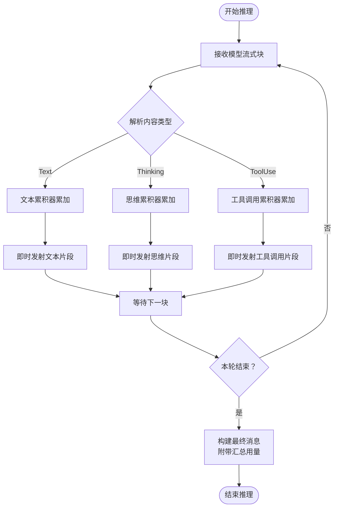
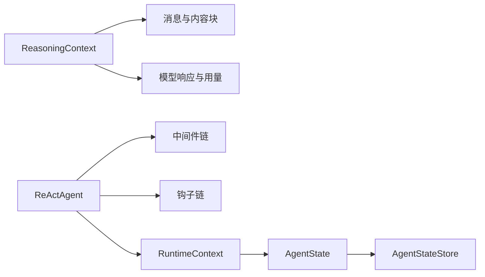

# 推理上下文管理

<cite>
**本文引用的文件**   
- [ReasoningContext.java](file://agentscope-core/src/main/java/io/agentscope/core/agent/accumulator/ReasoningContext.java)
- [ReasoningContextTest.java](file://agentscope-core/src/test/java/io/agentscope/core/agent/accumulator/ReasoningContextTest.java)
- [ReActAgent.java](file://agentscope-core/src/main/java/io/agentscope/core/ReActAgent.java)
- [context.md](file://docs/v2/en/docs/building-blocks/context.md)
- [middleware.md](file://docs/v2/en/docs/building-blocks/middleware.md)
- [architecture.md](file://docs/v1/en/docs/harness/architecture.md)
- [session.md](file://docs/v1/en/docs/harness/session.md)
- [key-concepts.md](file://docs/v1/en/docs/quickstart/key-concepts.md)
- [compaction.md](file://docs/v2/en/docs/harness/compaction.md)
- [memory.md](file://docs/v1/en/docs/harness/memory.md)
</cite>

## 目录
1. [简介](#简介)
2. [项目结构](#项目结构)
3. [核心组件](#核心组件)
4. [架构总览](#架构总览)
5. [详细组件分析](#详细组件分析)
6. [依赖关系分析](#依赖关系分析)
7. [性能考量](#性能考量)
8. [故障排查指南](#故障排查指南)
9. [结论](#结论)
10. [附录](#附录)

## 简介
本文件聚焦“推理上下文管理系统”，围绕 ReasoningContext 类展开，系统阐述其设计目的、数据结构与管理机制，解释其在 ReAct 循环中的作用、思维累积器的工作原理与数据流转过程，并说明推理上下文的状态维护、历史记录保存与上下文窗口管理。文档还提供基于仓库现有资料的使用示例路径、性能优化建议与内存管理策略。

## 项目结构
围绕推理上下文管理的关键文件与模块如下：
- 核心类：ReasoningContext（推理上下文累积器）
- 关联类：ReActAgent（推理-行动循环引擎）
- 文档与规范：context.md、middleware.md、architecture.md、session.md、key-concepts.md、compaction.md、memory.md

图示来源
- [ReActAgent.java:148-200](file://agentscope-core/src/main/java/io/agentscope/core/ReActAgent.java#L148-L200)
- [context.md:52-79](file://docs/v2/en/docs/building-blocks/context.md#L52-L79)
- [session.md:35-59](file://docs/v1/en/docs/harness/session.md#L35-L59)

章节来源
- [ReActAgent.java:148-200](file://agentscope-core/src/main/java/io/agentscope/core/ReActAgent.java#L148-L200)
- [context.md:52-79](file://docs/v2/en/docs/building-blocks/context.md#L52-L79)
- [session.md:35-59](file://docs/v1/en/docs/harness/session.md#L35-L59)

## 核心组件
- ReasoningContext：负责单轮推理内的内容累积（文本、思维、工具调用），实时生成流式消息并构建最终聚合消息，同时汇总计费用量（输入/输出 token、耗时）。
- ReActAgent：承载 ReAct 循环，驱动推理与行动阶段，通过中间件与钩子扩展能力，并与 RuntimeContext、AgentState 协作实现状态持久化与恢复。
- RuntimeContext：轻量级每调用元数据载体，选择会话槽位并注入 call-scoped AgentState。
- AgentState/AgentStateStore：会话状态的加载、修改与持久化，支持分布式后端（如 Redis）。
- 中间件与钩子：在推理/行动各阶段注入上下文、执行压缩、工具结果卸载等操作。

章节来源
- [ReasoningContext.java:32-44](file://agentscope-core/src/main/java/io/agentscope/core/agent/accumulator/ReasoningContext.java#L32-L44)
- [ReActAgent.java:148-200](file://agentscope-core/src/main/java/io/agentscope/core/ReActAgent.java#L148-L200)
- [context.md:252-279](file://docs/v2/en/docs/building-blocks/context.md#L252-L279)

## 架构总览
推理上下文贯穿 ReAct 循环：模型流式响应经 ReasoningContext 累积与分发，中间件/钩子在关键节点读取/写入 AgentState，最终在会话层面持久化。

图示来源
- [architecture.md:134-182](file://docs/v1/en/docs/harness/architecture.md#L134-L182)
- [middleware.md:215-254](file://docs/v2/en/docs/building-blocks/middleware.md#L215-L254)
- [context.md:52-79](file://docs/v2/en/docs/building-blocks/context.md#L52-L79)

## 详细组件分析

### ReasoningContext 设计与职责
- 设计目的：在单轮推理中统一管理文本、思维与工具调用的累积与分发，支持实时流式展示与最终聚合消息构建，同时汇总计费用量。
- 数据结构与累积器：
  - 文本累积器：累积 TextBlock，支持即时发射与累计字符串获取。
  - 思维累积器：累积 ThinkingBlock，支持即时发射与累计字符串获取。
  - 工具调用累积器：累积 ToolUseBlock，支持多并发工具调用的即时发射与按 ID 聚合。
  - 流式消息缓冲：记录已发射的片段消息，便于追踪与审计。
  - 计费用量：累积 inputTokens、outputTokens、time，最终写入消息元数据。
- 处理流程：
  - processChunk：解析 ChatResponse 的 ContentBlock，分别交由对应累积器处理；对 ToolUseBlock 进行 ID 补全后即时发射；返回可立即发送的消息列表。
  - buildFinalMessage：按“思维 → 文本 → 工具调用”的顺序组装最终 AssistantMessage，附带汇总的 ChatUsage。
  - 查询接口：getAccumulatedText、getAccumulatedThinking、getAccumulatedToolCall、getAllAccumulatedToolCalls、getChatUsage。

图示来源
- [ReasoningContext.java:44-287](file://agentscope-core/src/main/java/io/agentscope/core/agent/accumulator/ReasoningContext.java#L44-L287)

章节来源
- [ReasoningContext.java:64-125](file://agentscope-core/src/main/java/io/agentscope/core/agent/accumulator/ReasoningContext.java#L64-L125)
- [ReasoningContext.java:127-187](file://agentscope-core/src/main/java/io/agentscope/core/agent/accumulator/ReasoningContext.java#L127-L187)
- [ReasoningContext.java:189-227](file://agentscope-core/src/main/java/io/agentscope/core/agent/accumulator/ReasoningContext.java#L189-L227)
- [ReasoningContext.java:229-287](file://agentscope-core/src/main/java/io/agentscope/core/agent/accumulator/ReasoningContext.java#L229-L287)

### 在 ReAct 循环中的作用
- 推理阶段：模型返回流式块，ReActAgent 将块交给 ReasoningContext 累积与发射，中间件可在 Pre/PostReasoning 钩子中读取 AgentState 并进行上下文注入或压缩。
- 行动阶段：若包含工具调用，ReActAgent 逐个执行工具，工具结果回写至 AgentState；ReasoningContext 同样对工具调用进行累积与即时发射。
- 最终聚合：buildFinalMessage 将本轮的思维、文本与工具调用整合为一条 AssistantMessage，附带汇总用量，供后续持久化与审计。

图示来源
- [key-concepts.md:7-56](file://docs/v1/en/docs/quickstart/key-concepts.md#L7-L56)
- [middleware.md:215-254](file://docs/v2/en/docs/building-blocks/middleware.md#L215-L254)

章节来源
- [key-concepts.md:7-56](file://docs/v1/en/docs/quickstart/key-concepts.md#L7-L56)
- [middleware.md:215-254](file://docs/v2/en/docs/building-blocks/middleware.md#L215-L254)

### 思维累积器与数据流转
- 思维累积器：将 ThinkingBlock 累积为完整内容，支持即时发射与累计字符串查询。
- 工具调用累积器：支持多并发工具调用，按 ID 聚合片段（包括占位片段），并在发射时补全 ID，确保用户侧能正确拼接。
- 文本累积器：与思维/工具调用并行处理，保证文本与工具调用的发射互不阻塞。

章节来源
- [ReasoningContext.java:92-122](file://agentscope-core/src/main/java/io/agentscope/core/agent/accumulator/ReasoningContext.java#L92-L122)
- [ReasoningContext.java:108-121](file://agentscope-core/src/main/java/io/agentscope/core/agent/accumulator/ReasoningContext.java#L108-L121)
- [ReasoningContext.java:207-227](file://agentscope-core/src/main/java/io/agentscope/core/agent/accumulator/ReasoningContext.java#L207-L227)

### 推理上下文的状态维护与历史记录
- 状态槽位：RuntimeContext 的 sessionId 与 userId 选择会话槽位；AgentStateStore 以 (userId, sessionId) 为键加载/保存状态。
- 自动持久化：每次 call 结束保存 AgentState；中间态在内存中更新，降低后端写入压力。
- 历史记录：
  - sessions/*.log.jsonl：永不压缩的全量对话日志，用于审计与检索。
  - context/<sid>/*.json：状态模块序列化文件，按 SessionKey 分片存储。
- 会话树：sessions/sessions.json 管理会话索引（sessionId、父会话、摘要、更新时间）。

章节来源
- [context.md:52-79](file://docs/v2/en/docs/building-blocks/context.md#L52-L79)
- [session.md:35-59](file://docs/v1/en/docs/harness/session.md#L35-L59)

### 上下文窗口管理与压缩
- 上下文压缩：当对话长度超过阈值时，触发 ConversationCompactor 将前缀摘要化，保留尾部消息，减少 token 使用。
- 记忆子系统：双层记忆（日流水账与策划后长期记忆），定期合并与去重；工具结果过大时卸载至磁盘并以占位符替换。
- 溢出兜底：当模型返回上下文过长错误时，强制压缩并重试一次。

章节来源
- [memory.md:1-34](file://docs/v1/en/docs/harness/memory.md#L1-L34)
- [compaction.md:84-93](file://docs/v2/en/docs/harness/compaction.md#L84-L93)
- [architecture.md:134-182](file://docs/v1/en/docs/harness/architecture.md#L134-L182)

### 使用示例（基于仓库文档与测试）
- 构造 RuntimeContext 并传递给 ReActAgent：
  - 示例路径：[context.md:256-267](file://docs/v2/en/docs/building-blocks/context.md#L256-L267)
- 在中间件中读取 RuntimeContext：
  - 示例路径：[middleware.md:215-218](file://docs/v2/en/docs/building-blocks/middleware.md#L215-L218)
- 推理上下文用量聚合与发射：
  - 单块用量聚合：[ReasoningContextTest.java:46-75](file://agentscope-core/src/test/java/io/agentscope/core/agent/accumulator/ReasoningContextTest.java#L46-L75)
  - 多块用量累加：[ReasoningContextTest.java:77-123](file://agentscope-core/src/test/java/io/agentscope/core/agent/accumulator/ReasoningContextTest.java#L77-L123)
  - 工具调用即时发射：[ReasoningContextTest.java:183-205](file://agentscope-core/src/test/java/io/agentscope/core/agent/accumulator/ReasoningContextTest.java#L183-L205)
  - 多并发工具调用：[ReasoningContextTest.java:207-240](file://agentscope-core/src/test/java/io/agentscope/core/agent/accumulator/ReasoningContextTest.java#L207-L240)
  - 按 ID 获取累积工具调用：[ReasoningContextTest.java:242-269](file://agentscope-core/src/test/java/io/agentscope/core/agent/accumulator/ReasoningContextTest.java#L242-L269)
  - 文本与工具调用并发不阻塞：[ReasoningContextTest.java:271-305](file://agentscope-core/src/test/java/io/agentscope/core/agent/accumulator/ReasoningContextTest.java#L271-L305)

章节来源
- [context.md:256-267](file://docs/v2/en/docs/building-blocks/context.md#L256-L267)
- [middleware.md:215-218](file://docs/v2/en/docs/building-blocks/middleware.md#L215-L218)
- [ReasoningContextTest.java:46-75](file://agentscope-core/src/test/java/io/agentscope/core/agent/accumulator/ReasoningContextTest.java#L46-L75)
- [ReasoningContextTest.java:77-123](file://agentscope-core/src/test/java/io/agentscope/core/agent/accumulator/ReasoningContextTest.java#L77-L123)
- [ReasoningContextTest.java:183-205](file://agentscope-core/src/test/java/io/agentscope/core/agent/accumulator/ReasoningContextTest.java#L183-L205)
- [ReasoningContextTest.java:207-240](file://agentscope-core/src/test/java/io/agentscope/core/agent/accumulator/ReasoningContextTest.java#L207-L240)
- [ReasoningContextTest.java:242-269](file://agentscope-core/src/test/java/io/agentscope/core/agent/accumulator/ReasoningContextTest.java#L242-L269)
- [ReasoningContextTest.java:271-305](file://agentscope-core/src/test/java/io/agentscope/core/agent/accumulator/ReasoningContextTest.java#L271-L305)

## 依赖关系分析
- ReasoningContext 依赖消息与模型响应类型（TextBlock、ThinkingBlock、ToolUseBlock、ChatResponse、ChatUsage）。
- ReActAgent 依赖中间件链、钩子链、工具包、模型、权限系统、状态存储等，形成事件驱动的扩展点。
- RuntimeContext 作为共享载体贯穿 call 生命周期，注入 AgentState 并承载自由属性。

图示来源
- [ReasoningContext.java:18-27](file://agentscope-core/src/main/java/io/agentscope/core/agent/accumulator/ReasoningContext.java#L18-L27)
- [ReActAgent.java:54-120](file://agentscope-core/src/main/java/io/agentscope/core/ReActAgent.java#L54-L120)
- [context.md:252-279](file://docs/v2/en/docs/building-blocks/context.md#L252-L279)

章节来源
- [ReasoningContext.java:18-27](file://agentscope-core/src/main/java/io/agentscope/core/agent/accumulator/ReasoningContext.java#L18-L27)
- [ReActAgent.java:54-120](file://agentscope-core/src/main/java/io/agentscope/core/ReActAgent.java#L54-L120)
- [context.md:252-279](file://docs/v2/en/docs/building-blocks/context.md#L252-L279)

## 性能考量
- 流式发射与累积：ReasoningContext 对文本、思维、工具调用采用即时发射与并行累积，降低前端等待延迟。
- 写入节流：AgentStateStore 仅在 call 结束与关闭时整体写入，避免高频落盘带来的后端压力。
- 上下文压缩与记忆卸载：通过压缩与工具结果卸载控制上下文规模，缓解模型调用成本与超长上下文风险。
- 并发安全：RuntimeContext 与中间件共享同一实例，内部使用并发映射，确保多线程安全。

章节来源
- [context.md:76-79](file://docs/v2/en/docs/building-blocks/context.md#L76-L79)
- [middleware.md:215-221](file://docs/v2/en/docs/building-blocks/middleware.md#L215-L221)
- [memory.md:1-34](file://docs/v1/en/docs/harness/memory.md#L1-L34)

## 故障排查指南
- 上下文过长错误：当模型返回上下文过长时，系统可强制压缩并重试一次，以保障会话继续推进。
- 用量缺失：若部分流式块未携带用量，最终聚合消息可能不含 ChatUsage；可通过测试用例验证用量聚合逻辑。
- 工具调用 ID 缺失：对于片段化工具调用，需通过累积器补全 ID 后再发射，确保拼接正确。

章节来源
- [architecture.md:172-179](file://docs/v1/en/docs/harness/architecture.md#L172-L179)
- [ReasoningContextTest.java:125-140](file://agentscope-core/src/test/java/io/agentscope/core/agent/accumulator/ReasoningContextTest.java#L125-L140)
- [ReasoningContextTest.java:142-181](file://agentscope-core/src/test/java/io/agentscope/core/agent/accumulator/ReasoningContextTest.java#L142-L181)
- [ReasoningContext.java:207-227](file://agentscope-core/src/main/java/io/agentscope/core/agent/accumulator/ReasoningContext.java#L207-L227)

## 结论
ReasoningContext 作为单轮推理的核心上下文管理器，承担了内容累积、流式发射与最终聚合的职责，并与 ReActAgent、中间件、钩子、状态存储协同，实现了可追踪、可压缩、可持久化的推理上下文管理体系。结合会话树与全量日志，系统在性能与可观测性之间取得平衡，适合在复杂任务与长会话场景中稳定运行。

## 附录
- 相关文档与参考：
  - ReAct 循环概览：[key-concepts.md:7-56](file://docs/v1/en/docs/quickstart/key-concepts.md#L7-L56)
  - 中间件执行顺序与钩子优先级：[middleware.md:215-254](file://docs/v2/en/docs/building-blocks/middleware.md#L215-L254)
  - 架构与失败路径（溢出兜底）：[architecture.md:134-182](file://docs/v1/en/docs/harness/architecture.md#L134-L182)
  - 记忆与压缩机制：[memory.md:1-34](file://docs/v1/en/docs/harness/memory.md#L1-L34)、[compaction.md:84-93](file://docs/v2/en/docs/harness/compaction.md#L84-L93)
  - 会话与状态持久化：[session.md:35-59](file://docs/v1/en/docs/harness/session.md#L35-L59)、[context.md:52-79](file://docs/v2/en/docs/building-blocks/context.md#L52-L79)