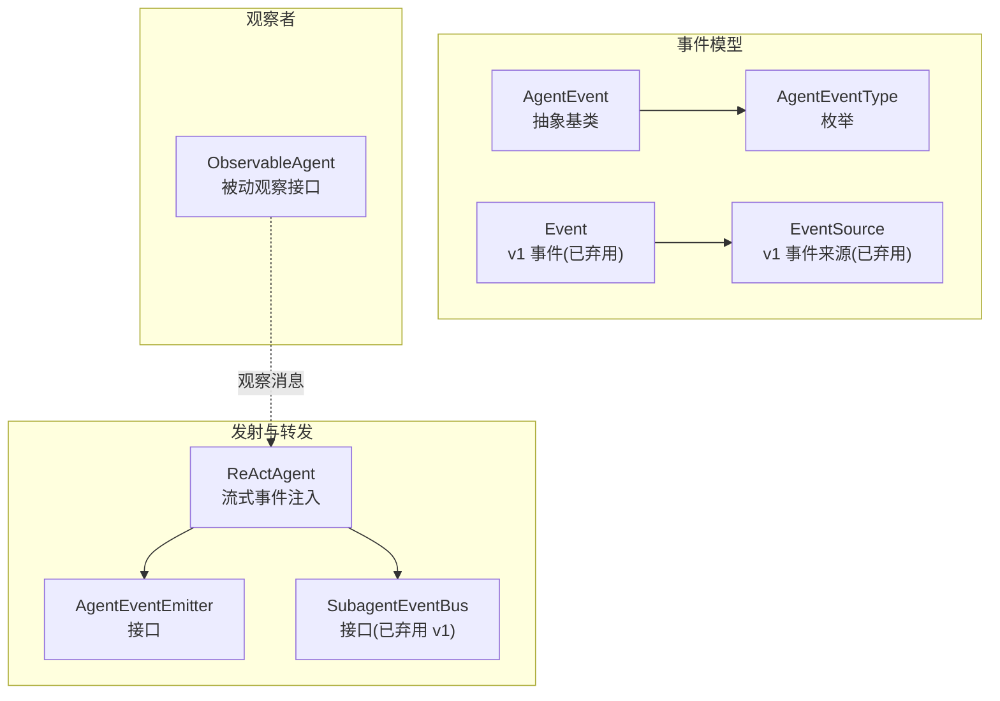
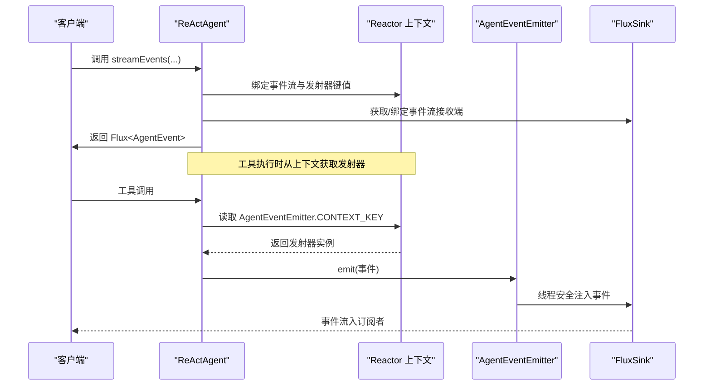
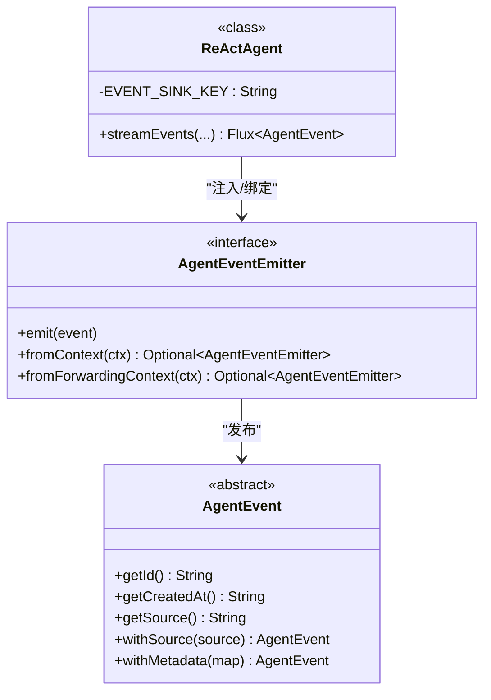
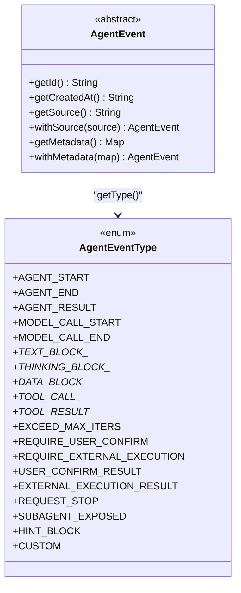
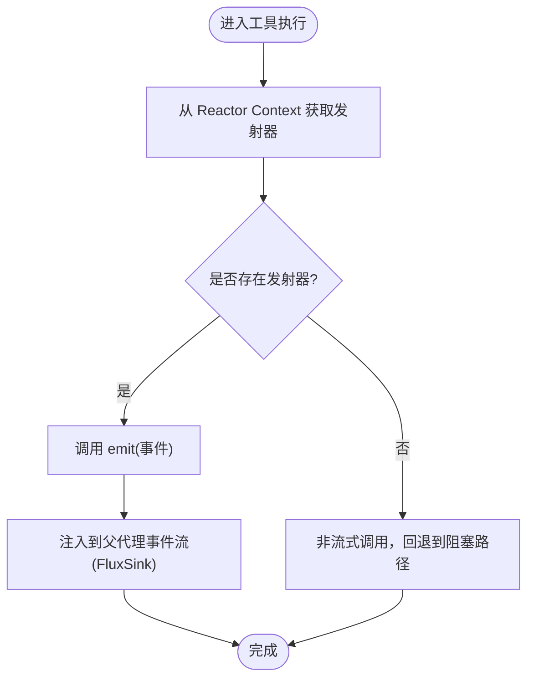
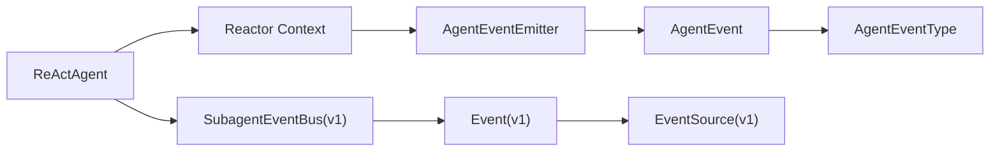

# 事件发射器机制

<cite>
**本文档引用的文件**
- [AgentEventEmitter.java](file://agentscope-core/src/main/java/io/agentscope/core/event/AgentEventEmitter.java)
- [ObservableAgent.java](file://agentscope-core/src/main/java/io/agentscope/core/agent/ObservableAgent.java)
- [Event.java](file://agentscope-core/src/main/java/io/agentscope/core/agent/Event.java)
- [SubagentEventBus.java](file://agentscope-core/src/main/java/io/agentscope/core/agent/SubagentEventBus.java)
- [AgentEvent.java](file://agentscope-core/src/main/java/io/agentscope/core/event/AgentEvent.java)
- [AgentEventType.java](file://agentscope-core/src/main/java/io/agentscope/core/event/AgentEventType.java)
- [EventType.java](file://agentscope-core/src/main/java/io/agentscope/core/agent/EventType.java)
- [EventSource.java](file://agentscope-core/src/main/java/io/agentscope/core/agent/EventSource.java)
- [ReActAgent.java](file://agentscope-core/src/main/java/io/agentscope/core/ReActAgent.java)
- [message-and-event.md](file://docs/v2/en/docs/building-blocks/message-and-event.md)
- [streaming.md](file://docs/v1/en/docs/task/streaming.md)
</cite>

## 目录
1. [引言](#引言)
2. [项目结构](#项目结构)
3. [核心组件](#核心组件)
4. [架构总览](#架构总览)
5. [详细组件分析](#详细组件分析)
6. [依赖关系分析](#依赖关系分析)
7. [性能考量](#性能考量)
8. [故障排查指南](#故障排查指南)
9. [结论](#结论)
10. [附录](#附录)

## 引言
本文件系统性阐述事件发射器机制的设计与实现，重点围绕 AgentEventEmitter 接口及其在 ReActAgent 流式执行中的角色，解释事件的生命周期管理、事件队列维护、与 ObservableAgent 的协作关系，以及事件发布、订阅与传播流程（含同步与异步模式）。同时给出性能优化策略（背压、去重、批量发送）、配置项与扩展方法，并通过图示与路径指引帮助读者快速定位源码位置。

## 项目结构
事件发射器相关的核心代码位于 agentscope-core 模块的 event 与 agent 包中，ReActAgent 提供了事件流的构建与注入点，配套文档提供了使用示例与最佳实践。

**图表来源**
- [AgentEvent.java:1-139](file://agentscope-core/src/main/java/io/agentscope/core/event/AgentEvent.java#L1-L139)
- [AgentEventType.java:1-137](file://agentscope-core/src/main/java/io/agentscope/core/event/AgentEventType.java#L1-L137)
- [Event.java:1-220](file://agentscope-core/src/main/java/io/agentscope/core/agent/Event.java#L1-L220)
- [EventSource.java:1-274](file://agentscope-core/src/main/java/io/agentscope/core/agent/EventSource.java#L1-L274)
- [AgentEventEmitter.java:1-98](file://agentscope-core/src/main/java/io/agentscope/core/event/AgentEventEmitter.java#L1-L98)
- [SubagentEventBus.java:1-70](file://agentscope-core/src/main/java/io/agentscope/core/agent/SubagentEventBus.java#L1-L70)
- [ReActAgent.java:1-200](file://agentscope-core/src/main/java/io/agentscope/core/ReActAgent.java#L1-L200)

**章节来源**
- [AgentEventEmitter.java:1-98](file://agentscope-core/src/main/java/io/agentscope/core/event/AgentEventEmitter.java#L1-L98)
- [ReActAgent.java:1-200](file://agentscope-core/src/main/java/io/agentscope/core/ReActAgent.java#L1-L200)

## 核心组件
- AgentEventEmitter：面向工具执行上下文的事件发射接口，提供从 Reactor Context 中安全检索与线程安全的事件发布能力；支持父子链路的“转发发射器”包装，用于子代理内部事件的来源路径标记。
- AgentEvent 与 AgentEventType：细粒度事件模型，覆盖代理全生命周期与人机交互（HITL）关键节点，支持序列化/反序列化与向后兼容别名映射。
- SubagentEventBus：v1 同步子代理事件通道，用于在父代理流式上下文中转发子代理事件（已弃用，保留兼容）。
- Event 与 EventSource：v1 事件与来源描述，承载旧版流式事件的类型与来源路径信息（已弃用）。
- ObservableAgent：被动观察接口，允许代理仅接收消息而不生成回复，常用于多智能体协作场景。

**章节来源**
- [AgentEventEmitter.java:21-98](file://agentscope-core/src/main/java/io/agentscope/core/event/AgentEventEmitter.java#L21-L98)
- [AgentEvent.java:27-139](file://agentscope-core/src/main/java/io/agentscope/core/event/AgentEvent.java#L27-L139)
- [AgentEventType.java:22-137](file://agentscope-core/src/main/java/io/agentscope/core/event/AgentEventType.java#L22-L137)
- [SubagentEventBus.java:21-70](file://agentscope-core/src/main/java/io/agentscope/core/agent/SubagentEventBus.java#L21-L70)
- [Event.java:24-220](file://agentscope-core/src/main/java/io/agentscope/core/agent/Event.java#L24-L220)
- [EventSource.java:21-274](file://agentscope-core/src/main/java/io/agentscope/core/agent/EventSource.java#L21-L274)
- [ObservableAgent.java:22-54](file://agentscope-core/src/main/java/io/agentscope/core/agent/ObservableAgent.java#L22-L54)

## 架构总览
ReActAgent 在流式执行期间通过 Reactor Context 注入 AgentEventEmitter，使工具执行时可直接发布细粒度 AgentEvent；对于子代理内部事件，可通过转发发射器自动附加来源路径，保证事件流的层次化与可追踪性。

**图表来源**
- [AgentEventEmitter.java:41-98](file://agentscope-core/src/main/java/io/agentscope/core/event/AgentEventEmitter.java#L41-L98)
- [ReActAgent.java:856-950](file://agentscope-core/src/main/java/io/agentscope/core/ReActAgent.java#L856-L950)

**章节来源**
- [ReActAgent.java:856-950](file://agentscope-core/src/main/java/io/agentscope/core/ReActAgent.java#L856-L950)
- [message-and-event.md:352-397](file://docs/v2/en/docs/building-blocks/message-and-event.md#L352-L397)

## 详细组件分析

### AgentEventEmitter 设计与实现
- 上下文键与检索
  - CONTEXT_KEY：存储于 Reactor Context 的主发射器键，工具执行时通过静态方法从上下文解析。
  - FORWARDING_CONTEXT_KEY：子代理内部事件的转发发射器键，用于在注入前为事件打上来源路径标签。
- 发布语义
  - emit(AgentEvent)：线程安全地将事件注入到父代理的事件流中，底层基于 Reactor FluxSink 实现。
  - fromContext/ fromForwardingContext：提供空安全的可选返回，便于在非流式调用（call）中优雅降级。
- 与 ReActAgent 的集成
  - ReActAgent 在构建流式事件时，将发射器实例绑定到 Reactor Context，并在工具执行链路中注入转发发射器，确保子事件具备来源路径。

**图表来源**
- [AgentEventEmitter.java:39-98](file://agentscope-core/src/main/java/io/agentscope/core/event/AgentEventEmitter.java#L39-L98)
- [AgentEvent.java:72-139](file://agentscope-core/src/main/java/io/agentscope/core/event/AgentEvent.java#L72-L139)
- [ReActAgent.java:274-282](file://agentscope-core/src/main/java/io/agentscope/core/ReActAgent.java#L274-L282)

**章节来源**
- [AgentEventEmitter.java:21-98](file://agentscope-core/src/main/java/io/agentscope/core/event/AgentEventEmitter.java#L21-L98)
- [ReActAgent.java:813-851](file://agentscope-core/src/main/java/io/agentscope/core/ReActAgent.java#L813-L851)

### 事件类型与生命周期
- AgentEventType：定义了完整的事件类型族，涵盖代理开始/结束、文本/思考/数据块增量、工具调用与结果、最大迭代超限、用户确认/HITL、外部执行请求/结果、停止请求、子代理暴露、提示块与自定义事件等。
- AgentEvent：统一携带唯一 ID、创建时间戳、可选来源路径与元数据，支持 withSource/withMetadata 链式设置。
- 与 v1 的差异
  - v1 使用 Event/EventType，按粗粒度类型区分（推理、工具结果、提示、摘要、最终结果等），且 EventSource 描述来源路径。
  - v2 使用 AgentEvent/AgentEventType，细粒度拆分，覆盖更完整的生命周期与交互阶段。

**图表来源**
- [AgentEventType.java:40-137](file://agentscope-core/src/main/java/io/agentscope/core/event/AgentEventType.java#L40-L137)
- [AgentEvent.java:72-139](file://agentscope-core/src/main/java/io/agentscope/core/event/AgentEvent.java#L72-L139)

**章节来源**
- [AgentEventType.java:22-137](file://agentscope-core/src/main/java/io/agentscope/core/event/AgentEventType.java#L22-L137)
- [AgentEvent.java:27-139](file://agentscope-core/src/main/java/io/agentscope/core/event/AgentEvent.java#L27-L139)

### 与 ObservableAgent 的协作关系
- ObservableAgent 定义了被动观察接口，允许代理仅接收消息而不生成回复，适用于多智能体协作、共享上下文与观察者模式。
- 事件发射器与 ObservableAgent 的结合点在于：ReActAgent 可以在流式执行中同时输出 AgentEvent 事件流与消息流，ObservableAgent 则专注于消息的被动消费，二者互不冲突，可并行使用。

**章节来源**
- [ObservableAgent.java:22-54](file://agentscope-core/src/main/java/io/agentscope/core/agent/ObservableAgent.java#L22-L54)
- [ReActAgent.java:856-950](file://agentscope-core/src/main/java/io/agentscope/core/ReActAgent.java#L856-L950)

### 事件发布、订阅与传播
- 发布路径
  - 工具执行时从 Reactor Context 解析 AgentEventEmitter，调用 emit 发布事件。
  - 子代理内部事件通过转发发射器注入，自动附加来源路径，确保事件可追溯。
- 订阅与传播
  - ReActAgent 将事件流与发射器绑定到每个订阅的 Reactor 上下文，订阅者可实时接收事件。
  - 文档示例展示了典型的 UI 流式订阅模式，按事件类型进行分支处理。

**图表来源**
- [AgentEventEmitter.java:77-96](file://agentscope-core/src/main/java/io/agentscope/core/event/AgentEventEmitter.java#L77-L96)
- [ReActAgent.java:932-942](file://agentscope-core/src/main/java/io/agentscope/core/ReActAgent.java#L932-L942)

**章节来源**
- [AgentEventEmitter.java:70-98](file://agentscope-core/src/main/java/io/agentscope/core/event/AgentEventEmitter.java#L70-L98)
- [ReActAgent.java:932-942](file://agentscope-core/src/main/java/io/agentscope/core/ReActAgent.java#L932-L942)

### 同步与异步事件处理模式
- 同步子代理事件（v1）
  - SubagentEventBus 允许同步子代理将事件推送到父代理的 Flux，事件需预先携带 EventSource 以便下游识别来源。
- 异步与流式事件（v2）
  - AgentEventEmitter 支持在任意线程安全发布事件，ReActor FluxSink 天然具备线程安全特性，适合高并发流式场景。
- 文档示例
  - v2 文档展示了基于 streamEvents 的 UI 实时渲染示例，体现异步增量事件的订阅与处理。

**章节来源**
- [SubagentEventBus.java:21-70](file://agentscope-core/src/main/java/io/agentscope/core/agent/SubagentEventBus.java#L21-L70)
- [AgentEventEmitter.java:60-68](file://agentscope-core/src/main/java/io/agentscope/core/event/AgentEventEmitter.java#L60-L68)
- [message-and-event.md:352-397](file://docs/v2/en/docs/building-blocks/message-and-event.md#L352-L397)

### 事件发射器在代理执行中的作用与完整性保障
- 来源路径与层级追踪
  - 通过转发发射器与 AgentEvent.withSource，子代理事件在进入父流之前被打上来源路径，保证事件流的层次化与可溯源。
- 事件完整性
  - AgentEvent 唯一 ID 与创建时间戳确保事件可标识与排序；元数据字段支持附加上下文信息。
- 与 ReActAgent 的耦合
  - ReActAgent 在流式构建阶段将事件流与发射器绑定到 Reactor 上下文，确保工具执行链路可访问。

**章节来源**
- [AgentEventEmitter.java:47-58](file://agentscope-core/src/main/java/io/agentscope/core/event/AgentEventEmitter.java#L47-L58)
- [AgentEvent.java:101-132](file://agentscope-core/src/main/java/io/agentscope/core/event/AgentEvent.java#L101-L132)
- [ReActAgent.java:856-950](file://agentscope-core/src/main/java/io/agentscope/core/ReActAgent.java#L856-L950)

## 依赖关系分析
- AgentEventEmitter 依赖 Reactor Context 进行上下文传递，ReActAgent 负责在流式执行中绑定与注入。
- AgentEvent 与 AgentEventType 形成强类型事件体系，支撑细粒度事件流。
- SubagentEventBus 与 Event/EventSource 为 v1 兼容层，新代码应优先使用 AgentEventEmitter 与 AgentEvent。

**图表来源**
- [ReActAgent.java:274-282](file://agentscope-core/src/main/java/io/agentscope/core/ReActAgent.java#L274-L282)
- [AgentEventEmitter.java:39-98](file://agentscope-core/src/main/java/io/agentscope/core/event/AgentEventEmitter.java#L39-L98)
- [AgentEvent.java:72-139](file://agentscope-core/src/main/java/io/agentscope/core/event/AgentEvent.java#L72-L139)
- [SubagentEventBus.java:37-70](file://agentscope-core/src/main/java/io/agentscope/core/agent/SubagentEventBus.java#L37-L70)
- [Event.java:60-220](file://agentscope-core/src/main/java/io/agentscope/core/agent/Event.java#L60-L220)
- [EventSource.java:113-274](file://agentscope-core/src/main/java/io/agentscope/core/agent/EventSource.java#L113-L274)

**章节来源**
- [ReActAgent.java:274-282](file://agentscope-core/src/main/java/io/agentscope/core/ReActAgent.java#L274-L282)
- [AgentEventEmitter.java:39-98](file://agentscope-core/src/main/java/io/agentscope/core/event/AgentEventEmitter.java#L39-L98)
- [AgentEvent.java:72-139](file://agentscope-core/src/main/java/io/agentscope/core/event/AgentEvent.java#L72-L139)
- [SubagentEventBus.java:37-70](file://agentscope-core/src/main/java/io/agentscope/core/agent/SubagentEventBus.java#L37-L70)
- [Event.java:60-220](file://agentscope-core/src/main/java/io/agentscope/core/agent/Event.java#L60-L220)
- [EventSource.java:113-274](file://agentscope-core/src/main/java/io/agentscope/core/agent/EventSource.java#L113-L274)

## 性能考量
- 背压处理
  - 使用 Reactor Flux 的背压策略（如 BACKPRESSURE_STRATEGY_BUFFER）控制事件注入速率，避免下游阻塞或丢弃。
- 事件去重
  - 基于 AgentEvent 的唯一 ID 与来源路径进行去重，防止重复事件被多次处理。
- 批量发送
  - 对高频事件（如增量文本/工具结果）采用批量聚合策略，减少订阅端压力与网络开销。
- 线程安全
  - 发射器与 FluxSink 的线程安全特性允许在多线程环境下发布事件，但建议配合合适的调度器与缓冲策略以提升吞吐。

[本节为通用性能指导，无需特定文件引用]

## 故障排查指南
- 上下文缺失
  - 当处于非流式调用（call）时，fromContext 返回空，工具应回退到阻塞路径或记录日志。
- 事件未到达订阅端
  - 检查 Reactor Context 是否正确绑定事件流与发射器键；确认工具执行是否在正确的上下文中。
- 来源路径缺失
  - 子代理内部事件应通过转发发射器注入，确保事件带有正确的 source 路径。
- 类型不匹配
  - v2 事件类型与 v1 不同，避免混用 Event/EventType 与 AgentEvent/AgentEventType。

**章节来源**
- [AgentEventEmitter.java:70-98](file://agentscope-core/src/main/java/io/agentscope/core/event/AgentEventEmitter.java#L70-L98)
- [ReActAgent.java:813-851](file://agentscope-core/src/main/java/io/agentscope/core/ReActAgent.java#L813-L851)

## 结论
AgentEventEmitter 作为 v2 事件体系的核心接口，通过 Reactor Context 将事件发射能力无缝注入到工具执行链路中，结合转发发射器实现了子代理事件的来源路径标记与层级追踪。配合细粒度的 AgentEvent/AgentEventType，ReActAgent 能够在流式执行中提供完整、一致且可观测的事件流，满足复杂多智能体协作与人机交互场景的需求。

## 附录
- 使用示例（路径）
  - v2 流式 UI 示例：[message-and-event.md:352-397](file://docs/v2/en/docs/building-blocks/message-and-event.md#L352-L397)
  - v1 流式说明：[streaming.md:1-47](file://docs/v1/en/docs/task/streaming.md#L1-L47)
- 关键实现路径
  - 发射器接口与上下文键：[AgentEventEmitter.java:21-98](file://agentscope-core/src/main/java/io/agentscope/core/event/AgentEventEmitter.java#L21-L98)
  - 事件模型与类型：[AgentEvent.java:27-139](file://agentscope-core/src/main/java/io/agentscope/core/event/AgentEvent.java#L27-L139)，[AgentEventType.java:22-137](file://agentscope-core/src/main/java/io/agentscope/core/event/AgentEventType.java#L22-L137)
  - v1 兼容通道：[SubagentEventBus.java:21-70](file://agentscope-core/src/main/java/io/agentscope/core/agent/SubagentEventBus.java#L21-L70)，[Event.java:24-220](file://agentscope-core/src/main/java/io/agentscope/core/agent/Event.java#L24-L220)，[EventSource.java:21-274](file://agentscope-core/src/main/java/io/agentscope/core/agent/EventSource.java#L21-L274)
  - ReActAgent 集成点：[ReActAgent.java:856-950](file://agentscope-core/src/main/java/io/agentscope/core/ReActAgent.java#L856-L950)