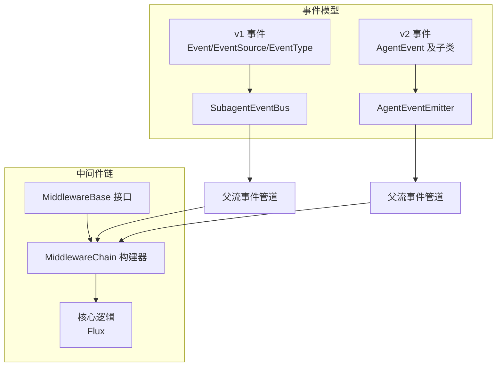
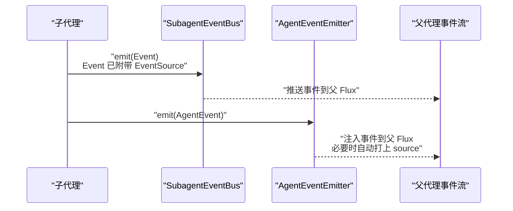
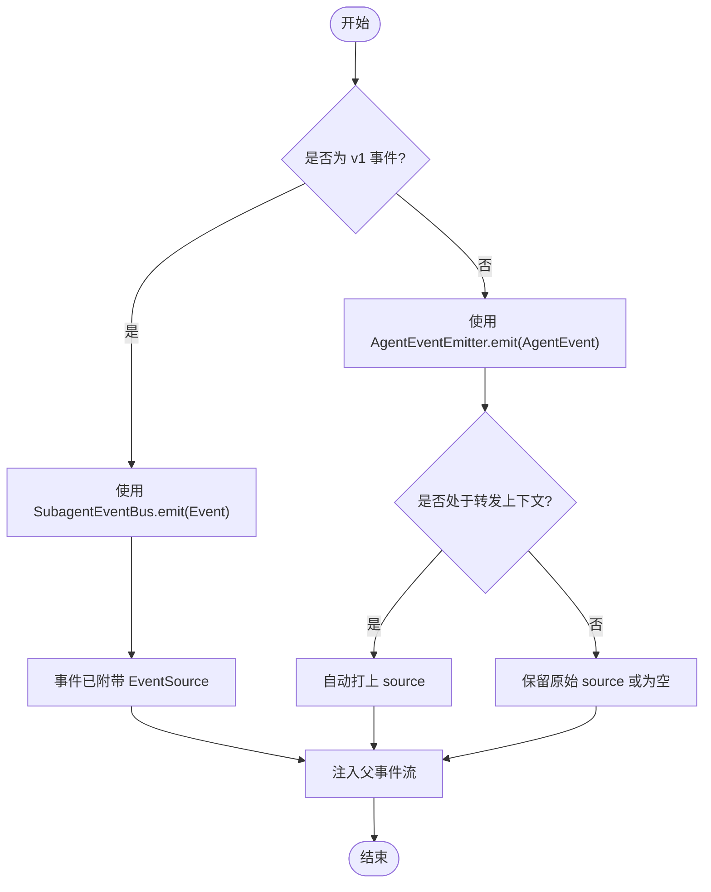
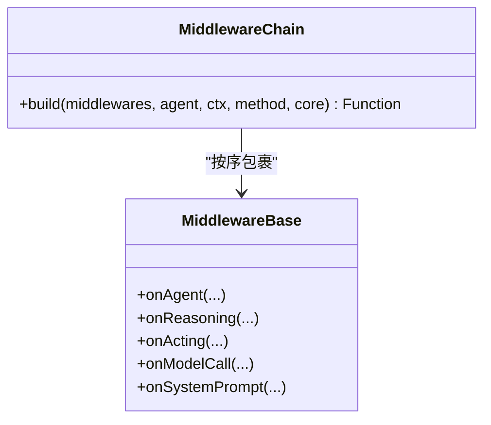
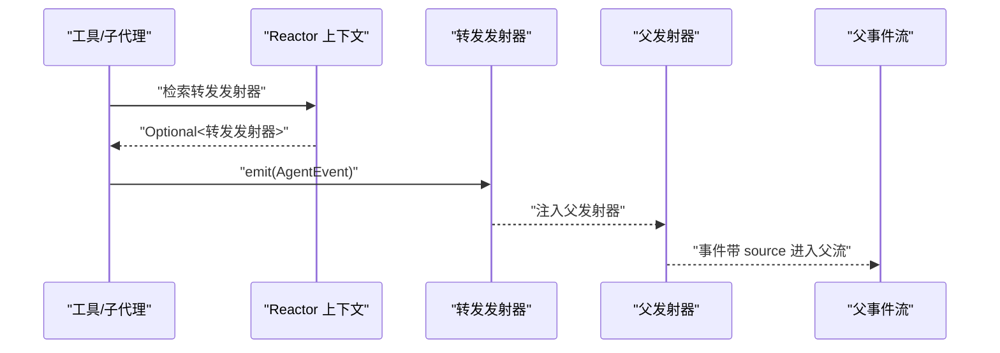
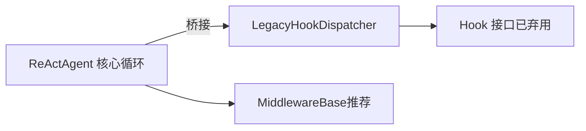
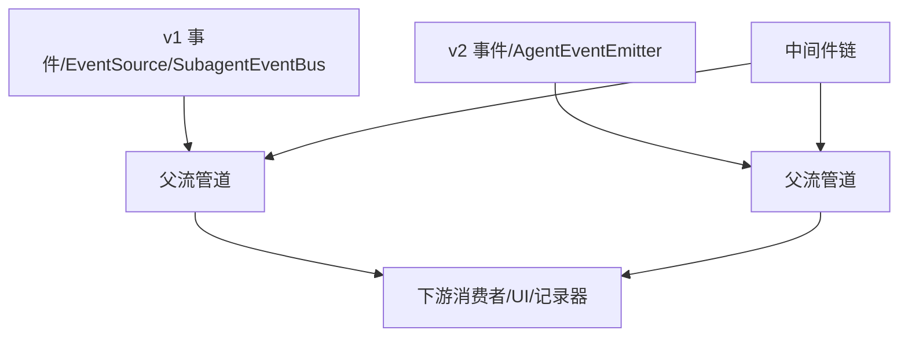

# 事件处理流程

<cite>
**本文引用的文件**
- [Event.java](file://agentscope-core/src/main/java/io/agentscope/core/agent/Event.java)
- [EventSource.java](file://agentscope-core/src/main/java/io/agentscope/core/agent/EventSource.java)
- [EventType.java](file://agentscope-core/src/main/java/io/agentscope/core/agent/EventType.java)
- [SubagentEventBus.java](file://agentscope-core/src/main/java/io/agentscope/core/agent/SubagentEventBus.java)
- [AgentEvent.java](file://agentscope-core/src/main/java/io/agentscope/core/event/AgentEvent.java)
- [AgentEventEmitter.java](file://agentscope-core/src/main/java/io/agentscope/core/event/AgentEventEmitter.java)
- [AgentEventEmitter.java](file://agentscope-core/src/main/java/io/agentscope/core/event/AgentEventEmitter.java)
- [MiddlewareChain.java](file://agentscope-core/src/main/java/io/agentscope/core/middleware/MiddlewareChain.java)
- [MiddlewareBase.java](file://agentscope-core/src/main/java/io/agentscope/core/middleware/MiddlewareBase.java)
- [Hook.java](file://agentscope-core/src/main/java/io/agentscope/core/hook/Hook.java)
- [LegacyHookDispatcher.java](file://agentscope-core/src/main/java/io/agentscope/core/hook/LegacyHookDispatcher.java)
</cite>

## 目录
1. [引言](#引言)
2. [项目结构](#项目结构)
3. [核心组件](#核心组件)
4. [架构总览](#架构总览)
5. [详细组件分析](#详细组件分析)
6. [依赖关系分析](#依赖关系分析)
7. [性能考量](#性能考量)
8. [故障排查指南](#故障排查指南)
9. [结论](#结论)
10. [附录](#附录)

## 引言
本文件面向事件处理与中间件链路，系统性梳理事件的接收、过滤、转换与转发机制；解释事件处理器（中间件）的注册与执行顺序；阐述基于响应式流的事件模型（Reactor）与背压、错误传播、异常恢复策略；说明事件在钩子系统中的演进与代理生命周期管理；并给出性能优化建议与调试监控方法。

## 项目结构
事件处理相关代码主要集中在 agentscope-core 模块中，围绕两类事件体系与两条执行路径展开：
- v1 事件体系：Event/EventSource/EventType 与 SubagentEventBus，用于旧版流式输出与子代理事件转发。
- v2 事件体系：AgentEvent 及其细粒度子类、AgentEventEmitter 与 MiddlewareChain/MiddlewareBase，用于新版精细事件流与中间件拦截。

图表来源
- [Event.java:1-220](file://agentscope-core/src/main/java/io/agentscope/core/agent/Event.java#L1-L220)
- [EventSource.java:1-274](file://agentscope-core/src/main/java/io/agentscope/core/agent/EventSource.java#L1-L274)
- [EventType.java:1-100](file://agentscope-core/src/main/java/io/agentscope/core/agent/EventType.java#L1-L100)
- [SubagentEventBus.java:1-70](file://agentscope-core/src/main/java/io/agentscope/core/agent/SubagentEventBus.java#L1-L70)
- [AgentEvent.java:1-139](file://agentscope-core/src/main/java/io/agentscope/core/event/AgentEvent.java#L1-L139)
- [AgentEventEmitter.java:1-98](file://agentscope-core/src/main/java/io/agentscope/core/event/AgentEventEmitter.java#L1-L98)
- [MiddlewareChain.java:1-79](file://agentscope-core/src/main/java/io/agentscope/core/middleware/MiddlewareChain.java#L1-L79)
- [MiddlewareBase.java:1-144](file://agentscope-core/src/main/java/io/agentscope/core/middleware/MiddlewareBase.java#L1-L144)

章节来源
- [Event.java:1-220](file://agentscope-core/src/main/java/io/agentscope/core/agent/Event.java#L1-L220)
- [AgentEvent.java:1-139](file://agentscope-core/src/main/java/io/agentscope/core/event/AgentEvent.java#L1-L139)
- [MiddlewareChain.java:1-79](file://agentscope-core/src/main/java/io/agentscope/core/middleware/MiddlewareChain.java#L1-L79)

## 核心组件
- v1 事件与子代理通道
  - Event：顶层事件载体，携带类型、消息体与是否为最终片段等信息，支持按消息 ID 聚合分片。
  - EventSource：标识事件来源（子代理），包含 agentKey、agentId、agentName、sessionId、parentSessionId、taskId、depth、path 等字段，支持路径追加与层级扩展。
  - EventType：粗粒度事件类型枚举（推理、工具结果、提示、最终结果、摘要、全部）。
  - SubagentEventBus：在父代理的流上下文中注入，允许同步子代理将事件推送到父流，要求事件已附带 EventSource。
- v2 事件与发射器
  - AgentEvent：细粒度事件基类，具备唯一 ID、创建时间、可选 source（路径）与 metadata，采用 Jackson 多态序列化。
  - AgentEventEmitter：在 Reactor 上下文中注入，允许工具或子代理向父事件流发射 AgentEvent；提供常规发射与“转发发射器”以自动打上 source。
- 中间件链
  - MiddlewareBase：定义 onAgent/onReasoning/onActing/onModelCall/onSystemPrompt 等拦截点，默认透传到 next。
  - MiddlewareChain：按后向前构建洋葱式中间件链，将核心逻辑包裹在最内层，外层中间件在外围进行前置/后置处理。

章节来源
- [Event.java:1-220](file://agentscope-core/src/main/java/io/agentscope/core/agent/Event.java#L1-L220)
- [EventSource.java:1-274](file://agentscope-core/src/main/java/io/agentscope/core/agent/EventSource.java#L1-L274)
- [EventType.java:1-100](file://agentscope-core/src/main/java/io/agentscope/core/agent/EventType.java#L1-L100)
- [SubagentEventBus.java:1-70](file://agentscope-core/src/main/java/io/agentscope/core/agent/SubagentEventBus.java#L1-L70)
- [AgentEvent.java:1-139](file://agentscope-core/src/main/java/io/agentscope/core/event/AgentEvent.java#L1-L139)
- [AgentEventEmitter.java:1-98](file://agentscope-core/src/main/java/io/agentscope/core/event/AgentEventEmitter.java#L1-L98)
- [MiddlewareBase.java:1-144](file://agentscope-core/src/main/java/io/agentscope/core/middleware/MiddlewareBase.java#L1-L144)
- [MiddlewareChain.java:1-79](file://agentscope-core/src/main/java/io/agentscope/core/middleware/MiddlewareChain.java#L1-L79)

## 架构总览
事件从核心代理产生，经由中间件链进行拦截与转换，再进入父级事件流。子代理可通过 SubagentEventBus 或 AgentEventEmitter 将事件转发至父流，并自动标注来源路径。

图表来源
- [SubagentEventBus.java:1-70](file://agentscope-core/src/main/java/io/agentscope/core/agent/SubagentEventBus.java#L1-L70)
- [AgentEventEmitter.java:1-98](file://agentscope-core/src/main/java/io/agentscope/core/event/AgentEventEmitter.java#L1-L98)

## 详细组件分析

### 组件一：事件接收与来源标注
- v1 事件接收
  - 子代理在父代理的流上下文中通过 SubagentEventBus 发送 Event，事件必须预先附带 EventSource，以便父流识别来源。
  - 父代理在接收到子代理事件后，将其直接注入到父 Flux，保持事件的分片完整性（isLast 标识）。
- v2 事件接收
  - 子代理或工具通过 AgentEventEmitter 发射 AgentEvent；若处于转发上下文，则使用转发发射器自动为事件打上 source，确保跨代理事件可溯源。
  - 父代理的事件流统一消费 AgentEvent，便于后续中间件处理与过滤。

图表来源
- [SubagentEventBus.java:1-70](file://agentscope-core/src/main/java/io/agentscope/core/agent/SubagentEventBus.java#L1-L70)
- [AgentEventEmitter.java:1-98](file://agentscope-core/src/main/java/io/agentscope/core/event/AgentEventEmitter.java#L1-L98)

章节来源
- [SubagentEventBus.java:1-70](file://agentscope-core/src/main/java/io/agentscope/core/agent/SubagentEventBus.java#L1-L70)
- [AgentEventEmitter.java:1-98](file://agentscope-core/src/main/java/io/agentscope/core/event/AgentEventEmitter.java#L1-L98)

### 组件二：事件过滤与转换（中间件链）
- 中间件拦截点
  - onAgent：拦截整个代理调用，适合全局鉴权、限流、埋点等。
  - onReasoning：拦截推理阶段，适合日志、指标、提示词增强等。
  - onActing：拦截工具调用阶段，适合参数校验、权限控制、结果归档等。
  - onModelCall：拦截底层模型调用，适合超参调整、重试策略、缓存命中判断等。
  - onSystemPrompt：串行变换系统提示词，适合模板注入、多语言切换等。
- 链式构建
  - MiddlewareChain 从列表末尾向前包裹，形成洋葱式结构：外层中间件在外围，内层靠近核心逻辑。
  - 默认实现透传 next，仅覆盖关心的拦截点即可实现最小改动。

图表来源
- [MiddlewareBase.java:1-144](file://agentscope-core/src/main/java/io/agentscope/core/middleware/MiddlewareBase.java#L1-L144)
- [MiddlewareChain.java:1-79](file://agentscope-core/src/main/java/io/agentscope/core/middleware/MiddlewareChain.java#L1-L79)

章节来源
- [MiddlewareBase.java:1-144](file://agentscope-core/src/main/java/io/agentscope/core/middleware/MiddlewareBase.java#L1-L144)
- [MiddlewareChain.java:1-79](file://agentscope-core/src/main/java/io/agentscope/core/middleware/MiddlewareChain.java#L1-L79)

### 组件三：事件转发与来源路径
- EventSource（v1）
  - 提供 builder 与 withAppendedPath 扩展能力，支持深度与路径追踪，便于 UI 呈现与日志定位。
- AgentEventEmitter（v2）
  - 在 Reactor 上下文中注入，提供常规发射与转发发射器两种键位；转发发射器在子代理内部使用，自动为事件打上 source 再注入父流。

图表来源
- [AgentEventEmitter.java:1-98](file://agentscope-core/src/main/java/io/agentscope/core/event/AgentEventEmitter.java#L1-L98)

章节来源
- [EventSource.java:1-274](file://agentscope-core/src/main/java/io/agentscope/core/agent/EventSource.java#L1-L274)
- [AgentEventEmitter.java:1-98](file://agentscope-core/src/main/java/io/agentscope/core/event/AgentEventEmitter.java#L1-L98)

### 组件四：钩子系统的演进与兼容
- Hook（已弃用）
  - 通过 onEvent 统一接收各类 HookEvent，支持优先级与工具注册；默认优先级 100，相同优先级按注册顺序执行。
  - LegacyHookDispatcher 负责将 v1 的事件流桥接到 Hook 系统，保证现有代码平滑过渡。
- 迁移建议
  - 新代码应使用 MiddlewareBase 的拦截点替代 Hook；如需兼容旧钩子，可继续使用 LegacyHookDispatcher，但不建议新功能继续依赖。

图表来源
- [Hook.java:1-192](file://agentscope-core/src/main/java/io/agentscope/core/hook/Hook.java#L1-L192)
- [LegacyHookDispatcher.java:1-198](file://agentscope-core/src/main/java/io/agentscope/core/hook/LegacyHookDispatcher.java#L1-L198)

章节来源
- [Hook.java:1-192](file://agentscope-core/src/main/java/io/agentscope/core/hook/Hook.java#L1-L192)
- [LegacyHookDispatcher.java:1-198](file://agentscope-core/src/main/java/io/agentscope/core/hook/LegacyHookDispatcher.java#L1-L198)

## 依赖关系分析
- v1 与 v2 的并行存在
  - v1 事件与 SubagentEventBus 仍被用于旧版流式输出与外部适配层。
  - v2 事件与 AgentEventEmitter 是当前主推方案，配合中间件链实现精细化拦截与转换。
- 中间件与事件的关系
  - 中间件链对 AgentEvent 流进行拦截与转换，既可作为过滤器（丢弃不需要的事件），也可作为转换器（修改事件内容或元数据）。
- 来源标注的依赖
  - v1 使用 EventSource 显式标注来源；v2 使用 AgentEventEmitter 的转发上下文自动标注 source，减少手工维护成本。

图表来源
- [Event.java:1-220](file://agentscope-core/src/main/java/io/agentscope/core/agent/Event.java#L1-L220)
- [EventSource.java:1-274](file://agentscope-core/src/main/java/io/agentscope/core/agent/EventSource.java#L1-L274)
- [SubagentEventBus.java:1-70](file://agentscope-core/src/main/java/io/agentscope/core/agent/SubagentEventBus.java#L1-L70)
- [AgentEvent.java:1-139](file://agentscope-core/src/main/java/io/agentscope/core/event/AgentEvent.java#L1-L139)
- [AgentEventEmitter.java:1-98](file://agentscope-core/src/main/java/io/agentscope/core/event/AgentEventEmitter.java#L1-L98)
- [MiddlewareChain.java:1-79](file://agentscope-core/src/main/java/io/agentscope/core/middleware/MiddlewareChain.java#L1-L79)

章节来源
- [MiddlewareChain.java:1-79](file://agentscope-core/src/main/java/io/agentscope/core/middleware/MiddlewareChain.java#L1-L79)

## 性能考量
- 事件聚合与批处理
  - 利用事件 ID 与 isLast 标识进行分片聚合，避免频繁落盘或渲染；在中间件中对同一消息 ID 的事件进行缓冲与合并，降低下游压力。
- 缓存策略
  - 对模型调用（onModelCall）与工具执行（onActing）结果进行缓存，命中则直接返回，未命中再触发真实调用；注意缓存键包含输入签名与上下文。
- 背压与限速
  - 在中间件中实现背压感知（如队列长度阈值、阻塞等待策略），或在上游调用侧限制并发，防止事件洪峰导致内存抖动。
- 过滤与短路
  - 在中间件链早期进行过滤（如按类型、按来源路径），减少无效事件进入后续处理环节。
- 日志与指标
  - 在关键拦截点（onAgent/onReasoning/onActing/onModelCall）埋点，统计耗时、吞吐与错误率，结合 source 路径进行维度化分析。

## 故障排查指南
- 事件丢失或重复
  - 检查子代理是否正确附带 EventSource（v1）或是否使用转发发射器（v2）；确认中间件链未意外丢弃事件。
- 来源路径缺失
  - 若使用 v2，确认工具或子代理在 Reactor 上下文中检索到转发发射器；若为空，回退到常规发射器可能导致 source 为空。
- 错误传播与异常恢复
  - 在中间件中使用 doOnError/doOnComplete 等操作符记录错误上下文；对可重试场景在 onModelCall 中实现指数退避与熔断。
- 钩子系统兼容
  - 如需兼容旧钩子，检查 LegacyHookDispatcher 是否正确桥接；逐步迁移至 MiddlewareBase，避免长期依赖已弃用接口。

章节来源
- [AgentEventEmitter.java:1-98](file://agentscope-core/src/main/java/io/agentscope/core/event/AgentEventEmitter.java#L1-L98)
- [LegacyHookDispatcher.java:1-198](file://agentscope-core/src/main/java/io/agentscope/core/hook/LegacyHookDispatcher.java#L1-L198)

## 结论
事件处理在 Agentscope 中经历了从 v1 到 v2 的演进：v1 侧重于粗粒度事件与子代理通道，v2 则提供细粒度事件与中间件拦截。通过中间件链与发射器/总线机制，事件得以在父流中被有序接收、过滤、转换与转发。配合合理的缓存、批处理与背压策略，可在保证实时性的前提下提升整体吞吐与稳定性。同时，建议逐步淘汰旧钩子系统，迁移到中间件链以获得更清晰的控制流与更强的扩展性。

## 附录
- 事件处理链的构建与自定义事件处理器的实现要点
  - 自定义中间件：实现 MiddlewareBase 的目标拦截点，利用默认透传行为最小化改动；在 build 时将中间件列表按期望顺序传入。
  - 自定义事件发射：在工具或子代理中通过 AgentEventEmitter.fromContext 获取发射器，按需使用转发发射器自动打上 source。
  - 事件聚合与批处理：在中间件中根据事件 ID 与类型进行缓冲与合并，减少下游压力。
  - 调试与监控：在关键拦截点埋点，记录耗时与错误；结合 source 路径进行维度化分析。