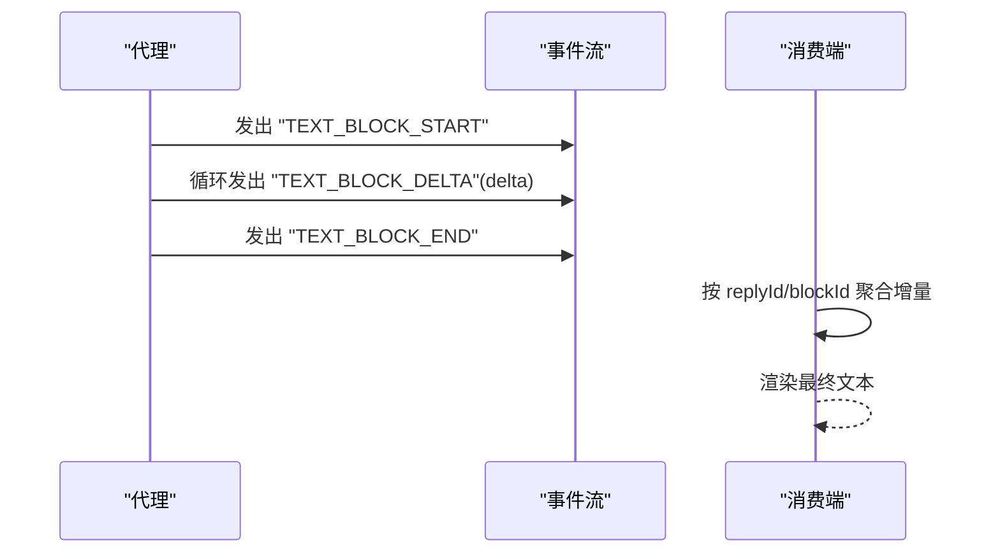
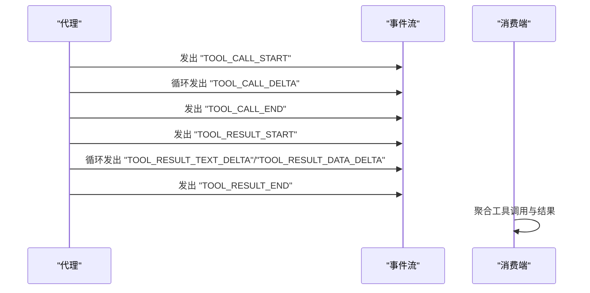
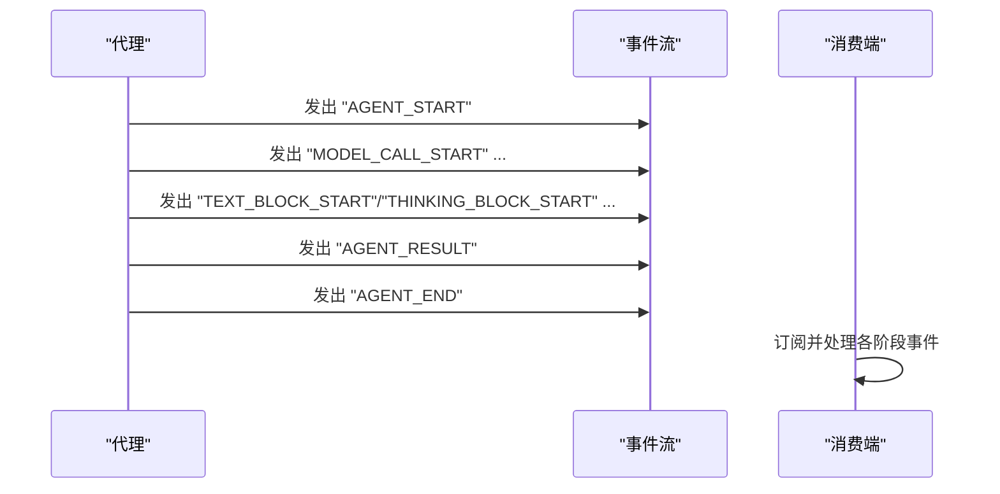

# 事件类型体系

<cite>
**本文引用的文件**
- [AgentEventType.java](file://agentscope-core/src/main/java/io/agentscope/core/event/AgentEventType.java)
- [AgentEvent.java](file://agentscope-core/src/main/java/io/agentscope/core/event/AgentEvent.java)
- [AgentStartEvent.java](file://agentscope-core/src/main/java/io/agentscope/core/event/AgentStartEvent.java)
- [AgentEndEvent.java](file://agentscope-core/src/main/java/io/agentscope/core/event/AgentEndEvent.java)
- [AgentResultEvent.java](file://agentscope-core/src/main/java/io/agentscope/core/event/AgentResultEvent.java)
- [TextBlockStartEvent.java](file://agentscope-core/src/main/java/io/agentscope/core/event/TextBlockStartEvent.java)
- [TextBlockDeltaEvent.java](file://agentscope-core/src/main/java/io/agentscope/core/event/TextBlockDeltaEvent.java)
- [TextBlockEndEvent.java](file://agentscope-core/src/main/java/io/agentscope/core/event/TextBlockEndEvent.java)
- [ThinkingBlockStartEvent.java](file://agentscope-core/src/main/java/io/agentscope/core/event/ThinkingBlockStartEvent.java)
- [ThinkingBlockDeltaEvent.java](file://agentscope-core/src/main/java/io/agentscope/core/event/ThinkingBlockDeltaEvent.java)
- [DataBlockStartEvent.java](file://agentscope-core/src/main/java/io/agentscope/core/event/DataBlockStartEvent.java)
- [DataBlockDeltaEvent.java](file://agentscope-core/src/main/java/io/agentscope/core/event/DataBlockDeltaEvent.java)
- [DataBlockEndEvent.java](file://agentscope-core/src/main/java/io/agentscope/core/event/DataBlockEndEvent.java)
- [ToolCallStartEvent.java](file://agentscope-core/src/main/java/io/agentscope/core/event/ToolCallStartEvent.java)
- [ToolCallDeltaEvent.java](file://agentscope-core/src/main/java/io/agentscope/core/event/ToolCallDeltaEvent.java)
- [ToolCallEndEvent.java](file://agentscope-core/src/main/java/io/agentscope/core/event/ToolCallEndEvent.java)
- [ToolResultStartEvent.java](file://agentscope-core/src/main/java/io/agentscope/core/event/ToolResultStartEvent.java)
- [ToolResultTextDeltaEvent.java](file://agentscope-core/src/main/java/io/agentscope/core/event/ToolResultTextDeltaEvent.java)
- [ToolResultDataDeltaEvent.java](file://agentscope-core/src/main/java/io/agentscope/core/event/ToolResultDataDeltaEvent.java)
- [ToolResultEndEvent.java](file://agentscope-core/src/main/java/io/agentscope/core/event/ToolResultEndEvent.java)
- [ModelCallStartEvent.java](file://agentscope-core/src/main/java/io/agentscope/core/event/ModelCallStartEvent.java)
- [ModelCallEndEvent.java](file://agentscope-core/src/main/java/io/agentscope/core/event/ModelCallEndEvent.java)
- [RequireUserConfirmEvent.java](file://agentscope-core/src/main/java/io/agentscope/core/event/RequireUserConfirmEvent.java)
- [UserConfirmResultEvent.java](file://agentscope-core/src/main/java/io/agentscope/core/event/UserConfirmResultEvent.java)
- [RequireExternalExecutionEvent.java](file://agentscope-core/src/main/java/io/agentscope/core/event/RequireExternalExecutionEvent.java)
- [ExternalExecutionResultEvent.java](file://agentscope-core/src/main/java/io/agentscope/core/event/ExternalExecutionResultEvent.java)
- [RequestStopEvent.java](file://agentscope-core/src/main/java/io/agentscope/core/event/RequestStopEvent.java)
- [SubagentExposedEvent.java](file://agentscope-core/src/main/java/io/agentscope/core/event/SubagentExposedEvent.java)
- [HintBlockEvent.java](file://agentscope-core/src/main/java/io/agentscope/core/event/HintBlockEvent.java)
- [CustomEvent.java](file://agentscope-core/src/main/java/io/agentscope/core/event/CustomEvent.java)
- [ExceedMaxItersEvent.java](file://agentscope-core/src/main/java/io/agentscope/core/event/ExceedMaxItersEvent.java)
- [EventType.java](file://agentscope-core/src/main/java/io/agentscope/core/agent/EventType.java)
- [Event.java](file://agentscope-core/src/main/java/io/agentscope/core/agent/Event.java)
</cite>

## 目录
1. [引言](#引言)
2. [项目结构](#项目结构)
3. [核心组件](#核心组件)
4. [架构总览](#架构总览)
5. [详细组件分析](#详细组件分析)
6. [依赖关系分析](#依赖关系分析)
7. [性能考量](#性能考量)
8. [故障排查指南](#故障排查指南)
9. [结论](#结论)
10. [附录：扩展与最佳实践](#附录扩展与最佳实践)

## 引言
本文件系统性阐述 Agentscope 的事件类型体系，重点围绕细粒度事件类型设计与分类机制展开，涵盖以下方面：
- AgentEventType 枚举的设计理念与兼容策略（含 JSON 反序列化的别名映射）
- 事件分类与生命周期：核心事件、文本块事件、思维块事件、数据块事件、工具调用事件、模型调用事件等
- 各类事件的字段定义、数据结构与业务含义
- JSON 序列化中的标识机制与多态事件处理（基于 Jackson 的 @JsonTypeInfo 与 @JsonSubTypes）
- 扩展事件类型的实践指南与自定义事件创建方法
- 典型使用场景与处理流程示意

## 项目结构
事件类型体系主要位于 agentscope-core 模块的 io.agentscope.core.event 包中，并辅以 v1 的粗粒度事件类型（io.agentscope.core.agent）用于兼容。

```mermaid
graph TB
subgraph "核心事件层"
AE["AgentEvent 抽象基类"]
AET["AgentEventType 枚举"]
end
subgraph "具体事件类型"
AS["AgentStartEvent"]
AEvt["AgentEndEvent"]
AR["AgentResultEvent"]
MCS["ModelCallStartEvent"]
MCE["ModelCallEndEvent"]
TBS["TextBlockStartEvent"]
TBD["TextBlockDeltaEvent"]
TBE["TextBlockEndEvent"]
THS["ThinkingBlockStartEvent"]
THD["ThinkingBlockDeltaEvent"]
THE["ThinkingBlockEndEvent"]
DBS["DataBlockStartEvent"]
DBD["DataBlockDeltaEvent"]
DBE["DataBlockEndEvent"]
TCS["ToolCallStartEvent"]
TCD["ToolCallDeltaEvent"]
TCE["ToolCallEndEvent"]
TRS["ToolResultStartEvent"]
TRTD["ToolResultTextDeltaEvent"]
TRDD["ToolResultDataDeltaEvent"]
TRE["ToolResultEndEvent"]
RUC["RequireUserConfirmEvent"]
UCR["UserConfirmResultEvent"]
REE["RequireExternalExecutionEvent"]
EER["ExternalExecutionResultEvent"]
RS["RequestStopEvent"]
SE["SubagentExposedEvent"]
HB["HintBlockEvent"]
CE["CustomEvent"]
EMI["ExceedMaxItersEvent"]
end
AET --> AS
AET --> AEvt
AET --> AR
AET --> MCS
AET --> MCE
AET --> TBS
AET --> TBD
AET --> TBE
AET --> THS
AET --> THD
AET --> THE
AET --> DBS
AET --> DBD
AET --> DBE
AET --> TCS
AET --> TCD
AET --> TCE
AET --> TRS
AET --> TRTD
AET --> TRDD
AET --> TRE
AET --> RUC
AET --> UCR
AET --> REE
AET --> EER
AET --> RS
AET --> SE
AET --> HB
AET --> CE
AET --> EMI
AE --> AS
AE --> AEvt
AE --> AR
AE --> MCS
AE --> MCE
AE --> TBS
AE --> TBD
AE --> TBE
AE --> THS
AE --> THD
AE --> THE
AE --> DBS
AE --> DBD
AE --> DBE
AE --> TCS
AE --> TCD
AE --> TCE
AE --> TRS
AE --> TRTD
AE --> TRDD
AE --> TRE
AE --> RUC
AE --> UCR
AE --> REE
AE --> EER
AE --> RS
AE --> SE
AE --> HB
AE --> CE
AE --> EMI
```



图表来源
- [AgentEvent.java:35-71](file://agentscope-core/src/main/java/io/agentscope/core/event/AgentEvent.java#L35-L71)
- [AgentEventType.java:40-89](file://agentscope-core/src/main/java/io/agentscope/core/event/AgentEventType.java#L40-L89)

章节来源
- [AgentEvent.java:33-71](file://agentscope-core/src/main/java/io/agentscope/core/event/AgentEvent.java#L33-L71)
- [AgentEventType.java:22-39](file://agentscope-core/src/main/java/io/agentscope/core/event/AgentEventType.java#L22-L39)

## 核心组件
- AgentEventType：细粒度事件类型枚举，提供规范化的字符串标识与历史别名支持，确保向后兼容。
- AgentEvent：所有细粒度事件的抽象基类，统一携带事件 ID、创建时间、来源路径与元数据。
- 具体事件类：覆盖代理生命周期、文本/思维块流式输出、数据块传输、工具调用与结果、模型调用、交互确认、外部执行、请求停止、子代理暴露、提示块与自定义事件等。

章节来源
- [AgentEventType.java:40-137](file://agentscope-core/src/main/java/io/agentscope/core/event/AgentEventType.java#L40-L137)
- [AgentEvent.java:72-139](file://agentscope-core/src/main/java/io/agentscope/core/event/AgentEvent.java#L72-L139)

## 架构总览
事件体系采用“枚举 + 多态基类”的设计，通过 Jackson 注解实现 JSON 层面的多态反序列化与序列化：
- @JsonTypeInfo(use = NAME, include = PROPERTY, property = "type")：在序列化时写入 type 字段作为多态标识。
- @JsonSubTypes：将具体事件类与其 type 值进行绑定，实现运行时自动分发。
- AgentEventType：提供统一的事件类型名称与历史别名解析，保证老版本 JSON 能被正确识别。

```mermaid
classDiagram
class AgentEvent {
+String id
+String createdAt
+String source
+Map~String,Object~ metadata
+withSource(source) AgentEvent
+withMetadata(map) AgentEvent
+getType() AgentEventType
}
class AgentEventType {
<<enum>>
+AGENT_START
+AGENT_END
+AGENT_RESULT
+MODEL_CALL_START
+MODEL_CALL_END
+TEXT_BLOCK_START
+TEXT_BLOCK_DELTA
+TEXT_BLOCK_END
+THINKING_BLOCK_START
+THINKING_BLOCK_DELTA
+THINKING_BLOCK_END
+DATA_BLOCK_START
+DATA_BLOCK_DELTA
+DATA_BLOCK_END
+TOOL_CALL_START
+TOOL_CALL_DELTA
+TOOL_CALL_END
+TOOL_RESULT_START
+TOOL_RESULT_TEXT_DELTA
+TOOL_RESULT_DATA_DELTA
+TOOL_RESULT_END
+EXCEED_MAX_ITERS
+REQUIRE_USER_CONFIRM
+REQUIRE_EXTERNAL_EXECUTION
+USER_CONFIRM_RESULT
+EXTERNAL_EXECUTION_RESULT
+REQUEST_STOP
+SUBAGENT_EXPOSED
+HINT_BLOCK
+CUSTOM
}
class AgentStartEvent
class AgentEndEvent
class AgentResultEvent
class ModelCallStartEvent
class ModelCallEndEvent
class TextBlockStartEvent
class TextBlockDeltaEvent
class TextBlockEndEvent
class ThinkingBlockStartEvent
class ThinkingBlockDeltaEvent
class ThinkingBlockEndEvent
class DataBlockStartEvent
class DataBlockDeltaEvent
class DataBlockEndEvent
class ToolCallStartEvent
class ToolCallDeltaEvent
class ToolCallEndEvent
class ToolResultStartEvent
class ToolResultTextDeltaEvent
class ToolResultDataDeltaEvent
class ToolResultEndEvent
class RequireUserConfirmEvent
class UserConfirmResultEvent
class RequireExternalExecutionEvent
class ExternalExecutionResultEvent
class RequestStopEvent
class SubagentExposedEvent
class HintBlockEvent
class CustomEvent
class ExceedMaxItersEvent
AgentEvent <|-- AgentStartEvent
AgentEvent <|-- AgentEndEvent
AgentEvent <|-- AgentResultEvent
AgentEvent <|-- ModelCallStartEvent
AgentEvent <|-- ModelCallEndEvent
AgentEvent <|-- TextBlockStartEvent
AgentEvent <|-- TextBlockDeltaEvent
AgentEvent <|-- TextBlockEndEvent
AgentEvent <|-- ThinkingBlockStartEvent
AgentEvent <|-- ThinkingBlockDeltaEvent
AgentEvent <|-- ThinkingBlockEndEvent
AgentEvent <|-- DataBlockStartEvent
AgentEvent <|-- DataBlockDeltaEvent
AgentEvent <|-- DataBlockEndEvent
AgentEvent <|-- ToolCallStartEvent
AgentEvent <|-- ToolCallDeltaEvent
AgentEvent <|-- ToolCallEndEvent
AgentEvent <|-- ToolResultStartEvent
AgentEvent <|-- ToolResultTextDeltaEvent
AgentEvent <|-- ToolResultDataDeltaEvent
AgentEvent <|-- ToolResultEndEvent
AgentEvent <|-- RequireUserConfirmEvent
AgentEvent <|-- UserConfirmResultEvent
AgentEvent <|-- RequireExternalExecutionEvent
AgentEvent <|-- ExternalExecutionResultEvent
AgentEvent <|-- RequestStopEvent
AgentEvent <|-- SubagentExposedEvent
AgentEvent <|-- HintBlockEvent
AgentEvent <|-- CustomEvent
AgentEvent <|-- ExceedMaxItersEvent
AgentEvent --> AgentEventType : "getType()"
```



图表来源
- [AgentEvent.java:35-71](file://agentscope-core/src/main/java/io/agentscope/core/event/AgentEvent.java#L35-L71)
- [AgentEventType.java:40-89](file://agentscope-core/src/main/java/io/agentscope/core/event/AgentEventType.java#L40-L89)
- [AgentStartEvent.java:24-56](file://agentscope-core/src/main/java/io/agentscope/core/event/AgentStartEvent.java#L24-L56)
- [AgentEndEvent.java:24-44](file://agentscope-core/src/main/java/io/agentscope/core/event/AgentEndEvent.java#L24-L44)
- [AgentResultEvent.java:35-55](file://agentscope-core/src/main/java/io/agentscope/core/event/AgentResultEvent.java#L35-L55)

## 详细组件分析

### AgentEventType：事件类型枚举与兼容策略
- 设计要点
  - 使用 @JsonValue 输出规范字符串标识，确保序列化一致性。
  - 使用 @JsonAlias 支持历史别名，提升兼容性；反序列化时优先匹配规范值，再回退到别名映射。
  - 列举了 28 种事件类型，覆盖代理生命周期、推理/思考块、数据块、工具链路、模型调用、交互与控制信号等。
- 兼容映射（反序列化时生效）
  - 运行开始/回复开始 → AGENT_START
  - 运行结束/回复结束 → AGENT_END
  - 模型调用开始 → MODEL_CALL_START
  - 模型调用结束 → MODEL_CALL_END
  - 二进制块系列 → 数据块对应项
  - 工具结果二进制增量 → TOOL_RESULT_DATA_DELTA
  - 线程暴露 → SUBAGENT_EXPOSED
- 序列化策略
  - 总是输出规范字符串，避免历史别名出现在新生成的 JSON 中。

章节来源
- [AgentEventType.java:22-39](file://agentscope-core/src/main/java/io/agentscope/core/event/AgentEventType.java#L22-L39)
- [AgentEventType.java:102-135](file://agentscope-core/src/main/java/io/agentscope/core/event/AgentEventType.java#L102-L135)

### AgentEvent：多态事件基类与序列化标识
- 多态标识
  - @JsonTypeInfo(use = NAME, include = PROPERTY, property = "type")：在 JSON 中以 type 字段区分具体事件类型。
  - @JsonSubTypes：将具体事件类与其 type 名称绑定，Jackson 可据此自动反序列化为正确类型。
- 统一字段
  - id：事件唯一标识
  - createdAt：事件创建时间
  - source：来源路径（子代理转发时设置）
  - metadata：可选键值对元数据
- 方法
  - withSource(source)/withMetadata(map)：链式设置并返回自身，便于构建器风格使用
  - getType()：由各子类返回对应的 AgentEventType

章节来源
- [AgentEvent.java:33-71](file://agentscope-core/src/main/java/io/agentscope/core/event/AgentEvent.java#L33-L71)
- [AgentEvent.java:72-139](file://agentscope-core/src/main/java/io/agentscope/core/event/AgentEvent.java#L72-L139)

### 核心事件
- AgentStartEvent：代理开始处理一次调用
  - 关键字段：sessionId、replyId、name、role（默认 assistant）
  - 触发时机：代理收到调用请求时
- AgentEndEvent：代理完成处理
  - 关键字段：replyId
  - 触发时机：代理结束处理（无论成功或失败）
- AgentResultEvent：代理成功完成并携带最终消息
  - 关键字段：result（最终 Msg）
  - 触发时机：代理成功完成，作为事件流的一部分发出，紧接在 AgentEndEvent 之前

章节来源
- [AgentStartEvent.java:24-56](file://agentscope-core/src/main/java/io/agentscope/core/event/AgentStartEvent.java#L24-L56)
- [AgentEndEvent.java:24-44](file://agentscope-core/src/main/java/io/agentscope/core/event/AgentEndEvent.java#L24-L44)
- [AgentResultEvent.java:35-55](file://agentscope-core/src/main/java/io/agentscope/core/event/AgentResultEvent.java#L35-L55)

### 文本块事件
- TextBlockStartEvent：文本块开始
  - 关键字段：replyId、blockId
- TextBlockDeltaEvent：文本块增量
  - 关键字段：replyId、blockId、delta
- TextBlockEndEvent：文本块结束
  - 关键字段：replyId、blockId
- 业务含义：用于流式输出文本内容，支持实时 UI 更新与持久化合并。

章节来源
- [TextBlockStartEvent.java:21-45](file://agentscope-core/src/main/java/io/agentscope/core/event/TextBlockStartEvent.java#L21-L45)
- [TextBlockDeltaEvent.java:21-49](file://agentscope-core/src/main/java/io/agentscope/core/event/TextBlockDeltaEvent.java#L21-L49)
- [TextBlockEndEvent.java:21-45](file://agentscope-core/src/main/java/io/agentscope/core/event/TextBlockEndEvent.java#L21-L45)

### 思维块事件
- ThinkingBlockStartEvent：思维块开始
- ThinkingBlockDeltaEvent：思维块增量
- ThinkingBlockEndEvent：思维块结束
- 业务含义：用于流式输出推理/思考过程，便于可视化与审计。

章节来源
- [ThinkingBlockStartEvent.java:21-45](file://agentscope-core/src/main/java/io/agentscope/core/event/ThinkingBlockStartEvent.java#L21-L45)
- [ThinkingBlockDeltaEvent.java:21-49](file://agentscope-core/src/main/java/io/agentscope/core/event/ThinkingBlockDeltaEvent.java#L21-L49)

### 数据块事件
- DataBlockStartEvent：数据块开始
- DataBlockDeltaEvent：数据块增量
- DataBlockEndEvent：数据块结束
- 业务含义：用于传输二进制或非文本数据（如图片、音频、视频等），与文本块事件保持一致的流式语义。

章节来源
- [DataBlockStartEvent.java](file://agentscope-core/src/main/java/io/agentscope/core/event/DataBlockStartEvent.java)
- [DataBlockDeltaEvent.java](file://agentscope-core/src/main/java/io/agentscope/core/event/DataBlockDeltaEvent.java)
- [DataBlockEndEvent.java](file://agentscope-core/src/main/java/io/agentscope/core/event/DataBlockEndEvent.java)

### 工具调用与结果事件
- 工具调用
  - ToolCallStartEvent：工具调用开始
  - ToolCallDeltaEvent：工具调用增量
  - ToolCallEndEvent：工具调用结束
- 工具结果
  - ToolResultStartEvent：工具结果开始
  - ToolResultTextDeltaEvent：工具结果文本增量
  - ToolResultDataDeltaEvent：工具结果数据增量
  - ToolResultEndEvent：工具结果结束
- 业务含义：完整记录工具调用的生命周期与结果流，支持文本与二进制混合输出。

章节来源
- [ToolCallStartEvent.java](file://agentscope-core/src/main/java/io/agentscope/core/event/ToolCallStartEvent.java)
- [ToolCallDeltaEvent.java](file://agentscope-core/src/main/java/io/agentscope/core/event/ToolCallDeltaEvent.java)
- [ToolCallEndEvent.java](file://agentscope-core/src/main/java/io/agentscope/core/event/ToolCallEndEvent.java)
- [ToolResultStartEvent.java](file://agentscope-core/src/main/java/io/agentscope/core/event/ToolResultStartEvent.java)
- [ToolResultTextDeltaEvent.java](file://agentscope-core/src/main/java/io/agentscope/core/event/ToolResultTextDeltaEvent.java)
- [ToolResultDataDeltaEvent.java](file://agentscope-core/src/main/java/io/agentscope/core/event/ToolResultDataDeltaEvent.java)
- [ToolResultEndEvent.java](file://agentscope-core/src/main/java/io/agentscope/core/event/ToolResultEndEvent.java)

### 模型调用事件
- ModelCallStartEvent：模型调用开始
- ModelCallEndEvent：模型调用结束
- 业务含义：标记一次模型调用的开始与结束，便于统计与可观测性。

章节来源
- [ModelCallStartEvent.java](file://agentscope-core/src/main/java/io/agentscope/core/event/ModelCallStartEvent.java)
- [ModelCallEndEvent.java](file://agentscope-core/src/main/java/io/agentscope/core/event/ModelCallEndEvent.java)

### 交互与控制事件
- RequireUserConfirmEvent：需要用户确认
- UserConfirmResultEvent：用户确认结果
- RequireExternalExecutionEvent：需要外部执行
- ExternalExecutionResultEvent：外部执行结果
- RequestStopEvent：请求停止
- ExceedMaxItersEvent：超过最大迭代次数
- SubagentExposedEvent：子代理暴露
- HintBlockEvent：提示块
- CustomEvent：自定义事件
- 业务含义：支撑人机交互（HITL）、外部系统集成、会话控制与扩展能力。

章节来源
- [RequireUserConfirmEvent.java](file://agentscope-core/src/main/java/io/agentscope/core/event/RequireUserConfirmEvent.java)
- [UserConfirmResultEvent.java](file://agentscope-core/src/main/java/io/agentscope/core/event/UserConfirmResultEvent.java)
- [RequireExternalExecutionEvent.java](file://agentscope-core/src/main/java/io/agentscope/core/event/RequireExternalExecutionEvent.java)
- [ExternalExecutionResultEvent.java](file://agentscope-core/src/main/java/io/agentscope/core/event/ExternalExecutionResultEvent.java)
- [RequestStopEvent.java](file://agentscope-core/src/main/java/io/agentscope/core/event/RequestStopEvent.java)
- [ExceedMaxItersEvent.java](file://agentscope-core/src/main/java/io/agentscope/core/event/ExceedMaxItersEvent.java)
- [SubagentExposedEvent.java](file://agentscope-core/src/main/java/io/agentscope/core/event/SubagentExposedEvent.java)
- [HintBlockEvent.java](file://agentscope-core/src/main/java/io/agentscope/core/event/HintBlockEvent.java)
- [CustomEvent.java](file://agentscope-core/src/main/java/io/agentscope/core/event/CustomEvent.java)

### v1 粗粒度事件（兼容层）
- EventType：v1 的粗粒度事件类型（已废弃）
- Event：v1 的事件载体（已废弃）
- 用途：为旧版消费者（Harness、AGUI、A2A、chat-completions-web、Kotlin 扩展模块）提供兼容，新代码应迁移到细粒度事件体系。

章节来源
- [EventType.java:18-28](file://agentscope-core/src/main/java/io/agentscope/core/agent/EventType.java#L18-L28)
- [Event.java:18-58](file://agentscope-core/src/main/java/io/agentscope/core/agent/Event.java#L18-L58)

## 依赖关系分析
- 多态绑定
  - AgentEvent 通过 @JsonSubTypes 将 28 个具体事件类与 type 名称绑定，Jackson 在反序列化时依据 type 自动选择具体类。
- 类型关联
  - AgentEvent.getType() 返回 AgentEventType；具体事件类覆写 getType() 返回各自枚举常量，形成“枚举值 ↔ 具体类”的稳定映射。
- 兼容层
  - AgentEventType 提供历史别名映射，确保旧 JSON 能被正确解析；同时序列化始终输出规范字符串，避免污染新格式。

```mermaid
graph LR
AET["AgentEventType"] --> |getType()| AE["AgentEvent"]
AE --> |@JsonSubTypes| CLASSES["具体事件类集合"]
AE -.->|@JsonTypeInfo| JSON["JSON 多态标识(type)"]
```

图表来源
- [AgentEvent.java:35-71](file://agentscope-core/src/main/java/io/agentscope/core/event/AgentEvent.java#L35-L71)
- [AgentEventType.java:91-100](file://agentscope-core/src/main/java/io/agentscope/core/event/AgentEventType.java#L91-L100)

章节来源
- [AgentEvent.java:33-71](file://agentscope-core/src/main/java/io/agentscope/core/event/AgentEvent.java#L33-L71)
- [AgentEventType.java:91-135](file://agentscope-core/src/main/java/io/agentscope/core/event/AgentEventType.java#L91-L135)

## 性能考量
- 流式事件的分片与合并
  - 文本/思维/数据/工具结果均支持增量事件，建议消费端按 replyId/blockId 聚合，避免重复渲染与内存抖动。
- 元数据与来源路径
  - source 与 metadata 仅在必要时填充，避免无谓的序列化开销。
- 反序列化兼容
  - 历史别名映射在反序列化阶段进行，尽量减少对生产序列化的影响。

## 故障排查指南
- 无法识别的事件类型
  - 现象：反序列化抛出非法参数异常
  - 排查：确认 JSON 中 type 是否为 AgentEventType 支持的规范值或历史别名；若为新生成 JSON，应检查是否使用了最新序列化逻辑。
- 事件缺失或顺序异常
  - 现象：文本/思维/数据块流式事件不完整
  - 排查：确认消费端是否按 replyId/blockId 正确聚合；检查是否存在中间事件丢失或过滤不当。
- 子代理事件归属不清
  - 现象：事件来源不明
  - 排查：确认子代理事件在注入父事件流前是否调用了 withSource(source) 设置来源路径。

章节来源
- [AgentEventType.java:102-135](file://agentscope-core/src/main/java/io/agentscope/core/event/AgentEventType.java#L102-L135)
- [AgentEvent.java:105-117](file://agentscope-core/src/main/java/io/agentscope/core/event/AgentEvent.java#L105-L117)

## 结论
本事件类型体系以 AgentEventType 为核心标识，结合 AgentEvent 的多态基类与 Jackson 注解，实现了强一致、可扩展且向后兼容的事件模型。通过细粒度事件覆盖代理全生命周期与关键交互点，既满足可观测性需求，也为上层应用提供了清晰的数据结构与处理边界。

## 附录：扩展与最佳实践

### JSON 序列化与多态处理
- 事件序列化
  - 统一包含 type 字段，值为 AgentEventType 的规范字符串
  - 其他字段按具体事件类定义输出
- 事件反序列化
  - 优先匹配规范字符串；若失败则尝试历史别名映射
  - 未知类型将抛出异常，便于快速定位问题

章节来源
- [AgentEvent.java:35-71](file://agentscope-core/src/main/java/io/agentscope/core/event/AgentEvent.java#L35-L71)
- [AgentEventType.java:102-135](file://agentscope-core/src/main/java/io/agentscope/core/event/AgentEventType.java#L102-L135)

### 自定义事件类型步骤
- 新增事件类型枚举值
  - 在 AgentEventType 中添加新的枚举常量，并标注 @JsonAlias（如有历史别名需求）
- 定义事件类
  - 继承 AgentEvent，实现 getType() 返回新增枚举值
  - 在类上添加必要的 @JsonCreator 与 @JsonProperty 字段映射
- 建立多态绑定
  - 在 AgentEvent 的 @JsonSubTypes 中增加新事件类与 type 名称的映射
- 单元测试与兼容性验证
  - 编写序列化/反序列化测试，覆盖规范字符串与历史别名
  - 验证事件在流式场景下的聚合与消费行为

章节来源
- [AgentEventType.java:40-89](file://agentscope-core/src/main/java/io/agentscope/core/event/AgentEventType.java#L40-L89)
- [AgentEvent.java:35-71](file://agentscope-core/src/main/java/io/agentscope/core/event/AgentEvent.java#L35-L71)

### 典型使用场景与处理流程

#### 场景一：流式文本输出


图表来源
- [TextBlockStartEvent.java:21-45](file://agentscope-core/src/main/java/io/agentscope/core/event/TextBlockStartEvent.java#L21-L45)
- [TextBlockDeltaEvent.java:21-49](file://agentscope-core/src/main/java/io/agentscope/core/event/TextBlockDeltaEvent.java#L21-L49)
- [TextBlockEndEvent.java:21-45](file://agentscope-core/src/main/java/io/agentscope/core/event/TextBlockEndEvent.java#L21-L45)

#### 场景二：工具调用与结果


图表来源
- [ToolCallStartEvent.java](file://agentscope-core/src/main/java/io/agentscope/core/event/ToolCallStartEvent.java)
- [ToolCallDeltaEvent.java](file://agentscope-core/src/main/java/io/agentscope/core/event/ToolCallDeltaEvent.java)
- [ToolCallEndEvent.java](file://agentscope-core/src/main/java/io/agentscope/core/event/ToolCallEndEvent.java)
- [ToolResultStartEvent.java](file://agentscope-core/src/main/java/io/agentscope/core/event/ToolResultStartEvent.java)
- [ToolResultTextDeltaEvent.java](file://agentscope-core/src/main/java/io/agentscope/core/event/ToolResultTextDeltaEvent.java)
- [ToolResultDataDeltaEvent.java](file://agentscope-core/src/main/java/io/agentscope/core/event/ToolResultDataDeltaEvent.java)
- [ToolResultEndEvent.java](file://agentscope-core/src/main/java/io/agentscope/core/event/ToolResultEndEvent.java)

#### 场景三：代理生命周期与最终结果


图表来源
- [AgentStartEvent.java:24-56](file://agentscope-core/src/main/java/io/agentscope/core/event/AgentStartEvent.java#L24-L56)
- [AgentResultEvent.java:35-55](file://agentscope-core/src/main/java/io/agentscope/core/event/AgentResultEvent.java#L35-L55)
- [AgentEndEvent.java:24-44](file://agentscope-core/src/main/java/io/agentscope/core/event/AgentEndEvent.java#L24-L44)