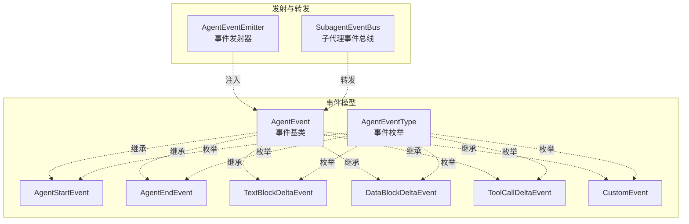
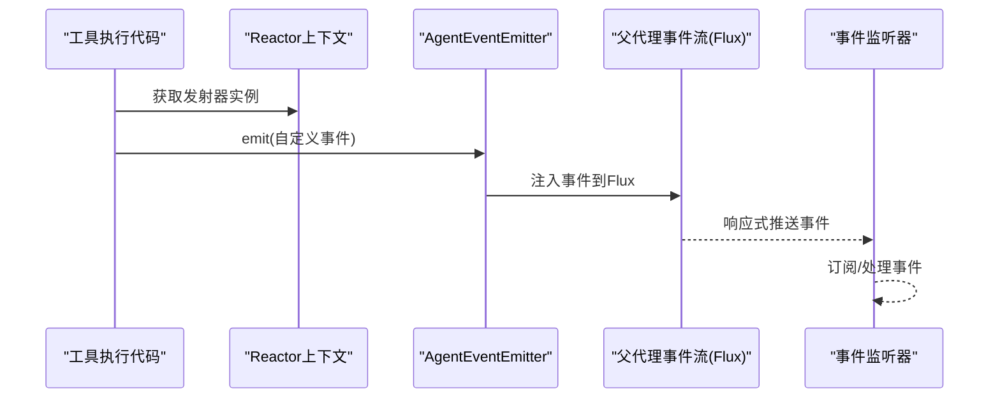
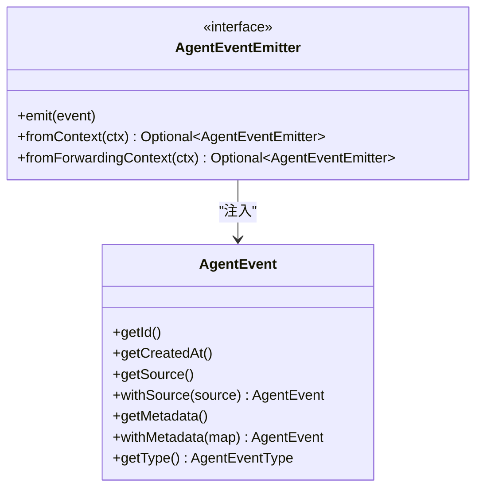
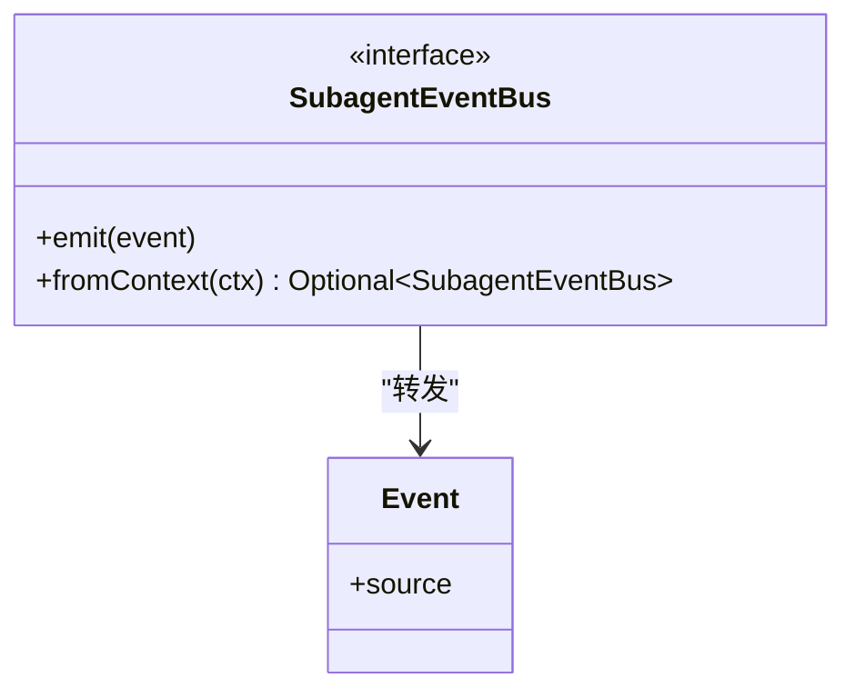
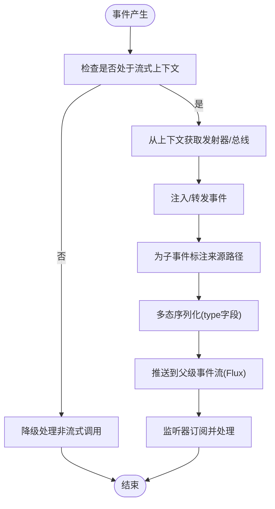
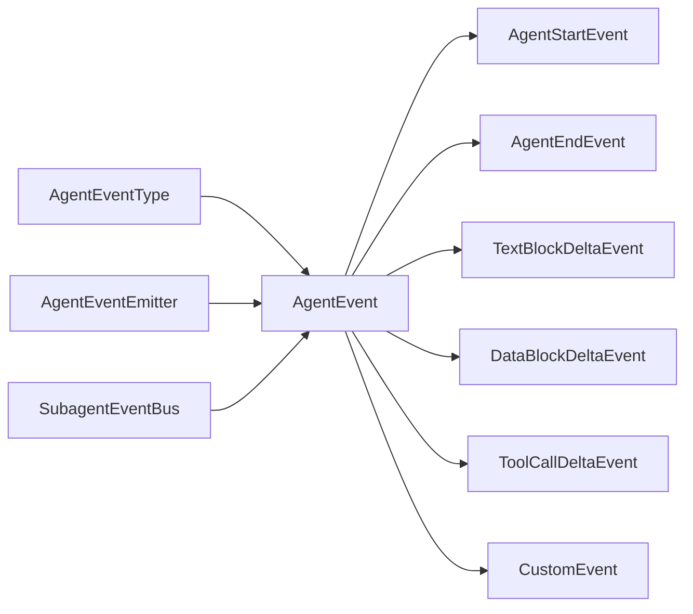

# 事件系统架构

<cite>
**本文引用的文件**
- [AgentEvent.java](file://agentscope-core/src/main/java/io/agentscope/core/event/AgentEvent.java)
- [AgentEventType.java](file://agentscope-core/src/main/java/io/agentscope/core/event/AgentEventType.java)
- [AgentEventEmitter.java](file://agentscope-core/src/main/java/io/agentscope/core/event/AgentEventEmitter.java)
- [AgentStartEvent.java](file://agentscope-core/src/main/java/io/agentscope/core/event/AgentStartEvent.java)
- [AgentEndEvent.java](file://agentscope-core/src/main/java/io/agentscope/core/event/AgentEndEvent.java)
- [TextBlockDeltaEvent.java](file://agentscope-core/src/main/java/io/agentscope/core/event/TextBlockDeltaEvent.java)
- [DataBlockDeltaEvent.java](file://agentscope-core/src/main/java/io/agentscope/core/event/DataBlockDeltaEvent.java)
- [ToolCallDeltaEvent.java](file://agentscope-core/src/main/java/io/agentscope/core/event/ToolCallDeltaEvent.java)
- [CustomEvent.java](file://agentscope-core/src/main/java/io/agentscope/core/event/CustomEvent.java)
- [SubagentEventBus.java](file://agentscope-core/src/main/java/io/agentscope/core/agent/SubagentEventBus.java)
- [AgentBase.java](file://agentscope-core/src/main/java/io/agentscope/core/agent/AgentBase.java)
</cite>

## 目录
1. [引言](#引言)
2. [项目结构](#项目结构)
3. [核心组件](#核心组件)
4. [架构总览](#架构总览)
5. [详细组件分析](#详细组件分析)
6. [依赖分析](#依赖分析)
7. [性能考虑](#性能考虑)
8. [故障排查指南](#故障排查指南)
9. [结论](#结论)
10. [附录：扩展与自定义事件指南](#附录扩展与自定义事件指南)

## 引言
本文件面向事件系统架构，系统性阐述 AgentEvent 事件体系的设计与实现，覆盖事件类型分类、事件发射器与事件处理器的协作机制、事件流传播、监听与注销流程、在流式处理中的作用及响应式编程实践，并提供扩展与自定义事件的完整指南。读者可据此理解 AgentStartEvent、AgentEndEvent、TextBlockDeltaEvent 等关键事件的用途与触发时机，掌握事件系统的使用方法与最佳实践。

## 项目结构
事件系统位于 agentscope-core 模块中，核心文件分布如下：
- 事件基类与类型：AgentEvent、AgentEventType
- 具体事件类型：AgentStartEvent、AgentEndEvent、TextBlockDeltaEvent、DataBlockDeltaEvent、ToolCallDeltaEvent、CustomEvent
- 发射器接口：AgentEventEmitter（用于从工具执行代码向父级事件流注入事件）
- 子代理事件总线：SubagentEventBus（用于同步调用场景下子代理向父代理转发事件）

图示来源
- [AgentEvent.java:72-139](file://agentscope-core/src/main/java/io/agentscope/core/event/AgentEvent.java#L72-L139)
- [AgentEventType.java:40-137](file://agentscope-core/src/main/java/io/agentscope/core/event/AgentEventType.java#L40-L137)
- [AgentStartEvent.java:24-74](file://agentscope-core/src/main/java/io/agentscope/core/event/AgentStartEvent.java#L24-L74)
- [AgentEndEvent.java:24-50](file://agentscope-core/src/main/java/io/agentscope/core/event/AgentEndEvent.java#L24-L50)
- [TextBlockDeltaEvent.java:21-63](file://agentscope-core/src/main/java/io/agentscope/core/event/TextBlockDeltaEvent.java#L21-L63)
- [DataBlockDeltaEvent.java:21-63](file://agentscope-core/src/main/java/io/agentscope/core/event/DataBlockDeltaEvent.java#L21-L63)
- [ToolCallDeltaEvent.java:24-75](file://agentscope-core/src/main/java/io/agentscope/core/event/ToolCallDeltaEvent.java#L24-L75)
- [CustomEvent.java:39-83](file://agentscope-core/src/main/java/io/agentscope/core/event/CustomEvent.java#L39-L83)
- [AgentEventEmitter.java:39-98](file://agentscope-core/src/main/java/io/agentscope/core/event/AgentEventEmitter.java#L39-L98)
- [SubagentEventBus.java:37-70](file://agentscope-core/src/main/java/io/agentscope/core/agent/SubagentEventBus.java#L37-L70)

章节来源
- [AgentEvent.java:27-139](file://agentscope-core/src/main/java/io/agentscope/core/event/AgentEvent.java#L27-L139)
- [AgentEventType.java:22-137](file://agentscope-core/src/main/java/io/agentscope/core/event/AgentEventType.java#L22-L137)
- [AgentEventEmitter.java:21-98](file://agentscope-core/src/main/java/io/agentscope/core/event/AgentEventEmitter.java#L21-L98)
- [SubagentEventBus.java:21-70](file://agentscope-core/src/main/java/io/agentscope/core/agent/SubagentEventBus.java#L21-L70)

## 核心组件
- 事件基类与序列化
  - AgentEvent 提供统一的事件标识、时间戳、来源路径与元数据能力；通过 Jackson 注解实现多态反序列化，支持按类型名称进行事件分发。
- 事件类型枚举
  - AgentEventType 定义了完整的事件类型集合，包含文本块、思考块、数据块、工具调用、结果、用户交互、外部执行、停止请求、子代理暴露、提示块、自定义事件等，并兼容历史别名。
- 具体事件类型
  - AgentStartEvent、AgentEndEvent：标记一次代理调用的开始与结束，携带会话与回复标识。
  - TextBlockDeltaEvent：流式输出文本增量。
  - DataBlockDeltaEvent：流式输出二进制/数据块增量。
  - ToolCallDeltaEvent：流式输出工具调用参数增量。
  - CustomEvent：通用扩展事件，用于业务侧非核心事件通知。
- 事件发射器
  - AgentEventEmitter 是一个函数式接口，提供从工具执行上下文中向父级事件流注入事件的能力；通过 Reactor Context 键值检索，支持转发上下文以标注子事件来源。
- 子代理事件总线
  - SubagentEventBus 支持同步调用场景下的子代理事件转发至父代理的事件流，要求事件已附带来源信息以便下游识别。

章节来源
- [AgentEvent.java:72-139](file://agentscope-core/src/main/java/io/agentscope/core/event/AgentEvent.java#L72-L139)
- [AgentEventType.java:40-137](file://agentscope-core/src/main/java/io/agentscope/core/event/AgentEventType.java#L40-L137)
- [AgentStartEvent.java:24-74](file://agentscope-core/src/main/java/io/agentscope/core/event/AgentStartEvent.java#L24-L74)
- [AgentEndEvent.java:24-50](file://agentscope-core/src/main/java/io/agentscope/core/event/AgentEndEvent.java#L24-L50)
- [TextBlockDeltaEvent.java:21-63](file://agentscope-core/src/main/java/io/agentscope/core/event/TextBlockDeltaEvent.java#L21-L63)
- [DataBlockDeltaEvent.java:21-63](file://agentscope-core/src/main/java/io/agentscope/core/event/DataBlockDeltaEvent.java#L21-L63)
- [ToolCallDeltaEvent.java:24-75](file://agentscope-core/src/main/java/io/agentscope/core/event/ToolCallDeltaEvent.java#L24-L75)
- [CustomEvent.java:39-83](file://agentscope-core/src/main/java/io/agentscope/core/event/CustomEvent.java#L39-L83)
- [AgentEventEmitter.java:39-98](file://agentscope-core/src/main/java/io/agentscope/core/event/AgentEventEmitter.java#L39-L98)
- [SubagentEventBus.java:37-70](file://agentscope-core/src/main/java/io/agentscope/core/agent/SubagentEventBus.java#L37-L70)

## 架构总览
事件系统围绕“事件类型 + 多态序列化 + 流式发射 + 上下文传递”构建，形成从代理内部到父级事件流的统一通道。工具或子代理可通过发射器/总线将事件注入到 Reactor 事件流中，前端或监听器以响应式方式消费这些事件，实现流式渲染与实时反馈。

图示来源
- [AgentEventEmitter.java:77-96](file://agentscope-core/src/main/java/io/agentscope/core/event/AgentEventEmitter.java#L77-L96)
- [AgentBase.java:1-200](file://agentscope-core/src/main/java/io/agentscope/core/agent/AgentBase.java#L1-L200)

## 详细组件分析

### 事件类型与用途
- 代理生命周期事件
  - AgentStartEvent：一次代理调用开始时发出，包含会话标识、回复标识、代理名称与角色。
  - AgentEndEvent：一次代理调用结束时发出，包含回复标识。
- 文本块事件
  - TextBlockStartEvent、TextBlockDeltaEvent、TextBlockEndEvent：分别表示文本块开始、增量流式输出、文本块结束。
- 思考块事件
  - ThinkingBlockStartEvent、ThinkingBlockDeltaEvent、ThinkingBlockEndEvent：对应思考过程的开始、增量、结束。
- 数据块事件
  - DataBlockStartEvent、DataBlockDeltaEvent、DataBlockEndEvent：对应二进制/数据块的开始、增量、结束。
- 工具调用事件
  - ToolCallStartEvent、ToolCallDeltaEvent、ToolCallEndEvent：对应工具调用的开始、参数增量、结束。
- 工具结果事件
  - ToolResultStartEvent、ToolResultTextDeltaEvent、ToolResultDataDeltaEvent、ToolResultEndEvent：对应工具结果的开始、文本增量、数据增量、结束。
- 用户交互与外部执行
  - RequireUserConfirmEvent、UserConfirmResultEvent：请求用户确认与返回确认结果。
  - RequireExternalExecutionEvent、ExternalExecutionResultEvent：请求外部执行与返回执行结果。
- 控制与状态
  - RequestStopEvent：请求停止当前流程。
  - ExceedMaxItersEvent：超过最大迭代次数。
  - SubagentExposedEvent：子代理暴露事件。
  - HintBlockEvent：提示块事件。
- 自定义事件
  - CustomEvent：通用扩展事件，用于业务侧通知，如状态更新、团队成员变更等。

章节来源
- [AgentEventType.java:40-137](file://agentscope-core/src/main/java/io/agentscope/core/event/AgentEventType.java#L40-L137)
- [AgentStartEvent.java:24-74](file://agentscope-core/src/main/java/io/agentscope/core/event/AgentStartEvent.java#L24-L74)
- [AgentEndEvent.java:24-50](file://agentscope-core/src/main/java/io/agentscope/core/event/AgentEndEvent.java#L24-L50)
- [TextBlockDeltaEvent.java:21-63](file://agentscope-core/src/main/java/io/agentscope/core/event/TextBlockDeltaEvent.java#L21-L63)
- [DataBlockDeltaEvent.java:21-63](file://agentscope-core/src/main/java/io/agentscope/core/event/DataBlockDeltaEvent.java#L21-L63)
- [ToolCallDeltaEvent.java:24-75](file://agentscope-core/src/main/java/io/agentscope/core/event/ToolCallDeltaEvent.java#L24-L75)
- [CustomEvent.java:39-83](file://agentscope-core/src/main/java/io/agentscope/core/event/CustomEvent.java#L39-L83)

### 事件发射器与上下文协作
- 上下文键值
  - CONTEXT_KEY：父代理事件发射器实例键。
  - FORWARDING_CONTEXT_KEY：子代理事件转发包装器键，用于在子代理内部事件进入父流前打上来源路径。
- 获取与使用
  - 通过 Reactor Context 的 fromContext/fromForwardingContext 静态方法安全获取发射器实例；在非流式调用（call）场景下返回空，允许降级处理。
- 线程安全性
  - 发射器内部基于线程安全的 FluxSink 实现，可在任意线程调用 emit。

图示来源
- [AgentEventEmitter.java:39-98](file://agentscope-core/src/main/java/io/agentscope/core/event/AgentEventEmitter.java#L39-L98)
- [AgentEvent.java:72-139](file://agentscope-core/src/main/java/io/agentscope/core/event/AgentEvent.java#L72-L139)

章节来源
- [AgentEventEmitter.java:21-98](file://agentscope-core/src/main/java/io/agentscope/core/event/AgentEventEmitter.java#L21-L98)

### 子代理事件总线
- 适用场景
  - 同步调用（非流式）场景下，子代理需要将自身事件推送到父代理的事件流。
- 使用方式
  - 通过 SubagentEventBus.fromContext 获取总线实例；事件需预先附带来源信息（EventSource），以便下游识别来源。
- 线程安全性
  - 内部基于线程安全的 FluxSink 实现。

图示来源
- [SubagentEventBus.java:37-70](file://agentscope-core/src/main/java/io/agentscope/core/agent/SubagentEventBus.java#L37-L70)

章节来源
- [SubagentEventBus.java:21-70](file://agentscope-core/src/main/java/io/agentscope/core/agent/SubagentEventBus.java#L21-L70)

### 事件流传播机制
- 事件注入
  - 工具执行代码在流式上下文中通过 AgentEventEmitter.emit 注入事件；子代理通过 SubagentEventBus.emit 转发事件。
- 来源标注
  - 子代理事件在进入父流前由转发发射器自动标注 source 路径，便于区分事件来源。
- 序列化与多态
  - AgentEvent 基类通过 Jackson 注解声明类型字段与子类型映射，确保事件在传输过程中可被正确识别与反序列化。

图示来源
- [AgentEventEmitter.java:77-96](file://agentscope-core/src/main/java/io/agentscope/core/event/AgentEventEmitter.java#L77-L96)
- [SubagentEventBus.java:63-68](file://agentscope-core/src/main/java/io/agentscope/core/agent/SubagentEventBus.java#L63-L68)
- [AgentEvent.java:35-71](file://agentscope-core/src/main/java/io/agentscope/core/event/AgentEvent.java#L35-L71)

章节来源
- [AgentEventEmitter.java:21-98](file://agentscope-core/src/main/java/io/agentscope/core/event/AgentEventEmitter.java#L21-L98)
- [SubagentEventBus.java:21-70](file://agentscope-core/src/main/java/io/agentscope/core/agent/SubagentEventBus.java#L21-L70)
- [AgentEvent.java:27-71](file://agentscope-core/src/main/java/io/agentscope/core/event/AgentEvent.java#L27-L71)

### 事件监听与注销流程
- 订阅
  - 在父代理的事件流上使用响应式 API 进行订阅，按事件类型进行过滤与处理。
- 注销
  - 当订阅者不再需要接收事件时，取消订阅以释放资源；在 Reactor 中通常通过 Disposable 或背压策略管理生命周期。
- 注意事项
  - 在非流式调用（call）场景下，上下文中不存在发射器/总线，订阅逻辑应具备容错能力。

章节来源
- [AgentBase.java:1-200](file://agentscope-core/src/main/java/io/agentscope/core/agent/AgentBase.java#L1-L200)

### 流式处理与响应式编程
- 流式渲染
  - TextBlockDeltaEvent、DataBlockDeltaEvent、ToolCallDeltaEvent 等增量事件用于实时渲染，提升用户体验。
- 响应式链路
  - 事件在 Reactor 事件流中逐级传递，监听器可基于事件类型与元数据进行条件处理与组合。
- 背压与中断
  - 结合框架的中断与背压机制，可在长时流式处理中优雅地控制速率与终止。

章节来源
- [TextBlockDeltaEvent.java:21-63](file://agentscope-core/src/main/java/io/agentscope/core/event/TextBlockDeltaEvent.java#L21-L63)
- [DataBlockDeltaEvent.java:21-63](file://agentscope-core/src/main/java/io/agentscope/core/event/DataBlockDeltaEvent.java#L21-L63)
- [ToolCallDeltaEvent.java:24-75](file://agentscope-core/src/main/java/io/agentscope/core/event/ToolCallDeltaEvent.java#L24-L75)
- [AgentBase.java:66-90](file://agentscope-core/src/main/java/io/agentscope/core/agent/AgentBase.java#L66-L90)

## 依赖分析
- 组件耦合
  - AgentEvent 作为所有具体事件的基类，承担统一标识与序列化职责；AgentEventType 作为类型枚举，驱动多态分发。
  - AgentEventEmitter/SubagentEventBus 与 Reactor 上下文耦合，负责事件注入与转发。
- 外部依赖
  - Jackson 注解用于事件的多态序列化与反序列化。
  - Reactor Sinks/Context 用于事件流与上下文传递。

图示来源
- [AgentEventType.java:40-137](file://agentscope-core/src/main/java/io/agentscope/core/event/AgentEventType.java#L40-L137)
- [AgentEvent.java:72-139](file://agentscope-core/src/main/java/io/agentscope/core/event/AgentEvent.java#L72-L139)
- [AgentEventEmitter.java:39-98](file://agentscope-core/src/main/java/io/agentscope/core/event/AgentEventEmitter.java#L39-L98)
- [SubagentEventBus.java:37-70](file://agentscope-core/src/main/java/io/agentscope/core/agent/SubagentEventBus.java#L37-L70)

章节来源
- [AgentEventType.java:22-137](file://agentscope-core/src/main/java/io/agentscope/core/event/AgentEventType.java#L22-L137)
- [AgentEvent.java:27-139](file://agentscope-core/src/main/java/io/agentscope/core/event/AgentEvent.java#L27-L139)
- [AgentEventEmitter.java:21-98](file://agentscope-core/src/main/java/io/agentscope/core/event/AgentEventEmitter.java#L21-L98)
- [SubagentEventBus.java:21-70](file://agentscope-core/src/main/java/io/agentscope/core/agent/SubagentEventBus.java#L21-L70)

## 性能考虑
- 线程安全与吞吐
  - 发射器与总线均基于线程安全的 Sink 实现，可在高并发工具执行场景下稳定注入事件。
- 序列化开销
  - 多态序列化通过类型字段实现，建议在高频事件场景下避免冗余元数据，减少序列化体积。
- 背压与限速
  - 结合 Reactor 的背压策略与中断机制，避免事件洪泛导致的内存压力。

## 故障排查指南
- 事件未到达监听器
  - 检查是否处于流式上下文；在非流式调用（call）场景下，上下文中不存在发射器/总线，需降级处理。
- 事件来源缺失
  - 子代理事件需预先附带来源信息；若使用转发发射器，请确认转发上下文键值正确。
- 类型识别失败
  - 确认事件类型字段与 AgentEventType 枚举一致；对于历史别名，确保反序列化端支持兼容映射。

章节来源
- [AgentEventEmitter.java:77-96](file://agentscope-core/src/main/java/io/agentscope/core/event/AgentEventEmitter.java#L77-L96)
- [SubagentEventBus.java:63-68](file://agentscope-core/src/main/java/io/agentscope/core/agent/SubagentEventBus.java#L63-L68)
- [AgentEventType.java:112-135](file://agentscope-core/src/main/java/io/agentscope/core/event/AgentEventType.java#L112-L135)

## 结论
事件系统通过统一的事件基类、明确的类型枚举、上下文驱动的发射与转发机制，实现了从代理内部到父级事件流的可靠传播。结合流式增量事件与响应式订阅，系统能够高效支撑实时渲染与可观测性需求。同时，自定义事件与扩展点为业务侧提供了灵活的接入方式。

## 附录：扩展与自定义事件指南
- 创建自定义事件
  - 新建事件类继承 AgentEvent，并在构造函数中设置必要的字段；重写 getType 返回对应的 AgentEventType 枚举值。
  - 在 AgentEventType 中添加新的枚举常量，并在 AgentEvent 的 @JsonSubTypes 中注册该事件类型，确保多态序列化生效。
- 注册与使用
  - 在工具执行代码中通过 AgentEventEmitter.fromContext 获取发射器实例，调用 emit 注入自定义事件。
  - 若涉及子代理场景，确保事件已附带来源信息，必要时使用转发发射器自动标注来源路径。
- 示例参考
  - 参考 CustomEvent 的设计思路与使用方式，了解通用扩展事件的最佳实践。

章节来源
- [CustomEvent.java:39-83](file://agentscope-core/src/main/java/io/agentscope/core/event/CustomEvent.java#L39-L83)
- [AgentEventEmitter.java:77-96](file://agentscope-core/src/main/java/io/agentscope/core/event/AgentEventEmitter.java#L77-L96)
- [AgentEvent.java:35-71](file://agentscope-core/src/main/java/io/agentscope/core/event/AgentEvent.java#L35-L71)
- [AgentEventType.java:40-137](file://agentscope-core/src/main/java/io/agentscope/core/event/AgentEventType.java#L40-L137)