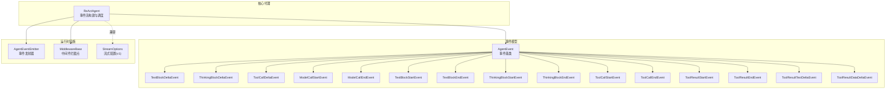
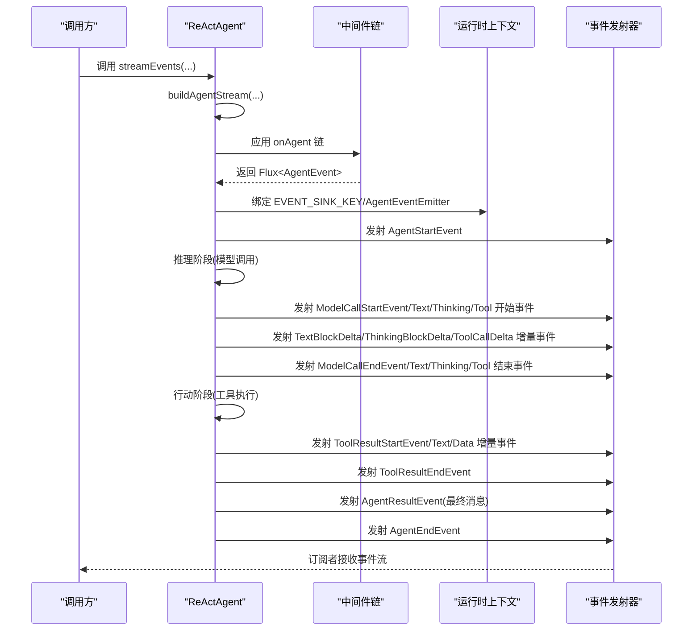
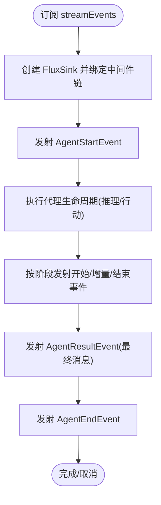
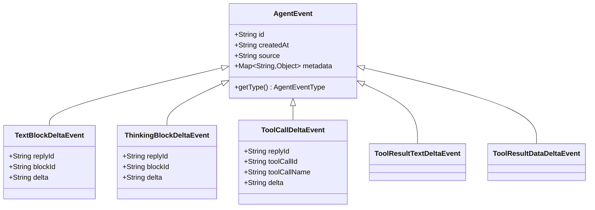
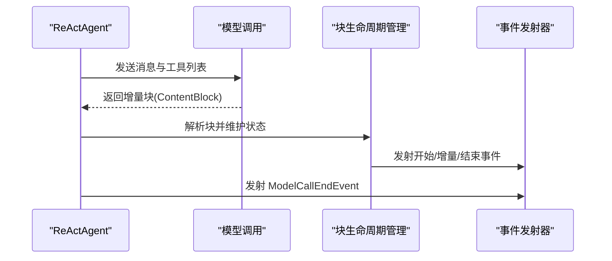
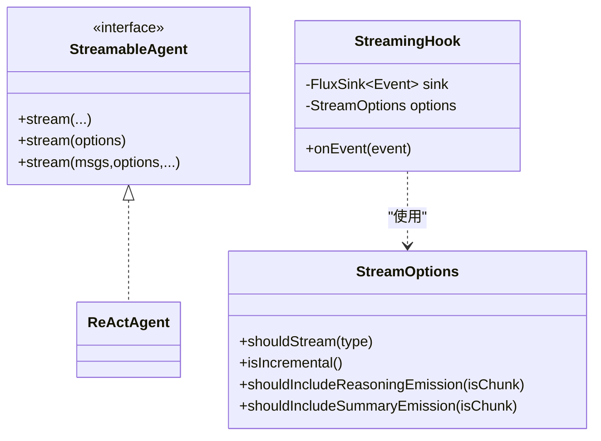
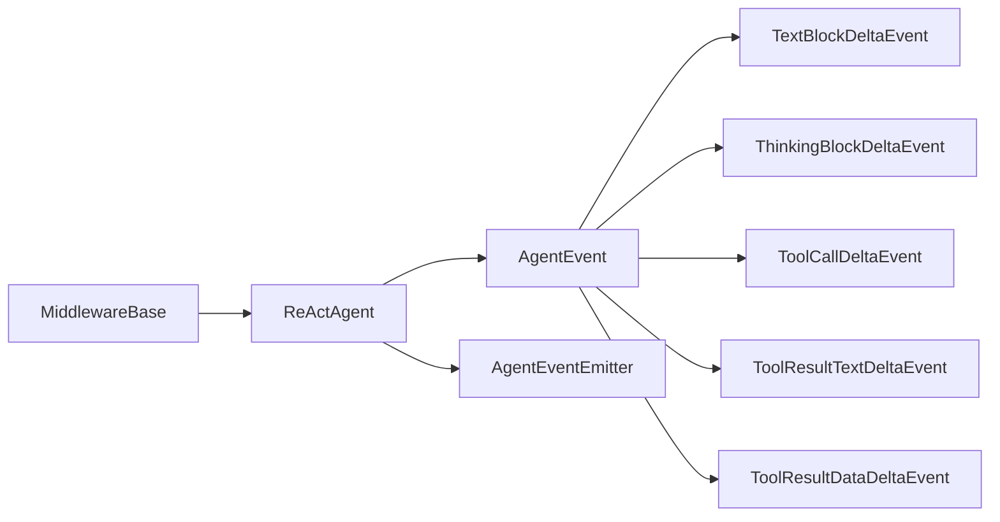

# 流式事件处理

<cite>
**本文引用的文件**
- [ReActAgent.java](file://agentscope-core/src/main/java/io/agentscope/core/ReActAgent.java)
- [AgentEvent.java](file://agentscope-core/src/main/java/io/agentscope/core/event/AgentEvent.java)
- [TextBlockDeltaEvent.java](file://agentscope-core/src/main/java/io/agentscope/core/event/TextBlockDeltaEvent.java)
- [ThinkingBlockDeltaEvent.java](file://agentscope-core/src/main/java/io/agentscope/core/event/ThinkingBlockDeltaEvent.java)
- [ToolCallDeltaEvent.java](file://agentscope-core/src/main/java/io/agentscope/core/event/ToolCallDeltaEvent.java)
- [AgentEventEmitter.java](file://agentscope-core/src/main/java/io/agentscope/core/event/AgentEventEmitter.java)
- [MiddlewareBase.java](file://agentscope-core/src/main/java/io/agentscope/core/middleware/MiddlewareBase.java)
- [StreamOptions.java](file://agentscope-core/src/main/java/io/agentscope/core/agent/StreamOptions.java)
- [StreamableAgent.java](file://agentscope-core/src/main/java/io/agentscope/core/agent/StreamableAgent.java)
- [StreamingHook.java](file://agentscope-core/src/main/java/io/agentscope/core/agent/StreamingHook.java)
- [AgentStartEvent.java](file://agentscope-core/src/main/java/io/agentscope/core/event/AgentStartEvent.java)
- [AgentEndEvent.java](file://agentscope-core/src/main/java/io/agentscope/core/event/AgentEndEvent.java)
- [AgentResultEvent.java](file://agentscope-core/src/main/java/io/agentscope/core/event/AgentResultEvent.java)
- [ModelCallStartEvent.java](file://agentscope-core/src/main/java/io/agentscope/core/event/ModelCallStartEvent.java)
- [ModelCallEndEvent.java](file://agentscope-core/src/main/java/io/agentscope/core/event/ModelCallEndEvent.java)
- [TextBlockStartEvent.java](file://agentscope-core/src/main/java/io/agentscope/core/event/TextBlockStartEvent.java)
- [TextBlockEndEvent.java](file://agentscope-core/src/main/java/io/agentscope/core/event/TextBlockEndEvent.java)
- [ThinkingBlockStartEvent.java](file://agentscope-core/src/main/java/io/agentscope/core/event/ThinkingBlockStartEvent.java)
- [ThinkingBlockEndEvent.java](file://agentscope-core/src/main/java/io/agentscope/core/event/ThinkingBlockEndEvent.java)
- [ToolCallStartEvent.java](file://agentscope-core/src/main/java/io/agentscope/core/event/ToolCallStartEvent.java)
- [ToolCallEndEvent.java](file://agentscope-core/src/main/java/io/agentscope/core/event/ToolCallEndEvent.java)
- [ToolResultStartEvent.java](file://agentscope-core/src/main/java/io/agentscope/core/event/ToolResultStartEvent.java)
- [ToolResultEndEvent.java](file://agentscope-core/src/main/java/io/agentscope/core/event/ToolResultEndEvent.java)
- [ToolResultTextDeltaEvent.java](file://agentscope-core/src/main/java/io/agentscope/core/event/ToolResultTextDeltaEvent.java)
- [ToolResultDataDeltaEvent.java](file://agentscope-core/src/main/java/io/agentscope/core/event/ToolResultDataDeltaEvent.java)
- [RequireUserConfirmEvent.java](file://agentscope-core/src/main/java/io/agentscope/core/event/RequireUserConfirmEvent.java)
- [UserConfirmResultEvent.java](file://agentscope-core/src/main/java/io/agentscope/core/event/UserConfirmResultEvent.java)
- [RequestStopEvent.java](file://agentscope-core/src/main/java/io/agentscope/core/event/RequestStopEvent.java)
- [ExceedMaxItersEvent.java](file://agentscope-core/src/main/java/io/agentscope/core/event/ExceedMaxItersEvent.java)
- [SubagentExposedEvent.java](file://agentscope-core/src/main/java/io/agentscope/core/event/SubagentExposedEvent.java)
- [CustomEvent.java](file://agentscope-core/src/main/java/io/agentscope/core/event/CustomEvent.java)
- [HintBlockEvent.java](file://agentscope-core/src/main/java/io/agentscope/core/event/HintBlockEvent.java)
- [RequireExternalExecutionEvent.java](file://agentscope-core/src/main/java/io/agentscope/core/event/RequireExternalExecutionEvent.java)
- [ExternalExecutionResultEvent.java](file://agentscope-core/src/main/java/io/agentscope/core/event/ExternalExecutionResultEvent.java)
- [DataBlockStartEvent.java](file://agentscope-core/src/main/java/io/agentscope/core/event/DataBlockStartEvent.java)
- [DataBlockDeltaEvent.java](file://agentscope-core/src/main/java/io/agentscope/core/event/DataBlockDeltaEvent.java)
- [DataBlockEndEvent.java](file://agentscope-core/src/main/java/io/agentscope/core/event/DataBlockEndEvent.java)
- [AgentEventType.java](file://agentscope-core/src/main/java/io/agentscope/core/event/AgentEventType.java)
- [AgentEventEmitter.java](file://agentscope-core/src/main/java/io/agentscope/core/event/AgentEventEmitter.java)
</cite>

## 目录
1. [简介](#简介)
2. [项目结构](#项目结构)
3. [核心组件](#核心组件)
4. [架构总览](#架构总览)
5. [详细组件分析](#详细组件分析)
6. [依赖分析](#依赖分析)
7. [性能考虑](#性能考虑)
8. [故障排查指南](#故障排查指南)
9. [结论](#结论)
10. [附录](#附录)

## 简介
本文件面向流式事件处理的专业技术文档，聚焦于 AgentScope v2 的 AgentEvent 事件体系与 ReActAgent 的流式事件机制。内容涵盖：
- AgentEvent 事件模型与细粒度事件类型
- ReActAgent 的事件流创建、订阅与取消订阅流程
- 文本块增量、思维块增量、工具调用增量等事件的处理方式
- 背压控制与流式行为配置（StreamOptions）
- 与 StreamingHook 的集成（已废弃）及与新事件系统的对比
- 性能优化策略：事件合并、缓冲区管理与内存控制
- 实战示例：订阅、处理与自定义事件的实现路径

## 项目结构
围绕流式事件处理的关键模块与文件如下：
- ReActAgent：核心代理，负责构建与驱动 AgentEvent 事件流
- AgentEvent 及其子类：统一的事件基类与细粒度事件类型
- AgentEventEmitter：从工具内部向父事件流注入事件的接口
- MiddlewareBase：中间件拦截点，贯穿推理、行动与模型调用阶段
- StreamOptions：流式行为配置（兼容 v1 的 StreamableAgent/StreamingHook）

**图表来源**
- [ReActAgent.java](file://agentscope-core/src/main/java/io/agentscope/core/ReActAgent.java)
- [AgentEvent.java](file://agentscope-core/src/main/java/io/agentscope/core/event/AgentEvent.java)
- [AgentEventEmitter.java](file://agentscope-core/src/main/java/io/agentscope/core/event/AgentEventEmitter.java)
- [MiddlewareBase.java](file://agentscope-core/src/main/java/io/agentscope/core/middleware/MiddlewareBase.java)
- [StreamOptions.java](file://agentscope-core/src/main/java/io/agentscope/core/agent/StreamOptions.java)

**章节来源**
- [ReActAgent.java](file://agentscope-core/src/main/java/io/agentscope/core/ReActAgent.java)
- [AgentEvent.java](file://agentscope-core/src/main/java/io/agentscope/core/event/AgentEvent.java)
- [AgentEventEmitter.java](file://agentscope-core/src/main/java/io/agentscope/core/event/AgentEventEmitter.java)
- [MiddlewareBase.java](file://agentscope-core/src/main/java/io/agentscope/core/middleware/MiddlewareBase.java)
- [StreamOptions.java](file://agentscope-core/src/main/java/io/agentscope/core/agent/StreamOptions.java)

## 核心组件
- AgentEvent 与细粒度事件类型：统一的事件基类，通过多态子类型覆盖文本块、思维块、数据块、工具调用与结果等全生命周期事件，支持 JSON 多态序列化与元数据扩展。
- ReActAgent 事件流：通过 buildAgentStream 构建完整生命周期事件流，包含 AgentStartEvent、推理/行动阶段的开始/增量/结束事件、工具结果事件、AgentResultEvent、AgentEndEvent 等。
- AgentEventEmitter：在工具执行期间向父事件流注入自定义事件（如子代理暴露事件），或由父代理注入转发包装以携带来源路径。
- 中间件链：在 Agent、推理、行动、模型调用四个关键阶段提供拦截与转换能力，保证所有调用路径共享同一事件流。
- StreamOptions（v1 兼容层）：用于配置事件类型过滤、增量/累积模式、推理/摘要/行动片段的包含策略。

**章节来源**
- [AgentEvent.java](file://agentscope-core/src/main/java/io/agentscope/core/event/AgentEvent.java)
- [ReActAgent.java](file://agentscope-core/src/main/java/io/agentscope/core/ReActAgent.java)
- [AgentEventEmitter.java](file://agentscope-core/src/main/java/io/agentscope/core/event/AgentEventEmitter.java)
- [MiddlewareBase.java](file://agentscope-core/src/main/java/io/agentscope/core/middleware/MiddlewareBase.java)
- [StreamOptions.java](file://agentscope-core/src/main/java/io/agentscope/core/agent/StreamOptions.java)

## 架构总览
ReActAgent 的事件流采用“单一流水线”设计：无论 call() 还是 streamEvents()，都共享同一个 buildAgentStream 核心，确保中间件链与事件一致性。事件流在每个模型调用与工具执行阶段产生细粒度增量事件，最终在 AgentEndEvent 结束，并在 AgentResultEvent 中携带最终消息。

**图表来源**
- [ReActAgent.java](file://agentscope-core/src/main/java/io/agentscope/core/ReActAgent.java)
- [AgentEventEmitter.java](file://agentscope-core/src/main/java/io/agentscope/core/event/AgentEventEmitter.java)
- [AgentStartEvent.java](file://agentscope-core/src/main/java/io/agentscope/core/event/AgentStartEvent.java)
- [AgentEndEvent.java](file://agentscope-core/src/main/java/io/agentscope/core/event/AgentEndEvent.java)
- [AgentResultEvent.java](file://agentscope-core/src/main/java/io/agentscope/core/event/AgentResultEvent.java)
- [ModelCallStartEvent.java](file://agentscope-core/src/main/java/io/agentscope/core/event/ModelCallStartEvent.java)
- [ModelCallEndEvent.java](file://agentscope-core/src/main/java/io/agentscope/core/event/ModelCallEndEvent.java)
- [TextBlockStartEvent.java](file://agentscope-core/src/main/java/io/agentscope/core/event/TextBlockStartEvent.java)
- [TextBlockEndEvent.java](file://agentscope-core/src/main/java/io/agentscope/core/event/TextBlockEndEvent.java)
- [ThinkingBlockStartEvent.java](file://agentscope-core/src/main/java/io/agentscope/core/event/ThinkingBlockStartEvent.java)
- [ThinkingBlockEndEvent.java](file://agentscope-core/src/main/java/io/agentscope/core/event/ThinkingBlockEndEvent.java)
- [ToolCallStartEvent.java](file://agentscope-core/src/main/java/io/agentscope/core/event/ToolCallStartEvent.java)
- [ToolCallEndEvent.java](file://agentscope-core/src/main/java/io/agentscope/core/event/ToolCallEndEvent.java)
- [ToolResultStartEvent.java](file://agentscope-core/src/main/java/io/agentscope/core/event/ToolResultStartEvent.java)
- [ToolResultEndEvent.java](file://agentscope-core/src/main/java/io/agentscope/core/event/ToolResultEndEvent.java)
- [ToolResultTextDeltaEvent.java](file://agentscope-core/src/main/java/io/agentscope/core/event/ToolResultTextDeltaEvent.java)
- [ToolResultDataDeltaEvent.java](file://agentscope-core/src/main/java/io/agentscope/core/event/ToolResultDataDeltaEvent.java)

## 详细组件分析

### ReActAgent 事件流创建与订阅
- 构建核心：buildAgentStream 在每次订阅时创建一个 FluxSink，并将该 sink 与中间件链绑定，形成完整的事件流。
- 生命周期事件：在订阅开始时发射 AgentStartEvent，在订阅完成时发射 AgentEndEvent；最终消息通过 AgentResultEvent 提前注入，便于订阅者在结束前获取结果。
- 运行时上下文：EVENT_SINK_KEY 与 AgentEventEmitter 注入到 Reactor Context，确保工具执行期间可安全注入事件。
- 取消订阅：FluxSink.onCancel 绑定生命周期 Disposable，取消订阅时自动清理。

**图表来源**
- [ReActAgent.java](file://agentscope-core/src/main/java/io/agentscope/core/ReActAgent.java)
- [AgentStartEvent.java](file://agentscope-core/src/main/java/io/agentscope/core/event/AgentStartEvent.java)
- [AgentEndEvent.java](file://agentscope-core/src/main/java/io/agentscope/core/event/AgentEndEvent.java)
- [AgentResultEvent.java](file://agentscope-core/src/main/java/io/agentscope/core/event/AgentResultEvent.java)

**章节来源**
- [ReActAgent.java](file://agentscope-core/src/main/java/io/agentscope/core/ReActAgent.java)

### 事件类型与增量处理
- 文本块增量：TextBlockDeltaEvent 携带 replyId、blockId 与增量文本，配合 TextBlockStartEvent/EndEvent 形成块级生命周期。
- 思维块增量：ThinkingBlockDeltaEvent 同步思维阶段的增量输出，配合 ThinkingBlockStartEvent/EndEvent。
- 工具调用增量：ToolCallDeltaEvent 描述工具调用参数的增量输入，配合 ToolCallStartEvent/EndEvent。
- 工具结果增量：ToolResultTextDeltaEvent 与 ToolResultDataDeltaEvent 描述工具返回的文本与数据增量。
- 数据块增量：DataBlockStartEvent/DeltaEvent/EndEvent 支持二进制/多媒体等数据块的增量传输。

**图表来源**
- [AgentEvent.java](file://agentscope-core/src/main/java/io/agentscope/core/event/AgentEvent.java)
- [TextBlockDeltaEvent.java](file://agentscope-core/src/main/java/io/agentscope/core/event/TextBlockDeltaEvent.java)
- [ThinkingBlockDeltaEvent.java](file://agentscope-core/src/main/java/io/agentscope/core/event/ThinkingBlockDeltaEvent.java)
- [ToolCallDeltaEvent.java](file://agentscope-core/src/main/java/io/agentscope/core/event/ToolCallDeltaEvent.java)
- [ToolResultTextDeltaEvent.java](file://agentscope-core/src/main/java/io/agentscope/core/event/ToolResultTextDeltaEvent.java)
- [ToolResultDataDeltaEvent.java](file://agentscope-core/src/main/java/io/agentscope/core/event/ToolResultDataDeltaEvent.java)

**章节来源**
- [AgentEvent.java](file://agentscope-core/src/main/java/io/agentscope/core/event/AgentEvent.java)
- [TextBlockDeltaEvent.java](file://agentscope-core/src/main/java/io/agentscope/core/event/TextBlockDeltaEvent.java)
- [ThinkingBlockDeltaEvent.java](file://agentscope-core/src/main/java/io/agentscope/core/event/ThinkingBlockDeltaEvent.java)
- [ToolCallDeltaEvent.java](file://agentscope-core/src/main/java/io/agentscope/core/event/ToolCallDeltaEvent.java)
- [ToolResultTextDeltaEvent.java](file://agentscope-core/src/main/java/io/agentscope/core/event/ToolResultTextDeltaEvent.java)
- [ToolResultDataDeltaEvent.java](file://agentscope-core/src/main/java/io/agentscope/core/event/ToolResultDataDeltaEvent.java)

### ReActAgent 的推理与行动阶段事件生成
- 推理阶段：modelCallStream 将模型输出解析为 ContentBlock，逐个映射为对应 AgentEvent，包括 TextBlock/ThinkingBlock/ToolUseBlock 的开始、增量与结束事件，并在最后发射 ModelCallEndEvent。
- 行动阶段：actingStream 对待执行工具进行权限评估与执行，逐个工具发射 ToolResultStartEvent 与增量事件，最后发射 ToolResultEndEvent，并通知后置钩子。

**图表来源**
- [ReActAgent.java](file://agentscope-core/src/main/java/io/agentscope/core/ReActAgent.java)
- [ModelCallStartEvent.java](file://agentscope-core/src/main/java/io/agentscope/core/event/ModelCallStartEvent.java)
- [ModelCallEndEvent.java](file://agentscope-core/src/main/java/io/agentscope/core/event/ModelCallEndEvent.java)
- [TextBlockStartEvent.java](file://agentscope-core/src/main/java/io/agentscope/core/event/TextBlockStartEvent.java)
- [TextBlockEndEvent.java](file://agentscope-core/src/main/java/io/agentscope/core/event/TextBlockEndEvent.java)
- [ThinkingBlockStartEvent.java](file://agentscope-core/src/main/java/io/agentscope/core/event/ThinkingBlockStartEvent.java)
- [ThinkingBlockEndEvent.java](file://agentscope-core/src/main/java/io/agentscope/core/event/ThinkingBlockEndEvent.java)
- [ToolCallStartEvent.java](file://agentscope-core/src/main/java/io/agentscope/core/event/ToolCallStartEvent.java)
- [ToolCallEndEvent.java](file://agentscope-core/src/main/java/io/agentscope/core/event/ToolCallEndEvent.java)

**章节来源**
- [ReActAgent.java](file://agentscope-core/src/main/java/io/agentscope/core/ReActAgent.java)

### 与 StreamingHook 的集成（已废弃）
- v1 的 StreamingHook 通过 FluxSink 将 Hook 事件转换为 Event 类型并过滤增量/汇总片段，现已废弃，推荐使用 ReActAgent#streamEvents 获取细粒度 AgentEvent。
- StreamOptions 仍保留对事件类型的过滤与增量/累积模式控制，但实际生效于新的事件映射层。

**图表来源**
- [StreamableAgent.java](file://agentscope-core/src/main/java/io/agentscope/core/agent/StreamableAgent.java)
- [StreamingHook.java](file://agentscope-core/src/main/java/io/agentscope/core/agent/StreamingHook.java)
- [StreamOptions.java](file://agentscope-core/src/main/java/io/agentscope/core/agent/StreamOptions.java)

**章节来源**
- [StreamableAgent.java](file://agentscope-core/src/main/java/io/agentscope/core/agent/StreamableAgent.java)
- [StreamingHook.java](file://agentscope-core/src/main/java/io/agentscope/core/agent/StreamingHook.java)
- [StreamOptions.java](file://agentscope-core/src/main/java/io/agentscope/core/agent/StreamOptions.java)

### 事件合并、缓冲与背压
- 背压策略：ReActAgent 使用 FluxSink.OverflowStrategy.BUFFER，允许上游快速推送事件，下游通过 subscribe 控制消费速率。
- 事件合并：在模型调用与工具执行阶段，通过 ReasoningContext 与块生命周期管理器聚合增量内容，减少事件数量并保持语义完整性。
- 缓冲区管理：中间件链与工具执行可能引入异步延迟，建议订阅端使用合适的调度器与背压策略（如 BACKPRESSURE 或 DROP）以避免内存压力。

**章节来源**
- [ReActAgent.java](file://agentscope-core/src/main/java/io/agentscope/core/ReActAgent.java)

### 自定义事件与工具注入
- 工具内注入：通过 AgentEventEmitter.fromContext 获取发射器，在工具执行期间注入自定义事件（如 SubagentExposedEvent）。
- 子代理事件转发：父代理可注入转发发射器（FORWARDING_CONTEXT_KEY），使子代理内部事件在进入父流前被打上来源路径标签。

**章节来源**
- [AgentEventEmitter.java](file://agentscope-core/src/main/java/io/agentscope/core/event/AgentEventEmitter.java)
- [SubagentExposedEvent.java](file://agentscope-core/src/main/java/io/agentscope/core/event/SubagentExposedEvent.java)

## 依赖分析
- ReActAgent 依赖中间件链进行阶段拦截与转换，确保事件流一致性。
- 事件类型通过多态序列化支持扩展，新增事件只需继承 AgentEvent 并注册类型标识。
- AgentEventEmitter 与 Reactor Context 协作，避免全局状态耦合。

**图表来源**
- [MiddlewareBase.java](file://agentscope-core/src/main/java/io/agentscope/core/middleware/MiddlewareBase.java)
- [ReActAgent.java](file://agentscope-core/src/main/java/io/agentscope/core/ReActAgent.java)
- [AgentEvent.java](file://agentscope-core/src/main/java/io/agentscope/core/event/AgentEvent.java)
- [AgentEventEmitter.java](file://agentscope-core/src/main/java/io/agentscope/core/event/AgentEventEmitter.java)

**章节来源**
- [MiddlewareBase.java](file://agentscope-core/src/main/java/io/agentscope/core/middleware/MiddlewareBase.java)
- [ReActAgent.java](file://agentscope-core/src/main/java/io/agentscope/core/ReActAgent.java)
- [AgentEvent.java](file://agentscope-core/src/main/java/io/agentscope/core/event/AgentEvent.java)
- [AgentEventEmitter.java](file://agentscope-core/src/main/java/io/agentscope/core/event/AgentEventEmitter.java)

## 性能考虑
- 事件合并：在模型调用与工具执行阶段，优先使用块生命周期管理器合并增量事件，降低事件总数与序列化开销。
- 缓冲区管理：根据下游消费能力选择合适的背压策略；在高吞吐场景下，建议使用 DROP 或策略性暂停上游推送。
- 内存控制：避免在事件中携带大对象；必要时使用外部引用或分片传输；及时清理不再使用的事件缓存。
- 中间件链：尽量减少不必要的事件变换与阻塞操作，保持非阻塞调度。

## 故障排查指南
- 工具执行错误：框架会将异常转换为工具结果文本，事件流不会提前中断，订阅端应检查 ToolResult* 事件的错误状态。
- 人类在环（HITL）：当中间件请求停止或权限询问时，事件流会提前结束并携带相应原因；订阅端需正确处理 RequestStopEvent 与 RequireUserConfirmEvent。
- 超出最大迭代：ExceedMaxItersEvent 标识达到迭代上限；订阅端可据此决定是否发起总结阶段或重试。
- 取消订阅：确保在取消订阅时释放资源，避免内存泄漏；ReActAgent 已在 onCancel 中绑定生命周期清理。

**章节来源**
- [ReActAgent.java](file://agentscope-core/src/main/java/io/agentscope/core/ReActAgent.java)
- [RequestStopEvent.java](file://agentscope-core/src/main/java/io/agentscope/core/event/RequestStopEvent.java)
- [RequireUserConfirmEvent.java](file://agentscope-core/src/main/java/io/agentscope/core/event/RequireUserConfirmEvent.java)
- [ExceedMaxItersEvent.java](file://agentscope-core/src/main/java/io/agentscope/core/event/ExceedMaxItersEvent.java)

## 结论
AgentScope v2 的 AgentEvent 事件体系提供了细粒度、可扩展且一致的流式事件模型。ReActAgent 通过统一的事件流构建机制，覆盖从推理到行动的全生命周期，并支持中间件拦截与工具注入。结合合理的背压策略与事件合并，可在保证实时性的前提下提升整体性能与可维护性。

## 附录
- 事件类型清单（节选）：AgentStartEvent、AgentEndEvent、AgentResultEvent、ModelCallStartEvent/EndEvent、TextBlock*/ThinkingBlock*/ToolCall*/ToolResult*、RequireUserConfirmEvent、RequestStopEvent、ExceedMaxItersEvent、SubagentExposedEvent、CustomEvent、HintBlockEvent、RequireExternalExecutionEvent、ExternalExecutionResultEvent、DataBlock*。
- 配置参考：StreamOptions（事件类型过滤、增量/累积模式、片段包含策略）。

**章节来源**
- [AgentEventType.java](file://agentscope-core/src/main/java/io/agentscope/core/event/AgentEventType.java)
- [AgentStartEvent.java](file://agentscope-core/src/main/java/io/agentscope/core/event/AgentStartEvent.java)
- [AgentEndEvent.java](file://agentscope-core/src/main/java/io/agentscope/core/event/AgentEndEvent.java)
- [AgentResultEvent.java](file://agentscope-core/src/main/java/io/agentscope/core/event/AgentResultEvent.java)
- [ModelCallStartEvent.java](file://agentscope-core/src/main/java/io/agentscope/core/event/ModelCallStartEvent.java)
- [ModelCallEndEvent.java](file://agentscope-core/src/main/java/io/agentscope/core/event/ModelCallEndEvent.java)
- [TextBlockStartEvent.java](file://agentscope-core/src/main/java/io/agentscope/core/event/TextBlockStartEvent.java)
- [TextBlockEndEvent.java](file://agentscope-core/src/main/java/io/agentscope/core/event/TextBlockEndEvent.java)
- [ThinkingBlockStartEvent.java](file://agentscope-core/src/main/java/io/agentscope/core/event/ThinkingBlockStartEvent.java)
- [ThinkingBlockEndEvent.java](file://agentscope-core/src/main/java/io/agentscope/core/event/ThinkingBlockEndEvent.java)
- [ToolCallStartEvent.java](file://agentscope-core/src/main/java/io/agentscope/core/event/ToolCallStartEvent.java)
- [ToolCallEndEvent.java](file://agentscope-core/src/main/java/io/agentscope/core/event/ToolCallEndEvent.java)
- [ToolResultStartEvent.java](file://agentscope-core/src/main/java/io/agentscope/core/event/ToolResultStartEvent.java)
- [ToolResultEndEvent.java](file://agentscope-core/src/main/java/io/agentscope/core/event/ToolResultEndEvent.java)
- [ToolResultTextDeltaEvent.java](file://agentscope-core/src/main/java/io/agentscope/core/event/ToolResultTextDeltaEvent.java)
- [ToolResultDataDeltaEvent.java](file://agentscope-core/src/main/java/io/agentscope/core/event/ToolResultDataDeltaEvent.java)
- [RequireUserConfirmEvent.java](file://agentscope-core/src/main/java/io/agentscope/core/event/RequireUserConfirmEvent.java)
- [UserConfirmResultEvent.java](file://agentscope-core/src/main/java/io/agentscope/core/event/UserConfirmResultEvent.java)
- [RequestStopEvent.java](file://agentscope-core/src/main/java/io/agentscope/core/event/RequestStopEvent.java)
- [ExceedMaxItersEvent.java](file://agentscope-core/src/main/java/io/agentscope/core/event/ExceedMaxItersEvent.java)
- [SubagentExposedEvent.java](file://agentscope-core/src/main/java/io/agentscope/core/event/SubagentExposedEvent.java)
- [CustomEvent.java](file://agentscope-core/src/main/java/io/agentscope/core/event/CustomEvent.java)
- [HintBlockEvent.java](file://agentscope-core/src/main/java/io/agentscope/core/event/HintBlockEvent.java)
- [RequireExternalExecutionEvent.java](file://agentscope-core/src/main/java/io/agentscope/core/event/RequireExternalExecutionEvent.java)
- [ExternalExecutionResultEvent.java](file://agentscope-core/src/main/java/io/agentscope/core/event/ExternalExecutionResultEvent.java)
- [DataBlockStartEvent.java](file://agentscope-core/src/main/java/io/agentscope/core/event/DataBlockStartEvent.java)
- [DataBlockDeltaEvent.java](file://agentscope-core/src/main/java/io/agentscope/core/event/DataBlockDeltaEvent.java)
- [DataBlockEndEvent.java](file://agentscope-core/src/main/java/io/agentscope/core/event/DataBlockEndEvent.java)