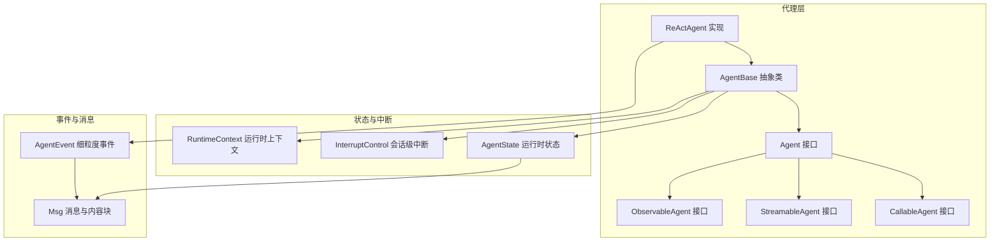
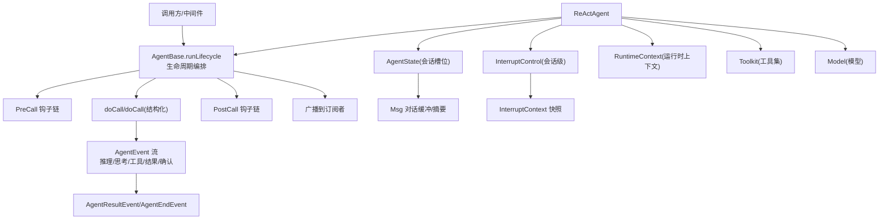
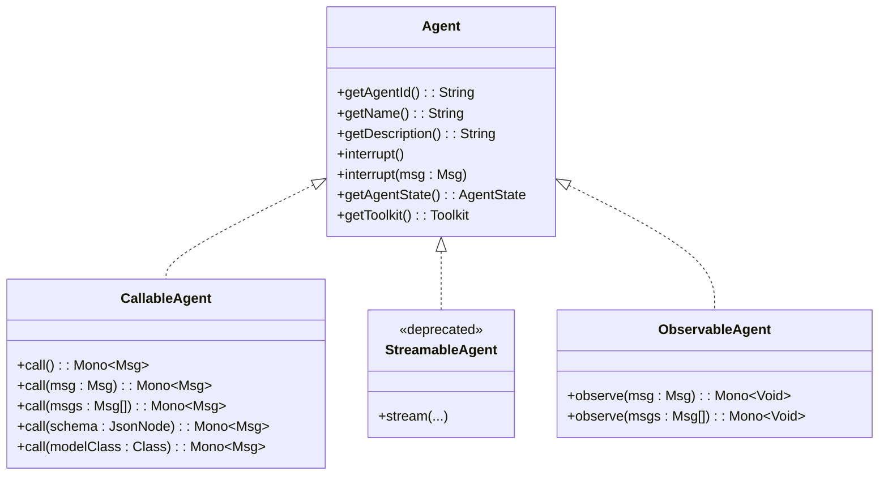
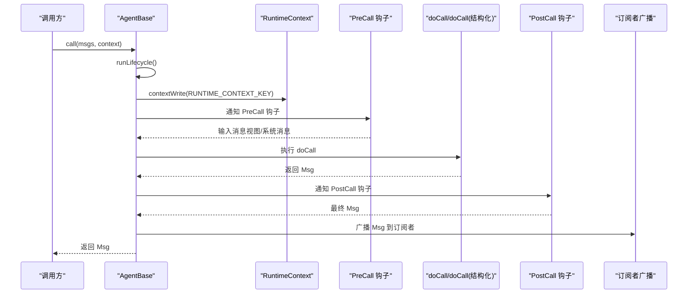
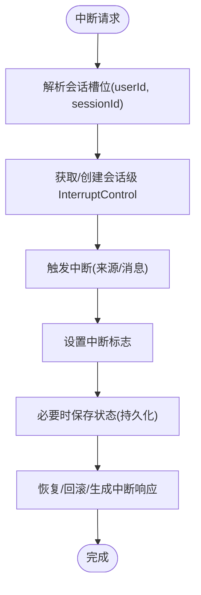
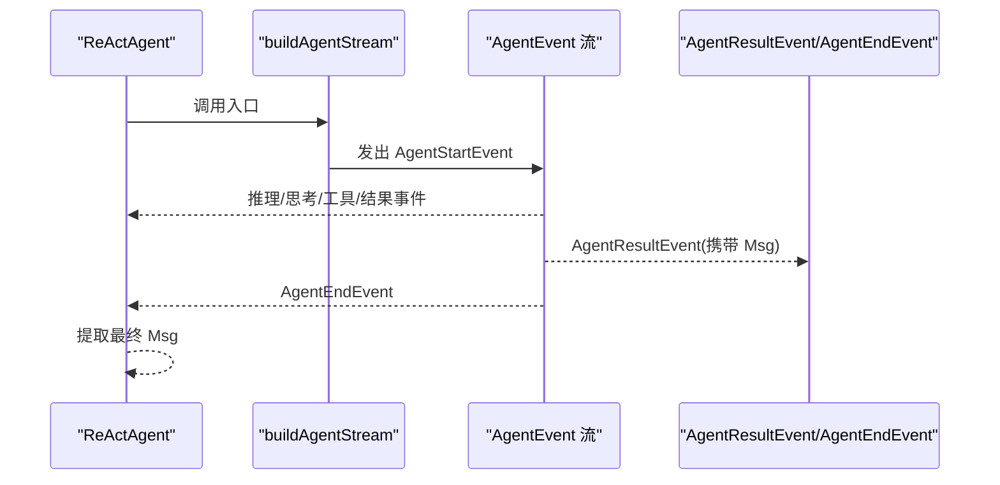
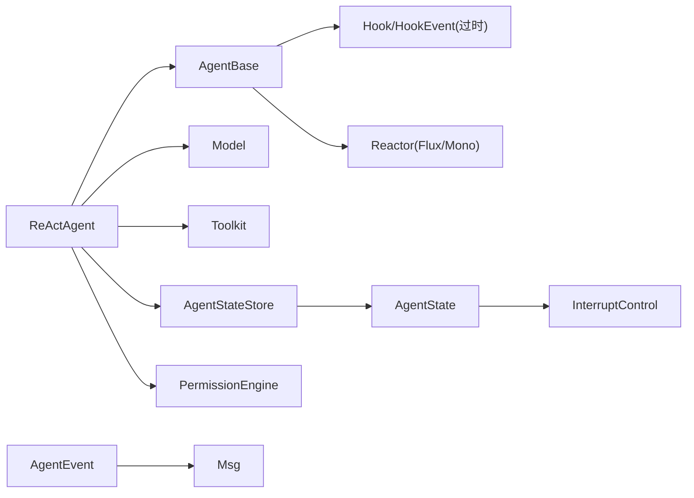

# 代理导向编程范式

<cite>
**本文档引用的文件**
- [Agent.java](file://agentscope-core/src/main/java/io/agentscope/core/agent/Agent.java)
- [CallableAgent.java](file://agentscope-core/src/main/java/io/agentscope/core/agent/CallableAgent.java)
- [StreamableAgent.java](file://agentscope-core/src/main/java/io/agentscope/core/agent/StreamableAgent.java)
- [ObservableAgent.java](file://agentscope-core/src/main/java/io/agentscope/core/agent/ObservableAgent.java)
- [AgentBase.java](file://agentscope-core/src/main/java/io/agentscope/core/agent/AgentBase.java)
- [InterruptContext.java](file://agentscope-core/src/main/java/io/agentscope/core/interruption/InterruptContext.java)
- [InterruptControl.java](file://agentscope-core/src/main/java/io/agentscope/core/interruption/InterruptControl.java)
- [AgentState.java](file://agentscope-core/src/main/java/io/agentscope/core/state/AgentState.java)
- [AgentEvent.java](file://agentscope-core/src/main/java/io/agentscope/core/event/AgentEvent.java)
- [ReActAgent.java](file://agentscope-core/src/main/java/io/agentscope/core/ReActAgent.java)
- [Hook.java](file://agentscope-core/src/main/java/io/agentscope/core/hook/Hook.java)
- [Msg.java](file://agentscope-core/src/main/java/io/agentscope/core/message/Msg.java)
- [RuntimeContext.java](file://agentscope-core/src/main/java/io/agentscope/core/agent/RuntimeContext.java)
</cite>

## 目录
1. [引言](#引言)
2. [项目结构](#项目结构)
3. [核心组件](#核心组件)
4. [架构总览](#架构总览)
5. [详细组件分析](#详细组件分析)
6. [依赖分析](#依赖分析)
7. [性能考虑](#性能考虑)
8. [故障排除指南](#故障排除指南)
9. [结论](#结论)
10. [附录：实现示例与最佳实践](#附录实现示例与最佳实践)

## 引言
本文件系统性阐述代理导向编程范式在 AgentScope Java 中的实现与应用。该范式以“代理”为核心抽象，强调可调用（Callable）、可观测（Observable）与可流式（Streamable）三大能力的组合，辅以生命周期管理、中断机制与状态模型，形成统一的执行契约与扩展点。通过细粒度事件流与中间件/钩子体系，代理能够在复杂多智能体协作场景中保持一致性、可观测性与可控性。

## 项目结构
AgentScope 的核心位于 agentscope-core 模块，围绕以下关键包组织：
- agent：代理接口与基类（Agent、CallableAgent、StreamableAgent、ObservableAgent、AgentBase）
- interruption：中断控制（InterruptControl、InterruptContext）
- state：运行时状态（AgentState）
- event：细粒度事件模型（AgentEvent 及其子类型）
- message：消息与内容块（Msg 等）
- agent：运行时上下文（RuntimeContext）
- ReActAgent：典型代理实现，展示如何组合上述能力

图表来源
- [Agent.java:47-114](file://agentscope-core/src/main/java/io/agentscope/core/agent/Agent.java#L47-L114)
- [CallableAgent.java:35-139](file://agentscope-core/src/main/java/io/agentscope/core/agent/CallableAgent.java#L35-L139)
- [StreamableAgent.java:44-193](file://agentscope-core/src/main/java/io/agentscope/core/agent/StreamableAgent.java#L44-L193)
- [ObservableAgent.java:36-53](file://agentscope-core/src/main/java/io/agentscope/core/agent/ObservableAgent.java#L36-L53)
- [AgentBase.java:92-1036](file://agentscope-core/src/main/java/io/agentscope/core/agent/AgentBase.java#L92-L1036)
- [ReActAgent.java:200-800](file://agentscope-core/src/main/java/io/agentscope/core/ReActAgent.java#L200-L800)
- [AgentState.java:59-424](file://agentscope-core/src/main/java/io/agentscope/core/state/AgentState.java#L59-L424)
- [InterruptControl.java:34-86](file://agentscope-core/src/main/java/io/agentscope/core/interruption/InterruptControl.java#L34-L86)
- [RuntimeContext.java:33-386](file://agentscope-core/src/main/java/io/agentscope/core/agent/RuntimeContext.java#L33-L386)
- [AgentEvent.java:72-139](file://agentscope-core/src/main/java/io/agentscope/core/event/AgentEvent.java#L72-L139)
- [Msg.java:67-843](file://agentscope-core/src/main/java/io/agentscope/core/message/Msg.java#L67-L843)

章节来源
- [Agent.java:21-114](file://agentscope-core/src/main/java/io/agentscope/core/agent/Agent.java#L21-L114)
- [AgentBase.java:47-1036](file://agentscope-core/src/main/java/io/agentscope/core/agent/AgentBase.java#L47-L1036)
- [ReActAgent.java:148-200](file://agentscope-core/src/main/java/io/agentscope/core/ReActAgent.java#L148-L200)

## 核心组件
- 代理接口族
  - Agent：统一契约，组合 CallableAgent、StreamableAgent、ObservableAgent 能力，提供中断、状态与工具访问等扩展点。
  - CallableAgent：定义 call(...) 多重重载，支持结构化输出（类/JSON Schema）。
  - StreamableAgent：提供过时的事件流能力（v2 建议使用 ReActAgent 的细粒度事件流）。
  - ObservableAgent：提供 observe(...) 能力，用于被动接收消息而不生成回复。
- AgentBase：代理基础设施实现，负责生命周期编排、钩子/中间件集成、订阅广播、序列化门禁、优雅关停等。
- ReActAgent：典型代理实现，展示如何在单实例内按会话槽位隔离状态、权限与工具组，提供细粒度事件流与结构化输出工具。
- 状态与中断
  - AgentState：会话级运行时状态，包含对话缓冲、摘要、权限/工具/任务/计划上下文与中断控制。
  - InterruptControl：会话级中断信号持有者，避免跨会话干扰。
  - InterruptContext：中断上下文快照，携带来源、时间戳与待处理工具调用。
- 事件与消息
  - AgentEvent：细粒度事件模型，覆盖推理、思考、工具调用/结果、用户确认、外部执行等全生命周期事件。
  - Msg：消息载体，支持文本/数据/思考/工具调用/结果等多种内容块，具备元数据与用量统计。

章节来源
- [Agent.java:21-114](file://agentscope-core/src/main/java/io/agentscope/core/agent/Agent.java#L21-L114)
- [CallableAgent.java:23-139](file://agentscope-core/src/main/java/io/agentscope/core/agent/CallableAgent.java#L23-L139)
- [StreamableAgent.java:23-193](file://agentscope-core/src/main/java/io/agentscope/core/agent/StreamableAgent.java#L23-L193)
- [ObservableAgent.java:22-53](file://agentscope-core/src/main/java/io/agentscope/core/agent/ObservableAgent.java#L22-L53)
- [AgentBase.java:47-1036](file://agentscope-core/src/main/java/io/agentscope/core/agent/AgentBase.java#L47-L1036)
- [ReActAgent.java:148-200](file://agentscope-core/src/main/java/io/agentscope/core/ReActAgent.java#L148-L200)
- [AgentState.java:31-424](file://agentscope-core/src/main/java/io/agentscope/core/state/AgentState.java#L31-L424)
- [InterruptControl.java:22-86](file://agentscope-core/src/main/java/io/agentscope/core/interruption/InterruptControl.java#L22-L86)
- [InterruptContext.java:24-190](file://agentscope-core/src/main/java/io/agentscope/core/interruption/InterruptContext.java#L24-L190)
- [AgentEvent.java:27-139](file://agentscope-core/src/main/java/io/agentscope/core/event/AgentEvent.java#L27-L139)
- [Msg.java:40-843](file://agentscope-core/src/main/java/io/agentscope/core/message/Msg.java#L40-L843)

## 架构总览
下图展示了代理导向范式的整体架构：代理通过 AgentBase 执行统一生命周期；ReActAgent 在此基础上实现会话槽位隔离与细粒度事件流；状态与中断贯穿于每次调用；消息与事件作为数据与控制通道。

图表来源
- [AgentBase.java:252-322](file://agentscope-core/src/main/java/io/agentscope/core/agent/AgentBase.java#L252-L322)
- [ReActAgent.java:795-800](file://agentscope-core/src/main/java/io/agentscope/core/ReActAgent.java#L795-L800)
- [AgentState.java:254-267](file://agentscope-core/src/main/java/io/agentscope/core/state/AgentState.java#L254-L267)
- [InterruptControl.java:34-86](file://agentscope-core/src/main/java/io/agentscope/core/interruption/InterruptControl.java#L34-L86)
- [AgentEvent.java:72-139](file://agentscope-core/src/main/java/io/agentscope/core/event/AgentEvent.java#L72-L139)
- [Msg.java:67-843](file://agentscope-core/src/main/java/io/agentscope/core/message/Msg.java#L67-L843)

## 详细组件分析

### 代理接口设计与职责分工
- Agent：统一契约，要求实现标识、名称、描述、中断、状态与工具访问等通用能力。
- CallableAgent：定义 call(...) 的丰富重载，支持结构化输出（类/JSON Schema），保证一次调用返回单一终止消息。
- StreamableAgent：提供过时的事件流能力（v2 建议使用 ReActAgent 的细粒度事件流）。
- ObservableAgent：提供 observe(...)，允许代理被动接收消息而无需回复，便于多智能体协作与共享上下文。

图表来源
- [Agent.java:47-114](file://agentscope-core/src/main/java/io/agentscope/core/agent/Agent.java#L47-L114)
- [CallableAgent.java:35-139](file://agentscope-core/src/main/java/io/agentscope/core/agent/CallableAgent.java#L35-L139)
- [StreamableAgent.java:44-193](file://agentscope-core/src/main/java/io/agentscope/core/agent/StreamableAgent.java#L44-L193)
- [ObservableAgent.java:36-53](file://agentscope-core/src/main/java/io/agentscope/core/agent/ObservableAgent.java#L36-L53)

章节来源
- [Agent.java:21-114](file://agentscope-core/src/main/java/io/agentscope/core/agent/Agent.java#L21-L114)
- [CallableAgent.java:23-139](file://agentscope-core/src/main/java/io/agentscope/core/agent/CallableAgent.java#L23-L139)
- [StreamableAgent.java:23-193](file://agentscope-core/src/main/java/io/agentscope/core/agent/StreamableAgent.java#L23-L193)
- [ObservableAgent.java:22-53](file://agentscope-core/src/main/java/io/agentscope/core/agent/ObservableAgent.java#L22-L53)

### 生命周期管理与执行编排
- AgentBase.runLifecycle：统一的生命周期入口，负责获取执行资源、注册/绑定运行时上下文、序列化门禁、预/后置钩子链、错误处理与广播。
- beforeAgentExecution/afterAgentExecution：在调用前后注入/清理 per-call 状态与运行时上下文。
- callSerializationKey/serializeOnKey：基于会话槽位的并发序列化，确保同一会话的状态一致性。
- runLifecycleBody：构建生命周期主体，串联 preCall → doCall → postCall，并在错误时通知错误钩子。

图表来源
- [AgentBase.java:252-322](file://agentscope-core/src/main/java/io/agentscope/core/agent/AgentBase.java#L252-L322)
- [AgentBase.java:738-816](file://agentscope-core/src/main/java/io/agentscope/core/agent/AgentBase.java#L738-L816)
- [RuntimeContext.java:33-127](file://agentscope-core/src/main/java/io/agentscope/core/agent/RuntimeContext.java#L33-L127)

章节来源
- [AgentBase.java:252-322](file://agentscope-core/src/main/java/io/agentscope/core/agent/AgentBase.java#L252-L322)
- [AgentBase.java:738-816](file://agentscope-core/src/main/java/io/agentscope/core/agent/AgentBase.java#L738-L816)
- [RuntimeContext.java:33-127](file://agentscope-core/src/main/java/io/agentscope/core/agent/RuntimeContext.java#L33-L127)

### 中断机制与状态管理
- 会话级中断：ReActAgent 通过 (userId, sessionId) 槽位持有 InterruptControl，确保中断仅影响目标会话。
- 中断触发：支持带用户消息的中断，生成 InterruptContext 快照，供恢复逻辑使用。
- 状态持有：AgentState 提供会话级状态容器，包含对话缓冲、摘要、权限/工具/任务/计划上下文与中断标记。

图表来源
- [ReActAgent.java:686-722](file://agentscope-core/src/main/java/io/agentscope/core/ReActAgent.java#L686-L722)
- [InterruptControl.java:34-86](file://agentscope-core/src/main/java/io/agentscope/core/interruption/InterruptControl.java#L34-L86)
- [InterruptContext.java:40-190](file://agentscope-core/src/main/java/io/agentscope/core/interruption/InterruptContext.java#L40-L190)
- [AgentState.java:254-267](file://agentscope-core/src/main/java/io/agentscope/core/state/AgentState.java#L254-L267)

章节来源
- [ReActAgent.java:686-722](file://agentscope-core/src/main/java/io/agentscope/core/ReActAgent.java#L686-L722)
- [InterruptControl.java:34-86](file://agentscope-core/src/main/java/io/agentscope/core/interruption/InterruptControl.java#L34-L86)
- [InterruptContext.java:40-190](file://agentscope-core/src/main/java/io/agentscope/core/interruption/InterruptContext.java#L40-L190)
- [AgentState.java:254-267](file://agentscope-core/src/main/java/io/agentscope/core/state/AgentState.java#L254-L267)

### 事件流与可观测性
- 细粒度事件：AgentEvent 家族覆盖推理、思考、工具调用/结果、用户确认、外部执行等全生命周期事件。
- ReActAgent 事件流：统一由 buildAgentStream 产出，bookend 以 AgentStartEvent/AgentEndEvent，最终以 AgentResultEvent 携带 Msg 结束。
- 观察模式：ObservableAgent 支持 observe(...)，AgentBase 自动广播至订阅者，便于多智能体协作。

图表来源
- [ReActAgent.java:795-800](file://agentscope-core/src/main/java/io/agentscope/core/ReActAgent.java#L795-L800)
- [AgentEvent.java:72-139](file://agentscope-core/src/main/java/io/agentscope/core/event/AgentEvent.java#L72-L139)

章节来源
- [ReActAgent.java:795-800](file://agentscope-core/src/main/java/io/agentscope/core/ReActAgent.java#L795-L800)
- [AgentEvent.java:72-139](file://agentscope-core/src/main/java/io/agentscope/core/event/AgentEvent.java#L72-L139)

### 与传统范式的区别与优势
- 函数式 vs 代理导向：函数式强调纯函数与不可变数据；代理导向强调“可调用+可观测+可流式”的行为组合与会话状态管理。
- 面向对象 vs 代理导向：传统 OO 更关注类与继承；代理导向更关注“能力接口 + 基础设施基类 + 事件/钩子/中间件”的组合式扩展。
- 优势
  - 统一契约：Agent 接口明确 call/observe/stream 能力与中断/状态/工具访问。
  - 可观测性：细粒度事件流贯穿生命周期，便于调试与监控。
  - 可插拔：钩子/中间件/工具组可动态注入与移除，支持结构化输出与权限控制。
  - 会话隔离：ReActAgent 的槽位隔离确保并发下的状态一致性与可恢复性。

## 依赖分析
- 组件耦合
  - AgentBase 依赖 Hook/HookEvent 体系（已过时，建议使用中间件）与 Reactor 生态进行非阻塞执行。
  - ReActAgent 依赖 Model、Toolkit、AgentStateStore、PermissionEngine 等模块，体现“能力组合”而非继承。
  - AgentState 与 InterruptControl 通过会话槽位键关联，避免跨会话干扰。
- 外部依赖
  - Reactor（Flux/Mono）用于非阻塞与事件流。
  - Jackson 用于消息与状态的序列化/反序列化。
  - 日志框架（SLF4J）用于运行时日志。

图表来源
- [AgentBase.java:18-45](file://agentscope-core/src/main/java/io/agentscope/core/agent/AgentBase.java#L18-L45)
- [ReActAgent.java:200-330](file://agentscope-core/src/main/java/io/agentscope/core/ReActAgent.java#L200-L330)
- [AgentState.java:59-103](file://agentscope-core/src/main/java/io/agentscope/core/state/AgentState.java#L59-L103)
- [AgentEvent.java:72-139](file://agentscope-core/src/main/java/io/agentscope/core/event/AgentEvent.java#L72-L139)
- [Msg.java:67-152](file://agentscope-core/src/main/java/io/agentscope/core/message/Msg.java#L67-L152)

章节来源
- [AgentBase.java:18-45](file://agentscope-core/src/main/java/io/agentscope/core/agent/AgentBase.java#L18-L45)
- [ReActAgent.java:200-330](file://agentscope-core/src/main/java/io/agentscope/core/ReActAgent.java#L200-L330)
- [AgentState.java:59-103](file://agentscope-core/src/main/java/io/agentscope/core/state/AgentState.java#L59-L103)
- [AgentEvent.java:72-139](file://agentscope-core/src/main/java/io/agentscope/core/event/AgentEvent.java#L72-L139)
- [Msg.java:67-152](file://agentscope-core/src/main/java/io/agentscope/core/message/Msg.java#L67-L152)

## 性能考虑
- 非阻塞执行：基于 Reactor 的 Mono/Flux 链路，避免阻塞线程，提升吞吐。
- 串行化门禁：按会话槽位序列化调用，避免并发写入导致的状态竞争。
- 缓存与懒加载：会话状态与权限引擎按槽位缓存，首次访问才创建，减少重复初始化成本。
- 事件流优化：细粒度事件流仅在需要时开启，避免不必要的开销。
- 序列化与反序列化：消息与状态采用 Jackson，注意字段可见性与类型信息的正确映射。

## 故障排除指南
- 中断未生效
  - 检查是否针对正确的 (userId, sessionId) 槽位触发中断。
  - 确认在执行检查点处调用了中断检查逻辑（如 Reactor 链上的中断传播）。
- 事件流异常
  - 确认使用 ReActAgent 的细粒度事件流替代过时的 StreamableAgent 方法。
  - 检查事件过滤与提取逻辑（例如从 AgentResultEvent 中提取 Msg）。
- 状态不一致
  - 确保使用 per-call RuntimeContext 获取会话级 AgentState，避免共享实例字段导致的竞态。
  - 检查序列化门禁是否正确按槽位键启用。
- 权限与工具组
  - 确认工具组激活状态与权限上下文在会话槽位内正确同步与持久化。

章节来源
- [ReActAgent.java:686-722](file://agentscope-core/src/main/java/io/agentscope/core/ReActAgent.java#L686-L722)
- [AgentBase.java:252-322](file://agentscope-core/src/main/java/io/agentscope/core/agent/AgentBase.java#L252-L322)
- [RuntimeContext.java:99-127](file://agentscope-core/src/main/java/io/agentscope/core/agent/RuntimeContext.java#L99-L127)

## 结论
代理导向编程范式通过“可调用+可观测+可流式”的能力组合与统一契约，结合生命周期编排、会话级状态与中断控制，提供了高内聚、低耦合且高度可扩展的智能体实现路径。ReActAgent 展示了如何在单实例内安全地管理多会话状态与权限，配合细粒度事件流与中间件/钩子体系，能够胜任复杂的多智能体协作与生产级部署需求。

## 附录：实现示例与最佳实践

### 如何实现自定义代理
- 步骤
  - 继承 AgentBase，实现 doCall(...) 与可选的 doCall(..., Class/JsonNode) 结构化输出。
  - 在 beforeAgentExecution 中激活会话槽位，绑定 RuntimeContext 与 AgentState。
  - 在 runLifecycle 中利用钩子/中间件链路，确保 preCall → doCall → postCall 的完整生命周期。
  - 使用 observe(...) 实现观察模式，结合 AgentBase 的订阅广播机制参与协作。
- 示例参考
  - ReActAgent 的构造、槽位激活、系统提示注入与事件流构建流程。

章节来源
- [AgentBase.java:510-536](file://agentscope-core/src/main/java/io/agentscope/core/agent/AgentBase.java#L510-L536)
- [ReActAgent.java:437-478](file://agentscope-core/src/main/java/io/agentscope/core/ReActAgent.java#L437-L478)
- [ReActAgent.java:539-598](file://agentscope-core/src/main/java/io/agentscope/core/ReActAgent.java#L539-L598)

### 多智能体协作最佳实践
- 使用 ObservableAgent 与 AgentBase 的订阅广播，实现消息共享与协作。
- 通过 RuntimeContext 传递会话标识与运行时上下文，确保工具与中间件解析到正确的会话状态。
- 使用细粒度事件流（AgentEvent）进行可观测与调试，必要时在中间件中注入系统提示或修改输入消息。
- 严格区分会话槽位，避免跨会话状态污染；在并发场景下依赖序列化门禁保障一致性。

章节来源
- [AgentBase.java:881-889](file://agentscope-core/src/main/java/io/agentscope/core/agent/AgentBase.java#L881-L889)
- [RuntimeContext.java:33-127](file://agentscope-core/src/main/java/io/agentscope/core/agent/RuntimeContext.java#L33-L127)
- [AgentEvent.java:72-139](file://agentscope-core/src/main/java/io/agentscope/core/event/AgentEvent.java#L72-L139)