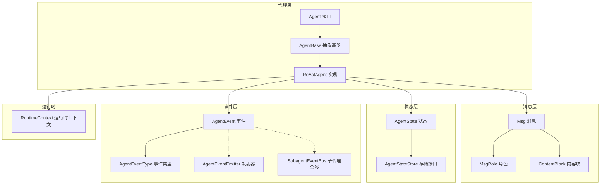
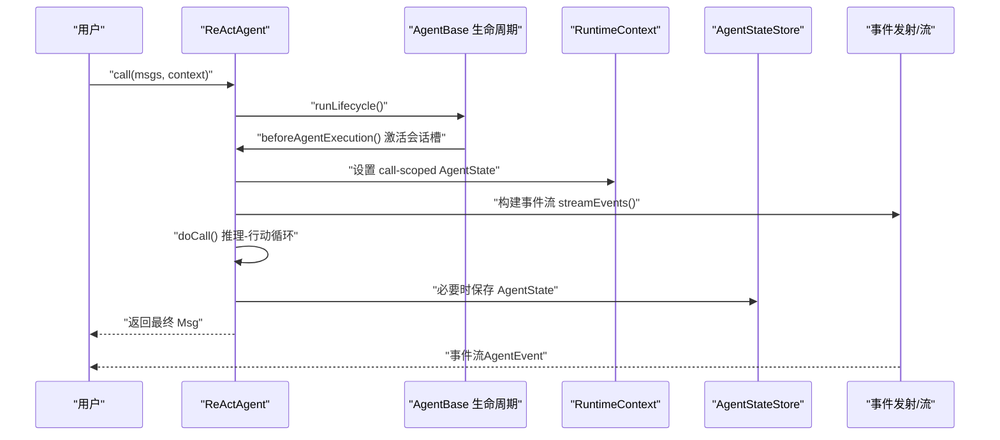
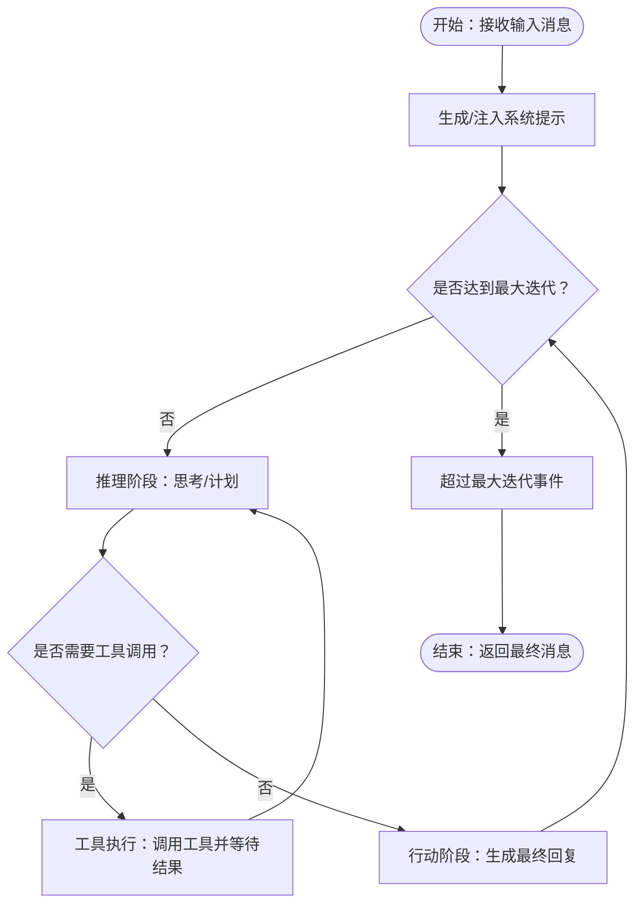
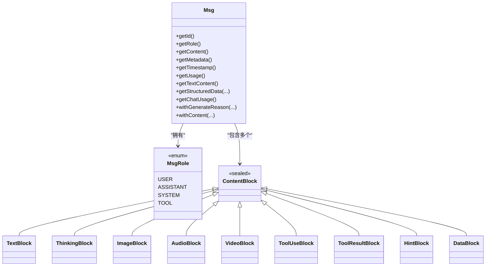
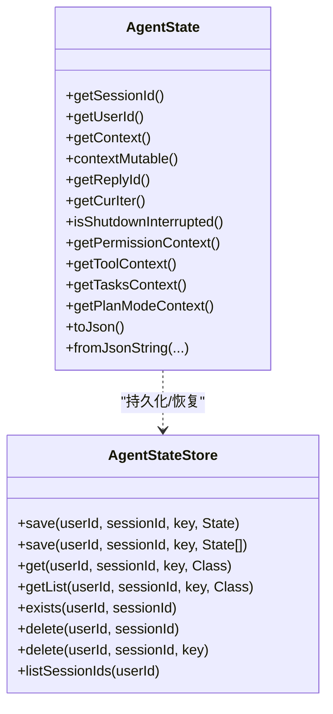
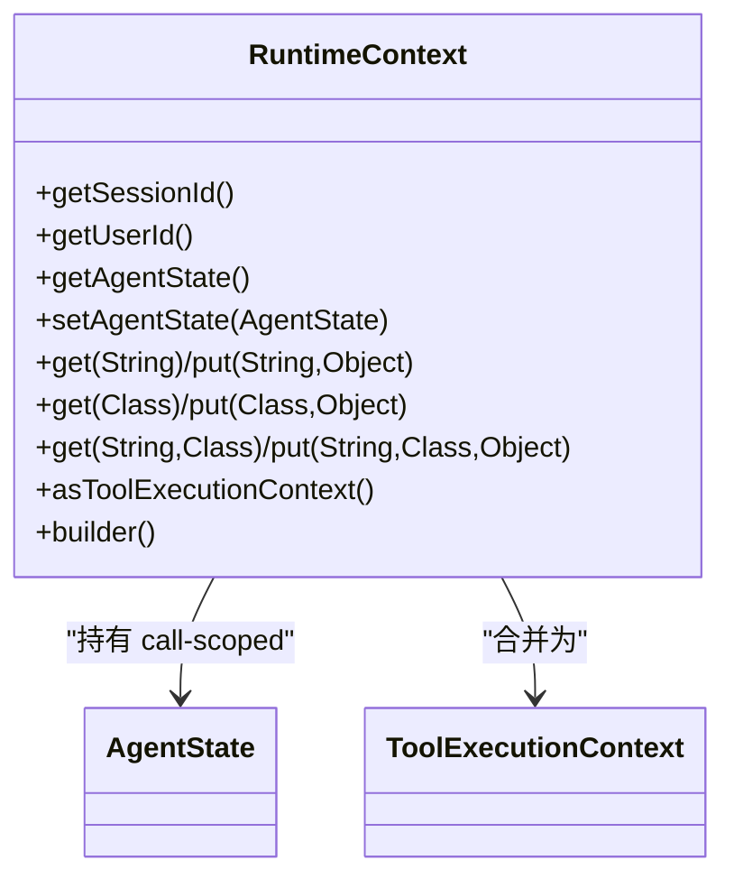
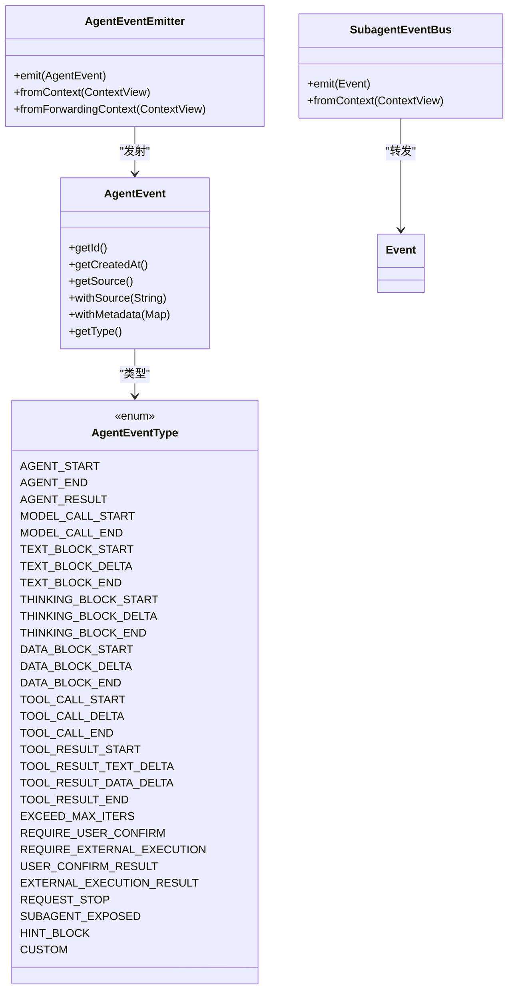
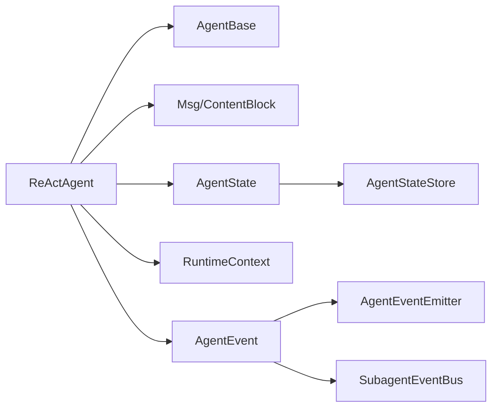

# 核心概念

<cite>
**本文引用的文件**
- [Agent.java](file://agentscope-core/src/main/java/io/agentscope/core/agent/Agent.java)
- [AgentBase.java](file://agentscope-core/src/main/java/io/agentscope/core/agent/AgentBase.java)
- [RuntimeContext.java](file://agentscope-core/src/main/java/io/agentscope/core/agent/RuntimeContext.java)
- [SubagentEventBus.java](file://agentscope-core/src/main/java/io/agentscope/core/agent/SubagentEventBus.java)
- [Event.java](file://agentscope-core/src/main/java/io/agentscope/core/agent/Event.java)
- [ReActAgent.java](file://agentscope-core/src/main/java/io/agentscope/core/ReActAgent.java)
- [Msg.java](file://agentscope-core/src/main/java/io/agentscope/core/message/Msg.java)
- [MsgRole.java](file://agentscope-core/src/main/java/io/agentscope/core/message/MsgRole.java)
- [ContentBlock.java](file://agentscope-core/src/main/java/io/agentscope/core/message/ContentBlock.java)
- [AgentState.java](file://agentscope-core/src/main/java/io/agentscope/core/state/AgentState.java)
- [AgentStateStore.java](file://agentscope-core/src/main/java/io/agentscope/core/state/AgentStateStore.java)
- [AgentEvent.java](file://agentscope-core/src/main/java/io/agentscope/core/event/AgentEvent.java)
- [AgentEventType.java](file://agentscope-core/src/main/java/io/agentscope/core/event/AgentEventType.java)
- [AgentEventEmitter.java](file://agentscope-core/src/main/java/io/agentscope/core/event/AgentEventEmitter.java)
</cite>

## 目录
1. [引言](#引言)
2. [项目结构](#项目结构)
3. [核心组件](#核心组件)
4. [架构总览](#架构总览)
5. [详细组件分析](#详细组件分析)
6. [依赖分析](#依赖分析)
7. [性能考量](#性能考量)
8. [故障排查指南](#故障排查指南)
9. [结论](#结论)

## 引言
本文件面向希望深入理解 AgentScope Java 的开发者与架构师，系统性阐述以下核心概念与机制：
- 代理导向编程的基本原则与接口契约
- ReAct 推理-行动模式的工作流程与控制循环
- 消息传递系统：Msg 类结构、角色与内容块模型
- AgentState 状态管理：存储、序列化与恢复
- RuntimeContext 运行时上下文：作用域与管理方式
- 事件系统：事件类型、事件流与事件处理器
- 最佳实践与常见问题定位

目标是帮助读者在掌握理论的同时，具备可操作的实践指导。

## 项目结构
AgentScope Java 的核心位于 agentscope-core 模块，围绕“代理（Agent）”“消息（Message）”“状态（State）”“事件（Event）”“运行时上下文（RuntimeContext）”五大抽象展开，并通过 ReActAgent 提供可迭代的推理-行动闭环。

图示来源
- [Agent.java:47-115](file://agentscope-core/src/main/java/io/agentscope/core/agent/Agent.java#L47-L115)
- [AgentBase.java:92-1036](file://agentscope-core/src/main/java/io/agentscope/core/agent/AgentBase.java#L92-L1036)
- [ReActAgent.java:148-4305](file://agentscope-core/src/main/java/io/agentscope/core/ReActAgent.java#L148-L4305)
- [Msg.java:67-843](file://agentscope-core/src/main/java/io/agentscope/core/message/Msg.java#L67-L843)
- [MsgRole.java:35-68](file://agentscope-core/src/main/java/io/agentscope/core/message/MsgRole.java#L35-L68)
- [ContentBlock.java:58-68](file://agentscope-core/src/main/java/io/agentscope/core/message/ContentBlock.java#L58-L68)
- [AgentState.java:59-424](file://agentscope-core/src/main/java/io/agentscope/core/state/AgentState.java#L59-L424)
- [AgentStateStore.java:61-167](file://agentscope-core/src/main/java/io/agentscope/core/state/AgentStateStore.java#L61-L167)
- [AgentEvent.java:72-139](file://agentscope-core/src/main/java/io/agentscope/core/event/AgentEvent.java#L72-L139)
- [AgentEventType.java:40-137](file://agentscope-core/src/main/java/io/agentscope/core/event/AgentEventType.java#L40-L137)
- [AgentEventEmitter.java:38-98](file://agentscope-core/src/main/java/io/agentscope/core/event/AgentEventEmitter.java#L38-L98)
- [SubagentEventBus.java:37-70](file://agentscope-core/src/main/java/io/agentscope/core/agent/SubagentEventBus.java#L37-L70)
- [RuntimeContext.java:33-386](file://agentscope-core/src/main/java/io/agentscope/core/agent/RuntimeContext.java#L33-L386)

章节来源
- [Agent.java:21-115](file://agentscope-core/src/main/java/io/agentscope/core/agent/Agent.java#L21-L115)
- [AgentBase.java:47-1036](file://agentscope-core/src/main/java/io/agentscope/core/agent/AgentBase.java#L47-L1036)
- [ReActAgent.java:148-4305](file://agentscope-core/src/main/java/io/agentscope/core/ReActAgent.java#L148-L4305)

## 核心组件
本节从接口契约、抽象基类、具体实现三个维度梳理核心组件。

- 代理接口与职责
  - Agent 统一了“可调用”“可流式”“可观测”的能力边界；强调回复契约（单次调用产生一个最终 Msg），并提供中断能力与运行时状态/工具包访问点。
  - 参考路径：[Agent.java:47-115](file://agentscope-core/src/main/java/io/agentscope/core/agent/Agent.java#L47-L115)

- 抽象基类与生命周期
  - AgentBase 提供钩子集成、订阅者管理、中断处理、追踪与状态门面；统一 call 流程（序列化、预/后置钩子、优雅关停）。
  - 参考路径：[AgentBase.java:92-1036](file://agentscope-core/src/main/java/io/agentscope/core/agent/AgentBase.java#L92-L1036)

- ReActAgent 实现与 ReAct 循环
  - ReActAgent 将“推理（思考/计划）—行动（工具执行）”以可迭代的方式组织，支持结构化输出、权限/HITL、长程记忆与持久化。
  - 参考路径：[ReActAgent.java:148-4305](file://agentscope-core/src/main/java/io/agentscope/core/ReActAgent.java#L148-L4305)

章节来源
- [Agent.java:21-115](file://agentscope-core/src/main/java/io/agentscope/core/agent/Agent.java#L21-L115)
- [AgentBase.java:92-1036](file://agentscope-core/src/main/java/io/agentscope/core/agent/AgentBase.java#L92-L1036)
- [ReActAgent.java:148-4305](file://agentscope-core/src/main/java/io/agentscope/core/ReActAgent.java#L148-L4305)

## 架构总览
下图展示 ReActAgent 在一次调用中的关键交互：消息输入、系统提示注入、推理-行动循环、事件发射、状态持久化与恢复。

图示来源
- [AgentBase.java:252-322](file://agentscope-core/src/main/java/io/agentscope/core/agent/AgentBase.java#L252-L322)
- [ReActAgent.java:511-536](file://agentscope-core/src/main/java/io/agentscope/core/ReActAgent.java#L511-L536)
- [AgentEventEmitter.java:38-98](file://agentscope-core/src/main/java/io/agentscope/core/event/AgentEventEmitter.java#L38-L98)
- [AgentStateStore.java:61-167](file://agentscope-core/src/main/java/io/agentscope/core/state/AgentStateStore.java#L61-L167)

## 详细组件分析

### 代理导向编程与 ReAct 推理-行动模式
- 基本原则
  - 单次调用产出单一终端消息，流式变体可发出多个事件但最终收敛到一个 Msg。
  - 中断采用协作式中断，通过会话级 InterruptControl 触发并在检查点传播。
  - ReAct 将“推理（思考/计划）—行动（工具执行）”交替进行，直至完成或达到最大迭代。
- ReAct 循环要点
  - 会话槽激活：根据 RuntimeContext 解析 (userId, sessionId)，加载/缓存 AgentState 与 PermissionEngine。
  - 系统提示注入：通过中间件链生成系统消息，避免在尾部注入 SYSTEM 消息（由框架保护）。
  - 结构化输出：支持 per-call 的 generate_response 工具，按类型安全地返回结构化结果。
  - 事件流：统一通过 streamEvents 输出细粒度 AgentEvent，覆盖模型调用、文本/思维/数据块、工具调用与结果等。
  - 持久化：在需要时将 AgentState 写入 AgentStateStore，支持分布式一致性与优雅关停。
- 使用场景
  - 需要人类在环（HITL）的复杂任务编排（如多轮确认、外部执行暂停）。
  - 需要结构化输出的业务流程（如 JSON 计划、报告生成）。
  - 需要跨轮对话的记忆与状态恢复（如多智能体协作、长任务追踪）。
- 最佳实践
  - 明确区分 call 与 streamEvents：前者用于一次性响应，后者用于实时可观测。
  - 使用 RuntimeContext 传递 call-scoped 元数据，避免共享实例字段引发竞态。
  - 对外暴露的工具方法应声明 stateInjected=true，以便在运行时绑定 AgentState。
  - 合理配置中间件顺序，确保系统提示与权限策略在 doCall 前生效。

图示来源
- [ReActAgent.java:795-800](file://agentscope-core/src/main/java/io/agentscope/core/ReActAgent.java#L795-L800)
- [AgentEventType.java:77-89](file://agentscope-core/src/main/java/io/agentscope/core/event/AgentEventType.java#L77-L89)

章节来源
- [Agent.java:47-115](file://agentscope-core/src/main/java/io/agentscope/core/agent/Agent.java#L47-L115)
- [AgentBase.java:92-1036](file://agentscope-core/src/main/java/io/agentscope/core/agent/AgentBase.java#L92-L1036)
- [ReActAgent.java:148-4305](file://agentscope-core/src/main/java/io/agentscope/core/ReActAgent.java#L148-L4305)

### 消息传递系统：Msg、角色与内容块
- Msg 设计
  - 作为框架内通信单元，承载角色、内容块列表、元数据与时间戳；支持结构化数据提取与令牌用量统计。
  - 支持多种角色：USER、ASSISTANT、SYSTEM、TOOL；不同角色允许的内容块集合受约束。
  - Builder 模式便于构造，且提供 builderForRole 以获得特定角色的子类实例。
- 内容块模型
  - ContentBlock 为密封类，涵盖文本、图像/音频/视频、思维、工具调用/结果、提示与通用数据块。
  - 通过 Jackson 多态序列化，使用 type 字段识别具体类型。
- 元数据与结构化输出
  - 支持结构化输出键（如结构化输出、合成消息标记、提醒类型等），便于下游解析与持久化过滤。
- 使用建议
  - 严格遵循角色-内容块约束，避免非法组合导致校验失败。
  - 利用 getStructuredData/getChatUsage 等便捷方法处理元数据与用量信息。
  - 对于多模态内容，优先使用 DataBlock 统一承载 image/audio/video。

图示来源
- [Msg.java:67-843](file://agentscope-core/src/main/java/io/agentscope/core/message/Msg.java#L67-L843)
- [MsgRole.java:35-68](file://agentscope-core/src/main/java/io/agentscope/core/message/MsgRole.java#L35-L68)
- [ContentBlock.java:58-68](file://agentscope-core/src/main/java/io/agentscope/core/message/ContentBlock.java#L58-L68)

章节来源
- [Msg.java:40-843](file://agentscope-core/src/main/java/io/agentscope/core/message/Msg.java#L40-L843)
- [MsgRole.java:18-68](file://agentscope-core/src/main/java/io/agentscope/core/message/MsgRole.java#L18-L68)
- [ContentBlock.java:22-68](file://agentscope-core/src/main/java/io/agentscope/core/message/ContentBlock.java#L22-L68)

### AgentState 状态管理：存储、序列化与恢复
- 结构与职责
  - 包含会话标识、用户标识、上下文缓冲区、滚动摘要、回复标识、当前迭代、关闭中断标记、权限/工具/任务/计划模式上下文。
  - 提供防御性拷贝与可变句柄，兼顾并发安全与性能。
- 序列化与反序列化
  - 通过 JSON 序列化为字符串，支持从 JSON 字符串重建状态对象。
- 存储与恢复
  - 通过 AgentStateStore 接口实现持久化；ReActAgent 在每次调用前加载最新状态，保证分布式一致性。
- 使用建议
  - 在并发场景下，优先使用 call-scoped RuntimeContext 获取 AgentState，避免共享实例字段引发竞态。
  - 对于需要跨请求恢复的状态，务必配置可靠的 AgentStateStore 并在关键节点保存。

图示来源
- [AgentState.java:59-424](file://agentscope-core/src/main/java/io/agentscope/core/state/AgentState.java#L59-L424)
- [AgentStateStore.java:61-167](file://agentscope-core/src/main/java/io/agentscope/core/state/AgentStateStore.java#L61-L167)

章节来源
- [AgentState.java:31-424](file://agentscope-core/src/main/java/io/agentscope/core/state/AgentState.java#L31-L424)
- [AgentStateStore.java:22-167](file://agentscope-core/src/main/java/io/agentscope/core/state/AgentStateStore.java#L22-L167)

### RuntimeContext 运行时上下文：作用域与管理
- 作用
  - 为一次调用提供会话级元数据、线程安全的属性容器与工具执行上下文视图。
  - 提供 call-scoped AgentState 的读取与合并为 ToolExecutionContext 的能力。
- 关键点
  - 通过 Reactor Context 传递，避免共享实例字段带来的竞态。
  - 支持字符串键与类型化键的混合存取，便于工具与中间件读写。
- 最佳实践
  - 在中间件/工具中优先使用 RuntimeContext.resolveAgentState 获取正确的会话状态。
  - 使用 asToolExecutionContext 将运行时属性注入工具栈，确保工具可见性与优先级正确。

图示来源
- [RuntimeContext.java:33-386](file://agentscope-core/src/main/java/io/agentscope/core/agent/RuntimeContext.java#L33-L386)

章节来源
- [RuntimeContext.java:26-386](file://agentscope-core/src/main/java/io/agentscope/core/agent/RuntimeContext.java#L26-L386)

### 事件系统：事件类型、事件流与事件处理器
- 事件类型
  - AgentEvent 为所有细粒度事件的基类，通过类型鉴别字段与 Jackson 多态序列化。
  - AgentEventType 定义了 28 种事件类型，覆盖代理生命周期、模型调用、文本/思维/数据块、工具调用/结果、HITL 与自定义事件。
- 事件流
  - ReActAgent 通过 streamEvents 输出事件流，配合 AgentEventEmitter 与 SubagentEventBus 实现父子事件的转发与标注。
  - v1 的 Event 类型已标记为过时，新代码应使用 AgentEvent。
- 事件处理器
  - 通过 Hook 与中间件链路消费事件，实现监控、拦截与扩展。
- 最佳实践
  - 使用 withSource 为子代理事件标注来源路径，便于 UI 或日志路由。
  - 在工具内部通过 AgentEventEmitter.fromContext 获取发射器，向父流注入自定义事件。

图示来源
- [AgentEvent.java:72-139](file://agentscope-core/src/main/java/io/agentscope/core/event/AgentEvent.java#L72-L139)
- [AgentEventType.java:40-137](file://agentscope-core/src/main/java/io/agentscope/core/event/AgentEventType.java#L40-L137)
- [AgentEventEmitter.java:38-98](file://agentscope-core/src/main/java/io/agentscope/core/event/AgentEventEmitter.java#L38-L98)
- [SubagentEventBus.java:37-70](file://agentscope-core/src/main/java/io/agentscope/core/agent/SubagentEventBus.java#L37-L70)
- [Event.java:60-220](file://agentscope-core/src/main/java/io/agentscope/core/agent/Event.java#L60-L220)

章节来源
- [AgentEvent.java:27-139](file://agentscope-core/src/main/java/io/agentscope/core/event/AgentEvent.java#L27-L139)
- [AgentEventType.java:22-137](file://agentscope-core/src/main/java/io/agentscope/core/event/AgentEventType.java#L22-L137)
- [AgentEventEmitter.java:21-98](file://agentscope-core/src/main/java/io/agentscope/core/event/AgentEventEmitter.java#L21-L98)
- [SubagentEventBus.java:21-70](file://agentscope-core/src/main/java/io/agentscope/core/agent/SubagentEventBus.java#L21-L70)
- [Event.java:24-220](file://agentscope-core/src/main/java/io/agentscope/core/agent/Event.java#L24-L220)

## 依赖分析
- 组件耦合
  - ReActAgent 依赖 AgentBase 提供的生命周期与钩子框架；依赖 Msg/ContentBlock 构建消息；依赖 AgentState/AgentStateStore 管理状态；依赖 RuntimeContext 提供 call-scoped 上下文。
  - 事件系统通过 AgentEventEmitter/SubagentEventBus 与 ReActAgent 的事件流解耦。
- 外部依赖
  - Reactor（Flux/Mono）用于非阻塞流式处理。
  - Jackson 用于消息与事件的多态序列化。
- 潜在循环
  - 未发现直接循环依赖；ReActAgent 与 AgentBase 之间为实现与继承关系，事件与消息为数据依赖。

图示来源
- [ReActAgent.java:148-4305](file://agentscope-core/src/main/java/io/agentscope/core/ReActAgent.java#L148-L4305)
- [AgentBase.java:92-1036](file://agentscope-core/src/main/java/io/agentscope/core/agent/AgentBase.java#L92-L1036)
- [Msg.java:67-843](file://agentscope-core/src/main/java/io/agentscope/core/message/Msg.java#L67-L843)
- [AgentState.java:59-424](file://agentscope-core/src/main/java/io/agentscope/core/state/AgentState.java#L59-L424)
- [AgentStateStore.java:61-167](file://agentscope-core/src/main/java/io/agentscope/core/state/AgentStateStore.java#L61-L167)
- [RuntimeContext.java:33-386](file://agentscope-core/src/main/java/io/agentscope/core/agent/RuntimeContext.java#L33-L386)
- [AgentEvent.java:72-139](file://agentscope-core/src/main/java/io/agentscope/core/event/AgentEvent.java#L72-L139)
- [AgentEventEmitter.java:38-98](file://agentscope-core/src/main/java/io/agentscope/core/event/AgentEventEmitter.java#L38-L98)
- [SubagentEventBus.java:37-70](file://agentscope-core/src/main/java/io/agentscope/core/agent/SubagentEventBus.java#L37-L70)

章节来源
- [ReActAgent.java:148-4305](file://agentscope-core/src/main/java/io/agentscope/core/ReActAgent.java#L148-L4305)
- [AgentBase.java:92-1036](file://agentscope-core/src/main/java/io/agentscope/core/agent/AgentBase.java#L92-L1036)

## 性能考量
- 流式处理
  - 使用 Reactor 非阻塞模型，结合事件流与中间件链，降低阻塞开销。
- 状态持久化
  - 仅在必要时异步保存 AgentState，避免阻塞主推理-行动循环。
- 会话序列化
  - 基于 (userId, sessionId) 的序列化门控，确保同一会话内的状态一致性，同时允许多会话并发。
- 缓存与重用
  - 会话槽与权限引擎缓存减少重复加载成本；工具组激活状态同步至状态后再写入，避免丢失。

## 故障排查指南
- 中断无效
  - 确认使用 per-session 的 interrupt(RuntimeContext) 或 interrupt(userId, sessionId) 触发中断信号。
  - 检查在 Mono 链中适当位置调用中断检查点。
  - 参考路径：[AgentBase.java:494-502](file://agentscope-core/src/main/java/io/agentscope/core/agent/AgentBase.java#L494-L502)，[ReActAgent.java:686-722](file://agentscope-core/src/main/java/io/agentscope/core/ReActAgent.java#L686-L722)
- 事件流为空
  - 确认使用 streamEvents 而非过时的 stream；在 call() 场景下不会注入 AgentEventEmitter。
  - 参考路径：[AgentEventEmitter.java:30-37](file://agentscope-core/src/main/java/io/agentscope/core/event/AgentEventEmitter.java#L30-L37)
- 状态未恢复
  - 检查 AgentStateStore 是否正确配置与实现；确认会话标识与用户标识一致。
  - 参考路径：[AgentStateStore.java:61-167](file://agentscope-core/src/main/java/io/agentscope/core/state/AgentStateStore.java#L61-L167)
- 角色-内容块不匹配
  - SYSTEM 消息仅允许文本块；USER 消息允许文本/数据/多媒体块；TOOL 角色兼容性保留以兼容历史。
  - 参考路径：[Msg.java:166-198](file://agentscope-core/src/main/java/io/agentscope/core/message/Msg.java#L166-L198)

章节来源
- [AgentBase.java:494-502](file://agentscope-core/src/main/java/io/agentscope/core/agent/AgentBase.java#L494-L502)
- [ReActAgent.java:686-722](file://agentscope-core/src/main/java/io/agentscope/core/ReActAgent.java#L686-L722)
- [AgentEventEmitter.java:30-37](file://agentscope-core/src/main/java/io/agentscope/core/event/AgentEventEmitter.java#L30-L37)
- [AgentStateStore.java:61-167](file://agentscope-core/src/main/java/io/agentscope/core/state/AgentStateStore.java#L61-L167)
- [Msg.java:166-198](file://agentscope-core/src/main/java/io/agentscope/core/message/Msg.java#L166-L198)

## 结论
AgentScope Java 通过清晰的代理接口、稳健的 ReAct 循环、严谨的消息与事件模型以及可插拔的状态与运行时上下文，提供了可扩展、可观测、可恢复的智能体基础设施。遵循本文的最佳实践，可在复杂业务场景中高效构建与演进多智能体系统。