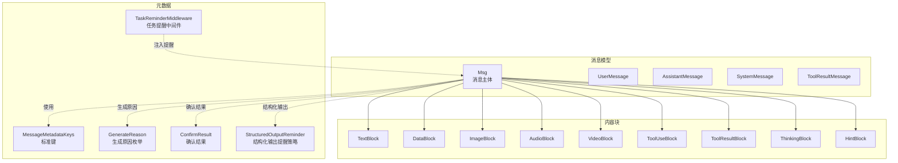
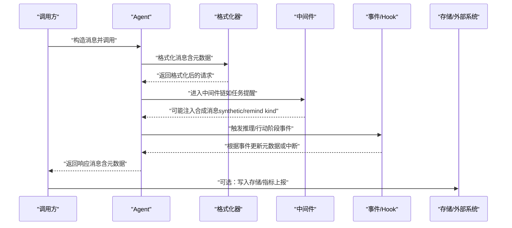
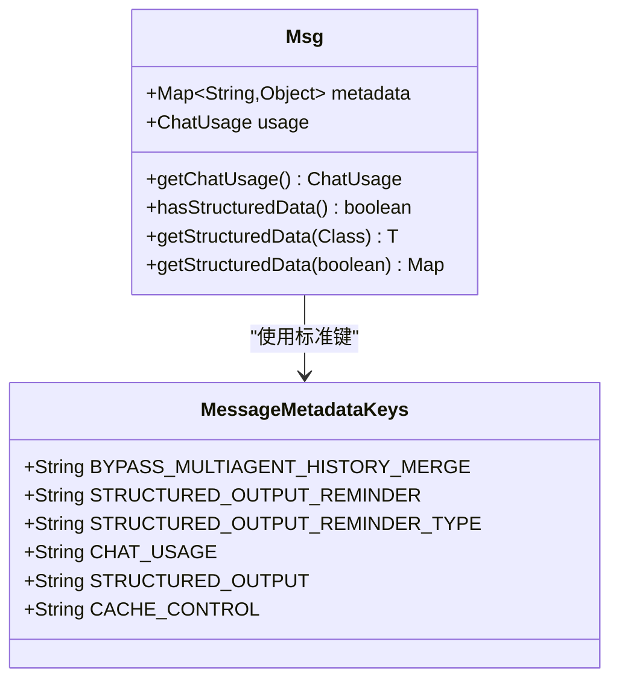
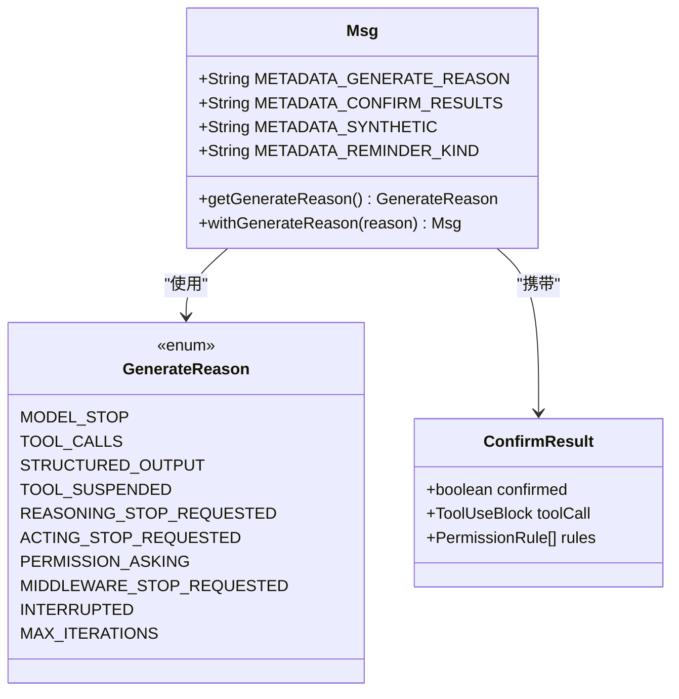
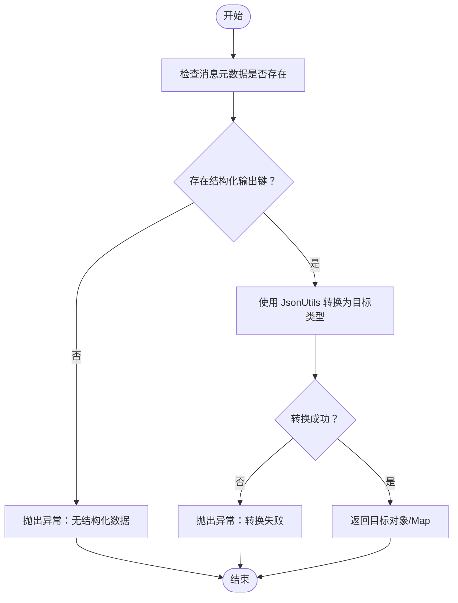
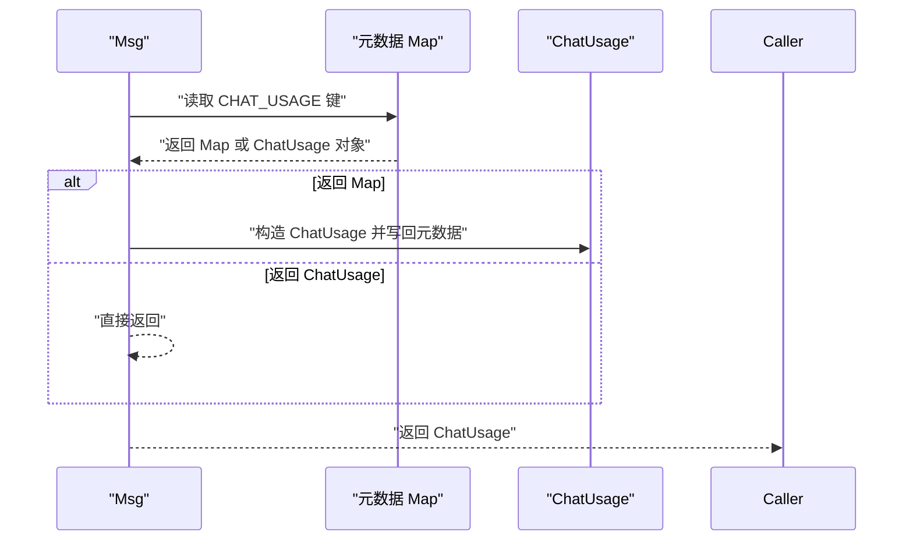
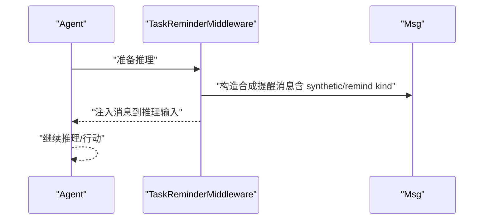
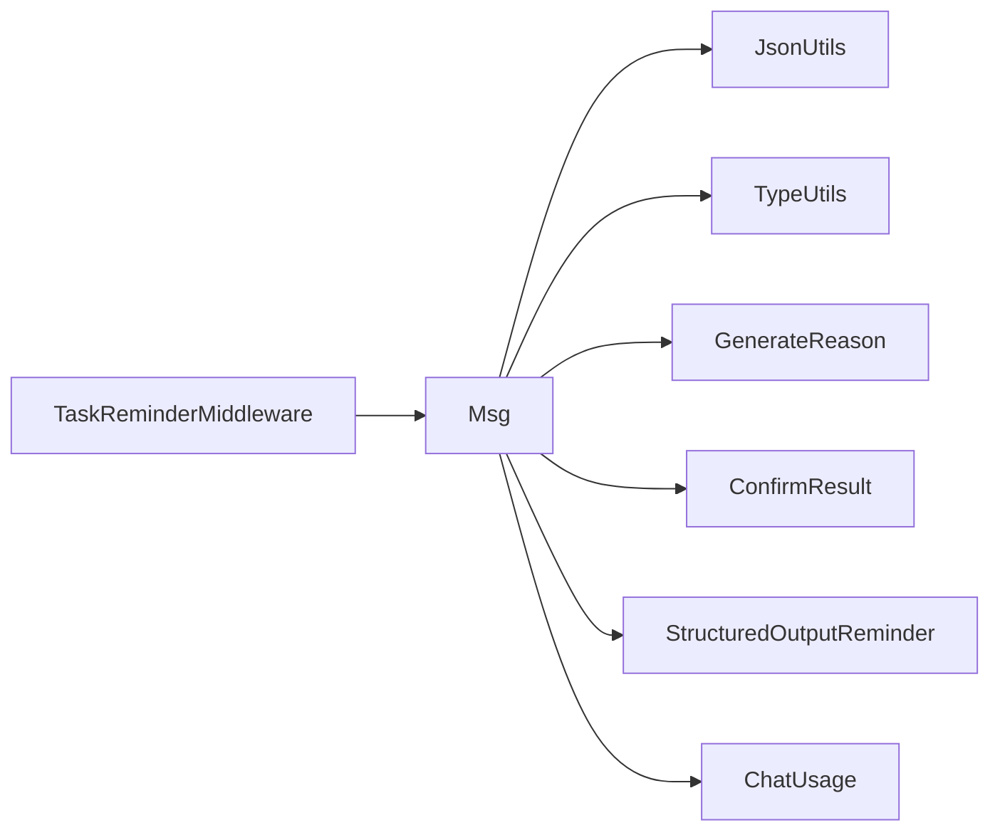

# 元数据管理

<cite>
**本文引用的文件**
- [MessageMetadataKeys.java](file://agentscope-core/src/main/java/io/agentscope/core/message/MessageMetadataKeys.java)
- [Msg.java](file://agentscope-core/src/main/java/io/agentscope/core/message/Msg.java)
- [GenerateReason.java](file://agentscope-core/src/main/java/io/agentscope/core/message/GenerateReason.java)
- [ConfirmResult.java](file://agentscope-core/src/main/java/io/agentscope/core/event/ConfirmResult.java)
- [StructuredOutputReminder.java](file://agentscope-core/src/main/java/io/agentscope/core/model/StructuredOutputReminder.java)
- [TaskReminderMiddleware.java](file://agentscope-core/src/main/java/io/agentscope/core/middleware/TaskReminderMiddleware.java)
- [ChatUsage.java](file://agentscope-core/src/main/java/io/agentscope/core/model/ChatUsage.java)
- [JsonUtils.java](file://agentscope-core/src/main/java/io/agentscope/core/util/JsonUtils.java)
- [TypeUtils.java](file://agentscope-core/src/main/java/io/agentscope/core/util/TypeUtils.java)
- [AssistantMessage.java](file://agentscope-core/src/main/java/io/agentscope/core/message/AssistantMessage.java)
- [SystemMessage.java](file://agentscope-core/src/main/java/io/agentscope/core/message/SystemMessage.java)
- [UserMessage.java](file://agentscope-core/src/main/java/io/agentscope/core/message/UserMessage.java)
- [ToolResultMessage.java](file://agentscope-core/src/main/java/io/agentscope/core/message/ToolResultMessage.java)
- [TextBlock.java](file://agentscope-core/src/main/java/io/agentscope/core/message/TextBlock.java)
- [DataBlock.java](file://agentscope-core/src/main/java/io/agentscope/core/message/DataBlock.java)
- [ImageBlock.java](file://agentscope-core/src/main/java/io/agentscope/core/message/ImageBlock.java)
- [AudioBlock.java](file://agentscope-core/src/main/java/io/agentscope/core/message/AudioBlock.java)
- [VideoBlock.java](file://agentscope-core/src/main/java/io/agentscope/core/message/VideoBlock.java)
- [ToolUseBlock.java](file://agentscope-core/src/main/java/io/agentscope/core/message/ToolUseBlock.java)
- [ToolResultBlock.java](file://agentscope-core/src/main/java/io/agentscope/core/message/ToolResultBlock.java)
- [ThinkingBlock.java](file://agentscope-core/src/main/java/io/agentscope/core/message/ThinkingBlock.java)
- [HintBlock.java](file://agentscope-core/src/main/java/io/agentscope/core/message/HintBlock.java)
- [RequireUserConfirmEvent.java](file://agentscope-core/src/main/java/io/agentscope/core/event/RequireUserConfirmEvent.java)
- [UserConfirmResultEvent.java](file://agentscope-core/src/main/java/io/agentscope/core/event/UserConfirmResultEvent.java)
- [AgentStartEvent.java](file://agentscope-core/src/main/java/io/agentscope/core/event/AgentStartEvent.java)
- [AgentEndEvent.java](file://agentscope-core/src/main/java/io/agentscope/core/event/AgentEndEvent.java)
- [PreReasoningEvent.java](file://agentscope-core/src/main/java/io/agentscope/core/hook/PreReasoningEvent.java)
- [PostReasoningEvent.java](file://agentscope-core/src/main/java/io/agentscope/core/hook/PostReasoningEvent.java)
- [PreActingEvent.java](file://agentscope-core/src/main/java/io/agentscope/core/hook/PreActingEvent.java)
- [PostActingEvent.java](file://agentscope-core/src/main/java/io/agentscope/core/hook/PostActingEvent.java)
- [ReasoningEvent.java](file://agentscope-core/src/main/java/io/agentscope/core/hook/ReasoningEvent.java)
- [ActingEvent.java](file://agentscope-core/src/main/java/io/agentscope/core/hook/ActingEvent.java)
- [SummaryEvent.java](file://agentscope-core/src/main/java/io/agentscope/core/hook/SummaryEvent.java)
- [ReasoningChunkEvent.java](file://agentscope-core/src/main/java/io/agentscope/core/hook/ReasoningChunkEvent.java)
- [ActingChunkEvent.java](file://agentscope-core/src/main/java/io/agentscope/core/hook/ActingChunkEvent.java)
- [SummaryChunkEvent.java](file://agentscope-core/src/main/java/io/agentscope/core/hook/SummaryChunkEvent.java)
</cite>

## 目录
1. [简介](#简介)
2. [项目结构](#项目结构)
3. [核心组件](#核心组件)
4. [架构总览](#架构总览)
5. [详细组件分析](#详细组件分析)
6. [依赖分析](#依赖分析)
7. [性能考虑](#性能考虑)
8. [故障排查指南](#故障排查指南)
9. [结论](#结论)
10. [附录](#附录)

## 简介
本文件面向消息元数据管理系统，系统性梳理并解释以下内容：
- MessageMetadataKeys 中定义的标准元数据键及其用途与类型约束
- 特殊元数据：生成原因（generate reason）、确认结果（confirm results）、合成消息标记（synthetic）、提醒类型（reminder kind）
- 元数据的存储机制、访问方法与类型转换能力
- 结构化数据提取功能的实现原理与使用方式
- 元数据在消息生命周期中的作用与最佳实践

## 项目结构
围绕消息与元数据的关键模块如下：
- 消息模型：Msg 及其角色子类（UserMessage、AssistantMessage、SystemMessage、ToolResultMessage）
- 内容块：TextBlock、DataBlock、ImageBlock、AudioBlock、VideoBlock、ToolUseBlock、ToolResultBlock、ThinkingBlock、HintBlock
- 元数据键常量：MessageMetadataKeys（标准键）、Msg 中的业务元数据键（生成原因、确认结果、合成标记、提醒类型）
- 执行与权限：GenerateReason（生成原因枚举）、ConfirmResult（用户确认结果）、StructuredOutputReminder（结构化输出提醒策略）
- 生命周期事件：Hook/Event 体系（Pre/Post Reasoning/Acting/Summary、Chunk 事件等）
- 中间件：TaskReminderMiddleware（任务提醒中间件）

**图表来源**
- [Msg.java:67-152](file://agentscope-core/src/main/java/io/agentscope/core/message/Msg.java#L67-L152)
- [MessageMetadataKeys.java:24-134](file://agentscope-core/src/main/java/io/agentscope/core/message/MessageMetadataKeys.java#L24-L134)
- [GenerateReason.java:36-77](file://agentscope-core/src/main/java/io/agentscope/core/message/GenerateReason.java#L36-L77)
- [ConfirmResult.java:31-68](file://agentscope-core/src/main/java/io/agentscope/core/event/ConfirmResult.java#L31-L68)
- [StructuredOutputReminder.java:25-51](file://agentscope-core/src/main/java/io/agentscope/core/model/StructuredOutputReminder.java#L25-L51)
- [TaskReminderMiddleware.java](file://agentscope-core/src/main/java/io/agentscope/core/middleware/TaskReminderMiddleware.java)

**章节来源**
- [Msg.java:67-152](file://agentscope-core/src/main/java/io/agentscope/core/message/Msg.java#L67-L152)
- [MessageMetadataKeys.java:24-134](file://agentscope-core/src/main/java/io/agentscope/core/message/MessageMetadataKeys.java#L24-L134)

## 核心组件
- 标准元数据键（MessageMetadataKeys）
  - BYPASS_MULTIAGENT_HISTORY_MERGE：布尔型，用于多智能体格式化器跳过历史合并
  - STRUCTURED_OUTPUT_REMINDER：布尔型，内部标记结构化输出提醒消息
  - STRUCTURED_OUTPUT_REMINDER_TYPE：字符串型，记录提醒模式（如 TOOL_CHOICE/PROMPT）
  - CHAT_USAGE：ChatUsage 类型，记录令牌用量统计
  - STRUCTURED_OUTPUT：Map 或 POJO，结构化输出数据
  - CACHE_CONTROL：布尔型，手动标记提示缓存控制
- 业务元数据键（Msg）
  - agentscope_generate_reason：生成原因
  - agentscope_confirm_results：权限人工确认结果集合
  - agentscope_synthetic：布尔型，标记合成消息（框架注入而非用户/模型/工具产生）
  - agentscope_reminder_kind：字符串型，合成提醒类型（如 todo_state）

这些键统一通过 Map<String,Object> 存储于消息元数据中，并提供类型安全的访问与转换方法。

**章节来源**
- [MessageMetadataKeys.java:24-134](file://agentscope-core/src/main/java/io/agentscope/core/message/MessageMetadataKeys.java#L24-L134)
- [Msg.java:69-93](file://agentscope-core/src/main/java/io/agentscope/core/message/Msg.java#L69-L93)

## 架构总览
消息元数据贯穿消息构建、格式化、执行、中间件处理、事件钩子与持久化全链路。下图展示了关键交互：

**图表来源**
- [Msg.java:614-655](file://agentscope-core/src/main/java/io/agentscope/core/message/Msg.java#L614-L655)
- [TaskReminderMiddleware.java](file://agentscope-core/src/main/java/io/agentscope/core/middleware/TaskReminderMiddleware.java)
- [PreReasoningEvent.java](file://agentscope-core/src/main/java/io/agentscope/core/hook/PreReasoningEvent.java)
- [PostReasoningEvent.java](file://agentscope-core/src/main/java/io/agentscope/core/hook/PostReasoningEvent.java)
- [PreActingEvent.java](file://agentscope-core/src/main/java/io/agentscope/core/hook/PreActingEvent.java)
- [PostActingEvent.java](file://agentscope-core/src/main/java/io/agentscope/core/hook/PostActingEvent.java)

## 详细组件分析

### 组件A：标准元数据键（MessageMetadataKeys）
- 设计目标：避免魔法字符串，统一跨组件的元数据键名
- 关键键值与类型
  - BYPASS_MULTIAGENT_HISTORY_MERGE：Boolean
  - STRUCTURED_OUTPUT_REMINDER：Boolean（内部）
  - STRUCTURED_OUTPUT_REMINDER_TYPE：String（内部）
  - CHAT_USAGE：ChatUsage
  - STRUCTURED_OUTPUT：Map<String,Object> 或 POJO
  - CACHE_CONTROL：Boolean
- 使用建议
  - 在消息构建时通过 Msg.Builder.metadata(...) 设置
  - 通过 Msg.getChatUsage()/hasStructuredData()/getStructuredData(...) 安全访问
  - 对于结构化输出，优先使用 getStructuredData(Class<T>) 进行强类型转换

**图表来源**
- [MessageMetadataKeys.java:24-134](file://agentscope-core/src/main/java/io/agentscope/core/message/MessageMetadataKeys.java#L24-L134)
- [Msg.java:384-517](file://agentscope-core/src/main/java/io/agentscope/core/message/Msg.java#L384-L517)

**章节来源**
- [MessageMetadataKeys.java:24-134](file://agentscope-core/src/main/java/io/agentscope/core/message/MessageMetadataKeys.java#L24-L134)
- [Msg.java:384-517](file://agentscope-core/src/main/java/io/agentscope/core/message/Msg.java#L384-L517)

### 组件B：业务元数据键与生成原因（Msg）
- 生成原因（agentscope_generate_reason）
  - 类型：枚举 GenerateReason
  - 支持值：MODEL_STOP、TOOL_CALLS、STRUCTURED_OUTPUT、TOOL_SUSPENDED、REASONING_STOP_REQUESTED、ACTING_STOP_REQUESTED、PERMISSION_ASKING、MIDDLEWARE_STOP_REQUESTED、INTERRUPTED、MAX_ITERATIONS
  - 访问：Msg.getGenerateReason()；设置：Msg.withGenerateReason(...)
- 确认结果（agentscope_confirm_results）
  - 类型：List<ConfirmResult>
  - 用途：恢复权限人工确认暂停时，携带 ConfirmResult 列表以继续工具调用
- 合成消息标记（agentscope_synthetic）
  - 类型：Boolean
  - 语义：框架注入的临时消息，不持久化到 AgentState.context
- 提醒类型（agentscope_reminder_kind）
  - 类型：String
  - 语义：当合成标记为真时，描述提醒种类（如 todo_state）

**图表来源**
- [Msg.java:69-93](file://agentscope-core/src/main/java/io/agentscope/core/message/Msg.java#L69-L93)
- [GenerateReason.java:36-77](file://agentscope-core/src/main/java/io/agentscope/core/message/GenerateReason.java#L36-L77)
- [ConfirmResult.java:31-68](file://agentscope-core/src/main/java/io/agentscope/core/event/ConfirmResult.java#L31-L68)

**章节来源**
- [Msg.java:614-655](file://agentscope-core/src/main/java/io/agentscope/core/message/Msg.java#L614-L655)
- [GenerateReason.java:36-77](file://agentscope-core/src/main/java/io/agentscope/core/message/GenerateReason.java#L36-L77)
- [ConfirmResult.java:31-68](file://agentscope-core/src/main/java/io/agentscope/core/event/ConfirmResult.java#L31-L68)

### 组件C：结构化输出与类型转换
- 结构化输出键（MessageMetadataKeys.STRUCTURED_OUTPUT）
  - 存储：Map<String,Object> 或用户自定义 POJO
  - 提供两个访问方法：
    - getStructuredData(Class<T>)：强类型转换
    - getStructuredData(boolean)：返回 Map，支持是否可变
- 转换实现
  - 基于 JsonUtils.getJsonCodec().convertValue(...) 实现
  - 类型安全：TypeUtils.safeCast(...) 辅助
- 使用场景
  - 用户输入结构化数据
  - 模型生成结构化输出（结合 StructuredOutputReminder）

**图表来源**
- [Msg.java:414-438](file://agentscope-core/src/main/java/io/agentscope/core/message/Msg.java#L414-L438)
- [Msg.java:488-517](file://agentscope-core/src/main/java/io/agentscope/core/message/Msg.java#L488-L517)
- [JsonUtils.java](file://agentscope-core/src/main/java/io/agentscope/core/util/JsonUtils.java)
- [TypeUtils.java](file://agentscope-core/src/main/java/io/agentscope/core/util/TypeUtils.java)

**章节来源**
- [Msg.java:384-517](file://agentscope-core/src/main/java/io/agentscope/core/message/Msg.java#L384-L517)
- [JsonUtils.java](file://agentscope-core/src/main/java/io/agentscope/core/util/JsonUtils.java)
- [TypeUtils.java](file://agentscope-core/src/main/java/io/agentscope/core/util/TypeUtils.java)

### 组件D：令牌用量统计（ChatUsage）
- 键：MessageMetadataKeys.CHAT_USAGE
- 类型：ChatUsage（包含 inputTokens、outputTokens、time 等字段）
- 访问：Msg.getChatUsage()，支持从元数据 Map 自动反序列化为 ChatUsage 并缓存

**图表来源**
- [Msg.java:558-584](file://agentscope-core/src/main/java/io/agentscope/core/message/Msg.java#L558-L584)
- [ChatUsage.java](file://agentscope-core/src/main/java/io/agentscope/core/model/ChatUsage.java)

**章节来源**
- [Msg.java:558-584](file://agentscope-core/src/main/java/io/agentscope/core/message/Msg.java#L558-L584)

### 组件E：任务提醒中间件（TaskReminderMiddleware）
- 作用：在每次推理前注入“待办事项”等合成提醒消息（synthetic），帮助保持上下文连贯
- 与元数据的关系：
  - synthetic 标记：METADATA_SYNTHETIC=true
  - 提醒类型：METADATA_REMINDER_KIND="todo_state"
- 影响：下游消费者可识别并跳过合成消息（如记忆抽取、压缩、RAG 回召回）

**图表来源**
- [TaskReminderMiddleware.java](file://agentscope-core/src/main/java/io/agentscope/core/middleware/TaskReminderMiddleware.java)
- [Msg.java:77-93](file://agentscope-core/src/main/java/io/agentscope/core/message/Msg.java#L77-L93)

**章节来源**
- [TaskReminderMiddleware.java](file://agentscope-core/src/main/java/io/agentscope/core/middleware/TaskReminderMiddleware.java)
- [Msg.java:77-93](file://agentscope-core/src/main/java/io/agentscope/core/message/Msg.java#L77-L93)

## 依赖分析
- 模块内耦合
  - Msg 依赖 JsonUtils、TypeUtils 进行结构化数据转换
  - Msg 依赖 GenerateReason、ConfirmResult、StructuredOutputReminder 表达业务语义
  - TaskReminderMiddleware 与 Msg 的合成消息标记协同工作
- 外部集成点
  - ChatUsage 作为令牌统计的标准化载体
  - Hook/Event 体系贯穿消息生命周期，影响元数据的生成与消费

**图表来源**
- [Msg.java:25-28](file://agentscope-core/src/main/java/io/agentscope/core/message/Msg.java#L25-L28)
- [JsonUtils.java](file://agentscope-core/src/main/java/io/agentscope/core/util/JsonUtils.java)
- [TypeUtils.java](file://agentscope-core/src/main/java/io/agentscope/core/util/TypeUtils.java)
- [GenerateReason.java:36-77](file://agentscope-core/src/main/java/io/agentscope/core/message/GenerateReason.java#L36-L77)
- [ConfirmResult.java:31-68](file://agentscope-core/src/main/java/io/agentscope/core/event/ConfirmResult.java#L31-L68)
- [StructuredOutputReminder.java:25-51](file://agentscope-core/src/main/java/io/agentscope/core/model/StructuredOutputReminder.java#L25-L51)
- [TaskReminderMiddleware.java](file://agentscope-core/src/main/java/io/agentscope/core/middleware/TaskReminderMiddleware.java)
- [ChatUsage.java](file://agentscope-core/src/main/java/io/agentscope/core/model/ChatUsage.java)

**章节来源**
- [Msg.java:25-28](file://agentscope-core/src/main/java/io/agentscope/core/message/Msg.java#L25-L28)

## 性能考虑
- 元数据访问
  - ChatUsage 反序列化后会缓存到元数据，避免重复解析
  - 结构化数据转换使用 Jackson 编解码，建议尽量复用已存在的 Map 避免重复装箱
- 合成消息标记
  - synthetic 标记可让下游跳过非必要处理，减少内存与计算开销
- 中间件注入
  - 仅在需要时注入提醒消息，避免过度频繁的合成消息

## 故障排查指南
- 结构化数据访问异常
  - 现象：调用 getStructuredData(...) 抛出异常
  - 排查：先调用 hasStructuredData() 检查键是否存在；确认目标类型字段与元数据键一致
- 生成原因解析异常
  - 现象：getGenerateReason() 返回默认值
  - 排查：确认元数据中 agentscope_generate_reason 是否为合法枚举字符串
- 令牌用量缺失
  - 现象：getChatUsage() 返回 null
  - 排查：确认 ChatUsage 已正确写入元数据或消息级 usage 字段

**章节来源**
- [Msg.java:414-438](file://agentscope-core/src/main/java/io/agentscope/core/message/Msg.java#L414-L438)
- [Msg.java:614-655](file://agentscope-core/src/main/java/io/agentscope/core/message/Msg.java#L614-L655)
- [Msg.java:558-584](file://agentscope-core/src/main/java/io/agentscope/core/message/Msg.java#L558-L584)

## 结论
消息元数据管理通过标准键与业务键的分层设计，实现了跨组件的一致性与可扩展性。结合结构化数据转换、令牌用量统计与合成消息标记，能够有效支撑复杂的消息生命周期管理与可观测性需求。建议在实际工程中遵循“显式键名、类型安全访问、最小化注入”的原则，确保元数据的清晰与高效。

## 附录

### 最佳实践清单
- 显式使用标准键：优先使用 MessageMetadataKeys 中的键，避免硬编码字符串
- 强类型转换：结构化输出优先使用 getStructuredData(Class<T>)，确保字段匹配
- 合理标记合成消息：对框架注入的临时消息设置 synthetic 与 reminder kind，便于下游过滤
- 令牌统计：在消息中保留 ChatUsage，便于成本与性能监控
- 权限确认：在 PERMISSION_ASKING 场景下，使用 agentscope_confirm_results 携带 ConfirmResult 列表恢复执行

### 示例路径（代码片段路径）
- 设置生成原因
  - [Msg.java:644-655](file://agentscope-core/src/main/java/io/agentscope/core/message/Msg.java#L644-L655)
- 获取生成原因
  - [Msg.java:614-633](file://agentscope-core/src/main/java/io/agentscope/core/message/Msg.java#L614-L633)
- 结构化数据提取（强类型）
  - [Msg.java:414-438](file://agentscope-core/src/main/java/io/agentscope/core/message/Msg.java#L414-L438)
- 结构化数据提取（Map）
  - [Msg.java:488-517](file://agentscope-core/src/main/java/io/agentscope/core/message/Msg.java#L488-L517)
- 令牌用量访问
  - [Msg.java:558-584](file://agentscope-core/src/main/java/io/agentscope/core/message/Msg.java#L558-L584)
- 合成消息标记
  - [Msg.java:77-93](file://agentscope-core/src/main/java/io/agentscope/core/message/Msg.java#L77-L93)
- 任务提醒中间件
  - [TaskReminderMiddleware.java](file://agentscope-core/src/main/java/io/agentscope/core/middleware/TaskReminderMiddleware.java)