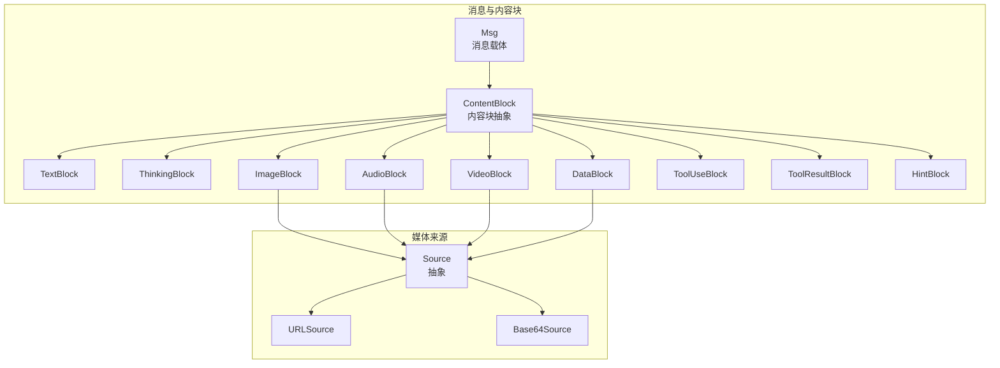
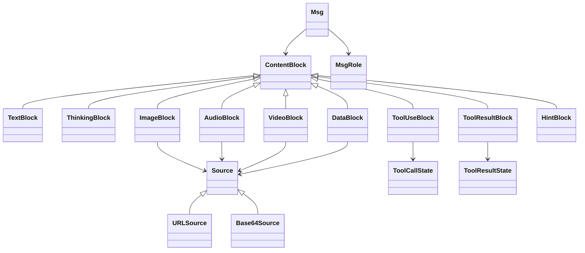
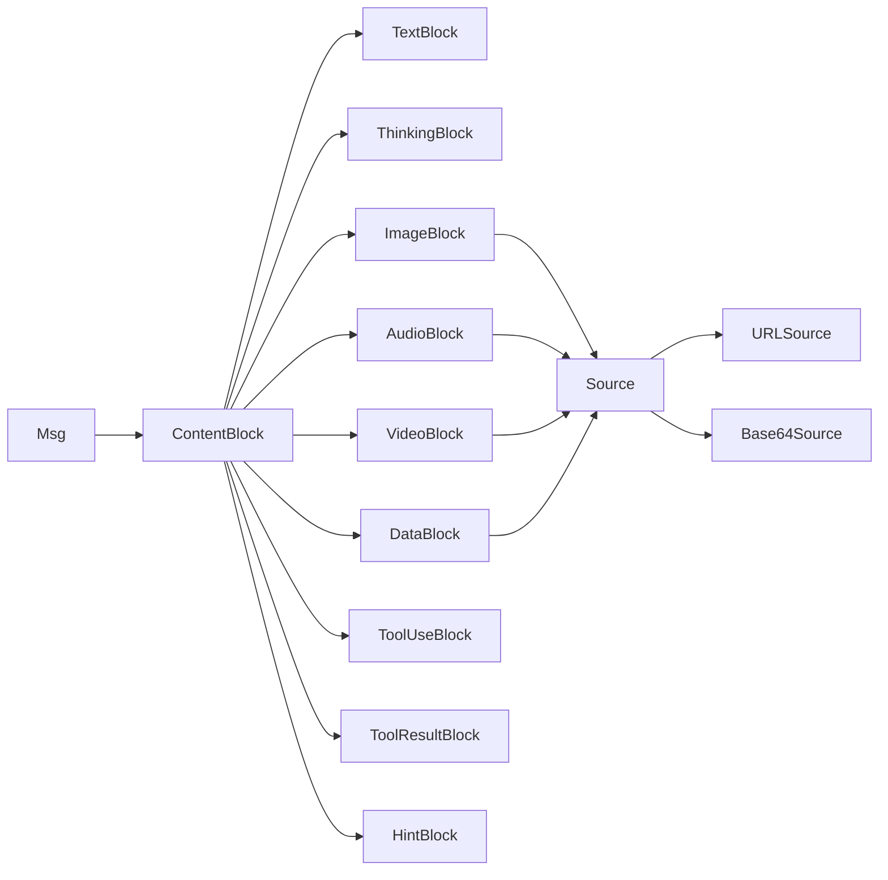
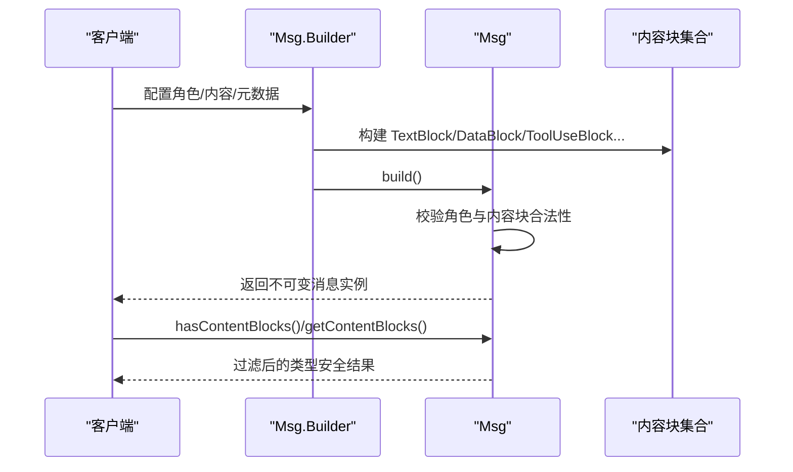

# 内容块系统

<cite>
**本文引用的文件**
- [ContentBlock.java](file://agentscope-core/src/main/java/io/agentscope/core/message/ContentBlock.java)
- [TextBlock.java](file://agentscope-core/src/main/java/io/agentscope/core/message/TextBlock.java)
- [ThinkingBlock.java](file://agentscope-core/src/main/java/io/agentscope/core/message/ThinkingBlock.java)
- [ImageBlock.java](file://agentscope-core/src/main/java/io/agentscope/core/message/ImageBlock.java)
- [AudioBlock.java](file://agentscope-core/src/main/java/io/agentscope/core/message/AudioBlock.java)
- [VideoBlock.java](file://agentscope-core/src/main/java/io/agentscope/core/message/VideoBlock.java)
- [DataBlock.java](file://agentscope-core/src/main/java/io/agentscope/core/message/DataBlock.java)
- [ToolUseBlock.java](file://agentscope-core/src/main/java/io/agentscope/core/message/ToolUseBlock.java)
- [ToolResultBlock.java](file://agentscope-core/src/main/java/io/agentscope/core/message/ToolResultBlock.java)
- [HintBlock.java](file://agentscope-core/src/main/java/io/agentscope/core/message/HintBlock.java)
- [Source.java](file://agentscope-core/src/main/java/io/agentscope/core/message/Source.java)
- [Base64Source.java](file://agentscope-core/src/main/java/io/agentscope/core/message/Base64Source.java)
- [URLSource.java](file://agentscope-core/src/main/java/io/agentscope/core/message/URLSource.java)
- [Msg.java](file://agentscope-core/src/main/java/io/agentscope/core/message/Msg.java)
- [MsgRole.java](file://agentscope-core/src/main/java/io/agentscope/core/message/MsgRole.java)
- [ToolCallState.java](file://agentscope-core/src/main/java/io/agentscope/core/message/ToolCallState.java)
- [ToolResultState.java](file://agentscope-core/src/main/java/io/agentscope/core/message/ToolResultState.java)
</cite>

## 目录
1. [引言](#引言)
2. [项目结构](#项目结构)
3. [核心组件](#核心组件)
4. [架构总览](#架构总览)
5. [详细组件分析](#详细组件分析)
6. [依赖分析](#依赖分析)
7. [性能考虑](#性能考虑)
8. [故障排查指南](#故障排查指南)
9. [结论](#结论)
10. [附录](#附录)

## 引言
本技术文档围绕内容块系统（Content Block System）展开，系统性阐述 ContentBlock 抽象类的设计理念与多态扩展模型，并深入解析各类内容块类型：文本型（TextBlock、ThinkingBlock、HintBlock）、多媒体型（ImageBlock、AudioBlock、VideoBlock、DataBlock），以及工具调用与结果型（ToolUseBlock、ToolResultBlock）。文档同时说明统一数据容器 DataBlock 的设计动机与使用场景，内容块的序列化/反序列化机制与类型安全的访问方法，以及内容块在消息传递中的处理流程与最佳实践。

## 项目结构
内容块系统位于 agentscope-core 模块的 io.agentscope.core.message 包中，采用“抽象基类 + 多态子类”的设计，配合 Source 抽象类及其 URLSource/Base64Source 实现，形成统一的媒体来源表达；消息 Msg 负责承载内容块列表并提供类型安全的访问与元数据管理。

图示来源
- [Msg.java](file://agentscope-core/src/main/java/io/agentscope/core/message/Msg.java)
- [ContentBlock.java](file://agentscope-core/src/main/java/io/agentscope/core/message/ContentBlock.java)
- [Source.java](file://agentscope-core/src/main/java/io/agentscope/core/message/Source.java)

章节来源
- [Msg.java](file://agentscope-core/src/main/java/io/agentscope/core/message/Msg.java)
- [ContentBlock.java](file://agentscope-core/src/main/java/io/agentscope/core/message/ContentBlock.java)
- [Source.java](file://agentscope-core/src/main/java/io/agentscope/core/message/Source.java)

## 核心组件
- ContentBlock：内容块抽象基类，采用密封类（sealed class）限制子类集合，结合 Jackson 多态注解进行序列化/反序列化，确保类型安全与可扩展性。
- Source 及其实现：统一表达媒体来源，支持 URL 与 Base64 两种方式，便于在 ImageBlock、AudioBlock、VideoBlock、DataBlock 中复用。
- 各类内容块：
  - 文本型：TextBlock（纯文本）、ThinkingBlock（推理/思考内容，含可选元数据）、HintBlock（提示信息）。
  - 多媒体型：ImageBlock、AudioBlock、VideoBlock（各自支持像素、帧率、帧数等参数）、DataBlock（统一二进制数据容器，推荐新代码优先使用）。
  - 工具型：ToolUseBlock（工具调用请求，含输入参数、流式内容、元数据、状态）、ToolResultBlock（工具执行结果，含输出内容块列表、元数据、状态，支持挂起与错误场景）。
- 消息 Msg：承载内容块列表与元数据，提供类型安全的过滤与提取方法，负责角色与内容块的合法性校验。

章节来源
- [ContentBlock.java](file://agentscope-core/src/main/java/io/agentscope/core/message/ContentBlock.java)
- [TextBlock.java](file://agentscope-core/src/main/java/io/agentscope/core/message/TextBlock.java)
- [ThinkingBlock.java](file://agentscope-core/src/main/java/io/agentscope/core/message/ThinkingBlock.java)
- [ImageBlock.java](file://agentscope-core/src/main/java/io/agentscope/core/message/ImageBlock.java)
- [AudioBlock.java](file://agentscope-core/src/main/java/io/agentscope/core/message/AudioBlock.java)
- [VideoBlock.java](file://agentscope-core/src/main/java/io/agentscope/core/message/VideoBlock.java)
- [DataBlock.java](file://agentscope-core/src/main/java/io/agentscope/core/message/DataBlock.java)
- [ToolUseBlock.java](file://agentscope-core/src/main/java/io/agentscope/core/message/ToolUseBlock.java)
- [ToolResultBlock.java](file://agentscope-core/src/main/java/io/agentscope/core/message/ToolResultBlock.java)
- [HintBlock.java](file://agentscope-core/src/main/java/io/agentscope/core/message/HintBlock.java)
- [Source.java](file://agentscope-core/src/main/java/io/agentscope/core/message/Source.java)
- [Base64Source.java](file://agentscope-core/src/main/java/io/agentscope/core/message/Base64Source.java)
- [URLSource.java](file://agentscope-core/src/main/java/io/agentscope/core/message/URLSource.java)
- [Msg.java](file://agentscope-core/src/main/java/io/agentscope/core/message/Msg.java)

## 架构总览
内容块系统通过“抽象 + 多态 + Builder + 序列化”实现高内聚、低耦合的消息内容建模。消息 Msg 将多种内容块聚合为不可变列表，配合角色约束与类型安全访问方法，保证在不同 LLM/工具集成场景下的兼容性与一致性。

图示来源
- [ContentBlock.java](file://agentscope-core/src/main/java/io/agentscope/core/message/ContentBlock.java)
- [TextBlock.java](file://agentscope-core/src/main/java/io/agentscope/core/message/TextBlock.java)
- [ThinkingBlock.java](file://agentscope-core/src/main/java/io/agentscope/core/message/ThinkingBlock.java)
- [ImageBlock.java](file://agentscope-core/src/main/java/io/agentscope/core/message/ImageBlock.java)
- [AudioBlock.java](file://agentscope-core/src/main/java/io/agentscope/core/message/AudioBlock.java)
- [VideoBlock.java](file://agentscope-core/src/main/java/io/agentscope/core/message/VideoBlock.java)
- [DataBlock.java](file://agentscope-core/src/main/java/io/agentscope/core/message/DataBlock.java)
- [ToolUseBlock.java](file://agentscope-core/src/main/java/io/agentscope/core/message/ToolUseBlock.java)
- [ToolResultBlock.java](file://agentscope-core/src/main/java/io/agentscope/core/message/ToolResultBlock.java)
- [HintBlock.java](file://agentscope-core/src/main/java/io/agentscope/core/message/HintBlock.java)
- [Source.java](file://agentscope-core/src/main/java/io/agentscope/core/message/Source.java)
- [URLSource.java](file://agentscope-core/src/main/java/io/agentscope/core/message/URLSource.java)
- [Base64Source.java](file://agentscope-core/src/main/java/io/agentscope/core/message/Base64Source.java)
- [Msg.java](file://agentscope-core/src/main/java/io/agentscope/core/message/Msg.java)
- [MsgRole.java](file://agentscope-core/src/main/java/io/agentscope/core/message/MsgRole.java)
- [ToolCallState.java](file://agentscope-core/src/main/java/io/agentscope/core/message/ToolCallState.java)
- [ToolResultState.java](file://agentscope-core/src/main/java/io/agentscope/core/message/ToolResultState.java)

## 详细组件分析

### ContentBlock 抽象类与多态体系
- 设计要点
  - 密封类（sealed class）限制子类集合，确保模式匹配时的穷尽性与类型安全。
  - 使用 Jackson 注解对子类进行多态序列化，字段名 type 用于区分具体类型。
  - 子类包括：TextBlock、ThinkingBlock、ImageBlock、AudioBlock、VideoBlock、ToolUseBlock、ToolResultBlock、HintBlock、DataBlock。
- 类型安全
  - 通过子类构造器与 Builder 模式，确保对象不可变与默认值设置。
  - 在 Msg 中对不同角色允许的内容块进行合法性校验，避免非法组合。

章节来源
- [ContentBlock.java](file://agentscope-core/src/main/java/io/agentscope/core/message/ContentBlock.java)

### 文本内容类型
- TextBlock
  - 纯文本内容，空值会被转换为空字符串，toString 返回文本内容，便于直接打印或拼接。
  - 提供 builder 以链式构建。
- ThinkingBlock
  - 表达代理内部推理过程，支持可选元数据（如推理详情列表），便于回放与调试。
  - 提供 builder 与 metadata 字段，保留第三方平台特定信息。
- HintBlock
  - 由中间件或记忆系统注入的提示信息，不参与对话历史，仅引导推理。

章节来源
- [TextBlock.java](file://agentscope-core/src/main/java/io/agentscope/core/message/TextBlock.java)
- [ThinkingBlock.java](file://agentscope-core/src/main/java/io/agentscope/core/message/ThinkingBlock.java)
- [HintBlock.java](file://agentscope-core/src/main/java/io/agentscope/core/message/HintBlock.java)

### 多媒体内容类型
- ImageBlock、AudioBlock、VideoBlock
  - 均通过 Source 表达媒体来源（URL 或 Base64），支持最小/最大像素阈值与视频帧率、帧数、总像素等参数。
  - 提供 Builder 以灵活配置参数。
- DataBlock（推荐）
  - 统一二进制数据容器，替代 ImageBlock/AudioBlock/VideoBlock 的遗留类型，面向未来设计。
  - 支持稳定标识 id（未提供则自动生成）、可选名称 name、Source 源。
  - 新代码应优先使用 DataBlock，以获得更好的扩展性与一致性。

章节来源
- [ImageBlock.java](file://agentscope-core/src/main/java/io/agentscope/core/message/ImageBlock.java)
- [AudioBlock.java](file://agentscope-core/src/main/java/io/agentscope/core/message/AudioBlock.java)
- [VideoBlock.java](file://agentscope-core/src/main/java/io/agentscope/core/message/VideoBlock.java)
- [DataBlock.java](file://agentscope-core/src/main/java/io/agentscope/core/message/DataBlock.java)
- [Source.java](file://agentscope-core/src/main/java/io/agentscope/core/message/Source.java)
- [URLSource.java](file://agentscope-core/src/main/java/io/agentscope/core/message/URLSource.java)
- [Base64Source.java](file://agentscope-core/src/main/java/io/agentscope/core/message/Base64Source.java)

### 工具调用与结果
- ToolUseBlock
  - 描述一次工具调用请求，包含唯一 id、工具名、输入参数、原始流式内容、提供商元数据与调用状态。
  - 输入与元数据均进行防御式拷贝，保证不可变性与线程安全。
  - 提供 withState 方法以更新状态。
- ToolResultBlock
  - 描述工具执行结果，包含 id、name、输出内容块列表、元数据与结果状态。
  - 支持挂起（外部执行）与错误场景，isSuspended 与 suspended 工厂方法用于处理外部中断。
  - 提供多种 of(...) 工厂方法，覆盖返回值与消息内容块的不同使用场景。
  - 提供 withState 与 withIdAndName 以生成新的结果实例。

章节来源
- [ToolUseBlock.java](file://agentscope-core/src/main/java/io/agentscope/core/message/ToolUseBlock.java)
- [ToolResultBlock.java](file://agentscope-core/src/main/java/io/agentscope/core/message/ToolResultBlock.java)
- [ToolCallState.java](file://agentscope-core/src/main/java/io/agentscope/core/message/ToolCallState.java)
- [ToolResultState.java](file://agentscope-core/src/main/java/io/agentscope/core/message/ToolResultState.java)

### 消息与内容块的序列化/反序列化
- ContentBlock 与 Source
  - 通过 @JsonTypeInfo 与 @JsonSubTypes 注解，使用字段 type 识别具体子类，实现多态 JSON 序列化/反序列化。
- Msg
  - 消息本身也具备多态行为（按 role 字段分发到具体子类），内容块列表为不可变列表，元数据可选。
  - 提供类型安全的访问方法：hasContentBlocks、getContentBlocks、getFirstContentBlock、getTextContent、getStructuredData 等。
  - 对 USER/SYSTEM 角色的内容块进行合法性校验，确保语义正确性。

章节来源
- [ContentBlock.java](file://agentscope-core/src/main/java/io/agentscope/core/message/ContentBlock.java)
- [Source.java](file://agentscope-core/src/main/java/io/agentscope/core/message/Source.java)
- [Msg.java](file://agentscope-core/src/main/java/io/agentscope/core/message/Msg.java)

### 内容块组合与最佳实践
- 组合策略
  - 文本与多媒体混合：在用户消息中可同时包含 TextBlock 与 DataBlock/ImageBlock/AudioBlock/VideoBlock，但需遵循 Msg 对 USER 角色的限制。
  - 推理与思考：在助手消息中搭配 ThinkingBlock 与 ToolUseBlock/ToolResultBlock，提升可观测性与可调试性。
  - 工具链路：ToolUseBlock → ToolResultBlock（可携带多个内容块输出），必要时使用挂起状态等待外部执行。
- 构建建议
  - 优先使用 DataBlock 替代 ImageBlock/AudioBlock/VideoBlock，保持统一数据模型。
  - 使用 Builder 模式逐项配置，避免遗漏关键字段。
  - 利用 Msg 的类型安全访问方法快速筛选与提取所需内容块。
- 示例路径（不展示具体代码，仅给出定位）
  - 创建文本内容块：[TextBlock.java](file://agentscope-core/src/main/java/io/agentscope/core/message/TextBlock.java)
  - 创建多媒体内容块（URL/Base64）：[ImageBlock.java](file://agentscope-core/src/main/java/io/agentscope/core/message/ImageBlock.java)、[AudioBlock.java](file://agentscope-core/src/main/java/io/agentscope/core/message/AudioBlock.java)、[VideoBlock.java](file://agentscope-core/src/main/java/io/agentscope/core/message/VideoBlock.java)、[DataBlock.java](file://agentscope-core/src/main/java/io/agentscope/core/message/DataBlock.java)
  - 创建工具调用与结果：[ToolUseBlock.java](file://agentscope-core/src/main/java/io/agentscope/core/message/ToolUseBlock.java)、[ToolResultBlock.java](file://agentscope-core/src/main/java/io/agentscope/core/message/ToolResultBlock.java)
  - 组装消息并访问内容块：[Msg.java](file://agentscope-core/src/main/java/io/agentscope/core/message/Msg.java)

章节来源
- [Msg.java](file://agentscope-core/src/main/java/io/agentscope/core/message/Msg.java)
- [ContentBlock.java](file://agentscope-core/src/main/java/io/agentscope/core/message/ContentBlock.java)
- [DataBlock.java](file://agentscope-core/src/main/java/io/agentscope/core/message/DataBlock.java)
- [ToolUseBlock.java](file://agentscope-core/src/main/java/io/agentscope/core/message/ToolUseBlock.java)
- [ToolResultBlock.java](file://agentscope-core/src/main/java/io/agentscope/core/message/ToolResultBlock.java)

## 依赖分析
- 组件内聚与耦合
  - ContentBlock 与各子类之间为强内聚的继承关系，职责清晰。
  - Source 与媒体类解耦，通过组合而非继承实现复用。
  - Msg 与 ContentBlock 为聚合关系，通过不可变列表承载内容块，降低耦合度。
- 外部依赖
  - Jackson 注解驱动多态序列化，要求子类构造器与字段命名一致。
  - 类型安全访问依赖泛型与类型转换工具（如 safeCast），避免运行时异常。

图示来源
- [Msg.java](file://agentscope-core/src/main/java/io/agentscope/core/message/Msg.java)
- [ContentBlock.java](file://agentscope-core/src/main/java/io/agentscope/core/message/ContentBlock.java)
- [Source.java](file://agentscope-core/src/main/java/io/agentscope/core/message/Source.java)

章节来源
- [Msg.java](file://agentscope-core/src/main/java/io/agentscope/core/message/Msg.java)
- [ContentBlock.java](file://agentscope-core/src/main/java/io/agentscope/core/message/ContentBlock.java)
- [Source.java](file://agentscope-core/src/main/java/io/agentscope/core/message/Source.java)

## 性能考虑
- 不可变性与防御式拷贝
  - ContentBlock 列表与 ToolUseBlock/ToolResultBlock 的输入/元数据均采用不可变或防御式拷贝，减少并发问题，但会带来额外内存开销。
- 序列化成本
  - 多态序列化需要额外的类型字段与反射/注册逻辑，建议在高频序列化场景下关注对象池与缓存策略。
- 媒体数据体积
  - Base64 编码会增大体积，建议优先使用 URLSource；大文件尽量使用 URL，避免内存压力。
- 访问效率
  - 类型安全访问方法基于流式过滤，适合小到中等规模内容块列表；大规模列表建议引入索引或预过滤策略。

## 故障排查指南
- 内容块类型不匹配
  - 现象：抛出非法参数异常，提示某角色不允许包含某类型内容块。
  - 原因：Msg.validateRoleContent 对 USER/SYSTEM 角色进行了严格限制。
  - 处理：检查 Msg 角色与内容块类型组合，必要时改用 DataBlock 或调整角色。
- 工具结果挂起
  - 现象：ToolResultBlock.isSuspended 返回 true。
  - 原因：工具抛出 ToolSuspendException，框架将其转换为挂起结果。
  - 处理：根据 suspended(...) 生成的提示信息，完成外部执行后继续后续流程。
- 结构化数据提取失败
  - 现象：getStructuredData 抛出异常或返回空。
  - 原因：消息元数据缺失或键值不匹配。
  - 处理：先调用 hasStructuredData 检查，再使用 getStructuredData(Class<T>) 或 getStructuredData(boolean) 获取。

章节来源
- [Msg.java](file://agentscope-core/src/main/java/io/agentscope/core/message/Msg.java)
- [ToolResultBlock.java](file://agentscope-core/src/main/java/io/agentscope/core/message/ToolResultBlock.java)

## 结论
内容块系统通过抽象基类与多态扩展，结合统一的媒体来源表达与类型安全的消息访问能力，实现了跨角色、跨模态、跨工具的通用内容建模。DataBlock 作为统一数据容器，代表了面向未来的演进方向；配合 Builder 模式与严格的序列化/反序列化机制，既保证了易用性，又确保了可维护性与可扩展性。在实际应用中，建议优先采用 DataBlock 与类型安全的访问方法，合理组织内容块组合，以获得更佳的开发体验与运行性能。

## 附录
- 关键流程示意：消息构建与内容块访问

图示来源
- [Msg.java](file://agentscope-core/src/main/java/io/agentscope/core/message/Msg.java)
- [ContentBlock.java](file://agentscope-core/src/main/java/io/agentscope/core/message/ContentBlock.java)