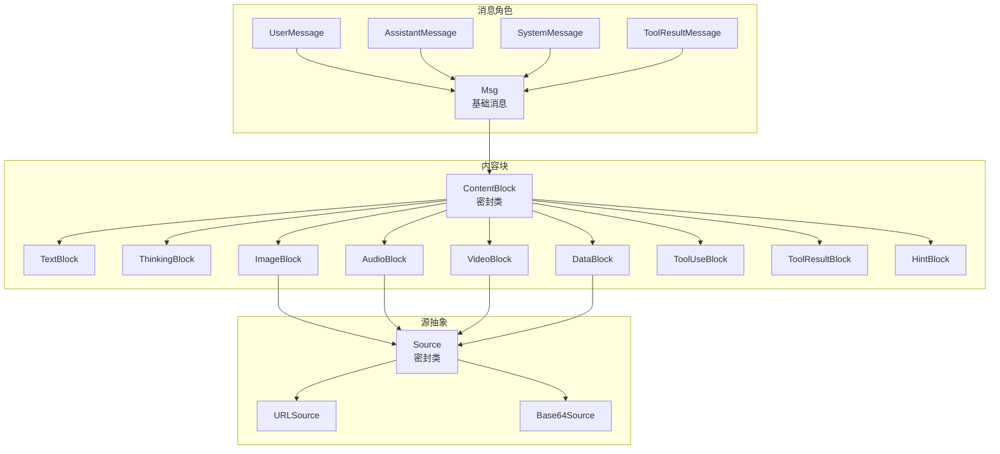
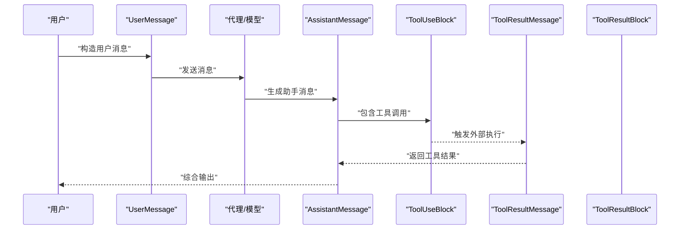
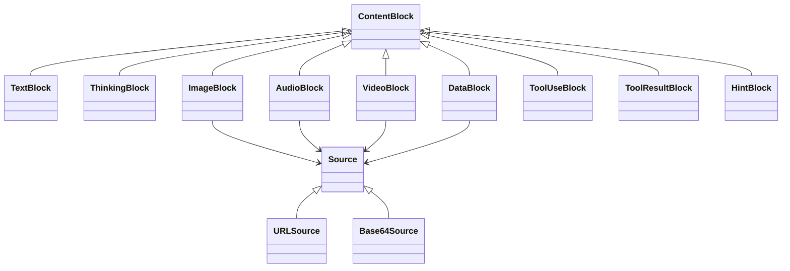
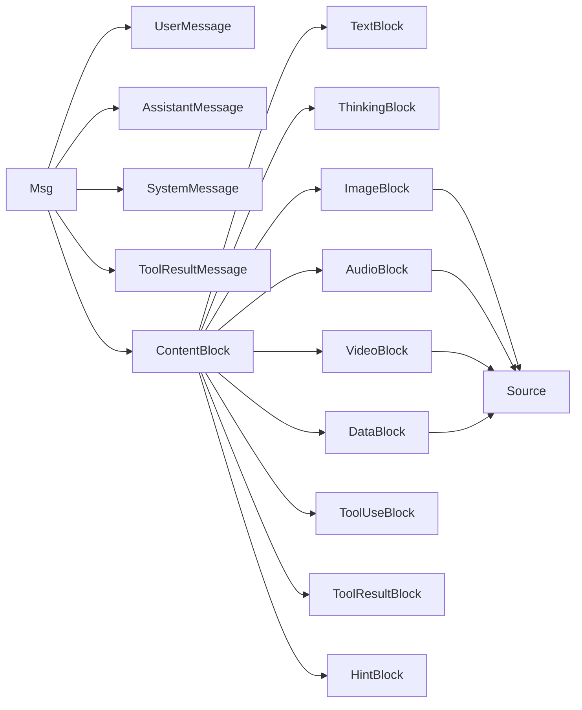

# 消息传递系统

<cite>
**本文引用的文件**
- [Msg.java](file://agentscope-core/src/main/java/io/agentscope/core/message/Msg.java)
- [UserMessage.java](file://agentscope-core/src/main/java/io/agentscope/core/message/UserMessage.java)
- [AssistantMessage.java](file://agentscope-core/src/main/java/io/agentscope/core/message/AssistantMessage.java)
- [SystemMessage.java](file://agentscope-core/src/main/java/io/agentscope/core/message/SystemMessage.java)
- [ContentBlock.java](file://agentscope-core/src/main/java/io/agentscope/core/message/ContentBlock.java)
- [TextBlock.java](file://agentscope-core/src/main/java/io/agentscope/core/message/TextBlock.java)
- [ThinkingBlock.java](file://agentscope-core/src/main/java/io/agentscope/core/message/ThinkingBlock.java)
- [ImageBlock.java](file://agentscope-core/src/main/java/io/agentscope/core/message/ImageBlock.java)
- [AudioBlock.java](file://agentscope-core/src/main/java/io/agentscope/core/message/AudioBlock.java)
- [VideoBlock.java](file://agentscope-core/src/main/java/io/agentscope/core/message/VideoBlock.java)
- [DataBlock.java](file://agentscope-core/src/main/java/io/agentscope/core/message/DataBlock.java)
- [ToolUseBlock.java](file://agentscope-core/src/main/java/io/agentscope/core/message/ToolUseBlock.java)
- [ToolResultBlock.java](file://agentscope-core/src/main/java/io/agentscope/core/message/ToolResultBlock.java)
- [HintBlock.java](file://agentscope-core/src/main/java/io/agentscope/core/message/HintBlock.java)
- [Source.java](file://agentscope-core/src/main/java/io/agentscope/core/message/Source.java)
</cite>

## 目录
1. [简介](#简介)
2. [项目结构](#项目结构)
3. [核心组件](#核心组件)
4. [架构总览](#架构总览)
5. [详细组件分析](#详细组件分析)
6. [依赖分析](#依赖分析)
7. [性能考虑](#性能考虑)
8. [故障排查指南](#故障排查指南)
9. [结论](#结论)
10. [附录：最佳实践与示例路径](#附录最佳实践与示例路径)

## 简介
本文件面向消息传递系统，系统性阐述消息模型与内容块体系的设计与实现，覆盖以下主题：
- 消息角色与语义：用户消息、系统消息、助手消息、工具结果消息
- 内容块系统：文本、思考、图片、音频、视频、通用数据、工具调用、工具结果、提示
- 元数据管理与生成原因标记
- 序列化/反序列化机制（Jackson 多态）
- 多模态支持策略（统一 Source 抽象）
- 最佳实践与性能优化建议
- 示例路径（以“代码片段路径”形式给出）

## 项目结构
消息传递相关的核心代码位于 agentscope-core 模块的 io.agentscope.core.message 包中，采用“角色类 + 内容块类 + 源抽象”的分层设计，配合 Jackson 的多态注解实现跨角色与跨内容类型的序列化。

图表来源
- [Msg.java:67-152](file://agentscope-core/src/main/java/io/agentscope/core/message/Msg.java#L67-L152)
- [UserMessage.java:37-83](file://agentscope-core/src/main/java/io/agentscope/core/message/UserMessage.java#L37-L83)
- [AssistantMessage.java:35-81](file://agentscope-core/src/main/java/io/agentscope/core/message/AssistantMessage.java#L35-L81)
- [SystemMessage.java:35-81](file://agentscope-core/src/main/java/io/agentscope/core/message/SystemMessage.java#L35-L81)
- [ContentBlock.java:58-67](file://agentscope-core/src/main/java/io/agentscope/core/message/ContentBlock.java#L58-L67)
- [TextBlock.java:31-95](file://agentscope-core/src/main/java/io/agentscope/core/message/TextBlock.java#L31-L95)
- [ThinkingBlock.java:37-133](file://agentscope-core/src/main/java/io/agentscope/core/message/ThinkingBlock.java#L37-L133)
- [ImageBlock.java:37-163](file://agentscope-core/src/main/java/io/agentscope/core/message/ImageBlock.java#L37-L163)
- [AudioBlock.java:35-96](file://agentscope-core/src/main/java/io/agentscope/core/message/AudioBlock.java#L35-L96)
- [VideoBlock.java:36-239](file://agentscope-core/src/main/java/io/agentscope/core/message/VideoBlock.java#L36-L239)
- [DataBlock.java:35-153](file://agentscope-core/src/main/java/io/agentscope/core/message/DataBlock.java#L35-L153)
- [ToolUseBlock.java:34-119](file://agentscope-core/src/main/java/io/agentscope/core/message/ToolUseBlock.java#L34-L119)
- [ToolResultBlock.java:35-58](file://agentscope-core/src/main/java/io/agentscope/core/message/ToolResultBlock.java#L35-L58)
- [HintBlock.java:28-74](file://agentscope-core/src/main/java/io/agentscope/core/message/HintBlock.java#L28-L74)
- [Source.java:27-32](file://agentscope-core/src/main/java/io/agentscope/core/message/Source.java#L27-L32)

章节来源
- [Msg.java:40-66](file://agentscope-core/src/main/java/io/agentscope/core/message/Msg.java#L40-L66)
- [ContentBlock.java:22-45](file://agentscope-core/src/main/java/io/agentscope/core/message/ContentBlock.java#L22-L45)

## 核心组件
- 基础消息 Msg：统一承载消息标识、角色、内容块列表、元数据、时间戳、用量统计；提供类型安全的查询与构造器；内置角色-内容块合法性校验。
- 角色消息子类：UserMessage、AssistantMessage、SystemMessage、ToolResultMessage，均继承自 Msg，固定角色并在构建器上做约束与便捷构造。
- 内容块 ContentBlock：密封类，定义多态序列化字段“type”，涵盖文本、思考、图片、音频、视频、通用数据、工具调用、工具结果、提示。
- 源 Source：统一 URL 与 Base64 两种媒体来源，支撑多模态输入输出。
- 工具相关：ToolUseBlock 表达“请求调用”，ToolResultBlock 表达“执行结果”及挂起状态。

章节来源
- [Msg.java:67-152](file://agentscope-core/src/main/java/io/agentscope/core/message/Msg.java#L67-L152)
- [UserMessage.java:37-83](file://agentscope-core/src/main/java/io/agentscope/core/message/UserMessage.java#L37-L83)
- [AssistantMessage.java:35-81](file://agentscope-core/src/main/java/io/agentscope/core/message/AssistantMessage.java#L35-L81)
- [SystemMessage.java:35-81](file://agentscope-core/src/main/java/io/agentscope/core/message/SystemMessage.java#L35-L81)
- [ContentBlock.java:46-57](file://agentscope-core/src/main/java/io/agentscope/core/message/ContentBlock.java#L46-L57)
- [Source.java:27-32](file://agentscope-core/src/main/java/io/agentscope/core/message/Source.java#L27-L32)

## 架构总览
消息在系统中的典型流转：
- 输入阶段：用户通过 UserMessage 提交文本/多模态内容
- 推理阶段：助手生成 AssistantMessage，可能包含 ThinkingBlock、ToolUseBlock
- 工具交互：ToolUseBlock 发出调用请求，ToolResultMessage 返回 ToolResultBlock 结果
- 输出阶段：系统消息 SystemMessage 可用于设定上下文或规则
- 元数据：记录生成原因、用量、合成标记等

图表来源
- [UserMessage.java:39-71](file://agentscope-core/src/main/java/io/agentscope/core/message/UserMessage.java#L39-L71)
- [AssistantMessage.java:37-69](file://agentscope-core/src/main/java/io/agentscope/core/message/AssistantMessage.java#L37-L69)
- [ToolUseBlock.java:98-119](file://agentscope-core/src/main/java/io/agentscope/core/message/ToolUseBlock.java#L98-L119)
- [ToolResultBlock.java:46-58](file://agentscope-core/src/main/java/io/agentscope/core/message/ToolResultBlock.java#L46-L58)

## 详细组件分析

### 消息角色与语义
- 用户消息 UserMessage
  - 固定角色为 USER
  - 支持文本、图片、音频、视频、通用数据、工具调用等作为内容块
  - 提供便捷构造器与独立 Builder，限制 role 设置
- 助手消息 AssistantMessage
  - 固定角色为 ASSISTANT
  - 常见内容块：TextBlock、ThinkingBlock、ToolUseBlock、ToolResultBlock、DataBlock
- 系统消息 SystemMessage
  - 固定角色为 SYSTEM
  - 仅允许 TextBlock；Msg 构造器会校验
- 工具结果消息 ToolResultMessage
  - 固定角色为 TOOL
  - 通常由工具执行后生成，内容块为 ToolResultBlock 或 DataBlock

章节来源
- [UserMessage.java:24-36](file://agentscope-core/src/main/java/io/agentscope/core/message/UserMessage.java#L24-L36)
- [AssistantMessage.java:24-34](file://agentscope-core/src/main/java/io/agentscope/core/message/AssistantMessage.java#L24-L34)
- [SystemMessage.java:24-34](file://agentscope-core/src/main/java/io/agentscope/core/message/SystemMessage.java#L24-L34)
- [Msg.java:166-198](file://agentscope-core/src/main/java/io/agentscope/core/message/Msg.java#L166-L198)

### 内容块系统与多模态
- 密封类 ContentBlock 定义多态字段“type”，确保序列化时可正确识别具体类型
- 文本 TextBlock：最基础的文本内容
- 思考 ThinkingBlock：携带推理内容与可选元数据（如 OpenRouter/Gemini 推理详情）
- 图片 ImageBlock、音频 AudioBlock、视频 VideoBlock：统一通过 Source 抽象承载 URL 或 Base64 数据，并支持像素阈值、帧率等参数
- 通用数据 DataBlock：面向未来的统一二进制容器，替代旧版 ImageBlock/AudioBlock/VideoBlock 子类
- 工具调用 ToolUseBlock：封装工具名、参数、流式内容、元数据与调用状态
- 工具结果 ToolResultBlock：封装工具输出（可含多个内容块）、元数据、结果状态；支持挂起标记
- 提示 HintBlock：为推理提供上下文提示，不进入对话历史

图表来源
- [ContentBlock.java:46-57](file://agentscope-core/src/main/java/io/agentscope/core/message/ContentBlock.java#L46-L57)
- [TextBlock.java:31-95](file://agentscope-core/src/main/java/io/agentscope/core/message/TextBlock.java#L31-L95)
- [ThinkingBlock.java:37-133](file://agentscope-core/src/main/java/io/agentscope/core/message/ThinkingBlock.java#L37-L133)
- [ImageBlock.java:37-163](file://agentscope-core/src/main/java/io/agentscope/core/message/ImageBlock.java#L37-L163)
- [AudioBlock.java:35-96](file://agentscope-core/src/main/java/io/agentscope/core/message/AudioBlock.java#L35-L96)
- [VideoBlock.java:36-239](file://agentscope-core/src/main/java/io/agentscope/core/message/VideoBlock.java#L36-L239)
- [DataBlock.java:35-153](file://agentscope-core/src/main/java/io/agentscope/core/message/DataBlock.java#L35-L153)
- [ToolUseBlock.java:34-119](file://agentscope-core/src/main/java/io/agentscope/core/message/ToolUseBlock.java#L34-L119)
- [ToolResultBlock.java:35-58](file://agentscope-core/src/main/java/io/agentscope/core/message/ToolResultBlock.java#L35-L58)
- [HintBlock.java:28-74](file://agentscope-core/src/main/java/io/agentscope/core/message/HintBlock.java#L28-L74)
- [Source.java:27-32](file://agentscope-core/src/main/java/io/agentscope/core/message/Source.java#L27-L32)

章节来源
- [ContentBlock.java:22-45](file://agentscope-core/src/main/java/io/agentscope/core/message/ContentBlock.java#L22-L45)
- [ImageBlock.java:23-35](file://agentscope-core/src/main/java/io/agentscope/core/message/ImageBlock.java#L23-L35)
- [VideoBlock.java:22-34](file://agentscope-core/src/main/java/io/agentscope/core/message/VideoBlock.java#L22-L34)
- [DataBlock.java:24-33](file://agentscope-core/src/main/java/io/agentscope/core/message/DataBlock.java#L24-L33)

### 元数据管理与生成原因
- 元数据键常量：生成原因、确认结果、合成标记、提醒类型等
- 生成原因枚举：用于标注消息生成的终止条件（如模型停止、工具挂起、人工干预、中断、最大迭代）
- 用量统计：支持 ChatUsage 对象或 Map 形式的 token 统计
- 结构化数据：从元数据提取结构化输出，支持强类型转换与动态 Map 转换

章节来源
- [Msg.java:69-93](file://agentscope-core/src/main/java/io/agentscope/core/message/Msg.java#L69-L93)
- [Msg.java:615-633](file://agentscope-core/src/main/java/io/agentscope/core/message/Msg.java#L615-L633)
- [Msg.java:558-584](file://agentscope-core/src/main/java/io/agentscope/core/message/Msg.java#L558-L584)
- [Msg.java:390-438](file://agentscope-core/src/main/java/io/agentscope/core/message/Msg.java#L390-L438)

### 序列化/反序列化机制
- 消息多态：基于 Jackson 注解，通过“role”字段识别具体消息类型（USER/ASSISTANT/SYSTEM/TOOL）
- 内容块多态：基于“type”字段识别具体内容块类型（text/thinking/image/audio/video/tool_use/tool_result/hint/data）
- 源多态：基于“type”字段识别 URLSource/base64
- 不可变性：内容块列表与部分映射采用不可变视图，保证线程安全与一致性

章节来源
- [Msg.java:54-66](file://agentscope-core/src/main/java/io/agentscope/core/message/Msg.java#L54-L66)
- [ContentBlock.java:46-57](file://agentscope-core/src/main/java/io/agentscope/core/message/ContentBlock.java#L46-L57)
- [Source.java:27-32](file://agentscope-core/src/main/java/io/agentscope/core/message/Source.java#L27-L32)

### 多模态消息支持
- 统一 Source 抽象：URLSource 与 Base64Source 支持网络与本地资源、Base64 编码资源
- 图像/音频/视频：通过 ImageBlock/AudioBlock/VideoBlock 指定像素阈值、帧率、总像素等参数，便于控制输入规模
- 通用数据 DataBlock：推荐新代码优先使用，兼容未来扩展

章节来源
- [ImageBlock.java:23-35](file://agentscope-core/src/main/java/io/agentscope/core/message/ImageBlock.java#L23-L35)
- [VideoBlock.java:22-34](file://agentscope-core/src/main/java/io/agentscope/core/message/VideoBlock.java#L22-L34)
- [DataBlock.java:24-33](file://agentscope-core/src/main/java/io/agentscope/core/message/DataBlock.java#L24-L33)
- [Source.java:22-32](file://agentscope-core/src/main/java/io/agentscope/core/message/Source.java#L22-L32)

### 工具调用与结果
- ToolUseBlock：封装工具调用的唯一标识、名称、参数、流式内容、元数据与状态
- ToolResultBlock：封装工具输出（可多内容块）、元数据、状态；支持挂起标记与便捷工厂方法
- 挂起处理：当工具抛出特定异常时，可转换为挂起的结果块，等待外部执行

章节来源
- [ToolUseBlock.java:34-119](file://agentscope-core/src/main/java/io/agentscope/core/message/ToolUseBlock.java#L34-L119)
- [ToolResultBlock.java:35-154](file://agentscope-core/src/main/java/io/agentscope/core/message/ToolResultBlock.java#L35-L154)

## 依赖分析
- 组件内聚与耦合
  - Msg 与各角色消息之间为继承关系，职责清晰
  - ContentBlock 为密封类，所有内容块类型集中于单一多态层次，便于扩展与维护
  - Source 与媒体内容块之间为组合关系，降低耦合度
- 外部依赖
  - Jackson 多态注解驱动序列化/反序列化
  - 类型工具与 JSON 工具用于泛型转换与不可变包装

图表来源
- [Msg.java:67-152](file://agentscope-core/src/main/java/io/agentscope/core/message/Msg.java#L67-L152)
- [ContentBlock.java:46-57](file://agentscope-core/src/main/java/io/agentscope/core/message/ContentBlock.java#L46-L57)
- [Source.java:27-32](file://agentscope-core/src/main/java/io/agentscope/core/message/Source.java#L27-L32)

## 性能考虑
- 不可变对象与防御性复制：内容块列表与映射在构造时进行不可变化，避免并发修改带来的开销与风险
- 时间戳格式化：统一格式与时区设置，减少重复计算
- 多态序列化：通过注解一次性完成类型识别，避免运行时反射开销
- 建议
  - 尽量使用 DataBlock 替代旧版媒体块，提升统一性与可维护性
  - 合理设置图像/视频的像素阈值与总像素，控制输入规模
  - 使用 Builder 进行批量配置，减少中间对象创建

## 故障排查指南
- 角色-内容块不匹配
  - 现象：构造 SystemMessage 时传入非文本内容块导致非法参数异常
  - 处理：确保 SYSTEM 消息仅包含 TextBlock
- 工具挂起
  - 现象：ToolResultBlock.isSuspended() 返回 true
  - 处理：根据挂起原因执行外部流程后再恢复
- 元数据缺失
  - 现象：访问结构化数据时报错
  - 处理：先检查 hasStructuredData()，再进行类型转换

章节来源
- [Msg.java:166-198](file://agentscope-core/src/main/java/io/agentscope/core/message/Msg.java#L166-L198)
- [ToolResultBlock.java:150-154](file://agentscope-core/src/main/java/io/agentscope/core/message/ToolResultBlock.java#L150-L154)
- [Msg.java:390-438](file://agentscope-core/src/main/java/io/agentscope/core/message/Msg.java#L390-L438)

## 结论
该消息传递系统以 Msg 为核心，围绕角色消息与内容块多态展开，结合 Source 抽象实现统一的多模态支持。通过 Jackson 多态注解与不可变设计，系统在类型安全、扩展性与性能方面取得平衡。建议在新业务中优先采用 DataBlock 与 ThinkingBlock/ToolUseBlock/ToolResultBlock 组合，以获得更好的可维护性与可观测性。

## 附录：最佳实践与示例路径
- 创建用户消息（文本/多模态）
  - 示例路径：[UserMessage 构造与 Builder 使用:39-71](file://agentscope-core/src/main/java/io/agentscope/core/message/UserMessage.java#L39-L71)
- 创建系统消息（仅文本）
  - 示例路径：[SystemMessage 构造与 Builder 使用:37-69](file://agentscope-core/src/main/java/io/agentscope/core/message/SystemMessage.java#L37-L69)
- 创建助手消息（包含思考与工具调用）
  - 示例路径：[AssistantMessage 构造与 Builder 使用:37-69](file://agentscope-core/src/main/java/io/agentscope/core/message/AssistantMessage.java#L37-L69)
- 添加文本内容块
  - 示例路径：[TextBlock 构建器:64-95](file://agentscope-core/src/main/java/io/agentscope/core/message/TextBlock.java#L64-L95)
- 添加思考内容块
  - 示例路径：[ThinkingBlock 构建器与元数据:89-132](file://agentscope-core/src/main/java/io/agentscope/core/message/ThinkingBlock.java#L89-L132)
- 添加图片/音频/视频内容块
  - 示例路径：[ImageBlock 构建器:105-162](file://agentscope-core/src/main/java/io/agentscope/core/message/ImageBlock.java#L105-L162)
  - 示例路径：[AudioBlock 构建器:64-95](file://agentscope-core/src/main/java/io/agentscope/core/message/AudioBlock.java#L64-L95)
  - 示例路径：[VideoBlock 构建器:143-238](file://agentscope-core/src/main/java/io/agentscope/core/message/VideoBlock.java#L143-L238)
- 使用通用数据块（推荐）
  - 示例路径：[DataBlock 构建器:94-152](file://agentscope-core/src/main/java/io/agentscope/core/message/DataBlock.java#L94-L152)
- 工具调用与结果
  - 示例路径：[ToolUseBlock 构建器:193-285](file://agentscope-core/src/main/java/io/agentscope/core/message/ToolUseBlock.java#L193-L285)
  - 示例路径：[ToolResultBlock 工厂方法与挂起处理:166-186](file://agentscope-core/src/main/java/io/agentscope/core/message/ToolResultBlock.java#L166-L186)
- 提取结构化数据与用量信息
  - 示例路径：[结构化数据提取:390-438](file://agentscope-core/src/main/java/io/agentscope/core/message/Msg.java#L390-L438)
  - 示例路径：[用量统计获取:558-584](file://agentscope-core/src/main/java/io/agentscope/core/message/Msg.java#L558-L584)
- 设置生成原因与合成标记
  - 示例路径：[生成原因设置:644-655](file://agentscope-core/src/main/java/io/agentscope/core/message/Msg.java#L644-L655)
  - 示例路径：[合成标记与提醒类型:79-93](file://agentscope-core/src/main/java/io/agentscope/core/message/Msg.java#L79-L93)