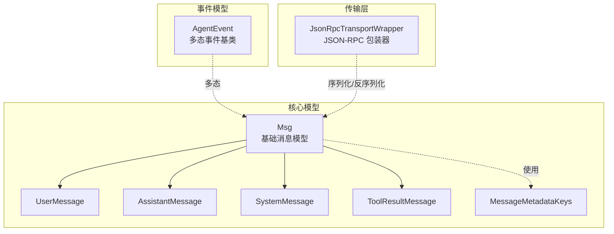
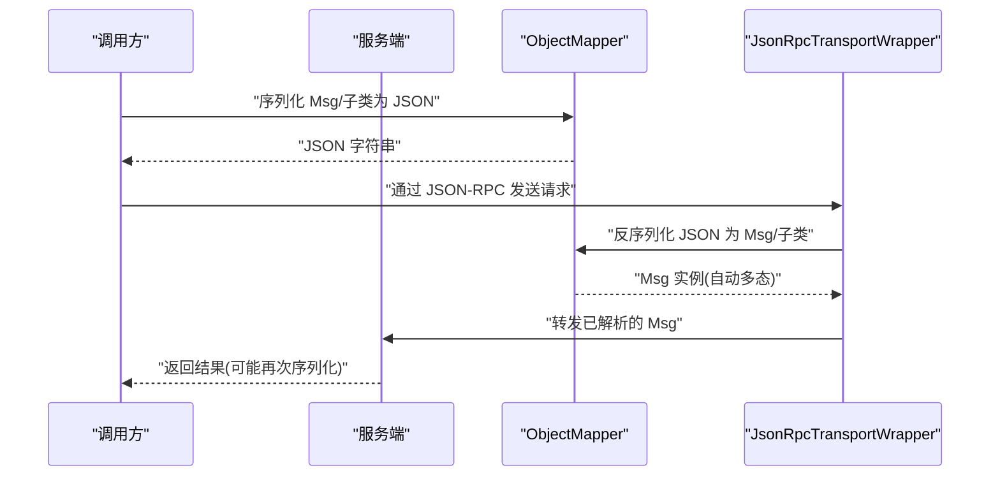
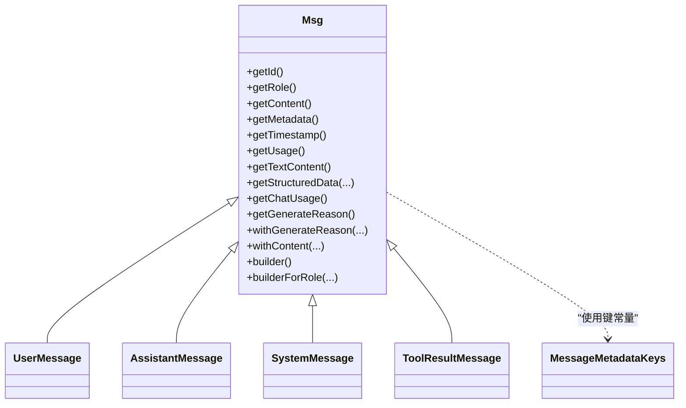
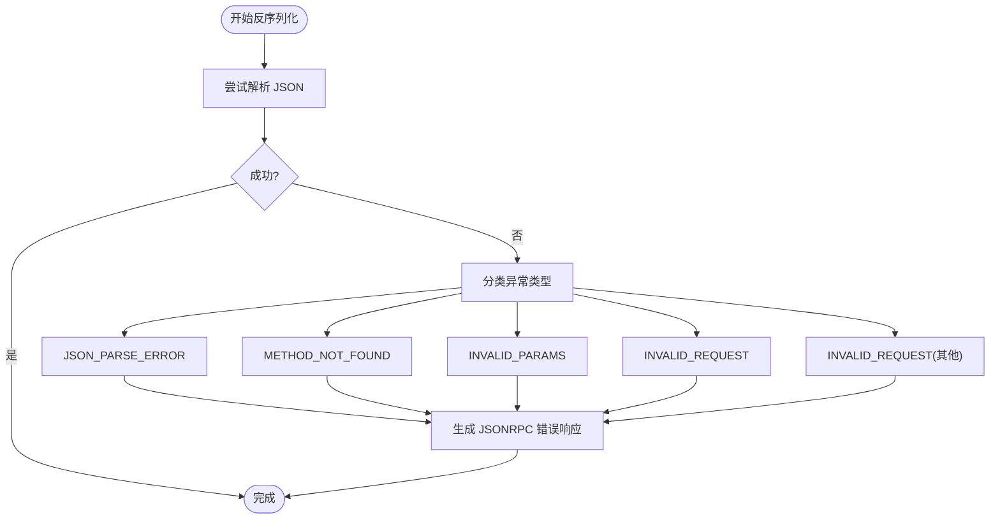
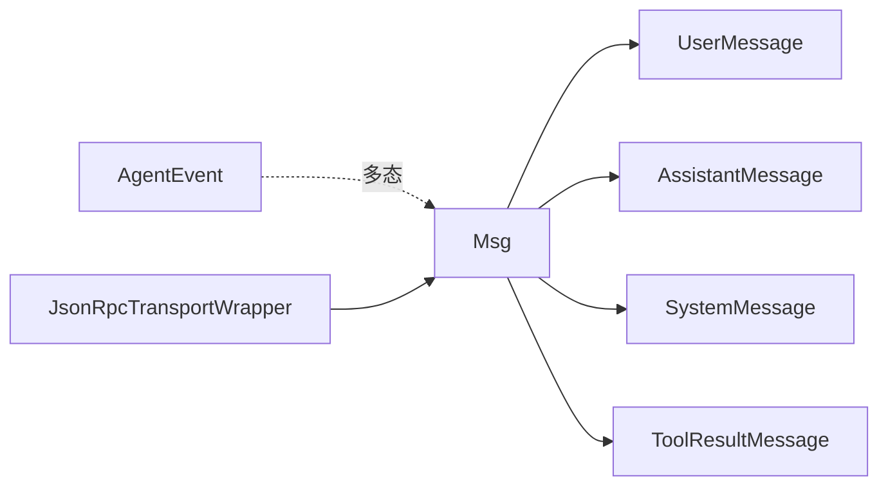

# 消息序列化与传输

<cite>
**本文引用的文件**   
- [Msg.java](file://agentscope-core/src/main/java/io/agentscope/core/message/Msg.java)
- [UserMessage.java](file://agentscope-core/src/main/java/io/agentscope/core/message/UserMessage.java)
- [AssistantMessage.java](file://agentscope-core/src/main/java/io/agentscope/core/message/AssistantMessage.java)
- [SystemMessage.java](file://agentscope-core/src/main/java/io/agentscope/core/message/SystemMessage.java)
- [ToolResultMessage.java](file://agentscope-core/src/main/java/io/agentscope/core/message/ToolResultMessage.java)
- [MessageMetadataKeys.java](file://agentscope-core/src/main/java/io/agentscope/core/message/MessageMetadataKeys.java)
- [AgentEvent.java](file://agentscope-core/src/main/java/io/agentscope/core/event/AgentEvent.java)
- [JsonRpcTransportWrapper.java](file://agentscope-extensions/agentscope-extensions-protocol/agentscope-extensions-a2a/agentscope-extensions-a2a-server/src/main/java/io/agentscope/core/a2a/server/transport/jsonrpc/JsonRpcTransportWrapper.java)
</cite>

## 目录
1. [引言](#引言)
2. [项目结构](#项目结构)
3. [核心组件](#核心组件)
4. [架构总览](#架构总览)
5. [组件详解](#组件详解)
6. [依赖关系分析](#依赖关系分析)
7. [性能考量](#性能考量)
8. [故障排查指南](#故障排查指南)
9. [结论](#结论)
10. [附录：示例与最佳实践](#附录示例与最佳实践)

## 引言
本文件面向“消息序列化与传输系统”，聚焦于基于 Jackson 的 JSON 序列化配置与实现细节，重点解析 Msg 及其子类的消息建模、字段映射规则、多态反序列化策略（@JsonTypeInfo/@JsonSubTypes），以及在分布式场景下的传输与兼容性保障。同时提供性能优化建议、最佳实践与端到端示例路径，帮助读者在跨服务通信中正确地创建、序列化、传输与反序列化消息。

## 项目结构
围绕消息序列化与传输的关键模块位于 agentscope-core 的 message 包与 event 包，并通过协议扩展在 a2a server 中以 JSON-RPC 形式承载消息进行网络传输。

图表来源
- [Msg.java:54-66](file://agentscope-core/src/main/java/io/agentscope/core/message/Msg.java#L54-L66)
- [UserMessage.java:37](file://agentscope-core/src/main/java/io/agentscope/core/message/UserMessage.java#L37)
- [AssistantMessage.java:35](file://agentscope-core/src/main/java/io/agentscope/core/message/AssistantMessage.java#L35)
- [SystemMessage.java:35](file://agentscope-core/src/main/java/io/agentscope/core/message/SystemMessage.java#L35)
- [ToolResultMessage.java:37](file://agentscope-core/src/main/java/io/agentscope/core/message/ToolResultMessage.java#L37)
- [MessageMetadataKeys.java:24](file://agentscope-core/src/main/java/io/agentscope/core/message/MessageMetadataKeys.java#L24)
- [AgentEvent.java:35-71](file://agentscope-core/src/main/java/io/agentscope/core/event/AgentEvent.java#L35-L71)
- [JsonRpcTransportWrapper.java:190-214](file://agentscope-extensions/agentscope-extensions-protocol/agentscope-extensions-a2a/agentscope-extensions-a2a-server/src/main/java/io/agentscope/core/a2a/server/transport/jsonrpc/JsonRpcTransportWrapper.java#L190-L214)

章节来源
- [Msg.java:16-66](file://agentscope-core/src/main/java/io/agentscope/core/message/Msg.java#L16-L66)
- [AgentEvent.java:16-71](file://agentscope-core/src/main/java/io/agentscope/core/event/AgentEvent.java#L16-L71)
- [JsonRpcTransportWrapper.java:190-214](file://agentscope-extensions/agentscope-extensions-protocol/agentscope-extensions-a2a/agentscope-extensions-a2a-server/src/main/java/io/agentscope/core/a2a/server/transport/jsonrpc/JsonRpcTransportWrapper.java#L190-L214)

## 核心组件
- Msg：统一的消息抽象，定义角色、内容块、元数据、时间戳与用量等字段；通过 @JsonTypeInfo 与 @JsonSubTypes 实现按 role 字段的多态序列化/反序列化。
- 子类：UserMessage、AssistantMessage、SystemMessage、ToolResultMessage，分别固定角色并提供便捷构造器与 Builder。
- 元数据键：MessageMetadataKeys 定义标准元数据键，如结构化输出、用量统计、缓存控制等。
- 事件模型：AgentEvent 同样采用 @JsonTypeInfo/@JsonSubTypes 进行多态事件序列化，便于事件流传输。
- 传输包装：JsonRpcTransportWrapper 在 JSON-RPC 层对 Jackson 解析异常进行分类处理，保障错误可诊断与可恢复。

章节来源
- [Msg.java:98-152](file://agentscope-core/src/main/java/io/agentscope/core/message/Msg.java#L98-L152)
- [UserMessage.java:37-83](file://agentscope-core/src/main/java/io/agentscope/core/message/UserMessage.java#L37-L83)
- [AssistantMessage.java:35-81](file://agentscope-core/src/main/java/io/agentscope/core/message/AssistantMessage.java#L35-L81)
- [SystemMessage.java:35-81](file://agentscope-core/src/main/java/io/agentscope/core/message/SystemMessage.java#L35-L81)
- [ToolResultMessage.java:37-86](file://agentscope-core/src/main/java/io/agentscope/core/message/ToolResultMessage.java#L37-L86)
- [MessageMetadataKeys.java:24-134](file://agentscope-core/src/main/java/io/agentscope/core/message/MessageMetadataKeys.java#L24-L134)
- [AgentEvent.java:35-71](file://agentscope-core/src/main/java/io/agentscope/core/event/AgentEvent.java#L35-L71)
- [JsonRpcTransportWrapper.java:190-214](file://agentscope-extensions/agentscope-extensions-protocol/agentscope-extensions-a2a/agentscope-extensions-a2a-server/src/main/java/io/agentscope/core/a2a/server/transport/jsonrpc/JsonRpcTransportWrapper.java#L190-L214)

## 架构总览
消息在系统内的生命周期：构建 → 序列化(JSON) → 网络传输(JSON-RPC) → 反序列化 → 业务处理 → 再序列化/传输。Jackson 的多态配置确保不同角色的消息在序列化时携带类型信息，在反序列化时能准确还原为具体子类。

图表来源
- [Msg.java:54-66](file://agentscope-core/src/main/java/io/agentscope/core/message/Msg.java#L54-L66)
- [JsonRpcTransportWrapper.java:190-214](file://agentscope-extensions/agentscope-extensions-protocol/agentscope-extensions-a2a/agentscope-extensions-a2a-server/src/main/java/io/agentscope/core/a2a/server/transport/jsonrpc/JsonRpcTransportWrapper.java#L190-L214)

## 组件详解

### Msg 类与 Jackson 多态配置
- @JsonIgnoreProperties(ignoreUnknown = true)：忽略未知字段，提升版本演进的容错能力。
- @JsonTypeInfo(use = NAME, include = EXISTING_PROPERTY, property = "role", visible = true, defaultImpl = Msg.class)：
  - 使用名称标识符，将类型信息作为现有属性写入 JSON（property = "role"）。
  - 可见性为 true，使 role 字段既用于多态识别又保留为普通字段。
  - defaultImpl 回退到 Msg，避免缺少类型信息时的失败。
- @JsonSubTypes：声明子类集合与对应名称，实现运行时精确反序列化。
- 字段映射与校验：
  - 角色与内容块组合约束由 validateRoleContent 控制，确保语义正确。
  - Builder 提供链式设置，支持文本快捷入口、内容块列表、元数据、用量与生成原因等。
- 元数据访问：
  - 结构化数据提取、聊天用量转换、生成原因读取等方法均通过 Jackson ObjectMapper 完成转换或类型安全读取。

图表来源
- [Msg.java:67](file://agentscope-core/src/main/java/io/agentscope/core/message/Msg.java#L67)
- [UserMessage.java:37](file://agentscope-core/src/main/java/io/agentscope/core/message/UserMessage.java#L37)
- [AssistantMessage.java:35](file://agentscope-core/src/main/java/io/agentscope/core/message/AssistantMessage.java#L35)
- [SystemMessage.java:35](file://agentscope-core/src/main/java/io/agentscope/core/message/SystemMessage.java#L35)
- [ToolResultMessage.java:37](file://agentscope-core/src/main/java/io/agentscope/core/message/ToolResultMessage.java#L37)
- [MessageMetadataKeys.java:24](file://agentscope-core/src/main/java/io/agentscope/core/message/MessageMetadataKeys.java#L24)

章节来源
- [Msg.java:54-66](file://agentscope-core/src/main/java/io/agentscope/core/message/Msg.java#L54-L66)
- [Msg.java:166-198](file://agentscope-core/src/main/java/io/agentscope/core/message/Msg.java#L166-L198)
- [Msg.java:205-235](file://agentscope-core/src/main/java/io/agentscope/core/message/Msg.java#L205-L235)
- [Msg.java:329-377](file://agentscope-core/src/main/java/io/agentscope/core/message/Msg.java#L329-L377)
- [Msg.java:414-438](file://agentscope-core/src/main/java/io/agentscope/core/message/Msg.java#L414-L438)
- [Msg.java:488-517](file://agentscope-core/src/main/java/io/agentscope/core/message/Msg.java#L488-L517)
- [Msg.java:558-584](file://agentscope-core/src/main/java/io/agentscope/core/message/Msg.java#L558-L584)
- [Msg.java:615-633](file://agentscope-core/src/main/java/io/agentscope/core/message/Msg.java#L615-L633)
- [Msg.java:644-655](file://agentscope-core/src/main/java/io/agentscope/core/message/Msg.java#L644-L655)
- [Msg.java:663-672](file://agentscope-core/src/main/java/io/agentscope/core/message/Msg.java#L663-L672)
- [Msg.java:674-841](file://agentscope-core/src/main/java/io/agentscope/core/message/Msg.java#L674-L841)

### 子类消息与便捷构造
- UserMessage/AssistantMessage/SystemMessage：固定角色，提供字符串/内容块/列表等多种构造方式，简化常用场景。
- ToolResultMessage：专用于工具执行结果，支持累积多个 ToolResultBlock 并在 Builder 中追加/替换。

章节来源
- [UserMessage.java:37-175](file://agentscope-core/src/main/java/io/agentscope/core/message/UserMessage.java#L37-L175)
- [AssistantMessage.java:35-174](file://agentscope-core/src/main/java/io/agentscope/core/message/AssistantMessage.java#L35-L174)
- [SystemMessage.java:35-173](file://agentscope-core/src/main/java/io/agentscope/core/message/SystemMessage.java#L35-L173)
- [ToolResultMessage.java:37-221](file://agentscope-core/src/main/java/io/agentscope/core/message/ToolResultMessage.java#L37-L221)

### 元数据与结构化输出
- MessageMetadataKeys：集中管理标准元数据键，如结构化输出、用量统计、缓存控制等，避免魔法字符串。
- Msg 对结构化数据与用量的读取封装，结合 Jackson ObjectMapper 完成类型转换，便于上层业务直接消费。

章节来源
- [MessageMetadataKeys.java:24-134](file://agentscope-core/src/main/java/io/agentscope/core/message/MessageMetadataKeys.java#L24-L134)
- [Msg.java:414-438](file://agentscope-core/src/main/java/io/agentscope/core/message/Msg.java#L414-L438)
- [Msg.java:488-517](file://agentscope-core/src/main/java/io/agentscope/core/message/Msg.java#L488-L517)
- [Msg.java:558-584](file://agentscope-core/src/main/java/io/agentscope/core/message/Msg.java#L558-L584)

### 事件模型的多态序列化
- AgentEvent 采用 @JsonTypeInfo(Id.NAME, As.PROPERTY, property = "type") 与 @JsonSubTypes 声明事件类型族，确保事件在传输过程中保持类型一致性与可扩展性。

章节来源
- [AgentEvent.java:35-71](file://agentscope-core/src/main/java/io/agentscope/core/event/AgentEvent.java#L35-L71)

### 传输层的错误处理与兼容性
- JsonRpcTransportWrapper 将 Jackson 的 JsonProcessingException 分类为 JSON_PARSE_ERROR、METHOD_NOT_FOUND、INVALID_PARAMS、INVALID_REQUEST 等，便于客户端定位问题并进行重试或降级。

图表来源
- [JsonRpcTransportWrapper.java:190-214](file://agentscope-extensions/agentscope-extensions-protocol/agentscope-extensions-a2a/agentscope-extensions-a2a-server/src/main/java/io/agentscope/core/a2a/server/transport/jsonrpc/JsonRpcTransportWrapper.java#L190-L214)

章节来源
- [JsonRpcTransportWrapper.java:190-214](file://agentscope-extensions/agentscope-extensions-protocol/agentscope-extensions-a2a/agentscope-extensions-a2a-server/src/main/java/io/agentscope/core/a2a/server/transport/jsonrpc/JsonRpcTransportWrapper.java#L190-L214)

## 依赖关系分析
- Msg 与各子类之间为继承关系，通过 Jackson 多态配置实现统一序列化与差异化反序列化。
- AgentEvent 与 Msg 无直接继承关系，但共享多态序列化设计思想，均可在传输层稳定识别与还原。
- JsonRpcTransportWrapper 依赖 Jackson ObjectMapper 进行序列化/反序列化，并对异常进行分类处理，保障传输稳定性。

图表来源
- [Msg.java:67](file://agentscope-core/src/main/java/io/agentscope/core/message/Msg.java#L67)
- [UserMessage.java:37](file://agentscope-core/src/main/java/io/agentscope/core/message/UserMessage.java#L37)
- [AssistantMessage.java:35](file://agentscope-core/src/main/java/io/agentscope/core/message/AssistantMessage.java#L35)
- [SystemMessage.java:35](file://agentscope-core/src/main/java/io/agentscope/core/message/SystemMessage.java#L35)
- [ToolResultMessage.java:37](file://agentscope-core/src/main/java/io/agentscope/core/message/ToolResultMessage.java#L37)
- [AgentEvent.java:35-71](file://agentscope-core/src/main/java/io/agentscope/core/event/AgentEvent.java#L35-L71)
- [JsonRpcTransportWrapper.java:190-214](file://agentscope-extensions/agentscope-extensions-protocol/agentscope-extensions-a2a/agentscope-extensions-a2a-server/src/main/java/io/agentscope/core/a2a/server/transport/jsonrpc/JsonRpcTransportWrapper.java#L190-L214)

章节来源
- [Msg.java:54-66](file://agentscope-core/src/main/java/io/agentscope/core/message/Msg.java#L54-L66)
- [AgentEvent.java:35-71](file://agentscope-core/src/main/java/io/agentscope/core/event/AgentEvent.java#L35-L71)
- [JsonRpcTransportWrapper.java:190-214](file://agentscope-extensions/agentscope-extensions-protocol/agentscope-extensions-a2a/agentscope-extensions-a2a-server/src/main/java/io/agentscope/core/a2a/server/transport/jsonrpc/JsonRpcTransportWrapper.java#L190-L214)

## 性能考量
- 多态字段可见性：role 字段既承担类型识别又作为普通字段输出，可读性好但会增加 JSON 体积。若对体积敏感，可评估移除可见性或改用独立 type 字段并在应用层维护映射。
- Builder 链式构建：优先使用 Builder 设置内容与元数据，减少中间对象创建与拷贝。
- 内容块过滤：Msg 构造时对空值内容块进行过滤，避免无效数据进入序列化流程。
- 元数据转换：结构化数据与用量转换通过 ObjectMapper 执行，建议在高频路径复用 ObjectMapper 实例并避免重复创建。
- 事件与消息分离：事件采用独立多态配置，避免与消息混杂导致的解析复杂度上升。

## 故障排查指南
- JSON 解析失败：检查 JSON 是否包含未知字段或类型不匹配；确认客户端/服务端使用的 Msg 版本一致。
- 方法未找到/参数无效：核对 JSON-RPC 调用名与参数签名是否与服务端期望一致。
- 类型回退异常：当缺少类型信息时默认回退至 Msg，需检查序列化端是否正确输出 role 字段。
- 元数据缺失：结构化输出或用量读取前先判断是否存在相应键，避免抛出非法状态异常。

章节来源
- [JsonRpcTransportWrapper.java:190-214](file://agentscope-extensions/agentscope-extensions-protocol/agentscope-extensions-a2a/agentscope-extensions-a2a-server/src/main/java/io/agentscope/core/a2a/server/transport/jsonrpc/JsonRpcTransportWrapper.java#L190-L214)
- [Msg.java:414-438](file://agentscope-core/src/main/java/io/agentscope/core/message/Msg.java#L414-L438)
- [Msg.java:488-517](file://agentscope-core/src/main/java/io/agentscope/core/message/Msg.java#L488-L517)
- [Msg.java:558-584](file://agentscope-core/src/main/java/io/agentscope/core/message/Msg.java#L558-L584)

## 结论
Msg 及其子类通过 Jackson 的 @JsonTypeInfo/@JsonSubTypes 实现了强健的消息多态序列化，配合 Builder 模式与元数据键常量，使得消息在分布式环境中具备良好的可读性、可扩展性与兼容性。传输层的错误分类与回退策略进一步提升了系统的鲁棒性。遵循本文的最佳实践与性能建议，可在跨服务通信中高效、稳定地完成消息的创建、序列化、传输与反序列化。

## 附录：示例与最佳实践
- 创建消息（文本/内容块/元数据）
  - 使用 Msg.builder() 或 builderForRole(role) 获取角色专用 Builder，设置 content/textContent/metadata/usage/generateReason 后 build。
  - 示例路径参考：[Msg.java:674-841](file://agentscope-core/src/main/java/io/agentscope/core/message/Msg.java#L674-L841)
- 序列化与反序列化
  - 通过 Jackson ObjectMapper 进行 JSON 转换；多态字段 role 自动携带，反序列化时依据 role 精确还原子类。
  - 示例路径参考：[Msg.java:54-66](file://agentscope-core/src/main/java/io/agentscope/core/message/Msg.java#L54-L66)
- 结构化数据与用量
  - 使用 Msg.getStructuredData(...) 与 getChatUsage() 从元数据中提取结构化输出与用量统计。
  - 示例路径参考：[Msg.java:414-438](file://agentscope-core/src/main/java/io/agentscope/core/message/Msg.java#L414-L438)、[Msg.java:488-517](file://agentscope-core/src/main/java/io/agentscope/core/message/Msg.java#L488-L517)、[Msg.java:558-584](file://agentscope-core/src/main/java/io/agentscope/core/message/Msg.java#L558-L584)
- 事件传输
  - AgentEvent 采用独立多态配置，适合事件流传输；注意 type 字段与子类型映射。
  - 示例路径参考：[AgentEvent.java:35-71](file://agentscope-core/src/main/java/io/agentscope/core/event/AgentEvent.java#L35-L71)
- 传输错误处理
  - 在 JSON-RPC 层捕获并分类 Jackson 异常，生成标准化错误响应。
  - 示例路径参考：[JsonRpcTransportWrapper.java:190-214](file://agentscope-extensions/agentscope-extensions-protocol/agentscope-extensions-a2a/agentscope-extensions-a2a-server/src/main/java/io/agentscope/core/a2a/server/transport/jsonrpc/JsonRpcTransportWrapper.java#L190-L214)