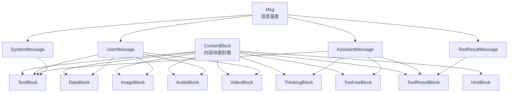
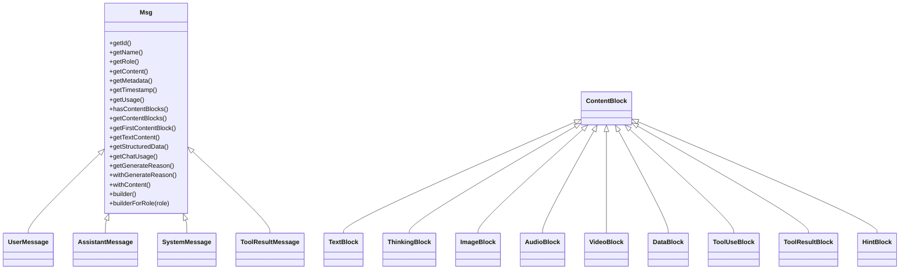
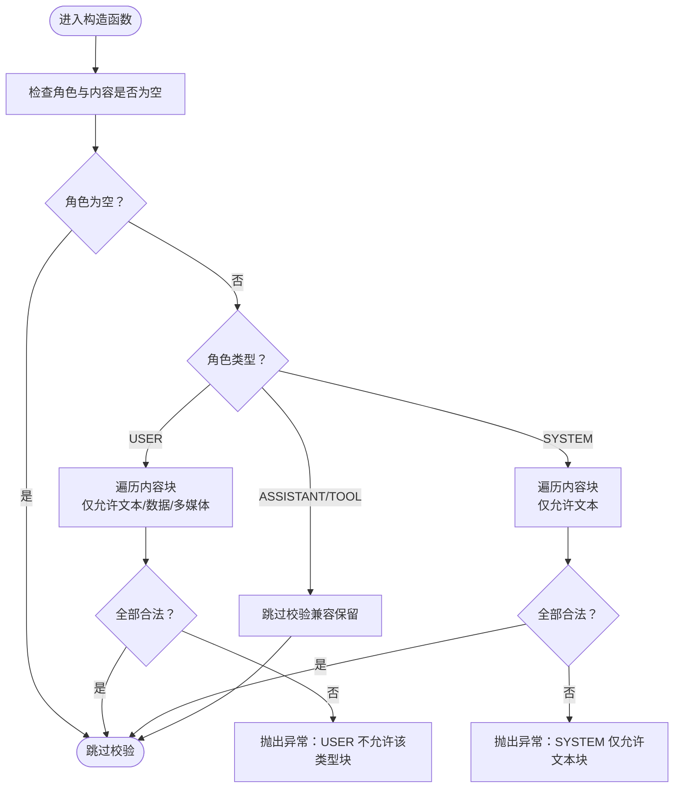
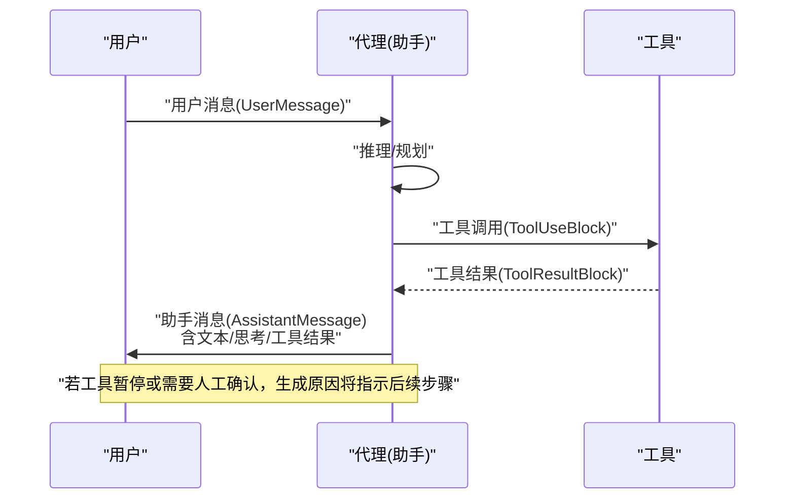
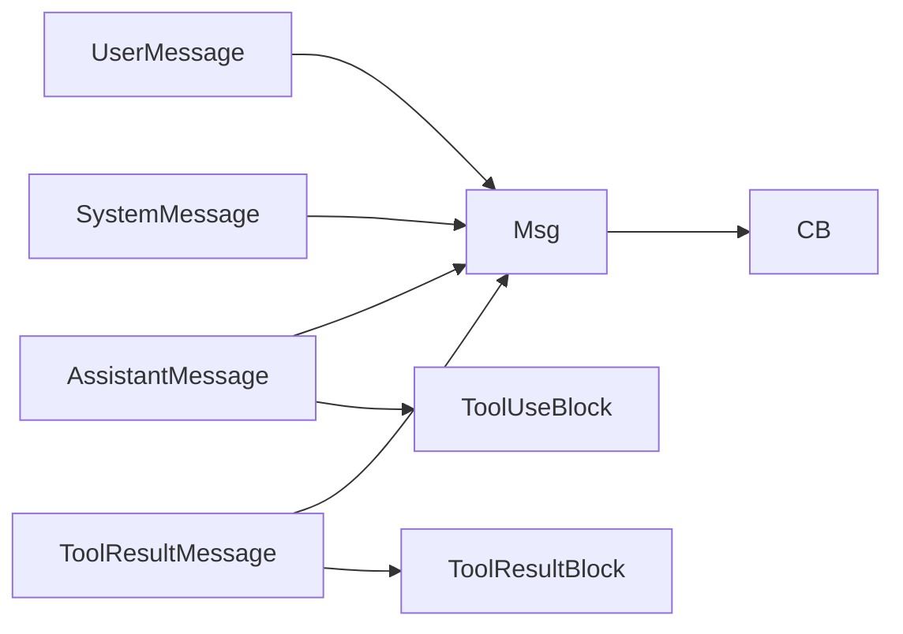

# 消息类型与角色

<cite>
**本文引用的文件**
- [Msg.java](file://agentscope-core/src/main/java/io/agentscope/core/message/Msg.java)
- [MsgRole.java](file://agentscope-core/src/main/java/io/agentscope/core/message/MsgRole.java)
- [UserMessage.java](file://agentscope-core/src/main/java/io/agentscope/core/message/UserMessage.java)
- [AssistantMessage.java](file://agentscope-core/src/main/java/io/agentscope/core/message/AssistantMessage.java)
- [SystemMessage.java](file://agentscope-core/src/main/java/io/agentscope/core/message/SystemMessage.java)
- [ToolResultMessage.java](file://agentscope-core/src/main/java/io/agentscope/core/message/ToolResultMessage.java)
- [ContentBlock.java](file://agentscope-core/src/main/java/io/agentscope/core/message/ContentBlock.java)
- [TextBlock.java](file://agentscope-core/src/main/java/io/agentscope/core/message/TextBlock.java)
- [DataBlock.java](file://agentscope-core/src/main/java/io/agentscope/core/message/DataBlock.java)
- [ImageBlock.java](file://agentscope-core/src/main/java/io/agentscope/core/message/ImageBlock.java)
- [AudioBlock.java](file://agentscope-core/src/main/java/io/agentscope/core/message/AudioBlock.java)
- [VideoBlock.java](file://agentscope-core/src/main/java/io/agentscope/core/message/VideoBlock.java)
- [ThinkingBlock.java](file://agentscope-core/src/main/java/io/agentscope/core/message/ThinkingBlock.java)
- [ToolUseBlock.java](file://agentscope-core/src/main/java/io/agentscope/core/message/ToolUseBlock.java)
- [ToolResultBlock.java](file://agentscope-core/src/main/java/io/agentscope/core/message/ToolResultBlock.java)
- [HintBlock.java](file://agentscope-core/src/main/java/io/agentscope/core/message/HintBlock.java)
- [MessageMetadataKeys.java](file://agentscope-core/src/main/java/io/agentscope/core/message/MessageMetadataKeys.java)
- [GenerateReason.java](file://agentscope-core/src/main/java/io/agentscope/core/message/GenerateReason.java)
</cite>

## 目录
1. [引言](#引言)
2. [项目结构](#项目结构)
3. [核心组件](#核心组件)
4. [架构总览](#架构总览)
5. [详细组件分析](#详细组件分析)
6. [依赖分析](#依赖分析)
7. [性能考虑](#性能考虑)
8. [故障排查指南](#故障排查指南)
9. [结论](#结论)
10. [附录：最佳实践与示例路径](#附录最佳实践与示例路径)

## 引言
本文件面向“消息类型与角色”系统，围绕 Msg 基类及其四种消息角色（USER、ASSISTANT、SYSTEM、TOOL）展开，系统性阐述：
- 角色语义与典型使用场景
- 内容块（ContentBlock）体系与多模态支持
- 构建器模式（Builder）在各消息类型中的实现与差异
- 角色校验机制与内容块限制规则
- 消息创建最佳实践与代理对话流转过程

目标是帮助开发者快速理解并正确使用消息模型，确保在多模态、工具调用与多智能体协作场景中保持一致性与可维护性。

## 项目结构
消息系统位于 agentscope-core 的 io.agentscope.core.message 包内，采用“基类 + 多态子类 + 内容块密封类”的分层设计：
- 基类与角色：Msg、MsgRole
- 具体消息类型：UserMessage、AssistantMessage、SystemMessage、ToolResultMessage
- 内容块：ContentBlock 密封类及其子类（TextBlock、ThinkingBlock、ImageBlock、AudioBlock、VideoBlock、DataBlock、ToolUseBlock、ToolResultBlock、HintBlock）
- 元数据与生成原因：MessageMetadataKeys、GenerateReason

图表来源
- [Msg.java:67-235](file://agentscope-core/src/main/java/io/agentscope/core/message/Msg.java#L67-L235)
- [UserMessage.java:37-83](file://agentscope-core/src/main/java/io/agentscope/core/message/UserMessage.java#L37-L83)
- [AssistantMessage.java:35-81](file://agentscope-core/src/main/java/io/agentscope/core/message/AssistantMessage.java#L35-L81)
- [SystemMessage.java:35-81](file://agentscope-core/src/main/java/io/agentscope/core/message/SystemMessage.java#L35-L81)
- [ToolResultMessage.java:37-86](file://agentscope-core/src/main/java/io/agentscope/core/message/ToolResultMessage.java#L37-L86)
- [ContentBlock.java:58-67](file://agentscope-core/src/main/java/io/agentscope/core/message/ContentBlock.java#L58-L67)

章节来源
- [Msg.java:67-235](file://agentscope-core/src/main/java/io/agentscope/core/message/Msg.java#L67-L235)
- [MsgRole.java:35-67](file://agentscope-core/src/main/java/io/agentscope/core/message/MsgRole.java#L35-L67)

## 核心组件
- Msg 基类
  - 负责统一的消息字段（id、name、role、content、metadata、timestamp、usage），并提供 Builder 工厂方法与角色特定构造器入口
  - 提供内容块类型安全查询、文本拼接、结构化数据提取、聊天用量读取、生成原因管理等能力
  - 在构造阶段执行“角色-内容块”合法性校验
- 四种消息角色
  - USER：用户输入，允许文本、数据块与多媒体块
  - ASSISTANT：助手输出，允许文本、思考块、工具调用块与结果块
  - SYSTEM：系统指令，仅允许文本块
  - TOOL：工具结果，由 ToolResultMessage 承载，内容为一个或多个 ToolResultBlock
- 内容块体系
  - 以 ContentBlock 为密封基类，通过 Jackson 多态序列化标识 type 字段
  - 支持 Text、Thinking、Image、Audio、Video、Data、ToolUse、ToolResult、Hint 等类型
- 元数据与生成原因
  - MessageMetadataKeys 定义标准元数据键，如结构化输出、聊天用量、缓存控制等
  - GenerateReason 描述消息生成的原因，便于上层处理中断、权限确认、工具暂停等场景

章节来源
- [Msg.java:122-198](file://agentscope-core/src/main/java/io/agentscope/core/message/Msg.java#L122-L198)
- [Msg.java:205-235](file://agentscope-core/src/main/java/io/agentscope/core/message/Msg.java#L205-L235)
- [Msg.java:329-377](file://agentscope-core/src/main/java/io/agentscope/core/message/Msg.java#L329-L377)
- [Msg.java:527-584](file://agentscope-core/src/main/java/io/agentscope/core/message/Msg.java#L527-L584)
- [MessageMetadataKeys.java:24-134](file://agentscope-core/src/main/java/io/agentscope/core/message/MessageMetadataKeys.java#L24-L134)
- [GenerateReason.java:36-77](file://agentscope-core/src/main/java/io/agentscope/core/message/GenerateReason.java#L36-L77)

## 架构总览
消息系统通过“角色-内容块”双维度约束实现强一致的对话与工具交互模型。Msg 的校验逻辑确保：
- USER 只能包含文本、数据与多媒体块
- SYSTEM 仅允许文本块
- ASSISTANT/TOOL 对内容块无严格限制（TOOL 保留兼容性）

图表来源
- [Msg.java:67-235](file://agentscope-core/src/main/java/io/agentscope/core/message/Msg.java#L67-L235)
- [UserMessage.java:37-83](file://agentscope-core/src/main/java/io/agentscope/core/message/UserMessage.java#L37-L83)
- [AssistantMessage.java:35-81](file://agentscope-core/src/main/java/io/agentscope/core/message/AssistantMessage.java#L35-L81)
- [SystemMessage.java:35-81](file://agentscope-core/src/main/java/io/agentscope/core/message/SystemMessage.java#L35-L81)
- [ToolResultMessage.java:37-86](file://agentscope-core/src/main/java/io/agentscope/core/message/ToolResultMessage.java#L37-L86)
- [ContentBlock.java:58-67](file://agentscope-core/src/main/java/io/agentscope/core/message/ContentBlock.java#L58-L67)

## 详细组件分析

### 角色与语义
- USER
  - 语义：来自人类用户或外部输入的消息
  - 典型用途：问题、命令、多模态输入（图片、音频、视频）
  - 内容块限制：文本、数据块、图像、音频、视频
- ASSISTANT
  - 语义：AI 助手生成的回复、推理、动作
  - 典型用途：回答、思考过程、工具调用请求
  - 内容块限制：无严格限制（允许文本、思考、工具调用/结果）
- SYSTEM
  - 语义：系统级指令、上下文设定、提示词
  - 典型用途：角色扮演、行为约束、格式要求
  - 内容块限制：仅文本
- TOOL
  - 语义：工具执行结果或响应
  - 典型用途：返回值、错误信息、状态信息
  - 内容块限制：ToolResultBlock 列表（ToolResultMessage 内部强制）

章节来源
- [MsgRole.java:35-67](file://agentscope-core/src/main/java/io/agentscope/core/message/MsgRole.java#L35-L67)
- [Msg.java:166-198](file://agentscope-core/src/main/java/io/agentscope/core/message/Msg.java#L166-L198)

### 构建器模式与类型特定构造器
- 通用构建器
  - Msg.builder() 返回通用 Builder，可设置 id、name、role、content、metadata、timestamp、usage，并最终 build()
  - Msg.builderForRole(role) 根据角色返回对应子类的 Builder（USER→UserMessage.Builder；ASSISTANT→AssistantMessage.Builder；SYSTEM→SystemMessage.Builder；TOOL→ToolResultMessage.Builder）
- 类型特定构造器
  - UserMessage：支持直接传入字符串或 ContentBlock 数组/列表；提供独立 Builder，role 固定为 USER
  - AssistantMessage：支持直接传入字符串或 ContentBlock 数组/列表；提供独立 Builder，role 固定为 ASSISTANT
  - SystemMessage：仅允许文本块；提供独立 Builder，role 固定为 SYSTEM
  - ToolResultMessage：支持单个工具结果字符串（自动包装为 TextBlock 并放入 ToolResultBlock），或 ToolResultBlock 数组/列表；提供独立 Builder，role 固定为 TOOL；支持累积多个结果

章节来源
- [Msg.java:205-235](file://agentscope-core/src/main/java/io/agentscope/core/message/Msg.java#L205-L235)
- [UserMessage.java:89-174](file://agentscope-core/src/main/java/io/agentscope/core/message/UserMessage.java#L89-L174)
- [AssistantMessage.java:87-173](file://agentscope-core/src/main/java/io/agentscope/core/message/AssistantMessage.java#L87-L173)
- [SystemMessage.java:87-172](file://agentscope-core/src/main/java/io/agentscope/core/message/SystemMessage.java#L87-L172)
- [ToolResultMessage.java:92-220](file://agentscope-core/src/main/java/io/agentscope/core/message/ToolResultMessage.java#L92-L220)

### 内容块体系与多模态
- ContentBlock 密封类定义了所有内容块类型，并通过 Jackson 注解进行多态序列化
- TextBlock：最基础文本块
- ThinkingBlock：用于承载推理过程，可携带额外元数据
- ImageBlock/AudioBlock/VideoBlock：多媒体块，支持 URL 或 Base64 源
- DataBlock：统一的数据块容器，替代旧版多媒体块，作为新代码首选
- ToolUseBlock：工具调用请求，包含 id、name、input、content、metadata、state
- ToolResultBlock：工具执行结果，包含 id、name、output、metadata、state；支持 isSuspended 与多种 of(...) 静态工厂
- HintBlock：提示块，用于中间件或记忆系统注入上下文提示

章节来源
- [ContentBlock.java:46-67](file://agentscope-core/src/main/java/io/agentscope/core/message/ContentBlock.java#L46-L67)
- [TextBlock.java:31-95](file://agentscope-core/src/main/java/io/agentscope/core/message/TextBlock.java#L31-L95)
- [ThinkingBlock.java:37-133](file://agentscope-core/src/main/java/io/agentscope/core/message/ThinkingBlock.java#L37-L133)
- [ImageBlock.java:37-163](file://agentscope-core/src/main/java/io/agentscope/core/message/ImageBlock.java#L37-L163)
- [AudioBlock.java:35-96](file://agentscope-core/src/main/java/io/agentscope/core/message/AudioBlock.java#L35-L96)
- [VideoBlock.java:36-239](file://agentscope-core/src/main/java/io/agentscope/core/message/VideoBlock.java#L36-L239)
- [DataBlock.java:35-153](file://agentscope-core/src/main/java/io/agentscope/core/message/DataBlock.java#L35-L153)
- [ToolUseBlock.java:34-286](file://agentscope-core/src/main/java/io/agentscope/core/message/ToolUseBlock.java#L34-L286)
- [ToolResultBlock.java:35-413](file://agentscope-core/src/main/java/io/agentscope/core/message/ToolResultBlock.java#L35-L413)
- [HintBlock.java:28-74](file://agentscope-core/src/main/java/io/agentscope/core/message/HintBlock.java#L28-L74)

### 角色验证机制与内容块限制
- 校验入口：Msg.validateRoleContent(role, content)
- 校验规则：
  - USER：允许 TextBlock、DataBlock、ImageBlock、AudioBlock、VideoBlock
  - SYSTEM：仅允许 TextBlock
  - ASSISTANT/TOOL：无限制（TOOL 为兼容保留）
- 违规将抛出 IllegalArgumentException，明确指出不允许的块类型

图表来源
- [Msg.java:166-198](file://agentscope-core/src/main/java/io/agentscope/core/message/Msg.java#L166-L198)

章节来源
- [Msg.java:166-198](file://agentscope-core/src/main/java/io/agentscope/core/message/Msg.java#L166-L198)

### 生成原因与元数据
- 生成原因（GenerateReason）：描述消息生成的背景，如正常结束、工具暂停、人工介入、最大迭代等
- 元数据键（MessageMetadataKeys）：标准化存储结构化输出、聊天用量、缓存控制等信息
- Msg 提供：
  - withGenerateReason() 生成新消息（不可变）
  - getGenerateReason() 解析生成原因
  - getStructuredData()/getChatUsage() 从元数据中提取结构化数据与用量统计

章节来源
- [GenerateReason.java:36-77](file://agentscope-core/src/main/java/io/agentscope/core/message/GenerateReason.java#L36-L77)
- [MessageMetadataKeys.java:24-134](file://agentscope-core/src/main/java/io/agentscope/core/message/MessageMetadataKeys.java#L24-L134)
- [Msg.java:615-655](file://agentscope-core/src/main/java/io/agentscope/core/message/Msg.java#L615-L655)
- [Msg.java:414-438](file://agentscope-core/src/main/java/io/agentscope/core/message/Msg.java#L414-L438)
- [Msg.java:558-584](file://agentscope-core/src/main/java/io/agentscope/core/message/Msg.java#L558-L584)

### 代理对话中的消息流转（序列图）
以下序列图展示了典型对话流程：用户发送消息 → 助手生成回复（可能包含工具调用）→ 工具执行 → 工具结果回传 → 继续推理/决策。

图表来源
- [UserMessage.java:37-83](file://agentscope-core/src/main/java/io/agentscope/core/message/UserMessage.java#L37-L83)
- [AssistantMessage.java:35-81](file://agentscope-core/src/main/java/io/agentscope/core/message/AssistantMessage.java#L35-L81)
- [ToolUseBlock.java:34-119](file://agentscope-core/src/main/java/io/agentscope/core/message/ToolUseBlock.java#L34-L119)
- [ToolResultBlock.java:35-140](file://agentscope-core/src/main/java/io/agentscope/core/message/ToolResultBlock.java#L35-L140)
- [GenerateReason.java:36-77](file://agentscope-core/src/main/java/io/agentscope/core/message/GenerateReason.java#L36-L77)

## 依赖分析
- 组件耦合
  - Msg 与 ContentBlock：组合关系，Msg 持有不可变内容块列表
  - 各具体消息类型：继承自 Msg，固定角色，复用通用 Builder 与校验
  - ToolResultMessage：内部强制使用 ToolResultBlock，保证工具结果表达的一致性
- 外部依赖
  - Jackson：用于 ContentBlock 与消息的多态序列化/反序列化
  - ChatUsage：记录 token 使用与耗时
- 潜在循环依赖
  - 未发现直接循环依赖；ToolResultBlock 与 ToolUseBlock 通过消息传递形成间接关联

图表来源
- [Msg.java:67-235](file://agentscope-core/src/main/java/io/agentscope/core/message/Msg.java#L67-L235)
- [ToolResultMessage.java:37-86](file://agentscope-core/src/main/java/io/agentscope/core/message/ToolResultMessage.java#L37-L86)
- [AssistantMessage.java:35-81](file://agentscope-core/src/main/java/io/agentscope/core/message/AssistantMessage.java#L35-L81)

章节来源
- [Msg.java:67-235](file://agentscope-core/src/main/java/io/agentscope/core/message/Msg.java#L67-L235)
- [ToolResultMessage.java:37-86](file://agentscope-core/src/main/java/io/agentscope/core/message/ToolResultMessage.java#L37-L86)
- [AssistantMessage.java:35-81](file://agentscope-core/src/main/java/io/agentscope/core/message/AssistantMessage.java#L35-L81)

## 性能考虑
- 不可变性与线程安全
  - Msg.content 与 ToolResultBlock.output 采用不可变列表，避免并发修改风险
- 序列化开销
  - ContentBlock 与消息使用 Jackson 多态序列化，建议在批量传输时合并消息或复用对象池
- 查询效率
  - hasContentBlocks/getContentBlocks/getFirstContentBlock 提供按类型筛选，注意在高频路径中缓存结果
- 结构化数据解析
  - getStructuredData 使用 ObjectMapper 转换，建议对已知结构使用强类型类以减少反射成本

## 故障排查指南
- 角色与内容块不匹配
  - 现象：构造消息时报 IllegalArgumentException
  - 排查：确认 USER 是否混入非文本/数据/多媒体块；SYSTEM 是否包含非文本块
  - 参考：[Msg.java:166-198](file://agentscope-core/src/main/java/io/agentscope/core/message/Msg.java#L166-L198)
- 工具结果未被识别
  - 现象：ToolResultMessage 无法承载结果
  - 排查：确保使用 ToolResultBlock 或 ToolResultMessage 的便捷构造器
  - 参考：[ToolResultMessage.java:37-86](file://agentscope-core/src/main/java/io/agentscope/core/message/ToolResultMessage.java#L37-L86)
- 生成原因导致流程中断
  - 现象：消息生成后需外部执行或人工确认
  - 排查：根据 GenerateReason 分支处理（如 TOOL_SUSPENDED、PERMISSION_ASKING）
  - 参考：[GenerateReason.java:36-77](file://agentscope-core/src/main/java/io/agentscope/core/message/GenerateReason.java#L36-L77)
- 结构化数据解析失败
  - 现象：getStructuredData 抛出异常
  - 排查：确认 metadata 中存在 STRUCTURED_OUTPUT 键且类型匹配
  - 参考：[Msg.java:414-438](file://agentscope-core/src/main/java/io/agentscope/core/message/Msg.java#L414-L438)

章节来源
- [Msg.java:166-198](file://agentscope-core/src/main/java/io/agentscope/core/message/Msg.java#L166-L198)
- [ToolResultMessage.java:37-86](file://agentscope-core/src/main/java/io/agentscope/core/message/ToolResultMessage.java#L37-L86)
- [GenerateReason.java:36-77](file://agentscope-core/src/main/java/io/agentscope/core/message/GenerateReason.java#L36-L77)
- [Msg.java:414-438](file://agentscope-core/src/main/java/io/agentscope/core/message/Msg.java#L414-L438)

## 结论
消息类型与角色系统通过“角色-内容块”双维度约束，提供了清晰、可扩展且强一致的消息模型。借助 Builder 模式与严格的校验机制，开发者可以在多模态、工具调用与多智能体协作场景中高效构建与流转消息。遵循本文最佳实践与排错指引，可显著提升系统的稳定性与可维护性。

## 附录：最佳实践与示例路径
- 创建 USER 消息
  - 直接传入文本：[UserMessage.java:39-51](file://agentscope-core/src/main/java/io/agentscope/core/message/UserMessage.java#L39-L51)
  - 使用 Builder 设置元数据/时间戳/用量：[UserMessage.java:89-174](file://agentscope-core/src/main/java/io/agentscope/core/message/UserMessage.java#L89-L174)
- 创建 ASSISTANT 消息
  - 直接传入文本：[AssistantMessage.java:37-50](file://agentscope-core/src/main/java/io/agentscope/core/message/AssistantMessage.java#L37-L50)
  - 包含思考/工具调用块：[ThinkingBlock.java:37-133](file://agentscope-core/src/main/java/io/agentscope/core/message/ThinkingBlock.java#L37-L133)、[ToolUseBlock.java:34-286](file://agentscope-core/src/main/java/io/agentscope/core/message/ToolUseBlock.java#L34-L286)
- 创建 SYSTEM 消息
  - 仅文本块：[SystemMessage.java:37-50](file://agentscope-core/src/main/java/io/agentscope/core/message/SystemMessage.java#L37-L50)
- 创建 TOOL 结果消息
  - 单结果字符串：[ToolResultMessage.java:39-52](file://agentscope-core/src/main/java/io/agentscope/core/message/ToolResultMessage.java#L39-L52)
  - 多结果累积：[ToolResultMessage.java:105-220](file://agentscope-core/src/main/java/io/agentscope/core/message/ToolResultMessage.java#L105-L220)
- 通用构建器（跨角色）
  - 选择角色专用 Builder 或通用 Builder：[Msg.java:205-235](file://agentscope-core/src/main/java/io/agentscope/core/message/Msg.java#L205-L235)
- 结构化数据与用量
  - 提取结构化输出：[Msg.java:414-438](file://agentscope-core/src/main/java/io/agentscope/core/message/Msg.java#L414-L438)
  - 获取聊天用量：[Msg.java:558-584](file://agentscope-core/src/main/java/io/agentscope/core/message/Msg.java#L558-L584)
- 生成原因处理
  - 设置与读取生成原因：[Msg.java:615-655](file://agentscope-core/src/main/java/io/agentscope/core/message/Msg.java#L615-L655)，[GenerateReason.java:36-77](file://agentscope-core/src/main/java/io/agentscope/core/message/GenerateReason.java#L36-L77)