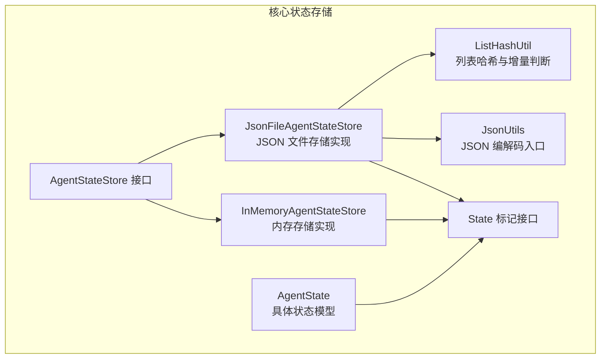
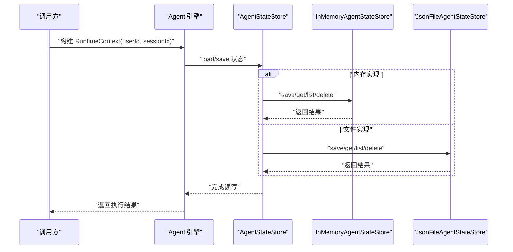
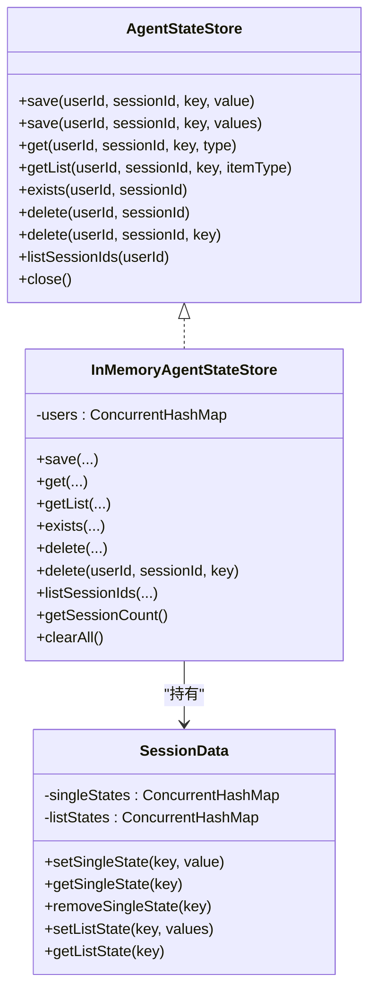
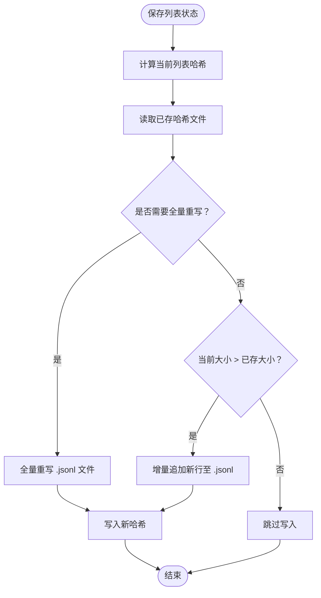
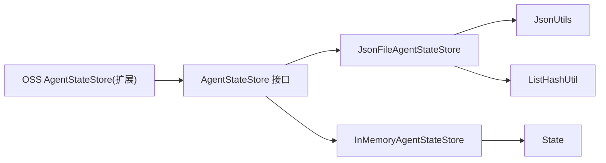

# 状态存储机制

<cite>
**本文引用的文件**
- [AgentStateStore.java](file://agentscope-core/src/main/java/io/agentscope/core/state/AgentStateStore.java)
- [InMemoryAgentStateStore.java](file://agentscope-core/src/main/java/io/agentscope/core/state/InMemoryAgentStateStore.java)
- [JsonFileAgentStateStore.java](file://agentscope-core/src/main/java/io/agentscope/core/state/JsonFileAgentStateStore.java)
- [AgentState.java](file://agentscope-core/src/main/java/io/agentscope/core/state/AgentState.java)
- [State.java](file://agentscope-core/src/main/java/io/agentscope/core/state/State.java)
- [ListHashUtil.java](file://agentscope-core/src/main/java/io/agentscope/core/state/ListHashUtil.java)
- [JsonUtils.java](file://agentscope-core/src/main/java/io/agentscope/core/util/JsonUtils.java)
- [InMemoryAgentStateStoreTest.java](file://agentscope-core/src/test/java/io/agentscope/core/state/InMemoryAgentStateStoreTest.java)
- [OssAgentStateStoreTest.java](file://agentscope-extensions/agentscope-extensions-oss/src/test/java/io/agentscope/extensions/oss/OssAgentStateStoreTest.java)
- [context.md（v2 英文）](file://docs/v2/en/docs/building-blocks/context.md)
- [agent.md（v2 英文）](file://docs/v2/en/docs/building-blocks/agent.md)
- [going-to-production.md（v2 英文）](file://docs/v2/en/docs/others/going-to-production.md)
</cite>

## 目录
1. [简介](#简介)
2. [项目结构](#项目结构)
3. [核心组件](#核心组件)
4. [架构总览](#架构总览)
5. [详细组件分析](#详细组件分析)
6. [依赖分析](#依赖分析)
7. [性能考虑](#性能考虑)
8. [故障排查指南](#故障排查指南)
9. [结论](#结论)
10. [附录：选择与配置示例](#附录选择与配置示例)

## 简介
本文件围绕 AgentScope 的状态存储机制展开，系统性阐述 AgentStateStore 接口的设计理念、内存存储与文件存储两种实现的工作原理、序列化与持久化策略、生命周期与并发安全、异常处理与扩展点，并给出性能优化与故障恢复建议及配置示例。

## 项目结构
状态存储相关的核心代码位于 agentscope-core 模块的 state 包中，配合 util 中的 JsonUtils 提供统一的 JSON 编解码入口；同时，ListHashUtil 为列表状态的增量写入提供哈希校验能力；测试覆盖了 InMemoryAgentStateStore 的行为验证，以及扩展模块对分布式存储的契约验证。

图表来源
- [AgentStateStore.java:61-167](file://agentscope-core/src/main/java/io/agentscope/core/state/AgentStateStore.java#L61-L167)
- [InMemoryAgentStateStore.java:46-195](file://agentscope-core/src/main/java/io/agentscope/core/state/InMemoryAgentStateStore.java#L46-L195)
- [JsonFileAgentStateStore.java:66-397](file://agentscope-core/src/main/java/io/agentscope/core/state/JsonFileAgentStateStore.java#L66-L397)
- [AgentState.java:59-424](file://agentscope-core/src/main/java/io/agentscope/core/state/AgentState.java#L59-L424)
- [State.java:18-31](file://agentscope-core/src/main/java/io/agentscope/core/state/State.java#L18-L31)
- [ListHashUtil.java:48-172](file://agentscope-core/src/main/java/io/agentscope/core/state/ListHashUtil.java#L48-L172)
- [JsonUtils.java:49-153](file://agentscope-core/src/main/java/io/agentscope/core/util/JsonUtils.java#L49-L153)

章节来源
- [AgentStateStore.java:22-60](file://agentscope-core/src/main/java/io/agentscope/core/state/AgentStateStore.java#L22-L60)
- [JsonFileAgentStateStore.java:41-66](file://agentscope-core/src/main/java/io/agentscope/core/state/JsonFileAgentStateStore.java#L41-L66)

## 核心组件
- AgentStateStore 接口：定义按 (userId, sessionId) 命名空间的单值/列表状态的保存、读取、存在性检查、删除、会话枚举等操作契约。
- InMemoryAgentStateStore：基于并发映射的内存实现，适合单进程、无需跨重启持久化的场景。
- JsonFileAgentStateStore：基于文件系统的 JSON 存储，支持原子写入、UTF-8、列表增量追加与全量重写策略。
- AgentState：具体的状态模型，承载会话上下文、摘要、权限/工具/任务/计划模式等子上下文。
- State：所有可持久化状态对象的标记接口。
- ListHashUtil：为列表状态提供采样哈希，判定是否需要全量重写或增量追加。
- JsonUtils：全局 JSON 编解码入口，支持替换实现。

章节来源
- [AgentStateStore.java:61-167](file://agentscope-core/src/main/java/io/agentscope/core/state/AgentStateStore.java#L61-L167)
- [InMemoryAgentStateStore.java:26-46](file://agentscope-core/src/main/java/io/agentscope/core/state/InMemoryAgentStateStore.java#L26-L46)
- [JsonFileAgentStateStore.java:41-66](file://agentscope-core/src/main/java/io/agentscope/core/state/JsonFileAgentStore.java#L41-L66)
- [AgentState.java:31-59](file://agentscope-core/src/main/java/io/agentscope/core/state/AgentState.java#L31-L59)
- [State.java:18-31](file://agentscope-core/src/main/java/io/agentscope/core/state/State.java#L18-L31)
- [ListHashUtil.java:20-47](file://agentscope-core/src/main/java/io/agentscope/core/state/ListHashUtil.java#L20-L47)
- [JsonUtils.java:24-48](file://agentscope-core/src/main/java/io/agentscope/core/util/JsonUtils.java#L24-L48)

## 架构总览
下图展示了状态存储的整体交互：上层 Agent 通过 RuntimeContext 指定 (userId, sessionId)，调用 AgentStateStore 完成状态的加载/保存；内存与文件实现分别满足不同部署形态的需求。

图表来源
- [AgentStateStore.java:63-157](file://agentscope-core/src/main/java/io/agentscope/core/state/AgentStateStore.java#L63-L157)
- [InMemoryAgentStateStore.java:54-132](file://agentscope-core/src/main/java/io/agentscope/core/state/InMemoryAgentStateStore.java#L54-L132)
- [JsonFileAgentStateStore.java:98-241](file://agentscope-core/src/main/java/io/agentscope/core/state/JsonFileAgentStateStore.java#L98-L241)

## 详细组件分析

### AgentStateStore 接口设计
- 设计要点
  - 以 (userId, sessionId) 作为命名空间键，支持匿名用户（userId 为空）与多租户隔离。
  - 支持单值与列表两类状态写入：列表写入策略由实现决定（内存为全替换，文件为增量/全量）。
  - 提供 exists、delete、listSessionIds 等运维常用能力；默认 close 无操作，便于实现资源清理。
- 使用建议
  - 调用方应始终传递完整的列表内容，由实现决定存储策略。
  - userId 为空表示匿名会话，实现会将其归入特定命名空间，避免与空字符串用户冲突。

章节来源
- [AgentStateStore.java:22-60](file://agentscope-core/src/main/java/io/agentscope/core/state/AgentStateStore.java#L22-L60)
- [AgentStateStore.java:75-92](file://agentscope-core/src/main/java/io/agentscope/core/state/AgentStateStore.java#L75-L92)
- [AgentStateStore.java:128-157](file://agentscope-core/src/main/java/io/agentscope/core/state/AgentStateStore.java#L128-L157)

### 内存存储 InMemoryAgentStateStore
- 实现原理
  - 采用三层嵌套并发映射：users → (userId 映射到) → sessions → SessionData。
  - SessionData 内部维护两个并发 Map：单值状态与列表状态，均以 key 为索引。
  - userId 为空时映射到固定匿名桶，避免与真实空串用户冲突。
- 并发安全
  - 所有容器均为线程安全的并发集合，读写路径通过 computeIfAbsent 保证幂等创建。
- 性能特点
  - 读写均为内存操作，延迟低；但进程退出即丢失，不适用于分布式或多副本场景。
  - 列表状态采用复制列表以避免外部修改影响存储一致性。
- 适用场景
  - 单进程应用、单元测试、快速原型与演示。

图表来源
- [AgentStateStore.java:61-167](file://agentscope-core/src/main/java/io/agentscope/core/state/AgentStateStore.java#L61-L167)
- [InMemoryAgentStateStore.java:46-195](file://agentscope-core/src/main/java/io/agentscope/core/state/InMemoryAgentStateStore.java#L46-L195)

章节来源
- [InMemoryAgentStateStore.java:26-46](file://agentscope-core/src/main/java/io/agentscope/core/state/InMemoryAgentStateStore.java#L26-L46)
- [InMemoryAgentStateStore.java:144-167](file://agentscope-core/src/main/java/io/agentscope/core/state/InMemoryAgentStateStore.java#L144-L167)
- [InMemoryAgentStateStoreTest.java:40-218](file://agentscope-core/src/test/java/io/agentscope/core/state/InMemoryAgentStateStoreTest.java#L40-L218)

### 文件存储 JsonFileAgentStateStore
- 序列化机制
  - 使用 JsonUtils 获取全局 JSON 编解码器进行序列化/反序列化，统一编码为 UTF-8。
- 持久化策略
  - 单值状态：每个 key 对应一个 .json 文件，采用原子写入（先写临时文件再原子移动）。
  - 列表状态：每个 key 对应一个 .jsonl 文件（每行一条 JSON），配合 .hash 文件记录采样哈希。
  - 增量/全量策略：通过 ListHashUtil 计算当前列表的采样哈希，若与已存哈希一致且仅增长，则追加新行；否则全量重写。
- 数据格式与布局
  - 目录布局：根目录下按用户分桶（匿名用户使用固定桶名），再按会话目录组织，文件名为 key + 后缀。
  - 文件名安全：仅允许字母数字、下划线、连字符、点号；否则进行 URL 安全 Base64 编码。
- 生命周期管理
  - 初始化：确保根目录存在；失败抛出运行时异常。
  - 删除：支持整会话删除与单键删除；目录删除采用逆序遍历逐级删除。
  - 清理：提供异步批量清理会话的能力（使用 bounded elastic scheduler）。
- 并发安全与异常处理
  - 原子写入避免部分写入；读取时捕获 IO 异常并包装为运行时异常，便于上层统一处理。
  - 文件名安全转换防止非法字符导致的路径问题。

图表来源
- [JsonFileAgentStateStore.java:110-133](file://agentscope-core/src/main/java/io/agentscope/core/state/JsonFileAgentStateStore.java#L110-L133)
- [ListHashUtil.java:147-170](file://agentscope-core/src/main/java/io/agentscope/core/state/ListHashUtil.java#L147-L170)

章节来源
- [JsonFileAgentStateStore.java:41-66](file://agentscope-core/src/main/java/io/agentscope/core/state/JsonFileAgentStateStore.java#L41-L66)
- [JsonFileAgentStateStore.java:98-241](file://agentscope-core/src/main/java/io/agentscope/core/state/JsonFileAgentStateStore.java#L98-L241)
- [JsonFileAgentStateStore.java:251-280](file://agentscope-core/src/main/java/io/agentscope/core/state/JsonFileAgentStateStore.java#L251-L280)
- [ListHashUtil.java:20-47](file://agentscope-core/src/main/java/io/agentscope/core/state/ListHashUtil.java#L20-L47)

### AgentState 状态模型
- 字段与职责
  - 会话与用户标识：sessionId、userId。
  - 上下文与摘要：context（消息列表）、summary（可选压缩摘要）。
  - 运行控制：replyId、curIter（当前推理迭代）、shutdownInterrupted（关闭中断标志）。
  - 子上下文：权限、工具、任务、计划模式等。
  - 运行时中断信号：interruptControl（非序列化，按需懒创建）。
- 序列化
  - 提供 toJson/fromJsonString 便捷方法，底层依赖 JsonUtils。
- 可变性与可见性
  - context 提供不可变视图与可变视图，便于中间件与工具就地修改。

章节来源
- [AgentState.java:31-59](file://agentscope-core/src/main/java/io/agentscope/core/state/AgentState.java#L31-L59)
- [AgentState.java:273-288](file://agentscope-core/src/main/java/io/agentscope/core/state/AgentState.java#L273-L288)

### State 标记接口与 JsonUtils
- State：所有可持久化状态对象的标记接口，推荐使用不可变记录类型。
- JsonUtils：集中式 JSON 编解码入口，默认使用 Jackson 实现，支持替换与重置，便于测试与兼容其他库。

章节来源
- [State.java:18-31](file://agentscope-core/src/main/java/io/agentscope/core/state/State.java#L18-L31)
- [JsonUtils.java:24-48](file://agentscope-core/src/main/java/io/agentscope/core/util/JsonUtils.java#L24-L48)
- [JsonUtils.java:64-91](file://agentscope-core/src/main/java/io/agentscope/core/util/JsonUtils.java#L64-L91)

## 依赖分析
- 组件耦合
  - JsonFileAgentStateStore 依赖 JsonUtils 与 ListHashUtil；InMemoryAgentStateStore 仅依赖并发容器与 State 接口。
- 外部集成
  - 扩展模块（如 OSS）通过实现 AgentStateStore 接口接入，遵循相同的键空间与文件布局约定（例如 OSS 的 key 前缀）。

图表来源
- [JsonFileAgentStateStore.java:18-39](file://agentscope-core/src/main/java/io/agentscope/core/state/JsonFileAgentStateStore.java#L18-L39)
- [JsonUtils.java:49-153](file://agentscope-core/src/main/java/io/agentscope/core/util/JsonUtils.java#L49-L153)
- [ListHashUtil.java:48-172](file://agentscope-core/src/main/java/io/agentscope/core/state/ListHashUtil.java#L48-L172)
- [OssAgentStateStoreTest.java:43-159](file://agentscope-extensions/agentscope-extensions-oss/src/test/java/io/agentscope/extensions/oss/OssAgentStateStoreTest.java#L43-L159)

章节来源
- [OssAgentStateStoreTest.java:43-159](file://agentscope-extensions/agentscope-extensions-oss/src/test/java/io/agentscope/extensions/oss/OssAgentStateStoreTest.java#L43-L159)

## 性能考虑
- 内存存储
  - 优势：极低延迟、高吞吐；适合短生命周期、单进程场景。
  - 局限：无法跨进程/节点共享，重启即丢。
- 文件存储
  - 优势：持久化、易审计；默认增量写入减少磁盘 IO。
  - 局限：随机访问与大列表全量重写可能带来额外开销。
- 列表写入优化
  - 通过采样哈希快速判断是否需要全量重写，避免不必要的 truncate+write。
  - 增量追加仅在列表长度增长且前缀未变化时生效。
- 并发与线程安全
  - 内存实现使用并发容器；文件实现采用原子写入与顺序删除，降低竞态风险。
- I/O 与序列化
  - 统一 UTF-8 编码与预格式化 JSON 输出，减少解析错误与体积波动。

## 故障排查指南
- 常见问题
  - 保存失败：检查根目录可写、磁盘配额、文件句柄限制；确认 sessionId 非空且非空白。
  - 加载为空：确认目标文件是否存在；检查 JSON 是否被截断或被其他进程覆盖。
  - 列表未增长：确认传入的是“完整列表”，实现仅接受全量列表并自行判断增量。
  - 权限/路径问题：文件名安全转换失败时，检查特殊字符与路径长度限制。
- 定位手段
  - 查看异常栈中的“Failed to save/load”提示定位具体键与文件。
  - 使用 listSessionIds 验证命名空间内会话是否正确创建。
  - 对于 OSS 等扩展实现，核对 key 前缀与桶权限。
- 修复建议
  - 临时切换到内存存储验证业务逻辑，排除存储层干扰。
  - 对于文件存储，必要时执行全量重写（由实现自动触发）或手动清理损坏的 .hash 文件。

章节来源
- [JsonFileAgentStateStore.java:103-107](file://agentscope-core/src/main/java/io/agentscope/core/state/JsonFileAgentStateStore.java#L103-L107)
- [JsonFileAgentStateStore.java:174-178](file://agentscope-core/src/main/java/io/agentscope/core/state/JsonFileAgentStateStore.java#L174-L178)
- [JsonFileAgentStateStore.java:210-215](file://agentscope-core/src/main/java/io/agentscope/core/state/JsonFileAgentStateStore.java#L210-L215)
- [OssAgentStateStoreTest.java:74-113](file://agentscope-extensions/agentscope-extensions-oss/src/test/java/io/agentscope/extensions/oss/OssAgentStateStoreTest.java#L74-L113)

## 结论
AgentStateStore 通过清晰的键空间与统一的读写契约，将 Agent 的运行状态持久化抽象为可插拔的存储层。内存实现适合快速开发与测试，文件实现兼顾持久化与性能；通过采样哈希与原子写入，文件存储在大列表场景下也能保持高效与可靠。扩展模块进一步证明了该接口的通用性与可演进性。

## 附录：选择与配置示例
- 单机开发/演示
  - 使用 JsonFileAgentStateStore，默认根目录位于用户主目录下的隐藏目录，按 (userId, sessionId) 自动组织文件。
  - 示例参考：在构建代理时设置 stateStore 参数，随后通过 RuntimeContext 指定会话与用户标识。
- 生产多副本
  - 使用分布式存储（如 Redis/Mysql 扩展），或通过分布式封装（DistributedStore）实现跨节点共享。
- 测试与调试
  - 使用 InMemoryAgentStateStore 简化测试环境，快速验证业务流程。
- 关键参数与注意事项
  - sessionId 必须非空且非空白；userId 为空表示匿名会话。
  - 列表写入必须提供完整列表，实现负责增量/全量策略。
  - 如需自定义 JSON 编解码器，可通过 JsonUtils.setJsonCodec 替换实现。

章节来源
- [agent.md（v2 英文）:444-493](file://docs/v2/en/docs/building-blocks/agent.md#L444-L493)
- [context.md（v2 英文）:147-185](file://docs/v2/en/docs/building-blocks/context.md#L147-L185)
- [going-to-production.md（v2 英文）:62-77](file://docs/v2/en/docs/others/going-to-production.md#L62-L77)