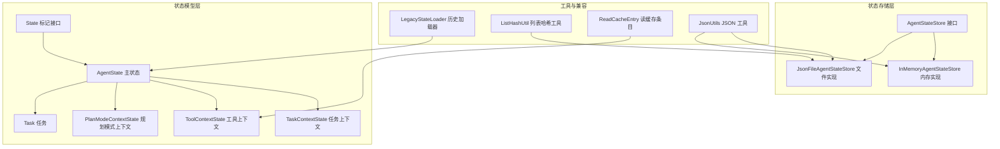
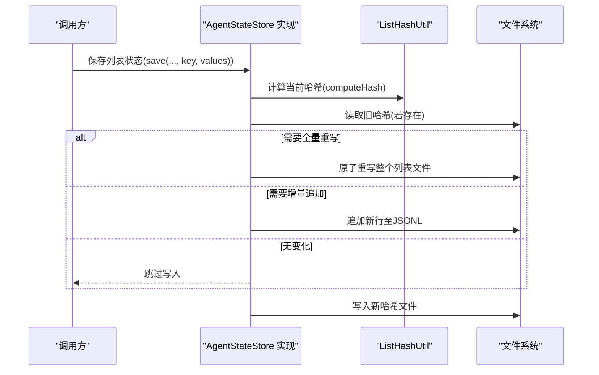
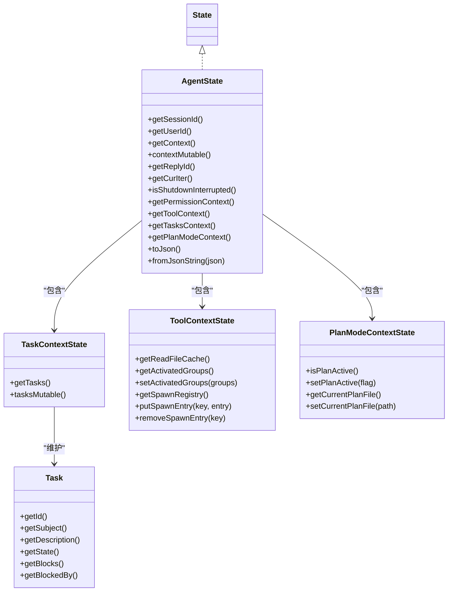
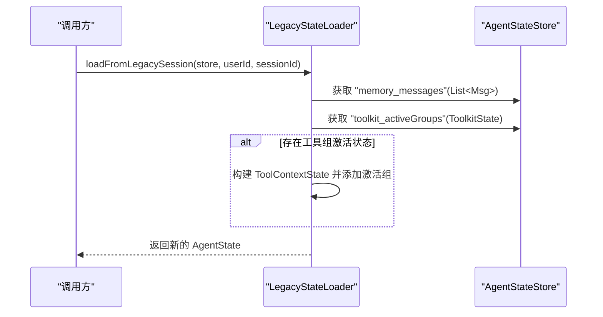
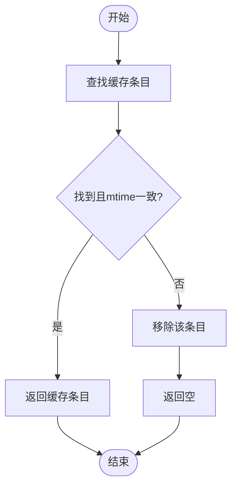
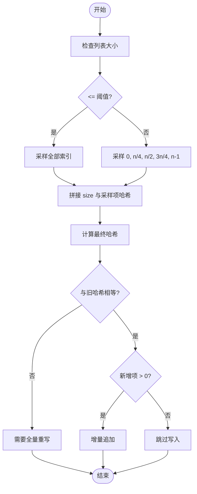
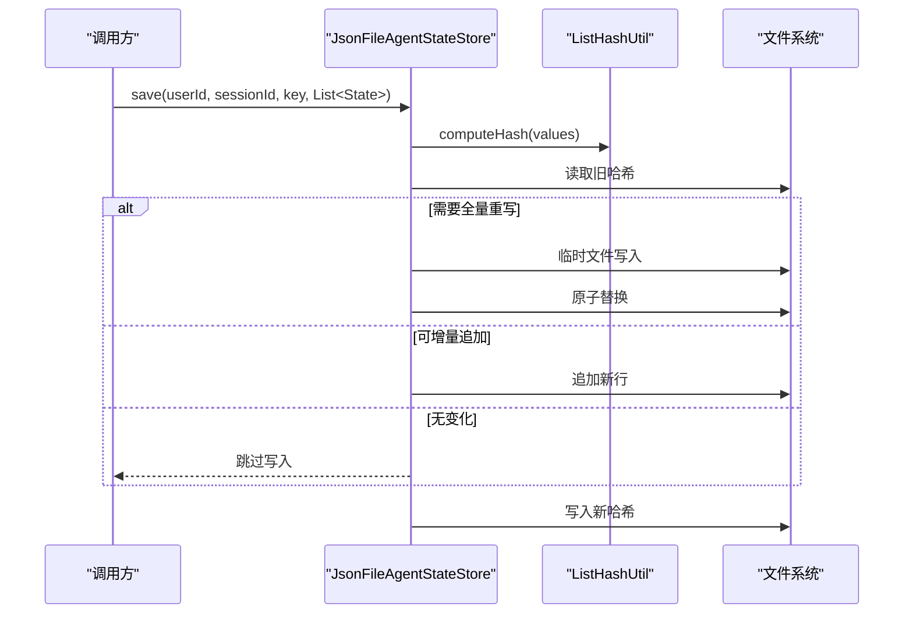
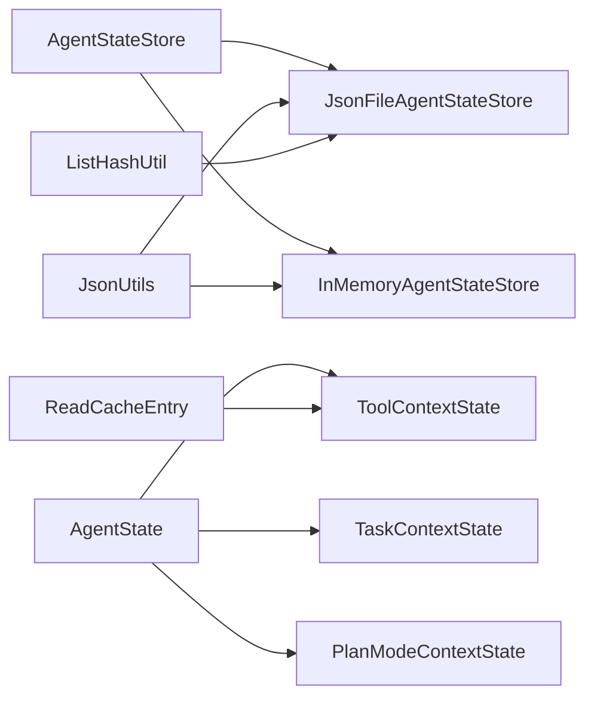

# 状态生命周期管理

<cite>
**本文引用的文件**
- [LegacyStateLoader.java](file://agentscope-core/src/main/java/io/agentscope/core/state/LegacyStateLoader.java)
- [ReadCacheEntry.java](file://agentscope-core/src/main/java/io/agentscope/core/state/ReadCacheEntry.java)
- [ListHashUtil.java](file://agentscope-core/src/main/java/io/agentscope/core/state/ListHashUtil.java)
- [AgentStateStore.java](file://agentscope-core/src/main/java/io/agentscope/core/state/AgentStateStore.java)
- [InMemoryAgentStateStore.java](file://agentscope-core/src/main/java/io/agentscope/core/state/InMemoryAgentStateStore.java)
- [JsonFileAgentStateStore.java](file://agentscope-core/src/main/java/io/agentscope/core/state/JsonFileAgentStateStore.java)
- [AgentState.java](file://agentscope-core/src/main/java/io/agentscope/core/state/AgentState.java)
- [State.java](file://agentscope-core/src/main/java/io/agentscope/core/state/State.java)
- [Task.java](file://agentscope-core/src/main/java/io/agentscope/core/state/Task.java)
- [TaskContextState.java](file://agentscope-core/src/main/java/io/agentscope/core/state/TaskContextState.java)
- [ToolContextState.java](file://agentscope-core/src/main/java/io/agentscope/core/state/ToolContextState.java)
- [PlanModeContextState.java](file://agentscope-core/src/main/java/io/agentscope/core/state/PlanModeContextState.java)
- [JsonUtils.java](file://agentscope-core/src/main/java/io/agentscope/core/util/JsonUtils.java)
</cite>

## 目录
1. [引言](#引言)
2. [项目结构](#项目结构)
3. [核心组件](#核心组件)
4. [架构总览](#架构总览)
5. [详细组件分析](#详细组件分析)
6. [依赖分析](#依赖分析)
7. [性能考虑](#性能考虑)
8. [故障排查指南](#故障排查指南)
9. [结论](#结论)
10. [附录：最佳实践与优化建议](#附录最佳实践与优化建议)

## 引言
本技术文档围绕状态生命周期管理进行系统化梳理，覆盖状态的创建、初始化、更新、持久化与销毁的完整流程；详解历史兼容加载器（LegacyStateLoader）的迁移策略；剖析状态缓存（ReadCacheEntry）的性能优化与缓存策略；阐明状态哈希计算（ListHashUtil）在列表变更检测中的作用；说明自动保存的触发条件、保存时机与策略；并提供监控、调试、异常处理与数据一致性保障方法。

## 项目结构
状态相关代码主要位于 agentscope-core 模块的 state 包中，并辅以工具类 JsonUtils 提供统一的 JSON 序列化能力。核心文件包括：
- 存储接口与实现：AgentStateStore、InMemoryAgentStateStore、JsonFileAgentStateStore
- 状态模型：State 接口、AgentState、Task、TaskContextState、ToolContextState、PlanModeContextState
- 兼容与工具：LegacyStateLoader、ListHashUtil、ReadCacheEntry
- 序列化工具：JsonUtils

图表来源
- [AgentStateStore.java:61-167](file://agentscope-core/src/main/java/io/agentscope/core/state/AgentStateStore.java#L61-L167)
- [InMemoryAgentStateStore.java:46-195](file://agentscope-core/src/main/java/io/agentscope/core/state/InMemoryAgentStateStore.java#L46-L195)
- [JsonFileAgentStateStore.java:66-397](file://agentscope-core/src/main/java/io/agentscope/core/state/JsonFileAgentStateStore.java#L66-L397)
- [AgentState.java:59-424](file://agentscope-core/src/main/java/io/agentscope/core/state/AgentState.java#L59-L424)
- [Task.java:41-283](file://agentscope-core/src/main/java/io/agentscope/core/state/Task.java#L41-L283)
- [TaskContextState.java:30-75](file://agentscope-core/src/main/java/io/agentscope/core/state/TaskContextState.java#L30-L75)
- [ToolContextState.java:49-293](file://agentscope-core/src/main/java/io/agentscope/core/state/ToolContextState.java#L49-L293)
- [PlanModeContextState.java:37-98](file://agentscope-core/src/main/java/io/agentscope/core/state/PlanModeContextState.java#L37-L98)
- [LegacyStateLoader.java:30-68](file://agentscope-core/src/main/java/io/agentscope/core/state/LegacyStateLoader.java#L30-L68)
- [ListHashUtil.java:48-172](file://agentscope-core/src/main/java/io/agentscope/core/state/ListHashUtil.java#L48-L172)
- [ReadCacheEntry.java:31-44](file://agentscope-core/src/main/java/io/agentscope/core/state/ReadCacheEntry.java#L31-L44)
- [JsonUtils.java:49-153](file://agentscope-core/src/main/java/io/agentscope/core/util/JsonUtils.java#L49-L153)

章节来源
- [AgentStateStore.java:22-60](file://agentscope-core/src/main/java/io/agentscope/core/state/AgentStateStore.java#L22-L60)
- [JsonFileAgentStateStore.java:41-66](file://agentscope-core/src/main/java/io/agentscope/core/state/JsonFileAgentStateStore.java#L41-L66)

## 核心组件
- 状态标记接口：State，用于标识可持久化的状态对象。
- 主状态 AgentState：承载会话标识、用户标识、对话上下文、回复标识、当前推理迭代、中断标记、权限/工具/任务/规划模式等子上下文。
- 上下文容器：
  - TaskContextState：任务集合的可变容器。
  - ToolContextState：工具组激活、文件读缓存、子代理派生注册等。
  - PlanModeContextState：规划模式开关与当前规划文件路径。
- 存储接口与实现：
  - AgentStateStore：定义保存/加载/删除/列举会话的能力。
  - InMemoryAgentStateStore：内存实现，适合单进程、无需跨重启持久化的场景。
  - JsonFileAgentStateStore：基于 JSON 的文件实现，支持原子写入、增量追加、哈希校验。
- 兼容与工具：
  - LegacyStateLoader：从 v1 会话键加载到 v2 AgentState。
  - ListHashUtil：列表哈希计算与变更检测。
  - ReadCacheEntry：文件读缓存快照条目。
  - JsonUtils：全局 JSON 编解码器访问入口。

章节来源
- [State.java:18-31](file://agentscope-core/src/main/java/io/agentscope/core/state/State.java#L18-L31)
- [AgentState.java:31-72](file://agentscope-core/src/main/java/io/agentscope/core/state/AgentState.java#L31-L72)
- [TaskContextState.java:24-30](file://agentscope-core/src/main/java/io/agentscope/core/state/TaskContextState.java#L24-L30)
- [ToolContextState.java:36-49](file://agentscope-core/src/main/java/io/agentscope/core/state/ToolContextState.java#L36-L49)
- [PlanModeContextState.java:23-36](file://agentscope-core/src/main/java/io/agentscope/core/state/PlanModeContextState.java#L23-L36)
- [AgentStateStore.java:22-60](file://agentscope-core/src/main/java/io/agentscope/core/state/AgentStateStore.java#L22-L60)
- [InMemoryAgentStateStore.java:26-45](file://agentscope-core/src/main/java/io/agentscope/core/state/InMemoryAgentStateStore.java#L26-L45)
- [JsonFileAgentStateStore.java:41-66](file://agentscope-core/src/main/java/io/agentscope/core/state/JsonFileAgentStateStore.java#L41-L66)
- [LegacyStateLoader.java:22-30](file://agentscope-core/src/main/java/io/agentscope/core/state/LegacyStateLoader.java#L22-L30)
- [ListHashUtil.java:20-47](file://agentscope-core/src/main/java/io/agentscope/core/state/ListHashUtil.java#L20-L47)
- [ReadCacheEntry.java:23-31](file://agentscope-core/src/main/java/io/agentscope/core/state/ReadCacheEntry.java#L23-L31)
- [JsonUtils.java:24-48](file://agentscope-core/src/main/java/io/agentscope/core/util/JsonUtils.java#L24-L48)

## 架构总览
状态生命周期由“调用方”驱动，通过 AgentStateStore 将 AgentState 及其子上下文持久化到内存或文件系统。文件实现采用 JSON Lines 存储列表，配合哈希文件实现增量追加与全量重写的选择。

图表来源
- [JsonFileAgentStateStore.java:110-133](file://agentscope-core/src/main/java/io/agentscope/core/state/JsonFileAgentStateStore.java#L110-L133)
- [ListHashUtil.java:76-95](file://agentscope-core/src/main/java/io/agentscope/core/state/ListHashUtil.java#L76-L95)

## 详细组件分析

### 组件一：状态创建与初始化（AgentState）
- 创建方式：通过 Builder 模式构建，支持设置会话/用户标识、摘要、上下文、回复标识、当前迭代、中断标记、权限/工具/任务/规划模式上下文。
- 默认行为：未显式提供的字段使用默认值；匿名用户使用特定命名空间；回复标识与会话标识在缺失时自动生成。
- 可变与不可变：上下文列表提供“防御性拷贝”的只读视图与“就地可变”的句柄，便于不同组件按需使用。
- 序列化：提供 JSON 序列化与反序列化便捷方法，便于外部存储。

图表来源
- [AgentState.java:59-103](file://agentscope-core/src/main/java/io/agentscope/core/state/AgentState.java#L59-L103)
- [TaskContextState.java:30-52](file://agentscope-core/src/main/java/io/agentscope/core/state/TaskContextState.java#L30-L52)
- [ToolContextState.java:49-151](file://agentscope-core/src/main/java/io/agentscope/core/state/ToolContextState.java#L49-L151)
- [PlanModeContextState.java:37-70](file://agentscope-core/src/main/java/io/agentscope/core/state/PlanModeContextState.java#L37-L70)
- [Task.java:41-98](file://agentscope-core/src/main/java/io/agentscope/core/state/Task.java#L41-L98)

章节来源
- [AgentState.java:81-103](file://agentscope-core/src/main/java/io/agentscope/core/state/AgentState.java#L81-L103)
- [AgentState.java:179-188](file://agentscope-core/src/main/java/io/agentscope/core/state/AgentState.java#L179-L188)
- [AgentState.java:279-288](file://agentscope-core/src/main/java/io/agentscope/core/state/AgentState.java#L279-L288)

### 组件二：历史兼容加载（LegacyStateLoader）
- 目标：将 v1 会话键 memory_messages 与 toolkit_activeGroups 映射到 v2 AgentState。
- 行为：从 AgentStateStore 读取历史键，构造新的 AgentState；不修改原始 v1 数据，后续保存将采用 v2 格式。

图表来源
- [LegacyStateLoader.java:48-66](file://agentscope-core/src/main/java/io/agentscope/core/state/LegacyStateLoader.java#L48-L66)

章节来源
- [LegacyStateLoader.java:34-66](file://agentscope-core/src/main/java/io/agentscope/core/state/LegacyStateLoader.java#L34-L66)

### 组件三：状态缓存（ReadCacheEntry 与 ToolContextState）
- ReadCacheEntry：记录文件行内容、最后修改时间戳、近似字节大小与绝对路径，构造时进行防御性拷贝与非空校验。
- ToolContextState：维护有序 LRU 列表，按条目数量与总字节限制进行淘汰；提供异步缓存查询与插入，避免阻塞 Reactor 线程；仅序列化配置字段，运行时缓存重建为空。
- 访问策略：命中则返回；文件 mtime 不一致或不存在则驱逐并返回空；插入时先移除同路径条目，再按上限淘汰，最后加入尾部。

图表来源
- [ToolContextState.java:184-205](file://agentscope-core/src/main/java/io/agentscope/core/state/ToolContextState.java#L184-L205)

章节来源
- [ReadCacheEntry.java:31-44](file://agentscope-core/src/main/java/io/agentscope/core/state/ReadCacheEntry.java#L31-L44)
- [ToolContextState.java:36-49](file://agentscope-core/src/main/java/io/agentscope/core/state/ToolContextState.java#L36-L49)
- [ToolContextState.java:184-241](file://agentscope-core/src/main/java/io/agentscope/core/state/ToolContextState.java#L184-L241)

### 组件四：状态哈希与变更检测（ListHashUtil）
- 设计目标：对状态列表进行轻量级哈希计算，用于检测列表是否被修改（非简单追加），从而决定全量重写还是增量追加。
- 采样策略：
  - 小列表（≤5）：采样全部元素
  - 大列表：固定采样位置 0、1/4、1/2、3/4、末位
- 使用流程：计算当前哈希，读取旧哈希，结合现有行数判断是否需要全量重写；否则执行增量追加；最后写回新哈希。

图表来源
- [ListHashUtil.java:76-95](file://agentscope-core/src/main/java/io/agentscope/core/state/ListHashUtil.java#L76-L95)
- [ListHashUtil.java:110-122](file://agentscope-core/src/main/java/io/agentscope/core/state/ListHashUtil.java#L110-L122)
- [ListHashUtil.java:147-170](file://agentscope-core/src/main/java/io/agentscope/core/state/ListHashUtil.java#L147-L170)

章节来源
- [ListHashUtil.java:20-47](file://agentscope-core/src/main/java/io/agentscope/core/state/ListHashUtil.java#L20-L47)
- [ListHashUtil.java:76-95](file://agentscope-core/src/main/java/io/agentscope/core/state/ListHashUtil.java#L76-L95)
- [ListHashUtil.java:147-170](file://agentscope-core/src/main/java/io/agentscope/core/state/ListHashUtil.java#L147-L170)

### 组件五：自动保存触发与保存策略（JsonFileAgentStateStore）
- 单值保存：原子写入单个 JSON 文件，确保并发安全。
- 列表保存：
  - 计算当前哈希并与旧哈希对比
  - 若需要全量重写：临时文件写入后原子移动替换
  - 若可增量追加：仅追加新增行
  - 无论何种策略，最后写入新哈希文件
- 删除与列举：支持按会话或键删除，支持枚举会话 ID。

图表来源
- [JsonFileAgentStateStore.java:110-133](file://agentscope-core/src/main/java/io/agentscope/core/state/JsonFileAgentStateStore.java#L110-L133)
- [JsonFileAgentStateStore.java:135-164](file://agentscope-core/src/main/java/io/agentscope/core/state/JsonFileAgentStateStore.java#L135-L164)
- [JsonFileAgentStateStore.java:304-317](file://agentscope-core/src/main/java/io/agentscope/core/state/JsonFileAgentStateStore.java#L304-L317)

章节来源
- [AgentStateStore.java:75-92](file://agentscope-core/src/main/java/io/agentscope/core/state/AgentStateStore.java#L75-L92)
- [JsonFileAgentStateStore.java:110-133](file://agentscope-core/src/main/java/io/agentscope/core/state/JsonFileAgentStateStore.java#L110-L133)
- [JsonFileAgentStateStore.java:135-164](file://agentscope-core/src/main/java/io/agentscope/core/state/JsonFileAgentStateStore.java#L135-L164)

### 组件六：内存实现与线程安全（InMemoryAgentStateStore）
- 结构：多层 Map 结构，按用户与会话组织 SessionData，内部以并发映射保存单值与列表值。
- 线程安全：所有读写操作基于并发容器，保证多线程环境下的正确性。
- 限制：JVM 退出即丢失，不适合分布式场景。

章节来源
- [InMemoryAgentStateStore.java:26-45](file://agentscope-core/src/main/java/io/agentscope/core/state/InMemoryAgentStateStore.java#L26-L45)
- [InMemoryAgentStateStore.java:144-167](file://agentscope-core/src/main/java/io/agentscope/core/state/InMemoryAgentStateStore.java#L144-L167)

### 组件七：序列化与工具（JsonUtils）
- 提供全局 JsonCodec 访问点，默认使用 Jackson 实现；支持替换与重置。
- 在状态存储实现中统一使用 JsonUtils 进行序列化与反序列化，保证一致性。

章节来源
- [JsonUtils.java:24-48](file://agentscope-core/src/main/java/io/agentscope/core/util/JsonUtils.java#L24-L48)
- [JsonFileAgentStateStore.java:103-107](file://agentscope-core/src/main/java/io/agentscope/core/state/JsonFileAgentStateStore.java#L103-L107)
- [InMemoryAgentStateStore.java:57-63](file://agentscope-core/src/main/java/io/agentscope/core/state/InMemoryAgentStateStore.java#L57-L63)

## 依赖分析
- 存储接口与实现解耦：AgentStateStore 定义抽象，InMemoryAgentStateStore 与 JsonFileAgentStateStore 分别满足不同部署需求。
- 工具类协作：ListHashUtil 与 JsonFileAgentStateStore 紧密配合，实现高效列表持久化；ReadCacheEntry 与 ToolContextState 协作实现文件读缓存。
- 序列化依赖：JsonUtils 作为统一编解码入口，贯穿存储实现。

图表来源
- [ListHashUtil.java:48-172](file://agentscope-core/src/main/java/io/agentscope/core/state/ListHashUtil.java#L48-L172)
- [JsonFileAgentStateStore.java:66-397](file://agentscope-core/src/main/java/io/agentscope/core/state/JsonFileAgentStateStore.java#L66-L397)
- [ReadCacheEntry.java:31-44](file://agentscope-core/src/main/java/io/agentscope/core/state/ReadCacheEntry.java#L31-L44)
- [ToolContextState.java:49-293](file://agentscope-core/src/main/java/io/agentscope/core/state/ToolContextState.java#L49-L293)
- [JsonUtils.java:49-153](file://agentscope-core/src/main/java/io/agentscope/core/util/JsonUtils.java#L49-L153)
- [AgentStateStore.java:61-167](file://agentscope-core/src/main/java/io/agentscope/core/state/AgentStateStore.java#L61-L167)

章节来源
- [AgentStateStore.java:22-60](file://agentscope-core/src/main/java/io/agentscope/core/state/AgentStateStore.java#L22-L60)
- [JsonFileAgentStateStore.java:41-66](file://agentscope-core/src/main/java/io/agentscope/core/state/JsonFileAgentStateStore.java#L41-L66)
- [InMemoryAgentStateStore.java:26-45](file://agentscope-core/src/main/java/io/agentscope/core/state/InMemoryAgentStateStore.java#L26-L45)

## 性能考虑
- 列表持久化
  - 采样哈希：小列表全采样，大列表固定采样点，避免 O(n) 遍历开销。
  - 增量追加：当仅新增且未修改既有元素时，仅追加新行，显著降低 IO。
  - 全量重写：当列表收缩、哈希缺失或既有前缀被修改时，重写整个文件，保证一致性。
- 文件系统
  - 原子写入：临时文件写入后原子移动替换，避免部分写入导致的数据损坏。
  - 哈希文件：独立维护哈希，减少全量扫描成本。
- 读缓存
  - LRU 淘汰：按条目数与总字节数双重限制，防止无限增长。
  - mtime 校验：访问时验证文件变更，不一致立即驱逐，保证缓存一致性。
  - 异步 I/O：缓存查询与插入在弹性调度器上执行，避免阻塞事件循环。

章节来源
- [ListHashUtil.java:26-47](file://agentscope-core/src/main/java/io/agentscope/core/state/ListHashUtil.java#L26-L47)
- [ListHashUtil.java:110-122](file://agentscope-core/src/main/java/io/agentscope/core/state/ListHashUtil.java#L110-L122)
- [JsonFileAgentStateStore.java:135-164](file://agentscope-core/src/main/java/io/agentscope/core/state/JsonFileAgentStateStore.java#L135-L164)
- [ToolContextState.java:36-49](file://agentscope-core/src/main/java/io/agentscope/core/state/ToolContextState.java#L36-L49)
- [ToolContextState.java:184-241](file://agentscope-core/src/main/java/io/agentscope/core/state/ToolContextState.java#L184-L241)

## 故障排查指南
- 保存失败
  - 检查根目录创建与权限；确认磁盘空间充足；查看具体异常堆栈定位失败阶段（写入、原子替换、哈希写入）。
- 加载失败
  - 单值加载：确认 JSON 格式与类型匹配；必要时检查序列化版本兼容性。
  - 列表加载：确认文件存在且每行均为有效 JSON；注意空白行过滤。
- 增量/重写异常
  - 若出现频繁全量重写，检查列表元素的 hashCode 是否随内容变化而变化；确认 ListHashUtil 的采样策略是否符合预期。
- 缓存失效
  - 若读取到空缓存，确认文件是否存在且 mtime 一致；检查缓存上限配置是否过小导致频繁淘汰。
- 类型不匹配
  - 内存实现会在类型不匹配时抛出 ClassCastException，应检查序列化/反序列化类型与期望类型一致。

章节来源
- [JsonFileAgentStateStore.java:103-108](file://agentscope-core/src/main/java/io/agentscope/core/state/JsonFileAgentStateStore.java#L103-L108)
- [JsonFileAgentStateStore.java:167-179](file://agentscope-core/src/main/java/io/agentscope/core/state/JsonFileAgentStateStore.java#L167-L179)
- [JsonFileAgentStateStore.java:182-202](file://agentscope-core/src/main/java/io/agentscope/core/state/JsonFileAgentStateStore.java#L182-L202)
- [InMemoryAgentStateStore.java:77-86](file://agentscope-core/src/main/java/io/agentscope/core/state/InMemoryAgentStateStore.java#L77-L86)
- [ToolContextState.java:194-199](file://agentscope-core/src/main/java/io/agentscope/core/state/ToolContextState.java#L194-L199)

## 结论
状态生命周期管理通过清晰的接口分层、高效的哈希采样与增量策略、以及健壮的文件系统原子写入与缓存校验，实现了高可用、高性能的状态持久化与恢复。LegacyStateLoader 保障了历史数据的平滑迁移；ListHashUtil 与 JsonFileAgentStateStore 的组合在保证数据一致性的同时，最大化减少不必要的 IO；ReadCacheEntry 与 ToolContextState 则提供了面向文件工具的高性能缓存能力。

## 附录：最佳实践与优化建议
- 列表持久化
  - 对于频繁追加的列表（如消息历史），优先使用 JsonFileAgentStateStore 的增量策略；确保列表元素的 hashCode 稳定，避免误判为修改。
  - 合理设置哈希阈值与采样策略，平衡准确性与性能。
- 缓存策略
  - 根据工作区规模调整最大缓存文件数与最大缓存字节；对热点文件适当提高上限。
  - 定期清理长时间未访问的缓存条目，避免内存占用膨胀。
- 序列化与兼容
  - 使用 JsonUtils 统一编解码，避免不同实现导致的兼容问题；必要时替换为更合适的 JSON 库。
  - 历史数据迁移时，先通过 LegacyStateLoader 构造 v2 AgentState，再进行后续保存，确保格式一致性。
- 线程与并发
  - 在多线程环境下使用 InMemoryAgentStateStore 时，注意避免跨线程共享可变状态；对于跨节点部署，必须使用文件或分布式存储实现。
- 监控与可观测性
  - 记录保存/加载耗时与命中率；对异常进行分类统计（IO 错误、类型不匹配、哈希不一致等）；在生产环境启用必要的日志级别以便快速定位问题。