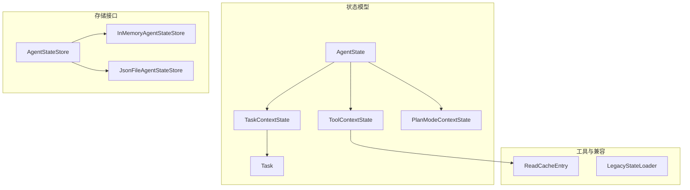
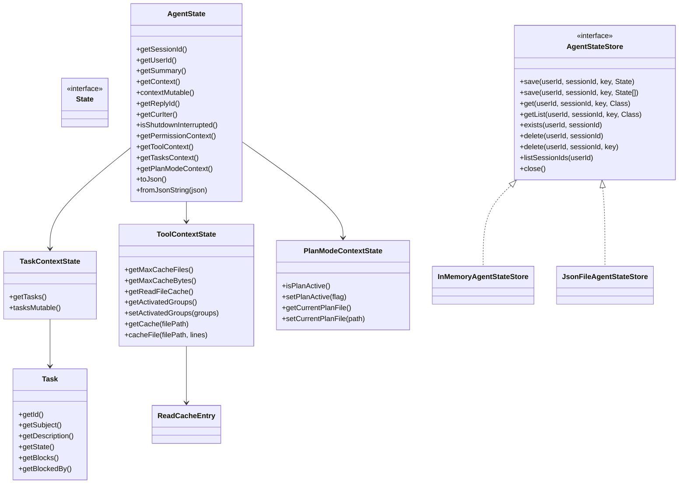
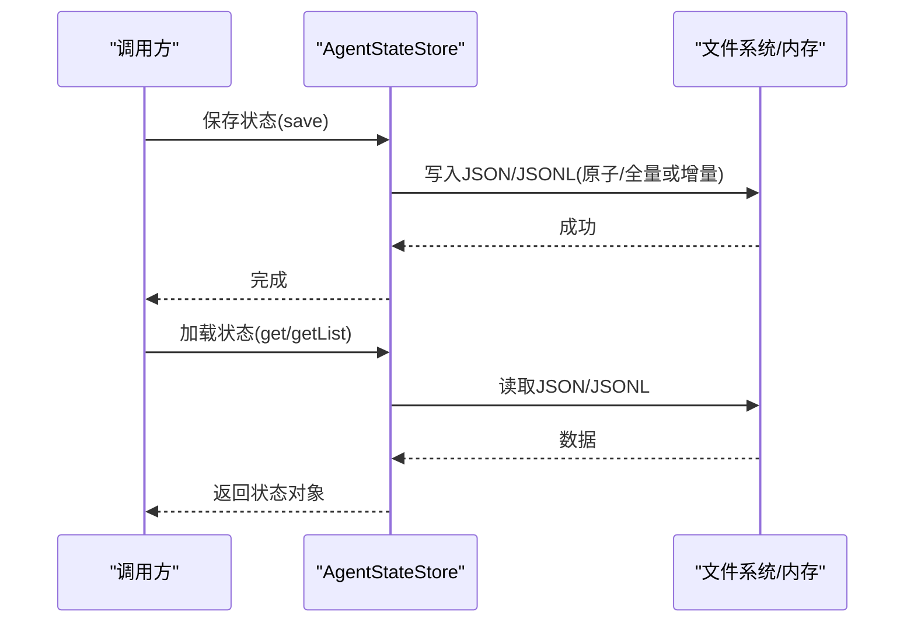
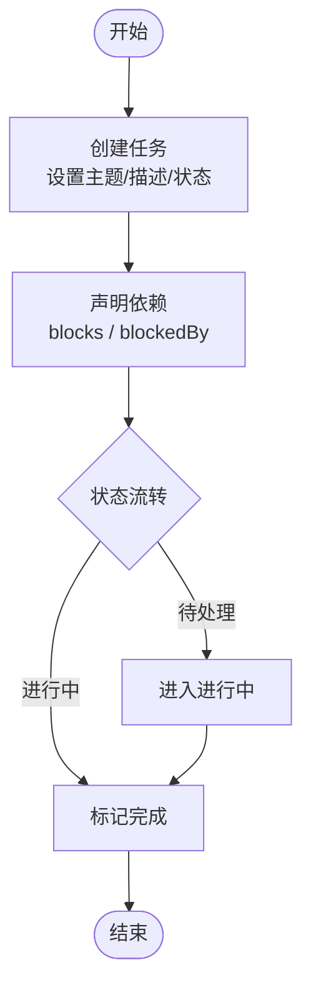
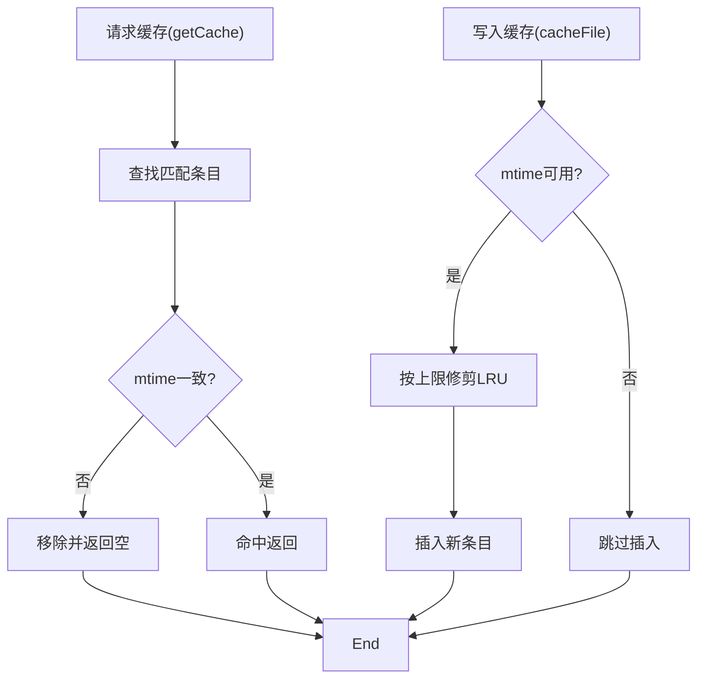
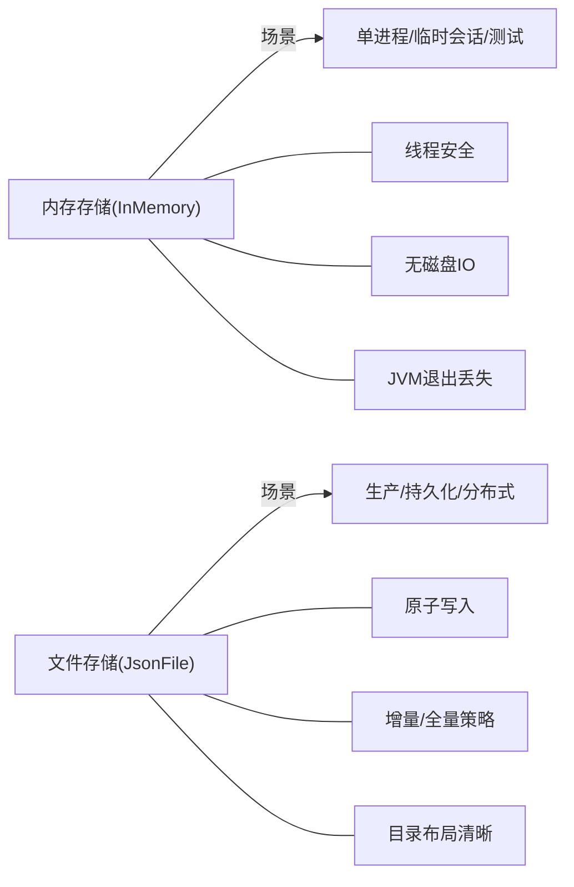
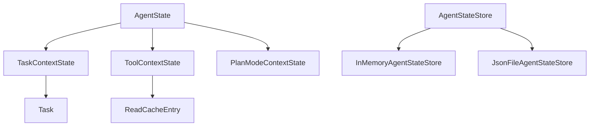

# 状态管理系统

<cite>
**本文引用的文件**
- [AgentState.java](file://agentscope-core/src/main/java/io/agentscope/core/state/AgentState.java)
- [Task.java](file://agentscope-core/src/main/java/io/agentscope/core/state/Task.java)
- [ToolContextState.java](file://agentscope-core/src/main/java/io/agentscope/core/state/ToolContextState.java)
- [TaskContextState.java](file://agentscope-core/src/main/java/io/agentscope/core/state/TaskContextState.java)
- [AgentStateStore.java](file://agentscope-core/src/main/java/io/agentscope/core/state/AgentStateStore.java)
- [InMemoryAgentStateStore.java](file://agentscope-core/src/main/java/io/agentscope/core/state/InMemoryAgentStateStore.java)
- [JsonFileAgentStateStore.java](file://agentscope-core/src/main/java/io/agentscope/core/state/JsonFileAgentStateStore.java)
- [State.java](file://agentscope-core/src/main/java/io/agentscope/core/state/State.java)
- [ReadCacheEntry.java](file://agentscope-core/src/main/java/io/agentscope/core/state/ReadCacheEntry.java)
- [PlanModeContextState.java](file://agentscope-core/src/main/java/io/agentscope/core/state/PlanModeContextState.java)
- [LegacyStateLoader.java](file://agentscope-core/src/main/java/io/agentscope/core/state/LegacyStateLoader.java)
- [AgentStateTest.java](file://agentscope-core/src/test/java/io/agentscope/core/state/AgentStateTest.java)
- [AgentBase.java](file://agentscope-core/src/main/java/io/agentscope/core/agent/AgentBase.java)
</cite>

## 目录
1. [引言](#引言)
2. [项目结构](#项目结构)
3. [核心组件](#核心组件)
4. [架构总览](#架构总览)
5. [详细组件分析](#详细组件分析)
6. [依赖分析](#依赖分析)
7. [性能考量](#性能考量)
8. [故障排查指南](#故障排查指南)
9. [结论](#结论)
10. [附录：最佳实践与示例路径](#附录最佳实践与示例路径)

## 引言
本技术文档聚焦于 AgentScope 的状态管理系统，系统性阐述 AgentState 的设计理念、状态生命周期与序列化持久化策略；对比内存存储与文件存储等实现差异；详解任务状态（Task）、工具状态（ToolContextState）与任务上下文状态（TaskContextState）的管理机制；说明状态的自动保存、恢复与清理流程；并给出状态设计原则、性能优化建议与故障恢复策略。文档同时提供可直接定位到源码的示例路径，便于读者在工程中快速落地。

## 项目结构
状态管理相关代码主要位于 agentscope-core 模块的 state 包内，围绕以下核心接口与实现展开：
- 接口层：State 标记接口、AgentStateStore 存储接口
- 实现层：InMemoryAgentStateStore 内存存储、JsonFileAgentStateStore 文件存储
- 领域模型：AgentState（会话级状态聚合体）、Task（任务记录）、TaskContextState（任务集合上下文）、ToolContextState（工具读缓存与激活组）、PlanModeContextState（计划模式标记）
- 兼容与工具：ReadCacheEntry 缓存条目、LegacyStateLoader 旧版数据迁移加载器

图表来源
- [AgentState.java:59-424](file://agentscope-core/src/main/java/io/agentscope/core/state/AgentState.java#L59-L424)
- [Task.java:41-283](file://agentscope-core/src/main/java/io/agentscope/core/state/Task.java#L41-L283)
- [TaskContextState.java:30-75](file://agentscope-core/src/main/java/io/agentscope/core/state/TaskContextState.java#L30-L75)
- [ToolContextState.java:47-231](file://agentscope-core/src/main/java/io/agentscope/core/state/ToolContextState.java#L47-L231)
- [PlanModeContextState.java:37-98](file://agentscope-core/src/main/java/io/agentscope/core/state/PlanModeContextState.java#L37-L98)
- [AgentStateStore.java:61-167](file://agentscope-core/src/main/java/io/agentscope/core/state/AgentStateStore.java#L61-L167)
- [InMemoryAgentStateStore.java:46-195](file://agentscope-core/src/main/java/io/agentscope/core/state/InMemoryAgentStateStore.java#L46-L195)
- [JsonFileAgentStateStore.java:66-397](file://agentscope-core/src/main/java/io/agentscope/core/state/JsonFileAgentStateStore.java#L66-L397)
- [ReadCacheEntry.java:31-44](file://agentscope-core/src/main/java/io/agentscope/core/state/ReadCacheEntry.java#L31-L44)
- [LegacyStateLoader.java:30-68](file://agentscope-core/src/main/java/io/agentscope/core/state/LegacyStateLoader.java#L30-L68)

章节来源
- [AgentState.java:31-58](file://agentscope-core/src/main/java/io/agentscope/core/state/AgentState.java#L31-L58)
- [AgentStateStore.java:22-60](file://agentscope-core/src/main/java/io/agentscope/core/state/AgentStateStore.java#L22-L60)

## 核心组件
- State 标记接口：统一可持久化对象的契约，便于通过 AgentStateStore 进行序列化与存储。
- AgentState：单个智能体的会话级运行时状态聚合体，包含对话缓冲区、滚动摘要、回复标识、当前推理迭代计数、权限上下文、工具上下文、任务上下文与计划模式上下文等。支持 JSON 序列化与反序列化，提供 Builder 构建与不可变字段的防御性拷贝访问。
- AgentStateStore：面向 (userId, sessionId, key) 的键空间抽象，提供保存、批量保存、读取、列表、存在性检查、删除与资源清理等能力。
- InMemoryAgentStateStore：基于并发映射的内存存储，适合单进程、无需跨重启持久化的场景。
- JsonFileAgentStateStore：基于 JSON/JSONL 的文件存储，支持原子写入、增量追加与哈希校验，适配分布式与跨进程场景。
- Task/TaskContextState：任务领域模型与任务集合上下文，支持依赖关系（blocks/blockedBy）与状态流转（pending → in_progress → completed）。
- ToolContextState/ReadCacheEntry：文件读缓存与激活工具组，维护 LRU 列表与容量约束，按需异步刷新。
- PlanModeContextState：计划模式标记，用于“先设计后执行”的只读阶段控制。
- LegacyStateLoader：从 v1 会话格式迁移至 v2 AgentState 的加载器。

章节来源
- [State.java:18-31](file://agentscope-core/src/main/java/io/agentscope/core/state/State.java#L18-L31)
- [AgentState.java:59-325](file://agentscope-core/src/main/java/io/agentscope/core/state/AgentState.java#L59-L325)
- [AgentStateStore.java:61-167](file://agentscope-core/src/main/java/io/agentscope/core/state/AgentStateStore.java#L61-L167)
- [InMemoryAgentStateStore.java:46-195](file://agentscope-core/src/main/java/io/agentscope/core/state/InMemoryAgentStateStore.java#L46-L195)
- [JsonFileAgentStateStore.java:66-397](file://agentscope-core/src/main/java/io/agentscope/core/state/JsonFileAgentStateStore.java#L66-L397)
- [Task.java:41-283](file://agentscope-core/src/main/java/io/agentscope/core/state/Task.java#L41-L283)
- [TaskContextState.java:30-75](file://agentscope-core/src/main/java/io/agentscope/core/state/TaskContextState.java#L30-L75)
- [ToolContextState.java:47-231](file://agentscope-core/src/main/java/io/agentscope/core/state/ToolContextState.java#L47-L231)
- [ReadCacheEntry.java:31-44](file://agentscope-core/src/main/java/io/agentscope/core/state/ReadCacheEntry.java#L31-L44)
- [PlanModeContextState.java:37-98](file://agentscope-core/src/main/java/io/agentscope/core/state/PlanModeContextState.java#L37-L98)
- [LegacyStateLoader.java:30-68](file://agentscope-core/src/main/java/io/agentscope/core/state/LegacyStateLoader.java#L30-L68)

## 架构总览
状态管理采用“领域模型 + 存储接口 + 多实现”的分层设计。AgentState 作为核心聚合根，承载多子上下文；存储接口屏蔽具体介质差异，允许在内存与文件之间无缝切换；工具类负责兼容与迁移。

图表来源
- [AgentState.java:59-424](file://agentscope-core/src/main/java/io/agentscope/core/state/AgentState.java#L59-L424)
- [Task.java:41-283](file://agentscope-core/src/main/java/io/agentscope/core/state/Task.java#L41-L283)
- [TaskContextState.java:30-75](file://agentscope-core/src/main/java/io/agentscope/core/state/TaskContextState.java#L30-L75)
- [ToolContextState.java:47-231](file://agentscope-core/src/main/java/io/agentscope/core/state/ToolContextState.java#L47-L231)
- [PlanModeContextState.java:37-98](file://agentscope-core/src/main/java/io/agentscope/core/state/PlanModeContextState.java#L37-L98)
- [AgentStateStore.java:61-167](file://agentscope-core/src/main/java/io/agentscope/core/state/AgentStateStore.java#L61-L167)
- [InMemoryAgentStateStore.java:46-195](file://agentscope-core/src/main/java/io/agentscope/core/state/InMemoryAgentStateStore.java#L46-L195)
- [JsonFileAgentStateStore.java:66-397](file://agentscope-core/src/main/java/io/agentscope/core/state/JsonFileAgentStateStore.java#L66-L397)
- [ReadCacheEntry.java:31-44](file://agentscope-core/src/main/java/io/agentscope/core/state/ReadCacheEntry.java#L31-L44)

## 详细组件分析

### AgentState 设计与生命周期
- 职责边界：承载单会话的完整运行时状态，确保智能体可在中断/重启后“无缝续传”。
- 关键字段与语义：
  - 会话标识与用户标识：用于存储键空间定位
  - 摘要与上下文：对话缓冲区与滚动摘要
  - 回复标识与迭代计数：用于流式输出与重入控制
  - 中断标记：用于优雅关闭时的中断信号
  - 权限上下文、工具上下文、任务上下文、计划模式上下文：细分子域状态
- 不变性与可变性：
  - 上下文列表提供防御性拷贝与可变句柄，兼顾安全与性能
  - 子上下文均以不可变对象封装内部状态，避免外部误改
- 序列化：
  - 提供 JSON 序列化与反序列化方法，字段顺序稳定，便于跨版本兼容
- 生命周期：
  - 创建：通过 Builder 初始化默认值与显式参数
  - 运行期更新：在推理/工具调用/任务推进过程中逐步变更
  - 持久化：在合适时机（如每次推理结束或会话切换）保存
  - 恢复：启动时从存储加载，重建运行时状态
  - 清理：会话结束或过期清理

图表来源
- [AgentStateStore.java:73-117](file://agentscope-core/src/main/java/io/agentscope/core/state/AgentStateStore.java#L73-L117)
- [JsonFileAgentStateStore.java:98-202](file://agentscope-core/src/main/java/io/agentscope/core/state/JsonFileAgentStateStore.java#L98-L202)
- [InMemoryAgentStateStore.java:54-102](file://agentscope-core/src/main/java/io/agentscope/core/state/InMemoryAgentStateStore.java#L54-L102)

章节来源
- [AgentState.java:59-325](file://agentscope-core/src/main/java/io/agentscope/core/state/AgentState.java#L59-L325)
- [AgentStateTest.java:35-168](file://agentscope-core/src/test/java/io/agentscope/core/state/AgentStateTest.java#L35-L168)

### 任务状态（Task）与任务上下文（TaskContextState）
- Task：用户可见的工作项，具备主题、描述、元数据、创建时间、状态（待处理/进行中/已完成）、所有者、依赖关系（上游阻塞/下游阻塞）。状态枚举支持 JSON 反序列化。
- TaskContextState：对 Task 列表的包装，提供只读副本与可变句柄，便于工具/中间件就地增删改。
- 依赖管理：通过 blocks 与 blockedBy 维护有向无环图，支持任务编排与串并行组合。

图表来源
- [Task.java:41-283](file://agentscope-core/src/main/java/io/agentscope/core/state/Task.java#L41-L283)
- [TaskContextState.java:30-75](file://agentscope-core/src/main/java/io/agentscope/core/state/TaskContextState.java#L30-L75)

章节来源
- [Task.java:41-283](file://agentscope-core/src/main/java/io/agentscope/core/state/Task.java#L41-L283)
- [TaskContextState.java:30-75](file://agentscope-core/src/main/java/io/agentscope/core/state/TaskContextState.java#L30-L75)

### 工具状态（ToolContextState）与读缓存（ReadCacheEntry）
- ToolContextState：
  - 维护文件读缓存的上限（数量与字节），按 LRU 替换
  - 支持按文件路径查询缓存，若文件 mtime 变更则视为失效并剔除
  - 提供异步缓存写入与读取，避免阻塞 Reactor 线程池
  - 仅序列化配置字段（最大缓存文件数、最大缓存字节数、激活工具组），运行时缓存重建为空
- ReadCacheEntry：缓存条目的不可变快照，包含行内容、更新时间戳、近似字节数与绝对路径。

图表来源
- [ToolContextState.java:123-180](file://agentscope-core/src/main/java/io/agentscope/core/state/ToolContextState.java#L123-L180)
- [ReadCacheEntry.java:31-44](file://agentscope-core/src/main/java/io/agentscope/core/state/ReadCacheEntry.java#L31-L44)

章节来源
- [ToolContextState.java:47-231](file://agentscope-core/src/main/java/io/agentscope/core/state/ToolContextState.java#L47-L231)
- [ReadCacheEntry.java:31-44](file://agentscope-core/src/main/java/io/agentscope/core/state/ReadCacheEntry.java#L31-L44)

### 计划模式上下文（PlanModeContextState）
- 作用：在“设计优先”阶段禁止变更型工具调用，保障规划稳定性；支持持久化以跨节点/重启保持状态。
- 字段：是否启用计划模式、当前编辑的计划文件相对路径。
- 使用场景：在需要严格评审与蓝图设计后再执行的高风险工作流中。

章节来源
- [PlanModeContextState.java:37-98](file://agentscope-core/src/main/java/io/agentscope/core/state/PlanModeContextState.java#L37-L98)

### 存储实现对比：内存存储 vs 文件存储
- InMemoryAgentStateStore
  - 特点：线程安全、低延迟、易清理、适合单进程测试/演示
  - 局限：JVM 退出即丢失、不适用于分布式/多实例
- JsonFileAgentStateStore
  - 特点：原子写入、UTF-8、JSON/JSONL 分离、列表状态基于哈希判断增量/全量写入
  - 布局：按 (userId, sessionId) 组织目录，文件名区分单值与列表
  - 适用：生产环境、跨进程/跨节点、需要持久化与可审计

图表来源
- [InMemoryAgentStateStore.java:26-45](file://agentscope-core/src/main/java/io/agentscope/core/state/InMemoryAgentStateStore.java#L26-L45)
- [JsonFileAgentStateStore.java:41-66](file://agentscope-core/src/main/java/io/agentscope/core/state/JsonFileAgentStateStore.java#L41-L66)

章节来源
- [InMemoryAgentStateStore.java:46-195](file://agentscope-core/src/main/java/io/agentscope/core/state/InMemoryAgentStateStore.java#L46-L195)
- [JsonFileAgentStateStore.java:66-397](file://agentscope-core/src/main/java/io/agentscope/core/state/JsonFileAgentStateStore.java#L66-L397)

### 自动保存、恢复与清理机制
- 自动保存：
  - 在推理/工具调用/任务推进的关键点触发保存，避免长时间未落盘导致的数据丢失
  - 对于列表状态，采用哈希校验决定增量追加或全量重写，减少 IO
- 恢复：
  - 启动时按 (userId, sessionId) 从存储加载 AgentState 与相关列表
  - 若旧版会话存在，可通过 LegacyStateLoader 将历史数据迁移为新格式
- 清理：
  - 会话结束或过期后删除对应目录
  - 内存存储支持清空全部会话，便于测试与调试

章节来源
- [JsonFileAgentStateStore.java:110-133](file://agentscope-core/src/main/java/io/agentscope/core/state/JsonFileAgentStateStore.java#L110-L133)
- [LegacyStateLoader.java:48-66](file://agentscope-core/src/main/java/io/agentscope/core/state/LegacyStateLoader.java#L48-L66)
- [InMemoryAgentStateStore.java:139-142](file://agentscope-core/src/main/java/io/agentscope/core/state/InMemoryAgentStateStore.java#L139-L142)

## 依赖分析
- 组件耦合：
  - AgentState 依赖 TaskContextState、ToolContextState、PlanModeContextState 等子上下文，形成聚合关系
  - 子上下文内部自包含不变性与序列化策略，降低对外部耦合
- 存储接口解耦：
  - AgentStateStore 抽象了介质无关的键空间操作，实现可替换
- 外部依赖：
  - JSON 序列化由 JsonUtils 提供
  - 文件存储使用 Reactor 的 boundedElastic 线程池进行非阻塞 IO

图表来源
- [AgentState.java:68-71](file://agentscope-core/src/main/java/io/agentscope/core/state/AgentState.java#L68-L71)
- [TaskContextState.java:30-52](file://agentscope-core/src/main/java/io/agentscope/core/state/TaskContextState.java#L30-L52)
- [ToolContextState.java:47-52](file://agentscope-core/src/main/java/io/agentscope/core/state/ToolContextState.java#L47-L52)
- [PlanModeContextState.java:37-40](file://agentscope-core/src/main/java/io/agentscope/core/state/PlanModeContextState.java#L37-L40)
- [AgentStateStore.java:61-167](file://agentscope-core/src/main/java/io/agentscope/core/state/AgentStateStore.java#L61-L167)

章节来源
- [AgentState.java:59-103](file://agentscope-core/src/main/java/io/agentscope/core/state/AgentState.java#L59-L103)
- [AgentStateStore.java:61-167](file://agentscope-core/src/main/java/io/agentscope/core/state/AgentStateStore.java#L61-L167)

## 性能考量
- 序列化成本：
  - 单值状态使用 JSON，列表状态使用 JSONL，减少大对象解析开销
  - 列表状态采用哈希校验，避免重复写入
- IO 优化：
  - 文件存储采用原子写入与临时文件，保证一致性
  - 工具读缓存异步刷新，避免主线程阻塞
- 内存占用：
  - ToolContextState 限制缓存数量与总字节数，按 LRU 替换
  - AgentState 上下文列表提供防御性拷贝，避免外部修改带来的二次复制

## 故障排查指南
- 常见问题与定位：
  - 加载失败：检查存储路径是否存在、文件编码是否为 UTF-8、JSON 结构是否合法
  - 列表未更新：确认哈希文件是否存在且与当前列表一致，必要时允许全量重写
  - 缓存异常：确认文件 mtime 是否变化，缓存条目是否被正确剔除
  - 类型不匹配：当 get 指定类型与实际不符时会抛出类型转换异常
- 排查步骤：
  - 校验存储实现选择是否符合部署环境（单机/分布式）
  - 查看存储根目录布局与文件命名规则
  - 使用单元测试样例验证序列化/反序列化行为

章节来源
- [JsonFileAgentStateStore.java:167-202](file://agentscope-core/src/main/java/io/agentscope/core/state/JsonFileAgentStateStore.java#L167-L202)
- [InMemoryAgentStateStore.java:77-86](file://agentscope-core/src/main/java/io/agentscope/core/state/InMemoryAgentStateStore.java#L77-L86)
- [AgentStateTest.java:35-168](file://agentscope-core/src/test/java/io/agentscope/core/state/AgentStateTest.java#L35-L168)

## 结论
AgentScope 的状态管理系统以 AgentState 为核心，结合可插拔的存储接口与完善的领域模型，实现了跨进程、可恢复、可演进的状态管理方案。通过合理的序列化策略、增量写入与异步 IO，系统在性能与可靠性之间取得平衡。配合任务编排、工具读缓存与计划模式等特性，能够满足复杂工作流的长期运行需求。

## 附录：最佳实践与示例路径
- 状态设计原则
  - 聚合根单一职责：AgentState 聚合会话级状态，子上下文独立演化
  - 不变性优先：子上下文尽量使用不可变对象，避免并发修改引发的竞态
  - 明确序列化边界：仅持久化必要的运行时信息，运行时状态在反序列化后重建
- 性能优化建议
  - 列表状态采用增量写入策略，减少磁盘 IO
  - 工具读缓存合理设置上限，避免内存膨胀
  - 在高并发场景优先选择文件存储，确保跨实例一致性
- 故障恢复策略
  - 启动时优先尝试新格式加载，若失败回退到旧版迁移器
  - 对关键状态定期做快照备份，便于回滚
- 示例路径（用于在工程中定位实现）
  - AgentState 的构建与序列化：[AgentState.java:279-288](file://agentscope-core/src/main/java/io/agentscope/core/state/AgentState.java#L279-L288)
  - 任务状态的创建与状态流转：[Task.java:178-218](file://agentscope-core/src/main/java/io/agentscope/core/state/Task.java#L178-L218)
  - 工具读缓存的查询与写入：[ToolContextState.java:123-180](file://agentscope-core/src/main/java/io/agentscope/core/state/ToolContextState.java#L123-L180)
  - 计划模式开关与持久化：[PlanModeContextState.java:54-70](file://agentscope-core/src/main/java/io/agentscope/core/state/PlanModeContextState.java#L54-L70)
  - 存储接口的保存/读取/列表操作：[AgentStateStore.java:73-117](file://agentscope-core/src/main/java/io/agentscope/core/state/AgentStateStore.java#L73-L117)
  - 内存存储实现细节：[InMemoryAgentStateStore.java:46-195](file://agentscope-core/src/main/java/io/agentscope/core/state/InMemoryAgentStateStore.java#L46-L195)
  - 文件存储的原子写入与增量策略：[JsonFileAgentStateStore.java:110-133](file://agentscope-core/src/main/java/io/agentscope/core/state/JsonFileAgentStateStore.java#L110-L133)
  - 旧版会话迁移：[LegacyStateLoader.java:48-66](file://agentscope-core/src/main/java/io/agentscope/core/state/LegacyStateLoader.java#L48-L66)
  - 测试用例参考（序列化/不可变性/默认值）：[AgentStateTest.java:35-168](file://agentscope-core/src/test/java/io/agentscope/core/state/AgentStateTest.java#L35-L168)
  - 智能体基类中的状态模块集成点（钩子/中断/追踪）：[AgentBase.java:47-90](file://agentscope-core/src/main/java/io/agentscope/core/agent/AgentBase.java#L47-L90)