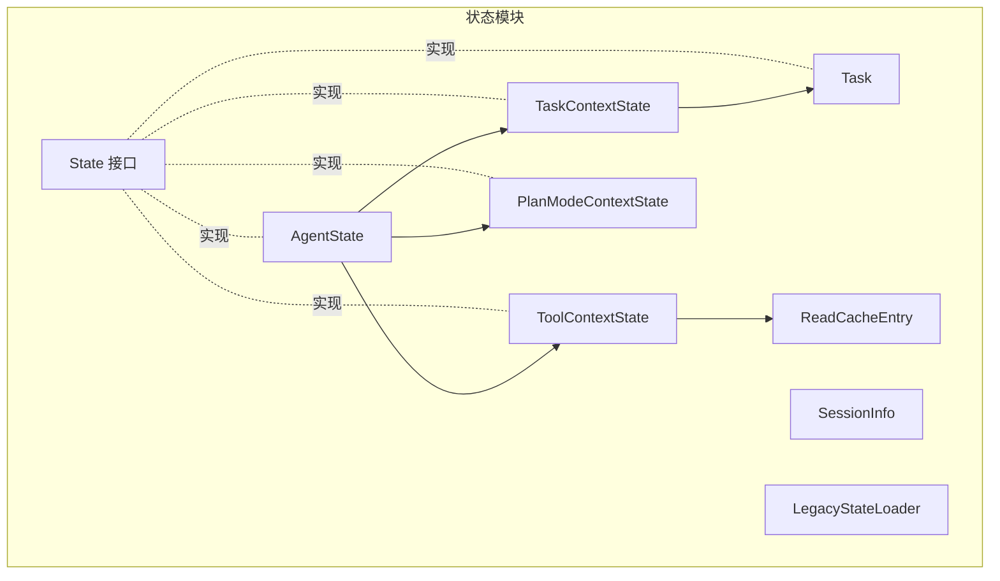
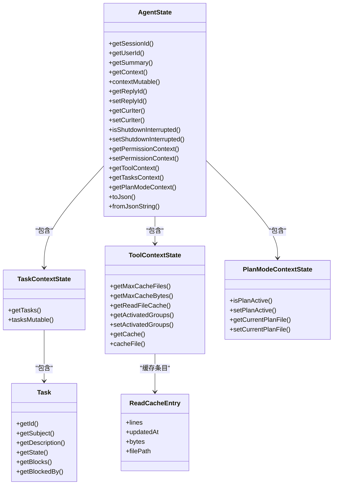
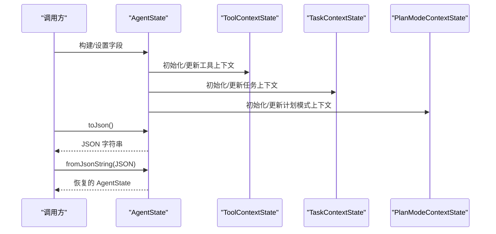
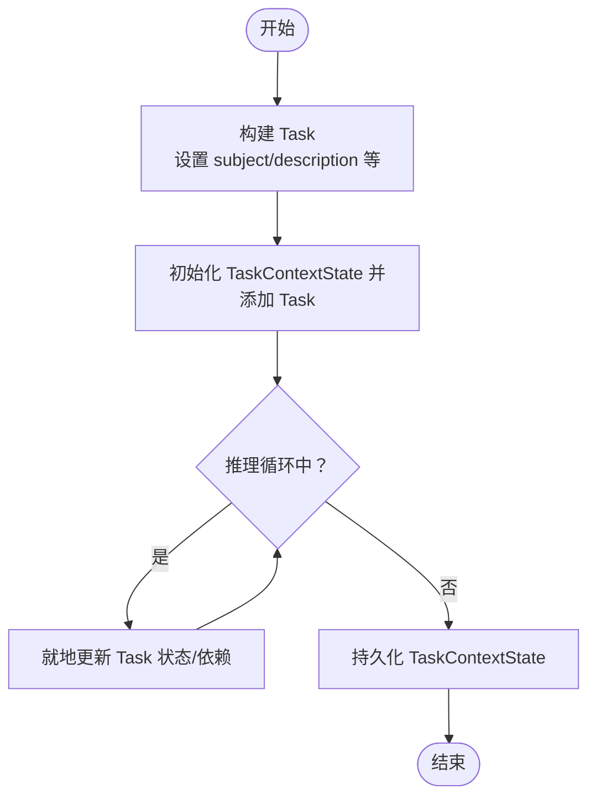
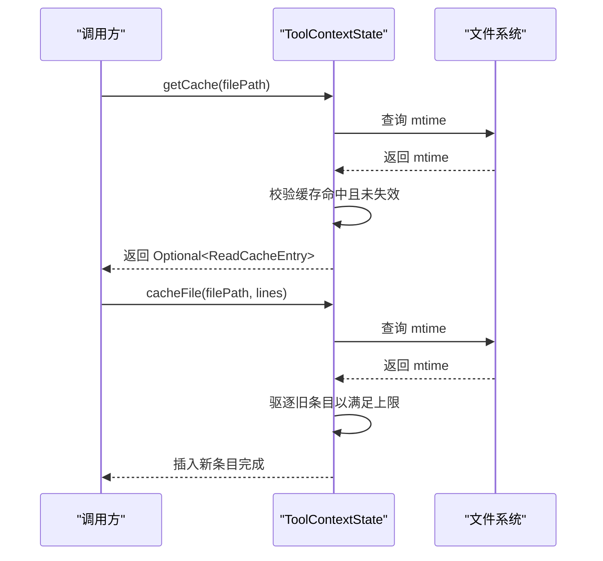
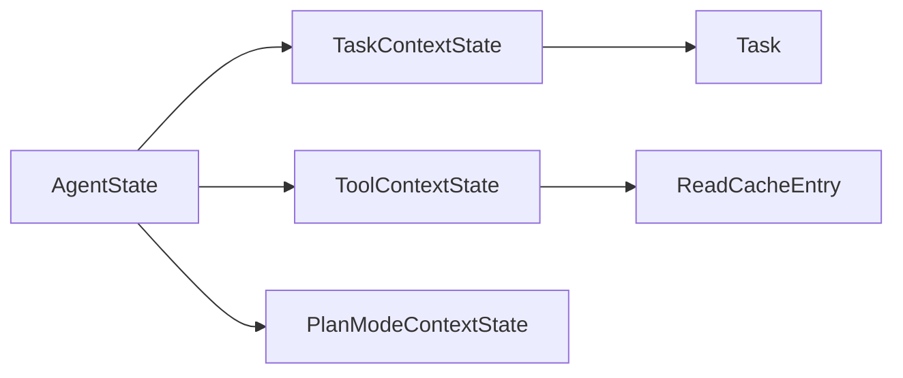

# 状态类型与结构

<cite>
**本文引用的文件**
- [AgentState.java](file://agentscope-core/src/main/java/io/agentscope/core/state/AgentState.java)
- [Task.java](file://agentscope-core/src/main/java/io/agentscope/core/state/Task.java)
- [TaskContextState.java](file://agentscope-core/src/main/java/io/agentscope/core/state/TaskContextState.java)
- [ToolContextState.java](file://agentscope-core/src/main/java/io/agentscope/core/state/ToolContextState.java)
- [PlanModeContextState.java](file://agentscope-core/src/main/java/io/agentscope/core/state/PlanModeContextState.java)
- [ReadCacheEntry.java](file://agentscope-core/src/main/java/io/agentscope/core/state/ReadCacheEntry.java)
- [State.java](file://agentscope-core/src/main/java/io/agentscope/core/state/State.java)
- [SessionInfo.java](file://agentscope-core/src/main/java/io/agentscope/core/state/SessionInfo.java)
- [LegacyStateLoader.java](file://agentscope-core/src/main/java/io/agentscope/core/state/LegacyStateLoader.java)
- [TodoTools.java](file://agentscope-core/src/main/java/io/agentscope/core/tool/builtin/TodoTools.java)
- [AgentStateTest.java](file://agentscope-core/src/test/java/io/agentscope/core/state/AgentStateTest.java)
- [TaskTest.java](file://agentscope-core/src/test/java/io/agentscope/core/state/TaskTest.java)
- [TaskContextStateTest.java](file://agentscope-core/src/test/java/io/agentscope/core/state/TaskContextStateTest.java)
- [PlanModeContextStatePersistenceTest.java](file://agentscope-core/src/test/java/io/agentscope/core/state/PlanModeContextStatePersistenceTest.java)
</cite>

## 目录
1. [引言](#引言)
2. [项目结构](#项目结构)
3. [核心组件](#核心组件)
4. [架构总览](#架构总览)
5. [详细组件分析](#详细组件分析)
6. [依赖分析](#依赖分析)
7. [性能考虑](#性能考虑)
8. [故障排查指南](#故障排查指南)
9. [结论](#结论)
10. [附录](#附录)

## 引言
本文件系统性梳理 agentscope 核心状态类型与结构，围绕以下目标展开：  
- 深入解释 AgentState 的核心设计理念与字段语义，包括会话ID、用户ID、对话上下文、回复标识符、推理迭代计数等关键属性的作用与管理方式；  
- 详细说明任务状态（Task）的数据结构与生命周期管理；  
- 工具上下文状态（ToolContextState）的工具调用记录与状态维护机制；  
- 计划模式上下文状态（PlanModeContextState）的规划信息管理；  
- 各状态类型之间的关系与交互模式；  
- 状态的序列化与反序列化机制及最佳实践；  
- 状态结构设计的指导原则与扩展方法。

## 项目结构
状态相关代码集中于 agentscope-core 模块的 state 包中，包含以下关键文件：
- AgentState：单智能体运行时状态载体，聚合多个子上下文（权限、工具、任务、计划模式）
- Task/TaskContextState：任务数据模型与任务集合上下文
- ToolContextState/ReadCacheEntry：工具读缓存与文件变更校验
- PlanModeContextState：计划模式标志位与当前规划文件路径
- State/SessionInfo：状态接口与会话元信息
- LegacyStateLoader：历史状态加载器
- 测试与工具类：用于验证状态构建、持久化与使用场景

图表来源
- [AgentState.java:59-103](file://agentscope-core/src/main/java/io/agentscope/core/state/AgentState.java#L59-L103)
- [TaskContextState.java:30-42](file://agentscope-core/src/main/java/io/agentscope/core/state/TaskContextState.java#L30-L42)
- [Task.java:41-98](file://agentscope-core/src/main/java/io/agentscope/core/state/Task.java#L41-L98)
- [ToolContextState.java:47-64](file://agentscope-core/src/main/java/io/agentscope/core/state/ToolContextState.java#L47-L64)
- [ReadCacheEntry.java:31-42](file://agentscope-core/src/main/java/io/agentscope/core/state/ReadCacheEntry.java#L31-L42)
- [PlanModeContextState.java:37-52](file://agentscope-core/src/main/java/io/agentscope/core/state/PlanModeContextState.java#L37-L52)
- [State.java:18-30](file://agentscope-core/src/main/java/io/agentscope/core/state/State.java#L18-L30)
- [SessionInfo.java:25-44](file://agentscope-core/src/main/java/io/agentscope/core/state/SessionInfo.java#L25-L44)
- [LegacyStateLoader.java](file://agentscope-core/src/main/java/io/agentscope/core/state/LegacyStateLoader.java#L51)

章节来源
- [AgentState.java:1-424](file://agentscope-core/src/main/java/io/agentscope/core/state/AgentState.java#L1-L424)
- [Task.java:1-283](file://agentscope-core/src/main/java/io/agentscope/core/state/Task.java#L1-L283)
- [TaskContextState.java:1-75](file://agentscope-core/src/main/java/io/agentscope/core/state/TaskContextState.java#L1-L75)
- [ToolContextState.java:1-231](file://agentscope-core/src/main/java/io/agentscope/core/state/ToolContextState.java#L1-L231)
- [PlanModeContextState.java:1-98](file://agentscope-core/src/main/java/io/agentscope/core/state/PlanModeContextState.java#L1-L98)
- [ReadCacheEntry.java:1-44](file://agentscope-core/src/main/java/io/agentscope/core/state/ReadCacheEntry.java#L1-L44)
- [State.java:1-31](file://agentscope-core/src/main/java/io/agentscope/core/state/State.java#L1-L31)
- [SessionInfo.java:1-94](file://agentscope-core/src/main/java/io/agentscope/core/state/SessionInfo.java#L1-L94)
- [LegacyStateLoader.java:1-120](file://agentscope-core/src/main/java/io/agentscope/core/state/LegacyStateLoader.java#L1-L120)

## 核心组件
本节聚焦 AgentState 的设计理念与关键字段职责，以及其与子上下文的关系。

- 设计理念
  - 可变的单智能体运行时状态，承载“会话级”可恢复能力：对话缓冲区、滚动摘要、每轮回复标识符、权限/工具/任务/计划模式子上下文，以及当前推理迭代计数。
  - 对外暴露“防御性拷贝”的只读视图，同时提供“可变句柄”以支持就地追加/替换消息，兼顾安全与性能。
  - JSON 序列化顺序严格控制，确保跨版本兼容与存储一致性。

- 关键字段与职责
  - 会话ID（sessionId）：唯一标识一次会话，支持自动生成或显式传入
  - 用户ID（userId）：可空，匿名/单租户上下文下为 null
  - 摘要（summary）：自由字符串形式的滚动摘要，未来可演进为结构化摘要
  - 对话上下文（context）：消息列表，提供只读副本与可变句柄
  - 回复标识符（replyId）：每轮回复的唯一标识，支持重置与自动生成
  - 当前推理迭代计数（curIter）：用于限制/跟踪推理迭代次数
  - 关闭中断标记（shutdownInterrupted）：指示会话是否在关闭过程中被中断
  - 权限上下文（permissionContext）：动态切换评估模式（如绕过模式）
  - 工具上下文（toolContext）：文件读缓存配置与激活的工具组
  - 任务上下文（tasksContext）：任务集合，支持就地增删改
  - 计划模式上下文（planModeContext）：计划模式开关与当前规划文件路径

- 运行时特性
  - 中断控制（interruptControl）：按会话维度的运行时信号，非序列化字段
  - 序列化/反序列化：通过 Jackson 注解实现，支持 pretty JSON 存储与从 JSON 恢复

章节来源
- [AgentState.java:31-58](file://agentscope-core/src/main/java/io/agentscope/core/state/AgentState.java#L31-L58)
- [AgentState.java:61-103](file://agentscope-core/src/main/java/io/agentscope/core/state/AgentState.java#L61-L103)
- [AgentState.java:159-288](file://agentscope-core/src/main/java/io/agentscope/core/state/AgentState.java#L159-L288)
- [AgentState.java:254-267](file://agentscope-core/src/main/java/io/agentscope/core/state/AgentState.java#L254-L267)

## 架构总览
AgentState 作为顶层状态容器，聚合多个子上下文，形成“主状态 + 多个子状态”的组合结构。各子状态职责清晰、边界明确，并通过统一的序列化策略进行持久化。

图表来源
- [AgentState.java:59-103](file://agentscope-core/src/main/java/io/agentscope/core/state/AgentState.java#L59-L103)
- [TaskContextState.java:30-52](file://agentscope-core/src/main/java/io/agentscope/core/state/TaskContextState.java#L30-L52)
- [Task.java:41-98](file://agentscope-core/src/main/java/io/agentscope/core/state/Task.java#L41-L98)
- [ToolContextState.java:47-105](file://agentscope-core/src/main/java/io/agentscope/core/state/ToolContextState.java#L47-L105)
- [ReadCacheEntry.java:31-42](file://agentscope-core/src/main/java/io/agentscope/core/state/ReadCacheEntry.java#L31-L42)
- [PlanModeContextState.java:37-70](file://agentscope-core/src/main/java/io/agentscope/core/state/PlanModeContextState.java#L37-L70)

## 详细组件分析

### AgentState 组件分析
- 设计要点
  - 使用 Builder 模式构造，支持默认值与空值处理
  - JSON 属性顺序固定，便于跨版本兼容
  - 提供只读与可变两种上下文访问方式，避免外部修改内部状态
  - 支持运行时中断控制，且该字段不参与序列化
- 字段管理
  - 会话/用户标识：用于多租户与会话恢复
  - 摘要与上下文：承载对话历史与压缩后的摘要
  - 回复标识符：区分不同轮次的输出
  - 迭代计数：控制推理深度
  - 关闭中断标记：用于优雅停机流程
  - 子上下文：权限、工具、任务、计划模式
- 序列化/反序列化
  - toJson()/fromJsonString() 提供完整状态的 JSON 存储与恢复
  - fromJson() 静态工厂支持增量字段恢复

图表来源
- [AgentState.java:105-153](file://agentscope-core/src/main/java/io/agentscope/core/state/AgentState.java#L105-L153)
- [AgentState.java:279-288](file://agentscope-core/src/main/java/io/agentscope/core/state/AgentState.java#L279-L288)
- [ToolContextState.java:66-82](file://agentscope-core/src/main/java/io/agentscope/core/state/ToolContextState.java#L66-L82)
- [TaskContextState.java:39-42](file://agentscope-core/src/main/java/io/agentscope/core/state/TaskContextState.java#L39-L42)
- [PlanModeContextState.java:46-52](file://agentscope-core/src/main/java/io/agentscope/core/state/PlanModeContextState.java#L46-L52)

章节来源
- [AgentState.java:31-58](file://agentscope-core/src/main/java/io/agentscope/core/state/AgentState.java#L31-L58)
- [AgentState.java:159-288](file://agentscope-core/src/main/java/io/agentscope/core/state/AgentState.java#L159-L288)

### Task 与 TaskContextState 组件分析
- Task 数据结构
  - 基本字段：主题、描述、元数据、创建时间、状态、ID、所有者
  - 状态流转：待定 → 进行中 → 完成
  - 依赖关系：通过 blocks（下游阻塞）与 blockedBy（上游依赖）表达
  - 默认值：除 subject/description 必填外，其他字段有合理默认
- TaskContextState 生命周期
  - 聚合多个 Task，提供只读副本与可变句柄
  - 允许工具直接就地增删改任务，无需重建整个上下文
- 使用场景
  - Todo 类工具通过 Task/TaskContextState 管理用户待办事项
  - 测试覆盖了构建、状态转换与依赖关系

图表来源
- [Task.java:43-98](file://agentscope-core/src/main/java/io/agentscope/core/state/Task.java#L43-L98)
- [TaskContextState.java:30-52](file://agentscope-core/src/main/java/io/agentscope/core/state/TaskContextState.java#L30-L52)
- [TodoTools.java:156-170](file://agentscope-core/src/main/java/io/agentscope/core/tool/builtin/TodoTools.java#L156-L170)

章节来源
- [Task.java:41-283](file://agentscope-core/src/main/java/io/agentscope/core/state/Task.java#L41-L283)
- [TaskContextState.java:30-75](file://agentscope-core/src/main/java/io/agentscope/core/state/TaskContextState.java#L30-L75)
- [TodoTools.java:156-170](file://agentscope-core/src/main/java/io/agentscope/core/tool/builtin/TodoTools.java#L156-L170)

### ToolContextState 组件分析
- 设计目标
  - 为文件读取类工具提供 LRU 缓存，支持按条目数量与字节数上限约束
  - 读取时校验文件 mtime，若变更则驱逐缓存项
  - 所有文件系统操作在非阻塞调度器上执行，避免阻塞 Reactor
- 关键字段与方法
  - 最大缓存文件数与最大缓存字节：序列化参与
  - 激活工具组：序列化参与
  - 读缓存列表：运行时状态，反序列化后重建为空
  - getCache()/cacheFile()：异步缓存查询与插入
- 性能与可靠性
  - 严格的参数校验（>1 的文件数、>10000 的字节数）
  - 同步块保护缓存列表，保证并发安全

图表来源
- [ToolContextState.java:123-180](file://agentscope-core/src/main/java/io/agentscope/core/state/ToolContextState.java#L123-L180)
- [ToolContextState.java:182-198](file://agentscope-core/src/main/java/io/agentscope/core/state/ToolContextState.java#L182-L198)

章节来源
- [ToolContextState.java:34-231](file://agentscope-core/src/main/java/io/agentscope/core/state/ToolContextState.java#L34-L231)
- [ReadCacheEntry.java:31-44](file://agentscope-core/src/main/java/io/agentscope/core/state/ReadCacheEntry.java#L31-L44)

### PlanModeContextState 组件分析
- 设计目标
  - 在“先设计后执行”的计划模式下，禁止变更型工具调用，仅允许探索与草拟
  - 该状态需具备分布式可恢复性，因此持久化在 AgentState 内部
- 关键字段
  - planActive：是否处于计划模式
  - currentPlanFile：当前编辑的 Markdown 规划文件相对路径
- 使用建议
  - 切换模式应通过更新 AgentState 并持久化，确保重启/迁移后状态一致

章节来源
- [PlanModeContextState.java:23-98](file://agentscope-core/src/main/java/io/agentscope/core/state/PlanModeContextState.java#L23-L98)

### State 接口与会话信息
- State 接口
  - 标记可持久化状态对象，推荐使用 Java Records 表达简单状态
  - 现有领域对象可直接实现该接口以避免转换开销
- SessionInfo
  - 封装会话元信息：大小、最后修改时间、组件数量
  - 用于会话管理与监控展示

章节来源
- [State.java:18-30](file://agentscope-core/src/main/java/io/agentscope/core/state/State.java#L18-L30)
- [SessionInfo.java:25-94](file://agentscope-core/src/main/java/io/agentscope/core/state/SessionInfo.java#L25-L94)

## 依赖分析
- 组件耦合
  - AgentState 与各子上下文为组合关系，低内聚高内聚
  - ToolContextState 与 ReadCacheEntry 为强关联，前者持有后者实例
  - TaskContextState 与 Task 为聚合关系，支持就地修改
- 外部依赖
  - Jackson 注解驱动序列化/反序列化
  - Reactor 调度器用于非阻塞文件系统操作
- 循环依赖
  - 无循环依赖，结构清晰

图表来源
- [AgentState.java:59-103](file://agentscope-core/src/main/java/io/agentscope/core/state/AgentState.java#L59-L103)
- [TaskContextState.java:30-52](file://agentscope-core/src/main/java/io/agentscope/core/state/TaskContextState.java#L30-L52)
- [ToolContextState.java:47-105](file://agentscope-core/src/main/java/io/agentscope/core/state/ToolContextState.java#L47-L105)
- [Task.java:41-98](file://agentscope-core/src/main/java/io/agentscope/core/state/Task.java#L41-L98)
- [ReadCacheEntry.java:31-42](file://agentscope-core/src/main/java/io/agentscope/core/state/ReadCacheEntry.java#L31-L42)

## 性能考虑
- 序列化开销
  - AgentState 提供 pretty JSON 输出，适合人类阅读与调试；生产环境可权衡紧凑 JSON 以减少存储体积
- 缓存策略
  - ToolContextState 的 LRU 驱逐策略与 mtime 校验在高并发场景下需关注文件系统延迟
- 并发安全
  - ToolContextState 的缓存列表使用同步块保护，避免竞态条件
- I/O 非阻塞
  - 文件系统操作在 boundedElastic 调度器上执行，降低对主线程的影响

## 故障排查指南
- 常见问题与定位
  - 会话恢复失败：检查 JSON 字段完整性与序列化顺序一致性
  - 工具缓存异常：确认 max_cache_files 与 max_cache_bytes 参数是否满足业务需求
  - 任务状态不一致：核对 blocks 与 blockedBy 的依赖关系是否正确
  - 计划模式误触发：确认 plan_active 与 current_plan_file 是否按预期切换
- 参考测试
  - AgentState/Task/TaskContextState/PlanModeContextState 的单元测试覆盖了构建、序列化/反序列化与典型使用场景

章节来源
- [AgentStateTest.java:36-134](file://agentscope-core/src/test/java/io/agentscope/core/state/AgentStateTest.java#L36-L134)
- [TaskTest.java:35-123](file://agentscope-core/src/test/java/io/agentscope/core/state/TaskTest.java#L35-L123)
- [TaskContextStateTest.java:31-75](file://agentscope-core/src/test/java/io/agentscope/core/state/TaskContextStateTest.java#L31-L75)
- [PlanModeContextStatePersistenceTest.java:27-33](file://agentscope-core/src/test/java/io/agentscope/core/state/PlanModeContextStatePersistenceTest.java#L27-L33)

## 结论
本文档系统梳理了 AgentState 及其子上下文的状态模型、字段语义、序列化机制与交互关系。通过明确的设计原则与最佳实践，可在保证可恢复性与可扩展性的前提下，高效管理复杂会话状态。建议在实际工程中：
- 明确状态边界与职责划分，优先使用不可变数据结构承载稳定状态
- 严格控制序列化字段顺序与默认值，确保跨版本兼容
- 对高并发场景下的缓存与 I/O 操作进行容量与超时调优
- 通过测试覆盖关键状态转换与持久化路径

## 附录
- 状态转换最佳实践
  - 使用 Builder 模式进行状态构建，避免中间态暴露
  - 对外提供只读视图，内部保留可变句柄，降低耦合
  - 在关键节点（如推理开始/结束、工具调用前后）持久化状态
- 扩展方法
  - 新增子状态时，遵循 State 接口约定，确保可持久化
  - 对于复杂状态，优先采用 Records 或不可变对象，必要时提供 Builder
  - 为新增字段提供合理的默认值与校验逻辑，保证健壮性