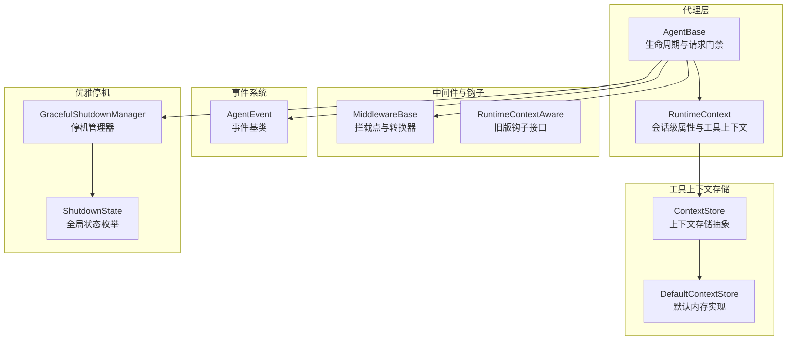
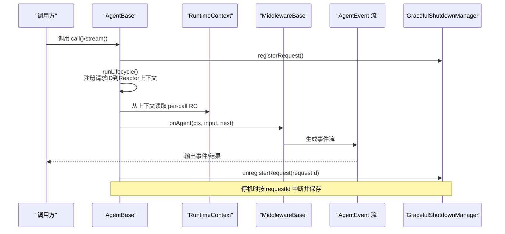
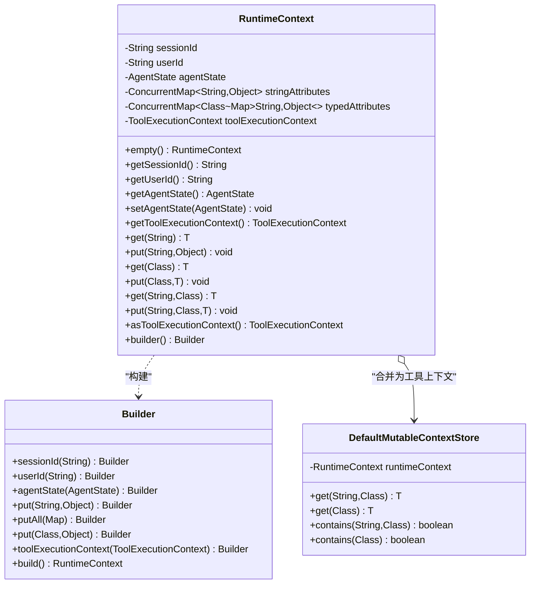
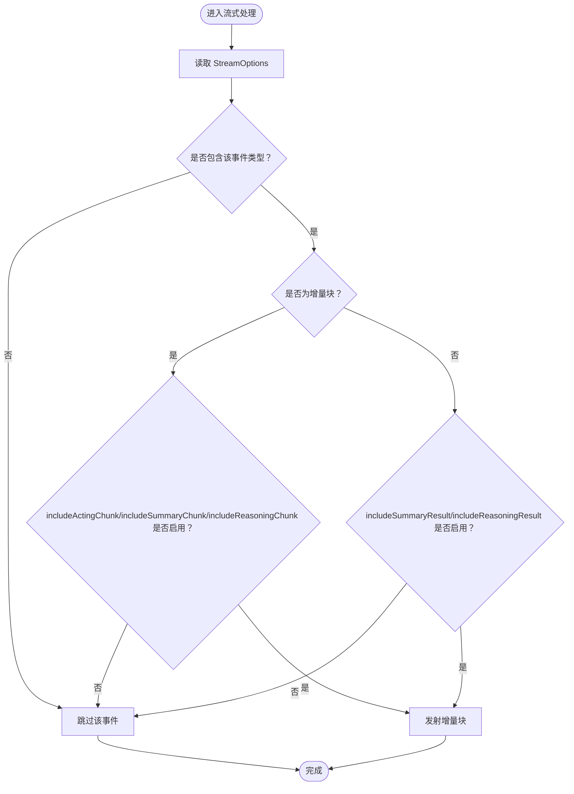
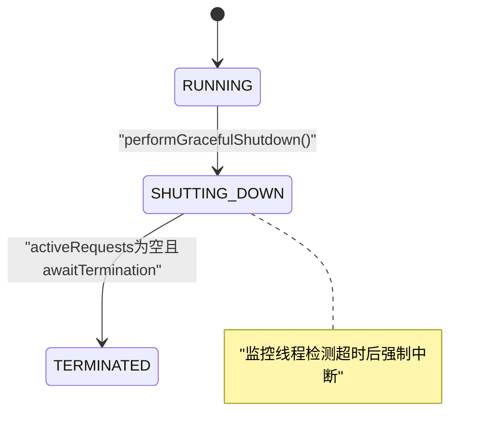
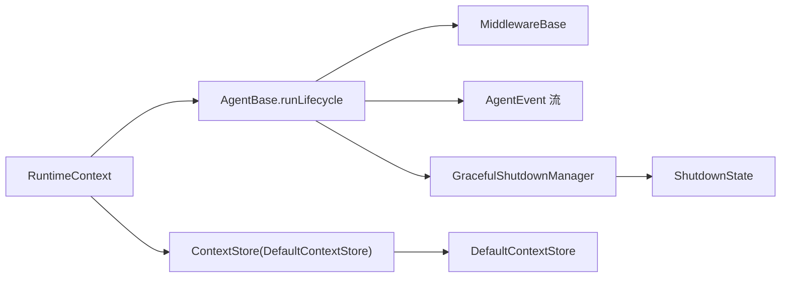

# 运行时上下文

<cite>
**本文引用的文件**   
- [RuntimeContext.java](file://agentscope-core/src/main/java/io/agentscope/core/agent/RuntimeContext.java)
- [StreamOptions.java](file://agentscope-core/src/main/java/io/agentscope/core/agent/StreamOptions.java)
- [ShutdownState.java](file://agentscope-core/src/main/java/io/agentscope/core/shutdown/ShutdownState.java)
- [GracefulShutdownManager.java](file://agentscope-core/src/main/java/io/agentscope/core/shutdown/GracefulShutdownManager.java)
- [ContextStore.java](file://agentscope-core/src/main/java/io/agentscope/core/tool/ContextStore.java)
- [DefaultContextStore.java](file://agentscope-core/src/main/java/io/agentscope/core/tool/DefaultContextStore.java)
- [AgentBase.java](file://agentscope-core/src/main/java/io/agentscope/core/agent/AgentBase.java)
- [RuntimeContextAware.java](file://agentscope-core/src/main/java/io/agentscope/core/hook/RuntimeContextAware.java)
- [MiddlewareBase.java](file://agentscope-core/src/main/java/io/agentscope/core/middleware/MiddlewareBase.java)
- [AgentEvent.java](file://agentscope-core/src/main/java/io/agentscope/core/event/AgentEvent.java)
</cite>

## 目录
1. [简介](#简介)
2. [项目结构](#项目结构)
3. [核心组件](#核心组件)
4. [架构总览](#架构总览)
5. [组件详解](#组件详解)
6. [依赖关系分析](#依赖关系分析)
7. [性能考量](#性能考量)
8. [故障排查指南](#故障排查指南)
9. [结论](#结论)
10. [附录：配置与使用指南](#附录配置与使用指南)

## 简介
本文件围绕运行时上下文系统进行深入技术说明，涵盖以下主题：
- RuntimeContext 的设计目的、创建、传递与生命周期管理
- 流式处理选项 StreamOptions 的配置与对代理输出行为的影响
- 优雅停机机制的实现原理（ShutdownState 的状态管理与资源清理流程）
- 运行时上下文在工具调用、中间件处理与事件系统中的作用
- 配置指南与性能优化建议
- 具体代码示例路径（以源码片段路径代替直接代码）

## 项目结构
运行时上下文系统主要位于 agentscope-core 模块中，涉及代理执行、中间件、事件与优雅停机等子系统。

图示来源
- [AgentBase.java:252-297](file://agentscope-core/src/main/java/io/agentscope/core/agent/AgentBase.java#L252-L297)
- [RuntimeContext.java:33-386](file://agentscope-core/src/main/java/io/agentscope/core/agent/RuntimeContext.java#L33-L386)
- [MiddlewareBase.java:59-144](file://agentscope-core/src/main/java/io/agentscope/core/middleware/MiddlewareBase.java#L59-L144)
- [RuntimeContextAware.java:33-42](file://agentscope-core/src/main/java/io/agentscope/core/hook/RuntimeContextAware.java#L33-L42)
- [ContextStore.java:54-119](file://agentscope-core/src/main/java/io/agentscope/core/tool/ContextStore.java#L54-L119)
- [DefaultContextStore.java:33-290](file://agentscope-core/src/main/java/io/agentscope/core/tool/DefaultContextStore.java#L33-L290)
- [AgentEvent.java:72-139](file://agentscope-core/src/main/java/io/agentscope/core/event/AgentEvent.java#L72-L139)
- [ShutdownState.java:21-25](file://agentscope-core/src/main/java/io/agentscope/core/shutdown/ShutdownState.java#L21-L25)
- [GracefulShutdownManager.java:40-333](file://agentscope-core/src/main/java/io/agentscope/core/shutdown/GracefulShutdownManager.java#L40-L333)

章节来源
- [AgentBase.java:1-800](file://agentscope-core/src/main/java/io/agentscope/core/agent/AgentBase.java#L1-L800)
- [RuntimeContext.java:1-386](file://agentscope-core/src/main/java/io/agentscope/core/agent/RuntimeContext.java#L1-L386)
- [StreamOptions.java:1-371](file://agentscope-core/src/main/java/io/agentscope/core/agent/StreamOptions.java#L1-L371)
- [ShutdownState.java:1-26](file://agentscope-core/src/main/java/io/agentscope/core/shutdown/ShutdownState.java#L1-L26)
- [GracefulShutdownManager.java:1-333](file://agentscope-core/src/main/java/io/agentscope/core/shutdown/GracefulShutdownManager.java#L1-L333)
- [ContextStore.java:1-119](file://agentscope-core/src/main/java/io/agentscope/core/tool/ContextStore.java#L1-L119)
- [DefaultContextStore.java:1-290](file://agentscope-core/src/main/java/io/agentscope/core/tool/DefaultContextStore.java#L1-L290)
- [RuntimeContextAware.java:1-43](file://agentscope-core/src/main/java/io/agentscope/core/hook/RuntimeContextAware.java#L1-L43)
- [MiddlewareBase.java:1-144](file://agentscope-core/src/main/java/io/agentscope/core/middleware/MiddlewareBase.java#L1-L144)
- [AgentEvent.java:1-139](file://agentscope-core/src/main/java/io/agentscope/core/event/AgentEvent.java#L1-L139)

## 核心组件
- 运行时上下文 RuntimeContext：为一次调用提供会话级元数据、线程安全的属性容器与可选的工具执行上下文桥接。
- 流式选项 StreamOptions：控制事件类型过滤与增量/累积输出模式，以及推理/总结等子事件的包含策略。
- 优雅停机管理 GracefulShutdownManager：跟踪活跃请求、推进全局状态、触发中断与保存、等待终止。
- 中间件 MiddlewareBase：在代理生命周期关键点拦截或转换输入/输出，天然持有 RuntimeContext。
- 事件系统 AgentEvent：统一的事件模型，配合流式选项决定输出粒度与内容。

章节来源
- [RuntimeContext.java:33-127](file://agentscope-core/src/main/java/io/agentscope/core/agent/RuntimeContext.java#L33-L127)
- [StreamOptions.java:62-251](file://agentscope-core/src/main/java/io/agentscope/core/agent/StreamOptions.java#L62-L251)
- [GracefulShutdownManager.java:40-116](file://agentscope-core/src/main/java/io/agentscope/core/shutdown/GracefulShutdownManager.java#L40-L116)
- [MiddlewareBase.java:59-144](file://agentscope-core/src/main/java/io/agentscope/core/middleware/MiddlewareBase.java#L59-L144)
- [AgentEvent.java:72-139](file://agentscope-core/src/main/java/io/agentscope/core/event/AgentEvent.java#L72-L139)

## 架构总览
运行时上下文贯穿代理调用链路，作为“每调用”作用域对象在生命周期内通过 Reactor 上下文传递，同时被中间件与事件系统共享。优雅停机通过全局管理器按请求维度进行中断与保存，并维护状态机。

图示来源
- [AgentBase.java:252-297](file://agentscope-core/src/main/java/io/agentscope/core/agent/AgentBase.java#L252-L297)
- [GracefulShutdownManager.java:153-184](file://agentscope-core/src/main/java/io/agentscope/core/shutdown/GracefulShutdownManager.java#L153-L184)

## 组件详解

### 运行时上下文 RuntimeContext
- 设计目的
  - 为单次调用提供会话级字段（sessionId、userId）、并发安全的键值属性容器（字符串键与类型化键），以及与工具执行上下文的桥接能力。
  - 在并发场景下，避免共享实例字段导致的状态竞争，确保中间件与工具读取到正确的会话状态。
- 创建与传递
  - 通过 Builder 构建；在 AgentBase 生命周期中通过 Reactor 上下文键传递，保证每订阅隔离。
  - 提供浅拷贝视图与合并为工具执行上下文的能力，便于工具栈访问。
- 生命周期管理
  - 由 AgentBase 在每次调用开始时解析并绑定到 Reactor 上下文；调用结束时释放。
  - 支持在调用入口设置 call-scoped AgentState，供中间件/工具在并发下正确读取。
- 关键方法与职责
  - 字符串键与类型化键存取：get/put(String)、get/put(Class)、get/put(String, Class)
  - 会话状态解析：resolveAgentState、get/setAgentState
  - 工具上下文桥接：asToolExecutionContext
  - 内部默认可变存储：DefaultMutableContextStore 实现类型化与字符串键的优先级合并

图示来源
- [RuntimeContext.java:33-386](file://agentscope-core/src/main/java/io/agentscope/core/agent/RuntimeContext.java#L33-L386)

章节来源
- [RuntimeContext.java:33-127](file://agentscope-core/src/main/java/io/agentscope/core/agent/RuntimeContext.java#L33-L127)
- [RuntimeContext.java:253-264](file://agentscope-core/src/main/java/io/agentscope/core/agent/RuntimeContext.java#L253-L264)
- [RuntimeContext.java:270-331](file://agentscope-core/src/main/java/io/agentscope/core/agent/RuntimeContext.java#L270-L331)
- [RuntimeContext.java:337-384](file://agentscope-core/src/main/java/io/agentscope/core/agent/RuntimeContext.java#L337-L384)

### 流式处理选项 StreamOptions
- 功能概述
  - 控制事件类型集合、是否增量输出、以及推理/总结等子事件的包含策略（增量块与最终结果）。
  - 提供便捷的 shouldStream 与 shouldIncludeXxxEmission 判定，供流实现层过滤与选择性发射。
- 配置要点
  - 事件类型：支持 EventType.ALL 或指定集合
  - 增量模式：isIncremental 控制每次仅返回新增内容或累计内容
  - 推理/总结子事件：分别控制增量块与最终结果的包含
- 使用建议
  - 默认保留现有行为（包含推理块与结果），如需精简输出可关闭相应开关
  - 多事件类型组合时，注意与 shouldStream 的交互

图示来源
- [StreamOptions.java:147-251](file://agentscope-core/src/main/java/io/agentscope/core/agent/StreamOptions.java#L147-L251)

章节来源
- [StreamOptions.java:62-129](file://agentscope-core/src/main/java/io/agentscope/core/agent/StreamOptions.java#L62-L129)
- [StreamOptions.java:147-251](file://agentscope-core/src/main/java/io/agentscope/core/agent/StreamOptions.java#L147-L251)
- [StreamOptions.java:254-369](file://agentscope-core/src/main/java/io/agentscope/core/agent/StreamOptions.java#L254-L369)

### 优雅停机机制 GracefulShutdownManager 与 ShutdownState
- 全局状态 ShutdownState
  - RUNNING → SHUTTING_DOWN → TERMINATED 三态流转
- 管理器职责
  - 注册/注销活跃请求（按 requestId，非按 agentId），以便针对具体调用中断与保存
  - 启动监控线程周期检查超时并强制中断
  - 提供 Mono 信号用于工具执行竞速提前退出
  - 绑定状态保存器，停机时持久化 AgentState（标记 shutdownInterrupted）
- 关键流程
  - registerRequest → 执行 → unregisterRequest
  - performGracefulShutdown → 启动监控 → 超时强制中断 → 等待所有请求结束 → TERMINATED

图示来源
- [GracefulShutdownManager.java:211-226](file://agentscope-core/src/main/java/io/agentscope/core/shutdown/GracefulShutdownManager.java#L211-L226)
- [GracefulShutdownManager.java:245-278](file://agentscope-core/src/main/java/io/agentscope/core/shutdown/GracefulShutdownManager.java#L245-L278)
- [GracefulShutdownManager.java:280-288](file://agentscope-core/src/main/java/io/agentscope/core/shutdown/GracefulShutdownManager.java#L280-L288)
- [ShutdownState.java:21-25](file://agentscope-core/src/main/java/io/agentscope/core/shutdown/ShutdownState.java#L21-L25)

章节来源
- [GracefulShutdownManager.java:40-116](file://agentscope-core/src/main/java/io/agentscope/core/shutdown/GracefulShutdownManager.java#L40-L116)
- [GracefulShutdownManager.java:153-184](file://agentscope-core/src/main/java/io/agentscope/core/shutdown/GracefulShutdownManager.java#L153-L184)
- [GracefulShutdownManager.java:211-226](file://agentscope-core/src/main/java/io/agentscope/core/shutdown/GracefulShutdownManager.java#L211-L226)
- [GracefulShutdownManager.java:245-278](file://agentscope-core/src/main/java/io/agentscope/core/shutdown/GracefulShutdownManager.java#L245-L278)
- [GracefulShutdownManager.java:296-315](file://agentscope-core/src/main/java/io/agentscope/core/shutdown/GracefulShutdownManager.java#L296-L315)
- [ShutdownState.java:21-25](file://agentscope-core/src/main/java/io/agentscope/core/shutdown/ShutdownState.java#L21-L25)

### 工具上下文存储 ContextStore 与 DefaultContextStore
- 设计目标
  - 抽象工具执行上下文存储，支持按类型与按键（多实例）两种检索模式
  - 为 RuntimeContext 的 asToolExecutionContext 提供合并视图
- 迁移与替代
  - ContextStore 与 DefaultContextStore 已标注为过时，推荐使用 RuntimeContext
- 使用方式
  - RuntimeContext 内部通过 DefaultMutableContextStore 将自身暴露为 ContextStore，优先于嵌套的 ToolExecutionContext.store

章节来源
- [ContextStore.java:18-119](file://agentscope-core/src/main/java/io/agentscope/core/tool/ContextStore.java#L18-L119)
- [DefaultContextStore.java:24-119](file://agentscope-core/src/main/java/io/agentscope/core/tool/DefaultContextStore.java#L24-L119)
- [RuntimeContext.java:253-264](file://agentscope-core/src/main/java/io/agentscope/core/agent/RuntimeContext.java#L253-L264)
- [RuntimeContext.java:337-384](file://agentscope-core/src/main/java/io/agentscope/core/agent/RuntimeContext.java#L337-L384)

### 中间件与钩子 RuntimeContext 的集成
- 中间件 MiddlewareBase
  - 在 onAgent/onReasoning/onActing/onModelCall 等拦截点接收 RuntimeContext，便于基于会话/用户/自定义属性定制行为
  - onSystemPrompt 作为转换器管道，可读取 RuntimeContext 生成动态系统提示
- 旧版钩子 RuntimeContextAware
  - 通过 AgentBase 在调用期间向实现了该接口的 Hook 注入/清除 RuntimeContext 引用
  - 已标记为过时，建议迁移到 MiddlewareBase

章节来源
- [MiddlewareBase.java:59-144](file://agentscope-core/src/main/java/io/agentscope/core/middleware/MiddlewareBase.java#L59-L144)
- [RuntimeContextAware.java:33-42](file://agentscope-core/src/main/java/io/agentscope/core/hook/RuntimeContextAware.java#L33-L42)
- [AgentBase.java:602-615](file://agentscope-core/src/main/java/io/agentscope/core/agent/AgentBase.java#L602-L615)

### 事件系统与流式输出
- 事件模型
  - AgentEvent 定义统一事件基类与类型分发，覆盖文本/思考/数据/工具调用/结果等细粒度事件
- 与流式选项的关系
  - StreamOptions 决定哪些事件类型应被发射，以及增量/累积模式
  - 中间件与工具可在事件生成阶段依据 RuntimeContext 与 StreamOptions 进行条件过滤

章节来源
- [AgentEvent.java:72-139](file://agentscope-core/src/main/java/io/agentscope/core/event/AgentEvent.java#L72-L139)
- [StreamOptions.java:147-251](file://agentscope-core/src/main/java/io/agentscope/core/agent/StreamOptions.java#L147-L251)

## 依赖关系分析
- 运行时上下文与代理生命周期
  - AgentBase 在 runLifecycle 中从 Reactor 上下文读取 RuntimeContext，并将其与 per-call scope 一起传递给中间件与事件系统
- 中间件与工具的协作
  - 中间件在拦截点获取 RuntimeContext，结合 StreamOptions 控制事件流
  - 工具通过 asToolExecutionContext 访问 RuntimeContext 与嵌套 ContextStore
- 优雅停机与请求跟踪
  - GracefulShutdownManager 以 requestId 为键跟踪每个调用，确保并发调用独立中断与保存

图示来源
- [AgentBase.java:252-297](file://agentscope-core/src/main/java/io/agentscope/core/agent/AgentBase.java#L252-L297)
- [RuntimeContext.java:253-264](file://agentscope-core/src/main/java/io/agentscope/core/agent/RuntimeContext.java#L253-L264)
- [GracefulShutdownManager.java:153-184](file://agentscope-core/src/main/java/io/agentscope/core/shutdown/GracefulShutdownManager.java#L153-L184)
- [ShutdownState.java:21-25](file://agentscope-core/src/main/java/io/agentscope/core/shutdown/ShutdownState.java#L21-L25)

章节来源
- [AgentBase.java:252-297](file://agentscope-core/src/main/java/io/agentscope/core/agent/AgentBase.java#L252-L297)
- [RuntimeContext.java:253-264](file://agentscope-core/src/main/java/io/agentscope/core/agent/RuntimeContext.java#L253-L264)
- [GracefulShutdownManager.java:153-184](file://agentscope-core/src/main/java/io/agentscope/core/shutdown/GracefulShutdownManager.java#L153-L184)
- [ShutdownState.java:21-25](file://agentscope-core/src/main/java/io/agentscope/core/shutdown/ShutdownState.java#L21-L25)

## 性能考量
- 并发安全
  - RuntimeContext 使用并发映射存放属性，避免锁争用；建议避免在属性中放置大对象，减少序列化/复制成本
- 请求门禁与序列化
  - AgentBase 在 acquireExecution 时检查全局状态，防止停机期间继续接受新请求；对同一会话的调用采用序列化门禁，避免状态竞争
- 流式输出
  - 合理设置 StreamOptions 的增量模式与事件类型集合，减少不必要的事件发射与下游处理开销
- 优雅停机
  - 合理配置 GracefulShutdownConfig 的超时时间，避免过长阻塞导致资源占用，过短导致未完成任务丢失

## 故障排查指南
- 调用被拒绝
  - 现象：抛出“正在停机”的异常
  - 排查：确认全局状态是否为 RUNNING；检查 GracefulShutdownManager.ensureAcceptingRequests 的调用时机
  - 参考
    - [AgentBase.java:477-480](file://agentscope-core/src/main/java/io/agentscope/core/agent/AgentBase.java#L477-L480)
    - [GracefulShutdownManager.java:147-151](file://agentscope-core/src/main/java/io/agentscope/core/shutdown/GracefulShutdownManager.java#L147-L151)
- 请求未正确中断或保存
  - 现象：停机后仍有活跃请求未释放
  - 排查：确认 registerRequest 与 unregisterRequest 是否成对出现；检查 requestId 是否正确传递至 Reactor 上下文
  - 参考
    - [AgentBase.java:266-293](file://agentscope-core/src/main/java/io/agentscope/core/agent/AgentBase.java#L266-L293)
    - [GracefulShutdownManager.java:153-184](file://agentscope-core/src/main/java/io/agentscope/core/shutdown/GracefulShutdownManager.java#L153-L184)
- 中断竞速失败
  - 现象：工具执行未及时响应停机信号
  - 排查：使用 getShutdownTimeoutSignal 的 Mono 与工具执行逻辑竞速，确保在超时前尽早退出
  - 参考
    - [GracefulShutdownManager.java:101-103](file://agentscope-core/src/main/java/io/agentscope/core/shutdown/GracefulShutdownManager.java#L101-L103)
    - [GracefulShutdownManager.java:266-275](file://agentscope-core/src/main/java/io/agentscope/core/shutdown/GracefulShutdownManager.java#L266-L275)
- 事件过多或过少
  - 现象：输出过于冗余或缺失关键信息
  - 排查：调整 StreamOptions 的事件类型集合与增量模式；必要时在中间件中根据 RuntimeContext 进行过滤
  - 参考
    - [StreamOptions.java:147-251](file://agentscope-core/src/main/java/io/agentscope/core/agent/StreamOptions.java#L147-L251)
    - [MiddlewareBase.java:69-127](file://agentscope-core/src/main/java/io/agentscope/core/middleware/MiddlewareBase.java#L69-L127)

章节来源
- [AgentBase.java:477-480](file://agentscope-core/src/main/java/io/agentscope/core/agent/AgentBase.java#L477-L480)
- [GracefulShutdownManager.java:147-151](file://agentscope-core/src/main/java/io/agentscope/core/shutdown/GracefulShutdownManager.java#L147-L151)
- [GracefulShutdownManager.java:153-184](file://agentscope-core/src/main/java/io/agentscope/core/shutdown/GracefulShutdownManager.java#L153-L184)
- [GracefulShutdownManager.java:266-275](file://agentscope-core/src/main/java/io/agentscope/core/shutdown/GracefulShutdownManager.java#L266-L275)
- [StreamOptions.java:147-251](file://agentscope-core/src/main/java/io/agentscope/core/agent/StreamOptions.java#L147-L251)
- [MiddlewareBase.java:69-127](file://agentscope-core/src/main/java/io/agentscope/core/middleware/MiddlewareBase.java#L69-L127)

## 结论
运行时上下文系统通过“每调用”作用域的 RuntimeContext，将会话信息、属性与工具上下文统一管理，并在中间件与事件系统中得到一致使用。结合 StreamOptions 的精细控制与 GracefulShutdownManager 的全局停机治理，系统在并发、可观测与可运维方面具备良好平衡。建议在实际工程中：
- 优先使用 RuntimeContext 替代过时的 ContextStore
- 在中间件中充分利用 RuntimeContext 与 StreamOptions 进行行为定制
- 正确配置优雅停机参数，保障服务稳定过渡

## 附录：配置与使用指南

### 如何正确创建与传递 RuntimeContext
- 创建
  - 使用 Builder 设置 sessionId、userId、初始属性与工具上下文
  - 示例路径
    - [RuntimeContext.java:266-331](file://agentscope-core/src/main/java/io/agentscope/core/agent/RuntimeContext.java#L266-L331)
- 传递
  - 在 AgentBase.callInternal 中通过 Reactor 上下文键传递
  - 示例路径
    - [AgentBase.java:210-216](file://agentscope-core/src/main/java/io/agentscope/core/agent/AgentBase.java#L210-L216)

章节来源
- [RuntimeContext.java:266-331](file://agentscope-core/src/main/java/io/agentscope/core/agent/RuntimeContext.java#L266-L331)
- [AgentBase.java:210-216](file://agentscope-core/src/main/java/io/agentscope/core/agent/AgentBase.java#L210-L216)

### 如何配置流式选项 StreamOptions
- 基本配置
  - 指定事件类型集合、增量模式、推理/总结子事件包含策略
- 示例路径
  - [StreamOptions.java:136-149](file://agentscope-core/src/main/java/io/agentscope/core/agent/StreamOptions.java#L136-L149)
  - [StreamOptions.java:254-369](file://agentscope-core/src/main/java/io/agentscope/core/agent/StreamOptions.java#L254-L369)

章节来源
- [StreamOptions.java:136-149](file://agentscope-core/src/main/java/io/agentscope/core/agent/StreamOptions.java#L136-L149)
- [StreamOptions.java:254-369](file://agentscope-core/src/main/java/io/agentscope/core/agent/StreamOptions.java#L254-L369)

### 如何在中间件中使用 RuntimeContext
- 在拦截点读取 RuntimeContext，结合 StreamOptions 进行过滤或转换
- 示例路径
  - [MiddlewareBase.java:69-127](file://agentscope-core/src/main/java/io/agentscope/core/middleware/MiddlewareBase.java#L69-L127)

章节来源
- [MiddlewareBase.java:69-127](file://agentscope-core/src/main/java/io/agentscope/core/middleware/MiddlewareBase.java#L69-L127)

### 如何参与优雅停机
- 注册/注销请求
  - 在调用入口注册，在完成/取消后注销
- 示例路径
  - [AgentBase.java:266-293](file://agentscope-core/src/main/java/io/agentscope/core/agent/AgentBase.java#L266-L293)
  - [GracefulShutdownManager.java:153-184](file://agentscope-core/src/main/java/io/agentscope/core/shutdown/GracefulShutdownManager.java#L153-L184)
- 等待终止
  - 使用 awaitTermination 等待所有请求结束
  - 示例路径
    - [GracefulShutdownManager.java:296-315](file://agentscope-core/src/main/java/io/agentscope/core/shutdown/GracefulShutdownManager.java#L296-L315)

章节来源
- [AgentBase.java:266-293](file://agentscope-core/src/main/java/io/agentscope/core/agent/AgentBase.java#L266-L293)
- [GracefulShutdownManager.java:153-184](file://agentscope-core/src/main/java/io/agentscope/core/shutdown/GracefulShutdownManager.java#L153-L184)
- [GracefulShutdownManager.java:296-315](file://agentscope-core/src/main/java/io/agentscope/core/shutdown/GracefulShutdownManager.java#L296-L315)