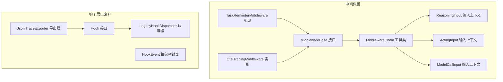
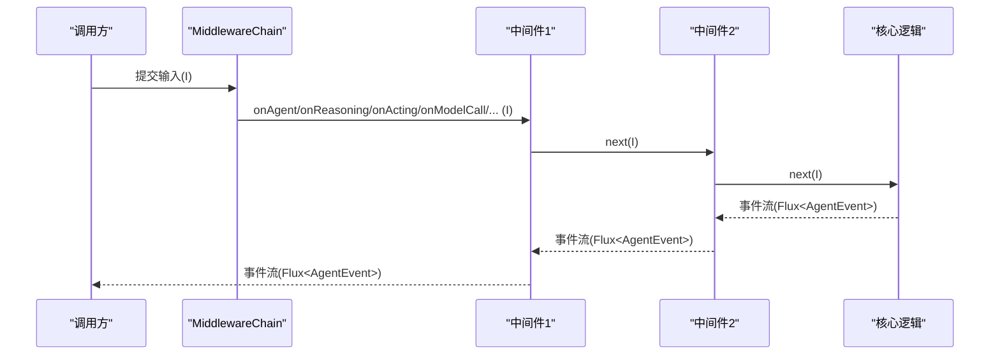
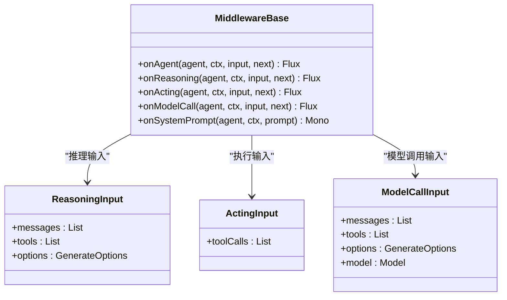
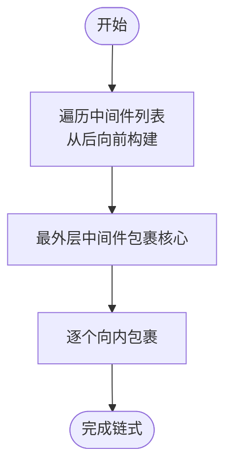
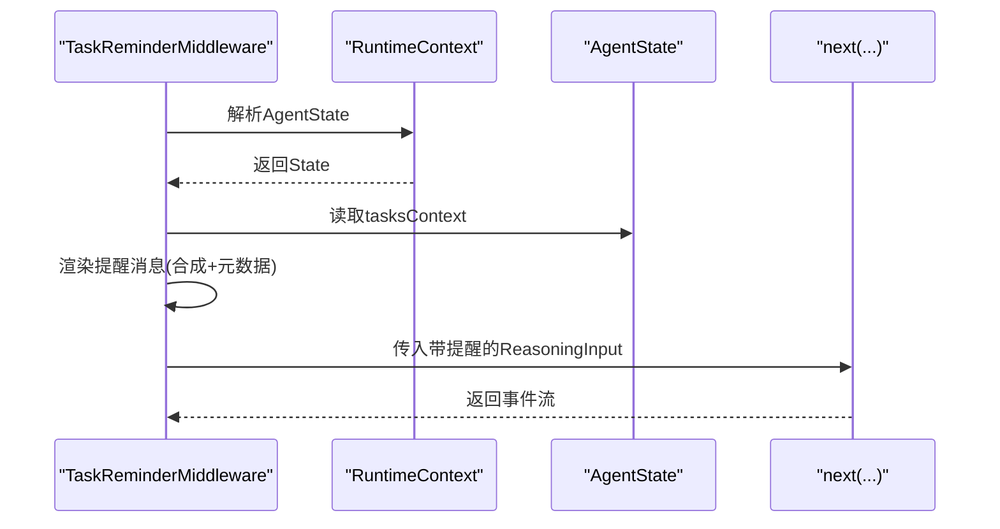
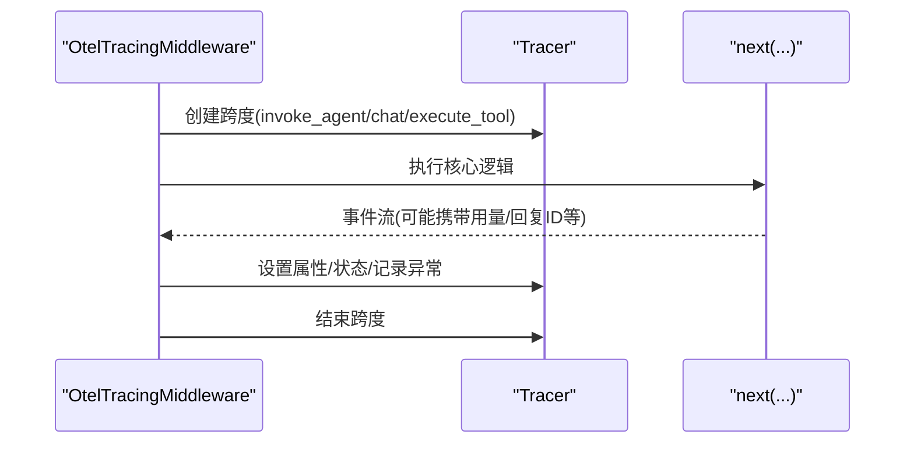
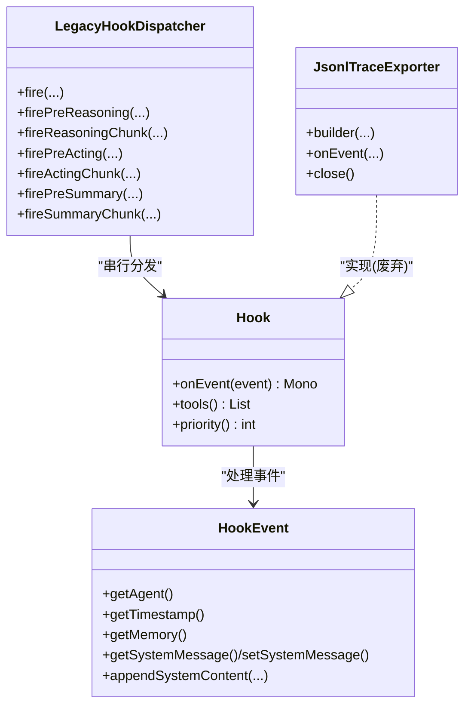
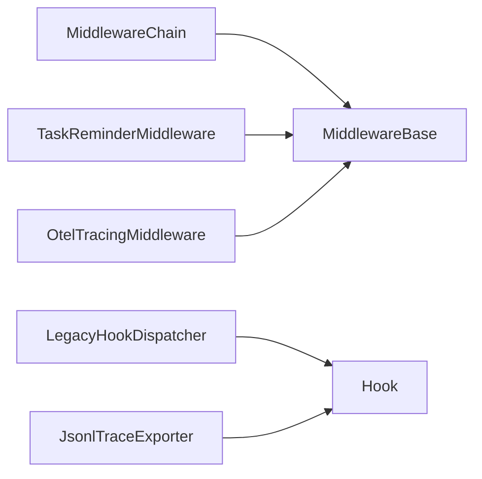

# 中间件与钩子

<cite>
**本文引用的文件**   
- [MiddlewareBase.java](file://agentscope-core/src/main/java/io/agentscope/core/middleware/MiddlewareBase.java)
- [MiddlewareChain.java](file://agentscope-core/src/main/java/io/agentscope/core/middleware/MiddlewareChain.java)
- [TaskReminderMiddleware.java](file://agentscope-core/src/main/java/io/agentscope/core/middleware/TaskReminderMiddleware.java)
- [OtelTracingMiddleware.java](file://agentscope-core/src/main/java/io/agentscope/core/tracing/OtelTracingMiddleware.java)
- [ReasoningInput.java](file://agentscope-core/src/main/java/io/agentscope/core/middleware/ReasoningInput.java)
- [ActingInput.java](file://agentscope-core/src/main/java/io/agentscope/core/middleware/ActingInput.java)
- [ModelCallInput.java](file://agentscope-core/src/main/java/io/agentscope/core/middleware/ModelCallInput.java)
- [Hook.java](file://agentscope-core/src/main/java/io/agentscope/core/hook/Hook.java)
- [HookEvent.java](file://agentscope-core/src/main/java/io/agentscope/core/hook/HookEvent.java)
- [LegacyHookDispatcher.java](file://agentscope-core/src/main/java/io/agentscope/core/hook/LegacyHookDispatcher.java)
- [JsonlTraceExporter.java](file://agentscope-core/src/main/java/io/agentscope/core/hook/recorder/JsonlTraceExporter.java)
</cite>

## 目录
1. [引言](#引言)
2. [项目结构](#项目结构)
3. [核心组件](#核心组件)
4. [架构总览](#架构总览)
5. [详细组件分析](#详细组件分析)
6. [依赖分析](#依赖分析)
7. [性能考虑](#性能考虑)
8. [故障排查指南](#故障排查指南)
9. [结论](#结论)
10. [附录：示例与最佳实践](#附录示例与最佳实践)

## 引言
本文件面向AgentScope Java的中间件与钩子系统，系统性阐述中间件基类MiddlewareBase的设计理念、MiddlewareChain的洋葱式链式调用机制；同时介绍钩子系统的生命周期扩展点与事件捕获能力、LegacyHookDispatcher的旧版调度机制，以及JsonlTraceExporter的追踪导出与调试支持。文档还提供可直接参考的代码片段路径，帮助读者快速创建自定义中间件、实现钩子处理器、配置拦截逻辑，并总结执行顺序、异常处理、性能影响与最佳实践。

## 项目结构
围绕中间件与钩子的关键源码位于agentscope-core模块的middleware与hook包中，配合tracing包中的OTel集成中间件，形成从事件流到可观测性的完整链路。

**图表来源**
- [MiddlewareBase.java:59-143](file://agentscope-core/src/main/java/io/agentscope/core/middleware/MiddlewareBase.java#L59-L143)
- [MiddlewareChain.java:31-78](file://agentscope-core/src/main/java/io/agentscope/core/middleware/MiddlewareChain.java#L31-L78)
- [TaskReminderMiddleware.java:54-128](file://agentscope-core/src/main/java/io/agentscope/core/middleware/TaskReminderMiddleware.java#L54-L128)
- [OtelTracingMiddleware.java:63-255](file://agentscope-core/src/main/java/io/agentscope/core/tracing/OtelTracingMiddleware.java#L63-L255)
- [ReasoningInput.java:23-30](file://agentscope-core/src/main/java/io/agentscope/core/middleware/ReasoningInput.java#L23-L30)
- [ActingInput.java:21-26](file://agentscope-core/src/main/java/io/agentscope/core/middleware/ActingInput.java#L21-L26)
- [ModelCallInput.java:24-33](file://agentscope-core/src/main/java/io/agentscope/core/middleware/ModelCallInput.java#L24-L33)
- [Hook.java:122-191](file://agentscope-core/src/main/java/io/agentscope/core/hook/Hook.java#L122-L191)
- [HookEvent.java:77-211](file://agentscope-core/src/main/java/io/agentscope/core/hook/HookEvent.java#L77-L211)
- [LegacyHookDispatcher.java:44-197](file://agentscope-core/src/main/java/io/agentscope/core/hook/LegacyHookDispatcher.java#L44-L197)
- [JsonlTraceExporter.java:87-548](file://agentscope-core/src/main/java/io/agentscope/core/hook/recorder/JsonlTraceExporter.java#L87-L548)

**章节来源**
- [MiddlewareBase.java:1-144](file://agentscope-core/src/main/java/io/agentscope/core/middleware/MiddlewareBase.java#L1-L144)
- [MiddlewareChain.java:1-79](file://agentscope-core/src/main/java/io/agentscope/core/middleware/MiddlewareChain.java#L1-L79)
- [Hook.java:1-192](file://agentscope-core/src/main/java/io/agentscope/core/hook/Hook.java#L1-L192)
- [HookEvent.java:1-212](file://agentscope-core/src/main/java/io/agentscope/core/hook/HookEvent.java#L1-L212)
- [LegacyHookDispatcher.java:1-198](file://agentscope-core/src/main/java/io/agentscope/core/hook/LegacyHookDispatcher.java#L1-L198)
- [JsonlTraceExporter.java:1-549](file://agentscope-core/src/main/java/io/agentscope/core/hook/recorder/JsonlTraceExporter.java#L1-L549)

## 核心组件
- 中间件接口MiddlewareBase：定义Agent生命周期的五个拦截点（onAgent/onReasoning/onActing/onModelCall/onSystemPrompt），默认行为透传给next，便于按需覆盖。
- 中间件链MiddlewareChain：以洋葱模式构建链式调用，从后向前组装，确保第一个中间件在外层，最后一个在内层。
- 典型中间件实现：
  - TaskReminderMiddleware：在系统提示与每次推理前注入任务提醒，保证模型始终看到最新任务上下文。
  - OtelTracingMiddleware：基于OpenTelemetry为Agent调用、模型调用、工具执行生成追踪跨度。
- 钩子系统（已废弃）：
  - Hook/HookEvent：统一事件模型，按优先级顺序执行，支持修改事件内容。
  - LegacyHookDispatcher：将新版本事件映射回旧版事件并分发给注册的Hook。
  - JsonlTraceExporter：将Hook事件序列化为JSONL，用于本地调试与问题定位。

**章节来源**
- [MiddlewareBase.java:25-143](file://agentscope-core/src/main/java/io/agentscope/core/middleware/MiddlewareBase.java#L25-L143)
- [MiddlewareChain.java:25-78](file://agentscope-core/src/main/java/io/agentscope/core/middleware/MiddlewareChain.java#L25-L78)
- [TaskReminderMiddleware.java:33-128](file://agentscope-core/src/main/java/io/agentscope/core/middleware/TaskReminderMiddleware.java#L33-L128)
- [OtelTracingMiddleware.java:40-255](file://agentscope-core/src/main/java/io/agentscope/core/tracing/OtelTracingMiddleware.java#L40-L255)
- [Hook.java:25-191](file://agentscope-core/src/main/java/io/agentscope/core/hook/Hook.java#L25-L191)
- [HookEvent.java:30-211](file://agentscope-core/src/main/java/io/agentscope/core/hook/HookEvent.java#L30-L211)
- [LegacyHookDispatcher.java:33-197](file://agentscope-core/src/main/java/io/agentscope/core/hook/LegacyHookDispatcher.java#L33-L197)
- [JsonlTraceExporter.java:67-548](file://agentscope-core/src/main/java/io/agentscope/core/hook/recorder/JsonlTraceExporter.java#L67-L548)

## 架构总览
下图展示了中间件与事件流的交互关系，以及OTel中间件如何在关键节点插入追踪：

**图表来源**
- [MiddlewareChain.java:46-62](file://agentscope-core/src/main/java/io/agentscope/core/middleware/MiddlewareChain.java#L46-L62)
- [MiddlewareBase.java:70-142](file://agentscope-core/src/main/java/io/agentscope/core/middleware/MiddlewareBase.java#L70-L142)

## 详细组件分析

### 中间件基类MiddlewareBase
- 设计要点
  - 五处拦截点：onAgent、onReasoning、onActing、onModelCall、onSystemPrompt。
  - 默认透传：每个方法默认将控制权交给next，避免强制实现全部方法。
  - 输入上下文：ReasoningInput、ActingInput、ModelCallInput分别承载推理、执行与模型调用阶段的输入。
- 使用建议
  - 按需覆盖：仅重写关心的拦截点，保持最小改动。
  - 事件流：onAgent/onReasoning/onActing/onModelCall返回Flux<AgentEvent>，便于接入响应式处理。
  - 系统提示：onSystemPrompt采用管道式串联，适合多中间件依次变换系统提示。

**图表来源**
- [MiddlewareBase.java:59-143](file://agentscope-core/src/main/java/io/agentscope/core/middleware/MiddlewareBase.java#L59-L143)
- [ReasoningInput.java:23-30](file://agentscope-core/src/main/java/io/agentscope/core/middleware/ReasoningInput.java#L23-L30)
- [ActingInput.java:21-26](file://agentscope-core/src/main/java/io/agentscope/core/middleware/ActingInput.java#L21-L26)
- [ModelCallInput.java:24-33](file://agentscope-core/src/main/java/io/agentscope/core/middleware/ModelCallInput.java#L24-L33)

**章节来源**
- [MiddlewareBase.java:25-143](file://agentscope-core/src/main/java/io/agentscope/core/middleware/MiddlewareBase.java#L25-L143)
- [ReasoningInput.java:1-31](file://agentscope-core/src/main/java/io/agentscope/core/middleware/ReasoningInput.java#L1-L31)
- [ActingInput.java:1-27](file://agentscope-core/src/main/java/io/agentscope/core/middleware/ActingInput.java#L1-L27)
- [ModelCallInput.java:1-34](file://agentscope-core/src/main/java/io/agentscope/core/middleware/ModelCallInput.java#L1-L34)

### 中间件链MiddlewareChain与洋葱式调用
- 构建策略
  - 从列表末尾开始向前包裹，第一个元素成为最外层，最后一个元素靠近核心。
  - 通过函数式接口MiddlewareMethod将具体拦截点方法桥接至链上。
- 执行顺序
  - 外层中间件先于内层执行，且在next.apply前后均可插入前置/后置逻辑。
- 性能注意
  - 链式调用为轻量函数组合，开销主要来自每个中间件内部的事件处理与副作用。

**图表来源**
- [MiddlewareChain.java:46-62](file://agentscope-core/src/main/java/io/agentscope/core/middleware/MiddlewareChain.java#L46-L62)

**章节来源**
- [MiddlewareChain.java:25-78](file://agentscope-core/src/main/java/io/agentscope/core/middleware/MiddlewareChain.java#L25-L78)

### 典型中间件实现

#### 任务提醒中间件TaskReminderMiddleware
- 功能概述
  - 在系统提示中注入一次性“使用说明”；
  - 在每次推理前注入当前任务清单作为“系统提醒”，并标记为合成数据，不持久化。
- 关键点
  - onSystemPrompt：拼接静态说明；
  - onReasoning：读取运行时状态，构造提醒消息并追加到推理输入。

**图表来源**
- [TaskReminderMiddleware.java:67-100](file://agentscope-core/src/main/java/io/agentscope/core/middleware/TaskReminderMiddleware.java#L67-L100)

**章节来源**
- [TaskReminderMiddleware.java:33-128](file://agentscope-core/src/main/java/io/agentscope/core/middleware/TaskReminderMiddleware.java#L33-L128)

#### OpenTelemetry追踪中间件OtelTracingMiddleware
- 覆盖点
  - onAgent：为整个Agent调用创建“invoke_agent”跨度；
  - onModelCall：为模型调用创建“chat”跨度；
  - onActing：为工具执行创建“execute_tool”跨度。
- 特性
  - 无OTel SDK时自动短路，近零开销；
  - 自动设置gen_ai与agentscope相关属性；
  - 正常完成与错误均正确结束跨度。

**图表来源**
- [OtelTracingMiddleware.java:78-236](file://agentscope-core/src/main/java/io/agentscope/core/tracing/OtelTracingMiddleware.java#L78-L236)

**章节来源**
- [OtelTracingMiddleware.java:40-255](file://agentscope-core/src/main/java/io/agentscope/core/tracing/OtelTracingMiddleware.java#L40-L255)

### 钩子系统（已废弃）与LegacyHookDispatcher
- 钩子接口Hook
  - 统一事件入口onEvent，按优先级执行；
  - 支持tools()与priority()定制工具与执行顺序。
- 事件模型HookEvent
  - 封印类体系，支持系统消息的统一管理与安全注入；
  - 提供appendSystemContent等安全写入API。
- LegacyHookDispatcher
  - 将新事件映射为旧版事件并串行分发给已注册Hook；
  - 保留对Reasoning/Acting/Summary与Chunk事件的支持。
- JsonlTraceExporter
  - 基于Hook事件输出JSONL，支持过滤、失败策略、OTel ID采集；
  - 单线程队列保证顺序一致性。

**图表来源**
- [Hook.java:122-191](file://agentscope-core/src/main/java/io/agentscope/core/hook/Hook.java#L122-L191)
- [HookEvent.java:77-211](file://agentscope-core/src/main/java/io/agentscope/core/hook/HookEvent.java#L77-L211)
- [LegacyHookDispatcher.java:44-197](file://agentscope-core/src/main/java/io/agentscope/core/hook/LegacyHookDispatcher.java#L44-L197)
- [JsonlTraceExporter.java:87-548](file://agentscope-core/src/main/java/io/agentscope/core/hook/recorder/JsonlTraceExporter.java#L87-L548)

**章节来源**
- [Hook.java:25-191](file://agentscope-core/src/main/java/io/agentscope/core/hook/Hook.java#L25-L191)
- [HookEvent.java:30-211](file://agentscope-core/src/main/java/io/agentscope/core/hook/HookEvent.java#L30-L211)
- [LegacyHookDispatcher.java:33-197](file://agentscope-core/src/main/java/io/agentscope/core/hook/LegacyHookDispatcher.java#L33-L197)
- [JsonlTraceExporter.java:67-548](file://agentscope-core/src/main/java/io/agentscope/core/hook/recorder/JsonlTraceExporter.java#L67-L548)

## 依赖分析
- 中间件层内部耦合低，通过接口与输入上下文解耦，便于扩展与替换。
- MiddlewareChain与MiddlewareBase之间为纯函数式组合，无循环依赖。
- OtelTracingMiddleware依赖全局Tracer，但通过OTel默认提供者实现零成本短路。
- 钩子系统（Hook/HookEvent/LegacyHookDispatcher/JsonlTraceExporter）均为独立组件，彼此通过事件模型关联。

**图表来源**
- [MiddlewareChain.java:46-62](file://agentscope-core/src/main/java/io/agentscope/core/middleware/MiddlewareChain.java#L46-L62)
- [MiddlewareBase.java:59-143](file://agentscope-core/src/main/java/io/agentscope/core/middleware/MiddlewareBase.java#L59-L143)
- [OtelTracingMiddleware.java:63-255](file://agentscope-core/src/main/java/io/agentscope/core/tracing/OtelTracingMiddleware.java#L63-L255)
- [LegacyHookDispatcher.java:44-197](file://agentscope-core/src/main/java/io/agentscope/core/hook/LegacyHookDispatcher.java#L44-L197)
- [JsonlTraceExporter.java:87-548](file://agentscope-core/src/main/java/io/agentscope/core/hook/recorder/JsonlTraceExporter.java#L87-L548)

**章节来源**
- [MiddlewareChain.java:25-78](file://agentscope-core/src/main/java/io/agentscope/core/middleware/MiddlewareChain.java#L25-L78)
- [OtelTracingMiddleware.java:40-255](file://agentscope-core/src/main/java/io/agentscope/core/tracing/OtelTracingMiddleware.java#L40-L255)
- [LegacyHookDispatcher.java:33-197](file://agentscope-core/src/main/java/io/agentscope/core/hook/LegacyHookDispatcher.java#L33-L197)
- [JsonlTraceExporter.java:67-548](file://agentscope-core/src/main/java/io/agentscope/core/hook/recorder/JsonlTraceExporter.java#L67-L548)

## 性能考虑
- 中间件链构建与调用为轻量函数组合，通常开销可忽略。
- 事件流处理（Flux/Mono）属于响应式编程范式，注意背压与背压策略选择。
- OTel中间件在无SDK时短路，避免额外开销；启用SDK时会引入少量追踪开销。
- 钩子系统（Hook）已废弃，其JSONL导出器单线程写入，适合调试场景，生产环境建议迁移至中间件+外部追踪方案。

[本节为通用指导，无需列出章节来源]

## 故障排查指南
- 中间件异常
  - 在中间件内部使用doOnError/ onErrorResume等操作符进行异常捕获与转换，避免中断事件流。
  - 对onAgent/onReasoning/onActing/onModelCall返回的Flux进行完整性校验，确保在完成与错误分支均正确结束。
- OTel追踪
  - 若未配置OTel SDK，默认Tracer为no-op，不会产生开销；若需要真实追踪，请正确初始化SDK。
  - 检查跨度属性是否正确设置（如gen_ai.usage、agentscope.agent.reply_id）。
- 钩子与JSONL导出
  - JSONL导出器默认“尽力而为”，IO或序列化错误不会中断执行；如需严格模式，可启用failFast。
  - 导出器关闭时有超时保护，确保待写入任务完成或被中断。

**章节来源**
- [OtelTracingMiddleware.java:115-123](file://agentscope-core/src/main/java/io/agentscope/core/tracing/OtelTracingMiddleware.java#L115-L123)
- [JsonlTraceExporter.java:142-153](file://agentscope-core/src/main/java/io/agentscope/core/hook/recorder/JsonlTraceExporter.java#L142-L153)
- [JsonlTraceExporter.java:303-336](file://agentscope-core/src/main/java/io/agentscope/core/hook/recorder/JsonlTraceExporter.java#L303-L336)

## 结论
中间件体系以清晰的拦截点与洋葱式链式调用为核心，既保证了灵活性又维持了低耦合；典型中间件如任务提醒与OTel追踪展示了实际落地场景。钩子系统虽已废弃但仍保留了丰富的事件模型与导出能力，适合作为历史参考与迁移对照。建议在新项目中优先采用中间件方案，并结合外部追踪与日志体系实现端到端可观测性。

[本节为总结性内容，无需列出章节来源]

## 附录：示例与最佳实践

### 如何创建自定义中间件
- 参考路径
  - [MiddlewareBase.java:70-142](file://agentscope-core/src/main/java/io/agentscope/core/middleware/MiddlewareBase.java#L70-L142)
  - [ReasoningInput.java:23-30](file://agentscope-core/src/main/java/io/agentscope/core/middleware/ReasoningInput.java#L23-L30)
  - [ActingInput.java:21-26](file://agentscope-core/src/main/java/io/agentscope/core/middleware/ActingInput.java#L21-L26)
  - [ModelCallInput.java:24-33](file://agentscope-core/src/main/java/io/agentscope/core/middleware/ModelCallInput.java#L24-L33)
- 最佳实践
  - 仅覆盖必要拦截点，保持默认透传以减少复杂度。
  - 在onAgent/onReasoning/onActing/onModelCall中谨慎处理事件流，避免阻塞。
  - onSystemPrompt采用串联式变换，确保顺序稳定。

**章节来源**
- [MiddlewareBase.java:25-143](file://agentscope-core/src/main/java/io/agentscope/core/middleware/MiddlewareBase.java#L25-L143)
- [ReasoningInput.java:1-31](file://agentscope-core/src/main/java/io/agentscope/core/middleware/ReasoningInput.java#L1-L31)
- [ActingInput.java:1-27](file://agentscope-core/src/main/java/io/agentscope/core/middleware/ActingInput.java#L1-L27)
- [ModelCallInput.java:1-34](file://agentscope-core/src/main/java/io/agentscope/core/middleware/ModelCallInput.java#L1-L34)

### 如何实现钩子处理器（已废弃）
- 参考路径
  - [Hook.java:42-112](file://agentscope-core/src/main/java/io/agentscope/core/hook/Hook.java#L42-L112)
  - [HookEvent.java:146-211](file://agentscope-core/src/main/java/io/agentscope/core/hook/HookEvent.java#L146-L211)
- 最佳实践
  - 使用priority控制执行顺序，越小优先级越高；
  - 仅在具备setter的事件上进行修改，避免破坏系统约束。

**章节来源**
- [Hook.java:25-191](file://agentscope-core/src/main/java/io/agentscope/core/hook/Hook.java#L25-L191)
- [HookEvent.java:30-211](file://agentscope-core/src/main/java/io/agentscope/core/hook/HookEvent.java#L30-L211)

### 如何配置拦截逻辑与链式调用
- 参考路径
  - [MiddlewareChain.java:46-62](file://agentscope-core/src/main/java/io/agentscope/core/middleware/MiddlewareChain.java#L46-L62)
- 最佳实践
  - 将最外层中间件置于列表首位，最内层置于末位；
  - 合理拆分中间件职责，避免单点过重。

**章节来源**
- [MiddlewareChain.java:25-78](file://agentscope-core/src/main/java/io/agentscope/core/middleware/MiddlewareChain.java#L25-L78)

### 追踪导出与调试技巧
- 参考路径
  - [JsonlTraceExporter.java:125-153](file://agentscope-core/src/main/java/io/agentscope/core/hook/recorder/JsonlTraceExporter.java#L125-L153)
  - [JsonlTraceExporter.java:441-547](file://agentscope-core/src/main/java/io/agentscope/core/hook/recorder/JsonlTraceExporter.java#L441-L547)
- 调试建议
  - 使用Builder启用includeReasoningChunks/includeActingChunks等选项，细化事件粒度；
  - 在开发环境开启failFast以便快速暴露问题；
  - 关闭时等待已完成写入，避免数据丢失。

**章节来源**
- [JsonlTraceExporter.java:67-548](file://agentscope-core/src/main/java/io/agentscope/core/hook/recorder/JsonlTraceExporter.java#L67-L548)